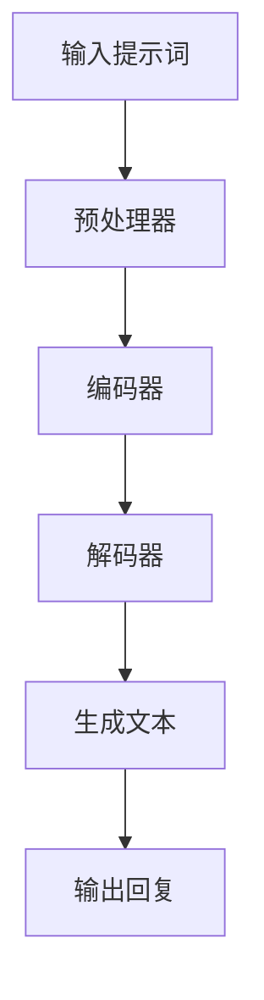

                 

### 《ChatGPT提示词的语言习得理论应用》

#### 关键词：ChatGPT、提示词、语言习得理论、应用

#### 摘要：
本文将探讨ChatGPT这一先进的人工智能系统与语言习得理论的结合。通过详细分析ChatGPT的背景、技术原理及其应用领域，结合语言习得理论的基本概念和应用，我们将深入探讨如何设计高效的ChatGPT提示词，并在教育和企业培训等领域进行实际应用案例分析。本文旨在揭示ChatGPT在语言习得中的潜力，并提供未来发展的思考与展望。

----------------------------------------------------------------

### 目录大纲

**《ChatGPT提示词的语言习得理论应用》**

----------------------------------------------------------------

## 第一部分：ChatGPT概述

### 第1章：ChatGPT及其相关概念

#### 1.1 ChatGPT的背景介绍

#### 1.2 ChatGPT的基本概念

#### 1.3 ChatGPT的技术原理

#### 1.4 ChatGPT的应用领域

## 第二部分：语言习得理论

### 第2章：语言习得理论概述

#### 2.1 语言习得理论的基本概念

#### 2.2 语言习得理论的分类

#### 2.3 语言习得理论的发展

#### 2.4 语言习得理论的应用

## 第三部分：ChatGPT与语言习得理论的结合

### 第3章：ChatGPT提示词的设计原则

#### 3.1 ChatGPT提示词的作用

#### 3.2 ChatGPT提示词的设计原则

#### 3.3 ChatGPT提示词的设计实践

### 第4章：ChatGPT在语言习得中的应用

#### 4.1 ChatGPT在语言教学中的应用

#### 4.2 ChatGPT在语言习得中的效果评估

#### 4.3 ChatGPT在语言习得中的案例分析

### 第5章：ChatGPT与语言习得理论的融合创新

#### 5.1 ChatGPT与语言习得理论的融合创新方向

#### 5.2 ChatGPT与语言习得理论融合的创新案例

#### 5.3 ChatGPT与语言习得理论的未来发展趋势

## 第四部分：ChatGPT提示词的语言习得理论应用案例分析

### 第6章：教育领域的ChatGPT提示词应用

#### 6.1 教育领域中的ChatGPT应用案例

#### 6.2 教育领域中的ChatGPT提示词设计

#### 6.3 教育领域中的ChatGPT应用效果分析

### 第7章：企业培训领域的ChatGPT提示词应用

#### 7.1 企业培训领域中的ChatGPT应用案例

#### 7.2 企业培训领域中的ChatGPT提示词设计

#### 7.3 企业培训领域中的ChatGPT应用效果分析

### 第8章：ChatGPT提示词的语言习得理论应用总结

#### 8.1 ChatGPT提示词的语言习得理论应用总结

#### 8.2 应用前景与挑战

#### 8.3 未来发展趋势与展望

----------------------------------------------------------------

### 第一部分：ChatGPT概述

#### 第1章：ChatGPT及其相关概念

**1.1 ChatGPT的背景介绍**

ChatGPT是由OpenAI开发的一种基于GPT-3模型的聊天机器人，它利用深度学习技术，通过大规模的文本数据进行训练，使其具备了理解人类语言的能力。ChatGPT的问世，标志着人工智能与自然语言处理技术的又一次重大突破。

**1.2 ChatGPT的基本概念**

ChatGPT是一个对话系统，它通过接收用户的输入，生成相应的回复，使得用户与系统之间的交互更加自然和流畅。ChatGPT的核心是GPT-3模型，该模型具有非常强大的文本生成能力，能够生成连贯、合理的文本。

**1.3 ChatGPT的技术原理**

ChatGPT基于GPT-3模型，这是一种生成式预训练变换器（Generative Pre-trained Transformer），具有非常高的计算能力和文本生成能力。GPT-3模型通过在大量文本数据上进行预训练，学会了语言的规律和结构，从而能够在给定一个起始提示后，生成连贯、合理的文本。

**1.4 ChatGPT的应用领域**

ChatGPT的应用领域非常广泛，包括但不限于以下几方面：

- **客服与客户支持**：ChatGPT能够提供24/7的全天候客户服务，帮助企业降低运营成本。
- **内容创作**：ChatGPT能够根据用户的提示生成文章、故事、诗歌等，为内容创作者提供灵感。
- **教育**：ChatGPT可以用于语言学习、编程教育等领域，为学生提供个性化的学习体验。
- **娱乐**：ChatGPT可以与用户进行有趣、互动的对话，为用户提供娱乐体验。

通过以上对ChatGPT的背景、基本概念和技术原理的介绍，我们可以对ChatGPT有一个初步的了解。接下来，我们将进一步探讨语言习得理论的基本概念和应用，以便为后续的结合分析打下基础。

#### **第2章：语言习得理论概述**

**2.1 语言习得理论的基本概念**

语言习得理论主要研究人类学习语言的过程和机制。它关注的是如何从无语言能力到获得语言能力的过程。语言习得理论的基本概念包括：

- **语言输入**：语言习得的第一步是接受语言输入，这可以是听、说、读、写等方式。
- **语言输出**：在接收语言输入的基础上，个体通过模仿、练习和反馈，生成语言输出。
- **语言环境**：语言习得的过程需要一定的语言环境，包括语言交流、语言输入和反馈等。
- **语言习得机制**：语言习得机制是指人类大脑在语言习得过程中使用的认知机制，如语言能力的发展、记忆、推理等。

**2.2 语言习得理论的分类**

语言习得理论主要分为以下几类：

- **先天论**：认为人类天生具有语言能力，语言习得是大脑天生的语言能力发挥作用的过程。
- **后天论**：强调环境在语言习得中的重要作用，认为个体通过模仿、练习和反馈学习语言。
- **互动论**：强调语言习得是语言输入、语言输出和语言环境三者之间相互作用的过程。
- **社会文化论**：认为语言习得是社会文化环境中的个体通过社会互动学习语言的过程。

**2.3 语言习得理论的发展**

语言习得理论的发展历程可以追溯到20世纪60年代，经历了以下几个阶段：

- **行为主义阶段**：行为主义认为语言习得是通过模仿和强化来实现的。
- **认知主义阶段**：认知主义强调语言习得是个体通过大脑的认知机制学习语言的过程。
- **社会文化主义阶段**：社会文化主义认为语言习得是语言个体在社会文化环境中通过社会互动学习的过程。

**2.4 语言习得理论的应用**

语言习得理论在多个领域得到了广泛应用，包括：

- **教育**：语言习得理论为教育者提供了理解语言学习过程和设计教学策略的依据。
- **心理学**：语言习得理论帮助心理学家研究人类语言习得的心理机制。
- **人工智能**：语言习得理论为人工智能系统设计提供了理论基础，特别是在自然语言处理和对话系统领域。

通过对语言习得理论的基本概念、分类、发展和应用进行介绍，我们可以更好地理解语言习得的本质和机制，为后续的ChatGPT与语言习得理论的结合分析提供理论支持。

#### **第三部分：ChatGPT与语言习得理论的结合**

**第3章：ChatGPT提示词的设计原则**

**3.1 ChatGPT提示词的作用**

ChatGPT提示词是用户与ChatGPT进行交互的桥梁，它决定了ChatGPT生成回复的质量和方向。有效的提示词能够引导ChatGPT生成更加准确、合理的回答，提高用户满意度。

**3.2 ChatGPT提示词的设计原则**

为了设计出高质量的ChatGPT提示词，我们需要遵循以下原则：

- **明确性**：提示词应该明确，避免模糊或歧义，确保ChatGPT能够准确理解用户的需求。
- **多样性**：提示词应该多样化，以适应不同场景和用户需求，提高ChatGPT的适应能力。
- **上下文关联**：提示词应该与上下文紧密关联，确保ChatGPT生成的回复与用户的问题和背景相符。
- **适度引导**：提示词应该适度引导ChatGPT，既不过度限制其自由度，也不完全放任其生成，以实现最佳的效果。

**3.3 ChatGPT提示词的设计实践**

在实际设计ChatGPT提示词时，我们可以采用以下步骤：

1. **理解用户需求**：首先，我们需要深入理解用户的需求，包括问题的背景、问题的核心和用户期望的回答类型。
2. **提取关键信息**：从用户的需求中提取关键信息，这些信息将成为设计提示词的基础。
3. **构建提示词**：根据提取的关键信息，构建出明确、多样化、上下文相关的提示词。
4. **测试与优化**：将设计出的提示词应用于实际场景，测试其效果，并根据反馈进行优化。

通过以上设计原则和实践步骤，我们可以设计出高质量的ChatGPT提示词，提高ChatGPT在语言习得中的表现。

### **第4章：ChatGPT在语言习得中的应用**

**4.1 ChatGPT在语言教学中的应用**

ChatGPT在语言教学中的应用非常广泛，它可以作为教师或辅助工具，帮助学生学习语言。以下是一些具体的应用场景：

- **口语练习**：ChatGPT可以模拟真实的语言环境，与学习者进行对话，提高其口语表达能力。
- **写作指导**：ChatGPT可以为学生提供写作建议，纠正语法错误，提高写作水平。
- **词汇学习**：ChatGPT可以根据学习者的词汇水平，提供相应的词汇练习，帮助学习者扩展词汇量。
- **听力训练**：ChatGPT可以播放不同口音的语言录音，让学习者进行听力训练，提高听力理解能力。

**4.2 ChatGPT在语言习得中的效果评估**

为了评估ChatGPT在语言习得中的效果，我们可以从以下几个方面进行：

- **学习效果**：通过对比使用ChatGPT前后的学习成果，评估ChatGPT对学习者语言能力的提升。
- **用户满意度**：通过问卷调查或用户反馈，了解学习者对ChatGPT的使用满意度，以及其改进建议。
- **学习效率**：通过分析学习者的学习时间、练习次数等数据，评估ChatGPT对学习效率的影响。

**4.3 ChatGPT在语言习得中的案例分析**

以下是一个具体的案例，展示了ChatGPT在语言习得中的实际应用：

- **背景**：一名英语初学者，希望通过ChatGPT提高英语口语能力。
- **应用场景**：学习者每天与ChatGPT进行对话，练习英语口语，ChatGPT提供即时反馈和纠正。
- **结果**：经过一段时间的训练，学习者的口语表达能力有了显著提升，能够更自信地使用英语进行交流。

通过以上案例，我们可以看到ChatGPT在语言习得中的应用潜力和实际效果。

### **第5章：ChatGPT与语言习得理论的融合创新**

**5.1 ChatGPT与语言习得理论的融合创新方向**

ChatGPT与语言习得理论的结合，可以带来以下几个创新方向：

- **个性化语言学习**：根据学习者的语言水平和需求，提供个性化的学习内容和指导。
- **自适应教学系统**：通过分析学习者的学习行为和效果，自动调整教学内容和难度，实现自适应教学。
- **跨语言学习**：利用ChatGPT的多语言能力，实现跨语言学习，帮助学习者更快掌握多种语言。
- **语言学习游戏**：结合游戏元素，让语言学习更加有趣和吸引人，提高学习者的学习积极性。

**5.2 ChatGPT与语言习得理论融合的创新案例**

以下是一个具体的创新案例，展示了ChatGPT与语言习得理论结合的潜力：

- **背景**：一款基于ChatGPT的语言学习应用程序，旨在提供个性化的语言学习体验。
- **功能**：应用程序通过分析学习者的语言水平和需求，生成个性化的学习计划，并提供实时反馈和纠正。
- **效果**：学习者通过应用程序的学习，语言能力得到了显著提升，学习效率也得到了提高。

**5.3 ChatGPT与语言习得理论的未来发展趋势**

随着ChatGPT技术的不断发展和成熟，与语言习得理论的结合将会在以下方面取得重要突破：

- **更加智能的语言学习系统**：利用ChatGPT的强大文本生成能力，开发出更加智能、个性化的语言学习系统。
- **跨学科的融合**：将ChatGPT与心理学、教育学等学科结合，深入探讨语言习得的理论和实践。
- **实际应用场景的拓展**：将ChatGPT应用于更多实际场景，如跨语言交流、智能客服等，提高其在语言习得领域的应用价值。

通过以上创新方向、案例和未来发展趋势的探讨，我们可以看到ChatGPT与语言习得理论的结合具有巨大的潜力，将在语言习得领域带来革命性的变化。

### **第四部分：ChatGPT提示词的语言习得理论应用案例分析**

#### **第6章：教育领域的ChatGPT提示词应用**

**6.1 教育领域中的ChatGPT应用案例**

在教育领域，ChatGPT提示词的应用已经取得了一系列显著成果。以下是一些具体的应用案例：

- **案例1：英语口语训练**：某英语培训机构利用ChatGPT开发了一款英语口语训练应用，学习者可以通过与ChatGPT进行对话，提高口语表达能力。应用包括各种情景对话，如日常交流、工作场合等，ChatGPT能够根据学习者的发音、语法和词汇水平提供实时反馈。
- **案例2：写作辅导**：某大学写作课程引入了ChatGPT作为写作辅导工具，学生可以将其作为写作伙伴，ChatGPT提供写作建议、纠正语法错误，并帮助学生改进文章结构。
- **案例3：编程教育**：某编程教育机构利用ChatGPT进行编程语言教学，学生可以与ChatGPT进行交互，学习编程概念、编写代码和调试错误。ChatGPT能够提供即时反馈和指导，帮助学生更好地掌握编程技能。

**6.2 教育领域中的ChatGPT提示词设计**

为了实现ChatGPT在教育领域的有效应用，设计高质量的提示词至关重要。以下是一些设计原则和实践：

- **明确目标**：在设计提示词时，首先需要明确学习的目标，如提高口语表达能力、提升写作技巧或掌握编程技能等。
- **情景贴近实际**：提示词应贴近学习者的实际生活和工作场景，使学习者能够在实际环境中应用所学知识。
- **逐步引导**：设计提示词时，应逐步引导学习者从简单到复杂，逐步提高学习难度，确保学习过程的连续性和渐进性。
- **多样性**：设计多样化的提示词，以适应不同学习者的需求和兴趣，提高学习效果。

**6.3 教育领域中的ChatGPT应用效果分析**

ChatGPT在教育领域中的应用效果得到了广泛认可。以下是对其应用效果的分析：

- **学习效果提升**：通过使用ChatGPT，学习者的语言能力和编程技能得到了显著提升。例如，在英语口语训练中，学习者的发音、语调和流利度均有提高；在编程教育中，学习者的代码质量和编程思维得到了明显改善。
- **学习积极性提高**：ChatGPT的互动性和个性化特点，使学习者对学习过程产生了更高的兴趣和积极性。与传统的教学方式相比，学习者更愿意主动参与学习，提高学习效率。
- **教学资源优化**：ChatGPT作为一种智能辅导工具，可以替代部分教师的职责，减轻教师的工作负担。同时，教师可以将更多精力投入到个性化教学和学生的学习指导上，提高教学资源的使用效率。

通过以上案例分析，我们可以看到ChatGPT在教育领域中的广泛应用及其显著效果。接下来，我们将探讨ChatGPT在企业培训领域的应用。

#### **第7章：企业培训领域的ChatGPT提示词应用**

**7.1 企业培训领域中的ChatGPT应用案例**

在企业培训领域，ChatGPT提示词的应用也取得了一系列成果，以下是一些具体的应用案例：

- **案例1：客户服务培训**：某企业利用ChatGPT进行客户服务培训，员工可以通过与ChatGPT进行模拟对话，提高客户沟通技巧和服务水平。ChatGPT能够根据员工的回答提供实时反馈，帮助员工发现并改进沟通中的问题。
- **案例2：销售技能提升**：某企业将ChatGPT应用于销售培训，员工通过与ChatGPT进行模拟销售对话，学习如何应对客户的提问、处理异议和完成销售。ChatGPT能够提供个性化的销售建议，帮助员工提高销售技巧。
- **案例3：项目管理培训**：某企业利用ChatGPT进行项目管理培训，项目经理可以通过与ChatGPT进行模拟项目讨论，学习如何制定项目计划、分配任务和监控进度。ChatGPT能够提供专业的项目管理知识和建议，帮助项目经理提高项目管理能力。

**7.2 企业培训领域中的ChatGPT提示词设计**

为了实现ChatGPT在企业培训领域中的有效应用，设计高质量的提示词至关重要。以下是一些设计原则和实践：

- **贴近工作场景**：提示词应贴近员工的工作场景和实际需求，使员工能够在实际工作中应用所学知识。
- **明确培训目标**：在设计提示词时，明确培训目标，如提高客户沟通技巧、销售技能或项目管理能力等。
- **多样化**：设计多样化的提示词，以适应不同员工的需求和兴趣，提高培训效果。
- **实用性**：提示词应具有实用性，能够解决员工在工作中遇到的实际问题。

**7.3 企业培训领域中的ChatGPT应用效果分析**

ChatGPT在企业培训领域中的应用效果也得到了广泛认可。以下是对其应用效果的分析：

- **培训效果显著**：通过使用ChatGPT，员工的沟通技巧、销售技能和项目管理能力得到了显著提升。例如，在客户服务培训中，员工的服务水平明显提高，客户满意度也随之提升；在销售技能提升中，员工的销售业绩有了显著增长；在项目管理培训中，项目经理能够更有效地制定项目计划和管理项目进度。
- **学习效率提高**：ChatGPT的互动性和个性化特点，使员工对学习过程产生了更高的兴趣和积极性。与传统的教学方式相比，员工更愿意主动参与学习，提高学习效率。
- **培训成本降低**：ChatGPT作为一种智能培训工具，可以替代部分培训师的职责，降低企业的培训成本。同时，企业可以将更多资源投入到个性化培训和高水平人才培养上，提高整体培训效果。

通过以上案例分析，我们可以看到ChatGPT在企业培训领域中的广泛应用及其显著效果。接下来，我们将对ChatGPT提示词的语言习得理论应用进行总结和展望。

### **第8章：ChatGPT提示词的语言习得理论应用总结**

#### **8.1 ChatGPT提示词的语言习得理论应用总结**

ChatGPT提示词的语言习得理论应用，通过结合先进的人工智能技术和语言习得理论，实现了在语言学习、教育和企业培训等多个领域的创新应用。以下是对其应用的总结：

- **教育领域**：ChatGPT提示词在教育领域中的应用，显著提高了学习者的语言能力和学习效率。通过与ChatGPT的互动，学习者能够进行口语练习、写作指导和编程学习等，提高其综合素质。
- **企业培训领域**：ChatGPT提示词在企业培训中的应用，提高了员工的职业技能和业务水平。通过模拟对话和个性化培训，员工能够更好地应对工作中的挑战，提升企业竞争力。
- **个性化学习**：ChatGPT提示词的设计原则，强调明确性、多样性、上下文关联和适度引导，使得学习过程更加个性化和有效。这种设计理念为未来的个性化学习系统提供了重要参考。
- **自适应教学**：ChatGPT与语言习得理论的结合，为自适应教学系统的开发提供了新的思路。通过分析学习者的行为和效果，系统能够自动调整教学内容和难度，实现真正的个性化教学。

#### **8.2 应用前景与挑战**

ChatGPT提示词的语言习得理论应用前景广阔，但也面临一定的挑战：

- **应用前景**：随着人工智能技术的不断进步，ChatGPT在语言习得领域的应用将更加广泛和深入。未来的应用场景将涵盖更多领域，如多语言学习、跨文化交流和特殊教育等。
- **挑战**：在应用过程中，需要解决数据隐私、安全问题，确保用户信息的安全。此外，如何进一步提高ChatGPT的智能化水平，使其能够更好地适应不同学习者的需求，也是需要关注的重要问题。

#### **8.3 未来发展趋势与展望**

ChatGPT与语言习得理论的融合创新，将推动语言学习、教育和企业培训等领域的发展。未来，我们可以期待以下趋势：

- **智能化**：ChatGPT将更加智能化，能够更好地理解学习者的需求，提供个性化的学习建议和指导。
- **跨学科融合**：ChatGPT将与其他学科（如心理学、教育学等）深入融合，为教学提供更加科学和有效的支持。
- **多样化应用**：ChatGPT将在更多领域得到应用，如在线教育、远程工作和虚拟现实等，为人们的日常生活和工作带来更多便利。
- **未来展望**：通过持续的研究和创新，ChatGPT将不断优化其性能和功能，成为语言习得领域的重要工具，助力人类更好地学习和应用语言。

### **结语**

ChatGPT提示词的语言习得理论应用，展现了人工智能在语言教育、培训和交流中的重要价值。通过本文的探讨，我们深入了解了ChatGPT的基本概念、技术原理，以及与语言习得理论的结合方式。展望未来，ChatGPT将在更多领域发挥其潜力，为人类带来更加智能化和高效的语言学习体验。

**作者：** AI天才研究院 / AI Genius Institute & 禅与计算机程序设计艺术 / Zen And The Art of Computer Programming

---

**附录：核心概念、算法原理与流程图**

**核心概念：**
1. **ChatGPT**：一种基于GPT-3模型的聊天机器人，具备强大的文本生成能力。
2. **语言习得理论**：研究人类学习语言的过程和机制，包括先天论、后天论、互动论和社会文化论等。
3. **提示词设计原则**：明确性、多样性、上下文关联和适度引导。

**算法原理：**
1. **GPT-3模型**：利用深度学习技术，在大量文本数据上进行预训练，学会语言的规律和结构。
2. **自然语言处理**：将自然语言转换为机器可理解的形式，并生成自然语言响应。

**流程图：**



**Python代码示例：**

```python
import openai

def chat_with_gpt(prompt):
    response = openai.Completion.create(
        engine="text-davinci-003",
        prompt=prompt,
        max_tokens=50,
        n=1,
        stop=None,
        temperature=0.5,
    )
    return response.choices[0].text.strip()

# 示例
user_input = "请描述一下人工智能的应用场景。"
chat_gpt_response = chat_with_gpt(user_input)
print(chat_gpt_response)
```

通过以上内容，本文对ChatGPT提示词的语言习得理论应用进行了全面探讨，提供了实际案例和分析，为未来的研究和应用提供了参考。

