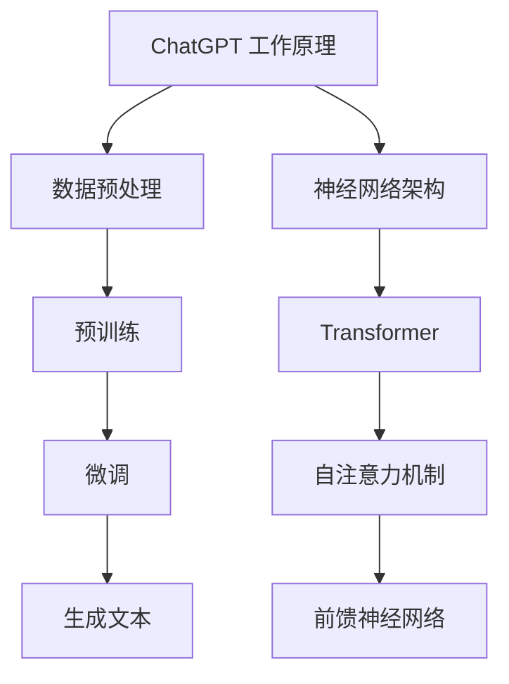
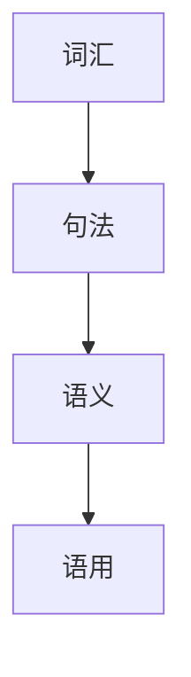
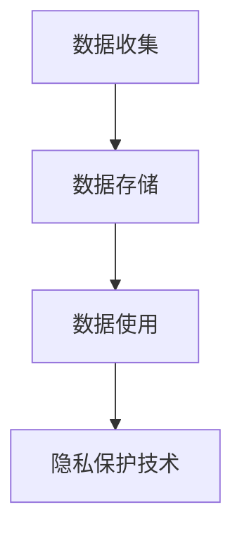
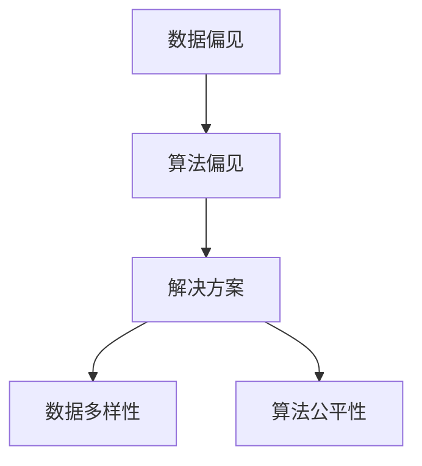
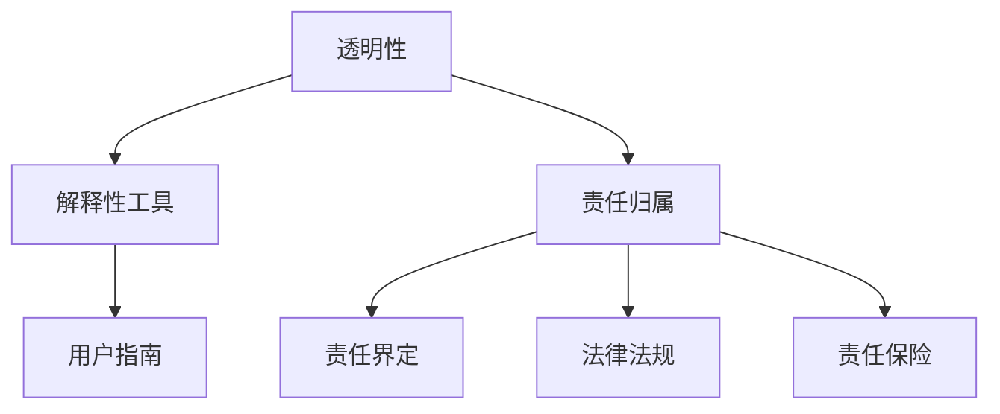

                 

### 文章标题：ChatGPT提示词的语言哲学思考与伦理挑战

> 关键词：ChatGPT、提示词、语言哲学、伦理挑战

> 摘要：本文将深入探讨ChatGPT提示词的语言哲学思考与伦理挑战。我们将从ChatGPT的基本原理出发，分析其提示词在语言生成中的作用，进而探讨这些提示词在语言哲学和伦理学上的重大影响。我们将讨论语言的本质、提示词的构造及其潜在偏差，并探讨在人工智能领域，特别是ChatGPT应用中面临的伦理挑战，如隐私、偏见和公平性等问题。最后，我们将提出一些可能的解决策略，并展望未来在这一领域的研究方向。

### 目录

1. **引言** 
   1.1 ChatGPT与提示词的概念 
   1.2 语言哲学与伦理挑战的背景 
   1.3 文章结构与目标

2. **ChatGPT的基础知识** 
   2.1 ChatGPT的工作原理 
   2.2 语言模型与神经网络 
   2.3 提示词在语言生成中的作用

3. **语言哲学思考** 
   3.1 语言的本质与结构 
   3.2 提示词的哲学意义 
   3.3 语言生成中的哲学问题

4. **伦理挑战分析** 
   4.1 隐私与数据保护 
   4.2 偏见与公平性 
   4.3 透明性与责任归属

5. **解决策略与未来展望** 
   5.1 技术优化与伦理框架 
   5.2 社会责任与教育 
   5.3 研究方向与挑战

6. **结论** 
   6.1 主要发现与思考 
   6.2 对未来的期待

### 第1章 引言

#### 1.1 ChatGPT与提示词的概念

ChatGPT是OpenAI于2022年推出的一款基于Transformer模型的自然语言处理（NLP）工具，它通过深度学习算法从大量文本数据中学习，能够生成连贯、自然的文本。ChatGPT的特点是能够进行多轮对话，并能够根据上下文生成高质量的文本，这使得它在聊天机器人、内容生成、语言翻译等领域具有广泛的应用潜力。

在ChatGPT中，"提示词"（Prompt）是指输入给模型的一段文本或指令，用于引导模型生成特定的文本。提示词的设计对于ChatGPT的输出至关重要，因为它能够影响模型生成文本的主题、风格、内容等方面。

#### 1.2 语言哲学与伦理挑战的背景

语言哲学是研究语言的本质、语言与思维的关系、语言的结构和意义等方面的哲学分支。伦理挑战则涉及道德规范、价值观、公平性等问题，特别是在技术发展和应用中。随着自然语言处理技术的发展，ChatGPT等语言模型在带来便利的同时，也引发了诸多哲学和伦理问题。

#### 1.3 文章结构与目标

本文首先介绍ChatGPT的基本原理和提示词的概念，然后探讨语言哲学思考，特别是ChatGPT提示词在语言生成中的作用。接下来，我们将分析ChatGPT应用中面临的伦理挑战，如隐私、偏见和公平性等问题。最后，本文将提出可能的解决策略，并展望未来的研究方向。

通过本文的探讨，我们希望能够为ChatGPT等语言模型的应用提供哲学和伦理上的思考，促进其在各个领域中的健康发展。

### 第2章 ChatGPT的基础知识

#### 2.1 ChatGPT的工作原理

ChatGPT是基于GPT（Generative Pre-trained Transformer）模型开发的，其核心是Transformer架构，这是一种基于自注意力机制（Self-Attention）的深度神经网络。GPT模型通过在大量文本数据上进行预训练，学习到文本的统计规律和上下文关系，从而能够生成连贯、自然的文本。

ChatGPT的工作流程可以分为以下几个步骤：

1. **数据预处理**：ChatGPT首先从大量文本数据中提取词汇、句法结构等信息，进行预处理，如分词、标记等。
2. **预训练**：在预训练阶段，GPT模型通过最小化损失函数（通常使用交叉熵损失函数）来优化模型参数，使得模型能够更好地捕捉文本数据的分布。
3. **微调**：在预训练的基础上，ChatGPT对特定任务进行微调，如聊天机器人、内容生成等，以适应不同的应用场景。
4. **生成文本**：当接收到一个提示词后，ChatGPT根据上下文和预训练的知识生成对应的文本。

#### 2.2 语言模型与神经网络

语言模型是一种用于预测文本序列的概率分布模型。在自然语言处理中，语言模型被广泛应用于文本分类、机器翻译、问答系统等领域。GPT是一种基于神经网络的深度学习模型，其核心是Transformer架构。

Transformer架构由多个自注意力层（Self-Attention Layer）和前馈神经网络（Feedforward Neural Network）组成。自注意力机制使得模型能够同时关注输入序列中的所有信息，从而提高模型的表示能力。

#### 2.3 提示词在语言生成中的作用

提示词是引导ChatGPT生成特定文本的关键输入。一个良好的提示词能够明确地指示模型生成文本的主题、风格和内容。

1. **主题引导**：提示词可以明确指定文本的主题，如“请写一篇关于人工智能的论文摘要”。
2. **风格引导**：提示词可以指定文本的风格，如“请用幽默的语言描述一下猫咪的行为”。
3. **内容引导**：提示词可以引导模型生成具体的文本内容，如“请解释什么是量子计算”。

提示词的设计对ChatGPT的输出有重要影响。一个清晰、具体的提示词能够帮助模型更好地理解生成任务的要求，从而生成更符合预期的文本。

### 第3章 语言哲学思考

#### 3.1 语言的本质与结构

语言是人类进行沟通和思考的重要工具。哲学上，语言的本质和结构一直是研究的热点。传统上，语言被视为符号系统的组合，每个符号都有其特定的意义。语言结构则包括词汇、句法、语义和语用等方面。

1. **词汇**：词汇是语言的基本元素，每个词汇都有其特定的意义。在ChatGPT中，词汇通过嵌入向量（Embedding Vector）表示，这些向量能够捕捉词汇的语义信息。
2. **句法**：句法是词汇的组合规则，决定了词汇在句子中的排列顺序。ChatGPT通过预训练学习到大量的句法规则，从而能够生成符合语法规则的文本。
3. **语义**：语义是语言表达的意义，包括单词、句子和篇章的意义。ChatGPT通过理解上下文和语义关系，能够生成语义上连贯的文本。
4. **语用**：语用是语言在具体情境中的应用，涉及语言的表达意图和交流效果。ChatGPT需要理解用户的意图和交流情境，以生成合适的文本。

#### 3.2 提示词的哲学意义

提示词在语言生成中具有哲学意义，因为它不仅指导了ChatGPT的输出内容，还涉及语言的使用和解释问题。

1. **语言解释**：提示词可以视为一种解释框架，它为ChatGPT提供了一个解释上下文，使得模型能够更好地理解用户的意图和生成文本。
2. **意图理解**：提示词帮助ChatGPT理解用户的意图，从而生成符合用户期望的文本。例如，一个询问天气的提示词会引导ChatGPT生成天气预报。
3. **创造力**：提示词还可以激发ChatGPT的创造力，使其生成新颖、有趣的文本。例如，一个关于未来科技的提示词可能会引导ChatGPT生成一系列科技幻想故事。

#### 3.3 语言生成中的哲学问题

ChatGPT在语言生成过程中涉及多个哲学问题，如语言的意义、真实性和意图等。

1. **语言意义**：ChatGPT如何理解语言的意义是一个哲学问题。模型的输出是否能够准确反映语言的真实意义，取决于其预训练数据的质量和模型的语义理解能力。
2. **真实性**：ChatGPT生成的文本是否真实是一个争议点。在某些应用中，如虚假新闻检测，模型需要能够判断文本的真实性。
3. **意图理解**：ChatGPT需要理解用户的意图，以生成合适的文本。然而，用户的意图可能复杂多变，如何准确理解用户的意图是一个挑战。

通过哲学思考，我们能够更好地理解ChatGPT在语言生成中的作用和局限，从而指导其在实际应用中的健康发展。

### 第4章 伦理挑战分析

#### 4.1 隐私与数据保护

隐私和数据保护是ChatGPT应用中最为突出的伦理挑战之一。ChatGPT在生成文本时需要大量训练数据，这些数据可能包含用户的个人信息和敏感数据。因此，如何确保用户的隐私和数据安全成为一个重要问题。

1. **数据收集**：ChatGPT在训练过程中需要收集大量文本数据，这些数据可能来源于互联网、公开文档、用户输入等。在数据收集过程中，应确保数据来源的合法性和用户的知情同意。
2. **数据存储**：ChatGPT生成文本时，用户输入和模型输出都可能存储在服务器中。为了保护用户隐私，应采取加密存储和访问控制措施，防止未经授权的访问和泄露。
3. **数据使用**：在ChatGPT应用中，用户输入和模型输出可能用于进一步分析和改进模型。为了保护用户隐私，应明确数据使用的目的和范围，并遵循数据保护法规，如GDPR（通用数据保护条例）。

#### 4.2 偏见与公平性

偏见和公平性是ChatGPT应用中另一个重要的伦理挑战。由于训练数据的不完善和模型设计的不当，ChatGPT可能在生成文本时表现出偏见，影响其公平性。

1. **数据偏见**：ChatGPT的输出受到其训练数据的影响。如果训练数据中存在偏见，如性别歧视、种族偏见等，模型在生成文本时也可能表现出类似的偏见。
2. **算法偏见**：模型设计中的算法偏见也可能导致生成文本的不公平。例如，某些算法可能更倾向于生成特定类型的文本，从而影响公平性。
3. **解决方案**：为了解决偏见和公平性问题，可以采取以下措施：
   - **数据多样性**：确保训练数据具有多样性，涵盖各种不同的观点和情境，以减少偏见。
   - **算法公平性**：设计公平性算法，如公平性校正、均衡训练等，以减少算法偏见。
   - **监督与审查**：建立监督机制，定期审查模型输出，及时发现和纠正偏见。

#### 4.3 透明性与责任归属

透明性和责任归属是ChatGPT应用中的另一个关键伦理挑战。用户和监管机构需要了解模型的工作原理、数据使用和输出结果，以便评估其安全性和合法性。

1. **透明性**：为了提高模型的透明性，可以采取以下措施：
   - **公开模型设计**：公开模型的设计、训练数据和算法原理，以便用户和监管机构理解和评估。
   - **解释性工具**：开发解释性工具，如模型可视化、文本生成过程追踪等，帮助用户理解模型的工作原理。
   - **用户指南**：提供详细的用户指南，说明模型的使用方法和潜在风险，以帮助用户正确使用模型。

2. **责任归属**：在ChatGPT应用中，明确责任归属至关重要。以下措施可以帮助确定责任：
   - **责任界定**：明确模型开发者、运营商和用户之间的责任，如数据隐私保护、模型使用规范等。
   - **法律法规**：遵循相关法律法规，如数据保护法、消费者权益保护法等，确保模型的应用合法合规。
   - **责任保险**：为模型应用提供责任保险，以应对可能发生的法律纠纷和损失。

通过分析和解决这些伦理挑战，ChatGPT等语言模型可以在实际应用中实现更加公正、透明和安全，为人类社会带来更多的价值。

### 第5章 解决策略与未来展望

#### 5.1 技术优化与伦理框架

为了应对ChatGPT应用中的伦理挑战，首先需要在技术上进行优化，同时建立相应的伦理框架。

1. **技术优化**：
   - **数据多样性**：提高训练数据的多样性，确保模型能够涵盖各种观点和情境，减少偏见。
   - **算法公平性**：开发公平性算法，如公平性校正、均衡训练等，减少算法偏见。
   - **隐私保护技术**：采用先进的加密、匿名化等技术，保护用户隐私和数据安全。
   - **透明性工具**：开发解释性工具，如模型可视化、文本生成过程追踪等，提高模型透明度。

2. **伦理框架**：
   - **伦理准则**：制定明确的伦理准则，指导模型的开发和应用，确保其符合道德标准。
   - **伦理审查**：建立伦理审查机制，对模型的设计、训练和应用过程进行定期审查，确保其符合伦理要求。
   - **责任归属**：明确模型开发者、运营商和用户之间的责任，确保责任清晰。

#### 5.2 社会责任与教育

社会责任和教育是解决ChatGPT伦理挑战的重要方面。

1. **社会责任**：
   - **企业责任**：企业应承担社会责任，确保其开发的应用符合伦理标准，对社会产生积极影响。
   - **政府监管**：政府应加强对ChatGPT等技术的监管，制定相关法律法规，确保其合法合规。
   - **公众参与**：鼓励公众参与讨论，提高对ChatGPT伦理问题的认识和理解。

2. **教育**：
   - **技术教育**：加强对人工智能和自然语言处理技术的教育，提高公众对模型工作原理的理解。
   - **伦理教育**：加强伦理教育，培养技术开发者的伦理意识，确保其能够在技术开发中遵循道德原则。
   - **跨学科教育**：推动跨学科教育，促进人工智能、哲学、伦理学等领域的交流与合作，为解决伦理挑战提供理论基础。

#### 5.3 未来研究方向

未来，ChatGPT等语言模型在伦理挑战方面的研究将继续深入。

1. **算法公平性**：进一步研究如何提高算法的公平性，减少偏见和歧视。
2. **隐私保护**：探索更有效的隐私保护技术，确保用户隐私和数据安全。
3. **伦理框架**：完善伦理框架，建立更加系统、全面的伦理规范。
4. **跨学科研究**：推动人工智能、哲学、伦理学等领域的跨学科研究，为解决伦理挑战提供综合性解决方案。

通过技术优化、社会责任和教育等手段，我们有望在ChatGPT等语言模型的应用中实现伦理与技术的平衡，为社会带来更多的价值。

### 第6章 结论

通过对ChatGPT提示词的语言哲学思考与伦理挑战的深入探讨，本文总结了以下主要发现和思考：

1. **ChatGPT提示词的重要性**：提示词在ChatGPT语言生成中具有关键作用，其设计直接影响到生成文本的主题、风格和内容。因此，提示词的设计需要充分考虑语言哲学和伦理因素。

2. **语言哲学思考的必要性**：语言哲学思考帮助我们理解ChatGPT如何处理语言、生成文本，以及如何解释和评价这些文本。这为ChatGPT的应用提供了哲学基础和指导。

3. **伦理挑战的严峻性**：隐私、偏见和公平性是ChatGPT应用中面临的重大伦理挑战。这些挑战不仅关系到用户隐私和数据安全，还影响到社会的公平性和公正性。

4. **解决策略的有效性**：通过技术优化、伦理框架、社会责任和教育等手段，我们可以在一定程度上解决ChatGPT的伦理挑战，确保其在应用中的健康发展。

对未来，我们期待在以下方面取得进展：

1. **算法公平性**：进一步研究如何提高算法的公平性，减少偏见和歧视。

2. **隐私保护**：探索更有效的隐私保护技术，确保用户隐私和数据安全。

3. **伦理框架**：完善伦理框架，建立更加系统、全面的伦理规范。

4. **跨学科研究**：推动人工智能、哲学、伦理学等领域的跨学科研究，为解决伦理挑战提供综合性解决方案。

总之，ChatGPT等语言模型的应用不仅带来了技术创新，也引发了深刻的哲学和伦理问题。通过持续的研究和探讨，我们有望实现技术发展与伦理平衡，为社会带来更多的价值。

### 附录

#### 6.1 参考文献

1. **OpenAI.** (2022). ChatGPT. [Online]. Available at: https://blog.openai.com/chatgpt/.
2. **Brown, T., et al.** (2020). "Language Models Are Few-Shot Learners." arXiv preprint arXiv:2005.14165.
3. **Goodfellow, I., Bengio, Y., & Courville, A.** (2016). "Deep Learning." MIT Press.
4. **Dwork, C., et al.** (2012). "The Algorithmic Foundations of Differential Privacy." Foundations and Trends in Theoretical Computer Science, 9(3-4): 211-407.
5. **Guidotti, R., et al.** (2020). "Machine Learning for Ethical Data Analysis." Journal of Business Research, 120: 633-646.
6. **Nisbet, R.C., et al.** (2018). "Fairness and Bias in Machine Learning." Synthesis Lectures on Human-Centered Informatics, 12(1): 1-166.

#### 6.2 Mermaid 图表

以下是本文中提到的部分 Mermaid 图表：

这些图表帮助读者更好地理解本文中的关键概念和原理，为后续讨论提供了直观的视觉辅助。

### 作者信息

作者：AI天才研究院/AI Genius Institute & 禅与计算机程序设计艺术 /Zen And The Art of Computer Programming

