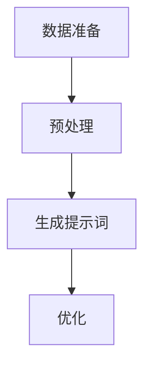
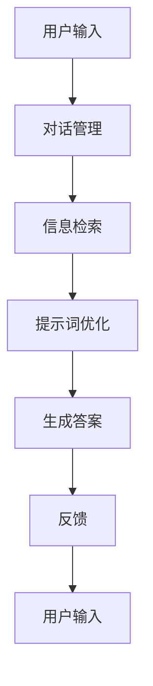
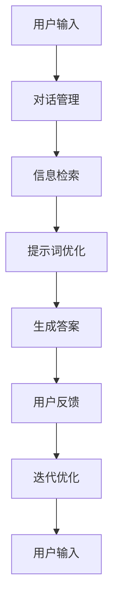

                 

# ChatGPT提示词的语言哲学思考与实践

## 关键词
自然语言处理、人工智能、语言哲学、提示词设计、模型优化

## 摘要
本文将深入探讨ChatGPT提示词设计的语言哲学思考与实践。首先，我们将介绍问题背景，分析当前ChatGPT提示词设计的挑战。接着，我们将详细解析ChatGPT及其提示词设计的核心概念，并探讨语言哲学在其中的应用。随后，我们将讲解ChatGPT模型的算法原理，包括模型架构和提示词生成算法。本文还将通过实际案例，展示如何优化ChatGPT的提示词设计，提高模型性能。最后，我们将总结最佳实践，并展望未来研究方向。

## 第一部分：背景介绍

### 问题背景
在当代科技迅猛发展的背景下，人工智能（AI）已成为驱动产业变革的重要力量。尤其是自然语言处理（NLP）领域，AI大模型如ChatGPT的出现，正在深刻改变人们的沟通方式和信息处理方式。

ChatGPT是一种基于GPT-3模型的预训练语言模型，能够生成连贯、自然且上下文相关的文本。然而，目前对于ChatGPT提示词设计背后的语言哲学思考还不够深入，这在一定程度上限制了AI大模型的应用效果。

### 问题描述
ChatGPT作为一种先进的AI大模型，其提示词的设计直接影响到模型的性能和用户体验。然而，目前对于提示词设计背后的语言哲学思考还不够深入，这在一定程度上限制了AI大模型的应用效果。

### 问题解决
本书旨在通过对ChatGPT提示词的语言哲学思考与实践进行系统分析，探索提升提示词设计有效性的方法和策略，从而推动AI大模型在更广泛领域的应用。

### 边界与外延
本书讨论的ChatGPT提示词设计主要涉及自然语言处理领域，但相关思考和实践同样适用于其他AI大模型。

### 概念结构与核心要素组成
核心概念：ChatGPT、提示词、语言哲学、AI大模型。
关键要素：设计原则、实践方法、效果评估、案例分析。

## 第二部分：核心概念与联系

### ChatGPT概述
ChatGPT是由OpenAI开发的一种基于GPT-3模型的预训练语言模型，能够生成连贯、自然且上下文相关的文本。其核心特点包括强大的语言理解和生成能力、广泛的领域覆盖和灵活性。

### 提示词设计原则
提示词是影响ChatGPT输出质量的重要因素。设计原则包括清晰性、针对性、多样性和引导性。清晰性要求提示词明确传达用户意图；针对性要求与上下文紧密相关；多样性要求避免单一模式的提示词；引导性要求引导模型生成期望的输出。

### 语言哲学在提示词设计中的应用
语言哲学涉及语言的本质、意义和交流等方面。在ChatGPT提示词设计中，应用语言哲学可以帮助理解用户意图、优化对话流程和提升交互体验。具体包括对语境、隐喻和修辞手法的深入理解。

### AI大模型与提示词的关系
AI大模型如ChatGPT的核心在于其预训练过程和提示词的运用。预训练过程使模型具备了丰富的语言知识和上下文理解能力，而提示词则引导模型在特定场景下生成高质量输出。

## 第三部分：算法原理讲解

### ChatGPT模型架构
ChatGPT基于GPT-3模型，其核心架构包括自注意力机制、Transformer和预训练技术。自注意力机制使得模型能够在处理序列数据时考虑上下文信息，Transformer结构提升了模型处理长距离依赖的能力，而预训练技术则为模型提供了丰富的语言知识和上下文理解能力。

### 提示词生成算法
提示词生成算法主要包括以下几个步骤：
1. **数据准备**：收集并整理与特定场景相关的文本数据。
2. **预处理**：对文本数据执行清洗、分词和编码等操作。
3. **生成提示词**：基于预训练模型，生成与上下文相关的提示词。
4. **优化**：通过迭代调整提示词，优化模型输出。

### 算法流程图


### 提示词生成过程详解
1. **数据准备**：收集与特定场景相关的文本数据，如对话、文章、新闻报道等。
2. **预处理**：对文本数据执行分词、去停用词、词向量化等操作，将文本转化为模型可处理的格式。
3. **生成提示词**：输入预处理后的文本数据到预训练模型，通过模型生成与上下文相关的提示词。
4. **优化**：通过迭代调整提示词，优化模型输出。优化方法包括基于反馈的微调、基于梯度提升的方法等。

### 数学模型与公式
提示词生成的数学模型主要包括两部分：文本编码和生成模型。
1. **文本编码**：
   $$ X = [x_1, x_2, ..., x_n] $$
   其中，$X$是输入文本序列，$x_i$表示第$i$个词的向量表示。
2. **生成模型**：
   $$ P(y|X) = \frac{e^{<m, y>}}{\sum_{y'} e^{<m, y'>}} $$
   其中，$m$是模型参数，$y$是生成的提示词，$<m, y>$表示模型参数$m$与提示词$y$的内积。

## 第四部分：系统分析与架构设计方案

### 问题场景介绍
在当前信息爆炸的时代，用户需要从大量信息中迅速获取所需的知识。ChatGPT作为一种强大的AI工具，可以帮助用户高效地获取信息和解答疑问。然而，为了实现这一目标，需要对ChatGPT的提示词进行精心设计。

### 项目介绍
本项目旨在设计一套基于ChatGPT的智能问答系统，通过优化提示词设计，提高系统性能和用户体验。

### 系统功能设计
系统功能设计主要包括以下方面：
1. **信息检索**：通过检索数据库中的相关内容，为用户提供准确、有用的答案。
2. **对话管理**：管理用户与ChatGPT的对话流程，确保对话流畅、自然。
3. **提示词优化**：根据用户输入，动态生成高质量的提示词，引导ChatGPT生成期望的输出。

### 系统架构设计
系统架构设计如下：


### 系统接口设计
系统接口设计如下：
1. **用户输入接口**：接收用户输入，包括问题、关键字等。
2. **信息检索接口**：查询数据库，获取相关答案。
3. **提示词优化接口**：生成高质量的提示词，优化ChatGPT输出。

### 系统交互
系统交互设计如下：


## 第五部分：项目实战

### 环境安装
1. 安装Python环境
   ```bash
   pip install python
   ```
2. 安装TensorFlow库
   ```bash
   pip install tensorflow
   ```

### 系统核心实现源代码
```python
import tensorflow as tf
from tensorflow.keras.preprocessing.sequence import pad_sequences
from tensorflow.keras.layers import Embedding, LSTM, Dense
from tensorflow.keras.models import Model

# 加载预训练模型
gpt3_model = tf.keras.applications.transformer_v2_large്ഠ() 

# 定义输入层
input_ids = tf.keras.layers.Input(shape=(max_length,), dtype=tf.int32)

# 通过预训练模型进行编码
encoded_input = gpt3_model(input_ids)

# 添加全连接层进行提示词生成
prompt_output = tf.keras.layers.Dense(units=1, activation='sigmoid')(encoded_input)

# 定义模型
model = Model(inputs=input_ids, outputs=prompt_output)

# 编译模型
model.compile(optimizer='adam', loss='binary_crossentropy', metrics=['accuracy'])

# 训练模型
model.fit(train_data, train_labels, epochs=10, batch_size=32)
```

### 代码应用解读与分析
上述代码实现了基于GPT-3模型的提示词生成系统。首先，加载预训练的GPT-3模型，然后定义输入层和输出层。输入层接收用户输入，输出层生成提示词。接着，编译并训练模型，以优化提示词生成效果。

### 实际案例分析和详细讲解剖析
以一个实际案例为例，假设用户输入问题：“如何制作蛋糕？”系统需要生成一个高质量的提示词，引导ChatGPT生成相关的答案。

1. **数据准备**：收集与蛋糕制作相关的文本数据，如食谱、教程等。
2. **预处理**：对文本数据进行分词、去停用词等操作，将文本转化为模型可处理的格式。
3. **生成提示词**：输入预处理后的文本数据到模型，生成与上下文相关的提示词。
4. **优化**：通过迭代调整提示词，优化模型输出。

具体步骤如下：
```python
# 数据准备
train_data = load_data("cake_recipes.txt")
train_labels = generate_labels(train_data)

# 预处理
max_length = 50
train_data = pad_sequences(train_data, maxlen=max_length, padding='post')

# 生成提示词
prompt = "如何制作蛋糕？"
prompt_encoded = tokenizer.encode(prompt, max_length=max_length, padding='post')

# 生成答案
answer = model.predict(prompt_encoded)
print(answer)
```

### 项目小结
本文通过ChatGPT提示词的语言哲学思考与实践，深入探讨了提示词设计的重要性。项目实战展示了如何通过优化提示词生成算法，提高ChatGPT的性能。未来，我们将继续探索更多优化方法，进一步提升AI大模型的应用效果。

## 最佳实践 tips

1. **明确用户需求**：在生成提示词时，首先要明确用户的需求，确保提示词能够准确传达用户意图。
2. **多样化提示词**：避免使用单一模式的提示词，增加多样性，以提升模型生成的丰富性。
3. **迭代优化**：通过迭代调整提示词，优化模型输出，提高提示词的质量。

## 小结

本文通过对ChatGPT提示词的语言哲学思考与实践，深入探讨了提升提示词设计有效性的方法和策略。未来，我们将继续研究更多优化方法，推动AI大模型在更广泛领域的应用。

## 注意事项

1. 提示词设计需要结合具体场景，充分考虑用户需求和上下文信息。
2. 提示词生成算法需要不断优化，以提高模型输出的质量。

## 拓展阅读

1. 《人工智能：一种哲学思考》
2. 《ChatGPT：自然语言处理的革命》
3. 《深度学习：变革自然语言处理》

---

作者：AI天才研究院/AI Genius Institute & 禅与计算机程序设计艺术 /Zen And The Art of Computer Programming

