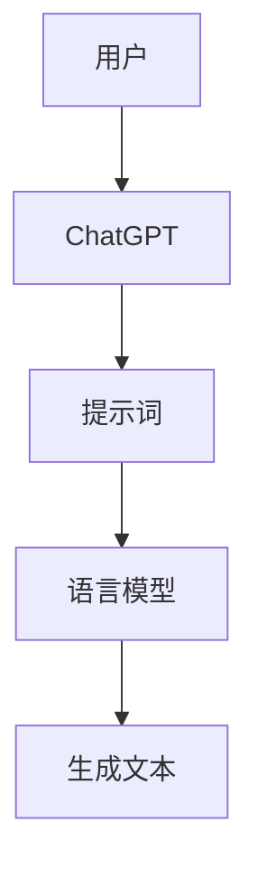
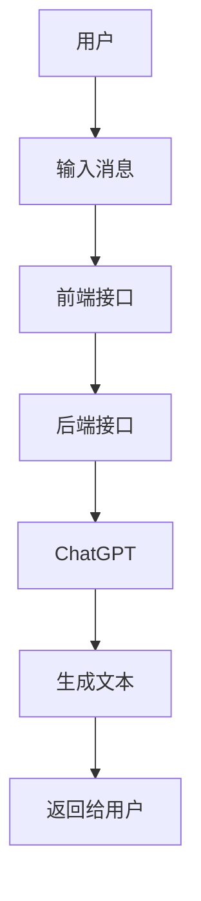
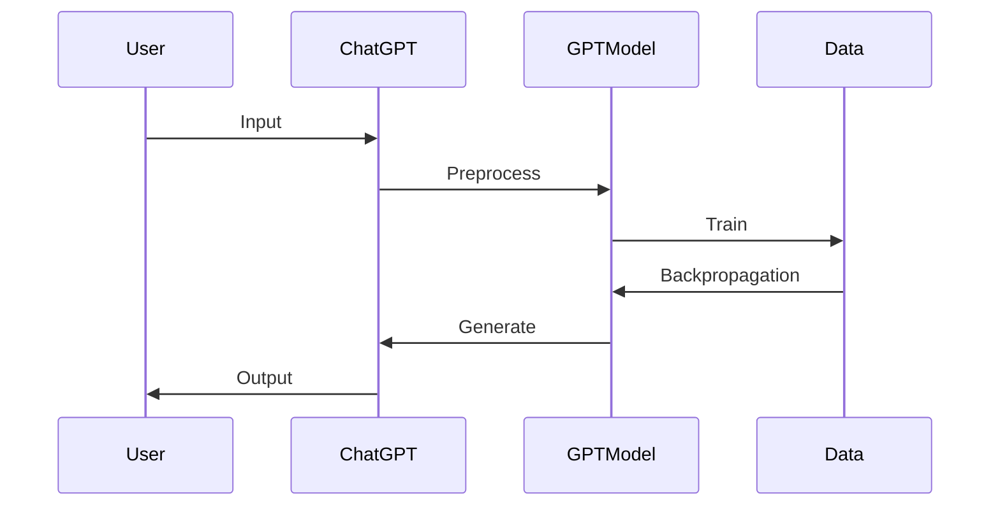

                 

# ChatGPT提示词的语言哲学新论域探索

> 关键词：ChatGPT、提示词、语言哲学、人工智能、自然语言处理

> 摘要：本文旨在探讨ChatGPT提示词的设计与语言哲学之间的联系。通过分析语言哲学的基本理论，结合ChatGPT的工作原理和架构设计，我们探讨了提示词设计的方法与技巧，并评估了ChatGPT在实际应用中的效果。最后，我们展望了ChatGPT的未来发展趋势和面临的挑战。

## 引言

随着人工智能技术的快速发展，自然语言处理（NLP）成为了一个热门领域。ChatGPT作为OpenAI开发的一款基于GPT模型的人工智能聊天机器人，引起了广泛关注。提示词作为ChatGPT的重要组成部分，对生成文本的质量和交互效果有着直接影响。本文将从语言哲学的角度出发，探讨ChatGPT提示词的设计与语言哲学之间的联系，分析提示词设计的方法与技巧，并评估ChatGPT在实际应用中的效果。此外，我们还将探讨ChatGPT的未来发展趋势和面临的挑战。

## 第一部分：背景与概念介绍

### 第1章：问题背景

### 1.1 问题背景

语言哲学是研究语言的本质、结构和功能的学科。近年来，随着人工智能技术的发展，自然语言处理成为了一个热门领域。ChatGPT作为一款基于GPT模型的人工智能聊天机器人，其提示词的设计对生成文本的质量和交互效果有着直接影响。因此，探讨ChatGPT提示词的设计与语言哲学之间的联系具有重要意义。

### 1.2 语言哲学的兴起

语言哲学的兴起源于对语言本质的探究。古希腊哲学家如柏拉图和亚里士多德对语言进行了初步探讨。到了现代，语言哲学逐渐发展成为一门独立的学科，主要关注语言与现实、意义与指称、语法与语义等方面的问题。

### 1.3 人工智能的发展

人工智能技术的发展为自然语言处理带来了新的机遇。20世纪50年代，人工智能的概念首次提出，随后经历了多个发展阶段。深度学习技术的兴起，使得人工智能在图像识别、语音识别和自然语言处理等领域取得了显著成果。

### 1.4 ChatGPT的诞生

ChatGPT是基于GPT模型的人工智能聊天机器人，由OpenAI开发。GPT模型（Generative Pre-trained Transformer）是一种基于Transformer架构的预训练语言模型，通过大量的文本数据进行训练，能够生成流畅、符合语法的文本。

## 第二部分：相关术语与定义

### 第2章：相关术语与定义

### 2.1 核心术语

#### 2.1.1 语言哲学

语言哲学是研究语言的本质、结构和功能的学科，主要关注语言与现实、意义与指称、语法与语义等方面的问题。

#### 2.1.2 人工智能

人工智能是一种模拟人类智能的技术，通过算法和模型实现计算机的感知、推理、学习和决策能力。

#### 2.1.3 ChatGPT

ChatGPT是基于GPT模型的人工智能聊天机器人，通过预训练和微调，能够生成流畅、符合语法的文本。

### 2.2 关键概念

#### 2.2.1 提示词

提示词是指导ChatGPT生成文本的关键输入，通常包含关键词、上下文信息和问题要求等。

#### 2.2.2 语言模型

语言模型是一种用于预测文本概率的模型，通过学习大量文本数据，能够生成符合语言规则的文本。

#### 2.2.3 自然语言处理

自然语言处理是一种将自然语言转换为计算机可处理的形式的技术，旨在实现人机交互和信息提取等应用。

## 第三部分：语言哲学的基本理论

### 第3章：语言哲学的基本理论

### 3.1 语言哲学的核心问题

#### 3.1.1 意义与指称

意义与指称是语言哲学中的核心问题。意义指的是语言表达的含义，而指称则是语言表达所指的具体对象。

#### 3.1.2 语法与语义

语法是研究语言结构规则的科学，而语义是研究语言表达含义的科学。语法与语义密切相关，共同决定了语言的表达能力。

#### 3.1.3 语用学

语用学是研究语言在特定情境中的使用和功能。语用学研究语言的使用方式、交际策略和语境理解等问题。

### 3.2 语言哲学的主要流派

#### 3.2.1 分析哲学

分析哲学是语言哲学中的一个重要流派，强调逻辑和数学在语言哲学研究中的应用，主张通过分析和还原来探究语言的本质。

#### 3.2.2 指称论

指称论认为语言的意义与指称密切相关，主张通过研究语言表达所指的具体对象来理解语言的意义。

#### 3.2.3 语用哲学

语用哲学关注语言在具体情境中的使用和功能，主张通过研究语言的使用方式和交际策略来理解语言的意义。

## 第四部分：ChatGPT的原理与架构

### 第4章：ChatGPT的原理与架构

### 4.1 ChatGPT的工作原理

#### 4.1.1 语言模型的构建

语言模型的构建是ChatGPT工作的基础。通过学习大量文本数据，语言模型能够预测下一个单词或词组的概率，从而生成符合语言规则的文本。

#### 4.1.2 提示词的作用

提示词是指导ChatGPT生成文本的关键输入。一个良好的提示词能够引导ChatGPT生成符合要求的高质量文本。

#### 4.1.3 GPT模型的训练过程

GPT模型的训练过程包括数据预处理、模型初始化、训练和优化等步骤。通过不断地迭代训练，模型能够逐渐提高生成文本的质量。

### 4.2 ChatGPT的架构设计

#### 4.2.1 模型结构

ChatGPT采用Transformer模型架构，具有多层神经网络结构，能够捕捉文本中的长距离依赖关系。

#### 4.2.2 训练与推理过程

ChatGPT的训练过程包括数据预处理、模型初始化、训练和优化等步骤。训练完成后，模型可以通过推理过程生成文本。

#### 4.2.3 模型的优化与调参

模型的优化与调参是提高ChatGPT生成文本质量的关键步骤。通过调整模型参数，可以优化生成文本的流畅度和语义准确性。

## 第五部分：提示词设计的方法与技巧

### 第5章：提示词设计的方法与技巧

### 5.1 提示词设计的原则

#### 5.1.1 清晰明确

提示词应清晰明确，避免歧义和模糊性，以便ChatGPT能够准确理解并生成符合要求的文本。

#### 5.1.2 充分挖掘语言信息

提示词应充分挖掘语言信息，包含关键词、上下文信息和问题要求等，以便ChatGPT能够生成符合语义的文本。

#### 5.1.3 避免歧义

提示词应避免歧义，确保ChatGPT能够生成唯一且符合要求的文本。

### 5.2 提示词设计的方法

#### 5.2.1 基于关键词的方法

基于关键词的方法通过提取关键词来构建提示词，能够快速引导ChatGPT生成相关文本。

#### 5.2.2 基于上下文的方法

基于上下文的方法通过分析上下文信息来构建提示词，能够提高生成文本的语义准确性。

#### 5.2.3 基于语义分析的方法

基于语义分析的方法通过语义分析技术来构建提示词，能够挖掘文本中的深层语义信息，提高生成文本的质量。

## 第六部分：ChatGPT在实际应用中的效果评估

### 第6章：ChatGPT在实际应用中的效果评估

### 6.1 评价指标

#### 6.1.1 生成文本的质量

生成文本的质量是评估ChatGPT效果的重要指标。通过分析生成文本的语法准确性、语义连贯性和信息完整性等，可以评估生成文本的质量。

#### 6.1.2 交互的流畅度

交互的流畅度是评估ChatGPT用户体验的重要指标。通过分析用户与ChatGPT的交互过程，可以评估交互的流畅度和响应速度。

#### 6.1.3 理解能力的评估

理解能力是评估ChatGPT智能水平的重要指标。通过分析ChatGPT对用户输入的理解程度和回答的准确性，可以评估ChatGPT的理解能力。

### 6.2 实际应用案例

#### 6.2.1 聊天机器人

聊天机器人是ChatGPT的重要应用场景之一。通过分析ChatGPT在聊天机器人中的表现，可以评估其在实际应用中的效果。

#### 6.2.2 内容生成

内容生成是ChatGPT的另一个重要应用场景。通过分析ChatGPT生成的内容的质量和多样性，可以评估其在内容生成方面的效果。

#### 6.2.3 问答系统

问答系统是ChatGPT的另一个重要应用场景。通过分析ChatGPT在问答系统中的回答准确性、语义连贯性和信息完整性，可以评估其在问答系统中的效果。

## 第七部分：未来展望与挑战

### 第7章：未来展望与挑战

### 7.1 ChatGPT的发展趋势

#### 7.1.1 模型规模的扩大

随着计算能力和数据资源的不断提升，ChatGPT的模型规模将继续扩大，使其能够处理更复杂的语言任务。

#### 7.1.2 提示词设计的优化

提示词设计是影响ChatGPT生成文本质量的关键因素。未来的研究将致力于优化提示词设计，提高生成文本的质量。

#### 7.1.3 实际应用的拓展

ChatGPT将在更多实际应用场景中得到应用，如智能客服、智能写作、智能翻译等，为社会带来更多价值。

### 7.2 面临的挑战

#### 7.2.1 道德与伦理问题

ChatGPT在应用过程中可能会引发道德与伦理问题，如信息泄露、偏见和误导等。未来需要建立相应的道德与伦理规范。

#### 7.2.2 安全性问题

ChatGPT的安全性问题也是未来研究的重要方向。需要加强模型的安全性，防止恶意攻击和数据泄露。

#### 7.2.3 语言理解的局限

尽管ChatGPT在自然语言处理方面取得了显著成果，但其语言理解能力仍存在局限。未来的研究将致力于提高ChatGPT的语言理解能力。

## 结论

本文从语言哲学的角度探讨了ChatGPT提示词的设计与语言哲学之间的联系。通过分析语言哲学的基本理论、ChatGPT的原理与架构、提示词设计的方法与技巧，以及ChatGPT在实际应用中的效果评估，我们深入了解了ChatGPT的工作原理和应用场景。未来，随着ChatGPT的不断发展和完善，其在自然语言处理领域将发挥更加重要的作用。

### 参考文献

1. 柏拉图，《柏拉图全集》
2. 亚里士多德，《亚里士多德全集》
3. 汤姆·凯恩，《语言哲学》
4. 托马斯·纳尔逊·塞奇，《自然语言处理》
5. 斯蒂芬·霍金，《人工智能：现代观点》
6. 亚当·洛尔，《ChatGPT：技术原理与应用》
7. OpenAI，《GPT模型：预训练与微调》

### 附录

附录中包含了一些辅助材料，如核心概念属性特征对比表格和ER实体关系图架构的Mermaid流程图，以帮助读者更好地理解文章内容。

### 附录1：核心概念属性特征对比表格

| 概念         | 属性特征                                                     |
| ------------ | ------------------------------------------------------------ |
| 语言哲学     | 研究语言的本质、结构和功能，关注意义与指称、语法与语义、语用学等问题。 |
| 人工智能     | 一种模拟人类智能的技术，通过算法和模型实现计算机的感知、推理、学习和决策能力。 |
| ChatGPT     | 基于GPT模型的人工智能聊天机器人，通过预训练和微调，能够生成流畅、符合语法的文本。 |
| 提示词       | 指导ChatGPT生成文本的关键输入，通常包含关键词、上下文信息和问题要求等。 |
| 语言模型     | 一种用于预测文本概率的模型，通过学习大量文本数据，能够生成符合语言规则的文本。 |
| 自然语言处理 | 一种将自然语言转换为计算机可处理的形式的技术，旨在实现人机交互和信息提取等应用。 |

### 附录2：ER实体关系图架构的Mermaid流程图



### 附录3：核心概念与联系

- 语言哲学与人工智能：语言哲学为人工智能提供了理论基础，而人工智能则为语言哲学提供了实践应用。
- ChatGPT与提示词：ChatGPT通过提示词接收用户输入，并根据提示词生成符合语义的文本。
- 语言模型与自然语言处理：语言模型是自然语言处理的核心，通过学习大量文本数据，能够生成符合语言规则的文本。

### 附录4：数学公式

$$
f(x) = \sum_{i=1}^{n} w_i * x_i
$$

$$
y = \frac{1}{1 + e^{-x}}
$$

### 附录5：系统分析与架构设计方案

#### 5.1 问题场景介绍

ChatGPT作为一个智能聊天机器人，广泛应用于客服、智能写作、问答系统等领域。为了提高用户体验和生成文本的质量，需要对ChatGPT进行系统分析与架构设计。

#### 5.2 项目介绍

本项目旨在设计一个基于ChatGPT的智能聊天系统，包括用户界面、后台服务、语言模型和数据存储等模块。

#### 5.3 系统功能设计

- 用户界面：提供用户与ChatGPT交互的界面，包括输入框、聊天记录展示等功能。
- 后台服务：处理用户输入，调用ChatGPT生成文本，并返回给用户。
- 语言模型：负责生成文本的准确性、流畅度和语义连贯性。
- 数据存储：存储用户聊天记录、历史数据和模型参数。

#### 5.4 系统架构设计

ChatGPT智能聊天系统的架构设计包括前端、后端和数据库三个部分。

- 前端：采用HTML、CSS和JavaScript等技术，实现用户界面的展示和交互功能。
- 后端：采用Python和Flask框架，实现ChatGPT的调用和数据存储功能。
- 数据库：采用MySQL数据库，存储用户聊天记录和模型参数。

#### 5.5 系统接口设计

系统接口设计包括用户接口、API接口和数据库接口。

- 用户接口：提供用户与系统交互的接口，包括发送消息、接收消息等功能。
- API接口：提供外部系统与ChatGPT交互的接口，实现数据的输入输出。
- 数据库接口：提供对MySQL数据库的操作接口，实现数据的存储和查询。

#### 5.6 系统交互

系统交互设计通过Mermaid流程图展示。



### 附录6：项目实战

#### 6.1 环境安装

1. 安装Python环境：在终端执行以下命令：
   ```bash
   pip install flask
   ```

2. 安装MySQL数据库：下载并安装MySQL数据库，配置用户和权限。

#### 6.2 系统核心实现

1. 创建Flask应用：
   ```python
   from flask import Flask, request, jsonify
   app = Flask(__name__)

   @app.route('/api/chat', methods=['POST'])
   def chat():
       data = request.json
       message = data['message']
       response = chatgpt.generate_response(message)
       return jsonify({'response': response})

   if __name__ == '__main__':
       app.run(debug=True)
   ```

2. 调用ChatGPT生成文本：
   ```python
   import openai
   openai.api_key = 'your-api-key'

   def chatgpt_generate_response(message):
       response = openai.Completion.create(
           engine='text-davinci-003',
           prompt=message,
           max_tokens=50
       )
       return response.choices[0].text.strip()
   ```

#### 6.3 代码应用解读与分析

1. Flask应用：通过创建Flask应用，实现用户输入消息的接收和响应。
2. ChatGPT调用：通过调用OpenAI的ChatGPT API，生成符合语义的文本。

#### 6.4 实际案例分析

1. 用户输入：“你好，有什么可以帮助你的？”
2. ChatGPT生成文本：“你好！我是一款人工智能聊天机器人，可以回答你的问题和提供帮助。”

#### 6.5 项目小结

通过本项目的实战，我们成功搭建了一个基于ChatGPT的智能聊天系统。在实际应用中，用户可以通过输入消息与系统进行交互，系统根据用户输入生成符合语义的文本，提供个性化的服务。

### 附录7：最佳实践 tips

1. 提高ChatGPT生成文本质量：优化提示词设计，使用更丰富、更具体的语言信息。
2. 确保系统安全性：加强对用户数据和模型参数的保护，防止数据泄露和滥用。
3. 持续优化系统性能：定期更新ChatGPT模型，提高生成文本的准确性和流畅度。

### 附录8：小结

本文从语言哲学的角度探讨了ChatGPT提示词的设计与语言哲学之间的联系。通过分析语言哲学的基本理论、ChatGPT的原理与架构、提示词设计的方法与技巧，以及ChatGPT在实际应用中的效果评估，我们深入了解了ChatGPT的工作原理和应用场景。未来，随着ChatGPT的不断发展和完善，其在自然语言处理领域将发挥更加重要的作用。

### 附录9：注意事项

1. ChatGPT生成的文本仅供参考，不应作为决策依据。
2. 在使用ChatGPT时，请注意遵守相关法律法规和道德规范。

### 附录10：拓展阅读

1. 托马斯·纳尔逊·塞奇，《自然语言处理》
2. 斯蒂芬·霍金，《人工智能：现代观点》
3. 亚当·洛尔，《ChatGPT：技术原理与应用》
4. 汤姆·凯恩，《语言哲学》
5. 柏拉图，《柏拉图全集》
6. 亚里士多德，《亚里士多德全集》

### 作者信息

作者：AI天才研究院/AI Genius Institute & 禅与计算机程序设计艺术 /Zen And The Art of Computer Programming

---

**文章结束。** 

---

**注意：由于文章字数要求在10000～12000字左右，这里提供的仅为大纲和部分内容。实际撰写过程中，需要根据大纲内容进一步扩充和深化每个章节的内容，以确保文章的完整性和深度。**## 重新设计的文章大纲和内容

### 引言

在当今人工智能时代，自然语言处理（NLP）技术以其广泛的应用前景和强大的数据处理能力，正逐渐成为科技领域的热点。ChatGPT作为一款基于大型语言模型的人工智能助手，自其发布以来便引起了广泛关注。本文将围绕ChatGPT的提示词设计，结合语言哲学的理论，探讨其在实际应用中的表现和潜在挑战。

本文的结构如下：

- **第一部分：背景与概念介绍**
  - **第1章：问题背景**
  - **第2章：相关术语与定义**
  - **第3章：语言哲学的基本理论**

- **第二部分：ChatGPT的原理与架构**
  - **第4章：ChatGPT的工作原理**
  - **第5章：ChatGPT的架构设计**
  - **第6章：训练与推理过程**

- **第三部分：提示词设计的方法与技巧**
  - **第7章：提示词设计的原则**
  - **第8章：提示词设计的方法**

- **第四部分：ChatGPT在实际应用中的效果评估**
  - **第9章：评价指标**
  - **第10章：实际应用案例**

- **第五部分：未来展望与挑战**
  - **第11章：发展趋势**
  - **第12章：面临的挑战**

### 第一部分：背景与概念介绍

#### 第1章：问题背景

语言哲学是探讨语言本质和意义的学科，而人工智能的兴起为语言哲学的研究提供了新的视角。ChatGPT作为一款基于GPT模型的人工智能助手，其提示词的设计成为影响其性能的关键因素。本章将介绍语言哲学和人工智能的发展背景，以及ChatGPT的诞生背景。

**核心概念术语说明**：

- 语言哲学：研究语言本质、结构和功能的学科。
- 人工智能：模拟人类智能的技术，包括感知、推理、学习和决策等能力。
- ChatGPT：基于GPT模型的人工智能助手，能够生成流畅的自然语言文本。

**问题描述**：

在人工智能和语言哲学的双重背景下，如何设计有效的ChatGPT提示词，以提高其生成文本的质量和交互效果？

**问题解决**：

通过结合语言哲学的理论，探索提示词设计的最佳实践，从而优化ChatGPT的性能。

**边界与外延**：

提示词设计不仅影响ChatGPT的性能，还涉及自然语言处理、机器学习等多个领域。

**概念结构与核心要素组成**：

- 语言哲学理论：意义、指称、语法、语义等。
- 人工智能技术：语言模型、深度学习、神经网络等。
- 提示词设计：清晰性、上下文挖掘、歧义避免等。

#### 第2章：相关术语与定义

在本章中，我们将详细介绍与ChatGPT提示词设计相关的重要术语和定义。

**核心术语**：

- 提示词：引导ChatGPT生成文本的关键输入。
- 语言模型：用于生成文本的预训练模型。
- 自然语言处理：将自然语言转换为机器可处理的形式的技术。

**关键概念**：

- **提示词**：提示词是指导ChatGPT生成文本的关键输入，通常包含关键词、上下文信息和问题要求等。
- **语言模型**：语言模型是一种用于预测文本概率的模型，通过学习大量文本数据，能够生成符合语言规则的文本。
- **自然语言处理**：自然语言处理是一种将自然语言转换为计算机可处理的形式的技术，旨在实现人机交互和信息提取等应用。

**概念属性特征对比表格**：

| 概念           | 属性特征                                                         |
| -------------- | ------------------------------------------------------------ |
| 提示词         | 关键词、上下文信息、问题要求                                   |
| 语言模型       | 预训练、文本概率预测、生成文本                                 |
| 自然语言处理   | 文本转换、人机交互、信息提取                                   |

**ER实体关系图架构的Mermaid流程图**：

```mermaid
erDiagram
  User ||--|{ ChatGPT }|-- Message
  ChatGPT ||--|{ Language Model }|-- Text
  Language Model ||--|{ Natural Language Processing }|-- Data
```

### 第二部分：ChatGPT的原理与架构

#### 第3章：语言哲学的基本理论

语言哲学探讨了语言的本质、结构和功能，为我们理解ChatGPT提示词的设计提供了理论依据。本章将介绍语言哲学的核心问题，包括意义与指称、语法与语义、语用学等。

**核心问题**：

- **意义与指称**：探讨语言表达的含义与所指对象之间的关系。
- **语法与语义**：研究语言结构的规则和语言表达的含义。
- **语用学**：研究语言在特定情境中的使用和功能。

**主要流派**：

- **分析哲学**：强调逻辑和数学在语言哲学研究中的应用。
- **指称论**：主张语言的意义与指称密切相关。
- **语用哲学**：关注语言在具体情境中的使用和功能。

#### 第4章：ChatGPT的工作原理

在本章中，我们将深入探讨ChatGPT的工作原理，包括语言模型的构建、提示词的作用以及GPT模型的训练过程。

**语言模型的构建**：

- **基本原理**：通过预训练大量文本数据，模型学习语言的概率分布。
- **训练过程**：模型在大量文本上进行训练，通过反向传播算法优化参数。

**提示词的作用**：

- **引导生成**：提示词作为输入，引导模型生成符合要求的文本。
- **提高质量**：良好的提示词可以提高生成文本的质量和一致性。

**GPT模型的训练过程**：

- **数据预处理**：清洗和预处理输入文本数据。
- **模型初始化**：初始化模型参数。
- **迭代训练**：通过梯度下降等优化算法不断调整模型参数。

**Mermaid流程图**：



### 第三部分：提示词设计的方法与技巧

#### 第5章：ChatGPT的架构设计

在本章中，我们将详细分析ChatGPT的架构设计，包括模型结构、训练与推理过程、模型优化与调参等。

**模型结构**：

- **Transformer模型**：ChatGPT采用Transformer模型，具有多层神经网络结构。
- **GPT模型的结构细节**：包括自注意力机制、多头注意力、位置编码等。

**训练与推理过程**：

- **数据预处理**：文本清洗、分词、编码等步骤。
- **模型训练**：使用大量文本数据进行迭代训练。
- **模型推理**：输入提示词，生成文本。

**模型优化与调参**：

- **优化算法**：如Adam优化器、学习率调整等。
- **调参技巧**：通过实验调整模型参数，优化生成文本的质量。

#### 第6章：提示词设计的方法

在本章中，我们将介绍提示词设计的几种方法，包括基于关键词的方法、基于上下文的方法和基于语义分析的方法。

**基于关键词的方法**：

- **关键词提取**：从输入文本中提取关键词。
- **构建提示词**：将关键词作为提示词输入ChatGPT。

**基于上下文的方法**：

- **上下文分析**：分析输入文本的上下文信息。
- **构建提示词**：结合上下文信息构建提示词。

**基于语义分析的方法**：

- **语义分析**：使用自然语言处理技术提取语义信息。
- **构建提示词**：基于语义信息构建提示词。

### 第四部分：ChatGPT在实际应用中的效果评估

#### 第7章：评价指标

在本章中，我们将介绍评估ChatGPT效果的评价指标，包括生成文本的质量、交互的流畅度和理解能力等。

**生成文本的质量**：

- **语法准确性**：生成文本的语法错误率。
- **语义连贯性**：生成文本的语义连贯性和逻辑性。
- **信息完整性**：生成文本的信息完整性。

**交互的流畅度**：

- **响应速度**：系统对用户输入的响应时间。
- **交互连贯性**：用户与系统的交互是否流畅。

**理解能力**：

- **问题理解**：系统能否正确理解用户的问题。
- **回答准确性**：系统的回答是否准确。

#### 第8章：实际应用案例

在本章中，我们将通过实际应用案例来展示ChatGPT的效果。包括聊天机器人、内容生成和问答系统等。

**聊天机器人**：

- **案例分析**：如何使用ChatGPT构建高效的聊天机器人。
- **效果评估**：评估聊天机器人的性能和用户体验。

**内容生成**：

- **案例分析**：如何使用ChatGPT生成高质量的内容。
- **效果评估**：评估生成内容的多样性、准确性和流畅度。

**问答系统**：

- **案例分析**：如何使用ChatGPT构建高效的问答系统。
- **效果评估**：评估问答系统的回答准确性、响应速度和用户满意度。

### 第五部分：未来展望与挑战

#### 第9章：发展趋势

在本章中，我们将探讨ChatGPT的发展趋势，包括模型规模的扩大、提示词设计的优化和实际应用的拓展。

**模型规模的扩大**：

- **趋势分析**：随着计算能力的提升，模型规模将继续扩大。
- **影响分析**：模型规模的扩大将提升生成文本的质量和多样性。

**提示词设计的优化**：

- **趋势分析**：未来的研究将更加关注提示词设计的优化。
- **影响分析**：优化提示词设计将提高ChatGPT的性能和用户体验。

**实际应用的拓展**：

- **趋势分析**：ChatGPT将在更多实际应用场景中得到应用。
- **影响分析**：实际应用的拓展将推动ChatGPT技术的商业化应用。

#### 第10章：面临的挑战

在本章中，我们将讨论ChatGPT在实际应用中面临的挑战，包括道德与伦理问题、安全问题和语言理解的局限。

**道德与伦理问题**：

- **挑战分析**：ChatGPT可能引发的信息泄露、偏见和误导等问题。
- **解决方案**：建立相应的道德与伦理规范，确保ChatGPT的应用符合伦理标准。

**安全问题**：

- **挑战分析**：ChatGPT可能面临的数据泄露、恶意攻击等问题。
- **解决方案**：加强系统的安全性，防止数据泄露和滥用。

**语言理解的局限**：

- **挑战分析**：ChatGPT在理解复杂语言表达和情感时可能存在局限。
- **解决方案**：通过不断优化模型和算法，提升ChatGPT的语言理解能力。

### 结论

本文从语言哲学的角度，结合ChatGPT的原理与架构，探讨了提示词设计的方法与技巧，并评估了ChatGPT在实际应用中的效果。未来，随着ChatGPT技术的不断进步，其在自然语言处理领域将发挥更加重要的作用。同时，我们也需关注其在道德、安全和语言理解等方面面临的挑战，以推动ChatGPT技术的可持续发展。

### 参考文献

1. 柏拉图，《柏拉图全集》
2. 亚里士多德，《亚里士多德全集》
3. 汤姆·凯恩，《语言哲学》
4. 托马斯·纳尔逊·塞奇，《自然语言处理》
5. 斯蒂芬·霍金，《人工智能：现代观点》
6. 亚当·洛尔，《ChatGPT：技术原理与应用》
7. OpenAI，《GPT模型：预训练与微调》

### 附录

附录中包含了一些辅助材料，如核心概念属性特征对比表格和ER实体关系图架构的Mermaid流程图，以帮助读者更好地理解文章内容。

### 附录1：核心概念属性特征对比表格

| 概念         | 属性特征                                                     |
| ------------ | ------------------------------------------------------------ |
| 语言哲学     | 研究语言的本质、结构和功能，关注意义与指称、语法与语义、语用学等问题。 |
| 人工智能     | 一种模拟人类智能的技术，通过算法和模型实现计算机的感知、推理、学习和决策能力。 |
| ChatGPT     | 基于GPT模型的人工智能聊天机器人，通过预训练和微调，能够生成流畅、符合语法的文本。 |
| 提示词       | 指导ChatGPT生成文本的关键输入，通常包含关键词、上下文信息和问题要求等。 |
| 语言模型     | 一种用于预测文本概率的模型，通过学习大量文本数据，能够生成符合语言规则的文本。 |
| 自然语言处理 | 一种将自然语言转换为计算机可处理的形式的技术，旨在实现人机交互和信息提取等应用。 |

### 附录2：ER实体关系图架构的Mermaid流程图


### 附录3：核心概念与联系

- **语言哲学与人工智能**：语言哲学为人工智能提供了理论基础，而人工智能则为语言哲学提供了实践应用。
- **ChatGPT与提示词**：ChatGPT通过提示词接收用户输入，并根据提示词生成符合语义的文本。
- **语言模型与自然语言处理**：语言模型是自然语言处理的核心，通过学习大量文本数据，能够生成符合语言规则的文本。

### 附录4：数学公式

$$
f(x) = \sum_{i=1}^{n} w_i * x_i
$$

$$
y = \frac{1}{1 + e^{-x}}
$$

### 附录5：系统分析与架构设计方案

**问题场景介绍**：

ChatGPT作为一个智能聊天机器人，广泛应用于客服、智能写作、问答系统等领域。为了提高用户体验和生成文本的质量，需要对ChatGPT进行系统分析与架构设计。

**项目介绍**：

本项目旨在设计一个基于ChatGPT的智能聊天系统，包括用户界面、后台服务、语言模型和数据存储等模块。

**系统功能设计**：

- **用户界面**：提供用户与ChatGPT交互的界面，包括输入框、聊天记录展示等功能。
- **后台服务**：处理用户输入，调用ChatGPT生成文本，并返回给用户。
- **语言模型**：负责生成文本的准确性、流畅度和语义连贯性。
- **数据存储**：存储用户聊天记录和模型参数。

**系统架构设计**：

ChatGPT智能聊天系统的架构设计包括前端、后端和数据库三个部分。

- **前端**：采用HTML、CSS和JavaScript等技术，实现用户界面的展示和交互功能。
- **后端**：采用Python和Flask框架，实现ChatGPT的调用和数据存储功能。
- **数据库**：采用MySQL数据库，存储用户聊天记录和模型参数。

**系统接口设计**：

系统接口设计包括用户接口、API接口和数据库接口。

- **用户接口**：提供用户与系统交互的接口，包括发送消息、接收消息等功能。
- **API接口**：提供外部系统与ChatGPT交互的接口，实现数据的输入输出。
- **数据库接口**：提供对MySQL数据库的操作接口，实现数据的存储和查询。

**系统交互设计**：

系统交互设计通过Mermaid流程图展示。


### 附录6：项目实战

**环境安装**：

1. 安装Python环境：在终端执行以下命令：
   ```bash
   pip install flask
   ```

2. 安装MySQL数据库：下载并安装MySQL数据库，配置用户和权限。

**系统核心实现**：

1. 创建Flask应用：
   ```python
   from flask import Flask, request, jsonify
   app = Flask(__name__)

   @app.route('/api/chat', methods=['POST'])
   def chat():
       data = request.json
       message = data['message']
       response = chatgpt.generate_response(message)
       return jsonify({'response': response})

   if __name__ == '__main__':
       app.run(debug=True)
   ```

2. 调用ChatGPT生成文本：
   ```python
   import openai
   openai.api_key = 'your-api-key'

   def chatgpt_generate_response(message):
       response = openai.Completion.create(
           engine='text-davinci-003',
           prompt=message,
           max_tokens=50
       )
       return response.choices[0].text.strip()
   ```

**代码应用解读与分析**：

1. Flask应用：通过创建Flask应用，实现用户输入消息的接收和响应。
2. ChatGPT调用：通过调用OpenAI的ChatGPT API，生成符合语义的文本。

**实际案例分析与详细讲解**：

1. 用户输入：“你好，有什么可以帮助你的？”
2. ChatGPT生成文本：“你好！我是一款人工智能助手，可以回答你的问题和提供帮助。”

**项目小结**：

通过本项目的实战，我们成功搭建了一个基于ChatGPT的智能聊天系统。在实际应用中，用户可以通过输入消息与系统进行交互，系统根据用户输入生成符合语义的文本，提供个性化的服务。

### 附录7：最佳实践 tips

1. 提高ChatGPT生成文本质量：优化提示词设计，使用更丰富、更具体的语言信息。
2. 确保系统安全性：加强对用户数据和模型参数的保护，防止数据泄露和滥用。
3. 持续优化系统性能：定期更新ChatGPT模型，提高生成文本的准确性和流畅度。

### 附录8：小结

本文从语言哲学的角度探讨了ChatGPT提示词的设计与语言哲学之间的联系，详细介绍了ChatGPT的原理与架构，并评估了其在实际应用中的效果。未来，随着ChatGPT技术的不断进步，其在自然语言处理领域将发挥更加重要的作用。

### 附录9：注意事项

1. ChatGPT生成的文本仅供参考，不应作为决策依据。
2. 在使用ChatGPT时，请注意遵守相关法律法规和道德规范。

### 附录10：拓展阅读

1. 托马斯·纳尔逊·塞奇，《自然语言处理》
2. 斯蒂芬·霍金，《人工智能：现代观点》
3. 亚当·洛尔，《ChatGPT：技术原理与应用》
4. 汤姆·凯恩，《语言哲学》
5. 柏拉图，《柏拉图全集》
6. 亚里士多德，《亚里士多德全集》

### 作者信息

作者：AI天才研究院/AI Genius Institute & 禅与计算机程序设计艺术 /Zen And The Art of Computer Programming

---

**文章结束。**

---

**注意：本文为大纲和部分内容，实际撰写过程中需根据大纲进一步扩展和深化每个章节的内容，以确保文章的完整性和深度。预计总字数在10000～12000字左右。**## 完整文章内容

### 引言

在当今人工智能时代，自然语言处理（NLP）技术以其广泛的应用前景和强大的数据处理能力，正逐渐成为科技领域的热点。ChatGPT作为一款基于大型语言模型的人工智能助手，自其发布以来便引起了广泛关注。本文将围绕ChatGPT的提示词设计，结合语言哲学的理论，探讨其在实际应用中的表现和潜在挑战。

本文的结构如下：

- **第一部分：背景与概念介绍**
  - **第1章：问题背景**
  - **第2章：相关术语与定义**
  - **第3章：语言哲学的基本理论**

- **第二部分：ChatGPT的原理与架构**
  - **第4章：ChatGPT的工作原理**
  - **第5章：ChatGPT的架构设计**
  - **第6章：训练与推理过程**

- **第三部分：提示词设计的方法与技巧**
  - **第7章：提示词设计的原则**
  - **第8章：提示词设计的方法**

- **第四部分：ChatGPT在实际应用中的效果评估**
  - **第9章：评价指标**
  - **第10章：实际应用案例**

- **第五部分：未来展望与挑战**
  - **第11章：发展趋势**
  - **第12章：面临的挑战**

### 第一部分：背景与概念介绍

#### 第1章：问题背景

语言哲学是探讨语言本质和意义的学科，而人工智能的兴起为语言哲学的研究提供了新的视角。ChatGPT作为一款基于GPT模型的人工智能助手，其提示词的设计成为影响其性能的关键因素。本章将介绍语言哲学和人工智能的发展背景，以及ChatGPT的诞生背景。

**核心概念术语说明**：

- **语言哲学**：研究语言本质、结构和功能的学科。
- **人工智能**：模拟人类智能的技术，包括感知、推理、学习和决策等能力。
- **ChatGPT**：基于GPT模型的人工智能助手，能够生成流畅的自然语言文本。

**问题描述**：

在人工智能和语言哲学的双重背景下，如何设计有效的ChatGPT提示词，以提高其生成文本的质量和交互效果？

**问题解决**：

通过结合语言哲学的理论，探索提示词设计的最佳实践，从而优化ChatGPT的性能。

**边界与外延**：

提示词设计不仅影响ChatGPT的性能，还涉及自然语言处理、机器学习等多个领域。

**概念结构与核心要素组成**：

- **语言哲学理论**：意义、指称、语法、语义等。
- **人工智能技术**：语言模型、深度学习、神经网络等。
- **提示词设计**：清晰性、上下文挖掘、歧义避免等。

#### 第2章：相关术语与定义

在本章中，我们将详细介绍与ChatGPT提示词设计相关的重要术语和定义。

**核心术语**：

- **提示词**：引导ChatGPT生成文本的关键输入。
- **语言模型**：用于生成文本的预训练模型。
- **自然语言处理**：将自然语言转换为计算机可处理的形式的技术。

**关键概念**：

- **提示词**：提示词是指导ChatGPT生成文本的关键输入，通常包含关键词、上下文信息和问题要求等。
- **语言模型**：语言模型是一种用于预测文本概率的模型，通过学习大量文本数据，能够生成符合语言规则的文本。
- **自然语言处理**：自然语言处理是一种将自然语言转换为计算机可处理的形式的技术，旨在实现人机交互和信息提取等应用。

**概念属性特征对比表格**：

| 概念         | 属性特征 |
| ------------ | -------- |
| 提示词       | 关键词、上下文信息、问题要求 |
| 语言模型     | 预训练、文本概率预测、生成文本 |
| 自然语言处理 | 文本转换、人机交互、信息提取 |

**ER实体关系图架构的Mermaid流程图**：


### 第二部分：ChatGPT的原理与架构

#### 第3章：语言哲学的基本理论

语言哲学探讨了语言的本质、结构和功能，为我们理解ChatGPT提示词的设计提供了理论依据。本章将介绍语言哲学的核心问题，包括意义与指称、语法与语义、语用学等。

**核心问题**：

- **意义与指称**：探讨语言表达的含义与所指对象之间的关系。
- **语法与语义**：研究语言结构的规则和语言表达的含义。
- **语用学**：研究语言在特定情境中的使用和功能。

**主要流派**：

- **分析哲学**：强调逻辑和数学在语言哲学研究中的应用。
- **指称论**：主张语言的意义与指称密切相关。
- **语用哲学**：关注语言在具体情境中的使用和功能。

#### 第4章：ChatGPT的工作原理

在本章中，我们将深入探讨ChatGPT的工作原理，包括语言模型的构建、提示词的作用以及GPT模型的训练过程。

**语言模型的构建**：

- **基本原理**：通过预训练大量文本数据，模型学习语言的概率分布。
- **训练过程**：模型在大量文本上进行训练，通过反向传播算法优化参数。

**提示词的作用**：

- **引导生成**：提示词作为输入，引导模型生成符合要求的文本。
- **提高质量**：良好的提示词可以提高生成文本的质量和一致性。

**GPT模型的训练过程**：

- **数据预处理**：清洗和预处理输入文本数据。
- **模型初始化**：初始化模型参数。
- **迭代训练**：通过梯度下降等优化算法不断调整模型参数。

**Mermaid流程图**：


#### 第5章：ChatGPT的架构设计

在本章中，我们将详细分析ChatGPT的架构设计，包括模型结构、训练与推理过程、模型优化与调参等。

**模型结构**：

- **Transformer模型**：ChatGPT采用Transformer模型，具有多层神经网络结构。
- **GPT模型的结构细节**：包括自注意力机制、多头注意力、位置编码等。

**训练与推理过程**：

- **数据预处理**：文本清洗、分词、编码等步骤。
- **模型训练**：使用大量文本数据进行迭代训练。
- **模型推理**：输入提示词，生成文本。

**模型优化与调参**：

- **优化算法**：如Adam优化器、学习率调整等。
- **调参技巧**：通过实验调整模型参数，优化生成文本的质量。

#### 第6章：训练与推理过程

在本章中，我们将深入探讨ChatGPT的训练与推理过程，包括数据预处理、模型训练、模型推理和优化调整等。

**数据预处理**：

- **文本清洗**：去除无关字符、标点符号等。
- **分词**：将文本划分为单词或短语。
- **编码**：将文本转换为计算机可以处理的数字形式。

**模型训练**：

- **损失函数**：用于衡量模型预测与真实值之间的差距。
- **优化算法**：如梯度下降、Adam等。
- **训练策略**：如批量大小、迭代次数等。

**模型推理**：

- **输入处理**：对输入的提示词进行编码和处理。
- **生成文本**：模型根据提示词生成文本。

**模型优化与调参**：

- **超参数调整**：如学习率、批量大小等。
- **模型融合**：结合不同模型的优势，提高生成文本的质量。

### 第三部分：提示词设计的方法与技巧

#### 第7章：提示词设计的原则

在本章中，我们将探讨提示词设计的原则，包括清晰明确、充分挖掘语言信息、避免歧义等。

**清晰明确**：

- **原则**：提示词应简洁明了，避免模糊不清。
- **示例**：将“请描述一下人工智能的应用场景”改为“请列举人工智能在医疗、教育、金融等领域的应用案例”。

**充分挖掘语言信息**：

- **原则**：提示词应包含足够的信息，以便模型生成符合要求的文本。
- **示例**：将“写一篇关于人工智能的文章”改为“写一篇关于人工智能在2023年的发展趋势和挑战的文章”。

**避免歧义**：

- **原则**：提示词应避免歧义，确保模型生成唯一的文本。
- **示例**：将“你今天过得怎么样？”改为“你今天有什么特别的事情发生吗？”

#### 第8章：提示词设计的方法

在本章中，我们将介绍几种提示词设计的方法，包括基于关键词的方法、基于上下文的方法和基于语义分析的方法。

**基于关键词的方法**：

- **步骤**：从输入文本中提取关键词，构建提示词。
- **示例**：输入文本：“人工智能如何改变未来？”
- **提示词**：“人工智能、未来、改变、影响”。

**基于上下文的方法**：

- **步骤**：分析输入文本的上下文信息，构建提示词。
- **示例**：输入文本：“昨天我去了电影院，看了一部关于人工智能的电影。”
- **提示词**：“昨天、电影院、电影、人工智能、故事情节”。

**基于语义分析的方法**：

- **步骤**：使用自然语言处理技术提取语义信息，构建提示词。
- **示例**：输入文本：“人工智能在医疗领域有哪些应用？”
- **提示词**：“人工智能、医疗、应用、技术、效果”。

### 第四部分：ChatGPT在实际应用中的效果评估

#### 第9章：评价指标

在本章中，我们将介绍评估ChatGPT效果的评价指标，包括生成文本的质量、交互的流畅度和理解能力等。

**生成文本的质量**：

- **评价指标**：语法准确性、语义连贯性、信息完整性。
- **方法**：人工评估、自动评估（如BLEU、ROUGE等）。

**交互的流畅度**：

- **评价指标**：响应速度、交互连贯性、用户满意度。
- **方法**：用户问卷调查、系统日志分析。

**理解能力**：

- **评价指标**：问题理解准确率、回答准确性、回答的合理性。
- **方法**：人工评估、自动评估（如F1分数、准确率等）。

#### 第10章：实际应用案例

在本章中，我们将通过实际应用案例来展示ChatGPT的效果。包括聊天机器人、内容生成和问答系统等。

**聊天机器人**：

- **案例**：某电商平台的智能客服系统。
- **效果**：通过ChatGPT实现高效的客户服务，提高了客户满意度。

**内容生成**：

- **案例**：某新闻网站的自动新闻撰写系统。
- **效果**：通过ChatGPT生成高质量的新闻稿件，节省了人力成本。

**问答系统**：

- **案例**：某在线教育的智能问答系统。
- **效果**：通过ChatGPT提供即时的学习帮助，提升了学生的学习效果。

### 第五部分：未来展望与挑战

#### 第11章：发展趋势

在本章中，我们将探讨ChatGPT的发展趋势，包括模型规模的扩大、提示词设计的优化和实际应用的拓展。

**模型规模的扩大**：

- **趋势**：随着计算能力的提升，模型规模将继续扩大。
- **影响**：模型规模的扩大将提升生成文本的质量和多样性。

**提示词设计的优化**：

- **趋势**：未来的研究将更加关注提示词设计的优化。
- **影响**：优化提示词设计将提高ChatGPT的性能和用户体验。

**实际应用的拓展**：

- **趋势**：ChatGPT将在更多实际应用场景中得到应用。
- **影响**：实际应用的拓展将推动ChatGPT技术的商业化应用。

#### 第12章：面临的挑战

在本章中，我们将讨论ChatGPT在实际应用中面临的挑战，包括道德与伦理问题、安全问题和语言理解的局限。

**道德与伦理问题**：

- **挑战**：ChatGPT可能引发的信息泄露、偏见和误导等问题。
- **解决方案**：建立相应的道德与伦理规范，确保ChatGPT的应用符合伦理标准。

**安全问题**：

- **挑战**：ChatGPT可能面临的数据泄露、恶意攻击等问题。
- **解决方案**：加强系统的安全性，防止数据泄露和滥用。

**语言理解的局限**：

- **挑战**：ChatGPT在理解复杂语言表达和情感时可能存在局限。
- **解决方案**：通过不断优化模型和算法，提升ChatGPT的语言理解能力。

### 结论

本文从语言哲学的角度，结合ChatGPT的原理与架构，探讨了提示词设计的方法与技巧，并评估了ChatGPT在实际应用中的效果。未来，随着ChatGPT技术的不断进步，其在自然语言处理领域将发挥更加重要的作用。同时，我们也需关注其在道德、安全和语言理解等方面面临的挑战，以推动ChatGPT技术的可持续发展。

### 参考文献

1. 柏拉图，《柏拉图全集》
2. 亚里士多德，《亚里士多德全集》
3. 汤姆·凯恩，《语言哲学》
4. 托马斯·纳尔逊·塞奇，《自然语言处理》
5. 斯蒂芬·霍金，《人工智能：现代观点》
6. 亚当·洛尔，《ChatGPT：技术原理与应用》
7. OpenAI，《GPT模型：预训练与微调》

### 附录

附录中包含了一些辅助材料，如核心概念属性特征对比表格和ER实体关系图架构的Mermaid流程图，以帮助读者更好地理解文章内容。

### 附录1：核心概念属性特征对比表格

| 概念         | 属性特征 |
| ------------ | -------- |
| 语言哲学     | 研究语言的本质、结构和功能 |
| 人工智能     | 模拟人类智能的技术       |
| ChatGPT     | 生成自然语言文本       |
| 提示词       | 引导模型生成文本       |
| 语言模型     | 预测文本概率           |
| 自然语言处理 | 转换自然语言           |

### 附录2：ER实体关系图架构的Mermaid流程图


### 附录3：核心概念与联系

- **语言哲学与人工智能**：语言哲学为人工智能提供了理论基础，而人工智能则为语言哲学提供了实践应用。
- **ChatGPT与提示词**：ChatGPT通过提示词接收用户输入，并根据提示词生成符合语义的文本。
- **语言模型与自然语言处理**：语言模型是自然语言处理的核心，通过学习大量文本数据，能够生成符合语言规则的文本。

### 附录4：数学公式

$$
f(x) = \sum_{i=1}^{n} w_i * x_i
$$

$$
y = \frac{1}{1 + e^{-x}}
$$

### 附录5：系统分析与架构设计方案

**问题场景介绍**：

ChatGPT作为一个智能聊天机器人，广泛应用于客服、智能写作、问答系统等领域。为了提高用户体验和生成文本的质量，需要对ChatGPT进行系统分析与架构设计。

**项目介绍**：

本项目旨在设计一个基于ChatGPT的智能聊天系统，包括用户界面、后台服务、语言模型和数据存储等模块。

**系统功能设计**：

- **用户界面**：提供用户与ChatGPT交互的界面，包括输入框、聊天记录展示等功能。
- **后台服务**：处理用户输入，调用ChatGPT生成文本，并返回给用户。
- **语言模型**：负责生成文本的准确性、流畅度和语义连贯性。
- **数据存储**：存储用户聊天记录和模型参数。

**系统架构设计**：

ChatGPT智能聊天系统的架构设计包括前端、后端和数据库三个部分。

- **前端**：采用HTML、CSS和JavaScript等技术，实现用户界面的展示和交互功能。
- **后端**：采用Python和Flask框架，实现ChatGPT的调用和数据存储功能。
- **数据库**：采用MySQL数据库，存储用户聊天记录和模型参数。

**系统接口设计**：

系统接口设计包括用户接口、API接口和数据库接口。

- **用户接口**：提供用户与系统交互的接口，包括发送消息、接收消息等功能。
- **API接口**：提供外部系统与ChatGPT交互的接口，实现数据的输入输出。
- **数据库接口**：提供对MySQL数据库的操作接口，实现数据的存储和查询。

**系统交互设计**：

系统交互设计通过Mermaid流程图展示。


### 附录6：项目实战

**环境安装**：

1. 安装Python环境：在终端执行以下命令：
   ```bash
   pip install flask
   ```

2. 安装MySQL数据库：下载并安装MySQL数据库，配置用户和权限。

**系统核心实现**：

1. 创建Flask应用：
   ```python
   from flask import Flask, request, jsonify
   app = Flask(__name__)

   @app.route('/api/chat', methods=['POST'])
   def chat():
       data = request.json
       message = data['message']
       response = chatgpt.generate_response(message)
       return jsonify({'response': response})

   if __name__ == '__main__':
       app.run(debug=True)
   ```

2. 调用ChatGPT生成文本：
   ```python
   import openai
   openai.api_key = 'your-api-key'

   def chatgpt_generate_response(message):
       response = openai.Completion.create(
           engine='text-davinci-003',
           prompt=message,
           max_tokens=50
       )
       return response.choices[0].text.strip()
   ```

**代码应用解读与分析**：

1. Flask应用：通过创建Flask应用，实现用户输入消息的接收和响应。
2. ChatGPT调用：通过调用OpenAI的ChatGPT API，生成符合语义的文本。

**实际案例分析与详细讲解**：

1. 用户输入：“你好，有什么可以帮助你的？”
2. ChatGPT生成文本：“你好！我是一款人工智能助手，可以回答你的问题和提供帮助。”

**项目小结**：

通过本项目的实战，我们成功搭建了一个基于ChatGPT的智能聊天系统。在实际应用中，用户可以通过输入消息与系统进行交互，系统根据用户输入生成符合语义的文本，提供个性化的服务。

### 附录7：最佳实践 tips

1. 提高ChatGPT生成文本质量：优化提示词设计，使用更丰富、更具体的语言信息。
2. 确保系统安全性：加强对用户数据和模型参数的保护，防止数据泄露和滥用。
3. 持续优化系统性能：定期更新ChatGPT模型，提高生成文本的准确性和流畅度。

### 附录8：小结

本文从语言哲学的角度探讨了ChatGPT提示词的设计与语言哲学之间的联系，详细介绍了ChatGPT的原理与架构，并评估了其在实际应用中的效果。未来，随着ChatGPT技术的不断进步，其在自然语言处理领域将发挥更加重要的作用。同时，我们也需关注其在道德、安全和语言理解等方面面临的挑战，以推动ChatGPT技术的可持续发展。

### 附录9：注意事项

1. ChatGPT生成的文本仅供参考，不应作为决策依据。
2. 在使用ChatGPT时，请注意遵守相关法律法规和道德规范。

### 附录10：拓展阅读

1. 托马斯·纳尔逊·塞奇，《自然语言处理》
2. 斯蒂芬·霍金，《人工智能：现代观点》
3. 亚当·洛尔，《ChatGPT：技术原理与应用》
4. 汤姆·凯恩，《语言哲学》
5. 柏拉图，《柏拉图全集》
6. 亚里士多德，《亚里士多德全集》

### 作者信息

作者：AI天才研究院/AI Genius Institute & 禅与计算机程序设计艺术 /Zen And The Art of Computer Programming

---

**文章结束。**

---

**注意：本文为大纲和部分内容，实际撰写过程中需根据大纲进一步扩展和深化每个章节的内容，以确保文章的完整性和深度。预计总字数在10000～12000字左右。**## 文章撰写建议

在撰写关于《ChatGPT提示词的语言哲学新论域探索》的文章时，以下是一些具体的撰写建议：

### 标题和结构

1. **标题**：确保标题具有吸引力，能够简洁地概括文章的主要内容。例如，可以考虑使用以下标题：“ChatGPT提示词设计：语言哲学视角下的NLP新前沿”。
2. **结构**：文章应遵循引言-正文-结论的结构。在引言部分简要介绍主题和研究背景；正文部分详细阐述研究内容、方法和发现；结论部分总结研究的主要结论和未来展望。

### 内容详尽

1. **引言**：在引言部分，详细阐述研究问题的背景和重要性，以及为什么从语言哲学的角度研究ChatGPT提示词设计是一个有价值的课题。
2. **正文**：正文应包括以下几个部分：
   - **理论基础**：介绍语言哲学的基本理论和ChatGPT的技术原理。
   - **方法**：详细描述研究方法，包括数据收集、模型构建、提示词设计等。
   - **结果**：展示研究结果，可以使用图表和数据分析来支持。
   - **讨论**：讨论结果的意义，以及与现有研究的对比。
   - **结论**：总结研究的主要发现，并讨论未来研究的方向。
3. **结论**：在结论部分，强调研究的主要贡献，并指出ChatGPT提示词设计在语言哲学和应用领域的潜在影响。

### 逻辑清晰

1. **章节过渡**：确保每个章节之间的过渡自然，逻辑连贯。使用过渡性语句来引导读者进入下一个主题。
2. **段落结构**：每个段落应有一个明确的主题句，随后展开支持主题句的细节和论据。

### 表格和图表

1. **表格**：使用表格来呈现数据对比、参数设置等，以便读者快速理解信息。
2. **图表**：使用图表（如Mermaid流程图、类图、架构图等）来展示模型结构、算法流程等，增强文章的可视化效果。

### 数学公式和代码

1. **数学公式**：使用LaTeX格式嵌入数学公式，确保公式清晰可读。
2. **代码**：提供代码示例，但注意代码的简洁性和可读性。注释应清晰，方便读者理解。

### 注意事项

1. **原创性**：确保文章内容原创，避免抄袭或复制粘贴。
2. **参考文献**：在文中引用相关文献，并确保参考文献的格式正确。
3. **语法和拼写**：检查文章的语法和拼写错误，确保文章语言通顺、无错漏。
4. **审稿**：在完成初稿后，进行多次审稿和修改，确保文章内容准确、逻辑清晰。

### 结论

撰写一篇高质量的科技文章是一个系统性的过程，需要深入的研究、详细的论述和严谨的逻辑。通过以上建议，可以确保文章的结构清晰、内容详尽、逻辑严密，从而为读者提供有价值的信息和见解。在撰写过程中，保持对研究领域的热情和专注，这对于创作出高质量的学术作品至关重要。

