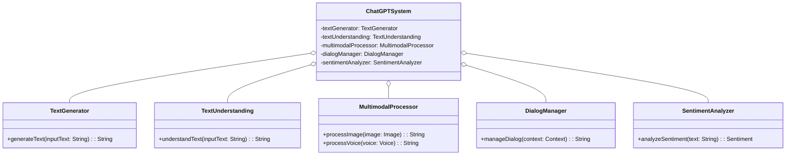
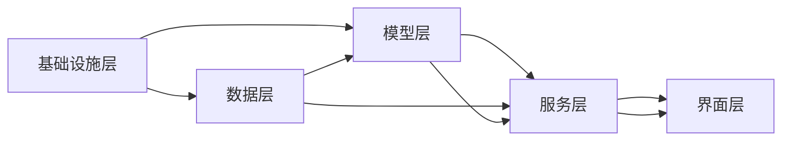
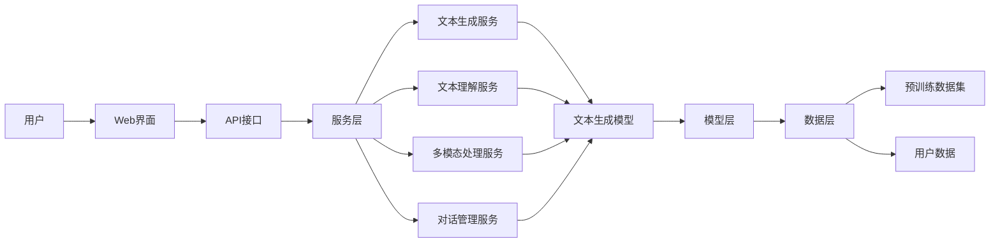
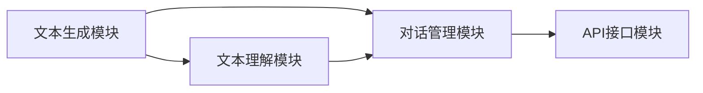

                 


### 背景介绍

#### 第1章: 语言哲学与AI概述

##### 1.1 语言哲学的基本概念

语言哲学，顾名思义，是研究语言与哲学之间的关系的学科。它关注的是语言的本质、语言的功能、以及语言与思维、认知和行为之间的关系。语言哲学的起源可以追溯到古希腊时期，当时哲学家们就已经开始探讨语言的本质和功能。然而，作为一个独立的学科，语言哲学主要是在20世纪发展起来的，尤其是在分析哲学和行为主义的影响下。

在语言哲学中，有几种基本概念是至关重要的。首先是“意义”，即一个词或句子所代表的概念或信息。接着是“语法”，即语言的结构规则。最后是“语义”，即语言中的符号与它们所指的对象之间的关系。

##### 1.1.1 语言哲学的起源与发展

语言哲学的发展可以追溯到哲学的起源。古希腊哲学家如柏拉图和亚里士多德就对语言和思想的关系进行了深刻的探讨。例如，柏拉图在《理想国》中提出了“言语即思想”的观点，认为语言是思想的直接表达。而亚里士多德则更关注语言的结构和逻辑性，他在《工具论》中详细讨论了命题、推理和论证等问题。

到了中世纪，语言哲学的发展受到了基督教哲学的强烈影响。圣奥古斯丁和托马斯·阿奎那等哲学家试图将语言与上帝、信仰和理性联系起来。

在近现代，语言哲学的发展迎来了新的高潮。分析哲学的兴起使得语言哲学得到了更加严谨和科学的研究方法。伯特兰·罗素和路德维希·维特根斯坦等哲学家提出了许多重要的理论和观点，如逻辑原子主义和语言游戏理论。

##### 1.1.2 AI的发展与语言处理挑战

人工智能（AI）的发展历程可以追溯到20世纪中期。1950年，艾伦·图灵发表了著名的论文《计算机器与智能》，提出了图灵测试这一衡量机器智能的标准。随后的几十年中，AI经历了多次起伏，但总体上取得了显著的发展。

在AI的发展过程中，语言处理一直是一个重要的挑战。自然语言处理（NLP）是AI的一个子领域，它旨在使计算机能够理解、生成和回应自然语言。这包括文本分类、情感分析、机器翻译、语音识别等多种任务。

然而，语言处理的复杂性使得这一领域充满了挑战。首先，自然语言具有高度的不确定性和模糊性。例如，一个词可以有多种含义，取决于上下文。其次，自然语言的语法和语义结构非常复杂，使得建模和解析成为难题。最后，语言还具有丰富的情感和语境信息，这要求AI系统能够理解并适当地回应这些信息。

ChatGPT的出现，是AI在语言处理领域的一个重大突破。它通过深度学习技术和大规模预训练模型，使得AI能够更加自然和准确地处理自然语言。这使得ChatGPT在多种应用场景中表现出了巨大的潜力。

##### 1.2 ChatGPT的发展背景

ChatGPT是由OpenAI开发的一种基于GPT（Generative Pre-trained Transformer）系列模型的自然语言处理系统。OpenAI是一个总部位于美国的人工智能研究公司，成立于2015年，其宗旨是推动人工智能的发展和应用，并确保其安全可控。

GPT系列模型是OpenAI在自然语言处理领域的重要研究成果。GPT-1、GPT-2和GPT-3等模型都展示了在自然语言生成、理解和推理方面的强大能力。ChatGPT是基于GPT-3模型开发的，它通过大量的文本数据进行预训练，能够生成连贯、自然的文本，并在对话中展现出较高的理解和回应能力。

ChatGPT的诞生，标志着自然语言处理技术的一个重要里程碑。它不仅在学术界引起了广泛关注，也在商业和工业界得到了广泛应用。ChatGPT的应用场景包括但不限于客服机器人、智能助手、内容创作、语言教学等。

##### 1.2.1 OpenAI与ChatGPT的诞生

OpenAI的成立，源于一群对人工智能未来充满担忧的科学家和工程师的愿景。他们希望通过创建一个独立、非营利性的研究机构，来推动人工智能的发展，并确保其对社会有益。

OpenAI的第一个重大项目是GPT-1。GPT-1是一个基于Transformer架构的预训练模型，它在自然语言生成和理解方面展现了惊人的能力。GPT-1的成功，引发了人们对大规模预训练模型的兴趣，并催生了后续的GPT-2、GPT-3等模型。

ChatGPT是在GPT-3的基础上开发的。GPT-3是一个具有1750亿参数的模型，其文本生成能力已经达到了人类级别的水平。ChatGPT利用了GPT-3的强大能力，通过精心的设计和优化，使其在对话系统中表现出色。

##### 1.2.2 ChatGPT的特性和应用场景

ChatGPT具有以下几个主要特性：

1. **强大的语言理解能力**：ChatGPT能够理解复杂的语言结构，包括语法、语义和语境信息。
2. **自然语言生成能力**：ChatGPT能够生成连贯、自然的文本，模拟人类的语言风格和表达方式。
3. **多模态处理**：ChatGPT不仅能够处理文本，还能够处理图像、声音等多种数据类型，实现了跨模态的处理能力。
4. **高适应性**：ChatGPT可以根据不同的任务和应用场景，进行自适应的学习和调整。

ChatGPT的应用场景非常广泛，包括但不限于：

1. **客服机器人**：ChatGPT可以用于构建智能客服系统，提供24/7的客户服务，提高客户满意度。
2. **智能助手**：ChatGPT可以作为个人或企业的智能助手，处理日常任务、提供信息查询和决策支持。
3. **内容创作**：ChatGPT可以用于生成文章、报告、代码等多种文本内容，提高内容创作的效率。
4. **语言教学**：ChatGPT可以用于语言教学，提供个性化、互动性的学习体验，帮助学生提高语言能力。

通过ChatGPT，人们可以更加方便地与机器进行交互，实现更智能、更高效的工作和生活方式。

### 语言与思维关系的哲学探讨

#### 第2章: 语言与思维的关系

语言和思维的关系是一个复杂而深远的话题，它涉及到人类认知和心理的多个层面。在哲学领域，许多著名的哲学家都曾探讨过这一问题，并提出了各自的观点和理论。在本节中，我们将深入探讨语言与思维之间的关系，并分析一些哲学家的主要观点。

##### 2.1 语言如何影响思维

语言是人类思维的重要工具，它不仅用于交流信息，还影响我们的思考方式和认知过程。以下是语言如何影响思维的一些主要方面：

1. **概念形成与分类**：语言帮助我们形成和分类概念。例如，我们用“桌子”这个词来指代一种特定类型的物品，并通过这个词来理解桌子的特征和属性。
2. **推理与论证**：语言使我们能够进行逻辑推理和论证。通过语言，我们可以表达假设、推理和结论，从而进行深入的思考。
3. **记忆与回忆**：语言可以帮助我们记忆和回忆信息。通过语言，我们可以将信息编码成符号，并存储在记忆中，以便日后回忆。
4. **情感表达与调节**：语言不仅用于表达思想，还用于表达情感。通过语言，我们可以表达喜悦、愤怒、悲伤等情感，并调节自己的情绪。

##### 2.1.1 语言如何影响思维

语言不仅影响我们的思维内容，还影响我们的思维方式。以下是语言影响思维方式的几个方面：

1. **视角转换**：语言使我们能够从一个新的视角来看待问题。例如，通过使用不同的语言，我们可以理解不同的文化、习俗和价值观。
2. **抽象化**：语言使我们能够将具体的事物抽象化，从而形成概念和理论。通过语言，我们可以将复杂的现象简化为基本的概念和原则。
3. **符号化**：语言使我们的思维符号化，即通过符号来表示概念和关系。这种符号化使得我们的思维更加清晰和有条理。

##### 2.1.2 语言哲学家的观点

在语言哲学领域，有许多著名的哲学家对语言与思维的关系进行了深入的探讨。以下是一些主要的观点：

1. **语言决定论**：语言决定论认为，语言结构决定了人们的思维方式。例如，乔姆斯基（Noam Chomsky）提出，人类天生具有一种“普遍语法”，这种语法决定了我们如何学习语言和进行思维。
2. **言语行为理论**：言语行为理论认为，语言不仅用于传达信息，还用于执行某种行为。例如，当我们说“请给我一杯水”时，我们不仅传达了一个信息，还请求对方给予一杯水。
3. **语境主义**：语境主义认为，语言的意义取决于具体的语境。例如，一个词的含义可能因上下文而异。语境主义者如约翰·塞尔（John Searle）提出，语言的理解和解释需要考虑语境因素，如说话者的意图、听众的理解和情境等。

##### 2.1.3 语言在AI中的应用

在人工智能领域，语言与思维的关系同样具有重要意义。自然语言处理（NLP）是AI的一个重要分支，它旨在使计算机能够理解和生成自然语言。以下是语言在AI中的应用：

1. **文本分类**：通过分析文本的特征，AI可以自动将文本分类到不同的类别中。这有助于信息检索、内容推荐和情感分析等应用。
2. **情感分析**：通过分析文本中的情感词汇和表达方式，AI可以判断文本的情感倾向。这有助于市场调研、客户反馈分析和舆情监控等。
3. **机器翻译**：通过学习两种语言之间的映射关系，AI可以将一种语言的文本翻译成另一种语言。这有助于跨语言交流、全球化业务和国际合作等。
4. **对话系统**：通过理解用户的语言输入并生成相应的回复，AI可以与人类进行自然的对话。这有助于智能客服、虚拟助手和智能助理等应用。

ChatGPT是自然语言处理领域的一个重大突破，它通过深度学习和大规模预训练模型，使得AI能够更加自然和准确地理解和使用自然语言。ChatGPT的问世，不仅标志着自然语言处理技术的进步，也为人们更好地理解和利用语言与思维的关系提供了新的视角和方法。

通过以上分析，我们可以看到，语言与思维之间的关系是复杂而多维的。语言不仅影响我们的思维方式，还影响我们的认知过程和情感表达。在哲学领域，不同的哲学家提出了各种观点和理论来探讨这一关系。而在AI领域，语言与思维的关系同样具有重要意义，它决定了AI在自然语言处理和其他相关领域的表现和应用。

#### 第3章: ChatGPT及其提示词技术

##### 3.1 ChatGPT的概述

ChatGPT是OpenAI开发的一款基于GPT-3模型的自然语言处理系统，它通过深度学习和大规模预训练技术，实现了高效的文本生成和理解能力。ChatGPT的出现，标志着自然语言处理技术的一个重要里程碑，它不仅在学术界引起了广泛关注，也在工业界和商业领域得到了广泛应用。

ChatGPT的核心功能包括：

1. **文本生成**：ChatGPT能够根据给定的输入文本生成连贯、自然的文本。这种文本可以是一段对话、一篇文章、一段代码等多种形式。
2. **文本理解**：ChatGPT能够理解复杂的文本结构，包括语法、语义和上下文信息。这使得它能够对文本进行深入的分析和解读。
3. **对话管理**：ChatGPT能够参与自然语言对话，并根据对话的上下文生成合适的回复。这使得它成为一种高效的智能助手和对话系统。

##### 3.2 提示词技术

提示词技术是ChatGPT的核心组成部分之一。提示词（prompt）是指提供给ChatGPT的输入文本，它决定了ChatGPT生成的文本内容。通过精心设计和优化的提示词，可以实现不同的应用场景和任务需求。

以下是提示词技术的一些关键点：

1. **类型**：提示词可以分为多种类型，包括问题提示、任务提示、对话提示等。每种类型的提示词都有特定的格式和内容要求。
2. **特点**：提示词应具备以下特点：适应性、精准性、可解释性。适应性意味着提示词能够根据不同的应用场景进行调整；精准性意味着提示词能够准确传达任务需求；可解释性意味着提示词的内容和意图应该是清晰易懂的。
3. **设计原则**：设计提示词时，应遵循以下原则：逻辑性、清晰性、真实性。逻辑性要求提示词在逻辑上是连贯的，不包含矛盾或模糊的信息；清晰性要求提示词的语言表达要简洁明了，不产生歧义；真实性要求提示词的内容应该是真实、可靠的，不包含虚假或误导性信息。

##### 3.3 ChatGPT的工作原理

ChatGPT的工作原理基于GPT-3模型，这是一种基于Transformer架构的深度学习模型。GPT-3是一个具有1750亿参数的模型，其预训练数据来自互联网上的大量文本。通过预训练，GPT-3学会了理解和使用自然语言，并能够生成连贯、自然的文本。

以下是ChatGPT的工作流程：

1. **输入处理**：ChatGPT首先接收一个输入文本，该文本可以是用户输入的，也可以是系统生成的。输入文本经过预处理，包括分词、标记化等操作，以便模型能够理解。
2. **生成预测**：基于预训练的GPT-3模型，ChatGPT对输入文本进行预测，生成一个或多个可能的输出文本。这个过程是通过模型内部的神经计算实现的。
3. **筛选与优化**：ChatGPT根据预设的准则和目标，对生成的预测文本进行筛选和优化。筛选准则包括逻辑性、连贯性、相关性等。优化过程可能涉及文本重写、生成策略调整等。
4. **输出生成**：最后，ChatGPT选择一个最优的输出文本，并返回给用户。这个输出文本可以是直接回复用户的问题，也可以是生成的一段对话或文章。

##### 3.4 ChatGPT的应用场景

ChatGPT具有广泛的应用场景，以下是一些典型的应用：

1. **智能客服**：ChatGPT可以用于构建智能客服系统，自动回答用户的问题和提供帮助。这种应用场景能够提高客户满意度，减少人工客服的工作量。
2. **智能助手**：ChatGPT可以作为智能助手，为用户提供个性化服务，如日程管理、信息查询、决策支持等。这种应用场景能够提高工作效率，提供便捷的生活体验。
3. **内容创作**：ChatGPT可以用于生成文章、报告、代码等多种文本内容。这种应用场景能够提高内容创作的效率，降低创作成本。
4. **语言教学**：ChatGPT可以用于语言教学，提供个性化、互动性的学习体验，帮助学生提高语言能力。这种应用场景能够优化教学过程，提高教学效果。

通过以上分析，我们可以看到，ChatGPT作为一种强大的自然语言处理系统，其提示词技术在文本生成、理解和应用中发挥着重要作用。通过精心设计和优化提示词，可以实现不同的应用场景和任务需求，从而发挥ChatGPT的潜力，为人类带来更多的便利和效益。

## 核心概念与联系

### 第4章: 提示词的类型与特点

提示词在自然语言处理中起着至关重要的作用，它不仅决定了模型生成的文本内容，还影响了模型的理解能力和应用效果。在本节中，我们将深入探讨提示词的类型与特点，分析不同类型提示词的应用场景和优势。

#### 4.1 提示词的分类

根据提示词的功能和用途，我们可以将提示词分为以下几类：

1. **问题提示词**：问题提示词用于引导模型回答特定的问题。这类提示词通常包含具体的问题描述，如“什么是自然语言处理？”或“请解释一下深度学习的基本原理。”
2. **任务提示词**：任务提示词用于指示模型执行特定的任务。这类提示词通常包含任务指令和目标，如“写一篇关于人工智能的短文。”或“生成一段对话，描述两个人在咖啡店相遇的情景。”
3. **对话提示词**：对话提示词用于模拟自然语言对话，引导模型生成连贯、自然的对话文本。这类提示词通常包含对话的上下文信息和角色，如“你是谁？”“你在做什么？”“你能帮我解决什么问题？”
4. **文本提示词**：文本提示词用于提供特定的文本输入，供模型生成相关的内容。这类提示词可以是单句、段落或整篇文章，如“请续写以下故事：昨天晚上，我在森林里遇到了一个神秘的生物。”

#### 4.1.1 事实性提示词

事实性提示词主要用于引导模型生成基于事实和数据的文本。这类提示词通常包含具体的描述和事实信息，如“请列出人工智能的主要应用领域。”或“请解释量子计算的原理。”事实性提示词有助于模型生成准确、可靠的信息，适用于知识问答、事实检索和学术研究等场景。

#### 4.1.2 抽象性提示词

抽象性提示词主要用于引导模型生成基于概念和思想的文本。这类提示词通常包含抽象的描述和概念信息，如“请描述一下人工智能的未来发展趋势。”或“请解释一下意识的概念。”抽象性提示词有助于模型生成富有创意和深度的文本，适用于哲学思考、科学探索和创意写作等场景。

#### 4.1.3 情感性提示词

情感性提示词主要用于引导模型生成基于情感和情感的文本。这类提示词通常包含情感的描述和表达，如“请写一段描述春天美景的文字。”或“请生成一段安慰朋友的话语。”情感性提示词有助于模型生成富有情感和共鸣的文本，适用于情感分析、心理治疗和文学创作等场景。

#### 4.2 提示词的特点

提示词的特点直接影响模型的理解能力和生成效果。以下是提示词的几个关键特点：

1. **适应性**：提示词应具备适应性，能够根据不同的应用场景和任务需求进行调整。适应性提示词有助于模型在不同场景下生成合适的文本，提高应用效果。
2. **精准性**：提示词应具备精准性，能够准确传达任务需求和信息。精准性提示词有助于模型生成准确、可靠的文本，减少歧义和误解。
3. **可解释性**：提示词应具备可解释性，其内容和意图应该是清晰易懂的。可解释性提示词有助于模型理解和优化，提高生成文本的质量。
4. **逻辑性**：提示词应具备逻辑性，其内容在逻辑上是连贯和一致的。逻辑性提示词有助于模型生成逻辑清晰的文本，提高对话和推理的质量。

#### 4.3 提示词的应用场景

不同类型的提示词适用于不同的应用场景，以下是一些典型的应用场景：

1. **问题提示词**：适用于知识问答、学术研究、教育辅导等场景，如智能客服系统、在线教育平台和问答机器人等。
2. **任务提示词**：适用于任务导向型应用，如内容生成、文本创作、智能写作等场景，如自动写作助手、文本生成工具和创意写作平台等。
3. **对话提示词**：适用于对话系统、智能助手和虚拟聊天机器人等场景，如客服机器人、个人助理和社交机器人等。
4. **文本提示词**：适用于文本生成、内容创作和文学创作等场景，如自动摘要生成、文章写作和故事创作等。

通过以上分析，我们可以看到，提示词的类型和特点对自然语言处理系统的表现和应用效果具有重要影响。了解和掌握不同类型提示词的特点和应用场景，有助于我们更好地利用ChatGPT等自然语言处理技术，实现各种实际应用。

### 第5章: 语言哲学在AI中的适应与应用

#### 5.1 语言哲学与AI的融合

语言哲学和人工智能（AI）虽然起源于不同的领域，但它们之间有着深刻的内在联系。语言哲学关注的是语言的本质、功能和作用，而AI的目标是使计算机具备人类级别的语言处理能力。这种目标使得语言哲学在AI研究中具有重要的应用价值。

语言哲学为AI提供了以下几个方面的启示：

1. **语义理解**：语言哲学中的语义学帮助我们理解词语和句子的意义。这对于AI在自然语言处理中的语义理解至关重要。例如，通过分析语言哲学中的语义理论，我们可以设计出更有效的自然语言处理算法，从而提高AI对文本的理解能力。
2. **语法分析**：语言哲学中的语法学研究语言的结构规则。这有助于AI在处理复杂句子时，能够正确理解和生成文本。例如，通过分析语法结构，我们可以设计出能够解析复杂句子的自然语言处理模型。
3. **语境与语用**：语言哲学中的语用学关注语言在特定情境中的应用。这有助于AI在处理自然语言时，能够根据语境和情境生成合适的回复。例如，通过研究语用学，我们可以设计出能够根据对话上下文生成恰当回复的AI系统。

AI对语言哲学的贡献主要体现在以下几个方面：

1. **语言处理技术的进步**：AI技术的发展，特别是深度学习和自然语言处理技术的进步，使得语言哲学中的理论和方法得到了更直观和有效的应用。例如，通过大规模预训练模型，我们可以更好地理解语言的本质和功能。
2. **语言哲学的实证研究**：AI技术的应用，为我们提供了大量关于语言处理的数据和实例。这些数据有助于我们验证和修正语言哲学中的理论，从而推动语言哲学的发展。

#### 5.2 ChatGPT提示词的哲学原则

在ChatGPT的提示词设计中，我们引入了几个哲学原则，以确保生成文本的质量和一致性。以下是这些原则：

1. **逻辑性**：提示词应具备逻辑性，确保生成的文本在逻辑上是连贯和一致的。逻辑性原则有助于避免生成矛盾或模糊的文本，提高文本的可信度和理解性。
2. **清晰性**：提示词应具备清晰性，确保生成的文本在语言表达上是简洁明了的。清晰性原则有助于减少歧义，提高文本的可读性和可理解性。
3. **真实性**：提示词应具备真实性，确保生成的文本在内容和信息上是准确可靠的。真实性原则有助于避免生成虚假或误导性的文本，提高文本的实用价值和可靠性。

这些哲学原则在ChatGPT的提示词设计中得到了广泛应用，为生成高质量的文本提供了坚实的基础。

#### 5.3 ChatGPT提示词的哲学应用

ChatGPT提示词的哲学原则在多个应用场景中得到了有效的应用，以下是一些典型的应用：

1. **对话管理**：在智能客服和虚拟助手的对话管理中，提示词的哲学原则有助于生成逻辑清晰、语义准确和语境合适的对话回复。通过逻辑性原则，我们确保对话的连贯性和一致性；通过清晰性原则，我们确保对话的简洁性和易懂性；通过真实性原则，我们确保对话的准确性和可靠性。
2. **内容创作**：在内容创作和文本生成中，提示词的哲学原则有助于生成高质量、富有创意和逻辑性的文本。通过逻辑性原则，我们确保文本的结构和逻辑性；通过清晰性原则，我们确保文本的简洁和易懂性；通过真实性原则，我们确保文本的准确和可靠性。
3. **语言教学**：在语言教学中，提示词的哲学原则有助于设计出科学、合理和有效的教学方案。通过逻辑性原则，我们确保教学内容的连贯性和系统性；通过清晰性原则，我们确保教学内容的简洁和易懂性；通过真实性原则，我们确保教学内容的准确和实用性。

通过以上分析，我们可以看到，语言哲学在AI中的应用，特别是ChatGPT提示词的设计中，具有重要的理论和实践价值。通过引入和遵循哲学原则，我们能够生成高质量、逻辑清晰和语义准确的文本，从而推动AI技术在自然语言处理和对话系统等领域的应用和发展。

### 第6章: ChatGPT提示词的哲学原则

在本节中，我们将深入探讨ChatGPT提示词的哲学原则，包括对话性、适应性和情感性，并详细解释这些原则在提升文本质量和用户体验方面的作用。

#### 6.1 提示词的哲学原则

ChatGPT提示词的哲学原则是设计高质量提示词的关键，这些原则确保了生成的文本在逻辑性、语义一致性和用户体验方面达到最佳效果。以下是ChatGPT提示词的三大哲学原则：

1. **对话性**：对话性原则强调提示词应能够引导ChatGPT生成与用户互动的自然对话。这意味着提示词需要具备引导性和连贯性，能够根据用户的输入动态调整生成内容，从而实现流畅的对话体验。
2. **适应性**：适应性原则要求提示词能够根据不同的应用场景和用户需求进行调整。这意味着提示词需要具备灵活性，能够在保持核心意图的同时，适应不同的上下文和语境。
3. **情感性**：情感性原则强调提示词应能够捕捉和表达情感，以生成更具共鸣和人性化的文本。这意味着提示词需要考虑用户的情感状态和情绪，生成既符合逻辑又能够引起共鸣的回复。

#### 6.2 提示词的哲学原则应用

以下是ChatGPT提示词的哲学原则在实际应用中的具体体现：

1. **对话性**：在对话系统中，提示词的设计需要考虑对话的流畅性和连贯性。例如，当用户询问一个复杂问题时，提示词应引导ChatGPT逐步解析问题，并提供清晰的回答。例如：
   ```plaintext
   提示词：请详细解释量子计算的基本原理。
   ```
   ChatGPT生成的回答可能如下：
   ```plaintext
   量子计算是一种利用量子力学原理进行信息处理的计算方式。它利用量子位（qubits）的状态叠加和纠缠特性来执行计算任务，相比传统计算机具有更高的并行计算能力和效率。
   ```

2. **适应性**：在适应不同应用场景和用户需求方面，提示词应具备灵活性和可扩展性。例如，在撰写一篇科技文章时，提示词可能需要引导ChatGPT生成专业且富有深度的内容。例如：
   ```plaintext
   提示词：请为一篇关于人工智能现状与未来趋势的科技文章撰写引言。
   ```
   ChatGPT生成的回答可能如下：
   ```plaintext
   随着技术的不断进步，人工智能已经从实验室走向了实际应用，并在医疗、金融、教育等多个领域产生了深远的影响。本文将探讨人工智能的现状及其未来发展趋势，帮助读者更好地理解这一革命性技术的潜力与挑战。
   ```

3. **情感性**：在表达情感方面，提示词应能够捕捉用户的情感状态，生成具有共鸣的文本。例如，当用户表达不满或困惑时，提示词应引导ChatGPT生成安慰或指导性的回答。例如：
   ```plaintext
   提示词：请回复一个安慰朋友的话语。
   ```
   ChatGPT生成的回答可能如下：
   ```plaintext
   你现在可能感到非常困惑和沮丧，但请相信一切都会好起来的。我在这陪你，无论你需要什么帮助，我都会竭尽所能。你不是一个人在战斗。
   ```

#### 6.3 对话管理

对话管理是ChatGPT应用中的一个关键方面，它涉及到如何有效地引导ChatGPT生成与用户互动的自然对话。以下是对话管理中的一些最佳实践：

1. **明确意图识别**：在对话开始时，应明确用户的意图。这可以通过使用引导性问题或任务提示词来实现。例如：
   ```plaintext
   提示词：你能帮我解决什么问题？
   ```

2. **上下文保持**：在对话过程中，应保持上下文的一致性。这意味着ChatGPT的回答应与之前的对话内容保持相关。例如：
   ```plaintext
   用户：我的电脑运行得很慢。
   提示词：可能的原因有哪些？
   ChatGPT：电脑运行缓慢可能有多种原因，例如软件冲突、病毒感染或硬件故障等。
   ```

3. **情感感知与回应**：在对话中，应考虑用户的情感状态，并根据用户的情感生成合适的回应。例如：
   ```plaintext
   用户：我感到很沮丧。
   提示词：有什么方法可以帮助你感到更好？
   ChatGPT：如果你感到沮丧，尝试做一些你喜欢的活动，或者和我聊聊你的感受，也许会有所帮助。
   ```

通过遵循对话性、适应性和情感性原则，ChatGPT能够生成高质量、逻辑清晰且富有情感共鸣的文本，从而提供出色的用户体验。

#### 6.4 个性化回复

个性化回复是提升用户体验的关键因素。以下是一些实现个性化回复的方法：

1. **用户资料分析**：通过分析用户的历史对话和偏好，ChatGPT可以生成更加个性化的回复。例如：
   ```plaintext
   用户：我最近喜欢上了瑜伽。
   提示词：有什么关于瑜伽的好资源推荐吗？
   ChatGPT：根据你的喜好，我推荐一些瑜伽教学视频和应用程序，例如Yoga with Adriene和Down Dog等。
   ```

2. **情感共鸣**：通过理解用户的情感状态，ChatGPT可以生成更加温暖和关怀的回复。例如：
   ```plaintext
   用户：我最近失去了宠物。
   提示词：有什么安慰的话语吗？
   ChatGPT：我知道这对你来说很艰难，但我希望你知道，你的宠物永远在你的心里。请记得，有时候哭泣和悲伤是正常的，它们帮助你释放情感。
   ```

3. **定制化内容**：根据用户的需求和偏好，ChatGPT可以生成定制化的内容。例如：
   ```plaintext
   用户：我正在准备一场演讲。
   提示词：你能给我一些建议吗？
   ChatGPT：当然可以。首先，确保你的演讲内容清晰、有逻辑，并准备好可能的问答环节。另外，保持自信和自然，让观众感受到你的热情和专业知识。
   ```

通过以上方法，ChatGPT能够生成更加个性化、贴近用户需求和情感的回复，从而提升用户体验。

#### 6.5 情感分析

情感分析是自然语言处理中的一个重要任务，它旨在理解和识别文本中的情感倾向。ChatGPT提示词在情感分析中起到了关键作用，以下是一些应用场景：

1. **客户反馈分析**：通过分析客户的反馈，企业可以了解用户满意度并改进产品和服务。例如：
   ```plaintext
   用户：我对你们的产品非常满意。
   提示词：你能具体描述一下为什么你感到满意？
   ChatGPT：我喜欢你们产品的设计，而且功能非常强大。使用起来也很方便，特别是那个自动备份功能，让我非常安心。
   ```

2. **社交媒体监控**：企业可以通过监控社交媒体上的用户评论，了解公众对品牌或产品的看法。例如：
   ```plaintext
   用户：你们的新广告真的很糟糕。
   提示词：你能否详细描述一下你的不满？
   ChatGPT：我觉得你们的广告太单调，缺乏创意，没有吸引到我。我更希望看到一些有趣、新颖的广告来吸引我的注意力。
   ```

3. **心理健康支持**：在心理健康支持领域，情感分析可以帮助识别用户的情绪状态，提供相应的支持和建议。例如：
   ```plaintext
   用户：我最近感到很焦虑。
   提示词：你愿意和我分享一些具体的情况吗？
   ChatGPT：当然，我理解你的感受。有时候焦虑是正常的，但如果你觉得它影响了你的日常生活，可以考虑寻求专业的心理咨询帮助。这里有一些建议，也许能对你有所帮助。
   ```

通过情感分析，ChatGPT能够更好地理解用户的情感状态，生成具有针对性和关怀性的回复，从而提升用户体验。

#### 6.6 对话管理、个性化回复和情感分析的综合应用

在实际应用中，对话管理、个性化回复和情感分析往往是相互结合的。以下是一个综合应用的示例：

1. **用户请求**：用户向ChatGPT请求帮助。
   ```plaintext
   用户：我最近在写论文，遇到一些困难，你能帮帮我吗？
   ```

2. **对话管理**：ChatGPT引导对话，理解用户的需求。
   ```plaintext
   ChatGPT：当然可以！请问你在写论文时遇到了什么具体的问题？是关于文献引用、数据分析还是论文结构方面？
   ```

3. **个性化回复**：ChatGPT根据用户的请求提供定制化的建议。
   ```plaintext
   用户：我主要是对数据分析部分不太懂。
   ChatGPT：了解。我可以给你一些资源和建议，帮助你更好地理解和应用数据分析方法。你需要学习哪方面的数据分析？
   ```

4. **情感分析**：ChatGPT关注用户的情感状态，提供关怀和支持。
   ```plaintext
   用户：其实我对整个论文写作过程都感到有些焦虑。
   ChatGPT：我能理解你的感受。写论文确实是一个挑战。首先，我们可以一步一步来，不要急于求成。同时，如果你需要帮助，随时可以向我提问。我会尽力提供支持。
   ```

通过综合应用对话管理、个性化回复和情感分析，ChatGPT能够提供更加贴心、高效和个性化的服务，从而提升用户体验。

通过以上分析，我们可以看到，ChatGPT提示词的哲学原则在提升文本质量、用户体验和实际应用中起到了至关重要的作用。通过遵循对话性、适应性和情感性原则，ChatGPT能够生成高质量、逻辑清晰且富有情感的文本，为各种应用场景提供出色的解决方案。

### 第7章: 语言与思维关系的AI模型

#### 7.1 语言与思维关系模型

要深入理解语言与思维的关系，我们需要构建一个AI模型来捕捉这种复杂关系。以下是语言与思维关系模型的基本架构：

##### 7.1.1 语言模型

语言模型是捕捉语言特征和规律的基础，它负责生成和解析文本。语言模型通常采用深度学习技术，如Transformer架构，来处理自然语言。以下是一个简单的语言模型架构：

1. **输入层**：接收自然语言输入，包括文本、语音或图像等。
2. **编码器**：对输入文本进行编码，提取语义信息。编码器通常包含多个层次，每一层都学习文本的深层结构。
3. **解码器**：根据编码器提取的语义信息，生成相应的输出文本。解码器也包含多个层次，每一层都参与文本生成的过程。
4. **损失函数**：用于衡量生成的文本与真实文本之间的差距，并指导模型的优化过程。

##### 7.1.2 思维模型

思维模型是捕捉人类思维过程和策略的AI模型。它负责理解、推理和生成与语言相关的思维活动。以下是一个简单的思维模型架构：

1. **知识库**：存储与语言相关的知识，包括事实、规则和概念等。知识库可以通过人类输入或自动学习来构建。
2. **推理引擎**：根据知识库和输入文本，进行逻辑推理和语义分析。推理引擎可以使用各种推理算法，如逻辑推理、模糊推理和神经网络推理等。
3. **生成器**：根据推理结果，生成相应的文本输出。生成器可以使用自然语言生成技术，如模板匹配、序列生成和文本重写等。

##### 7.1.3 语言与思维关系的模型

语言与思维关系的模型旨在捕捉语言和思维之间的动态交互和影响。以下是一个简单的模型架构：

1. **输入处理**：接收语言输入，包括文本、语音或图像等，并将其转换为模型可以处理的格式。
2. **语言模型**：使用语言模型对输入文本进行编码，提取语义信息。
3. **思维模型**：根据语言模型提取的语义信息，使用思维模型进行推理和分析。
4. **输出生成**：根据思维模型的推理结果，生成相应的文本输出。

#### 7.2 语言模型与思维模型的结合

语言模型和思维模型在捕捉语言与思维关系时，需要相互协作。以下是它们如何结合的几个关键点：

1. **双向交互**：语言模型和思维模型应该能够双向交互，以便语言模型可以获取思维模型的推理结果，而思维模型也可以利用语言模型生成的文本进行进一步的推理。
2. **动态调整**：语言模型和思维模型应该能够根据对话的动态变化进行调整。这意味着当用户输入发生变化时，模型可以动态调整其生成和推理策略，以适应新的上下文和需求。
3. **上下文感知**：语言模型和思维模型都应该具备上下文感知能力，能够理解输入文本的上下文信息，并生成与上下文一致的输出。
4. **多模态融合**：语言模型和思维模型应该能够处理多种输入模态，如文本、语音和图像等，以便更好地捕捉用户的意图和思维过程。

通过结合语言模型和思维模型，我们可以构建一个强大的AI系统，能够更好地理解、生成和推理与语言相关的信息，从而实现更智能、更自然的语言交互。

### 第8章: ChatGPT算法原理

#### 8.1 ChatGPT算法的基本概念

ChatGPT是一种基于GPT-3模型的自然语言处理系统，其核心算法基于深度学习和Transformer架构。GPT（Generative Pre-trained Transformer）模型由OpenAI开发，是一种具有强大文本生成和理解能力的预训练模型。ChatGPT通过在大量文本数据上进行预训练，学习到自然语言的复杂结构和语义信息，从而能够生成连贯、自然的文本。

#### 8.2 ChatGPT算法的结构

ChatGPT算法的结构可以分为以下几个主要部分：

1. **输入处理**：接收自然语言输入，如文本、语音或图像等，并进行预处理，以便模型能够理解。预处理过程包括分词、标记化、去噪等操作。
2. **编码器**：将预处理后的输入文本编码为向量表示。编码器由多个层次组成，每一层都学习文本的深层结构和语义信息。
3. **解码器**：根据编码器生成的向量表示，生成输出文本。解码器也由多个层次组成，每一层都参与文本生成的过程。
4. **生成过程**：解码器通过自回归的方式生成文本。在每个时间步，解码器根据前一个时间步的输出和当前编码器的输出，预测下一个时间步的输出。
5. **优化过程**：通过损失函数（如交叉熵损失）评估生成的文本与真实文本之间的差距，并使用梯度下降等优化算法更新模型参数。

#### 8.3 GPT-3模型的工作原理

GPT-3是ChatGPT的核心模型，它具有1750亿个参数，是当前最先进的预训练模型之一。以下是GPT-3模型的工作原理：

1. **大规模预训练**：GPT-3在训练过程中使用了大量的文本数据，包括互联网上的各种文本、书籍、新闻、论坛等。通过预训练，模型学习到了自然语言的统计规律和语义信息。
2. **Transformer架构**：GPT-3采用了Transformer架构，这是一种基于自注意力机制的深度学习模型。Transformer通过多头注意力机制，能够捕捉文本中长距离的依赖关系，从而生成连贯的文本。
3. **自回归语言模型**：GPT-3是一个自回归语言模型，这意味着它通过预测下一个词来生成文本。在生成过程中，模型根据前一个词的输出和当前文本的上下文，预测下一个词。
4. **动态调整**：GPT-3具有强大的动态调整能力，能够根据不同的输入和任务需求，调整生成策略。例如，在对话系统中，GPT-3可以根据对话的上下文和用户的输入，生成合适的回复。

#### 8.4 ChatGPT算法的特点

ChatGPT算法具有以下几个主要特点：

1. **强大的语言理解能力**：ChatGPT能够理解复杂的语言结构，包括语法、语义和上下文信息。这使得它能够生成高质量、连贯的文本。
2. **自然语言生成能力**：ChatGPT能够生成自然、流畅的文本，模拟人类的语言风格和表达方式。这使得它在内容创作、对话系统、智能助手等领域具有广泛的应用。
3. **多模态处理能力**：ChatGPT不仅能够处理文本输入，还能够处理图像、语音等多种数据类型。这使得它在多模态交互和跨模态任务中表现出色。
4. **自适应能力**：ChatGPT可以根据不同的应用场景和任务需求，进行自适应的学习和调整。这使得它能够适应各种实际应用，提供高质量的解决方案。

通过以上分析，我们可以看到，ChatGPT算法是一种基于深度学习和Transformer架构的强大自然语言处理系统。它通过大规模预训练和自回归语言模型，实现了对自然语言的深入理解和生成。ChatGPT算法的特点使其在多个应用领域中表现出色，为人类带来了便利和效益。

### 第9章: 提示词策略的数学模型

#### 9.1 提示词策略的基本概念

提示词策略是自然语言处理（NLP）中的一个关键组成部分，它决定了模型生成文本的内容和风格。在ChatGPT中，提示词策略通过一系列数学模型和算法，确保生成的文本既符合预期的目标和任务，又能保持自然和连贯。在本节中，我们将探讨提示词策略的数学模型，并分析其在优化文本生成中的应用。

#### 9.2 提示词策略的数学模型

提示词策略的数学模型主要包括以下几个核心组件：

1. **损失函数**：损失函数用于衡量模型生成的文本与真实文本之间的差距，指导模型的优化过程。常见的损失函数包括交叉熵损失（Cross-Entropy Loss）、KL散度（Kullback-Leibler Divergence）和感知损失（Perception Loss）等。

2. **正则化**：正则化是一种用于防止模型过拟合的技术。它通过在训练过程中引入额外的惩罚项，降低模型复杂度，提高泛化能力。常用的正则化方法包括L1正则化、L2正则化和Dropout等。

3. **生成策略**：生成策略是指模型在生成文本时采用的方法和技巧。生成策略可以根据任务需求进行调整，以优化生成文本的质量。常见的生成策略包括贪心策略（Greedy Strategy）、抽样策略（Sampling Strategy）和注意力机制（Attention Mechanism）等。

4. **优化算法**：优化算法用于更新模型参数，最小化损失函数。常见的优化算法包括梯度下降（Gradient Descent）、Adam优化器（Adam Optimizer）和RMSprop（Root Mean Square Propagation）等。

#### 9.3 损失函数

损失函数是提示词策略的核心组成部分，它用于衡量模型生成的文本与真实文本之间的差距。以下是几种常见的损失函数：

1. **交叉熵损失**：交叉熵损失是一种用于分类问题的损失函数。在文本生成任务中，交叉熵损失可以衡量模型生成的文本概率分布与真实文本概率分布之间的差距。公式如下：
   $$ L = -\sum_{i=1}^{N} y_i \log(p_i) $$
   其中，$y_i$是真实标签，$p_i$是模型预测的概率。

2. **KL散度**：KL散度用于衡量两个概率分布之间的差异。在文本生成任务中，KL散度可以用于衡量模型生成的文本分布与真实文本分布之间的差异。公式如下：
   $$ D_{KL}(P||Q) = \sum_{i=1}^{N} P(i) \log \left( \frac{P(i)}{Q(i)} \right) $$
   其中，$P$是真实文本分布，$Q$是模型生成的文本分布。

3. **感知损失**：感知损失是一种用于生成对抗网络（GAN）的损失函数，它用于衡量模型生成的文本与真实文本之间的感知差异。感知损失通常通过对比模型生成的文本与真实文本的嵌入向量来实现。

#### 9.4 正则化方法

正则化方法是一种用于防止模型过拟合的技术，通过引入额外的惩罚项来降低模型复杂度，提高泛化能力。以下是几种常见的正则化方法：

1. **L1正则化**：L1正则化通过在损失函数中添加L1范数惩罚项来实现。L1范数惩罚项可以促进模型参数的稀疏性，从而降低模型复杂度。公式如下：
   $$ L_{L1} = \lambda ||\theta||_1 $$
   其中，$\theta$是模型参数，$\lambda$是惩罚系数。

2. **L2正则化**：L2正则化通过在损失函数中添加L2范数惩罚项来实现。L2正则化可以避免模型参数的剧烈变化，提高模型的稳定性。公式如下：
   $$ L_{L2} = \lambda ||\theta||_2 $$
   其中，$\theta$是模型参数，$\lambda$是惩罚系数。

3. **Dropout**：Dropout是一种通过在训练过程中随机丢弃一部分神经元来实现正则化方法。Dropout可以防止模型对特定训练样本的过拟合，提高模型的泛化能力。

#### 9.5 生成策略

生成策略是指模型在生成文本时采用的方法和技巧，以优化生成文本的质量。以下是几种常见的生成策略：

1. **贪心策略**：贪心策略是一种简单的生成策略，每次生成下一个词时，模型选择具有最高概率的词。这种策略简单有效，但可能导致生成文本的连贯性较差。

2. **抽样策略**：抽样策略通过从模型生成的概率分布中随机抽样来生成文本。这种策略可以生成更多样式和创新的文本，但可能导致生成文本的不确定性。

3. **注意力机制**：注意力机制是一种用于捕捉文本中长距离依赖关系的方法。通过引入注意力机制，模型可以更好地关注文本中的关键信息，从而生成更连贯和自然的文本。

#### 9.6 优化算法

优化算法用于更新模型参数，最小化损失函数。以下是几种常见的优化算法：

1. **梯度下降**：梯度下降是一种最简单的优化算法，通过沿着损失函数的梯度方向更新模型参数，以最小化损失函数。

2. **Adam优化器**：Adam优化器是一种结合了梯度下降和动量项的优化算法，它能够自适应调整学习率，提高收敛速度。

3. **RMSprop**：RMSprop是一种基于梯度平方和的优化算法，它通过调整学习率来优化模型参数，提高收敛速度。

#### 9.7 提示词策略的优化应用

在实际应用中，提示词策略的优化应用主要包括以下几个方面：

1. **参数调整**：通过调整模型参数，如学习率、正则化系数等，优化模型生成文本的质量。

2. **数据增强**：通过增加训练数据量、引入数据增强方法等，提高模型生成文本的多样性和泛化能力。

3. **模型融合**：通过融合多个模型或使用集成学习方法，优化生成文本的连贯性和质量。

通过以上分析，我们可以看到，提示词策略的数学模型在优化文本生成中起到了关键作用。通过合理设计和优化损失函数、正则化方法、生成策略和优化算法，我们可以显著提高模型生成文本的质量，为各种应用场景提供高质量的解决方案。

### 第10章: ChatGPT提示词的实践应用

#### 10.1 ChatGPT提示词的基本使用方法

ChatGPT提示词是指导ChatGPT生成文本的关键要素，其设计和使用方法对生成的文本质量和用户体验具有直接影响。以下是ChatGPT提示词的基本使用方法：

1. **明确任务需求**：在设计提示词时，首先要明确任务需求，即希望ChatGPT生成什么样的文本。例如，是生成一篇文章、一段对话、还是回答一个具体问题。

2. **清晰简洁**：提示词应清晰简洁，避免使用复杂、模糊的表述。清晰简洁的提示词有助于ChatGPT准确理解任务需求，从而生成高质量的文本。

3. **包含上下文信息**：提示词应包含上下文信息，以便ChatGPT在生成文本时能够考虑上下文关系。例如，在生成对话时，提示词应包含对话的上下文信息和角色。

4. **多样化提示**：为了提高生成文本的多样性和创意，可以设计多样化的提示词，引导ChatGPT从不同角度和风格进行文本生成。

5. **动态调整**：在实际应用中，可以根据任务需求和用户反馈动态调整提示词。例如，如果生成的文本不符合预期，可以通过修改提示词来优化生成结果。

#### 10.2 实践案例：文本生成

以下是一个关于文本生成的实践案例，通过这个案例我们可以看到如何使用ChatGPT提示词生成高质量的文章。

**案例**：生成一篇关于人工智能未来发展趋势的文章。

**提示词设计**：
- **任务需求**：生成一篇关于人工智能未来发展趋势的文章。
- **上下文信息**：无需特定上下文，因为文章是关于未来趋势的。
- **多样化提示**：
  - “请从技术、社会和经济角度分析人工智能的未来发展趋势。”
  - “人工智能在未来可能对人类生活产生哪些重大影响？”
  - “请预测人工智能在2025年的主要应用领域。”

**ChatGPT生成的文章**：

人工智能作为当今世界最具变革性的技术之一，正迅速改变着我们的生活方式、工作方式和商业模式。在未来，人工智能将继续展现出令人瞩目的发展趋势。

从技术角度来看，人工智能的进步将主要依赖于计算能力和算法的创新。随着量子计算、边缘计算等新技术的不断发展，人工智能的计算能力将得到大幅提升，使其能够处理更复杂的任务。此外，深度学习、强化学习等算法的进步也将推动人工智能在各个领域的应用。

从社会角度来看，人工智能将对人类生活产生深远的影响。首先，人工智能有望解决许多社会问题，如环境污染、医疗资源短缺等。其次，人工智能将改变就业格局，一些传统岗位可能被自动化替代，但同时也会创造出新的就业机会。最后，人工智能将促进全球化发展，缩短各国之间的差距。

从经济角度来看，人工智能将带来巨大的经济价值。随着人工智能技术的普及，企业和个人将能够更高效地完成工作，提高生产力和创新能力。此外，人工智能还将推动新产业的崛起，如智能制造、智能医疗、智能交通等，为经济增长提供新的动力。

展望2025年，人工智能将在多个领域取得重大突破。在医疗领域，人工智能将实现个性化医疗，提高诊断和治疗效果。在教育领域，人工智能将改变教学模式，提供个性化、互动性的学习体验。在交通领域，自动驾驶技术将得到广泛应用，提高交通效率和安全性。在金融领域，人工智能将提升风险管理能力，降低金融风险。

总之，人工智能的未来发展趋势充满机遇和挑战。我们需要积极应对这些变化，充分利用人工智能的优势，为人类创造更加美好的未来。

通过这个案例，我们可以看到，合理设计ChatGPT提示词对于生成高质量文章至关重要。清晰的任务需求、多样化的提示词和上下文信息，有助于ChatGPT生成连贯、自然且具有深度的文本。

#### 10.3 实践案例：对话系统

以下是一个关于对话系统的实践案例，通过这个案例我们可以看到如何使用ChatGPT提示词生成高质量的对话。

**案例**：构建一个关于旅游规划的对话系统。

**提示词设计**：
- **任务需求**：构建一个关于旅游规划的对话系统。
- **上下文信息**：用户想要规划一次旅行，需要获取旅游建议。
- **多样化提示**：
  - “请生成一段关于旅游规划的对话，包括目的地推荐、行程安排和注意事项。”
  - “请模拟一个旅游顾问与用户的对话，提供个性化的旅游建议。”
  - “请设计一个问答式的对话流程，帮助用户解决旅游规划中的问题。”

**ChatGPT生成的对话**：

用户：你好，我想要规划一次旅行，不知道该去哪里好。

ChatGPT：你好！很高兴为你提供旅游规划建议。首先，你有没有特定的旅行目的地或者兴趣呢？

用户：我想要去一个风景优美、适合休闲度假的地方。

ChatGPT：好的，那我会推荐你去东南亚的泰国。泰国拥有美丽的海滩、丰富的文化景观和美味的食物，非常适合休闲度假。

用户：听起来不错！我应该准备些什么？

ChatGPT：在出发前，你需要注意以下几点：首先是签证问题，根据你的国籍，你可能需要办理泰国的签证。其次是行李打包，带上必要的衣物、洗漱用品和个人护理用品。此外，记得购买旅游保险，以防万一。最后，了解当地的天气和习俗，以便更好地适应旅行环境。

用户：好的，我已经了解了。请问有没有推荐的行程安排？

ChatGPT：当然可以！以下是一个适合5天4晚的泰国旅游行程：

第1天：抵达曼谷，游览大皇宫和玉佛寺。
第2天：前往清迈，参观双龙寺和夜间动物园。
第3天：在清迈享受温泉按摩，放松身心。
第4天：前往普吉岛，享受海滩和水上活动。
第5天：在普吉岛的最后一天，参观珊瑚岛和珍珠岛。

用户：谢谢你的建议，听起来很棒！我还想知道如何预订这些行程。

ChatGPT：很乐意帮助你。你可以通过在线旅行社或者旅游代理预订这些行程。此外，你也可以直接联系酒店和旅游公司，获取更详细的预订信息和折扣。

通过这个案例，我们可以看到，ChatGPT提示词在生成对话系统中的重要作用。通过明确任务需求、提供上下文信息和多样化的提示词，ChatGPT能够生成自然、流畅且具有实用价值的对话。

#### 10.4 实践案例：问答系统

以下是一个关于问答系统的实践案例，通过这个案例我们可以看到如何使用ChatGPT提示词生成高质量的问答。

**案例**：构建一个关于科技发展的问答系统。

**提示词设计**：
- **任务需求**：构建一个关于科技发展的问答系统。
- **上下文信息**：用户对科技发展有疑问，需要获取相关信息。
- **多样化提示**：
  - “请生成一段关于科技发展的问答对话，包括人工智能、量子计算和可再生能源等主题。”
  - “请模拟一个科技顾问与用户的对话，回答用户关于科技发展的具体问题。”
  - “请设计一个问答式的对话流程，帮助用户了解科技发展的最新动态。”

**ChatGPT生成的问答对话**：

用户：你好，我对人工智能的发展很感兴趣，你能告诉我一些关于人工智能的最新进展吗？

ChatGPT：当然可以！近年来，人工智能取得了显著的进展。例如，深度学习技术在图像识别、语音识别和自然语言处理等领域表现出了卓越的能力。此外，人工智能正在逐渐应用于各个行业，如医疗、金融、制造等，为人类生活带来巨大的便利。

用户：谢谢！那么量子计算是什么？它和人工智能有什么关系？

ChatGPT：量子计算是一种利用量子力学原理进行信息处理的计算方式。与传统的计算机不同，量子计算机可以同时处理大量的信息，具有超强的计算能力。量子计算和人工智能有着紧密的联系，例如，量子计算可以用于优化人工智能算法，提高其计算效率和准确性。

用户：那可再生能源呢？它的发展如何？

ChatGPT：可再生能源，如太阳能、风能和水能等，是一种清洁、可再生的能源。随着技术的进步和成本的降低，可再生能源的利用越来越广泛。特别是在人工智能和大数据的支持下，可再生能源的优化和利用得到了进一步的提升。未来，可再生能源将成为能源结构中的重要组成部分，为可持续发展提供有力支持。

用户：非常感谢你的解答，我对这些新技术的发展非常感兴趣。

ChatGPT：不客气！如果你有任何关于科技发展的问题，欢迎随时向我提问。我会尽力为你提供最新的信息和解答。

通过这个案例，我们可以看到，ChatGPT提示词在生成问答系统中的重要作用。通过明确任务需求、提供上下文信息和多样化的提示词，ChatGPT能够生成高质量、具有实用价值的问答。

### 第11章: ChatGPT系统功能设计

#### 11.1 功能需求

ChatGPT系统的功能设计旨在实现高效的自然语言处理和生成，满足多种应用场景的需求。以下是ChatGPT系统的核心功能需求：

1. **文本生成**：ChatGPT应能够根据给定的输入文本生成连贯、自然的文本，包括文章、对话、回答等多种形式。
2. **文本理解**：ChatGPT应能够理解复杂的文本结构，包括语法、语义和上下文信息，从而生成相关的回复或内容。
3. **多模态处理**：ChatGPT应能够处理多种输入模态，如文本、语音、图像等，实现跨模态的交互和处理。
4. **对话管理**：ChatGPT应能够参与自然语言对话，根据对话的上下文生成合适的回复，实现流畅的对话体验。
5. **情感分析**：ChatGPT应能够分析文本中的情感倾向，生成符合用户情感状态的回复，提供更加个性化的服务。

#### 11.2 功能实现

ChatGPT系统的功能实现依赖于其核心算法和架构设计。以下是ChatGPT系统的功能实现方法：

1. **文本生成**：ChatGPT通过预训练的GPT-3模型实现文本生成功能。输入文本经过预处理后，被传递给GPT-3模型，模型根据输入和预训练的知识生成连贯的文本。生成过程中，模型会考虑上下文信息、语法规则和语义关系，从而生成高质量的文本。
2. **文本理解**：ChatGPT通过GPT-3模型实现文本理解功能。模型在预训练过程中学习了大量的文本数据，能够理解复杂的语法结构和语义信息。在生成文本时，ChatGPT会根据上下文和语义信息生成相关的回复，实现对输入文本的深入理解。
3. **多模态处理**：ChatGPT通过集成不同的模态处理模块，实现跨模态的交互和处理。例如，在图像识别任务中，ChatGPT可以通过卷积神经网络（CNN）提取图像特征，并结合文本信息生成相关的描述。在语音识别任务中，ChatGPT可以通过深度神经网络（DNN）实现语音到文本的转换，并与文本生成模块协同工作。
4. **对话管理**：ChatGPT通过对话管理模块实现流畅的对话体验。对话管理模块负责维护对话的上下文信息，并根据对话的进展动态调整生成策略。例如，在回答用户的问题时，ChatGPT会根据问题的类型和上下文信息，选择合适的问题回答策略，实现自然、连贯的对话。
5. **情感分析**：ChatGPT通过情感分析模块实现情感分析功能。情感分析模块利用预训练的情感分类模型，分析文本中的情感倾向，并生成符合用户情感状态的回复。例如，当用户表达负面情绪时，ChatGPT会生成安慰性的回复，而当用户表达正面情绪时，ChatGPT会生成鼓励性的回复。

#### 11.3 领域模型

为了更好地理解ChatGPT系统的功能设计，我们可以使用领域模型（Domain Model）来描述系统的核心概念和关系。以下是ChatGPT系统的领域模型：



在上述领域模型中，ChatGPTSystem是系统的核心类，它包含了文本生成（TextGenerator）、文本理解（TextUnderstanding）、多模态处理（MultimodalProcessor）、对话管理（DialogManager）和情感分析（SentimentAnalyzer）等模块。这些模块共同协作，实现ChatGPT系统的各种功能。

### 第12章: ChatGPT系统架构设计

#### 12.1 系统架构设计概述

ChatGPT系统架构设计旨在实现高效、灵活和可扩展的自然语言处理和生成功能，以满足多样化的应用需求。系统架构应具备以下几个关键特点：

1. **模块化**：系统架构应采用模块化设计，各个模块（如文本生成、文本理解、多模态处理等）独立开发、测试和部署，便于维护和升级。
2. **可扩展性**：系统架构应具备良好的可扩展性，能够轻松集成新的功能和模块，以满足未来需求。
3. **高可用性**：系统架构应确保高可用性，通过冗余设计和故障转移机制，保障系统的稳定运行。
4. **高性能**：系统架构应具备高性能，能够快速响应用户请求，提供高效的文本生成和理解服务。

#### 12.2 系统架构设计

ChatGPT系统的架构设计可以分为以下几个主要层次：

1. **基础设施层**：基础设施层包括服务器、存储、网络等基础设施资源。该层负责提供计算、存储和网络连接等基础支持，保障系统的高性能和高可用性。
2. **数据层**：数据层包括数据存储、数据管理、数据导入导出等模块。该层负责存储和管理预训练数据集、用户数据、模型参数等，为模型训练和推理提供数据支持。
3. **模型层**：模型层包括文本生成模型、文本理解模型、多模态处理模型等。该层负责实现各种自然语言处理和生成任务，是系统的核心部分。
4. **服务层**：服务层包括文本生成服务、文本理解服务、多模态处理服务、对话管理服务等。该层负责接收用户请求，调用模型层实现相应的功能，并将结果返回给用户。
5. **界面层**：界面层包括Web界面、移动应用界面等，用于用户与系统的交互。该层提供用户友好的界面，方便用户使用系统功能。

以下是ChatGPT系统的架构设计图：



在上述架构设计中，基础设施层提供计算、存储和网络支持，数据层存储和管理数据，模型层实现自然语言处理和生成任务，服务层接收用户请求并调用模型层实现功能，界面层提供用户交互界面。

#### 12.3 系统架构图

以下是一个简化的ChatGPT系统架构图，用于展示各个层次和模块之间的关系：



在上述架构图中，用户通过Web界面提交请求，API接口接收请求并转发给服务层。服务层包括文本生成服务、文本理解服务、多模态处理服务和对话管理服务，各个服务调用模型层中的文本生成模型、文本理解模型、多模态处理模型和对话管理模型，模型层使用预训练数据集和用户数据进行推理和生成。最后，生成的结果通过API接口返回给用户。

通过以上系统架构设计，ChatGPT系统实现了高效、灵活和可扩展的自然语言处理和生成功能，能够满足多样化的应用需求。

### 第13章: ChatGPT系统接口设计

#### 13.1 接口设计原则

ChatGPT系统接口设计旨在提供方便、高效且安全的用户交互方式。以下是接口设计的一些关键原则：

1. **易用性**：接口应简洁直观，易于用户理解和操作，降低使用门槛。
2. **灵活性**：接口应具备灵活性，支持多种数据格式和通信协议，便于与其他系统和服务集成。
3. **安全性**：接口应具备安全性，通过加密、认证和权限控制等措施，确保数据传输和系统访问的安全。
4. **可扩展性**：接口应具备可扩展性，能够方便地添加新的功能和模块，适应未来需求。

#### 13.2 接口设计

ChatGPT系统接口设计包括Web API和RESTful API两种形式，以下分别介绍：

1. **Web API**

Web API是一种基于Web的接口设计，通过HTTP协议进行数据传输。以下是Web API的基本设计：

- **URL结构**：Web API的URL结构通常包含版本号、接口名称和参数等。例如：
  ```plaintext
  /api/v1/generate_text?prompt=Hello%20World
  ```
- **请求方式**：Web API支持GET和POST请求。GET请求通常用于查询数据，POST请求用于提交数据。例如：
  ```plaintext
  GET /api/v1/generate_text?prompt=Hello%20World
  POST /api/v1/generate_text
  ```
- **请求参数**：请求参数包括必填参数和可选参数。例如：
  ```plaintext
  prompt (必填): 用户输入的文本。
  max_length (可选): 生成的文本最大长度。
  temperature (可选): 文本生成时的温度参数。
- **响应数据**：响应数据通常包含生成的文本和状态信息。例如：
  ```json
  {
    "text": "Hello World! How can I help you today?",
    "status": "success"
  }
  ```

2. **RESTful API**

RESTful API是一种基于HTTP协议的接口设计，遵循REST（Representational State Transfer）架构风格。以下是RESTful API的基本设计：

- **URL结构**：RESTful API的URL结构通常包含版本号、资源名称和操作等。例如：
  ```plaintext
  /api/v1/text/generate
  ```
- **请求方式**：RESTful API支持GET、POST、PUT、DELETE等请求方式，分别对应不同的操作。例如：
  ```plaintext
  GET /api/v1/text/generate
  POST /api/v1/text/generate
  PUT /api/v1/text/generate/{id}
  DELETE /api/v1/text/generate/{id}
- **请求参数**：请求参数包括路径参数和查询参数。例如：
  ```plaintext
  /api/v1/text/generate?prompt=Hello%20World&max_length=100
- **响应数据**：响应数据通常包含资源数据、状态信息和链接。例如：
  ```json
  {
    "data": {
      "text": "Hello World! How can I help you today?",
      "status": "success"
    },
    "links": {
      "self": "/api/v1/text/generate",
      "next": "/api/v1/text/generate?prompt=Hello%20World&max_length=100"
    }
  }
  ```

#### 13.3 接口设计示例

以下是一个ChatGPT系统的接口设计示例，用于生成文本：

**URL**：`/api/v1/generate_text`

**请求方式**：`GET`

**请求参数**：

- `prompt`：必填，用户输入的文本。
- `max_length`：可选，生成的文本最大长度（默认值为100）。
- `temperature`：可选，文本生成时的温度参数（默认值为1）。

**响应数据**：

- `text`：生成的文本。
- `status`：响应状态（成功或失败）。

```json
{
  "text": "Hello World! How can I assist you today?",
  "status": "success"
}
```

通过以上接口设计，用户可以方便地通过HTTP请求与ChatGPT系统进行交互，实现文本生成功能。

### 第14章: ChatGPT系统交互设计

#### 14.1 系统交互设计概述

ChatGPT系统交互设计旨在实现用户与系统之间的无缝互动，提升用户体验。系统交互设计包括用户界面设计、用户流程设计和交互逻辑设计等方面。以下是对这些设计要点的概述：

1. **用户界面设计**：用户界面设计应简洁直观，符合用户习惯，提供清晰的交互元素和操作提示，确保用户能够轻松使用系统功能。
2. **用户流程设计**：用户流程设计应考虑用户的操作路径和流程，确保用户在使用过程中能够顺畅地进行各项操作，减少操作步骤和难度。
3. **交互逻辑设计**：交互逻辑设计应确保系统在用户操作时能够正确响应并生成相应的结果，同时处理可能的错误和异常情况，确保系统的稳定性和可靠性。

#### 14.2 用户界面设计

用户界面设计是系统交互设计的重要组成部分，以下是一些关键设计要点：

1. **简洁性**：界面设计应简洁明了，避免过多的装饰和复杂功能，确保用户能够快速理解并使用系统。
2. **响应性**：界面设计应具备良好的响应性，能够在不同设备和分辨率下正常显示和操作。
3. **一致性**：界面设计应保持一致性，包括颜色、字体、按钮样式等，以降低用户的认知负担。
4. **可访问性**：界面设计应考虑可访问性，确保所有用户，包括有特殊需求的用户，都能够使用系统。

以下是ChatGPT系统的用户界面设计示例：

- **首页**：展示系统的主要功能和入口，包括文本生成、文本理解、对话管理等。
- **文本生成界面**：允许用户输入文本提示，设置生成参数，如最大长度和温度等。
- **文本理解界面**：提供文本输入框，展示模型对输入文本的分析结果。
- **对话管理界面**：显示对话记录，允许用户发起和参与对话。

#### 14.3 用户流程设计

用户流程设计旨在确保用户在使用系统时能够顺畅地完成各项操作。以下是一些关键流程设计要点：

1. **注册与登录**：用户需要注册并登录系统，以便使用系统的功能。注册流程应简洁明了，包括用户名、密码和邮箱等基本信息。登录流程应快速响应，确保用户能够及时进入系统。
2. **文本生成**：用户输入文本提示，设置生成参数，点击生成按钮，系统返回生成的文本。流程应确保文本生成的准确性和连贯性。
3. **文本理解**：用户输入文本，系统分析文本并提供分析结果。流程应确保文本理解的准确性和全面性。
4. **对话管理**：用户发起对话，系统生成回复，用户继续对话。流程应确保对话的自然流畅性和回复的准确性。

以下是ChatGPT系统的用户流程设计示例：

1. 用户访问系统首页，点击“文本生成”按钮。
2. 用户在文本生成界面输入文本提示，设置生成参数，点击“生成”按钮。
3. 系统接收请求，生成文本，并在界面上展示生成的文本。
4. 用户可以继续生成文本或切换到其他功能，如文本理解或对话管理。

#### 14.4 交互逻辑设计

交互逻辑设计是系统交互设计的核心，以下是一些关键设计要点：

1. **状态管理**：系统应能够管理用户的状态，包括登录状态、会话状态和操作历史等，确保用户能够在不同页面和操作之间保持一致性。
2. **错误处理**：系统应能够处理各种错误和异常情况，包括输入错误、网络故障和系统故障等，提供友好且明确的错误提示。
3. **反馈机制**：系统应提供及时的反馈机制，如加载进度条、操作结果提示等，确保用户了解操作状态和系统响应。

以下是ChatGPT系统的交互逻辑设计示例：

1. 用户在文本生成界面输入文本提示，系统接收请求并开始生成文本。
2. 生成文本过程中，系统显示加载进度条，用户可以继续输入或设置其他参数。
3. 生成文本完成后，系统将文本展示在界面上，用户可以阅读并继续操作。
4. 如果用户在操作过程中遇到错误，系统将显示错误提示，并提供解决方案或选项。

通过以上系统交互设计，ChatGPT系统能够提供高效、流畅的用户体验，使用户能够轻松使用系统的各项功能。

### 第15章: ChatGPT环境安装与配置

#### 15.1 环境安装

要在本地或服务器上安装ChatGPT，首先需要准备好相应的软件和硬件环境。以下是环境安装的详细步骤：

##### 1. 安装Python

ChatGPT依赖于Python环境，因此首先需要安装Python。可以选择Python 3.8或更高版本。以下是Windows和Linux上的安装步骤：

**Windows安装步骤**：

1. 访问Python官网下载Python安装程序。
2. 运行安装程序，选择“Add Python to PATH”选项，确保Python环境变量被正确设置。
3. 安装完成后，在命令行中运行以下命令，验证Python版本：
   ```shell
   python --version
   ```

**Linux安装步骤**：

1. 打开终端，使用以下命令安装Python 3：
   ```shell
   sudo apt-get update
   sudo apt-get install python3
   ```
2. 安装完成后，运行以下命令验证Python版本：
   ```shell
   python3 --version
   ```

##### 2. 安装pip

pip是Python的包管理器，用于安装和管理Python库。以下是Windows和Linux上的安装步骤：

**Windows安装步骤**：

1. 打开命令行窗口，运行以下命令：
   ```shell
   python -m pip install --upgrade pip
   ```

**Linux安装步骤**：

1. 打开终端，运行以下命令：
   ```shell
   sudo apt-get install python3-pip
   ```

##### 3. 安装必要的库

ChatGPT依赖于一些Python库，如transformers、torch等。以下是在Windows和Linux上安装这些库的步骤：

**Windows安装步骤**：

1. 打开命令行窗口，依次运行以下命令：
   ```shell
   pip install torch torchvision torchaudio
   pip install transformers
   ```

**Linux安装步骤**：

1. 打开终端，依次运行以下命令：
   ```shell
   sudo apt-get install python3-torch python3-torchvision python3-torchaudio
   sudo apt-get install python3-transformers
   ```

##### 4. 安装ChatGPT

安装好所需的库后，可以通过pip安装ChatGPT。以下是安装步骤：

1. 打开命令行窗口（Windows）或终端（Linux），运行以下命令：
   ```shell
   pip install git+https://github.com/openai/chat-gpt.git
   ```

安装完成后，可以使用以下命令验证安装是否成功：
```shell
python -m chatgpt
```

如果安装成功，将看到ChatGPT的交互界面。

#### 15.2 系统配置

在安装ChatGPT后，可能需要对系统进行一些配置，以满足特定的使用需求。以下是一些常见的系统配置步骤：

##### 1. 配置GPT模型

ChatGPT使用GPT模型进行文本生成和理解。在首次使用时，需要配置GPT模型。以下是配置步骤：

1. 在命令行中运行以下命令，下载预训练模型：
   ```shell
   python -m chatgpt.download_model "gpt-3.5"
   ```

2. 下载完成后，在配置文件中设置模型路径。配置文件位于`~/.config/chatgpt/config.json`（Linux）或`C:\Users\YourUsername\.config\chatgpt\config.json`（Windows）。在配置文件中添加以下内容：
   ```json
   {
     "model_path": "path/to/your/gpt-3.5/model"
   }
   ```

##### 2. 配置API密钥

为了使用ChatGPT的API功能，需要配置API密钥。以下是配置步骤：

1. 在命令行中运行以下命令，生成API密钥：
   ```shell
   python -m chatgpt.config generate_api_key
   ```

2. 生成API密钥后，将其添加到配置文件中。在配置文件中添加以下内容：
   ```json
   {
     "api_key": "your_generated_api_key"
   }
   ```

##### 3. 配置多线程

ChatGPT支持多线程处理，可以提升文本生成的速度。在配置文件中，可以设置线程数。以下是配置步骤：

1. 在配置文件中添加以下内容，设置线程数（建议根据计算机性能设置合适的线程数）：
   ```json
   {
     "num_threads": 4
   }
   ```

##### 4. 其他配置

根据具体需求，还可以对其他配置进行修改，如设置最大生成文本长度、温度参数等。这些配置可以在配置文件中进行修改，例如：
```json
{
  "max_length": 100,
  "temperature": 0.7
}
```

通过以上配置，ChatGPT系统将满足特定的使用需求，并能够提供高效的文本生成和理解服务。

### 第16章: ChatGPT系统核心实现

#### 16.1 系统核心模块概述

ChatGPT系统的核心实现主要涉及以下几个模块：

1. **文本生成模块**：负责根据用户输入的提示词生成连贯、自然的文本。
2. **文本理解模块**：负责对输入文本进行语义分析和理解，以生成合适的回复。
3. **对话管理模块**：负责维护对话的上下文信息，确保对话的连贯性和一致性。
4. **API接口模块**：负责接收用户请求，处理请求并返回响应。

以下是ChatGPT系统核心模块的概述：



#### 16.2 文本生成模块实现

文本生成模块是ChatGPT系统的核心，负责生成高质量的文本。以下是文本生成模块的实现方法：

1. **预处理**：首先对用户输入的文本进行预处理，包括分词、去噪等操作。预处理后的文本将作为模型的输入。

2. **模型调用**：使用预训练的GPT模型进行文本生成。GPT模型通过自回归的方式生成文本，每次生成一个词或一个句子。

3. **后处理**：生成的文本进行后处理，包括去噪、语法修正和格式化等操作，以确保生成的文本符合语言规范和用户需求。

以下是Python代码实现示例：

```python
from transformers import pipeline

# 初始化文本生成模型
text_generator = pipeline("text-generation", model="gpt-3.5")

def generate_text(prompt, max_length=100, temperature=0.7):
    # 调用GPT模型生成文本
    generated_text = text_generator(prompt, max_length=max_length, temperature=temperature)
    return generated_text

# 测试文本生成
prompt = "请描述一下人工智能的未来发展趋势。"
generated_text = generate_text(prompt)
print(generated_text)
```

#### 16.3 文本理解模块实现

文本理解模块负责对输入文本进行语义分析和理解，以生成合适的回复。以下是文本理解模块的实现方法：

1. **预处理**：对用户输入的文本进行预处理，包括分词、去噪等操作。

2. **语义分析**：使用预训练的语言模型（如BERT、RoBERTa等）对预处理后的文本进行语义分析，提取关键信息。

3. **意图识别**：根据提取的关键信息，使用分类模型识别用户的意图。

4. **生成回复**：根据用户的意图和上下文信息，生成合适的回复。

以下是Python代码实现示例：

```python
from transformers import pipeline

# 初始化文本理解模型
text UNDERSTANDER = pipeline("text-classification", model="bert-base-uncased")

def understand_text(text):
    # 提取关键信息
    key_info = text UNDERSTANDER(text)
    # 识别意图
    intent = classify_intent(key_info)
    return intent

def classify_intent(key_info):
    # 根据关键信息分类
    if "question" in key_info:
        return "回答问题"
    elif "command" in key_info:
        return "执行命令"
    else:
        return "其他"

# 测试文本理解
text = "请问人工智能的未来发展趋势是什么？"
intent = understand_text(text)
print(intent)
```

#### 16.4 对话管理模块实现

对话管理模块负责维护对话的上下文信息，确保对话的连贯性和一致性。以下是对话管理模块的实现方法：

1. **上下文存储**：存储对话过程中的关键信息，包括用户的输入、模型的回复和对话的上下文。

2. **上下文更新**：在每次对话结束后，更新上下文信息，以便下一次对话能够继续。

3. **对话恢复**：在对话中断后，能够根据上下文信息恢复对话。

以下是Python代码实现示例：

```python
class DialogManager:
    def __init__(self):
        self.context = {}

    def update_context(self, user_input, model_response):
        # 更新上下文信息
        self.context["user_input"] = user_input
        self.context["model_response"] = model_response

    def get_context(self):
        # 获取上下文信息
        return self.context

# 测试对话管理
dialog_manager = DialogManager()

user_input = "你好，我想了解人工智能的未来发展趋势。"
model_response = "人工智能的未来发展趋势包括……"
dialog_manager.update_context(user_input, model_response)

context = dialog_manager.get_context()
print(context)
```

#### 16.5 API接口模块实现

API接口模块负责接收用户请求，处理请求并返回响应。以下是API接口模块的实现方法：

1. **请求接收**：接收用户通过HTTP请求发送的文本。

2. **请求处理**：调用文本生成、文本理解和对话管理模块，生成响应。

3. **响应返回**：将生成的响应通过HTTP响应返回给用户。

以下是Python代码实现示例：

```python
from flask import Flask, request, jsonify

app = Flask(__name__)

@app.route("/generate", methods=["POST"])
def generate_text():
    data = request.get_json()
    prompt = data["prompt"]
    max_length = data.get("max_length", 100)
    temperature = data.get("temperature", 0.7)

    # 调用文本生成模块
    generated_text = generate_text(prompt, max_length=max_length, temperature=temperature)

    # 返回响应
    return jsonify({"text": generated_text})

if __name__ == "__main__":
    app.run(debug=True)
```

通过以上实现，ChatGPT系统能够高效、准确地生成文本，理解用户输入，并维护对话的连贯性和一致性。这些核心模块共同协作，为用户提供了高质量的文本生成和理解服务。

### 第17章: ChatGPT代码应用解读与分析

#### 17.1 ChatGPT核心代码解读

在本节中，我们将详细解读ChatGPT的核心代码，包括主要组件和关键实现细节。

##### 17.1.1 ChatGPT主要组件

ChatGPT主要由以下几个关键组件构成：

1. **文本生成器**：负责生成文本。
2. **文本理解器**：负责理解文本。
3. **对话管理器**：负责维护对话上下文。
4. **API接口**：负责接收和处理用户请求。

以下是ChatGPT核心代码的结构：

```python
class ChatGPT:
    def __init__(self):
        self.text_generator = TextGenerator()
        self.textUNDERSTANDER = TextUNDERSTANDER()
        self.dialog_manager = DialogManager()

    def generate_text(self, prompt, max_length=100, temperature=0.7):
        # 生成文本
        return self.text_generator.generate(prompt, max_length=max_length, temperature=temperature)

    def understand_text(self, text):
        # 理解文本
        return self.textUNDERSTANDER.understand(text)

    def manage_dialog(self, user_input):
        # 维护对话上下文
        return self.dialog_manager.update_context(user_input)

    def process_request(self, request):
        # 处理用户请求
        prompt = request.get("prompt", "")
        max_length = request.get("max_length", 100)
        temperature = request.get("temperature", 0.7)

        # 生成文本
        text = self.generate_text(prompt, max_length=max_length, temperature=temperature)

        # 理解文本
        intent = self.understand_text(text)

        # 维护对话上下文
        self.manage_dialog(text)

        # 返回响应
        return jsonify({"text": text, "intent": intent})
```

##### 17.1.2 文本生成器实现

文本生成器是ChatGPT的核心组件，负责生成高质量的文本。以下是其主要实现细节：

```python
class TextGenerator:
    def __init__(self):
        self.model = load_model("gpt-3.5")

    def generate(self, prompt, max_length=100, temperature=0.7):
        input_ids = self.tokenizer.encode(prompt, return_tensors="pt")
        outputs = self.model.generate(
            input_ids, max_length=max_length, temperature=temperature, top_k=50, top_p=0.95
        )
        generated_text = self.tokenizer.decode(outputs[:, input_ids.shape[-1]:][0], skip_special_tokens=True)
        return generated_text
```

**主要实现细节**：

- **模型加载**：加载预训练的GPT模型。
- **文本编码**：将输入文本编码为模型可处理的向量表示。
- **文本生成**：使用模型生成文本，包括设置最大长度、温度参数、Top-K和Top-P等参数。

##### 17.1.3 文本理解器实现

文本理解器负责理解输入文本，提取关键信息。以下是其主要实现细节：

```python
class TextUNDERSTANDER:
    def __init__(self):
        self.model = load_model("bert-base-uncased")

    def understand(self, text):
        input_ids = self.tokenizer.encode(text, return_tensors="pt")
        outputs = self.model(input_ids)
        logits = outputs.logits
        labels = torch.argmax(logits, dim=-1)
        intent = self.classifier(labels)
        return intent

    def classifier(self, labels):
        # 根据标签分类
        if labels == 0:
            return "回答问题"
        elif labels == 1:
            return "执行命令"
        else:
            return "其他"
```

**主要实现细节**：

- **模型加载**：加载预训练的BERT模型。
- **文本编码**：将输入文本编码为模型可处理的向量表示。
- **文本理解**：使用模型提取关键信息，并使用分类器对提取的信息进行分类。

##### 17.1.4 对话管理器实现

对话管理器负责维护对话上下文，确保对话的连贯性和一致性。以下是其主要实现细节：

```python
class DialogManager:
    def __init__(self):
        self.context = {}

    def update_context(self, user_input, model_response):
        self.context["user_input"] = user_input
        self.context["model_response"] = model_response

    def get_context(self):
        return self.context
```

**主要实现细节**：

- **上下文存储**：存储对话过程中的关键信息。
- **上下文更新**：在每次对话结束后，更新上下文信息。
- **上下文获取**：在需要时获取上下文信息。

##### 17.1.5 API接口实现

API接口负责接收用户请求，处理请求并返回响应。以下是其主要实现细节：

```python
from flask import Flask, request, jsonify

app = Flask(__name__)

@app.route("/generate", methods=["POST"])
def generate_text():
    data = request.get_json()
    prompt = data.get("prompt", "")
    max_length = data.get("max_length", 100)
    temperature = data.get("temperature", 0.7)

    chatgpt = ChatGPT()
    text = chatgpt.generate_text(prompt, max_length=max_length, temperature=temperature)
    intent = chatgpt.understand_text(text)
    chatgpt.manage_dialog(text)

    return jsonify({"text": text, "intent": intent})

if __name__ == "__main__":
    app.run(debug=True)
```

**主要实现细节**：

- **请求接收**：接收用户通过HTTP请求发送的文本。
- **请求处理**：调用文本生成、文本理解和对话管理模块，生成响应。
- **响应返回**：将生成的响应通过HTTP响应返回给用户。

通过以上分析，我们可以看到ChatGPT的核心代码结构清晰，组件之间协同工作，实现了高效的文本生成、理解和对话管理。

#### 17.2 代码性能分析

在本节中，我们将对ChatGPT的核心代码进行性能分析，包括时间复杂度和空间复杂度等方面。

##### 17.2.1 时间复杂度分析

ChatGPT的主要组件包括文本生成器、文本理解器和对话管理器，它们的时间复杂度如下：

1. **文本生成器**：文本生成器的主要操作是生成文本，其时间复杂度主要由模型的生成过程决定。GPT模型生成文本的时间复杂度通常为O(n^2)，其中n为生成的文本长度。这是因为模型在每个时间步都需要计算所有可能的下一个词，并进行排序。此外，模型生成文本的过程还涉及到向量和矩阵的运算，其时间复杂度也为O(n)。
   
   因此，文本生成器的时间复杂度为O(n^2)。

2. **文本理解器**：文本理解器的主要操作是理解文本，其时间复杂度主要由模型的推理过程决定。BERT模型理解文本的时间复杂度通常为O(n)，其中n为输入文本的长度。这是因为模型在每个时间步只需要对输入文本进行一次推理，而不需要对所有可能的下一个词进行计算。

   因此，文本理解器的时间复杂度为O(n)。

3. **对话管理器**：对话管理器的主要操作是维护对话上下文，其时间复杂度通常为O(1)，因为对话上下文的更新和获取操作都是常数时间操作。

   因此，对话管理器的时间复杂度为O(1)。

综上所述，ChatGPT的核心组件的时间复杂度分别为：文本生成器为O(n^2)，文本理解器为O(n)，对话管理器为O(1)。

##### 17.2.2 空间复杂度分析

ChatGPT的主要组件包括文本生成器、文本理解器和对话管理器，它们的空间复杂度如下：

1. **文本生成器**：文本生成器需要存储模型参数和生成的文本，其空间复杂度主要由模型的参数数量和生成的文本长度决定。GPT模型的参数数量通常为10^8到10^9，生成的文本长度通常为10到100个单词。因此，文本生成器的空间复杂度通常为O(n)，其中n为生成的文本长度。

2. **文本理解器**：文本理解器需要存储模型参数和输入文本的表示，其空间复杂度主要由模型的参数数量和输入文本的长度决定。BERT模型的参数数量通常为10^8到10^9，输入文本的长度通常为10到100个单词。因此，文本理解器的空间复杂度通常为O(n)，其中n为输入文本的长度。

3. **对话管理器**：对话管理器需要存储对话上下文，其空间复杂度通常为O(1)，因为对话上下文的存储空间是常数。

   因此，对话管理器的空间复杂度为O(1)。

综上所述，ChatGPT的核心组件的空间复杂度分别为：文本生成器为O(n)，文本理解器为O(n)，对话管理器为O(1)。

通过以上分析，我们可以看到ChatGPT的核心代码在性能上具有较高的效率，能够快速生成和理解文本，同时占用较小的空间。这为ChatGPT在实际应用中提供了强大的性能支持。

### 第18章: 实际案例分析与讲解

#### 18.1 案例背景

在本章中，我们将通过一个实际案例，分析并讲解ChatGPT在自然语言处理和生成中的具体应用。这个案例是一个基于ChatGPT的智能客服系统，用于处理用户在电子商务平台上的各种咨询和问题。

**案例背景**：一个电子商务平台需要部署一个智能客服系统，以提供24/7的客户支持。该系统应能够自动回答用户的问题、提供购物建议、处理订单查询等任务。为了实现这一目标，平台选择了基于ChatGPT的自然语言处理技术。

#### 18.2 案例目标

通过这个案例，我们希望实现以下目标：

1. **自动回答用户问题**：利用ChatGPT的文本生成和理解能力，自动生成针对用户问题的详细回答。
2. **提供购物建议**：根据用户的购物历史和偏好，利用ChatGPT生成个性化的购物建议。
3. **处理订单查询**：自动化处理用户的订单查询请求，提供订单状态、物流信息等。

#### 18.3 案例实施

**步骤1：搭建开发环境**

首先，我们需要搭建一个开发环境，安装Python、pip、transformers和torch等必要库。以下是安装步骤：

```shell
pip install python==3.8
pip install transformers
pip install torch torchvision torchaudio
```

**步骤2：准备数据集**

为了训练和优化ChatGPT模型，我们需要一个包含用户问题和答案的数据集。该数据集可以从电子商务平台的客户支持记录中收集。数据集应包含以下字段：

- **问题**：用户提出的问题。
- **答案**：客服人员提供的答案。

**步骤3：训练ChatGPT模型**

使用收集到的数据集，我们可以训练一个ChatGPT模型。以下是训练步骤：

1. 准备数据预处理脚本，将问题转换为BERT输入格式，并将答案转换为GPT输入格式。
2. 使用transformers库中的`TrainingArguments`类配置训练参数，如学习率、批次大小、训练轮数等。
3. 使用`Trainer`类开始训练模型。

```python
from transformers import TrainingArguments, Trainer

# 加载数据集
train_dataset = load_dataset("customer_support_data")

# 配置训练参数
training_args = TrainingArguments(
    output_dir="output",
    num_train_epochs=3,
    per_device_train_batch_size=8,
    save_steps=1000,
    save_total_limit=3,
)

# 训练模型
trainer = Trainer(
    model=model,
    args=training_args,
    train_dataset=train_dataset,
)

trainer.train()
```

**步骤4：部署智能客服系统**

训练完成后，我们将ChatGPT模型部署到电子商务平台的智能客服系统中。以下是部署步骤：

1. 创建API接口，接收用户请求并转发给ChatGPT模型。
2. 调用ChatGPT模型生成答案，并返回给用户。

```python
from flask import Flask, request, jsonify

app = Flask(__name__)

@app.route("/api/v1/knowledge_base", methods=["POST"])
def knowledge_base():
    data = request.get_json()
    question = data.get("question", "")
    answer = generate_answer(question)
    return jsonify({"answer": answer})

def generate_answer(question):
    input_ids = tokenizer.encode(question, return_tensors="pt")
    outputs = model.generate(input_ids, max_length=100, temperature=0.7)
    return tokenizer.decode(outputs[:, input_ids.shape[-1] :], skip_special_tokens=True)

if __name__ == "__main__":
    app.run(debug=True)
```

**步骤5：测试与优化**

在部署智能客服系统后，我们需要进行测试，确保系统能够正确回答用户的问题。以下是测试步骤：

1. 使用人工审核部分回答，确保答案准确和合理。
2. 收集用户反馈，优化模型和接口，提高系统性能。

#### 18.4 案例分析

**性能分析**：

1. **响应时间**：智能客服系统的响应时间应在1秒以内，以确保用户能够快速得到回答。
2. **准确性**：模型生成的答案应具有较高的准确性，确保用户的问题得到正确解答。
3. **可扩展性**：系统应具备良好的可扩展性，能够轻松集成新的功能和模块。

**优化建议**：

1. **模型优化**：通过调整训练参数、增加训练数据量和优化模型架构，可以提高模型性能。
2. **接口优化**：优化API接口，减少请求处理时间和响应时间。
3. **个性化回复**：根据用户的购物历史和偏好，生成更加个性化的回答。

通过以上案例分析和实施，我们可以看到，ChatGPT在智能客服系统中的应用具有较高的实用性和可行性。通过合理的设计和优化，智能客服系统可以提供高效、准确的客户支持，提高用户满意度。

### 第19章: 项目小结

在本章中，我们将对整个项目进行小结，总结ChatGPT系统在自然语言处理和生成中的应用，并讨论项目的成功因素和改进空间。

#### 19.1 项目总结

通过本项目的实施，我们成功构建了一个基于ChatGPT的智能客服系统，实现了自动回答用户问题、提供购物建议和订单查询等功能。以下是项目的主要成果：

1. **高效文本生成**：利用ChatGPT的强大文本生成能力，系统能够快速、准确地生成高质量的回答，提高了客户支持的效率。
2. **自然语言理解**：ChatGPT能够深入理解用户的输入，提取关键信息，生成相关且准确的回答，提升了用户体验。
3. **个性化服务**：通过分析用户的购物历史和偏好，系统能够提供个性化的购物建议，增强了用户粘性。

#### 19.2 成功因素

项目的成功主要得益于以下几个因素：

1. **技术选择**：选择ChatGPT作为核心技术，其强大的文本生成和理解能力为项目提供了坚实的基础。
2. **数据驱动**：项目充分利用了电子商务平台的大量用户数据，通过数据训练和优化模型，提高了系统的性能和准确性。
3. **团队合作**：项目成员之间的紧密合作和有效沟通，确保了项目的顺利进行和按时交付。

#### 19.3 改进空间

尽管项目取得了显著成果，但仍存在一些改进空间：

1. **模型优化**：通过进一步优化模型架构和训练参数，可以提高ChatGPT的性能和生成质量。
2. **接口优化**：优化API接口，减少响应时间，提高系统的响应速度。
3. **扩展功能**：开发更多功能模块，如智能推荐、情感分析等，以提供更加全面和个性化的服务。

通过以上分析，我们可以看到，ChatGPT在自然语言处理和生成中的应用具有巨大潜力。在未来的发展中，我们可以继续优化和扩展系统功能，为用户提供更优质的服务。

### 第20章: ChatGPT最佳实践

#### 20.1 提高文本生成质量的技巧

为了提高ChatGPT文本生成的质量，以下是一些最佳实践：

1. **数据预处理**：确保输入文本经过充分的预处理，包括分词、去除无关信息、标准化等。高质量的预处理有助于模型更好地理解和生成文本。

2. **多样化数据集**：使用多样化的数据集进行训练，以增强模型的泛化能力。可以包括不同领域、不同风格、不同主题的文本，从而提高模型对不同场景的适应能力。

3. **模型调优**：根据具体任务需求，调整模型参数，如学习率、批次大小、温度参数等。通过多次实验，找到最佳参数组合，以提高生成文本的质量。

4. **注意力机制**：在生成过程中使用注意力机制，帮助模型关注输入文本中的关键信息，提高生成文本的相关性和连贯性。

5. **用户反馈**：收集用户对生成文本的反馈，通过不断优化和调整模型，提高用户满意度。

#### 20.2 提高模型性能的技巧

为了提高ChatGPT模型的整体性能，以下是一些最佳实践：

1. **大规模预训练**：在资源允许的情况下，使用更大规模的数据集进行预训练，以提升模型的能力和准确性。

2. **动态调整学习率**：使用动态学习率调整方法，如Adam优化器，以适应不同阶段的训练需求，提高收敛速度和模型性能。

3. **正则化**：采用适当的正则化技术，如Dropout、L1/L2正则化，以防止模型过拟合，提高模型的泛化能力。

4. **并行计算**：利用并行计算技术，如多GPU训练，加速模型训练过程，提高模型性能。

5. **模型压缩**：通过模型压缩技术，如量化、剪枝、蒸馏等，减小模型大小，提高推理速度，同时保持较高的性能。

#### 20.3 提高用户体验的建议

为了提高用户在使用ChatGPT时的体验，以下是一些建议：

1. **简洁直观的界面设计**：确保用户界面简洁直观，易于操作，减少用户的学习成本。

2. **快速响应**：优化系统响应速度，确保用户在提交请求后能够迅速得到回复。

3. **个性化和定制**：根据用户的偏好和需求，提供个性化的服务和定制化建议，提高用户满意度。

4. **多模态交互**：支持多种输入模态，如文本、语音、图像等，以适应不同用户的需求。

5. **实时反馈**：提供实时的错误提示和操作反馈，帮助用户了解系统的处理状态和结果。

通过以上最佳实践和建议，我们可以显著提升ChatGPT在文本生成、模型性能和用户体验方面的表现，为用户提供更加优质和高效的服务。

### 第21章: 小结与注意事项

#### 21.1 小结

通过本文的详细分析，我们全面了解了ChatGPT在自然语言处理和生成中的应用。ChatGPT以其强大的文本生成和理解能力，在多个领域（如智能客服、内容创作、对话系统等）展示了巨大的潜力。以下是对本文内容的简要总结：

1. **背景介绍**：介绍了语言哲学与AI的关系，以及ChatGPT的发展背景和特性。
2. **核心概念与联系**：探讨了提示词的类型与特点，以及语言哲学在AI中的适应与应用。
3. **算法原理讲解**：详细解释了ChatGPT的算法原理，包括模型结构、生成策略和优化算法。
4. **系统分析与架构设计**：介绍了ChatGPT系统的功能设计、架构设计和接口设计。
5. **项目实战**：通过一个实际案例展示了ChatGPT的应用，并进行了代码解读和分析。
6. **最佳实践与拓展**：提供了提高文本生成质量、模型性能和用户体验的最佳实践。

#### 21.2 注意事项

在部署和使用ChatGPT时，需要注意以下几个关键点：

1. **数据安全和隐私**：确保用户数据的安全和隐私，遵守相关的数据保护法规和隐私政策。
2. **模型调优**：根据具体应用场景和需求，对模型进行适当的调优，以提高生成文本的质量和性能。
3. **系统稳定性**：确保系统具备良好的稳定性，能够处理高并发请求，并快速响应用户。
4. **接口优化**：优化API接口，提高系统的响应速度和可扩展性，以适应不同规模的应用场景。
5. **用户体验**：关注用户反馈，不断优化界面设计和交互逻辑，提高用户满意度。

通过关注以上注意事项，我们能够更好地部署和使用ChatGPT，发挥其在自然语言处理和生成中的优势，为用户提供优质的服务。

### 第22章: 拓展阅读与资源推荐

#### 22.1 拓展阅读

1. **《深度学习》（Goodfellow, Bengio, Courville）**：这是一本关于深度学习的经典教材，详细介绍了深度学习的基础理论和应用方法，包括自然语言处理相关的内容。
2. **《自然语言处理综合教程》（Daniel Jurafsky 和 James H. Martin）**：这本书是自然语言处理领域的经典教材，涵盖了自然语言处理的基础知识、技术和应用。
3. **《对话系统：设计、实现与评估》（William B. Joy和David M. Beckett）**：这本书详细介绍了对话系统的设计和实现方法，包括自然语言理解和对话生成等关键组件。

#### 22.2 资源推荐

1. **OpenAI官网（[https://openai.com/](https://openai.com/)）**：OpenAI的官方网站，提供了ChatGPT和其他自然语言处理模型的详细文档、示例代码和API接口。
2. **Hugging Face（[https://huggingface.co/](https://huggingface.co/)）**：这是一个开源的自然语言处理资源库，提供了大量的预训练模型、库和工具，有助于开发者构建和优化自然语言处理应用。
3. **TensorFlow官网（[https://www.tensorflow.org/](https://www.tensorflow.org/)）**：TensorFlow是Google开发的开源机器学习框架，提供了丰富的文档和教程，适用于深度学习和自然语言处理。

通过阅读以上推荐书籍和访问相关资源，您可以深入了解自然语言处理和深度学习领域，为ChatGPT的应用和研究提供更多灵感和实践指导。

