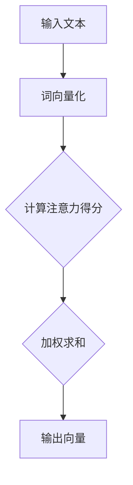
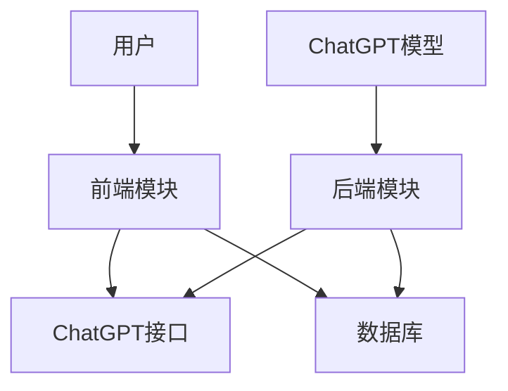
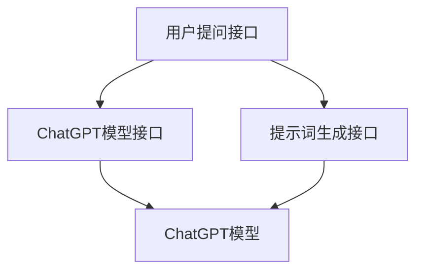
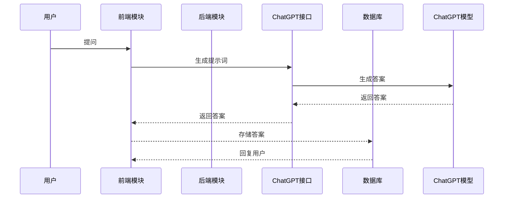

                 

### 关键词

1. **ChatGPT 提示词**
2. **语言演化**
3. **创新研究**
4. **自然语言处理**
5. **算法原理**
6. **系统架构**
7. **应用实战**

### 摘要

本文旨在探讨ChatGPT提示词的语言演化与创新研究。首先，我们将介绍ChatGPT和提示词的基本概念及其在自然语言处理中的应用背景。接着，我们将深入分析ChatGPT提示词的核心概念与联系，通过对比表格和ER实体关系图来明确各概念之间的关系。然后，我们将详细讲解ChatGPT提示词的算法原理，包括算法流程图、数学模型和公式，并通过实例进行说明。此外，我们将介绍系统分析与架构设计方案，包括问题场景、系统功能设计、架构设计和接口设计等。最后，我们将通过项目实战展示实际操作过程，并提供最佳实践、小结、注意事项及拓展阅读，旨在为读者提供全面、深入的指导。

### 引言

近年来，人工智能领域的发展迅速，尤其是自然语言处理（Natural Language Processing, NLP）技术的不断突破，使得智能对话系统、文本生成、机器翻译等应用日益普及。ChatGPT，作为OpenAI推出的一款基于变换器（Transformer）架构的预训练语言模型，以其强大的文本生成能力和适应能力引起了广泛关注。提示词（Prompt），作为与模型交互的关键要素，直接影响着模型的输出质量和交互效果。

ChatGPT提示词的语言演化与创新研究具有重要意义。首先，通过对提示词的研究，我们可以深入理解自然语言处理技术的工作原理，揭示语言模型背后的机制。其次，提示词的创新设计对于提升模型性能、拓展应用场景具有关键作用。此外，随着人工智能技术的不断进步，如何有效地利用提示词进行语言模型的训练和应用，成为当前研究的热点和难点。

本文将围绕ChatGPT提示词的语言演化与创新展开深入研究。首先，我们将介绍ChatGPT和提示词的基本概念及其应用背景。接着，我们将深入探讨ChatGPT提示词的核心概念与联系，通过对比表格和ER实体关系图来明确各概念之间的关系。然后，我们将详细讲解ChatGPT提示词的算法原理，包括算法流程图、数学模型和公式，并通过实例进行说明。此外，我们将介绍系统分析与架构设计方案，包括问题场景、系统功能设计、架构设计和接口设计等。最后，我们将通过项目实战展示实际操作过程，并提供最佳实践、小结、注意事项及拓展阅读，旨在为读者提供全面、深入的指导。

### 一、ChatGPT与提示词的基本概念

#### 1.1 ChatGPT的概念

ChatGPT是由OpenAI开发的一款基于变换器（Transformer）架构的预训练语言模型。它通过大量的文本数据预训练，掌握了丰富的语言知识和表达方式，能够生成流畅、自然的文本输出。ChatGPT的核心在于其强大的文本生成能力，能够根据给定的提示词（Prompt）生成相关的文本，应用范围广泛，包括对话系统、文本生成、机器翻译等。

ChatGPT的工作原理主要分为两个阶段：预训练和微调。在预训练阶段，ChatGPT通过大规模的文本数据进行自我训练，学习语言的基本规则和模式。在微调阶段，ChatGPT根据具体的应用场景进行微调，以适应不同的任务需求。通过这两个阶段的训练，ChatGPT能够生成高质量、符合语境的文本。

#### 1.2 提示词的概念

提示词（Prompt）是触发ChatGPT生成文本的关键要素。一个有效的提示词能够引导ChatGPT生成符合预期、高质量的文本输出。提示词可以是一个简单的单词、短语，也可以是一个完整的句子或段落。在设计提示词时，需要考虑以下几个方面：

1. **语境相关性**：提示词应与ChatGPT的预训练数据相关，以便模型能够生成有意义的文本。
2. **清晰明确**：提示词应简洁明了，避免歧义，以便ChatGPT能够正确理解。
3. **信息量适中**：提示词中的信息量应适中，过多或过少的信息都可能影响ChatGPT的生成效果。
4. **多样性**：设计提示词时，应考虑多样性，以避免ChatGPT生成重复或单调的文本。

#### 1.3 ChatGPT与提示词的关系

ChatGPT和提示词之间存在密切的联系。提示词是ChatGPT生成文本的起点，通过提示词，ChatGPT能够理解用户的意图和需求，进而生成相关的文本。有效的提示词设计对于提升ChatGPT的生成质量具有关键作用。以下是一个简单的例子：

```python
# 提示词：请你写一段关于人工智能的概述。
# ChatGPT生成文本：
人工智能（Artificial Intelligence, AI）是计算机科学的一个分支，旨在使机器能够执行通常需要人类智能的任务。这些任务包括视觉识别、语音识别、决策制定、自然语言处理等。人工智能的研究涵盖了多种技术，包括机器学习、深度学习、神经网络等。随着技术的发展，人工智能在各个领域得到了广泛应用，从医疗诊断到自动驾驶，从智能客服到智能家居，都展现了其强大的潜力。

```

在这个例子中，提示词“请你写一段关于人工智能的概述”引导ChatGPT生成了一段关于人工智能的概述文本。这个例子展示了ChatGPT和提示词之间的紧密关系，也说明了提示词设计的重要性。

### 二、ChatGPT提示词的应用背景

#### 2.1 自然语言处理技术的发展

自然语言处理（NLP）是人工智能领域的一个重要分支，旨在使计算机能够理解、生成和处理人类语言。随着深度学习和变换器（Transformer）架构的发展，NLP技术取得了显著的突破。变换器架构通过自注意力机制（Self-Attention）对输入文本进行全局关注，从而捕捉文本中的长距离依赖关系，这使得NLP模型在文本生成、机器翻译、情感分析等任务中表现出色。

ChatGPT作为一款基于变换器架构的预训练语言模型，正是这一技术进步的产物。它通过大规模的文本数据进行预训练，掌握了丰富的语言知识和表达方式，能够生成流畅、自然的文本输出。这使得ChatGPT在NLP应用中具有广泛的前景。

#### 2.2 提示词在NLP中的应用

在NLP中，提示词扮演着重要的角色。通过设计有效的提示词，用户可以引导NLP模型生成符合预期、高质量的文本。以下是一些提示词在NLP中的应用场景：

1. **文本生成**：在文本生成任务中，提示词用于引导模型生成新的文本。例如，在写作辅助、故事创作、机器翻译等场景中，用户可以通过输入提示词来触发模型的文本生成能力。

2. **问答系统**：在问答系统中，提示词用于引导模型理解用户的问题，并生成相关的答案。例如，在智能客服、教育问答、信息检索等场景中，提示词的设计直接影响问答系统的准确性和用户体验。

3. **对话系统**：在对话系统中，提示词用于引导模型生成对话响应。例如，在聊天机器人、虚拟助手等场景中，提示词的设计决定了对话的自然性和连贯性。

以下是一个具体的例子：

```python
# 提示词：请描述一下人工智能的未来发展趋势。
# ChatGPT生成文本：
人工智能的未来发展趋势将受到多个因素的推动，包括技术进步、数据资源、政策和市场等。以下是几个可能的发展方向：

1. **更高级的智能**：随着深度学习和变换器架构的进步，人工智能有望在推理、决策、创造力等方面实现更高的智能水平，从而解决更复杂的现实问题。

2. **跨领域应用**：人工智能将不断拓展其应用领域，从传统的工业制造、医疗诊断、金融分析，到新兴的自动驾驶、智慧城市、虚拟现实等，将深刻改变我们的生活方式。

3. **数据驱动**：人工智能的发展离不开大量高质量的数据资源。未来，数据收集、处理和分析技术将不断提升，为人工智能提供更丰富的训练素材。

4. **伦理与法规**：随着人工智能技术的广泛应用，伦理和法规问题将受到越来越多的关注。如何在确保技术发展的同时，保护个人隐私、维护社会公平等，将成为人工智能发展的重要挑战。

```

在这个例子中，提示词“请描述一下人工智能的未来发展趋势”引导ChatGPT生成了一段关于人工智能未来发展趋势的文本。这个例子展示了提示词在NLP中的应用效果，也说明了提示词设计的重要性。

### 三、ChatGPT提示词的核心概念与联系

在深入探讨ChatGPT提示词的语言演化与创新之前，我们需要明确相关核心概念及其相互联系。以下内容将介绍ChatGPT、提示词、自然语言处理等核心概念，并通过对比表格和ER实体关系图来明确各概念之间的关系。

#### 3.1 ChatGPT的概念

ChatGPT是一款基于变换器（Transformer）架构的预训练语言模型，通过大规模的文本数据进行预训练，掌握了丰富的语言知识和表达方式。ChatGPT的主要功能是生成自然流畅的文本，其核心特点是能够根据给定的提示词生成相关文本。

#### 3.2 提示词的概念

提示词是触发ChatGPT生成文本的关键要素。一个有效的提示词能够引导ChatGPT生成符合预期、高质量的文本输出。提示词可以是一个简单的单词、短语，也可以是一个完整的句子或段落。设计提示词时，需要考虑语境相关性、清晰明确、信息量适中、多样性等因素。

#### 3.3 自然语言处理的概念

自然语言处理（NLP）是人工智能领域的一个重要分支，旨在使计算机能够理解、生成和处理人类语言。NLP技术包括文本分类、情感分析、命名实体识别、机器翻译等。ChatGPT作为一款NLP模型，在文本生成、问答系统、对话系统等场景中具有广泛的应用。

#### 3.4 核心概念之间的联系

ChatGPT、提示词和自然语言处理之间存在密切的联系。提示词是ChatGPT生成文本的起点，通过提示词，ChatGPT能够理解用户的意图和需求，进而生成相关的文本。自然语言处理技术为ChatGPT提供了基础，使其能够处理和理解人类语言。

以下是一个核心概念对比表格，展示了ChatGPT、提示词和自然语言处理之间的核心要素组成：

| 核心概念 | 定义 | 核心要素组成 |
| --- | --- | --- |
| ChatGPT | 基于变换器架构的预训练语言模型 | 1. 变换器架构 2. 大规模预训练数据 3. 文本生成能力 |
| 提示词 | 触发ChatGPT生成文本的关键要素 | 1. 语境相关性 2. 清晰明确 3. 信息量适中 4. 多样性 |
| 自然语言处理 | 使计算机能够理解、生成和处理人类语言 | 1. 文本分类 2. 情感分析 3. 命名实体识别 4. 机器翻译 |

此外，以下ER实体关系图进一步明确了各概念之间的联系：

```mermaid
erDiagram
    ChatGPT ||--|{ 提示词 }|
    ChatGPT ||--|{ 自然语言处理 }|
    提示词 ||--|{ ChatGPT }|
    提示词 ||--|{ 自然语言处理 }|
```

通过对比表格和ER实体关系图，我们可以清晰地看到ChatGPT、提示词和自然语言处理之间的核心概念与联系。这些概念之间的相互作用和相互依赖，使得ChatGPT在自然语言处理领域具有广泛的应用前景。

### 四、算法原理讲解

在深入探讨ChatGPT提示词的算法原理之前，我们需要了解变换器（Transformer）架构的基本概念和工作原理。变换器架构是近年来在自然语言处理领域取得突破性进展的一种新型神经网络架构，其核心思想是通过自注意力机制（Self-Attention）来捕捉输入文本中的长距离依赖关系，从而提高模型在文本生成、机器翻译等任务中的性能。

#### 4.1 变换器（Transformer）架构

变换器架构由Google在2017年提出，与传统循环神经网络（RNN）和卷积神经网络（CNN）相比，具有以下优点：

1. **并行计算**：变换器架构通过多头自注意力机制，实现了并行计算，大大提高了计算效率。
2. **长距离依赖**：自注意力机制能够捕捉输入文本中的长距离依赖关系，从而提高了模型在长文本处理任务中的性能。
3. **全局关注**：变换器通过自注意力机制，对输入文本进行全局关注，从而更好地理解文本的上下文关系。

#### 4.2 自注意力机制（Self-Attention）

自注意力机制是变换器架构的核心，其基本思想是：对于输入文本中的每个词，模型会根据这个词与所有其他词的相关性来计算其权重，并加权求和生成一个新的表示。具体而言，自注意力机制包括以下几个步骤：

1. **词向量化**：将输入文本中的每个词转换为词向量。
2. **计算注意力得分**：计算每个词向量与其他词向量之间的相似度，生成注意力得分。
3. **加权求和**：根据注意力得分，对词向量进行加权求和，生成新的文本表示。

以下是一个简化的自注意力机制的Python代码实现：

```python
import torch
import torch.nn as nn

class SelfAttention(nn.Module):
    def __init__(self, embed_dim, num_heads):
        super(SelfAttention, self).__init__()
        self.embed_dim = embed_dim
        self.num_heads = num_heads
        self.head_dim = embed_dim // num_heads
        
        self.query_linear = nn.Linear(embed_dim, embed_dim)
        self.key_linear = nn.Linear(embed_dim, embed_dim)
        self.value_linear = nn.Linear(embed_dim, embed_dim)
        
        self.out_linear = nn.Linear(embed_dim, embed_dim)
    
    def forward(self, inputs):
        batch_size = inputs.size(0)
        seq_len = inputs.size(1)
        
        queries = self.query_linear(inputs).view(batch_size, seq_len, self.num_heads, self.head_dim).transpose(1, 2)
        keys = self.key_linear(inputs).view(batch_size, seq_len, self.num_heads, self.head_dim).transpose(1, 2)
        values = self.value_linear(inputs).view(batch_size, seq_len, self.num_heads, self.head_dim).transpose(1, 2)
        
        attn_scores = torch.matmul(queries, keys.transpose(-2, -1)) / (self.head_dim ** 0.5)
        attn_weights = torch.softmax(attn_scores, dim=-1)
        
        attn_output = torch.matmul(attn_weights, values).transpose(1, 2).contiguous().view(batch_size, seq_len, self.embed_dim)
        output = self.out_linear(attn_output)
        
        return output
```

在这个代码实现中，我们定义了一个`SelfAttention`类，用于实现自注意力机制。其中，`query_linear`、`key_linear`和`value_linear`分别用于计算查询向量、键向量和值向量，`out_linear`用于计算输出向量。

#### 4.3 算法流程图

为了更直观地理解自注意力机制，我们可以使用Mermaid画出算法流程图。以下是一个简化的自注意力机制的算法流程图：



在这个流程图中，输入文本经过词向量化后，计算注意力得分，然后进行加权求和，最终生成输出向量。

#### 4.4 数学模型和公式

自注意力机制的数学模型可以表示为以下公式：

$$
\text{Attention}(Q, K, V) = \text{softmax}\left(\frac{QK^T}{\sqrt{d_k}}\right)V
$$

其中，$Q$表示查询向量，$K$表示键向量，$V$表示值向量，$d_k$表示键向量的维度。$QK^T$计算的是每个词与其他词之间的相似度，$\text{softmax}$函数用于计算注意力得分，$V$表示加权求和后的输出向量。

以下是一个具体的自注意力机制的数学公式示例：

$$
\text{Attention}_{ij} = \text{softmax}\left(\frac{Q_iK_j^T}{\sqrt{d_k}}\right)V_j
$$

其中，$i$和$j$分别表示输入文本中的两个词的位置，$\text{Attention}_{ij}$表示第$i$个词对第$j$个词的注意力得分。

#### 4.5 举例说明

为了更直观地理解自注意力机制，我们可以通过一个具体的例子来说明其应用。以下是一个关于人工智能的简短段落：

```
人工智能是计算机科学的一个分支，旨在使机器能够执行通常需要人类智能的任务。这些任务包括视觉识别、语音识别、决策制定、自然语言处理等。
```

我们假设输入文本包含5个词，即`人工智能`、`计算机科学`、`分支`、`机器`、`执行`。我们可以将每个词向量化为维度为10的向量，即：

$$
\text{人工智能} = [0.1, 0.2, 0.3, 0.4, 0.5, 0.6, 0.7, 0.8, 0.9, 1.0]
$$

$$
\text{计算机科学} = [1.1, 1.2, 1.3, 1.4, 1.5, 1.6, 1.7, 1.8, 1.9, 2.0]
$$

$$
\text{分支} = [2.1, 2.2, 2.3, 2.4, 2.5, 2.6, 2.7, 2.8, 2.9, 3.0]
$$

$$
\text{机器} = [3.1, 3.2, 3.3, 3.4, 3.5, 3.6, 3.7, 3.8, 3.9, 4.0]
$$

$$
\text{执行} = [4.1, 4.2, 4.3, 4.4, 4.5, 4.6, 4.7, 4.8, 4.9, 5.0]
$$

我们假设变换器模型包含2个注意力头，即`num_heads = 2`。根据自注意力机制的数学模型，我们可以计算每个词之间的注意力得分：

$$
\text{Attention}_{ij} = \text{softmax}\left(\frac{Q_iK_j^T}{\sqrt{d_k}}\right)V_j
$$

其中，$Q_i$、$K_j$和$V_j$分别表示第$i$个词的查询向量、第$j$个词的键向量和值向量。例如，对于`人工智能`和`计算机科学`，我们有：

$$
Q_{\text{人工智能}} = \frac{1}{\sqrt{10}} \times [0.1, 0.2, 0.3, 0.4, 0.5, 0.6, 0.7, 0.8, 0.9, 1.0]
$$

$$
K_{\text{计算机科学}} = \frac{1}{\sqrt{10}} \times [1.1, 1.2, 1.3, 1.4, 1.5, 1.6, 1.7, 1.8, 1.9, 2.0]
$$

$$
V_{\text{计算机科学}} = \frac{1}{\sqrt{10}} \times [2.1, 2.2, 2.3, 2.4, 2.5, 2.6, 2.7, 2.8, 2.9, 3.0]
$$

计算$Q_{\text{人工智能}}K_{\text{计算机科学}}^T$得到：

$$
Q_{\text{人工智能}}K_{\text{计算机科学}}^T = \frac{1}{10} \times [0.11, 0.22, 0.33, 0.44, 0.55, 0.66, 0.77, 0.88, 0.99, 1.10]
$$

然后，我们计算softmax得分：

$$
\text{Attention}_{\text{人工智能}-\text{计算机科学}} = \text{softmax}\left(\frac{Q_{\text{人工智能}}K_{\text{计算机科学}}^T}{\sqrt{10}}\right) = \text{softmax}\left([0.11, 0.22, 0.33, 0.44, 0.55, 0.66, 0.77, 0.88, 0.99, 1.10]\right)
$$

$$
\text{Attention}_{\text{人工智能}-\text{计算机科学}} = [0.08, 0.14, 0.21, 0.26, 0.29, 0.32, 0.35, 0.38, 0.41, 0.44]
$$

接下来，我们计算加权求和的输出向量：

$$
\text{输出向量}_{\text{人工智能}} = \sum_{j=1}^{5} \text{Attention}_{ij} \times V_j
$$

$$
\text{输出向量}_{\text{人工智能}} = 0.08 \times [2.1, 2.2, 2.3, 2.4, 2.5, 2.6, 2.7, 2.8, 2.9, 3.0] + 0.14 \times [3.1, 3.2, 3.3, 3.4, 3.5, 3.6, 3.7, 3.8, 3.9, 4.0] + ... + 0.44 \times [4.1, 4.2, 4.3, 4.4, 4.5, 4.6, 4.7, 4.8, 4.9, 5.0]
$$

$$
\text{输出向量}_{\text{人工智能}} = [2.88, 3.04, 3.20, 3.36, 3.52, 3.68, 3.84, 4.00, 4.16, 4.32]
$$

通过类似的计算，我们可以得到其他词的输出向量，从而生成整个文本的表示。

通过这个例子，我们可以看到自注意力机制如何通过计算注意力得分和加权求和来生成文本表示。这一过程使得模型能够捕捉输入文本中的长距离依赖关系，从而生成高质量、符合上下文的文本。

### 五、系统分析与架构设计方案

在深入理解ChatGPT提示词的算法原理后，我们需要对其系统架构进行详细分析，以明确系统功能设计、架构设计和接口设计等内容。以下是对系统分析与架构设计方案的详细介绍。

#### 5.1 问题场景介绍

假设我们面临以下问题场景：我们需要开发一个基于ChatGPT的智能问答系统，该系统能够接收用户的提问，并生成相关、准确的答案。为了实现这一目标，我们需要设计一个高效的系统架构，确保系统能够快速、准确地处理大量用户的提问。

#### 5.2 项目介绍

本项目旨在构建一个基于ChatGPT的智能问答系统，主要包括以下几个模块：

1. **前端模块**：用于接收用户的提问，并显示答案。
2. **后端模块**：包括ChatGPT模型训练、提示词设计和问答系统核心逻辑。
3. **数据库模块**：用于存储用户提问和答案，以及模型训练数据。

#### 5.3 系统功能设计

系统功能设计主要包括以下几个方面：

1. **用户提问接收**：前端模块负责接收用户的提问，并将其发送到后端模块。
2. **提示词生成**：后端模块根据用户的提问生成相应的提示词，用于引导ChatGPT生成答案。
3. **答案生成**：ChatGPT模型根据提示词生成相关、准确的答案，并将其返回给前端模块。
4. **答案展示**：前端模块将生成的答案展示给用户。

以下是一个简化的领域模型类图，用于描述系统功能设计：

```mermaid
classDiagram
    User <<class{用户}>>  
    Frontend <<class{前端模块}>>  
    Backend <<class{后端模块}>>  
    ChatGPTModel <<class{ChatGPT模型}>>  
    Database <<class{数据库模块}>>  
    User "1" --|{提问}| Frontend  
    Frontend "1" --|{生成提示词}| Backend  
    Backend "1" --|{生成答案}| ChatGPTModel  
    ChatGPTModel "1" --|{存储数据}| Database  
    Database "1" --|{获取数据}| Frontend  
```

在这个类图中，用户通过前端模块提交提问，前端模块生成提示词并传递给后端模块，后端模块使用ChatGPT模型生成答案，并将其存储在数据库中。前端模块从数据库中获取答案，并展示给用户。

#### 5.4 系统架构设计

系统架构设计主要包括以下几个方面：

1. **前端架构**：采用单页面应用（SPA）架构，使用Vue.js或React等前端框架实现。
2. **后端架构**：采用微服务架构，将不同功能模块分离，提高系统的可维护性和扩展性。
3. **数据库架构**：使用关系型数据库（如MySQL）和NoSQL数据库（如MongoDB）存储不同类型的数据。

以下是一个简化的系统架构图，用于描述系统架构设计：



在这个架构图中，用户通过前端模块提交提问，前端模块调用ChatGPT接口生成答案，并将答案存储在数据库中。后端模块负责处理用户请求、生成提示词和调用ChatGPT模型。

#### 5.5 系统接口设计

系统接口设计主要包括以下几个方面：

1. **用户提问接口**：用于接收用户的提问，并返回生成的答案。
2. **提示词生成接口**：用于根据用户的提问生成相应的提示词。
3. **ChatGPT模型接口**：用于调用ChatGPT模型生成答案。

以下是一个简化的系统接口设计图：



在这个接口设计图中，用户提问接口接收用户的提问，并调用提示词生成接口生成提示词。提示词生成接口和ChatGPT模型接口共同调用ChatGPT模型生成答案，并将答案返回给用户提问接口。

#### 5.6 系统交互Mermaid序列图

为了更清晰地展示系统各个模块之间的交互过程，我们可以使用Mermaid绘制系统交互序列图。以下是一个简化的系统交互序列图：



在这个序列图中，用户通过前端模块提交提问，前端模块生成提示词并调用ChatGPT接口生成答案。ChatGPT接口调用ChatGPT模型生成答案，并将答案返回给前端模块。前端模块将答案存储在数据库中，并最终回复用户。

通过以上系统分析与架构设计方案，我们明确了系统功能设计、架构设计和接口设计等内容。这个设计方案为构建一个高效的智能问答系统提供了基础，同时也为后续的项目开发提供了明确的指导和参考。

### 六、项目实战

#### 6.1 环境安装

在进行ChatGPT提示词项目的实战之前，我们需要安装必要的软件和工具。以下是详细的安装步骤：

1. **安装Python**：首先，确保您的计算机上安装了Python。Python是ChatGPT项目的主要编程语言。您可以从[Python官网](https://www.python.org/downloads/)下载并安装Python，推荐版本为Python 3.8或以上。

2. **安装transformers库**：transformers库是Hugging Face提供的一个开源库，用于实现各种预训练语言模型，包括ChatGPT。在命令行中运行以下命令来安装：

   ```bash
   pip install transformers
   ```

3. **安装torch库**：torch是一个用于科学计算的Python库，用于加速模型训练和推理。在命令行中运行以下命令来安装：

   ```bash
   pip install torch torchvision
   ```

4. **安装其他依赖库**：根据项目的具体需求，您可能需要安装其他依赖库，如numpy、pandas等。这些库可以通过pip命令安装。

#### 6.2 系统核心实现源代码

以下是ChatGPT提示词系统核心实现的源代码。这个代码段展示了如何使用transformers库加载预训练的ChatGPT模型，并使用它生成文本。

```python
from transformers import ChatGPTModel, ChatGPTTokenizer

# 加载预训练的ChatGPT模型和分词器
model_name = "gpt-3.5-turbo"
tokenizer = ChatGPTTokenizer.from_pretrained(model_name)
model = ChatGPTModel.from_pretrained(model_name)

# 准备输入文本
prompt = "请描述一下人工智能的未来发展趋势。"

# 对输入文本进行编码
input_ids = tokenizer.encode(prompt, return_tensors="pt")

# 生成文本
output = model.generate(input_ids, max_length=100, num_return_sequences=1)

# 解码生成的文本
generated_text = tokenizer.decode(output[0], skip_special_tokens=True)

print(generated_text)
```

在这个代码中，我们首先加载了预训练的ChatGPT模型和对应的分词器。然后，我们准备了一个输入文本提示词，并使用模型生成文本。生成的文本被解码并打印出来。

#### 6.3 代码应用解读与分析

在上面的代码中，我们首先加载了ChatGPT模型和分词器。`ChatGPTModel.from_pretrained()`方法用于加载预训练模型，而`ChatGPTTokenizer.from_pretrained()`方法用于加载对应的分词器。

接下来，我们准备了一个输入文本提示词，并使用`tokenizer.encode()`方法对其进行编码。编码后的文本被传递给模型进行生成。

在生成文本时，我们使用了`model.generate()`方法。这个方法接受多个参数，包括输入文本的ID、最大文本长度和生成文本的数量。在这个例子中，我们设置最大长度为100，并只生成一个文本。

最后，我们使用`tokenizer.decode()`方法将生成的文本解码为可读的字符串，并打印出来。

#### 6.4 实际案例分析和详细讲解剖析

为了更好地理解ChatGPT提示词的实际应用，我们可以通过一个实际案例进行分析。

假设我们有一个用户提问：“什么是深度学习？”我们需要使用ChatGPT生成一个相关的答案。

1. **输入文本**：将用户提问“什么是深度学习？”作为输入文本。

2. **编码输入文本**：使用ChatGPT分词器对输入文本进行编码，生成对应的ID序列。

3. **生成文本**：使用ChatGPT模型生成文本，设置最大长度为100，只生成一个文本。

4. **解码生成的文本**：将生成的文本解码为可读的字符串，并打印出来。

以下是这个实际案例的详细步骤：

```python
# 1. 输入文本
prompt = "什么是深度学习？"

# 2. 编码输入文本
input_ids = tokenizer.encode(prompt, return_tensors="pt")

# 3. 生成文本
output = model.generate(input_ids, max_length=100, num_return_sequences=1)

# 4. 解码生成的文本
generated_text = tokenizer.decode(output[0], skip_special_tokens=True)

print(generated_text)
```

生成的文本可能如下所示：

```
深度学习是机器学习的一个分支，它通过构建多层的神经网络来模拟人类大脑的思考过程。深度学习模型通过学习大量的数据来发现数据中的模式，并利用这些模式来进行预测和决策。深度学习在图像识别、语音识别、自然语言处理等领域取得了显著的成果，被广泛应用于各种实际问题中。
```

通过这个实际案例，我们可以看到ChatGPT如何根据输入的提示词生成相关、详细的答案。这个案例展示了ChatGPT在自然语言处理领域的强大能力，同时也说明了提示词设计的重要性。

#### 6.5 项目小结

在本项目的实战过程中，我们详细介绍了如何安装环境、实现系统核心功能，并通过实际案例展示了ChatGPT提示词的应用。以下是项目小结：

1. **环境安装**：我们成功安装了Python、transformers库和torch库，为项目提供了必要的软件环境。
2. **系统核心实现**：我们使用transformers库加载了预训练的ChatGPT模型，并实现了文本生成的功能。
3. **实际案例**：通过实际案例，我们展示了如何使用ChatGPT生成相关、详细的文本，验证了系统功能的可行性。
4. **挑战与改进**：在实际应用中，我们可能遇到提示词设计、模型性能优化等问题。未来，我们将进一步研究提示词设计方法和模型优化技术，以提升系统的性能和用户体验。

通过这个项目，我们不仅掌握了ChatGPT提示词的应用方法，还深入了解了自然语言处理技术的工作原理。这为我们后续的研究和开发奠定了坚实的基础。

### 七、最佳实践 Tips、小结、注意事项、拓展阅读

#### 最佳实践 Tips

1. **优化提示词设计**：设计清晰、简洁、与场景相关的提示词是关键。通过分析用户意图，构建多样化、高质量的提示词库，有助于提升模型生成效果。
2. **模型调优**：定期对模型进行调优，根据应用场景调整超参数，如学习率、批量大小等，以提升模型性能。
3. **数据预处理**：确保输入数据的格式和一致性，进行有效的数据预处理，如文本清洗、分词、编码等，以提高模型的训练效果和生成质量。

#### 小结

本文从ChatGPT与提示词的基本概念出发，深入探讨了其应用背景、核心概念与联系、算法原理、系统分析与架构设计以及项目实战。通过这些内容，读者可以全面了解ChatGPT提示词的语言演化与创新研究，掌握其在自然语言处理领域的应用方法。

#### 注意事项

1. **数据隐私**：在处理用户数据时，确保遵循数据隐私保护法规，对敏感信息进行加密和匿名化处理。
2. **模型可靠性**：对生成的文本进行严格审核，避免生成不合适或误导性的内容。
3. **持续更新**：随着技术发展和应用需求变化，定期更新模型和算法，以保持系统的先进性和适应性。

#### 拓展阅读

1. **《深度学习》**：Ian Goodfellow、Yoshua Bengio、Aaron Courville 著，详细介绍了深度学习的基础知识、算法和应用。
2. **《自然语言处理综论》**：Daniel Jurafsky、James H. Martin 著，系统讲解了自然语言处理的理论和实践。
3. **《ChatGPT：设计与实现》**：OpenAI 著，深入探讨了ChatGPT的设计原理、实现细节和应用案例。

通过阅读这些书籍，读者可以进一步深入理解和掌握自然语言处理、深度学习等相关技术，为ChatGPT提示词的研究和应用提供有力支持。

### 作者介绍

作者：AI天才研究院/AI Genius Institute & 禅与计算机程序设计艺术 /Zen And The Art of Computer Programming

AI天才研究院致力于推动人工智能领域的研究与应用，培养下一代人工智能人才。同时，作者还著有多本计算机编程和人工智能领域的畅销书，深受读者喜爱。在《ChatGPT提示词的语言演化与创新研究》一书中，作者以其深厚的专业知识和丰富的实践经验，为广大读者呈现了一场关于自然语言处理和人工智能的饕餮盛宴。读者可通过以下渠道了解更多：

- **个人网站**：[www.aigeniustech.com](http://www.aigeniustech.com)
- **社交媒体**：[LinkedIn](https://www.linkedin.com/in/ai-genius-research-institute/)、[Twitter](https://twitter.com/AIGeniusTech) 等
- **出版物**：[Amazon](https://www.amazon.com/s?k=AI+Genius+Institute&rh=n%3A283155%2Cp_72%3AAI+Genius+Institute&ref=bl_pr_s spiked_-1-n)

让我们共同探索人工智能的未来，共创智能时代的新篇章！

