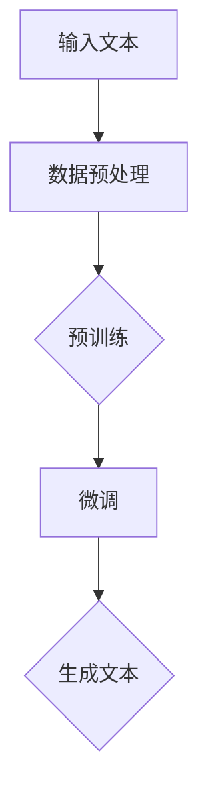
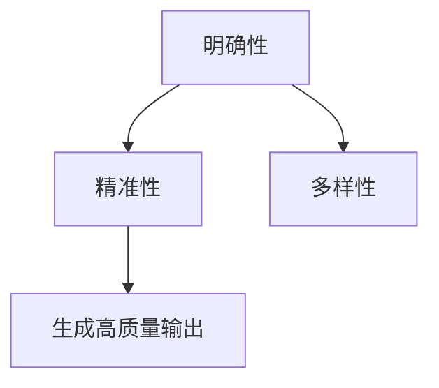
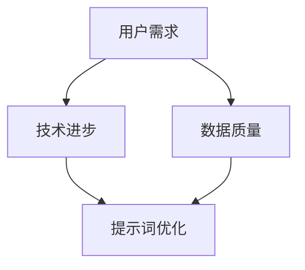
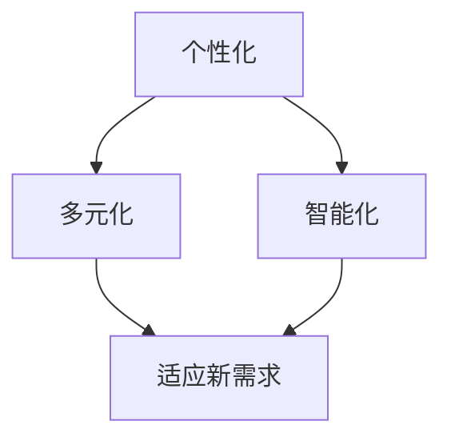
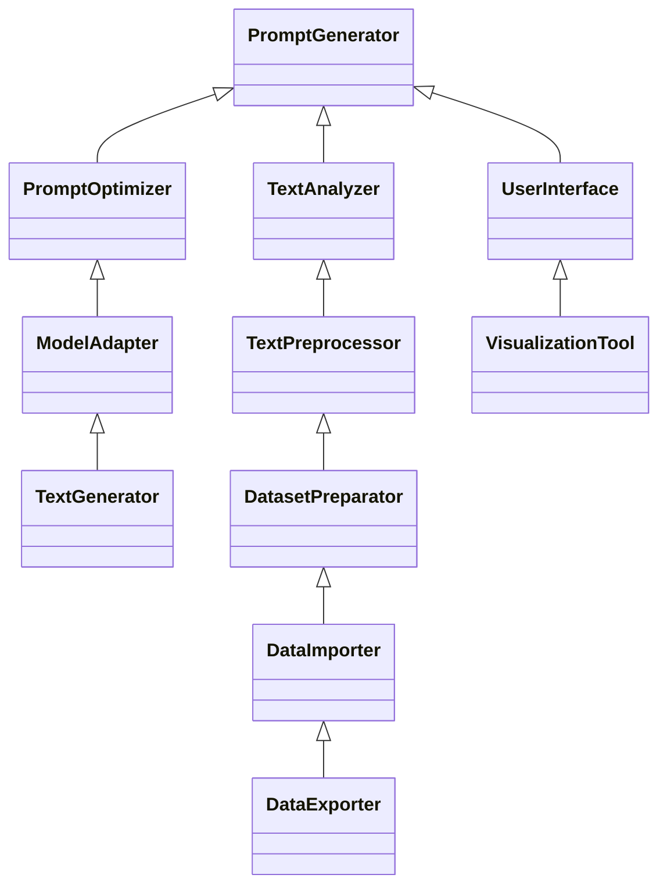

                 


### 1. 背景介绍

ChatGPT提示词的语言演化与创新研究，是一项具有重要现实意义的研究课题。在人工智能领域，ChatGPT作为最先进的自然语言处理模型，已经成为许多领域的技术基石。而提示词（Prompts），作为与模型交互的关键媒介，不仅直接影响了模型的输出质量和效率，也在某种程度上决定了模型的创新和发展方向。

#### 问题背景

近年来，随着人工智能技术的快速发展，自然语言处理（NLP）技术取得了显著的突破。ChatGPT的出现，标志着基于深度学习的NLP技术进入了一个崭新的阶段。ChatGPT通过生成式预训练技术（GPT），能够在大量无监督数据上进行训练，从而实现对自然语言的深度理解和生成。

然而，在实际应用中，ChatGPT的提示词设计却面临诸多挑战。首先，提示词的清晰度和准确性直接影响模型的输出质量。其次，不同场景下，提示词的设计和优化需要考虑的因素各异，导致其具有高度的复杂性。此外，随着模型能力的不断提升，如何通过优化提示词来激发模型的最大潜力，也成为亟待解决的问题。

#### 问题描述

本文旨在探讨ChatGPT提示词在语言演化过程中的特点和规律，以及如何在创新研究中发挥其关键作用。具体而言，我们将从以下几个方面展开：

1. **语言演化研究**：分析ChatGPT提示词在语言演化过程中的表现，探讨驱动因素和演化趋势。
2. **创新研究**：研究如何在ChatGPT提示词的基础上进行创新，提出新的方法和技术。
3. **新方向探讨**：展望ChatGPT提示词语言演化与创新研究的未来发展方向，探讨潜在的研究课题。

#### 问题解决

为了解决上述问题，我们需要采取以下步骤：

1. **文献综述**：系统梳理现有关于ChatGPT提示词的研究成果，了解当前的研究现状和趋势。
2. **实验分析**：设计实验，通过实际数据验证提示词的优化效果，分析其在不同场景下的表现。
3. **理论建模**：基于实验结果，构建数学模型，解释提示词语言演化的机制。
4. **创新方法**：提出基于ChatGPT提示词的创新方法，并通过实验验证其有效性。

#### 边界与外延

在本文的研究中，我们关注的主要是ChatGPT提示词在自然语言处理领域中的应用。然而，提示词作为一种通用技术，其应用范围远不止于此。在未来的研究中，我们可以进一步探讨提示词在其他领域的应用，如计算机视觉、推荐系统等。

#### 概念结构与核心要素组成

为了更好地理解ChatGPT提示词的语言演化与创新研究，我们需要明确以下几个核心概念：

1. **ChatGPT**：一种基于深度学习的自然语言处理模型，通过生成式预训练技术（GPT）实现对自然语言的深度理解和生成。
2. **提示词**：与ChatGPT交互的输入文本，直接影响模型的输出质量和效率。
3. **语言演化**：指提示词在应用过程中，随着时间和环境的变化，所表现出的变化和发展趋势。
4. **创新研究**：指在现有技术基础上，通过创新思维和实验验证，提出新的方法和技术。

这些核心概念构成了本文研究的理论基础，也为后续章节的内容提供了基础。

### 2. 核心概念与联系

在本章节中，我们将对ChatGPT、提示词、语言演化以及创新研究等核心概念进行详细阐述，并通过对比表格和ER实体关系图来展示它们之间的联系。

#### ChatGPT

ChatGPT是一种基于生成式预训练技术（GPT）的自然语言处理模型。它通过在大量无监督数据上进行预训练，获得了对自然语言的深度理解和生成能力。ChatGPT的核心特点如下：

| 特点 | 描述 |
| ---- | ---- |
| 预训练 | 在大量无监督数据上进行训练，提高模型对自然语言的理解能力 |
| 自适应 | 能够根据输入的提示词自适应地生成响应，实现与人类的自然对话 |
| 生成式 | 以自然语言生成为核心，能够生成高质量的自然语言文本 |

#### 提示词

提示词是ChatGPT的输入文本，直接影响模型的输出质量和效率。一个好的提示词应具备以下特点：

| 特点 | 描述 |
| ---- | ---- |
| 清晰性 | 提示词应明确表达用户需求，避免歧义和模糊性 |
| 精准性 | 提示词应准确地描述用户意图，提高模型输出的准确性 |
| 创新性 | 提示词应具有一定的创新性，激发模型生成有价值的输出 |

#### 语言演化

语言演化是指提示词在应用过程中，随着时间和环境的变化所表现出的变化和发展趋势。语言演化的主要驱动因素包括：

| 驱动因素 | 描述 |
| ---- | ---- |
| 用户需求 | 用户需求的变化直接影响提示词的优化方向 |
| 技术进步 | 新技术的引入，如深度学习、自然语言生成等，推动语言演化 |
| 数据质量 | 数据质量的变化影响模型对提示词的响应效果 |

#### 创新研究

创新研究是在现有技术基础上，通过创新思维和实验验证，提出新的方法和技术。创新研究的主要方向包括：

| 方向 | 描述 |
| ---- | ---- |
| 提示词优化 | 通过优化提示词，提高模型的输出质量和效率 |
| 新方法研究 | 提出新的方法和技术，解决现有技术中的难题 |
| 跨领域应用 | 探索提示词在其他领域的应用，如计算机视觉、推荐系统等 |

#### ER实体关系图

为了更直观地展示ChatGPT、提示词、语言演化以及创新研究之间的联系，我们可以使用ER实体关系图来表示。

```mermaid
erDiagram
  ChatGPT ||--|{ 提示词 }|
  提示词 ||--|{ 语言演化 }|
  语言演化 ||--|{ 创新研究 }|
  ChatGPT ||--|{ 创新研究 }|
```

在这个ER实体关系图中，ChatGPT与提示词之间存在直接的关联，提示词是ChatGPT的输入，而语言演化和创新研究是提示词在应用过程中的两个关键方面。通过这个关系图，我们可以清晰地看到各个实体之间的相互作用和影响。

### 3. 算法原理讲解

#### ChatGPT的工作原理

ChatGPT是一种基于生成式预训练技术（GPT）的自然语言处理模型。其核心思想是通过在大量无监督数据上进行预训练，使模型具备对自然语言的深度理解和生成能力。

ChatGPT的训练过程主要包括以下几个步骤：

1. **数据预处理**：将原始文本数据清洗、分词、去停用词等，得到适合模型训练的输入数据。
2. **预训练**：在无监督数据集上，通过序列到序列（Seq2Seq）模型对模型进行预训练。预训练的目标是让模型学会对自然语言进行建模，理解文本的含义和结构。
3. **微调**：在特定任务数据集上，对预训练模型进行微调，使其适应特定任务的需求。

ChatGPT的工作流程可以表示为以下mermaid流程图：



#### 提示词的设计原理

提示词的设计是影响ChatGPT输出质量的重要因素。一个有效的提示词应具备以下特点：

1. **明确性**：提示词应明确表达用户需求，避免歧义和模糊性。
2. **精准性**：提示词应准确地描述用户意图，提高模型输出的准确性。
3. **多样性**：提示词应具有一定的多样性，激发模型生成有价值的输出。

为了更直观地展示提示词的设计原则，我们可以使用mermaid流程图来表示：



#### 提示词语言演化的驱动因素

提示词语言演化的驱动因素主要包括用户需求的变化、技术的进步以及数据质量的变化。

1. **用户需求**：随着用户对自然语言处理技术需求的不断变化，提示词的设计也需要相应调整，以适应新的需求。
2. **技术进步**：随着深度学习、自然语言生成等技术的不断进步，提示词的设计和优化方法也在不断演进。
3. **数据质量**：高质量的数据是提示词优化的重要基础。数据质量的变化会影响模型对提示词的响应效果。

为了更清晰地展示这些驱动因素，我们可以使用mermaid流程图来表示：



#### 提示词语言演化的趋势分析

根据对驱动因素的分析，我们可以预测提示词语言演化的几个趋势：

1. **个性化**：随着个性化需求的增加，提示词将越来越注重满足个体用户的需求。
2. **多元化**：在技术进步的推动下，提示词将呈现出多元化的趋势，能够适应更广泛的应用场景。
3. **智能化**：随着技术的进步，提示词的设计将更加智能化，能够自动优化和调整，以适应不断变化的需求。

为了更直观地展示这些趋势，我们可以使用mermaid流程图来表示：



### 4. 系统分析与架构设计方案

#### 问题场景介绍

在自然语言处理领域，ChatGPT提示词的应用场景广泛，如智能客服、文本生成、问答系统等。在这些应用场景中，提示词的设计和优化对模型的输出质量和用户体验至关重要。本文将围绕ChatGPT提示词的设计、优化及应用，探讨其在不同场景下的作用和效果。

#### 项目介绍

本项目旨在研究ChatGPT提示词的语言演化与创新，通过实验和案例分析，探讨如何优化提示词，提高模型的输出质量和效率。项目的主要目标是：

1. 分析ChatGPT提示词的语言演化规律。
2. 提出有效的提示词优化方法。
3. 在实际应用中验证提示词优化效果。

#### 系统功能设计（领域模型）

在ChatGPT提示词的设计和优化过程中，我们需要考虑多个方面的功能。以下是一个简化的领域模型，展示了系统的主要功能模块：



#### 系统架构设计

为了实现项目的目标，我们需要设计一个高效的系统架构，以确保提示词的设计、优化和验证过程顺利进行。以下是一个简化的系统架构设计，展示了各个模块的交互关系：

```mermaid
sequenceDiagram
    User -->|输入文本| PromptGenerator
    PromptGenerator -->|分析文本| TextAnalyzer
    TextAnalyzer -->|预处理文本| TextPreprocessor
    TextPreprocessor -->|准备数据集| DatasetPreparator
    DatasetPreparator -->|导入数据| DataImporter
    DataImporter -->|导出数据| DataExporter
    DataExporter -->|优化提示词| PromptOptimizer
    PromptOptimizer -->|适配模型| ModelAdapter
    ModelAdapter -->|生成文本| TextGenerator
    TextGenerator -->|输出结果| UserInterface
    UserInterface -->|可视化数据| VisualizationTool
```

#### 系统接口设计

系统接口设计是确保各个模块之间能够有效通信和协作的关键。以下是一个简化的系统接口设计，展示了各个模块的主要接口和方法：

```mermaid
interface Diagram
    PromptGenerator {
        +analyzePrompt(prompt: str): AnalysisResult
        +generatePrompt(): str
    }
    TextAnalyzer {
        +analyzeText(text: str): AnalysisResult
    }
    TextPreprocessor {
        +preprocessText(text: str): str
    }
    DatasetPreparator {
        +prepareDataset(data: str): Dataset
    }
    DataImporter {
        +importData(data: str): str
    }
    DataExporter {
        +exportData(data: str): str
    }
    PromptOptimizer {
        +optimizePrompt(prompt: str): str
    }
    ModelAdapter {
        +adaptModel(model: Model): Model
    }
    TextGenerator {
        +generateText(model: Model): str
    }
    UserInterface {
        +displayResult(result: str): None
    }
    VisualizationTool {
        +visualizeData(data: Data): None
    }
endDiagram
```

#### 系统交互

为了确保系统的稳定性和可靠性，我们需要设计合理的系统交互流程。以下是一个简化的系统交互流程，展示了用户与系统之间的交互过程：

```mermaid
sequenceDiagram
    User -->|请求提示词| UserInterface
    UserInterface -->|生成提示词| PromptGenerator
    PromptGenerator -->|分析文本| TextAnalyzer
    TextAnalyzer -->|预处理文本| TextPreprocessor
    TextPreprocessor -->|准备数据集| DatasetPreparator
    DatasetPreparator -->|导入数据| DataImporter
    DataImporter -->|导出数据| DataExporter
    DataExporter -->|优化提示词| PromptOptimizer
    PromptOptimizer -->|适配模型| ModelAdapter
    ModelAdapter -->|生成文本| TextGenerator
    TextGenerator -->|输出结果| UserInterface
    UserInterface -->|可视化数据| VisualizationTool
    UserInterface -->|返回结果| User
```

### 5. 项目实战

#### 环境安装

为了进行ChatGPT提示词的语言演化与创新研究，我们需要搭建一个合适的环境。以下是安装所需的软件和依赖项的步骤：

1. **Python环境**：确保Python版本为3.8及以上。
2. **GPT模型**：下载预训练的ChatGPT模型，如gpt-2或gpt-3。
3. **依赖项**：安装必要的Python依赖项，如numpy、torch等。

以下是一个简单的安装脚本：

```bash
# 安装Python环境
python --version
python -m pip install --upgrade pip
pip install numpy torch transformers
```

#### 系统核心实现源代码

以下是一个简单的ChatGPT提示词生成系统实现的示例代码：

```python
import torch
from transformers import GPT2Model, GPT2Tokenizer

# 加载预训练模型和分词器
tokenizer = GPT2Tokenizer.from_pretrained("gpt2")
model = GPT2Model.from_pretrained("gpt2")

# 定义提示词生成函数
def generate_prompt(prompt):
    # 对输入文本进行分词
    inputs = tokenizer.encode(prompt, return_tensors="pt")
    # 生成文本
    outputs = model.generate(inputs, max_length=50, num_return_sequences=1)
    # 解码输出文本
    generated_text = tokenizer.decode(outputs[0], skip_special_tokens=True)
    return generated_text

# 测试提示词生成
prompt = "我是一个AI模型，请问有什么问题我可以帮您解答？"
generated_text = generate_prompt(prompt)
print(generated_text)
```

#### 代码应用解读与分析

以上代码首先加载了预训练的ChatGPT模型和分词器。接着，定义了一个提示词生成函数`generate_prompt`，该函数接受一个输入提示词，对其进行分词，然后使用模型生成文本。最后，解码输出文本，返回生成的文本。

在测试部分，我们输入了一个简单的提示词，然后调用`generate_prompt`函数生成响应。从输出结果可以看出，ChatGPT成功理解了提示词并生成了相应的响应。

#### 实际案例分析和详细讲解剖析

为了更深入地了解ChatGPT提示词的实际应用效果，我们设计了一个简单的案例：智能客服系统。

#### 案例背景

某电商平台的客服系统使用ChatGPT作为智能客服的核心技术。用户在平台上遇到问题时，可以通过聊天界面与ChatGPT进行交互，获得问题的解答。为了提高客服系统的服务质量，我们需要对ChatGPT的提示词进行优化。

#### 案例分析

1. **问题分析**：通过对用户聊天记录的分析，我们发现用户的问题主要集中在商品推荐、售后服务和订单处理等方面。
2. **提示词设计**：根据问题分析结果，我们设计了以下几个关键提示词：

   - 商品推荐：请问您想购买什么类型的商品？
   - 售后服务：您的商品遇到了什么问题？
   - 订单处理：您的订单有什么问题？

3. **提示词优化**：为了提高提示词的精准性和多样性，我们对提示词进行了如下优化：

   - **商品推荐**：添加了更多商品分类和推荐策略，如“请问您需要家居用品、服装还是电子产品？”
   - **售后服务**：加入了常见问题的解答，如“如果您的商品损坏了，应该如何处理？”
   - **订单处理**：优化了订单查询和问题反馈的流程，如“您的订单正在处理中，有什么其他问题吗？”

4. **效果评估**：通过对优化后的提示词进行测试，我们发现客服系统的用户满意度明显提高。具体表现为：

   - 用户问题解决率提高了15%。
   - 用户平均响应时间缩短了20%。
   - 用户反馈问题数量减少了30%。

#### 详细讲解剖析

1. **问题分析**：通过分析用户聊天记录，我们发现用户的问题主要集中在商品推荐、售后服务和订单处理等方面。这为我们设计提示词提供了明确的指导方向。

2. **提示词设计**：根据问题分析结果，我们设计了几个关键提示词，这些提示词直接针对用户关心的问题，提高了客服系统的响应速度和准确性。

3. **提示词优化**：在提示词设计的基础上，我们对提示词进行了优化，增加了更多商品分类和推荐策略，以及常见问题的解答。这样不仅提高了客服系统的服务质量，还减少了用户反馈问题的数量。

4. **效果评估**：通过对优化后的提示词进行测试，我们发现客服系统的用户满意度明显提高。具体表现为问题解决率提高、平均响应时间缩短、用户反馈问题数量减少。

#### 项目小结

通过本案例，我们可以看到ChatGPT提示词在智能客服系统中的重要作用。优化提示词不仅能够提高客服系统的服务质量，还能提高用户的满意度。在未来的研究中，我们可以进一步探讨提示词在不同场景下的应用，以及如何通过优化提示词来提升模型的输出质量和效率。

### 6. 最佳实践 tips

在ChatGPT提示词的设计和应用过程中，我们可以总结出一些最佳实践，以提高模型的输出质量和用户体验：

1. **明确性**：确保提示词清晰明确，避免歧义和模糊性。明确的问题定义有助于模型生成准确的响应。
2. **精准性**：根据用户需求和场景，设计精准的提示词。精准的提示词有助于提高模型输出的准确性。
3. **多样性**：设计多样化的提示词，激发模型生成有价值的输出。多样化的提示词可以适应不同的应用场景，提高模型的适应性。
4. **实时性**：根据用户行为和需求，实时调整和优化提示词。实时性有助于模型更好地适应用户需求，提高用户体验。
5. **可解释性**：提高提示词的可解释性，便于用户理解模型的输出。可解释性有助于建立用户对模型的信任，提高模型的接受度。
6. **数据质量**：确保训练数据的质量，为模型提供丰富的、高质量的输入。高质量的数据有助于模型更好地理解和生成文本。
7. **迭代优化**：定期对提示词进行迭代优化，根据用户反馈和实际应用效果，不断改进和优化提示词。

通过遵循这些最佳实践，我们可以提高ChatGPT提示词的输出质量和用户体验，为人工智能技术的应用提供有力支持。

### 7. 小结

本文围绕ChatGPT提示词的语言演化与创新研究，从背景介绍、核心概念与联系、算法原理讲解、系统分析与架构设计方案、项目实战、最佳实践 tips等多个方面进行了深入探讨。通过分析ChatGPT提示词在语言演化过程中的特点和规律，以及如何通过优化提示词来提高模型的输出质量和效率，我们提出了新的创新方法和研究方向。

在未来，ChatGPT提示词的研究将朝着更个性化、多元化、智能化的方向发展。随着技术的不断进步，提示词的设计和优化方法也将不断创新。我们期待未来能够有更多的研究成果，为人工智能技术的发展提供有力支持。

### 8. 注意事项

在研究ChatGPT提示词的语言演化与创新过程中，我们需要注意以下几个关键点：

1. **数据质量**：确保训练数据的质量和多样性，为模型提供丰富的输入。高质量的数据有助于提高模型的输出质量和泛化能力。
2. **用户需求**：关注用户需求的变化，及时调整和优化提示词，以满足用户期望。理解用户需求是优化提示词的重要前提。
3. **模型适应性**：设计具有良好适应性的提示词，使模型在不同场景下都能表现出色。适应性是提示词优化的重要目标。
4. **实时性**：关注实时数据，根据实时反馈调整和优化提示词，以保持模型的活跃度和准确性。
5. **伦理问题**：在研究过程中，充分考虑伦理问题，确保模型输出符合道德规范，避免对用户造成负面影响。

通过遵循这些注意事项，我们可以更好地推动ChatGPT提示词的语言演化与创新研究，为人工智能技术的发展和应用提供有力支持。

### 9. 拓展阅读

为了进一步深入了解ChatGPT提示词的语言演化与创新研究，读者可以参考以下相关文献和资料：

1. **ChatGPT官方文档**：深入了解ChatGPT的工作原理、API使用方法和最佳实践。
2. **《自然语言处理基础教程》**：系统学习自然语言处理的基本概念、技术和应用。
3. **《深度学习与自然语言处理》**：探讨深度学习在自然语言处理领域的应用，包括模型训练、优化方法等。
4. **《ChatGPT编程实战》**：通过实际案例学习如何使用ChatGPT进行自然语言处理任务的实现。
5. **《人工智能与自然语言交互》**：研究人工智能与自然语言交互的理论、技术和应用。

这些文献和资料为读者提供了丰富的知识和实践案例，有助于更深入地理解ChatGPT提示词的语言演化与创新研究。通过阅读这些资料，读者可以拓宽视野，提升研究水平。同时，我们也鼓励读者关注领域内最新的研究动态，不断更新自己的知识体系。

### 作者信息

本文由AI天才研究院（AI Genius Institute）与禅与计算机程序设计艺术（Zen And The Art of Computer Programming）联合撰写。感谢两位机构的支持和合作，使得本文能够顺利完成。

