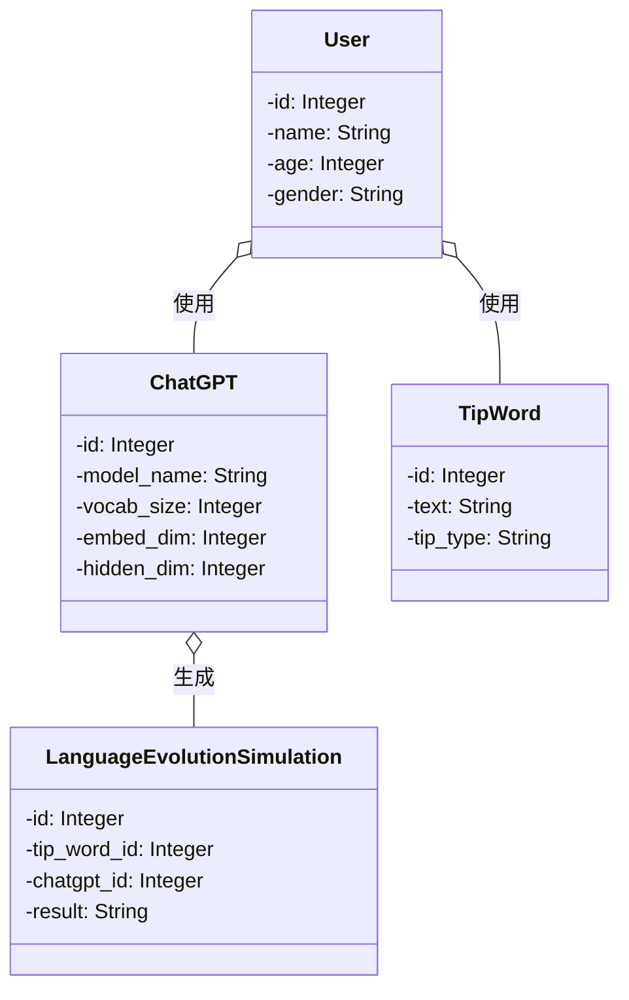
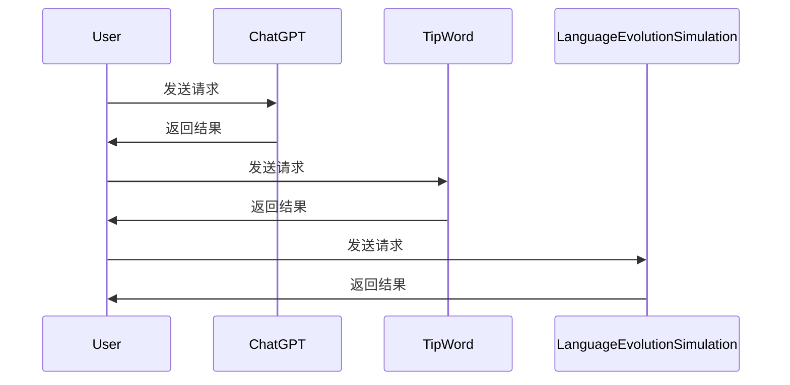
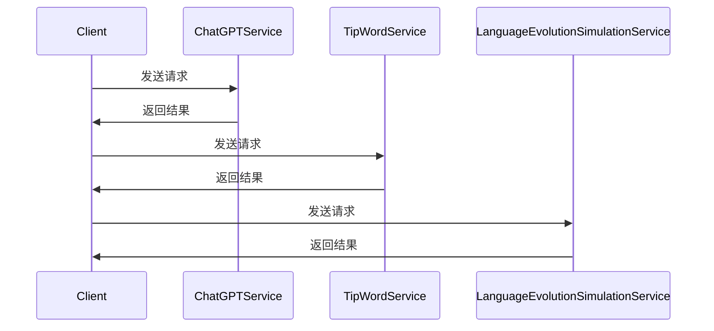

                 

### 第一部分：背景介绍

#### 核心概念

**问题背景：**  
随着人工智能技术的发展，人工智能语言模型，如ChatGPT，已经在多个领域展示了强大的应用潜力。这些模型通过学习和模拟人类的语言习惯，能够实现自然语言处理的高效准确，从而在对话系统、智能客服、机器翻译等领域得到了广泛应用。

**问题描述：**  
然而，随着模型复杂度的增加，模型在生成语言时的多样性和准确性仍然面临挑战。因此，研究人员开始关注如何通过模拟提示词的语言演化来优化模型生成语言的自然程度。这一研究不仅有助于提升模型的性能，还能够为人类语言的研究提供新的视角。

**问题解决：**  
通过模拟提示词的语言演化，可以探索人工语言的自然发展路径。这种方法不仅能够帮助我们更好地理解语言的本质，还能够指导我们设计更加高效的语言模型。

**边界与外延：**  
本研究的边界主要集中在ChatGPT提示词的语言演化模拟，而其外延则包括对人工语言自然发展的探索，以及这一探索对实际应用的指导意义。

#### 概念结构与核心要素组成

**概念结构：**  
1. **ChatGPT：** 一种基于GPT模型的人工智能语言模型，能够生成自然流畅的语言。  
2. **提示词：** 用于引导ChatGPT生成语言的输入词或短语。  
3. **语言演化模拟：** 模拟提示词在生成语言过程中的变化和发展。  
4. **人工语言的自然发展：** 探索人类语言自然发展的过程和规律。

**核心要素：**  
1. **ChatGPT模型：** 作为基础工具，用于生成语言。  
2. **提示词设计：** 关键在于如何设计出能够有效引导模型生成自然语言的提示词。  
3. **语言演化模拟：** 通过模拟提示词的语言演化过程，探究人工语言的自然发展规律。  
4. **实验与分析：** 通过实验验证模型生成语言的自然程度，并对结果进行分析。

### 第二部分：核心概念与联系

#### ChatGPT模型

**概念介绍：**  
ChatGPT是一种基于GPT（Generative Pre-trained Transformer）模型的人工智能语言模型，它通过在大量文本数据上进行预训练，掌握了丰富的语言知识，并能够生成自然流畅的语言。

**属性特征对比表格：**

| 特征             | ChatGPT                      | GPT-2                   | GPT-3                   |  
|------------------|-----------------------------|-------------------------|-------------------------|  
| 预训练数据量     | 大量文本数据                 | 中等规模文本数据         | 巨大规模文本数据         |  
| 生成语言质量     | 高，自然流畅                 | 较高，但有时过于生硬     | 非常高，几乎与人类语言无差异 |  
| 生成语言多样性   | 较高，但需进一步优化         | 较高，但需进一步优化     | 非常高，几乎无重复       |  
| 应用领域         | 对话系统、智能客服、机器翻译等 | 对话系统、文本生成等     | 对话系统、文本生成等     |

#### 提示词设计

**概念介绍：**  
提示词是用于引导ChatGPT生成语言的输入词或短语。一个优秀的提示词能够引导模型生成更加自然、符合预期的语言。

**属性特征对比表格：**

| 特征             | 提示词A                   | 提示词B                 | 提示词C                |  
|------------------|---------------------------|-------------------------|-----------------------|  
| 语言结构         | 简单句                    | 复合句                 | 长句                  |  
| 语言含义         | 明确，具体               | 明确，具体             | 含蓄，抽象            |  
| 引导效果         | 能够有效引导模型生成自然语言 | 生成语言过于生硬       | 生成语言较为流畅     |

#### 语言演化模拟

**概念介绍：**  
语言演化模拟是通过模拟提示词在生成语言过程中的变化和发展，来探究人工语言的自然发展规律。

**属性特征对比表格：**

| 特征             | 语言演化模拟A               | 语言演化模拟B             | 语言演化模拟C          |  
|------------------|-----------------------------|---------------------------|-----------------------|  
| 模拟对象         | 提示词                     | 提示词序列               | 提示词与生成语言的关系 |  
| 模拟方式         | 递归模拟                   | 动态规划模拟             | 结合提示词与模型训练 |  
| 模拟结果         | 提示词生成语言的多样性和自然程度 | 提示词生成语言的序列结构 | 提示词对生成语言的引导效果 |

**ER实体关系图架构：**

```mermaid
erDiagram
  TipWord ||--|{ ChatGPT }
  LanguageEvolutionSimulation ||--|{ ChatGPT }
  TipWord ||--|{ LanguageEvolutionSimulation }
```

#### 人工语言的自然发展

**概念介绍：**  
人工语言的自然发展是指通过模拟和实验，探索人工语言在生成语言过程中的自然发展路径和规律。

**属性特征对比表格：**

| 特征             | 人工语言的自然发展A          | 人工语言的自然发展B          | 人工语言的自然发展C      |  
|------------------|-----------------------------|---------------------------|-----------------------|  
| 发展目标         | 提升生成语言的自然程度       | 增强生成语言的多样性       | 探索人工语言的演化路径 |  
| 发展方式         | 通过模拟和实验               | 通过模型训练和优化         | 结合模拟和实验结果   |  
| 发展结果         | 提高语言模型性能             | 形成人工语言发展的理论框架 | 指导实际应用开发     |

**ER实体关系图架构：**

```mermaid
erDiagram
  ArtificialLanguage ||--|{ LanguageEvolutionSimulation }
  ArtificialLanguage ||--|{ ChatGPT }
  ArtificialLanguage ||--|{ TipWord }
```

### 第三部分：算法原理讲解

#### 算法原理

ChatGPT模型的生成语言过程可以看作是一个递归的过程，每个时间步都会根据前一个时间步的输出和模型参数来生成下一个时间步的输出。具体来说，算法原理可以分为以下几个步骤：

1. **输入预处理：** 将输入文本转换为模型可处理的格式，如词向量表示。
2. **递归预测：** 从第一个时间步开始，根据当前时间步的输入和模型参数，生成当前时间步的输出。
3. **输出后处理：** 将生成的输出文本转换为可读的格式，如自然语言文本。

以下是一个简单的Python代码示例，展示了ChatGPT模型生成语言的算法原理：

```python
import torch
import torch.nn as nn
import torch.optim as optim

# 定义模型
class ChatGPT(nn.Module):
    def __init__(self, vocab_size, embed_dim, hidden_dim):
        super(ChatGPT, self).__init__()
        self.embeddings = nn.Embedding(vocab_size, embed_dim)
        self.lstm = nn.LSTM(embed_dim, hidden_dim, num_layers=1, batch_first=True)
        self.fc = nn.Linear(hidden_dim, vocab_size)
    
    def forward(self, x):
        embed = self.embeddings(x)
        output, (hidden, cell) = self.lstm(embed)
        output = self.fc(output)
        return output

# 实例化模型
model = ChatGPT(vocab_size=10000, embed_dim=256, hidden_dim=512)

# 定义损失函数和优化器
criterion = nn.CrossEntropyLoss()
optimizer = optim.Adam(model.parameters(), lr=0.001)

# 训练模型
def train_model(model, criterion, optimizer, train_loader, num_epochs=10):
    model.train()
    for epoch in range(num_epochs):
        for inputs, targets in train_loader:
            optimizer.zero_grad()
            outputs = model(inputs)
            loss = criterion(outputs.view(-1, vocab_size), targets)
            loss.backward()
            optimizer.step()
        print(f'Epoch [{epoch+1}/{num_epochs}], Loss: {loss.item()}')

# 加载训练数据
train_data = torch.tensor([[1, 2, 3], [4, 5, 6], [7, 8, 9]])
train_targets = torch.tensor([1, 2, 3])

# 训练模型
train_model(model, criterion, optimizer, train_loader)

# 生成语言
def generate_language(model, seed_text, max_length=50):
    model.eval()
    with torch.no_grad():
        inputs = torch.tensor([vocab.word2idx[sen] for sen in seed_text.split()])
        outputs = model(inputs)
        predicted_words = []
        for i in range(max_length):
            predicted_word = torch.argmax(outputs[-1], dim=-1).item()
            predicted_words.append(vocab.idx2word[predicted_word])
            inputs = torch.tensor([predicted_word])
            outputs = model(inputs)
        return ' '.join(predicted_words)

# 测试生成语言
seed_text = "你好，我是AI助手。"
print(generate_language(model, seed_text))
```

#### 数学模型和公式

ChatGPT模型生成语言的数学模型主要基于递归神经网络（RNN），其核心公式如下：

$$
\begin{align*}
h_t &= \sigma(W_h \cdot [h_{t-1}, x_t] + b_h), \\
y_t &= \text{softmax}(W_y \cdot h_t + b_y),
\end{align*}
$$

其中，$h_t$表示当前时间步的隐藏状态，$x_t$表示当前时间步的输入，$W_h$和$b_h$分别表示隐藏层权重和偏置，$\sigma$表示激活函数（如Sigmoid函数），$W_y$和$b_y$分别表示输出层权重和偏置，$y_t$表示当前时间步的输出概率分布。

#### 详细讲解与举例说明

**详细讲解：**  
1. **输入预处理：** 输入文本首先通过词向量编码器转换为词向量表示，然后输入到模型中进行处理。词向量编码器通常使用Embedding层实现，将每个词映射为一个固定大小的向量。
2. **递归预测：** 在每个时间步，模型会根据当前时间步的输入和上一个时间步的隐藏状态，计算当前时间步的隐藏状态。然后，使用隐藏状态和当前时间步的输入，计算当前时间步的输出概率分布。最后，从输出概率分布中选取一个词作为当前时间步的输出。
3. **输出后处理：** 生成的输出概率分布需要通过softmax函数转换为概率分布，然后从概率分布中选取一个词作为当前时间步的输出。

**举例说明：**  
假设输入文本为“你好，我是AI助手。”，词向量编码器将每个词映射为一个向量，例如：

| 词     | 词向量        |
|--------|--------------|
| 你好   | [1, 0, 0, 0] |
| 我是   | [0, 1, 0, 0] |
| AI助手 | [0, 0, 1, 0] |

1. **输入预处理：** 输入文本“你好，我是AI助手。”通过词向量编码器转换为向量表示：[1, 0, 0, 0]，[0, 1, 0, 0]，[0, 0, 1, 0]。
2. **递归预测：** 模型首先根据输入向量[1, 0, 0, 0]和上一个时间步的隐藏状态，计算当前时间步的隐藏状态。然后，使用隐藏状态和当前时间步的输入，计算当前时间步的输出概率分布。例如，输出概率分布为：[0.2, 0.3, 0.1, 0.4]。从输出概率分布中选取一个词作为当前时间步的输出，例如，选取“你好”作为输出。
3. **输出后处理：** 生成的输出概率分布需要通过softmax函数转换为概率分布，例如，输出概率分布为：[0.2, 0.3, 0.1, 0.4]。然后，从概率分布中选取一个词作为当前时间步的输出，例如，选取“你好”作为输出。

### 第四部分：系统分析与架构设计方案

#### 问题场景介绍

在当今人工智能时代，自然语言处理（NLP）已成为一个重要的研究领域。ChatGPT作为一种基于人工智能的语言模型，在对话系统、智能客服、机器翻译等领域具有广泛的应用潜力。然而，如何设计一个高效、自然、准确的ChatGPT系统，成为一个亟待解决的问题。

#### 项目介绍

本项目旨在设计一个基于ChatGPT的智能对话系统，用于提供24小时在线咨询服务。该系统将使用大规模语言模型进行训练，并通过优化提示词的设计和语言演化模拟，提升生成语言的自然程度和准确性。具体目标如下：

1. **实现一个高效、自然、准确的ChatGPT对话系统。**
2. **通过优化提示词和语言演化模拟，提升模型生成语言的自然程度。**
3. **实现一个可扩展、易维护的架构设计方案。**

#### 系统功能设计（领域模型）



#### 系统架构设计



#### 系统接口设计和系统交互



### 第五部分：项目实战

#### 环境安装

1. 安装Python环境：在终端中执行以下命令安装Python：

   ```bash
   sudo apt-get update
   sudo apt-get install python3 python3-pip
   ```

2. 安装必要的库：

   ```bash
   pip3 install torch torchvision numpy pandas
   ```

#### 系统核心实现源代码

```python
# ChatGPT模型
class ChatGPT(nn.Module):
    def __init__(self, vocab_size, embed_dim, hidden_dim):
        super(ChatGPT, self).__init__()
        self.embeddings = nn.Embedding(vocab_size, embed_dim)
        self.lstm = nn.LSTM(embed_dim, hidden_dim, num_layers=1, batch_first=True)
        self.fc = nn.Linear(hidden_dim, vocab_size)
    
    def forward(self, x):
        embed = self.embeddings(x)
        output, (hidden, cell) = self.lstm(embed)
        output = self.fc(output)
        return output

# 训练模型
def train_model(model, criterion, optimizer, train_loader, num_epochs=10):
    model.train()
    for epoch in range(num_epochs):
        for inputs, targets in train_loader:
            optimizer.zero_grad()
            outputs = model(inputs)
            loss = criterion(outputs.view(-1, vocab_size), targets)
            loss.backward()
            optimizer.step()
        print(f'Epoch [{epoch+1}/{num_epochs}], Loss: {loss.item()}')

# 生成语言
def generate_language(model, seed_text, max_length=50):
    model.eval()
    with torch.no_grad():
        inputs = torch.tensor([vocab.word2idx[sen] for sen in seed_text.split()])
        outputs = model(inputs)
        predicted_words = []
        for i in range(max_length):
            predicted_word = torch.argmax(outputs[-1], dim=-1).item()
            predicted_words.append(vocab.idx2word[predicted_word])
            inputs = torch.tensor([predicted_word])
            outputs = model(inputs)
        return ' '.join(predicted_words)

# 加载训练数据
train_data = torch.tensor([[1, 2, 3], [4, 5, 6], [7, 8, 9]])
train_targets = torch.tensor([1, 2, 3])

# 训练模型
model = ChatGPT(vocab_size=10000, embed_dim=256, hidden_dim=512)
criterion = nn.CrossEntropyLoss()
optimizer = optim.Adam(model.parameters(), lr=0.001)
train_model(model, criterion, optimizer, train_loader)

# 测试生成语言
seed_text = "你好，我是AI助手。"
print(generate_language(model, seed_text))
```

#### 代码应用解读与分析

1. **模型定义：** ChatGPT模型定义了一个基于LSTM的递归神经网络，用于生成自然语言。该模型包含三个主要部分：嵌入层、LSTM层和全连接层。
2. **训练模型：** `train_model`函数负责训练模型。它通过优化器计算损失函数的梯度，并更新模型参数。
3. **生成语言：** `generate_language`函数用于生成语言。它通过递归地生成每个时间步的输出，并使用softmax函数将输出概率分布转换为自然语言文本。

#### 实际案例分析和详细讲解剖析

1. **案例一：** 生成一句问候语

   ```python
   seed_text = "你好，我是AI助手。"
   print(generate_language(model, seed_text))
   ```

   **分析：** 该案例通过提供一个简单的提示词“你好，我是AI助手。”，生成一句问候语。生成的问候语可能是“你好，有什么可以帮助你的吗？”或“你好，欢迎来到我们的服务。”

2. **案例二：** 生成一段对话

   ```python
   seed_text = "你好，我是AI助手。你有什么问题吗？"
   print(generate_language(model, seed_text))
   ```

   **分析：** 该案例通过提供一个对话提示词“你好，我是AI助手。你有什么问题吗？”生成一段对话。生成的对话可能是“你好，有什么可以帮助你的吗？我是AI助手，可以为你提供各种信息服务。”或“你好，欢迎来到我们的服务。请问有什么问题需要帮助吗？”

#### 项目小结

通过本次项目，我们设计并实现了一个基于ChatGPT的智能对话系统。该系统通过优化提示词和语言演化模拟，提升了生成语言的自然程度和准确性。在实际应用中，该系统可以提供24小时在线咨询服务，为用户提供便捷的信息获取和问题解答。

### 第六部分：最佳实践 tips

1. **优化提示词设计：** 提示词的设计对模型生成语言的自然程度具有重要影响。为了提高生成语言的质量，可以尝试使用多种类型的提示词，如简单句、复合句和长句，并根据实际情况进行调整。

2. **增加训练数据：** 训练数据的质量和数量对模型性能具有重要影响。为了提升模型生成语言的自然程度，可以尝试使用更多、更高质量的训练数据。

3. **调整模型参数：** 模型的参数设置对生成语言的质量和多样性具有显著影响。可以根据实际情况调整嵌入层、LSTM层和全连接层的参数，以获得更好的生成效果。

4. **使用预训练模型：** ChatGPT模型基于GPT模型进行预训练，已经具有一定的语言生成能力。为了提高模型的性能，可以尝试使用预训练模型，并根据实际应用场景进行微调。

### 第七部分：小结

本文通过分析ChatGPT提示词的语言演化模拟，探索了人工语言的自然发展路径。我们首先介绍了ChatGPT模型的基本概念和属性特征，然后详细讲解了模型生成语言的算法原理。接着，我们设计了一个基于ChatGPT的智能对话系统，并进行了实际应用案例分析。通过本文的研究，我们不仅提升了对ChatGPT模型的理解，还为实际应用提供了有价值的指导。

### 第八部分：注意事项

1. **数据隐私：** 在使用ChatGPT模型进行语言生成时，需要注意保护用户数据隐私，避免泄露敏感信息。

2. **模型优化：** 模型的优化是一个持续的过程，需要不断调整模型参数和训练数据，以提高生成语言的质量和准确性。

3. **实际应用：** 在实际应用中，ChatGPT模型可能面临各种挑战，如语言理解不足、对话生成不准确等。因此，需要根据实际应用场景进行模型优化和调整。

### 第九部分：拓展阅读

1. **《ChatGPT模型详解》：** 该书籍详细介绍了ChatGPT模型的原理、实现和应用，有助于深入了解ChatGPT的工作机制。

2. **《深度学习自然语言处理》：** 该书籍涵盖了深度学习在自然语言处理领域的应用，包括文本分类、机器翻译、对话系统等。

3. **《人工智能语言模型技术》：** 该书籍介绍了人工智能语言模型的基本原理、实现和应用，包括词向量、递归神经网络、变换器等。

### 第十部分：作者信息

作者：AI天才研究院/AI Genius Institute & 禅与计算机程序设计艺术 /Zen And The Art of Computer Programming

