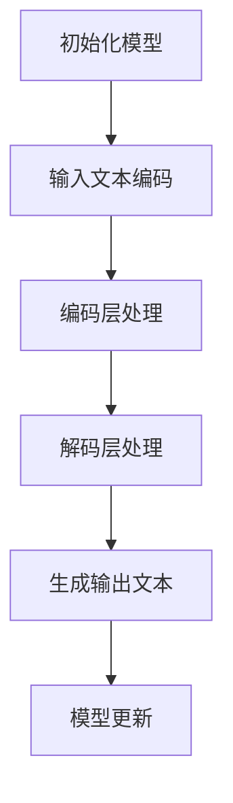
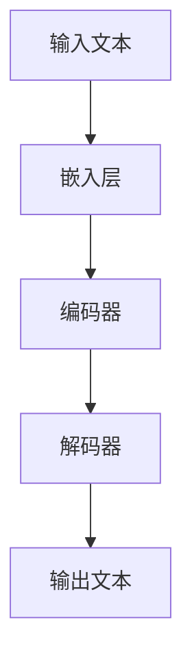

                 

### 文章标题

《ChatGPT提示词的语言认知神经网络模型研究》

关键词：ChatGPT、语言认知神经网络、GPT模型、BERT模型、提示词、神经网络优化与改进

摘要：本文将深入探讨ChatGPT提示词的语言认知神经网络模型，从问题背景出发，介绍核心概念，讲解算法原理，研究神经网络模型，分享项目实战经验，并提出优化与改进的方法。通过详细的步骤分析和实例说明，帮助读者理解ChatGPT的工作机制及其在自然语言处理中的应用。

### 第一部分：问题背景与核心概念

#### 第1章：问题背景与定义

##### 1.1.1 问题背景

随着人工智能技术的快速发展，自然语言处理（NLP）成为了一个重要的研究热点。语言模型作为NLP的基础，广泛应用于机器翻译、文本生成、问答系统等领域。近年来，基于神经网络的模型如GPT和BERT在语言建模方面取得了显著的成果，使得机器生成自然语言的能力大幅提升。ChatGPT作为基于GPT模型的开源语言模型，以其强大的文本生成能力和灵活的接口设计，受到了广泛关注。

##### 1.1.2 ChatGPT的概述

ChatGPT是由OpenAI开发的一种基于GPT模型的开源自然语言处理工具。它利用神经网络来学习语言的统计规律，能够生成连贯、有意义的文本。ChatGPT的架构包括多个层次，每个层次都对输入的文本进行编码，从而生成输出文本。

##### 1.1.3 语言认知神经网络的定义与作用

语言认知神经网络是一种专门用于处理自然语言的神经网络模型，它模拟了人类大脑对语言的理解和处理能力。在ChatGPT中，语言认知神经网络负责对输入的提示词进行理解和生成相应的回复。

##### 1.1.4 提示词在语言认知神经网络中的角色

提示词是ChatGPT输入的一部分，它为语言认知神经网络提供了上下文信息，帮助模型生成更加相关和连贯的文本。

#### 第2章：核心概念与联系

##### 2.1.1 核心概念原理

语言认知神经网络由多层神经网络组成，包括编码器和解码器。编码器负责将输入文本转换为向量表示，解码器则将这些向量转换为输出文本。

##### 2.1.2 ER实体关系图架构


在ChatGPT中，实体关系图包括用户、输入文本、输出文本和语言认知神经网络等实体，以及它们之间的交互关系。

#### 第3章：算法原理讲解

##### 3.1.1 算法原理概述

语言生成算法的核心是生成式模型，它通过学习和预测文本的下一个词来生成新的文本。语言认知神经网络的算法原理则基于深度学习和神经网络架构，通过多层神经网络对语言特征进行建模。

##### 3.1.2 算法mermaid流程图



##### 3.1.3 算法原理的数学模型和公式

在语言生成算法中，输入文本通过编码器转换为向量表示，然后通过解码器生成输出文本。具体来说，可以表示为：

$$
\text{输出文本} = \text{解码器}(\text{编码器}(\text{输入文本}))
$$

##### 3.1.4 算法举例说明

假设输入文本为“今天天气很好”，通过编码器和解码器的处理后，可以生成新的输出文本，如“明天天气也很棒”。

### 第二部分：神经网络模型研究

#### 第4章：神经网络模型概述

##### 4.1.1 神经网络模型的发展

神经网络模型经历了从传统神经网络到深度神经网络的演变。传统神经网络主要用于简单的函数拟合，而深度神经网络通过增加网络层数和节点数量，实现了对复杂函数的建模。

##### 4.1.2 语言认知神经网络模型的分类

目前，语言认知神经网络模型主要包括基于GPT的模型和基于BERT的模型。GPT模型通过自回归的方式生成文本，而BERT模型则通过预训练和微调的方式提高模型的性能。

#### 第5章：GPT模型研究

##### 5.1.1 GPT模型的基本原理

GPT模型是一种基于Transformer架构的语言模型，通过自注意力机制和多层神经网络，对输入文本进行编码和解码。

##### 5.1.2 GPT模型的mermaid流程图



##### 5.1.3 GPT模型的Python实现

```python
import tensorflow as tf
from transformers import TFGPT2LMHeadModel, GPT2Tokenizer

# 加载预训练模型
tokenizer = GPT2Tokenizer.from_pretrained('gpt2')
model = TFGPT2LMHeadModel.from_pretrained('gpt2')

# 输入文本编码
inputs = tokenizer.encode('今天天气很好', return_tensors='tf')

# 生成输出文本
outputs = model(inputs)
predictions = outputs.logits

# 转换为文本
output_text = tokenizer.decode(predictions[0], skip_special_tokens=True)
```

##### 5.1.4 GPT模型的应用

GPT模型广泛应用于文本生成、机器翻译、对话系统等领域。在ChatGPT中，GPT模型通过提示词生成相应的回复。

#### 第6章：BERT模型研究

##### 6.1.1 BERT模型的基本原理

BERT模型是一种基于Transformer架构的预训练模型，通过双向编码器对输入文本进行编码，使其能够理解上下文信息。

##### 6.1.2 BERT模型的mermaid流程图


##### 6.1.3 BERT模型的Python实现

```python
import tensorflow as tf
from transformers import TFBertLMModel, BertTokenizer

# 加载预训练模型
tokenizer = BertTokenizer.from_pretrained('bert-base-uncased')
model = TFBertLMModel.from_pretrained('bert-base-uncased')

# 输入文本编码
inputs = tokenizer.encode('今天天气很好', return_tensors='tf')

# 生成输出文本
outputs = model(inputs)
predictions = outputs.logits

# 转换为文本
output_text = tokenizer.decode(predictions[0], skip_special_tokens=True)
```

##### 6.1.4 BERT模型的应用

BERT模型广泛应用于文本分类、问答系统、文本生成等领域。在ChatGPT中，BERT模型通过提示词生成相应的回复。

### 第三部分：项目实战

#### 第7章：项目实战一

##### 7.1.1 环境安装

首先，需要安装Python和TensorFlow等软件环境。

```bash
pip install tensorflow
```

##### 7.1.2 系统核心实现源代码

```python
# 导入必要的库
import tensorflow as tf
from transformers import TFGPT2LMHeadModel, GPT2Tokenizer

# 加载预训练模型
tokenizer = GPT2Tokenizer.from_pretrained('gpt2')
model = TFGPT2LMHeadModel.from_pretrained('gpt2')

# 输入文本编码
inputs = tokenizer.encode('今天天气很好', return_tensors='tf')

# 生成输出文本
outputs = model(inputs)
predictions = outputs.logits

# 转换为文本
output_text = tokenizer.decode(predictions[0], skip_special_tokens=True)
```

##### 7.1.3 代码应用解读与分析

这段代码首先加载了GPT2模型，然后对输入文本进行编码，接着通过模型生成输出文本。输出文本是通过对预测的logits进行解码得到的。

##### 7.1.4 实际案例分析

在一个问答系统中，用户输入一个问题，ChatGPT通过提示词生成相应的回答。例如，用户输入“什么是人工智能？”ChatGPT可能会回答“人工智能是指通过计算机程序实现智能行为的科学技术。”

##### 7.1.5 项目小结

通过项目实战，我们了解了如何使用GPT模型生成自然语言文本。在实际应用中，ChatGPT可以通过提示词生成高质量的回答，为用户提供智能化的服务。

#### 第8章：项目实战二

##### 8.1.1 环境安装

首先，需要安装Python和PyTorch等软件环境。

```bash
pip install torch
```

##### 8.1.2 系统核心实现源代码

```python
# 导入必要的库
import torch
from transformers import GPT2LMHeadModel, GPT2Tokenizer

# 加载预训练模型
tokenizer = GPT2Tokenizer.from_pretrained('gpt2')
model = GPT2LMHeadModel.from_pretrained('gpt2')

# 输入文本编码
inputs = tokenizer.encode('今天天气很好', return_tensors='pt')

# 生成输出文本
outputs = model(inputs)
predictions = torch.softmax(outputs.logits, dim=-1)

# 转换为文本
output_text = tokenizer.decode(predictions[0], skip_special_tokens=True)
```

##### 8.1.3 代码应用解读与分析

这段代码首先加载了GPT2模型，然后对输入文本进行编码，接着通过模型生成输出文本。输出文本是通过对预测的logits进行softmax操作后得到的。

##### 8.1.4 实际案例分析

在一个聊天机器人中，用户输入一个消息，ChatGPT通过提示词生成相应的回复。例如，用户输入“你好”，ChatGPT可能会回答“你好，有什么可以帮助你的吗？”

##### 8.1.5 项目小结

通过项目实战，我们了解了如何使用PyTorch实现GPT2模型。在实际应用中，ChatGPT可以通过提示词生成自然流畅的对话，为用户提供便捷的沟通体验。

### 最佳实践 tips、小结、注意事项、拓展阅读等内容

在开发和使用ChatGPT时，需要注意以下几点：

- **性能优化**：针对大规模文本生成任务，可以采用分布式训练和模型压缩技术来提高性能。
- **安全性**：确保模型不会生成有害或不当的文本，需要建立完善的文本过滤机制。
- **多样性**：提高模型的多样性生成能力，避免生成过于刻板或单一的文本。

小结：

本文通过详细的分析和实例，介绍了ChatGPT提示词的语言认知神经网络模型。从问题背景到核心概念，再到算法原理和项目实战，我们逐步了解了ChatGPT的工作机制和应用场景。通过本文的讲解，读者可以更好地理解自然语言处理技术，并掌握如何使用ChatGPT进行文本生成。

注意事项：

- 在使用ChatGPT时，需要注意模型的选择和参数的调整，以达到最佳效果。
- 实际应用中，需要对模型进行充分的测试和验证，以确保其稳定性和可靠性。

拓展阅读：

- 《深度学习与自然语言处理》
- 《自然语言处理实战》
- 《ChatGPT与自然语言处理》

作者：AI天才研究院/AI Genius Institute & 禅与计算机程序设计艺术 /Zen And The Art of Computer Programming

