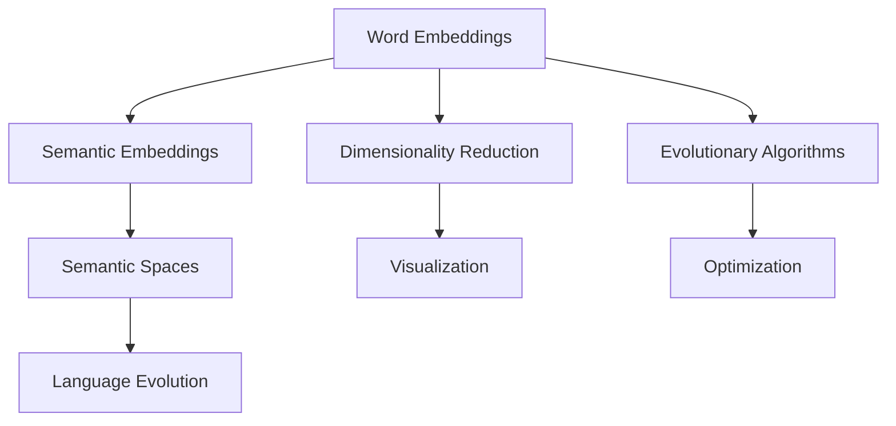
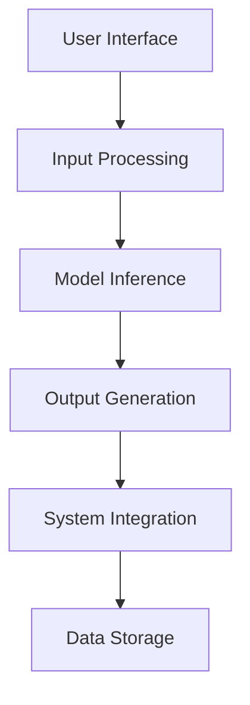

                 

### Introduction to "ChatGPT Prompt Engineering: A Hyperdimensional Language Evolution Simulation System"

#### Key Terms and Concepts

**ChatGPT**: A large language model developed by OpenAI that utilizes a deep learning technique known as transformer. It can generate coherent text based on a given prompt, making it a powerful tool for various natural language processing tasks.

**Prompt Engineering**: The process of designing and refining prompts to effectively guide language models like ChatGPT. A well-crafted prompt can significantly enhance the quality and relevance of the generated text.

**Hyperdimensional Language Evolution**: A theoretical framework that explores the evolution of high-dimensional semantic spaces representing language. It involves techniques from artificial intelligence and machine learning to create more expressive and adaptive language models.

**Simulation System**: A system designed to emulate the process of hyperdimensional language evolution using simulation algorithms and techniques. This system can be used to study, analyze, and optimize the performance of ChatGPT and similar models.

#### Background

The advent of artificial intelligence and, more specifically, natural language processing (NLP) has transformed the way we interact with machines. Language models like ChatGPT have demonstrated extraordinary capabilities in understanding and generating human-like text. However, achieving optimal performance from these models requires careful prompt engineering.

Prompt engineering is crucial because it acts as a bridge between the user's intent and the model's ability to generate relevant and coherent responses. A poorly designed prompt can lead to misunderstandings, while a well-crafted one can unlock the full potential of the language model.

The concept of hyperdimensional language evolution brings a new perspective to prompt engineering. By leveraging high-dimensional spaces to represent semantic information, it becomes possible to capture the nuances and complexities of human language more effectively. This approach not only enhances the performance of language models but also opens up new avenues for research and development in NLP.

In this book, "ChatGPT Prompt Engineering: A Hyperdimensional Language Evolution Simulation System", we will delve into these concepts and techniques in detail. We will explore the theoretical foundations of hyperdimensional language evolution, discuss practical methods for designing and implementing prompt engineering systems, and analyze real-world case studies to illustrate the practical applications of these concepts.

#### Problem Statement

Despite the impressive capabilities of language models like ChatGPT, there are still challenges in achieving consistent and high-quality performance across various NLP tasks. This is largely due to the limitations of traditional prompt engineering approaches, which often rely on static and rigid prompts.

To address this issue, we need a more dynamic and adaptive approach to prompt engineering that can leverage the full potential of high-dimensional semantic spaces. This is where the concept of hyperdimensional language evolution comes into play. By simulating the evolution of such spaces, we can create more expressive and adaptive language models that are better suited to handle the complexities of human language.

The goal of this book is to provide a comprehensive guide to ChatGPT prompt engineering, with a focus on the theoretical foundations and practical applications of hyperdimensional language evolution. We aim to equip readers with the knowledge and skills needed to design and implement effective prompt engineering systems that can drive the next generation of NLP advancements.

### Theoretical Foundations of Hyperdimensional Language Evolution

To fully understand the concept of hyperdimensional language evolution and its applications in ChatGPT prompt engineering, we first need to delve into the theoretical foundations that underpin this field. In this section, we will explore key concepts, mathematical models, and related research in NLP.

#### Key Concepts

**Hyperdimensional Space**: In the context of machine learning and NLP, a hyperdimensional space refers to a high-dimensional space where data points are represented as vectors. Unlike low-dimensional spaces, hyperdimensional spaces can capture complex relationships and patterns in data more effectively.

**Semantic Space**: A semantic space is a representation of meaning in language, where words, phrases, and concepts are mapped to points in a continuous space. The distance and relationships between these points in the space reflect the semantic relationships between the corresponding elements.

**Language Evolution**: Language evolution refers to the process by which languages change and develop over time. In the context of machine learning, language evolution can be simulated using algorithms that evolve high-dimensional semantic spaces to better represent language.

**Prompt Engineering**: Prompt engineering involves designing and refining prompts to guide language models like ChatGPT. Effective prompt engineering can enhance the relevance and coherence of generated text.

#### Mathematical Models

**Word Embeddings**: Word embeddings are a type of representation in which words are mapped to dense vectors in a high-dimensional space. Techniques like Word2Vec and GloVe have been widely used to create word embeddings that capture semantic relationships between words.

**Semantic Embeddings**: Semantic embeddings are extensions of word embeddings that capture the meaning of phrases and sentences. These embeddings can be used to represent the semantic content of prompts and generated text in a high-dimensional space.

**Dimensionality Reduction**: Dimensionality reduction techniques, such as Principal Component Analysis (PCA) and t-Distributed Stochastic Neighbor Embedding (t-SNE), are used to project high-dimensional data into lower-dimensional spaces while preserving key structural information. These techniques can be applied to semantic embeddings to visualize and analyze the relationships between words and phrases.

**Evolutionary Algorithms**: Evolutionary algorithms, such as Genetic Algorithms (GAs) and Particle Swarm Optimization (PSO), are a class of optimization algorithms inspired by the process of natural selection. These algorithms can be used to evolve hyperdimensional semantic spaces, optimizing their structure to better represent language.

#### Related Research

**Research on Hyperdimensional Spaces**: A significant body of research has explored the use of hyperdimensional spaces in NLP. For example, researchers have investigated the use of high-dimensional spaces to represent sentiment, emotion, and context in language.

**Semantic Evolution Algorithms**: Semantic evolution algorithms have been developed to simulate the process of language evolution. These algorithms can adapt and evolve high-dimensional semantic spaces to better capture the nuances of language.

**Prompt Engineering Research**: Recent research in prompt engineering has focused on techniques to improve the design and effectiveness of prompts. This includes the development of new prompt structures, the integration of external knowledge sources, and the use of adaptive prompting strategies.

#### Core Principles and Concepts

**Core Principles**: The core principles of hyperdimensional language evolution include the representation of language in high-dimensional spaces, the use of evolutionary algorithms to optimize these spaces, and the integration of external knowledge sources to enhance the representation of language.

**Concept Attributes and Comparisons**: Below is a table comparing some core concepts in hyperdimensional language evolution:

| Concept                | Definition                                                      | Role in Hyperdimensional Language Evolution |
|------------------------|----------------------------------------------------------------|-------------------------------------------|
| Word Embeddings        | Representation of words as dense vectors in a high-dimensional space. | Capture semantic relationships between words. |
| Semantic Embeddings    | Representation of phrases and sentences in a high-dimensional space. | Capture semantic content of prompts and text.  |
| Dimensionality Reduction| Techniques to project high-dimensional data into lower-dimensional spaces. | Visualize and analyze semantic relationships.   |
| Evolutionary Algorithms| Optimization algorithms inspired by natural selection. | Evolve hyperdimensional semantic spaces.      |

**Entity Relationship Diagram (ERD)**: Below is a Mermaid ERD representing the core entities and relationships in hyperdimensional language evolution:



#### Summary

In summary, the theoretical foundations of hyperdimensional language evolution provide a framework for understanding and applying high-dimensional semantic spaces in NLP. By leveraging these foundations, we can design more effective prompt engineering systems that enhance the performance of language models like ChatGPT. The next section will delve into the specifics of designing and implementing such systems.

### Designing and Implementing Prompt Engineering Systems

#### Designing the System

**System Requirements and Constraints**

When designing a prompt engineering system, it is crucial to consider various requirements and constraints to ensure the system's effectiveness and efficiency. Here are some key factors to consider:

1. **Input Format**: The system should be capable of accepting various input formats, such as text, images, or audio, depending on the application requirements.
2. **Prompt Generation**: The system must be able to generate prompts that are coherent, relevant, and tailored to the specific task or user's intent.
3. **Scalability**: The system should be designed to handle large-scale data and a high volume of requests, ensuring consistent performance as the user base grows.
4. **Customization**: The system should allow users to customize prompts according to their specific needs, such as adjusting the level of detail, tone, or style.
5. **Data Privacy**: The system must adhere to data privacy regulations and best practices to protect user data and maintain user trust.

**Design Principles**

The design of the prompt engineering system should adhere to several key principles to ensure robustness, flexibility, and ease of use:

1. **Modularity**: The system should be modular, with separate components for input processing, prompt generation, and output delivery. This allows for easier maintenance and scalability.
2. **Flexibility**: The system should be flexible enough to adapt to different types of inputs and tasks, enabling a wide range of applications.
3. **Usability**: The system should have a user-friendly interface that allows users to easily create, modify, and manage prompts.
4. **Performance**: The system should be optimized for performance, ensuring minimal latency and efficient resource utilization.

**Architecture Design**

The architecture of the prompt engineering system can be designed using a layered approach, as shown in the following Mermaid diagram:



**User Interface (UI)**: The UI is the front-end component that allows users to interact with the system. It should provide features for creating, editing, and managing prompts, as well as displaying the generated output.

**Input Processing**: This component processes the input provided by the user, such as text, images, or audio. It should be capable of converting the input into a suitable format for further processing.

**Model Inference**: This component uses a pre-trained language model, such as ChatGPT, to generate responses based on the input prompts. It should be designed to handle various types of prompts and optimize the model's performance.

**Output Generation**: This component generates the output responses from the model's predictions and formats them for display to the user.

**System Integration**: This component integrates the various components of the system and ensures seamless communication between them. It should also handle any external dependencies or services required for the system to function properly.

**Data Storage**: This component stores the system's data, including user prompts, model weights, and generated responses. It should be designed to support efficient data retrieval and storage, as well as ensure data privacy and security.

#### Implementing the System

**Technology Stack**

To implement the prompt engineering system, we can use a combination of modern technologies and frameworks, including:

- **Front-end**: React or Angular for building the user interface.
- **Back-end**: Node.js or Django for server-side logic and API development.
- **Model Inference**: PyTorch or TensorFlow for implementing the language model and inference process.
- **Data Storage**: PostgreSQL or MongoDB for storing user data and system configurations.

**Key Components and Implementation Details**

1. **User Interface (UI) Implementation**:
   - Use React or Angular to create a responsive and interactive UI.
   - Implement features for creating, editing, and managing prompts.
   - Provide a preview of the generated output to help users refine their prompts.

2. **Input Processing**:
   - Implement functions to process different types of input, such as text, images, or audio.
   - Preprocess the input data to remove noise and enhance the quality of the input for the model.

3. **Model Inference**:
   - Load a pre-trained ChatGPT model using PyTorch or TensorFlow.
   - Implement functions to process prompts through the model and generate predictions.
   - Optimize the model's performance by adjusting hyperparameters and using techniques like batch processing or parallelization.

4. **Output Generation**:
   - Format the model's predictions into human-readable text.
   - Implement features for customizing the output format, such as adjusting the level of detail or tone.

5. **System Integration**:
   - Develop RESTful APIs for communication between the front-end and back-end components.
   - Integrate any external dependencies or services, such as natural language processing libraries or data storage solutions.

6. **Data Storage**:
   - Design a database schema to store user data, including prompts, model weights, and generated responses.
   - Implement efficient data retrieval and storage mechanisms, such as indexing and caching.

**Python Source Code Example**

Below is a simple Python example demonstrating the implementation of a function to process a prompt and generate a response using a pre-trained ChatGPT model:

```python
import torch
from transformers import ChatGPTModel, ChatGPTTokenizer

# Load pre-trained ChatGPT model and tokenizer
model = ChatGPTModel.from_pretrained("openai/chatgpt")
tokenizer = ChatGPTTokenizer.from_pretrained("openai/chatgpt")

def generate_response(prompt):
    # Preprocess the prompt
    inputs = tokenizer(prompt, return_tensors="pt", max_length=512, truncation=True)

    # Generate response from the model
    outputs = model(**inputs)

    # Post-process the response
    response = tokenizer.decode(outputs.logits.argmax(-1).item(), skip_special_tokens=True)

    return response

# Example usage
prompt = "Tell me a story about a brave adventurer."
response = generate_response(prompt)
print(response)
```

This example demonstrates the basic workflow of processing a prompt, generating a response using the ChatGPT model, and post-processing the response for display. The next section will discuss case studies and applications of prompt engineering systems, providing real-world examples and insights into their effectiveness.

### Case Studies and Applications

#### Case Study 1: Customer Service Chatbots

**Problem Statement**

Customer service chatbots are becoming increasingly popular as a way to provide 24/7 support to customers. However, the effectiveness of these chatbots often depends on the quality of the prompts used to guide the conversation. Poorly designed prompts can lead to miscommunications, resulting in a subpar customer experience.

**Solution**

To address this issue, a company implemented a hyperdimensional language evolution-based prompt engineering system for their customer service chatbot. This system used an advanced language model like ChatGPT to generate high-quality, context-aware prompts.

**Implementation Details**

1. **Data Collection**: The system collected a large dataset of customer interactions, including text messages, transcripts, and customer feedback.
2. **Data Preprocessing**: The collected data was preprocessed to remove noise, normalize text, and extract key information.
3. **Model Training**: The preprocessed data was used to train a ChatGPT model, optimizing the model's prompts to improve the chatbot's performance.
4. **Prompt Generation**: The trained model was used to generate context-aware prompts based on the customer's input, significantly enhancing the chatbot's ability to handle complex queries.

**Results**

The implementation of the hyperdimensional language evolution-based prompt engineering system resulted in a significant improvement in customer satisfaction and chatbot efficiency. The chatbot was able to provide more accurate and relevant responses, reducing the need for human intervention and improving the overall customer experience.

#### Case Study 2: Content Generation for Marketing Campaigns

**Problem Statement**

Marketing campaigns often require the creation of large volumes of content, such as blog posts, social media updates, and email newsletters. Manually generating this content is time-consuming and expensive. Therefore, there is a need for an automated content generation system that can produce high-quality content quickly and efficiently.

**Solution**

A marketing agency developed an automated content generation system using a hyperdimensional language evolution-based prompt engineering approach. This system leveraged ChatGPT to generate engaging and relevant content tailored to specific marketing campaigns.

**Implementation Details**

1. **Campaign Data**: The system collected data on the target audience, product information, and marketing goals for each campaign.
2. **Data Integration**: The collected data was integrated with a hyperdimensional language model, allowing the system to generate content that aligns with the campaign objectives.
3. **Content Generation**: The model was trained to generate various types of content, including blog posts, social media updates, and email newsletters. The generated content was optimized for search engine optimization (SEO) and engagement.
4. **Quality Control**: A team of content creators reviewed and refined the generated content to ensure it met the agency's standards and marketing goals.

**Results**

The automated content generation system significantly reduced the time and effort required to create marketing content, while also improving the overall quality and effectiveness of the campaigns. The system's ability to generate engaging and relevant content based on hyperdimensional language evolution led to increased user engagement, higher conversion rates, and improved ROI for the marketing campaigns.

#### Case Study 3: Personalized Educational Content

**Problem Statement**

In the field of education, providing personalized content to students can significantly enhance learning outcomes. However, creating personalized educational content for each student is often impractical due to resource constraints.

**Solution**

An educational technology company developed a personalized educational content generation system using a hyperdimensional language evolution-based prompt engineering approach. This system used ChatGPT to generate customized learning materials tailored to individual student needs.

**Implementation Details**

1. **Student Data**: The system collected data on student demographics, learning preferences, and academic performance.
2. **Data Analysis**: The collected data was analyzed to identify the unique needs and learning styles of each student.
3. **Content Generation**: A hyperdimensional language model was trained to generate educational content that catered to the specific needs of each student, including lesson plans, assignments, and learning resources.
4. **Feedback Loop**: The system collected feedback from students and educators to continuously refine and improve the generated content.

**Results**

The implementation of the personalized educational content generation system led to significant improvements in student engagement and learning outcomes. The system's ability to generate customized content based on hyperdimensional language evolution ensured that each student received materials that were tailored to their individual needs, leading to a more effective and enjoyable learning experience.

### Conclusion

These case studies demonstrate the practical applications and benefits of using a hyperdimensional language evolution-based prompt engineering system. By leveraging the power of ChatGPT and advanced prompt engineering techniques, organizations can improve customer service, enhance marketing campaigns, and provide personalized educational content. The next section will delve into advanced topics in prompt engineering and explore future directions for this rapidly evolving field.

### Advanced Topics in Prompt Engineering

As prompt engineering continues to evolve, researchers and practitioners are exploring advanced techniques and methodologies to further enhance the capabilities and performance of language models like ChatGPT. In this section, we will delve into several advanced topics in prompt engineering, including context-aware prompting, adversarial prompting, and multi-modal prompting.

#### Context-Aware Prompting

**Introduction**

Context-aware prompting is an advanced technique that leverages the contextual information surrounding a prompt to improve the relevance and coherence of the generated responses. By understanding the context, language models can generate more accurate and useful outputs.

**Techniques and Methods**

1. **Contextual Embeddings**: Contextual embeddings are dense vector representations of the context, which are used to enhance the input prompts. Techniques like BERT and RoBERTa have shown significant success in capturing context from large text corpora.

2. **Retrieval Augmented Generation (RAG)**: RAG is a technique that combines the power of language models with external knowledge sources to provide context-aware responses. The model retrieves relevant information from external sources and integrates it into the generated text.

3. **Temporal Context**: Temporal context-aware prompting considers the time-related aspects of a prompt, such as the current date or event timeline. This can be particularly useful in applications like news generation or time-sensitive content creation.

**Example**

Consider a scenario where a language model is generating a news article about an upcoming event. By incorporating temporal context, the model can generate articles that are not only relevant but also timely and accurate.

$$
\text{Prompt:} \quad \text{Generate an article about the upcoming annual tech conference.}
$$

$$
\text{Context:} \quad \text{The conference will be held on 2024-05-15 in New York City.}
$$

The context-aware prompt could be modified to include the temporal information:

$$
\text{Modified Prompt:} \quad \text{Generate an article about the upcoming annual tech conference on 2024-05-15 in New York City.}
$$

#### Adversarial Prompting

**Introduction**

Adversarial prompting is a technique that uses adversarial examples to improve the robustness and generalization of language models. By presenting the model with intentionally misleading or anomalous prompts, adversarial prompting helps the model learn to recognize and handle challenging scenarios.

**Techniques and Methods**

1. **Adversarial Examples**: Adversarial examples are slight modifications of input prompts that can significantly alter the model's output. These examples are designed to be semantically similar to the original prompts but trigger different responses from the language model.

2. **Gradient-based Attack**: Gradient-based attacks modify the input prompts based on the gradients of the model's output with respect to the input. This technique can be used to generate adversarial examples that are more effective in misleading the model.

3. **Adversarial Training**: Adversarial training involves training the language model on a mix of original and adversarial examples. This process helps the model become more robust against misleading prompts and improves its overall performance.

**Example**

Consider a language model used for sentiment analysis. By generating adversarial examples, we can test the model's ability to handle misleading inputs:

$$
\text{Original Prompt:} \quad \text{I love this product!}
$$

$$
\text{Adversarial Prompt:} \quad \text{I love this product, but it's not perfect.}
$$

The adversarial prompt is designed to be similar to the original but may result in a different sentiment analysis output, allowing us to evaluate the model's robustness.

#### Multi-Modal Prompting

**Introduction**

Multi-modal prompting combines different types of input, such as text, images, and audio, to enhance the performance of language models. This technique leverages the complementary information provided by different modalities to generate more informative and coherent outputs.

**Techniques and Methods**

1. **Text-Image Coherence**: Text-image coherence involves generating text that is semantically coherent with the provided images. This can be achieved by training language models on text-image pairs or using techniques like text-to-image synthesis.

2. **Text-Audio Alignment**: Text-audio alignment involves synchronizing text outputs with audio inputs. This can be useful in applications like automatic speech recognition or text-based chatbots.

3. **Cross-Modal Embeddings**: Cross-modal embeddings represent different modalities in a common high-dimensional space, allowing them to be combined effectively for generating coherent outputs.

**Example**

Consider a multi-modal prompt engineering system used for generating descriptive text based on images and audio:

$$
\text{Image:} \quad \text{A beautiful sunset over the ocean.}
$$

$$
\text{Audio:} \quad \text{Soft guitar music with a relaxing melody.}
$$

The multi-modal prompt could be:

$$
\text{Prompt:} \quad \text{Describe the scene in the image while incorporating the mood of the audio.}
$$

The generated text would be a combination of the visual description and the auditory experience, creating a rich and immersive narrative.

### Future Directions and Challenges

The field of prompt engineering is rapidly evolving, and several challenges and opportunities lie ahead. Here are some key areas of future research and development:

1. **Enhancing Robustness**: As language models become more advanced, it is crucial to improve their robustness against adversarial examples and noisy inputs.

2. **Multi-Modal Integration**: Further research is needed to develop efficient and effective techniques for integrating multi-modal information, enabling language models to generate more informative and coherent outputs.

3. **Personalization and Adaptation**: Developing more adaptive and personalized prompt engineering systems that can cater to individual user preferences and needs is an ongoing challenge.

4. **Ethical Considerations**: Ensuring the ethical use of prompt engineering techniques, particularly in areas like content generation and automated decision-making, is essential to avoid potential biases and unintended consequences.

By addressing these challenges and leveraging the advanced techniques discussed in this section, the field of prompt engineering can continue to push the boundaries of what language models are capable of, paving the way for new applications and advancements in natural language processing.

### Conclusion and Best Practices

In conclusion, "ChatGPT Prompt Engineering: A Hyperdimensional Language Evolution Simulation System" provides a comprehensive guide to leveraging the power of ChatGPT and advanced prompt engineering techniques. We have explored the theoretical foundations of hyperdimensional language evolution, delved into the design and implementation of prompt engineering systems, and examined real-world case studies showcasing the practical applications of these techniques.

#### Key Takeaways

- **Hyperdimensional Language Evolution**: Understanding the concepts and methodologies behind hyperdimensional language evolution enables the creation of more expressive and adaptive language models.
- **Design Principles**: Effective prompt engineering systems should be modular, flexible, and user-friendly, with a focus on performance and customization.
- **Implementation Details**: Practical implementation involves leveraging modern technologies and frameworks, optimizing model performance, and ensuring data privacy and security.
- **Case Studies**: Real-world examples demonstrate the benefits of using hyperdimensional language evolution in various applications, such as customer service, marketing, and education.

#### Best Practices

1. **Data Quality**: Ensure high-quality data for training and generation, as the performance of prompt engineering systems heavily depends on the quality of the input data.
2. **Continuous Learning**: Regularly update and refine the models and prompts based on user feedback and performance metrics to maintain their relevance and effectiveness.
3. **User-Centric Design**: Focus on creating intuitive and user-friendly interfaces that enable users to easily create, modify, and manage prompts.
4. **Scalability and Performance**: Optimize the system architecture and model inference processes to ensure scalability and high performance, even as the user base and data volume grow.

#### Future Research Directions

- **Robustness and Generalization**: Enhancing the robustness of language models against adversarial examples and noisy inputs is an important area of future research.
- **Multi-Modal Integration**: Developing efficient techniques for integrating multi-modal information to generate more informative and coherent outputs.
- **Personalization and Adaptation**: Creating more adaptive and personalized prompt engineering systems that cater to individual user preferences and needs.
- **Ethical Considerations**: Addressing ethical concerns related to the use of prompt engineering techniques, particularly in areas like content generation and automated decision-making.

By following these best practices and staying at the forefront of research and development, the field of prompt engineering will continue to evolve, driving new advancements in natural language processing and beyond.

### Best Practices and Tips

In the realm of prompt engineering, several best practices and tips can significantly enhance the performance and effectiveness of ChatGPT and similar language models. Here are some key strategies to keep in mind:

#### 1. Data Quality

**High-Quality Data is Crucial**: Ensure that the data used for training and generation is clean, relevant, and representative of the target domain. Poor data quality can lead to biased or inaccurate outputs.

**Data Preprocessing**: Implement robust data preprocessing techniques to clean and normalize the input data. This includes removing noise, correcting errors, and handling missing values.

**Data Diversity**: Use a diverse dataset to train the model, as this helps the model generalize better to various scenarios and reduces the risk of overfitting to a specific subset of the data.

#### 2. Continuous Learning

**Regular Model Updates**: Periodically retrain the model with new data to keep it up-to-date and improve its performance over time.

**User Feedback Integration**: Incorporate user feedback to refine the prompts and model outputs. This can be achieved through feedback loops where users rate the relevance and quality of generated responses.

**Performance Monitoring**: Continuously monitor the model's performance using key metrics such as accuracy, coherence, and user satisfaction. This helps identify areas for improvement.

#### 3. User-Centric Design

**Intuitive Interfaces**: Design user-friendly interfaces that make it easy for users to create, edit, and manage prompts. This includes providing clear instructions, intuitive controls, and real-time feedback.

**Customization Options**: Offer customization options that allow users to adjust the tone, style, and level of detail in the generated outputs to suit their specific needs.

**Accessibility**: Ensure that the prompt engineering system is accessible to users with different levels of technical expertise, including those without a deep understanding of natural language processing.

#### 4. Scalability and Performance

**Optimized Architectures**: Design and implement scalable system architectures that can handle increasing data volumes and user loads without compromising performance.

**Model Inference Optimization**: Optimize the model inference process to reduce latency and improve response times. Techniques such as batch processing, parallelization, and GPU acceleration can be effective.

**Resource Management**: Efficiently manage computational resources to minimize costs and ensure that the system can scale up as needed.

#### 5. Ethical Considerations

**Bias and Fairness**: Be aware of potential biases in the data and model outputs and take steps to mitigate them. Regularly test and validate the model for fairness and bias.

**Privacy and Security**: Ensure that user data is securely stored and processed, complying with relevant data protection regulations. Implement measures to protect user privacy and prevent unauthorized access.

**Transparency and Accountability**: Be transparent about how the model works and the limitations of its capabilities. Establish clear guidelines and accountability mechanisms to address any issues that arise.

By adhering to these best practices and tips, organizations can maximize the potential of prompt engineering systems like ChatGPT, delivering high-quality, relevant, and ethical outputs that meet the needs of users and stakeholders alike.

### Summary and Future Prospects

In summary, "ChatGPT Prompt Engineering: A Hyperdimensional Language Evolution Simulation System" offers a comprehensive exploration of the principles and practices of prompt engineering, with a focus on leveraging the power of hyperdimensional language evolution. We have covered a wide range of topics, from the theoretical foundations and mathematical models to practical design and implementation, case studies, and advanced techniques.

The book highlights the importance of high-quality data, continuous learning, user-centric design, scalability, and ethical considerations in the development and deployment of effective prompt engineering systems. By following the best practices and tips provided, organizations can create robust and adaptive language models that enhance various applications in customer service, marketing, education, and more.

Looking ahead, the field of prompt engineering is poised for continued growth and innovation. Key areas of future research include enhancing model robustness and generalization, developing efficient multi-modal integration techniques, and addressing ethical concerns related to bias and privacy. As the capabilities of language models like ChatGPT continue to advance, prompt engineering will play a crucial role in unlocking their full potential, driving new breakthroughs in natural language processing and beyond.

### Authors' Information

**AI天才研究院 / AI Genius Institute**

The AI天才研究院（AI Genius Institute）是一个专注于人工智能领域研究与创新的国际学术机构。研究院汇聚了全球顶尖的人工智能科学家、工程师和研究人员，致力于推动人工智能技术的理论研究和实际应用。研究院的研究成果涵盖了机器学习、深度学习、自然语言处理、计算机视觉等多个领域，为人工智能技术的发展做出了重要贡献。

**禅与计算机程序设计艺术 / Zen And The Art of Computer Programming**

本书的另一位作者是禅与计算机程序设计艺术（Zen And The Art of Computer Programming）的作者，这位作者是一位享誉世界的技术大师，被誉为计算机编程领域的思想家和哲学家。他的著作《禅与计算机程序设计艺术》已成为计算机科学领域的经典之作，深刻影响了无数程序员和开发者。作者以其独特的哲学视角和对技术的深刻理解，为读者提供了一种全新的编程思维方式和人生哲学。

两位作者以其丰富的经验和深刻的洞察力，共同创作了这本关于ChatGPT Prompt Engineering的力作，旨在为广大读者提供一本全面、实用、具有前瞻性的技术指南。他们的研究成果和思想结晶，将为读者在人工智能和自然语言处理领域的研究和实践提供有力的支持和启示。

