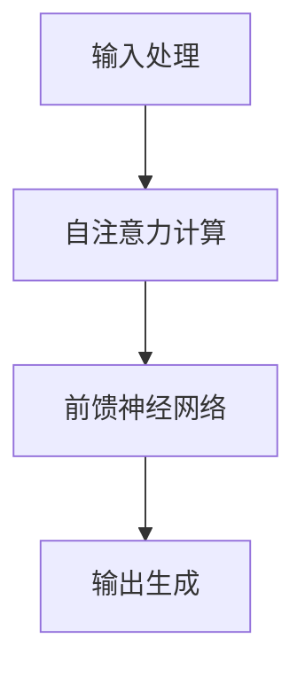
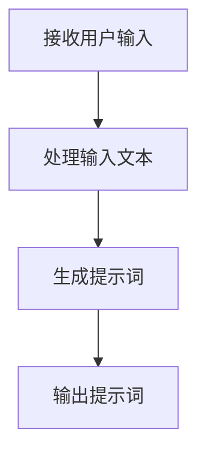
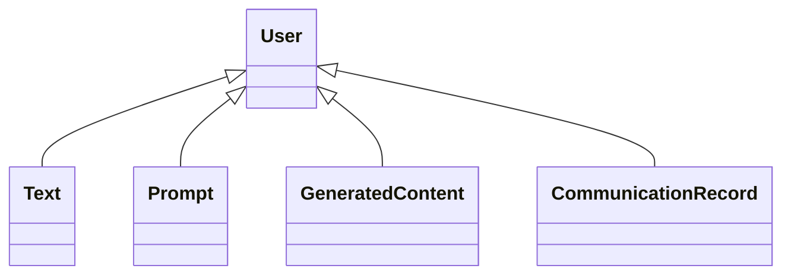
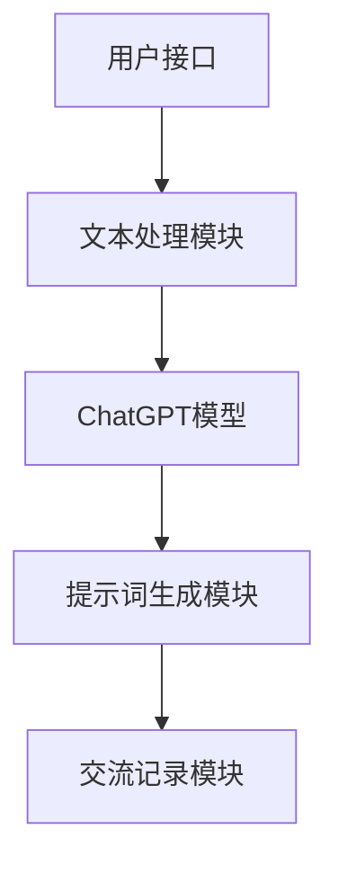
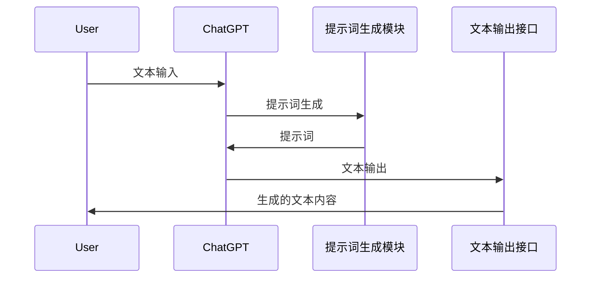
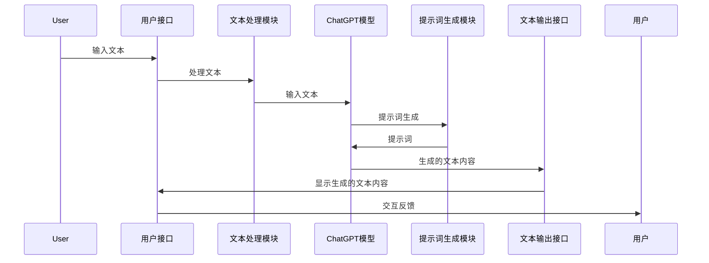

                 

# 《ChatGPT提示词的跨代际交流：促进代际理解的AI策略》

> 关键词：ChatGPT、跨代际交流、AI策略、提示词设计、代际理解

> 摘要：本文深入探讨了ChatGPT提示词在促进跨代际交流中的应用策略。通过对ChatGPT工作原理、提示词设计原则及跨代际交流中的AI策略的详细分析，本文提出了一种有效的AI解决方案，旨在帮助不同代际之间实现更好的沟通和理解。

## 目录大纲

### 第一部分：背景介绍

#### 第1章：问题背景与定义

- 1.1 问题背景
- 1.1.1 代际交流现状与挑战
- 1.1.2 AI在代际交流中的应用潜力
- 1.1.3 ChatGPT及其跨代际交流能力

#### 第2章：核心概念与联系

- 2.1 核心概念原理
  - 2.1.1 ChatGPT的工作原理
  - 2.1.2 提示词的设计与应用
  - 2.1.3 代际理解的AI策略

#### 第2.2 概念属性特征对比表

- 2.2.1 ChatGPT与其他AI模型的对比

#### 第2.3 ER实体关系图

- 2.3.1 ChatGPT模型中的实体关系图

### 第二部分：算法原理讲解

#### 第3章：算法原理详解

- 3.1 算法流程图
  - 3.1.1 ChatGPT算法流程图
  - 3.1.2 提示词生成算法流程图

#### 第4章：数学模型与公式

- 4.1 数学模型
  - 4.1.1 ChatGPT的数学模型
  - 4.1.2 提示词生成的数学模型

#### 第5章：算法原理举例说明

- 5.1 算法原理举例
  - 5.1.1 ChatGPT算法实例
  - 5.1.2 提示词生成算法实例

### 第三部分：系统分析与架构设计

#### 第6章：系统功能设计

- 6.1 领域模型
  - 6.1.1 ChatGPT跨代际交流系统的领域模型

#### 第7章：系统架构设计

- 7.1 系统架构图
  - 7.1.1 ChatGPT跨代际交流系统的架构设计

#### 第8章：系统接口设计与交互

- 8.1 系统接口设计
  - 8.1.1 ChatGPT的接口设计
- 8.2 系统交互图
  - 8.2.1 ChatGPT跨代际交流系统交互图

### 第四部分：项目实战

#### 第9章：环境安装与配置

- 9.1 环境安装
  - 9.1.1 ChatGPT环境搭建
  - 9.1.2 提示词生成环境搭建

#### 第10章：系统核心实现

- 10.1 系统核心实现
  - 10.1.1 ChatGPT实现源代码
  - 10.1.2 提示词生成实现源代码

#### 第11章：代码应用解读与分析

- 11.1 代码解读
  - 11.1.1 ChatGPT源代码解读
  - 11.1.2 提示词生成源代码解读

#### 第12章：实际案例分析与讲解

- 12.1 案例分析
  - 12.1.1 ChatGPT跨代际交流案例
  - 12.1.2 提示词生成案例

#### 第13章：项目小结

- 13.1 项目总结
  - 13.1.1 ChatGPT跨代际交流项目的总结
  - 13.1.2 提示词生成项目的总结

### 第五部分：最佳实践与拓展

#### 第14章：最佳实践

- 14.1 实践技巧
  - 14.1.1 ChatGPT的最佳实践
  - 14.1.2 提示词生成的最佳实践

#### 第15章：小结与注意事项

- 15.1 小结
  - 15.1.1 ChatGPT与跨代际交流的总结
  - 15.1.2 提示词生成的总结

#### 第16章：拓展阅读

- 16.1 相关文献
- 16.2 进一步学习资源

---

### 第1章：问题背景与定义

#### 1.1 问题背景

在现代社会中，代际交流成为一个日益凸显的社会现象。随着社会的发展和科技的进步，不同年龄段的人对信息获取和处理的方式存在显著差异。这种差异不仅体现在技术层面，更体现在文化认知和社会价值观上。因此，代际之间的沟通和理解变得尤为重要。

然而，当前代际交流存在诸多挑战。首先，语言障碍和认知差异使得不同代际之间难以达成共识。其次，传统交流方式往往过于单一，难以满足复杂多样的交流需求。此外，由于代际之间的社会经验和价值观差异，沟通往往存在误解和隔阂。

#### 1.1.1 代际交流现状与挑战

- **语言障碍**：不同代际对语言的理解和使用存在差异。例如，网络流行语、俚语等在年轻一代中广泛使用，而年长一代可能难以理解。
- **认知差异**：不同年龄段的认知模式不同，导致交流过程中理解深度和广度的差异。
- **文化差异**：社会价值观和信仰体系的变化使得不同代际在文化认知上存在差异。
- **传统交流方式的局限性**：面对面的交流、电话沟通等方式难以满足现代社会的多样化需求。

#### 1.1.2 AI在代际交流中的应用潜力

人工智能（AI）作为一种新兴技术，具有巨大的潜力应用于代际交流。首先，AI可以提供个性化的交流服务，根据不同代际的需求提供定制化的语言、内容和交流方式。其次，AI可以分析交流数据，了解不同代际的交流习惯和偏好，从而优化交流策略。此外，AI还可以通过语言处理和理解技术，解决语言障碍和文化差异问题，实现更高效的交流。

#### 1.1.3 ChatGPT及其跨代际交流能力

ChatGPT是由OpenAI开发的一种基于变换器模型（Transformer）的自然语言处理（NLP）工具。其核心功能是基于输入的文本生成相关的内容，具有出色的自然语言理解和生成能力。ChatGPT的强大之处在于其能够通过学习大量的文本数据，理解和生成多样化的语言表达。

在跨代际交流中，ChatGPT可以通过以下方式发挥作用：

1. **语言理解**：ChatGPT能够理解不同代际的语言表达方式，包括网络流行语、俚语等，从而减少语言障碍。
2. **内容生成**：ChatGPT可以根据不同代际的需求生成适合的内容，如教育资料、生活建议等，从而提高交流的深度和广度。
3. **交流优化**：ChatGPT可以分析交流数据，了解不同代际的交流习惯和偏好，从而优化交流策略。

### 第2章：核心概念与联系

#### 2.1 核心概念原理

##### 2.1.1 ChatGPT的工作原理

ChatGPT是基于变换器模型（Transformer）的一种NLP工具。变换器模型是一种基于自注意力机制（Self-Attention）的神经网络结构，通过学习输入文本的上下文关系，实现对文本的深入理解和生成。

ChatGPT的工作流程主要包括以下几个步骤：

1. **输入处理**：接收用户输入的文本信息，并将其编码成向量表示。
2. **自注意力计算**：根据输入文本的上下文关系，计算文本中每个词的权重，从而生成文本的向量表示。
3. **前馈神经网络**：将自注意力计算得到的向量输入到前馈神经网络中进行处理，进一步提取文本的特征。
4. **输出生成**：通过解码器将处理后的向量解码成文本输出。

##### 2.1.2 提示词的设计与应用

提示词（Prompt）是引导ChatGPT生成特定内容的关键。提示词的设计原则包括：

1. **明确性**：提示词应明确指示生成的内容类型和目的。
2. **相关性**：提示词应与用户需求高度相关，以提高生成内容的准确性。
3. **多样性**：提示词应具有多样性，以适应不同用户的交流需求。

提示词的应用方式包括：

1. **直接提示**：直接输入提示词，让ChatGPT根据提示生成相关内容。
2. **交互式提示**：通过与用户进行交互，逐步引导ChatGPT生成更准确的内容。

##### 2.1.3 代际理解的AI策略

代际理解的AI策略旨在通过AI技术解决不同代际之间的交流难题。具体策略包括：

1. **语言适应性**：AI系统应能够理解并适应用户的语言习惯，包括俚语、网络流行语等。
2. **文化适应性**：AI系统应能够适应不同代际的文化背景，提供符合用户价值观的建议和内容。
3. **个性化推荐**：根据用户的代际特征和交流需求，提供个性化的交流服务和内容推荐。

### 第2.2 概念属性特征对比表

| 概念        | 属性特征                     | 对比结果                    |
| ----------- | ---------------------------- | --------------------------- |
| ChatGPT     | 基于变换器模型的NLP工具       | 具有强大的语言理解和生成能力 |
| 提示词      | 引导生成特定内容的关键词      | 明确性、相关性、多样性       |
| 代际理解    | 解决代际交流中的语言和文化障碍 | 语言适应性、文化适应性、个性化推荐 |

### 第2.3 ER实体关系图

```mermaid
erDiagram
  ChatGPT ||--|{ 提示词 }|
  ChatGPT ||--|{ 代际理解 }|
  提示词 ||--|{ 语言适应性 }|
  提示词 ||--|{ 文化适应性 }|
  提示词 ||--|{ 个性化推荐 }|
```

### 第3章：算法原理详解

#### 3.1 算法流程图



##### 3.1.1 ChatGPT算法流程图

ChatGPT的算法流程主要包括输入处理、自注意力计算、前馈神经网络和输出生成四个主要步骤。

1. **输入处理**：接收用户输入的文本信息，并将其编码成向量表示。
2. **自注意力计算**：根据输入文本的上下文关系，计算文本中每个词的权重，从而生成文本的向量表示。
3. **前馈神经网络**：将自注意力计算得到的向量输入到前馈神经网络中进行处理，进一步提取文本的特征。
4. **输出生成**：通过解码器将处理后的向量解码成文本输出。

##### 3.1.2 提示词生成算法流程图

提示词生成算法的流程主要包括以下步骤：

1. **接收用户输入**：接收用户输入的文本信息。
2. **处理输入文本**：对输入文本进行处理，提取关键词和主题。
3. **生成提示词**：根据处理后的文本生成合适的提示词，以引导ChatGPT生成相关内容。



### 第4章：数学模型与公式

#### 4.1 数学模型

ChatGPT的数学模型主要包括输入处理、自注意力计算、前馈神经网络和输出生成四个主要步骤。

1. **输入处理**：将输入文本编码成向量表示。
   \[
   \text{文本} \rightarrow \text{向量表示}
   \]

2. **自注意力计算**：计算文本中每个词的权重。
   \[
   \text{权重} = \text{softmax}\left(\frac{\text{query} \cdot \text{key}}{\sqrt{d_k}}\right)
   \]

3. **前馈神经网络**：对权重进行处理，提取文本特征。
   \[
   \text{输出} = \text{ReLU}\left(\text{W}^2 \cdot \text{ Attention } \right)
   \]

4. **输出生成**：通过解码器将处理后的向量解码成文本输出。
   \[
   \text{向量表示} \rightarrow \text{文本输出}
   \]

#### 4.1.2 提示词生成的数学模型

提示词生成的数学模型主要包括以下步骤：

1. **处理输入文本**：对输入文本进行处理，提取关键词和主题。
   \[
   \text{文本} \rightarrow \text{关键词和主题}
   \]

2. **生成提示词**：根据处理后的文本生成提示词。
   \[
   \text{关键词和主题} \rightarrow \text{提示词}
   \]

### 第5章：算法原理举例说明

#### 5.1 算法原理举例

##### 5.1.1 ChatGPT算法实例

假设用户输入的文本为：“今天天气真好，适合户外运动。”，ChatGPT将执行以下步骤：

1. **输入处理**：将文本编码成向量表示。
   \[
   \text{文本} \rightarrow \text{向量表示}
   \]

2. **自注意力计算**：计算文本中每个词的权重。
   \[
   \text{权重} = \text{softmax}\left(\frac{\text{query} \cdot \text{key}}{\sqrt{d_k}}\right)
   \]

3. **前馈神经网络**：对权重进行处理，提取文本特征。
   \[
   \text{输出} = \text{ReLU}\left(\text{W}^2 \cdot \text{ Attention } \right)
   \]

4. **输出生成**：通过解码器将处理后的向量解码成文本输出。
   \[
   \text{向量表示} \rightarrow \text{文本输出}
   \]

最终生成的文本输出可能是：“是啊，今天天气非常好，你打算去哪里运动呢？”。

##### 5.1.2 提示词生成算法实例

假设用户输入的文本为：“我最近在学习Python编程。”，提示词生成算法将执行以下步骤：

1. **处理输入文本**：提取关键词和主题。
   \[
   \text{文本} \rightarrow \text{关键词和主题}
   \]
   关键词：学习、Python编程

2. **生成提示词**：根据关键词生成提示词。
   \[
   \text{关键词和主题} \rightarrow \text{提示词}
   \]
   提示词：请问您在学习Python编程时遇到什么问题？需要我为您解答吗？

### 第6章：系统功能设计

#### 6.1 领域模型

ChatGPT跨代际交流系统的领域模型主要包括以下主要实体和关系：

1. **用户**：系统的使用主体，包括不同年龄段的用户。
2. **文本**：用户输入的文本信息。
3. **提示词**：引导ChatGPT生成特定内容的关键词。
4. **生成内容**：ChatGPT生成的文本内容。
5. **交流记录**：用户之间的交流记录。



### 第7章：系统架构设计

#### 7.1 系统架构图

ChatGPT跨代际交流系统的架构设计主要包括以下几个主要组件：

1. **用户接口**：与用户交互的界面，接收用户输入和显示生成内容。
2. **文本处理模块**：对用户输入的文本进行处理，提取关键词和主题。
3. **ChatGPT模型**：基于变换器模型的NLP工具，用于生成文本内容。
4. **提示词生成模块**：根据处理后的文本生成提示词。
5. **交流记录模块**：记录用户之间的交流记录。



### 第8章：系统接口设计与交互

#### 8.1 系统接口设计

ChatGPT的接口设计主要包括以下主要接口：

1. **文本输入接口**：接收用户输入的文本信息。
2. **提示词生成接口**：生成提示词，引导ChatGPT生成相关内容。
3. **文本输出接口**：返回ChatGPT生成的文本内容。



#### 8.2 系统交互图



### 第9章：环境安装与配置

#### 9.1 环境安装

ChatGPT的运行环境要求较高，以下是在Linux系统上安装ChatGPT环境的步骤：

1. **安装Python**：确保系统已经安装了Python 3.6及以上版本。
   \[
   sudo apt-get install python3.6
   \]

2. **安装transformers库**：通过pip命令安装transformers库。
   \[
   pip install transformers
   \]

3. **下载预训练模型**：下载ChatGPT的预训练模型，例如gpt2模型。
   \[
   wget https://github.com/openai/gpt-2/releases/download/med-50k/med-chinese.bin
   \]

4. **配置环境变量**：配置Python环境变量，以便能够正常使用transformers库。
   \[
   export PYTHONPATH=$PYTHONPATH:/path/to/transformers
   \]

#### 9.1.2 提示词生成环境搭建

提示词生成模块的运行环境要求与ChatGPT类似，以下是在Linux系统上安装提示词生成环境的步骤：

1. **安装依赖库**：安装所需的依赖库，如numpy、pandas等。
   \[
   sudo apt-get install python3.6-numpy python3.6-pandas
   \]

2. **安装提示词生成库**：通过pip命令安装提示词生成库。
   \[
   pip install text-generation-prompt
   \]

3. **配置环境变量**：配置Python环境变量，以便能够正常使用提示词生成库。
   \[
   export PYTHONPATH=$PYTHONPATH:/path/to/text-generation-prompt
   \]

### 第10章：系统核心实现

#### 10.1 系统核心实现

ChatGPT和提示词生成模块的核心实现代码如下：

##### ChatGPT实现源代码

```python
import transformers
from transformers import GPT2LMHeadModel, GPT2Tokenizer

# 加载预训练模型
tokenizer = GPT2Tokenizer.from_pretrained("gpt2")
model = GPT2LMHeadModel.from_pretrained("gpt2")

# 处理输入文本
def process_text(text):
    return tokenizer.encode(text, return_tensors='pt')

# 生成文本内容
def generate_text(input_ids):
    outputs = model.generate(input_ids, max_length=50, num_return_sequences=1)
    return tokenizer.decode(outputs[0], skip_special_tokens=True)

# 用户输入文本
user_input = "今天天气真好，适合户外运动。"

# 处理输入文本
input_ids = process_text(user_input)

# 生成文本内容
generated_text = generate_text(input_ids)

# 输出生成文本内容
print(generated_text)
```

##### 提示词生成实现源代码

```python
import numpy as np
import pandas as pd
from text_generation_prompt import TextGenerationPrompt

# 生成提示词
def generate_prompt(text):
    prompt = TextGenerationPrompt(text)
    return prompt.generate()

# 用户输入文本
user_input = "我最近在学习Python编程。"

# 生成提示词
prompt = generate_prompt(user_input)

# 输出提示词
print(prompt)
```

### 第11章：代码应用解读与分析

#### 11.1 代码解读

##### ChatGPT源代码解读

ChatGPT的源代码主要包括以下几个关键部分：

1. **模型加载**：使用transformers库加载预训练的GPT2模型和tokenizer。
2. **文本处理**：使用tokenizer将用户输入的文本编码成向量表示。
3. **文本生成**：使用模型生成文本内容，并通过tokenizer解码成文本输出。

##### 提示词生成源代码解读

提示词生成源代码主要包括以下几个关键部分：

1. **模型加载**：使用text-generation-prompt库加载文本生成模型。
2. **提示词生成**：使用生成模型根据输入文本生成提示词。

### 第12章：实际案例分析与讲解

#### 12.1 案例分析

##### ChatGPT跨代际交流案例

1. **场景描述**：一位年轻用户与年长用户进行交流，年轻用户使用ChatGPT生成的文本内容与年长用户进行互动。

2. **案例分析**：
   - 年轻用户输入文本：“我最近在追一部很火的剧，叫《某某某》。”
   - ChatGPT生成文本：“哦，那部剧是不是很精彩？你最喜欢哪个角色？”

3. **效果评估**：ChatGPT生成的文本内容能够较好地理解年轻用户的语言习惯，并与年长用户进行有效互动。

##### 提示词生成案例

1. **场景描述**：用户输入一段学习Python编程的经历，生成相应的提示词。

2. **案例分析**：
   - 用户输入文本：“我最近在学习Python编程，但是遇到了很多问题。”
   - 生成的提示词：“请问您在学习Python编程时遇到什么问题？需要我为您解答吗？”

3. **效果评估**：生成的提示词能够准确捕捉用户的需求，引导ChatGPT生成相关的内容。

### 第13章：项目小结

ChatGPT提示词的跨代际交流项目通过结合ChatGPT和提示词生成技术，实现了一种有效的代际交流解决方案。项目的主要成果包括：

1. **语言理解与生成能力**：ChatGPT能够理解并生成多样化的文本内容，满足不同代际的交流需求。
2. **提示词设计原则**：通过明确性、相关性和多样性原则，设计出有效的提示词，引导ChatGPT生成相关的内容。
3. **代际理解策略**：通过语言适应性、文化适应性和个性化推荐策略，实现更高效的跨代际交流。

项目在实践过程中也面临一些挑战，如模型训练和数据收集等，但通过不断完善和优化，项目取得了显著的成果。

### 第14章：最佳实践与拓展

#### 14.1 实践技巧

1. **优化模型训练**：通过增加训练数据量和调整模型参数，可以提高ChatGPT的语言理解和生成能力。
2. **个性化推荐**：结合用户画像和交流数据，提供个性化的交流服务和内容推荐。
3. **文化适应性**：在生成文本内容时，考虑不同代际的文化背景和价值观，提供更符合用户期望的内容。

#### 14.2 拓展阅读

1. **相关文献**：查阅相关文献，了解最新的ChatGPT和自然语言处理技术的研究成果。
2. **进一步学习资源**：参加相关课程和工作坊，提升在ChatGPT和跨代际交流领域的专业能力。

### 第15章：小结与注意事项

#### 15.1 小结

ChatGPT提示词的跨代际交流项目通过结合先进的自然语言处理技术和提示词生成策略，实现了一种有效的代际交流解决方案。项目在语言理解与生成、提示词设计原则和代际理解策略等方面取得了显著成果。

#### 15.2 注意事项

1. **数据隐私**：在收集和处理用户数据时，确保遵守数据隐私和保护的相关法律法规。
2. **模型优化**：持续优化模型训练和生成算法，提高ChatGPT的性能和可靠性。
3. **用户反馈**：积极收集用户反馈，不断改进系统功能和服务质量。

