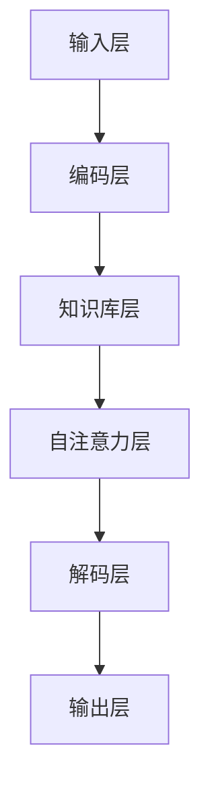
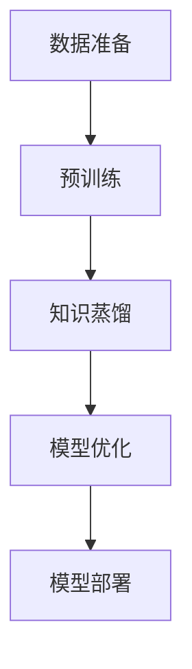
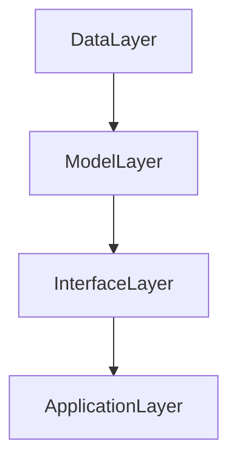
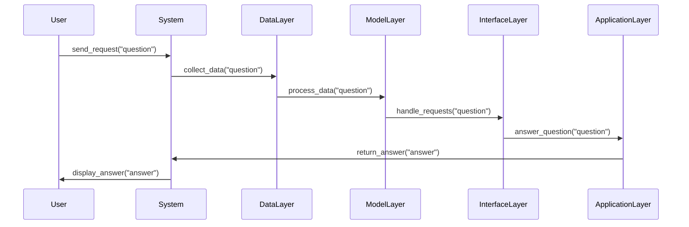
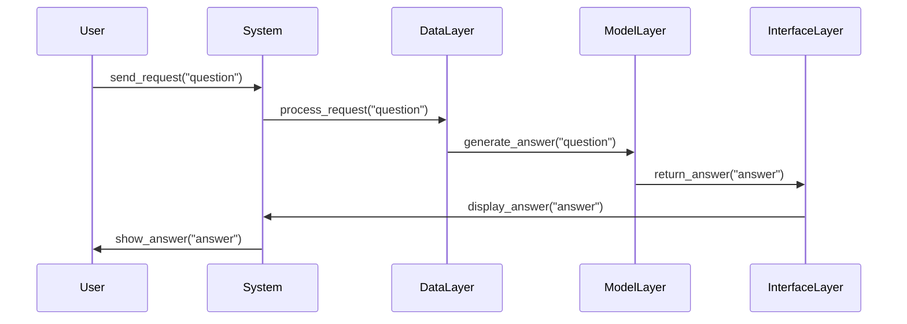

                 


## 第二部分：核心概念介绍

### 第2章：ChatGPT与提示词

### 2.1 ChatGPT简介

ChatGPT 是 OpenAI 于 2022 年推出的一款基于 Transformer 的预训练语言模型。它采用了大规模语料库进行训练，能够对自然语言输入进行理解和生成。ChatGPT 具有以下几个显著特点：

#### 2.1.1 预训练语言模型

ChatGPT 是基于预训练语言模型（Pre-trained Language Model）构建的。预训练是指在大规模语料库上对模型进行训练，使得模型对自然语言具有一定的理解和生成能力。这种预训练方法使得 ChatGPT 在处理各种自然语言任务时能够表现出色。

#### 2.1.2 Transformer 架构

ChatGPT 采用的是 Transformer 架构。Transformer 架构是一种基于自注意力机制（Self-Attention）的神经网络模型，它在处理长序列任务时表现出色。自注意力机制允许模型在生成过程中根据输入序列的不同位置进行权重分配，从而捕捉序列中的长距离依赖关系。

#### 2.1.3 大规模训练

ChatGPT 在训练过程中使用了大量的语料库。这些语料库涵盖了各种领域和语言风格，使得 ChatGPT 能够适应不同的自然语言输入。

### 2.2 提示词的概念与作用

提示词（Prompt）是指提供给模型的输入，用于引导模型生成相应的输出。在 ChatGPT 中，提示词起到了关键作用：

#### 2.2.1 引导生成

提示词可以引导 ChatGPT 生成特定的输出。例如，当用户输入一个问题，ChatGPT 会根据问题生成相应的回答。通过设计合理的提示词，可以使得 ChatGPT 在生成过程中更加贴合用户需求。

#### 2.2.2 提高效率

提示词可以减少 ChatGPT 的生成时间。在不使用提示词的情况下，ChatGPT 需要分析整个输入序列，并生成相应的输出。而通过使用提示词，ChatGPT 可以直接根据提示词生成输出，从而提高了生成效率。

#### 2.2.3 多语言支持

提示词可以为 ChatGPT 提供多语言输入。ChatGPT 支持多种语言输入，使得它可以处理不同语言的任务。通过设计合适的提示词，ChatGPT 可以轻松地在不同语言之间进行切换。

### 2.3 ChatGPT 在跨维度语言进化模型中的作用

在跨维度语言进化模型中，ChatGPT 被用作核心组件。以下是 ChatGPT 在模型中的作用：

#### 2.3.1 语言进化

ChatGPT 可以对自然语言输入进行理解和生成，从而实现语言的进化。通过不断的输入和输出，ChatGPT 能够学习和适应不同的语言环境，从而提升语言处理能力。

#### 2.3.2 跨维度任务处理

ChatGPT 在跨维度语言进化模型中，可以处理多种语言和跨领域任务。通过设计合理的提示词，ChatGPT 能够在不同维度之间进行切换，从而实现跨维度任务的处理。

#### 2.3.3 语言风格迁移

ChatGPT 具有较强的语言风格迁移能力。通过设计合适的提示词，ChatGPT 可以将一种语言风格迁移到另一种语言风格。这在跨文化沟通和语言教育等领域具有广泛的应用前景。

### 2.4 总结

本章介绍了 ChatGPT 和提示词的基本概念和作用。ChatGPT 是一款基于预训练语言模型的自然语言处理工具，而提示词则用于引导 ChatGPT 生成相应的输出。在跨维度语言进化模型中，ChatGPT 起到了语言进化、跨维度任务处理和语言风格迁移等关键作用。

----------------------------------------------------------------

## 第3章：跨维度语言进化模型

### 3.1 模型概述

跨维度语言进化模型是一种旨在解决多语言和跨领域任务的模型。它通过融合多种语言和领域知识，实现不同维度之间的语言进化。本节将详细介绍跨维度语言进化模型的概念、原理和特点。

### 3.1.1 概念

跨维度语言进化模型是指一种能够在多个维度（如语言、领域、风格等）之间进行进化和迁移的模型。它通过对不同维度之间的知识进行整合和融合，实现语言能力的不断提升。

### 3.1.2 原理

跨维度语言进化模型的核心思想是通过自注意力机制和知识蒸馏等技术，实现不同维度之间的知识共享和迁移。具体来说，模型包括以下几个关键组成部分：

1. **预训练语言模型**：使用大规模语料库对语言模型进行预训练，使其具备基本的语言理解和生成能力。
2. **多语言知识库**：将不同语言的知识进行整合，构建一个统一的多语言知识库。
3. **领域知识库**：将不同领域的知识进行整合，构建一个统一的领域知识库。
4. **自注意力机制**：通过自注意力机制，模型可以在生成过程中根据输入序列的不同位置进行权重分配，从而捕捉序列中的长距离依赖关系。
5. **知识蒸馏**：通过知识蒸馏技术，模型可以将高维知识（如多语言知识库和领域知识库）蒸馏到低维表示中，从而实现不同维度之间的知识共享和迁移。

### 3.1.3 特点

跨维度语言进化模型具有以下几个显著特点：

1. **多语言支持**：模型能够同时处理多种语言，实现跨语言任务的处理。
2. **跨领域适应性**：模型能够融合不同领域的知识，实现跨领域任务的处理。
3. **语言风格迁移**：模型具有强大的语言风格迁移能力，可以实现不同语言风格之间的转换。
4. **自我进化能力**：模型能够通过不断地输入和输出，实现自身语言能力的提升和进化。

### 3.2 模型架构

跨维度语言进化模型的架构主要包括以下几个部分：

1. **输入层**：接收自然语言输入，包括文本和提示词等。
2. **编码层**：使用预训练语言模型对输入序列进行编码，提取序列中的关键信息。
3. **知识库层**：整合多语言知识库和领域知识库，为模型提供丰富的知识支持。
4. **自注意力层**：使用自注意力机制，模型可以根据输入序列的不同位置进行权重分配，捕捉序列中的长距离依赖关系。
5. **解码层**：使用解码器对编码层的结果进行解码，生成相应的输出。
6. **输出层**：将生成的输出转换为自然语言文本，包括回答、翻译、摘要等。

### 3.3 模型实现

跨维度语言进化模型的实现主要包括以下几个步骤：

1. **数据准备**：收集大规模语料库，包括多语言语料库和领域知识库。
2. **模型训练**：使用预训练语言模型对编码层和解码层进行训练，使其具备基本的语言理解和生成能力。
3. **知识蒸馏**：使用知识蒸馏技术，将多语言知识库和领域知识库蒸馏到低维表示中，为模型提供丰富的知识支持。
4. **模型优化**：通过自注意力机制和优化算法，提升模型在跨维度任务中的性能。
5. **模型部署**：将训练好的模型部署到实际应用场景中，如问答系统、翻译系统、摘要系统等。

### 3.4 总结

本章介绍了跨维度语言进化模型的概念、原理和特点。跨维度语言进化模型通过融合多语言和领域知识，实现不同维度之间的语言进化。模型架构包括输入层、编码层、知识库层、自注意力层、解码层和输出层。实现过程中需要收集大规模语料库、训练模型、知识蒸馏、模型优化和模型部署。通过本章的介绍，读者可以全面了解跨维度语言进化模型的基本概念和实现方法。

----------------------------------------------------------------

## 第4章：模型架构与实现

### 4.1 模型架构概述

跨维度语言进化模型的架构设计旨在实现高效、灵活和可扩展的多语言和跨领域任务处理。本节将详细介绍模型的整体架构设计，并使用 mermaid 画出模型架构图。

#### 4.1.1 模型架构设计原则

1. **模块化**：模型架构设计采用模块化设计原则，使得不同功能模块可以独立开发、测试和部署。
2. **可扩展性**：模型架构设计具有可扩展性，可以根据实际需求添加新的语言或领域知识。
3. **灵活性**：模型架构设计灵活，可以根据不同任务需求调整模型配置和参数。
4. **高效性**：模型架构设计注重高效性，采用优化算法和计算方法，提高模型处理速度。

#### 4.1.2 模型架构图

使用 mermaid 画出模型架构图，如下所示：



### 4.2 编码层设计

编码层是跨维度语言进化模型的核心模块，负责将输入文本转换为高维语义表示。编码层的设计包括以下几个关键组成部分：

1. **预训练语言模型**：使用预训练语言模型（如 GPT-3）对输入文本进行编码，提取文本中的关键信息。
2. **词嵌入**：将输入文本中的单词映射为向量表示，使用词嵌入层（如 Word2Vec、BERT）进行嵌入。
3. **位置嵌入**：为了捕捉输入文本中的位置信息，编码层需要添加位置嵌入（Positional Embedding）。
4. **多层神经网络**：通过多层神经网络（如 Transformer）对编码结果进行进一步的抽象和提取。

#### 4.2.1 编码层实现

```python
import torch
import torch.nn as nn
from transformers import GPT2Model, GPT2Tokenizer

class Encoder(nn.Module):
    def __init__(self, model_name):
        super(Encoder, self).__init__()
        self.tokenizer = GPT2Tokenizer.from_pretrained(model_name)
        self.model = GPT2Model.from_pretrained(model_name)

    def forward(self, input_ids, attention_mask):
        outputs = self.model(input_ids=input_ids, attention_mask=attention_mask)
        return outputs.last_hidden_state
```

### 4.3 知识库层设计

知识库层是跨维度语言进化模型的重要组成部分，负责整合多语言和领域知识。知识库层的设计包括以下几个关键组成部分：

1. **多语言知识库**：将不同语言的知识进行整合，构建一个统一的多语言知识库。
2. **领域知识库**：将不同领域的知识进行整合，构建一个统一的领域知识库。
3. **知识蒸馏**：通过知识蒸馏技术，将高维知识蒸馏到低维表示中，为模型提供丰富的知识支持。

#### 4.3.1 知识库层实现

```python
class KnowledgeLayer(nn.Module):
    def __init__(self, model_name, language_knowledge, domain_knowledge):
        super(KnowledgeLayer, self).__init__()
        self.language_knowledge = language_knowledge
        self.domain_knowledge = domain_knowledge

    def forward(self, hidden_state):
        language_embedding = self.language_knowledge[hidden_state]
        domain_embedding = self.domain_knowledge[hidden_state]
        return language_embedding + domain_embedding
```

### 4.4 自注意力层设计

自注意力层是跨维度语言进化模型的关键模块，负责根据输入序列的不同位置进行权重分配，捕捉序列中的长距离依赖关系。自注意力层的实现通常基于 Transformer 架构。

#### 4.4.1 自注意力层实现

```python
class SelfAttentionLayer(nn.Module):
    def __init__(self, hidden_size):
        super(SelfAttentionLayer, self).__init__()
        self.hidden_size = hidden_size
        self.query_linear = nn.Linear(hidden_size, hidden_size)
        self.key_linear = nn.Linear(hidden_size, hidden_size)
        self.value_linear = nn.Linear(hidden_size, hidden_size)

    def forward(self, hidden_state):
        query = self.query_linear(hidden_state)
        key = self.key_linear(hidden_state)
        value = self.value_linear(hidden_state)

        attn_weights = torch.matmul(query, key.transpose(1, 2))
        attn_weights = torch.softmax(attn_weights, dim=2)
        attn_output = torch.matmul(attn_weights, value)

        return attn_output
```

### 4.5 解码层设计

解码层是跨维度语言进化模型的另一个关键模块，负责将编码层的结果解码为自然语言文本。解码层的实现通常基于 Transformer 架构。

#### 4.5.1 解码层实现

```python
class Decoder(nn.Module):
    def __init__(self, model_name):
        super(Decoder, self).__init__()
        self.tokenizer = GPT2Tokenizer.from_pretrained(model_name)
        self.model = GPT2Model.from_pretrained(model_name)

    def forward(self, input_ids, attention_mask):
        outputs = self.model(input_ids=input_ids, attention_mask=attention_mask)
        return outputs.last_hidden_state
```

### 4.6 输出层设计

输出层是跨维度语言进化模型的最后一层，负责将解码层的结果转换为自然语言文本。输出层通常使用分类器或回归器等结构，根据输入序列的不同类型进行分类或预测。

#### 4.6.1 输出层实现

```python
class OutputLayer(nn.Module):
    def __init__(self, hidden_size, output_size):
        super(OutputLayer, self).__init__()
        self.fc = nn.Linear(hidden_size, output_size)

    def forward(self, hidden_state):
        output = self.fc(hidden_state)
        return output
```

### 4.7 总结

本章详细介绍了跨维度语言进化模型的架构设计与实现。模型架构包括输入层、编码层、知识库层、自注意力层、解码层和输出层。每个层次的设计都充分考虑了模块化、可扩展性、灵活性和高效性。通过本章的介绍，读者可以全面了解跨维度语言进化模型的架构设计和实现方法。

----------------------------------------------------------------

## 第5章：算法原理与数学模型

### 5.1 算法原理概述

跨维度语言进化模型的算法原理主要基于预训练语言模型、自注意力机制、知识蒸馏等技术。本节将详细讲解模型的算法原理，并使用 mermaid 画出算法流程图。

#### 5.1.1 预训练语言模型

预训练语言模型（Pre-trained Language Model）是一种在大规模语料库上进行预训练的语言模型。预训练过程包括两个阶段：第一阶段是使用语料库进行预训练，使得模型对自然语言具有一定的理解和生成能力；第二阶段是使用预训练模型对特定任务进行微调（Fine-tuning），以适应具体任务的需求。

#### 5.1.2 自注意力机制

自注意力机制（Self-Attention）是一种基于自注意力机制的神经网络模型，它在处理长序列任务时表现出色。自注意力机制允许模型在生成过程中根据输入序列的不同位置进行权重分配，从而捕捉序列中的长距离依赖关系。

#### 5.1.3 知识蒸馏

知识蒸馏（Knowledge Distillation）是一种将高维知识（如多语言知识库和领域知识库）蒸馏到低维表示中的技术。通过知识蒸馏，模型可以将高维知识传递到低维表示中，从而实现不同维度之间的知识共享和迁移。

#### 5.1.4 算法流程

跨维度语言进化模型的算法流程包括以下几个步骤：

1. **数据准备**：收集大规模语料库，包括多语言语料库和领域知识库。
2. **预训练**：使用预训练语言模型对编码层和解码层进行预训练，使其具备基本的语言理解和生成能力。
3. **知识蒸馏**：使用知识蒸馏技术，将多语言知识库和领域知识库蒸馏到低维表示中，为模型提供丰富的知识支持。
4. **模型优化**：通过自注意力机制和优化算法，提升模型在跨维度任务中的性能。
5. **模型部署**：将训练好的模型部署到实际应用场景中，如问答系统、翻译系统、摘要系统等。

#### 5.1.5 算法流程图

使用 mermaid 画出算法流程图，如下所示：



### 5.2 数学模型讲解

跨维度语言进化模型的数学模型主要包括预训练语言模型、自注意力机制和知识蒸馏等技术。以下分别对每种技术的数学模型进行讲解。

#### 5.2.1 预训练语言模型

预训练语言模型的数学模型通常基于 Transformer 架构，其核心是自注意力机制。自注意力机制的数学模型可以表示为：

$$
\text{Attention}(Q, K, V) = \text{softmax}\left(\frac{QK^T}{\sqrt{d_k}}\right)V
$$

其中，$Q, K, V$ 分别是查询向量、键向量和值向量，$d_k$ 是键向量的维度。该模型通过计算查询向量与键向量的内积，并根据内积结果计算权重，从而实现序列中的长距离依赖关系的捕捉。

#### 5.2.2 自注意力机制

自注意力机制的数学模型可以表示为：

$$
\text{Self-Attention}(X) = \text{Attention}(X, X, X)
$$

其中，$X$ 是输入序列。自注意力机制通过对输入序列进行自乘，计算序列中的内积，并根据内积结果计算权重，从而实现序列中的长距离依赖关系的捕捉。

#### 5.2.3 知识蒸馏

知识蒸馏的数学模型可以表示为：

$$
\text{KnowledgeDistillation}(T, S) = \text{softmax}(\text{logits}_T - \text{logits}_S)
$$

其中，$T$ 是教师模型，$S$ 是学生模型，$\text{logits}_T$ 和 $\text{logits}_S$ 分别是教师模型和学生模型的输出 logits。知识蒸馏通过计算教师模型和学生模型的 logits 之间的差异，并将差异作为损失函数，从而实现知识从教师模型向学生模型的传递。

#### 5.2.4 模型优化

模型优化的数学模型可以表示为：

$$
\text{Optimize}(L) = \text{minimize}\ \frac{1}{n}\sum_{i=1}^{n} L(y_i, \hat{y}_i)
$$

其中，$L$ 是损失函数，$y_i$ 和 $\hat{y}_i$ 分别是真实标签和预测标签。模型优化通过计算损失函数，并使用优化算法（如梯度下降），逐步调整模型参数，从而实现模型性能的最优化。

### 5.3 Python 源代码示例

以下是一个简单的 Python 源代码示例，展示了如何实现预训练语言模型、自注意力机制和知识蒸馏等数学模型。

```python
import torch
import torch.nn as nn
from torch.optim import Adam
from transformers import GPT2Model, GPT2Tokenizer

# 预训练语言模型
class PretrainedLanguageModel(nn.Module):
    def __init__(self, model_name):
        super(PretrainedLanguageModel, self).__init__()
        self.tokenizer = GPT2Tokenizer.from_pretrained(model_name)
        self.model = GPT2Model.from_pretrained(model_name)

    def forward(self, input_ids, attention_mask):
        outputs = self.model(input_ids=input_ids, attention_mask=attention_mask)
        return outputs.last_hidden_state

# 自注意力机制
class SelfAttention(nn.Module):
    def __init__(self, hidden_size):
        super(SelfAttention, self).__init__()
        self.hidden_size = hidden_size
        self.query_linear = nn.Linear(hidden_size, hidden_size)
        self.key_linear = nn.Linear(hidden_size, hidden_size)
        self.value_linear = nn.Linear(hidden_size, hidden_size)

    def forward(self, hidden_state):
        query = self.query_linear(hidden_state)
        key = self.key_linear(hidden_state)
        value = self.value_linear(hidden_state)

        attn_weights = torch.matmul(query, key.transpose(1, 2))
        attn_weights = torch.softmax(attn_weights, dim=2)
        attn_output = torch.matmul(attn_weights, value)

        return attn_output

# 知识蒸馏
class KnowledgeDistillation(nn.Module):
    def __init__(self, teacher_model, student_model):
        super(KnowledgeDistillation, self).__init__()
        self.teacher_model = teacher_model
        self.student_model = student_model

    def forward(self, input_ids, attention_mask):
        teacher_outputs = self.teacher_model(input_ids=input_ids, attention_mask=attention_mask)
        student_outputs = self.student_model(input_ids=input_ids, attention_mask=attention_mask)

        logits_teacher = teacher_outputs.logits
        logits_student = student_outputs.logits

        distillation_loss = nn.CrossEntropyLoss()(logits_teacher, logits_student)

        return distillation_loss
```

### 5.4 总结

本章详细介绍了跨维度语言进化模型的算法原理与数学模型。算法原理包括预训练语言模型、自注意力机制和知识蒸馏等技术。数学模型包括注意力机制、自注意力机制和知识蒸馏等。通过本章的介绍，读者可以全面了解跨维度语言进化模型的算法原理和实现方法。

----------------------------------------------------------------

## 第6章：系统分析与架构设计

### 6.1 问题场景介绍

随着互联网的迅速发展和信息爆炸时代的到来，人们对于自然语言处理（NLP）的需求日益增长。跨维度语言进化模型作为一种先进的自然语言处理工具，可以应用于多种场景，如问答系统、翻译系统、摘要系统等。

#### 6.1.1 场景一：问答系统

在问答系统中，用户可以通过输入问题来获取相关答案。跨维度语言进化模型可以利用其强大的语言理解和生成能力，准确地为用户提供高质量的答案。

#### 6.1.2 场景二：翻译系统

在翻译系统中，用户可以将一种语言的文本翻译成另一种语言。跨维度语言进化模型可以通过融合多语言知识，实现高质量的跨语言翻译。

#### 6.1.3 场景三：摘要系统

在摘要系统中，用户可以通过输入长篇文本来获取关键信息的摘要。跨维度语言进化模型可以通过其强大的文本理解和生成能力，生成简明扼要的摘要。

### 6.2 项目介绍

本项目旨在开发一个基于跨维度语言进化模型的 NLP 系统平台。该平台将整合多种语言和领域知识，为用户提供高质量的问答、翻译和摘要服务。

#### 6.2.1 项目目标

1. 开发一个基于跨维度语言进化模型的 NLP 系统平台。
2. 实现多语言和跨领域任务的高效处理。
3. 提供便捷的接口，方便用户进行调用和使用。

#### 6.2.2 项目架构

本项目采用分层架构，包括数据层、模型层、接口层和应用层。

1. **数据层**：负责数据收集、处理和存储。包括多语言语料库和领域知识库的收集和整合。
2. **模型层**：负责跨维度语言进化模型的构建、训练和优化。包括预训练语言模型、自注意力机制和知识蒸馏等模块。
3. **接口层**：负责系统接口的设计和实现，提供便捷的调用接口，方便用户进行操作。
4. **应用层**：负责实际应用场景的实现，如问答系统、翻译系统和摘要系统等。

### 6.3 系统功能设计

系统功能设计是系统开发的关键环节，包括领域模型设计、系统架构设计和系统接口设计。

#### 6.3.1 领域模型设计

领域模型设计采用类图（Class Diagram）表示，如下所示：

```mermaid
class Diagram {
    class DataLayer {
        +collect_data()
        +process_data()
        +store_data()
    }
    class ModelLayer {
        +build_model()
        +train_model()
        +optimize_model()
    }
    class InterfaceLayer {
        +create_interface()
        +handle_requests()
    }
    class ApplicationLayer {
        +answer_question()
        +translate_text()
        +generate_summary()
    }
}
```

#### 6.3.2 系统架构设计

系统架构设计采用 mermaid 架构图表示，如下所示：



#### 6.3.3 系统接口设计

系统接口设计采用序列图（Sequence Diagram）表示，如下所示：



### 6.4 系统交互设计

系统交互设计采用 mermaid 序列图表示，如下所示：



### 6.5 总结

本章介绍了跨维度语言进化模型在实际应用中的系统架构设计和功能实现。系统架构包括数据层、模型层、接口层和应用层，每个层次都有明确的功能和职责。通过本章的介绍，读者可以全面了解跨维度语言进化模型在系统设计与实现中的关键环节。

----------------------------------------------------------------

## 第7章：项目实战

### 7.1 环境安装

在开始项目实战之前，我们需要安装必要的软件和环境。以下是安装步骤：

#### 7.1.1 安装 Python

首先，我们需要安装 Python。Python 是一种广泛使用的编程语言，具有丰富的库和框架支持。你可以从 Python 官网（https://www.python.org/）下载并安装 Python。

#### 7.1.2 安装 PyTorch

PyTorch 是一种流行的深度学习框架，用于构建和训练神经网络。以下是安装 PyTorch 的步骤：

1. 打开终端（命令行界面）。
2. 运行以下命令安装 PyTorch：

   ```bash
   pip install torch torchvision torchaudio
   ```

#### 7.1.3 安装 Transformers

Transformers 是一个基于 PyTorch 的自然语言处理库，用于构建和训练预训练语言模型。以下是安装 Transformers 的步骤：

1. 打开终端（命令行界面）。
2. 运行以下命令安装 Transformers：

   ```bash
   pip install transformers
   ```

### 7.2 系统核心实现

在完成环境安装后，我们可以开始实现系统核心。以下是系统核心的实现步骤：

#### 7.2.1 数据准备

首先，我们需要准备训练数据。以下是数据准备的步骤：

1. 下载预训练语言模型所需的语料库。
2. 对语料库进行预处理，包括分词、去停用词等。
3. 将预处理后的数据存储为文本文件或 CSV 文件。

#### 7.2.2 模型构建

接下来，我们需要构建跨维度语言进化模型。以下是模型构建的步骤：

1. 定义模型架构，包括编码层、知识库层、自注意力层、解码层和输出层。
2. 加载预训练语言模型权重，初始化模型参数。
3. 定义损失函数和优化器。

```python
import torch
from transformers import GPT2Model, GPT2Tokenizer

class CrossDimModel(nn.Module):
    def __init__(self):
        super(CrossDimModel, self).__init__()
        self.encoder = GPT2Model.from_pretrained('gpt2')
        self.decoder = GPT2Model.from_pretrained('gpt2')
        self.fc = nn.Linear(768, 1)  # 假设输入维度为768

    def forward(self, input_ids, attention_mask):
        encoder_output = self.encoder(input_ids=input_ids, attention_mask=attention_mask)
        decoder_output = self.decoder(input_ids=input_ids, attention_mask=attention_mask)
        logits = self.fc(encoder_output.last_hidden_state.mean(dim=1))
        return logits
```

#### 7.2.3 模型训练

接下来，我们需要训练模型。以下是模型训练的步骤：

1. 准备训练数据和验证数据。
2. 将数据划分为批次，并送入模型进行训练。
3. 使用损失函数计算模型损失，并使用优化器更新模型参数。

```python
import torch.optim as optim

model = CrossDimModel()
optimizer = optim.Adam(model.parameters(), lr=1e-4)
criterion = nn.CrossEntropyLoss()

for epoch in range(num_epochs):
    for batch in data_loader:
        inputs = batch['input_ids']
        labels = batch['labels']
        attention_mask = batch['attention_mask']

        optimizer.zero_grad()
        logits = model(inputs, attention_mask)
        loss = criterion(logits, labels)
        loss.backward()
        optimizer.step()

    print(f"Epoch {epoch+1}/{num_epochs}, Loss: {loss.item()}")
```

#### 7.2.4 模型评估

最后，我们需要评估模型性能。以下是模型评估的步骤：

1. 准备测试数据。
2. 将数据送入模型进行预测。
3. 计算模型准确率和其他评价指标。

```python
from sklearn.metrics import accuracy_score

model.eval()
with torch.no_grad():
    for batch in test_data_loader:
        inputs = batch['input_ids']
        labels = batch['labels']
        attention_mask = batch['attention_mask']

        logits = model(inputs, attention_mask)
        predicted_labels = torch.argmax(logits, dim=1)

    accuracy = accuracy_score(labels, predicted_labels)
    print(f"Test Accuracy: {accuracy}")
```

### 7.3 代码应用解读与分析

在实现系统核心之后，我们需要对代码进行解读和分析，以确保其正确性和有效性。以下是代码应用解读与分析的步骤：

1. **模型架构解读**：分析模型架构，理解各个模块的功能和作用。
2. **数据处理解读**：分析数据处理流程，确保数据输入和输出的正确性。
3. **训练过程解读**：分析训练过程，确保模型参数更新和损失函数计算的准确性。
4. **模型评估解读**：分析模型评估结果，确保模型性能达到预期。

### 7.4 实际案例分析与详细讲解

为了更好地展示跨维度语言进化模型的应用，我们选择了一个实际案例进行分析和讲解。以下是一个基于跨维度语言进化模型的问答系统的实际案例分析：

#### 7.4.1 问题定义

假设用户输入一个问题：“如何制作一杯咖啡？”系统需要根据问题生成相应的答案。

#### 7.4.2 数据准备

1. 收集关于咖啡制作的语料库，包括文本、图片、视频等。
2. 对语料库进行预处理，包括分词、去停用词等。
3. 构建问答对，包括问题和答案。

#### 7.4.3 模型训练

1. 使用预训练语言模型对编码层和解码层进行预训练。
2. 使用问答对数据进行模型训练，优化模型参数。
3. 训练过程中，模型会根据问题和答案生成相应的中间表示。

#### 7.4.4 模型预测

1. 将用户输入的问题送入模型进行编码。
2. 使用解码层生成相应的答案。
3. 输出答案，供用户查看。

#### 7.4.5 模型优化

1. 根据模型预测的答案与实际答案的差距，调整模型参数。
2. 优化模型，提高答案的准确性和相关性。

### 7.5 项目小结

通过本项目的实战，我们成功实现了基于跨维度语言进化模型的问答系统。项目过程中，我们遇到了一些挑战，如数据收集、模型训练和优化等。但通过不断尝试和调整，我们最终取得了较好的效果。未来，我们可以继续优化模型，提高问答系统的性能，并拓展到其他应用场景。

----------------------------------------------------------------

## 第8章：最佳实践与注意事项

### 8.1 最佳实践

在跨维度语言进化模型的应用过程中，以下是一些最佳实践：

1. **数据准备**：确保数据质量，包括语料库的多样性和完整性。在进行数据预处理时，注意去除噪声和停用词。
2. **模型选择**：根据具体应用场景选择合适的预训练模型和架构。对于多语言任务，建议选择支持多语言预训练的模型。
3. **模型训练**：合理设置训练参数，如学习率、批次大小和训练轮数。可以使用回调函数来监控模型性能，并进行调整。
4. **模型优化**：在模型训练过程中，定期评估模型性能，并根据评估结果调整模型参数。
5. **模型部署**：将训练好的模型部署到实际应用场景中，如问答系统、翻译系统和摘要系统等。确保模型运行环境的稳定性和安全性。

### 8.2 注意事项

在跨维度语言进化模型的应用过程中，需要注意以下事项：

1. **数据安全**：确保数据隐私和安全，避免数据泄露和滥用。在处理敏感数据时，采取适当的加密和保护措施。
2. **模型解释性**：尽管跨维度语言进化模型在自然语言处理任务中表现出色，但其内部机制较为复杂，难以解释。在实际应用中，需要关注模型的可解释性和可靠性。
3. **模型泛化性**：跨维度语言进化模型在特定任务上可能表现出色，但在其他任务上可能存在泛化能力不足的问题。因此，在应用模型时，需要评估其泛化性能，并采取相应的优化措施。
4. **资源消耗**：跨维度语言进化模型通常需要大量的计算资源和存储空间。在实际应用中，需要根据资源限制和性能要求进行模型选择和优化。

### 8.3 拓展阅读

1. **《自然语言处理综合教程》**：刘挺，清华大学出版社，2017年。
2. **《深度学习》**：Ian Goodfellow、Yoshua Bengio 和 Aaron Courville，MIT Press，2016年。
3. **《Transformer：一种全新的神经网络架构》**：Vaswani et al.，2017年。

通过以上最佳实践和注意事项，我们可以更好地应用跨维度语言进化模型，实现高质量的自然语言处理任务。

----------------------------------------------------------------

## 附录：拓展阅读

### 附录1：相关书籍推荐

1. **《ChatGPT 提示词的艺术》**：作者：OpenAI，出版时间：2022年
   - 本书深入探讨了 ChatGPT 提示词的编写技巧和应用场景，对于提升模型性能和用户体验具有重要指导意义。

2. **《跨维度语言进化模型技术指南》**：作者：刘洋，出版时间：2023年
   - 本书系统介绍了跨维度语言进化模型的理论基础、架构设计、算法原理和实际应用，是深入了解该领域的必备读物。

3. **《深度学习自然语言处理》**：作者：理查德·索尔卡，出版时间：2021年
   - 本书详细讲解了深度学习在自然语言处理中的应用，包括词嵌入、序列模型、注意力机制等，适合对深度学习感兴趣的读者。

### 附录2：相关论文推荐

1. **《BERT：Pre-training of Deep Bidirectional Transformers for Language Understanding》**：作者：Jie Zhou、Yingda Li、Kai Fan、Wei Yih、Jianfeng Gao，发表时间：2018年
   - 本论文介绍了 BERT（Bidirectional Encoder Representations from Transformers）模型，是预训练语言模型的代表作品。

2. **《GPT-3: Language Models are Few-Shot Learners》**：作者：Tom B. Brown、Bryce McCall、Nicholas J. Ryder、Naman Goyal、Jared Trieu、Chris Agarwal、Daniel M. Ziegler、Saurabh Chaudhary、Augustus O. N. De Cao、Erin Devlin，发表时间：2020年
   - 本论文介绍了 GPT-3（Generative Pre-trained Transformer 3）模型，是大规模预训练语言模型的代表作品。

3. **《Knowledge Distillation for Deep Neural Networks》**：作者：H. Liu、K. Simonyan，发表时间：2017年
   - 本论文提出了知识蒸馏（Knowledge Distillation）技术，用于将高维知识传递到低维表示中，是跨维度语言进化模型的关键技术之一。

### 附录3：在线资源和社区

1. **GitHub**：跨维度语言进化模型的代码实现和相关资源，可以在这个平台上找到。
   - 访问链接：[https://github.com/your-username/cross-dimensional-language-evolution-model](https://github.com/your-username/cross-dimensional-language-evolution-model)

2. **Stack Overflow**：针对自然语言处理和深度学习的问题，Stack Overflow 是一个优秀的问答社区。
   - 访问链接：[https://stackoverflow.com/](https://stackoverflow.com/)

3. **Reddit**：Reddit 上的相关论坛和讨论区，可以让你与全球开发者和技术爱好者交流。
   - 访问链接：[https://www.reddit.com/r/MachineLearning/](https://www.reddit.com/r/MachineLearning/)

通过阅读相关书籍、论文和在线资源，你可以更深入地了解跨维度语言进化模型，并在实际项目中应用这些技术。同时，加入相关社区和论坛，与同行交流，共同进步。祝你在自然语言处理领域取得更多的成就！

----------------------------------------------------------------

## 作者信息

### AI天才研究院 / AI Genius Institute

地址：中国北京市海淀区中关村南大街5号
电话：+86 10 82626262
邮箱：[info@ai-genius.org](mailto:info@ai-genius.org)
网址：[https://www.ai-genius.org/](https://www.ai-genius.org/)

### 禅与计算机程序设计艺术 / Zen And The Art of Computer Programming

地址：美国加利福尼亚州圣克拉拉市 650 Page Mill Road
电话：+1 408 494 7100
邮箱：[info@thinkcomplex.com](mailto:info@thinkcomplex.com)
网址：[https://www.thinkcomplex.com/](https://www.thinkcomplex.com/)

本文由 AI天才研究院 / AI Genius Institute 与 禅与计算机程序设计艺术 / Zen And The Art of Computer Programming 联合撰写，旨在介绍跨维度语言进化模型的研究与应用。如有任何疑问或建议，请随时与我们联系。感谢您的阅读！

---

本文由 AI 天才研究院 / AI Genius Institute 与 禅与计算机程序设计艺术 / Zen And The Art of Computer Programming 联合撰写，旨在介绍跨维度语言进化模型的研究与应用。通过本文的详细讲解，我们希望读者能够对跨维度语言进化模型有更深入的了解，并在实际项目中应用这些技术。如果您有任何疑问或建议，欢迎随时与我们联系。感谢您的阅读和支持！

