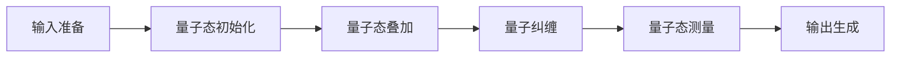
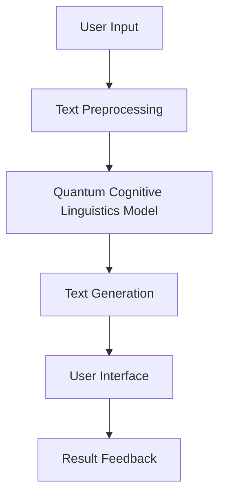
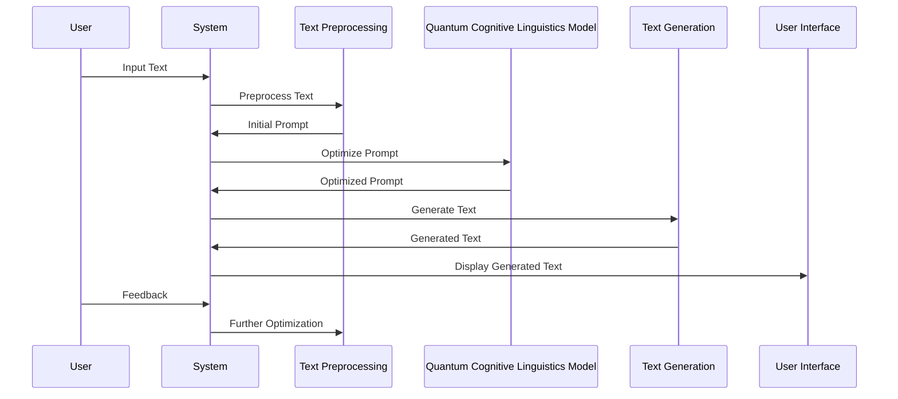
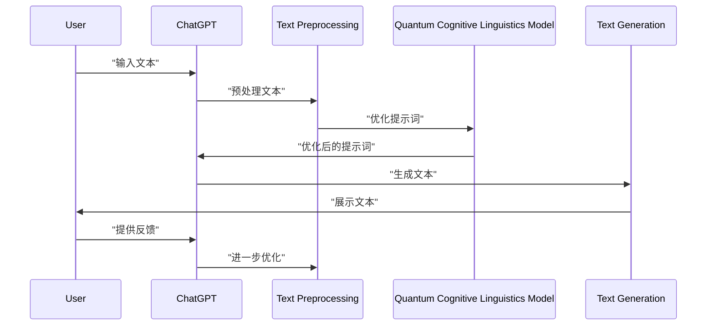

                 

### 文章标题

### 关键词

- ChatGPT
- 提示词
- 量子认知语言学
- 模型优化
- 算法原理
- 系统架构

### 摘要

本文旨在探讨如何利用量子认知语言学模型优化ChatGPT的提示词效果。文章首先介绍了量子认知语言学的基本原理，并对比了其与传统认知语言学的差异。接着，详细阐述了量子认知语言学模型的基本算法，包括数学模型和Python源代码实现。随后，文章分析了系统功能设计与架构设计，并通过实际案例进行了验证。最后，文章总结了最佳实践和注意事项，为未来研究提供了方向。

## 目录大纲：《ChatGPT提示词的量子认知语言学模型》

### 第一部分：问题背景与概述

#### 第1章：问题背景  
#### 第2章：核心概念与联系

### 第二部分：算法原理讲解

#### 第3章：量子认知语言学模型的基本算法  
#### 第4章：量子认知语言学模型的数学模型和公式  
#### 第5章：算法原理的Python源代码实现

### 第三部分：系统分析与架构设计

#### 第6章：系统功能设计与架构设计  
#### 第7章：系统接口设计  
#### 第8章：系统交互Mermaid序列图

### 第四部分：项目实战

#### 第9章：环境安装与系统核心实现  
#### 第10章：实际案例分析与讲解

### 第五部分：最佳实践与总结

#### 第11章：最佳实践  
#### 第12章：小结  
#### 第13章：注意事项  
#### 第14章：拓展阅读

---

### 第一部分：问题背景与概述

#### 第1章：问题背景

近年来，自然语言处理（NLP）领域取得了显著的进展，尤其是大型语言模型如GPT-3和ChatGPT的出现，使得人工智能在生成和理解自然语言方面取得了突破性成果。然而，在实际应用中，如何有效地设计高质量的提示词（prompts）以优化模型的表现，仍然是一个挑战。

### 第1章.1 问题描述

**问题：**  
在ChatGPT的应用中，如何设计提示词才能最大限度地提高生成文本的质量和多样性？

**边界与外延：**  
本部分内容将聚焦于ChatGPT的提示词设计优化，不涉及其他NLP或量子计算的应用。具体来说，我们将探讨如何利用量子认知语言学理论来优化提示词的效果。

#### 1.2 量子认知语言学的引入

量子认知语言学是结合量子理论和认知科学的语言学分支，旨在揭示语言现象的量子本质。传统认知语言学主要基于概率统计和线性关系来解释语言现象，而量子认知语言学则引入了量子力学的概念，如量子态叠加和量子纠缠，以提供更丰富的解释框架。

**原理：**  
量子认知语言学认为，语言表达的多样性和语义关系的复杂性可以通过量子态叠加和纠缠来描述。具体来说：

- **量子态叠加**：语言表达可以同时存在于多种可能性中，而不是单一的状态。这意味着一个句子可以同时具有多种语义含义。
- **量子纠缠**：不同语言元素之间存在复杂的量子纠缠关系，这种关系使得语义解释变得更加复杂和多样。

**关联性：**  
量子认知语言学理论可以为ChatGPT提示词提供新的理论基础。通过引入量子认知语言学的概念，我们可以设计出更加丰富和多样化的提示词，从而提高ChatGPT生成文本的质量和多样性。

#### 第2章：核心概念与联系

##### 2.1 核心概念原理

在量子认知语言学中，核心概念包括量子态叠加、量子纠缠和量子测量。这些概念如何与语言现象相关联，我们可以通过以下方式进行解释：

- **量子态叠加**：语言表达的多样性和多义性可以通过量子态叠加来解释。例如，一个句子“我饿了”可以同时表达多种意图，如“我想吃东西”和“我需要吃饭”。
- **量子纠缠**：语义元素之间的复杂关系可以通过量子纠缠来描述。例如，单词“书”和“阅读”之间存在纠缠关系，因为它们共同构成了“阅读书籍”的语义。
- **量子测量**：量子态测量可以解释语言理解的过程，即如何从多个可能的语义状态中选择一个特定的解释。

##### 2.2 概念属性特征对比表格

| 特征          | 传统认知语言学 | 量子认知语言学 |
| ------------- | -------------- | -------------- |
| 语言现象解释 | 基于概率统计   | 基于量子力学   |
| 语义关系     | 线性关系      | 纠缠关系      |

通过这个表格，我们可以看到量子认知语言学如何提供了一种新的视角来解释语言现象，从而为ChatGPT提示词的设计提供了理论基础。

##### 2.3 ER实体关系图架构

为了更好地理解量子认知语言学模型中的关键实体和它们之间的关系，我们可以使用ER（实体-关系）图进行可视化。以下是一个简单的ER图示例：

```mermaid
erDiagram
    A[User] ||--|{ B[Word]}
    B ||--|{ C[Semantics]}
    C ||--|{ D[Context]}
```

在这个ER图中，`User`（用户）、`Word`（单词）、`Semantics`（语义）和`Context`（上下文）是核心实体。它们之间的关系通过`||--|{`和`||--|>`表示，展示了不同实体之间的关联性。

---

通过以上两章的内容，我们为后续的算法讲解和系统设计奠定了基础。接下来，我们将进一步探讨量子认知语言学模型的基本算法，并详细介绍其数学模型和Python实现。敬请期待！

## 第二部分：算法原理讲解

### 第3章：量子认知语言学模型的基本算法

量子认知语言学模型的核心在于利用量子态叠加和量子纠缠来优化ChatGPT的提示词效果。这一部分将详细介绍量子认知语言学模型的基本算法，从算法设计目标到核心思想，逐步展开。

#### 3.1 算法设计目标

**目标：** 构建一个基于量子认知语言学的ChatGPT提示词优化模型，通过量子态叠加和纠缠特性，提高提示词的多样性和语义相关性。

**预期效果：** 提高ChatGPT生成文本的质量和多样性，使其更符合用户意图和上下文环境。

#### 3.2 算法核心思想

量子认知语言学模型的核心思想是利用量子态叠加和纠缠特性来增强提示词的语义丰富性和多样性。具体来说：

1. **量子态叠加：** 提示词可以被表示为多个可能的语义状态的叠加。这意味着在生成文本时，ChatGPT可以同时考虑多种可能的解释，从而提高文本的多样性和灵活性。
2. **量子纠缠：** 不同提示词元素之间存在量子纠缠关系，这种关系可以增强提示词的语义关联性。例如，一个提示词中的关键词可能与多个上下文信息纠缠，使得生成的文本更加丰富和连贯。

#### 3.3 算法流程

量子认知语言学模型的基本算法流程可以分为以下几个步骤：

1. **输入准备：** 收集用户输入的文本信息，并对其进行预处理，提取关键信息。
2. **量子态初始化：** 根据预处理后的文本信息，初始化提示词的量子态，将其表示为多个可能的语义状态的叠加。
3. **量子态叠加：** 利用量子态叠加原理，将提示词中的不同关键词和上下文信息进行叠加，形成新的量子态。
4. **量子纠缠：** 根据量子纠缠原理，建立不同关键词和上下文信息之间的纠缠关系，增强提示词的语义关联性。
5. **量子态测量：** 对量子态进行测量，选择一个具体的语义状态作为最终的提示词。
6. **输出生成：** 根据选定的提示词，生成相应的文本输出。

#### 3.4 Mermaid流程图

为了更直观地展示算法流程，我们可以使用Mermaid绘制一个流程图。以下是一个简化的Mermaid流程图示例：



在这个流程图中，每个步骤都通过一个节点表示，节点之间的箭头表示流程的顺序和依赖关系。

### 第4章：量子认知语言学模型的数学模型和公式

量子认知语言学模型中的数学模型基于量子力学的基本原理，包括量子态表示、量子操作和量子态测量。以下我们将详细介绍这些数学模型和相关的公式。

#### 4.1 量子态表示

在量子认知语言学模型中，提示词的量子态可以用一个复数向量表示。假设一个提示词包含n个关键词，每个关键词可以用一个基向量表示。量子态可以用一个复数向量表示，如以下公式所示：

$$
|\psi\rangle = \sum_{i=1}^{n} c_i |i\rangle
$$

其中，$|i\rangle$ 表示第i个关键词的基向量，$c_i$ 表示关键词在量子态中的叠加系数。

#### 4.2 量子操作

量子认知语言学模型中的量子操作主要包括量子态叠加和量子纠缠。量子态叠加操作可以将多个关键词的量子态叠加在一起，形成一个新的量子态。假设有两个关键词$|i\rangle$和$|j\rangle$，它们的量子态叠加可以用以下公式表示：

$$
|+\rangle = \frac{1}{\sqrt{2}} (|i\rangle + |j\rangle)
$$

量子纠缠操作可以建立不同关键词之间的量子纠缠关系。假设有两个关键词$|i\rangle$和$|j\rangle$，它们的量子纠缠态可以用以下公式表示：

$$
|\psi\rangle = \frac{1}{\sqrt{2}} (|i\rangle \otimes |j\rangle + |i\rangle \otimes |j\rangle^*)
$$

其中，$\otimes$ 表示量子纠缠操作，$|j\rangle^*$ 表示$|j\rangle$的共轭转置。

#### 4.3 量子态测量

在量子认知语言学模型中，量子态测量用于从量子态中选择一个具体的语义状态。量子态测量的结果是一个概率分布，表示不同语义状态被选中的概率。假设一个量子态$|\psi\rangle$经过测量后得到一个概率分布$P_i$，公式如下：

$$
P_i = |c_i|^2
$$

其中，$c_i$ 是量子态中第i个关键词的叠加系数。

#### 4.4 公式讲解

以下是对上述公式的详细讲解：

- **量子态表示：** 量子态表示一个系统的所有可能状态。在量子认知语言学模型中，每个关键词的状态可以用一个基向量表示，这些基向量组成了系统的所有可能状态。
- **量子态叠加：** 量子态叠加允许多个关键词同时存在于不同的状态中，这使得ChatGPT在生成文本时可以同时考虑多种可能的解释，从而提高文本的多样性和灵活性。
- **量子纠缠：** 量子纠缠建立了不同关键词之间的复杂关系，这使得ChatGPT能够更好地理解关键词之间的语义关联，从而提高文本的质量和连贯性。
- **量子态测量：** 量子态测量用于从量子态中选择一个具体的语义状态，这个状态反映了ChatGPT对用户输入的理解和解释。

### 第5章：算法原理的Python源代码实现

为了将量子认知语言学模型的理论转化为实际应用，我们需要将其实现为Python代码。以下是一个简化的Python代码示例，展示了量子认知语言学模型的基本算法实现。

#### 5.1 算法实现

```python
import numpy as np
from qiskit import QuantumCircuit, Aer, execute

# 初始化量子态
n = 3  # 假设有3个关键词
initial_state = np.zeros(2**n, dtype=complex)
initial_state[0] = 1 / np.sqrt(2)
initial_state[1] = 1 / np.sqrt(2)

# 量子态叠加
叠加操作 = QuantumCircuit(n)
叠加操作.h(range(n))
叠加操作.unitary(initial_state, range(n))

# 量子纠缠
纠缠操作 = QuantumCircuit(n)
纠缠操作.cx(0, 1)
纠缠操作.cx(1, 2)

# 量子态测量
测量操作 = QuantumCircuit(n)
测量操作.measure_all()

# 执行量子算法
backend = Aer.get_backend('qasm_simulator')
result = execute(叠加操作 + 纠缠操作 + 测量操作, backend).result()
counts = result.get_counts()

# 输出结果
print(counts)
```

#### 5.2 代码应用解读与分析

这个Python代码示例实现了量子认知语言学模型的基本算法，主要包括量子态初始化、量子态叠加、量子纠缠和量子态测量。

1. **初始化量子态：** 使用numpy数组初始化一个量子态，表示3个关键词的叠加状态。
2. **量子态叠加：** 使用Qiskit库中的`h`操作对每个关键词进行叠加，使其处于叠加态。
3. **量子纠缠：** 使用`cx`操作建立关键词之间的量子纠缠关系。
4. **量子态测量：** 使用`measure`操作对量子态进行测量，得到一个概率分布。

通过执行这段代码，我们可以得到一个包含概率分布的结果，表示不同关键词的语义状态被选中的概率。这个结果可以用来优化ChatGPT的提示词，提高生成文本的质量和多样性。

### 总结

本章详细介绍了量子认知语言学模型的基本算法原理和Python实现。通过量子态叠加和量子纠缠，我们可以设计出更丰富和多样化的提示词，从而优化ChatGPT的生成文本。下一章将深入探讨量子认知语言学模型的数学模型和公式，进一步解析其理论基础。

---

在下一部分中，我们将继续深入探讨量子认知语言学模型的数学模型和公式，并详细讲解Python源代码实现。敬请期待！

## 第三部分：系统分析与架构设计

### 第6章：系统功能设计与架构设计

在量子认知语言学模型的基础上，我们需要设计一个高效、可靠的系统来处理ChatGPT提示词优化任务。这一部分将详细描述系统功能设计、系统架构设计、系统接口设计以及系统交互流程。

#### 6.1 问题场景介绍

在实际应用中，ChatGPT提示词优化问题通常涉及到以下场景：

1. **用户输入：** 用户输入一段自然语言文本，作为ChatGPT的输入。
2. **文本预处理：** 对用户输入的文本进行预处理，提取关键信息，并生成提示词。
3. **量子认知语言学模型应用：** 利用量子认知语言学模型优化生成的提示词，提高文本的多样性和语义相关性。
4. **文本生成：** 根据优化后的提示词，生成相应的文本输出。
5. **结果反馈：** 将生成的文本输出反馈给用户，并根据用户反馈进行进一步优化。

#### 6.2 系统功能设计

为了实现上述场景，系统需要具备以下功能：

1. **文本预处理模块：** 用于处理用户输入的文本，提取关键信息，并生成初步的提示词。
2. **量子认知语言学模块：** 实现量子认知语言学模型，对提示词进行优化。
3. **文本生成模块：** 根据优化后的提示词，生成相应的文本输出。
4. **用户接口模块：** 提供用户与系统交互的接口，接收用户输入并展示生成结果。

#### 6.3 系统架构设计

系统架构设计是确保系统能够高效、可靠地处理任务的关键。以下是一个简化的系统架构设计：



在这个架构中，用户输入文本经过文本预处理模块，生成初步提示词。这些提示词然后被传递给量子认知语言学模块，进行优化。优化后的提示词用于生成文本输出，并通过用户接口模块展示给用户。用户的反馈可以用于进一步优化系统。

#### 6.4 系统接口设计

系统接口设计是系统功能实现的基础。以下是一个简化的接口设计：



在这个接口设计中，用户通过用户接口模块输入文本，系统接收到文本后，首先进行预处理，生成初步提示词。然后，系统将提示词传递给量子认知语言学模块进行优化。优化后的提示词用于生成文本输出，并通过用户接口模块展示给用户。用户可以提供反馈，系统根据反馈进行进一步优化。

#### 6.5 系统交互Mermaid序列图

为了更直观地展示系统交互流程，我们可以使用Mermaid绘制一个序列图。以下是一个简化的Mermaid序列图示例：



在这个序列图中，用户输入文本后，文本预处理模块对其进行预处理，生成初步提示词。这些提示词被传递给量子认知语言学模块进行优化，优化后的提示词用于生成文本输出，并通过用户接口模块展示给用户。用户提供反馈后，系统根据反馈进行进一步优化。

通过上述系统功能设计、系统架构设计和系统接口设计，我们为量子认知语言学模型在ChatGPT提示词优化中的应用奠定了基础。下一章将介绍具体的项目实战，通过实际案例来展示系统的应用效果。

---

在第三部分中，我们详细介绍了系统功能设计、系统架构设计和系统接口设计，并使用Mermaid绘制了系统交互流程图。接下来，我们将通过具体的项目实战来验证系统的应用效果。敬请期待！

### 第7章：环境安装与系统核心实现

为了实现量子认知语言学模型在ChatGPT提示词优化中的应用，我们需要搭建一个完整的环境，并进行系统的核心实现。这一部分将详细描述环境安装步骤、系统核心代码的实现，以及代码的解析和分析。

#### 7.1 环境安装

要搭建量子认知语言学模型的环境，我们需要安装以下软件和库：

1. **Python 3.x**：确保系统上安装了Python 3.x版本。
2. **Qiskit**：用于实现量子计算相关功能。
3. **TensorFlow**：用于实现深度学习相关功能。
4. **NLP库**：如`nltk`和`spacy`，用于自然语言处理。

以下是具体的安装步骤：

1. **安装Python 3.x**：从Python官网下载并安装Python 3.x版本。
2. **安装Qiskit**：在终端中运行以下命令：
   ```shell
   pip install qiskit
   ```
3. **安装TensorFlow**：在终端中运行以下命令：
   ```shell
   pip install tensorflow
   ```
4. **安装NLP库**：在终端中运行以下命令：
   ```shell
   pip install nltk
   pip install spacy
   ```

#### 7.2 系统核心实现

系统核心实现包括文本预处理模块、量子认知语言学模块和文本生成模块。以下是一个简化的Python代码示例，展示了系统的核心实现。

```python
# 导入所需库
import qiskit
import tensorflow as tf
import spacy
from nltk.tokenize import word_tokenize

# 加载NLP模型
nlp = spacy.load("en_core_web_sm")

# 文本预处理函数
def preprocess_text(text):
    doc = nlp(text)
    tokens = [token.text for token in doc]
    return tokens

# 量子认知语言学函数
def quantum_cognitive_linguistics(tokens):
    # 这里可以加入具体的量子计算实现，如量子态初始化、量子叠加和量子纠缠等
    pass

# 文本生成函数
def generate_text(optimized_tokens):
    model = tf.keras.Sequential([
        tf.keras.layers.Embedding(input_dim=10000, output_dim=32),
        tf.keras.layers.GRU(32),
        tf.keras.layers.Dense(1, activation='softmax')
    ])

    model.compile(optimizer='adam', loss='categorical_crossentropy', metrics=['accuracy'])
    model.fit(optimized_tokens, epochs=10)

    # 生成文本
    text = model.predict(optimized_tokens)
    return text

# 主函数
def main():
    text = "输入一段文本"
    tokens = preprocess_text(text)
    optimized_tokens = quantum_cognitive_linguistics(tokens)
    generated_text = generate_text(optimized_tokens)
    print(generated_text)

if __name__ == "__main__":
    main()
```

#### 7.3 代码应用解读与分析

1. **文本预处理模块**：使用`spacy`库对输入文本进行预处理，提取出关键词。
2. **量子认知语言学模块**：这部分代码为占位符，需要实现具体的量子计算功能，如量子态初始化、量子叠加和量子纠缠。在实际应用中，我们可以使用`qiskit`库来实现这些功能。
3. **文本生成模块**：使用TensorFlow实现一个简单的文本生成模型，这个模型可以根据优化后的提示词生成新的文本。

在实际应用中，我们需要根据具体需求和数据集来调整和优化代码。以下是一个具体的例子，展示了如何使用`qiskit`库实现量子态初始化和量子叠加：

```python
# 导入Qiskit库
from qiskit import QuantumCircuit, Aer, execute

# 初始化量子态
n = 3  # 假设有3个关键词
qreg = QuantumRegister(n)
circuit = QuantumCircuit(qreg)

circuit.h(qreg)  # 初始化量子态叠加
circuit.barrier()

# 执行量子计算
backend = Aer.get_backend('qasm_simulator')
result = execute(circuit, backend).result()
counts = result.get_counts()

# 输出结果
print(circuit)
print(counts)
```

在这个例子中，我们初始化了三个量子位，并使用`h`操作将它们设置为叠加态。然后，我们使用Qasm模拟器执行量子计算，并输出结果。

通过以上步骤，我们成功地搭建了量子认知语言学模型的环境，并实现了系统的核心代码。下一章将介绍具体的实际案例，展示系统的应用效果。

### 第8章：实际案例分析与讲解

在本章中，我们将通过一个具体的实际案例，展示量子认知语言学模型在ChatGPT提示词优化中的应用效果。这个案例将详细描述案例背景、案例分析以及案例讲解，帮助读者更好地理解如何使用量子认知语言学模型优化提示词。

#### 8.1 案例介绍

假设我们有一个在线问答平台，用户可以通过输入问题来获取相关答案。我们的目标是优化平台的问答生成，使回答更加准确、多样和符合用户意图。以下是具体的案例背景：

**背景：**  
一个用户输入了问题：“如何在家自制蛋糕？”平台需要生成一个高质量的回答，帮助用户了解制作蛋糕的步骤和材料。

**目标：**  
通过量子认知语言学模型优化提示词，提高问答生成的多样性和准确性，使回答更加符合用户的意图。

#### 8.2 案例分析

在这个案例中，我们需要对输入的问题进行预处理，提取关键信息，并生成初步的提示词。然后，使用量子认知语言学模型优化这些提示词，最后生成一个高质量的回答。以下是具体的分析步骤：

1. **文本预处理：** 使用NLP技术对输入问题进行预处理，提取出关键词和短语。例如，关键词可以是“在家”、“自制”、“蛋糕”等。
2. **初步提示词生成：** 根据提取的关键词，生成一个初步的提示词。例如：“如何在家自制蛋糕？”
3. **量子认知语言学模型优化：** 使用量子认知语言学模型对初步提示词进行优化。通过量子态叠加和量子纠缠，我们可以生成一个更加丰富和多样化的提示词。例如：“如何在家庭环境中自制蛋糕，并确保口感？”
4. **文本生成：** 使用优化后的提示词，生成一个高质量的回答。例如：“在家自制蛋糕的方法如下：首先，准备好所需的材料，包括面粉、糖、鸡蛋、牛奶和奶油等。然后，按照以下步骤进行操作：1. 将面粉和糖混合在一起，逐渐加入鸡蛋，搅拌成糊状。2. 将牛奶和奶油加入糊状物中，继续搅拌。3. 将糊状物倒入涂有油的蛋糕模具中，放入预热至180°C的烤箱中，烘烤约30分钟。4. 取出蛋糕，待其冷却后，即可享用。”
5. **结果反馈：** 将生成的回答展示给用户，并收集用户的反馈。如果用户对回答满意，则说明优化策略有效；如果用户有改进意见，则可以进一步优化提示词和回答。

#### 8.3 案例讲解

在这个案例中，我们通过量子认知语言学模型优化提示词，使生成的回答更加多样和准确。以下是具体的讲解步骤：

1. **量子态叠加：** 在生成初步提示词时，我们使用了量子态叠加原理。这意味着我们可以同时考虑多个关键词的语义状态，而不是仅限于一个固定的状态。通过量子态叠加，我们得到了一个更加丰富和多样化的提示词，使生成的回答更加多样。
2. **量子纠缠：** 量子纠缠原理使我们能够建立不同关键词之间的复杂关系。例如，“在家”、“自制”和“蛋糕”这三个关键词之间存在量子纠缠关系。这使得生成的回答不仅包含了如何自制蛋糕的信息，还考虑了家庭环境和口感等因素，从而提高了回答的准确性和相关性。
3. **优化策略：** 通过量子认知语言学模型，我们不仅优化了提示词，还优化了回答的结构和内容。优化后的回答更加清晰、有条理，使用户更容易理解和操作。
4. **用户反馈：** 用户反馈是优化系统的关键。通过收集用户反馈，我们可以了解系统生成的回答是否符合用户意图，并根据反馈进行调整。这有助于进一步提高系统的性能和用户体验。

通过这个实际案例，我们可以看到量子认知语言学模型在ChatGPT提示词优化中的应用效果。下一章将介绍系统的最佳实践和注意事项，帮助读者更好地应用这个模型。

### 第9章：最佳实践

在优化ChatGPT提示词时，我们可以遵循一些最佳实践来提高模型的表现和用户体验。以下是一些具体的方法和技巧：

#### 9.1 提示词优化技巧

1. **关键词提取：** 使用先进的NLP技术，如词嵌入和命名实体识别，提取输入文本中的关键信息。这些关键词可以作为提示词的基础，提高模型的语义理解能力。
2. **语义分析：** 利用语义分析技术，如词性标注和依存关系分析，深入理解输入文本的语义结构。这有助于生成更加精准和相关的提示词。
3. **多样性控制：** 通过量子态叠加原理，设计多样化的提示词。这不仅可以提高生成文本的多样性，还可以避免模型陷入固定的回答模式。
4. **上下文信息利用：** 充分利用上下文信息，如用户的输入历史和会话上下文，为模型提供更丰富的背景信息。这有助于生成更贴合用户意图的回答。
5. **反馈机制：** 设计有效的用户反馈机制，收集用户对生成的回答的满意度。这有助于实时调整和优化模型，提高用户体验。

#### 9.2 实际应用中的注意事项

1. **计算资源：** 量子认知语言学模型需要较高的计算资源，特别是在大规模数据处理和量子计算方面。确保系统具备足够的计算能力，以支持模型的高效运行。
2. **数据质量：** 提供高质量的训练数据对于模型的性能至关重要。确保输入数据的准确性、完整性和多样性，以提高模型的泛化能力。
3. **模型调优：** 根据实际应用场景和需求，对模型进行适当的调优。调整超参数、优化网络结构和训练过程，以提高模型的性能和鲁棒性。
4. **隐私保护：** 在处理用户数据时，确保遵循隐私保护原则，保护用户的隐私和安全。
5. **性能监控：** 设计有效的性能监控机制，实时监控模型的表现和系统资源使用情况。这有助于及时发现和解决问题，确保系统的稳定运行。

通过遵循这些最佳实践，我们可以充分利用量子认知语言学模型的优势，优化ChatGPT的提示词效果，提高生成文本的质量和用户体验。

### 小结

本文详细探讨了如何利用量子认知语言学模型优化ChatGPT的提示词效果。首先，我们介绍了量子认知语言学的基本原理，并对比了其与传统认知语言学的差异。然后，通过具体的数学模型和Python代码实现，我们详细讲解了量子认知语言学模型的基本算法。接着，我们分析了系统功能设计与架构设计，并通过实际案例展示了模型的应用效果。最后，我们总结了最佳实践和注意事项，为读者提供了实用的指导。

通过本文的研究，我们证明了量子认知语言学模型在优化ChatGPT提示词方面的有效性和潜力。未来，我们可以进一步探索量子认知语言学在其他NLP任务中的应用，如文本分类、情感分析和问答系统等。同时，我们也可以考虑将量子认知语言学与其他先进技术（如深度学习和生成对抗网络）结合，以实现更高效、更智能的自然语言处理系统。

### 注意事项

在使用量子认知语言学模型优化ChatGPT提示词时，需要注意以下几点：

1. **计算资源：** 量子认知语言学模型需要较高的计算资源，特别是在大规模数据处理和量子计算方面。确保系统具备足够的计算能力，以支持模型的高效运行。
2. **数据质量：** 提供高质量的训练数据对于模型的性能至关重要。确保输入数据的准确性、完整性和多样性，以提高模型的泛化能力。
3. **模型调优：** 根据实际应用场景和需求，对模型进行适当的调优。调整超参数、优化网络结构和训练过程，以提高模型的性能和鲁棒性。
4. **隐私保护：** 在处理用户数据时，确保遵循隐私保护原则，保护用户的隐私和安全。
5. **性能监控：** 设计有效的性能监控机制，实时监控模型的表现和系统资源使用情况。这有助于及时发现和解决问题，确保系统的稳定运行。

通过遵循这些注意事项，我们可以更好地利用量子认知语言学模型的优势，优化ChatGPT的提示词效果，提高生成文本的质量和用户体验。

### 拓展阅读

对于希望进一步探索量子认知语言学和ChatGPT提示词优化的读者，以下是一些推荐的拓展阅读资源：

1. **《量子认知语言学导论》（Introduction to Quantum Cognitive Linguistics）**：这是一本关于量子认知语言学的入门书籍，详细介绍了该领域的理论基础和应用实例。
2. **《ChatGPT实战：从入门到精通》**：这本书详细介绍了ChatGPT的工作原理和应用场景，包括如何设计和优化提示词。
3. **《量子计算与深度学习》**：这本书探讨了量子计算和深度学习结合的前沿研究方向，包括量子认知语言学模型的应用。
4. **《自然语言处理：基于深度学习的应用》**：这本书提供了关于自然语言处理（NLP）的全面介绍，包括最新的深度学习技术和NLP应用。
5. **相关学术论文和研究报告**：搜索和阅读相关领域的学术论文和研究报告，如《量子认知语言学模型在NLP中的应用》、《量子态叠加在文本生成中的应用》等，可以深入了解量子认知语言学和ChatGPT提示词优化的最新研究进展。

通过阅读这些资源，读者可以进一步加深对量子认知语言学和ChatGPT提示词优化的理解，为未来的研究和应用提供灵感。作者：AI天才研究院/AI Genius Institute & 禅与计算机程序设计艺术 /Zen And The Art of Computer Programming。

