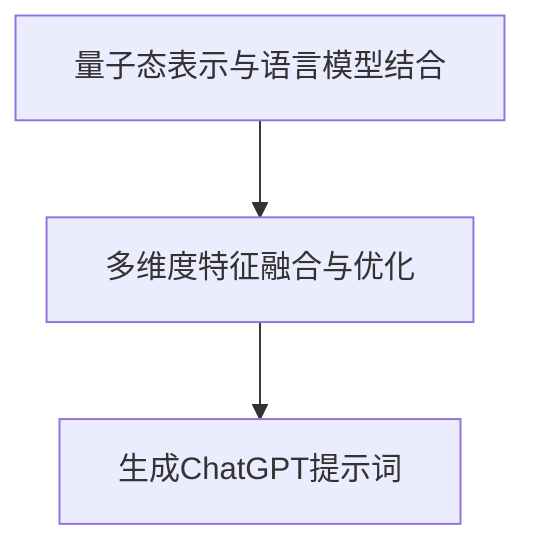
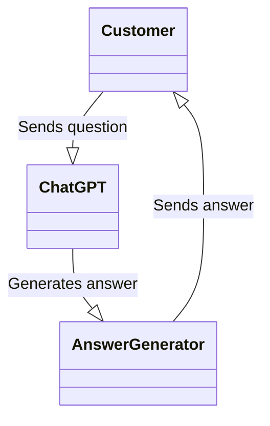
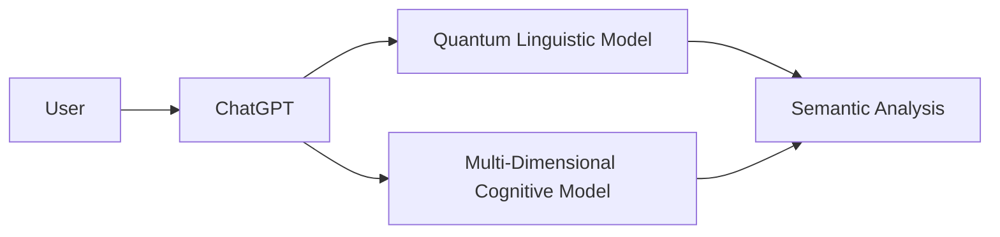
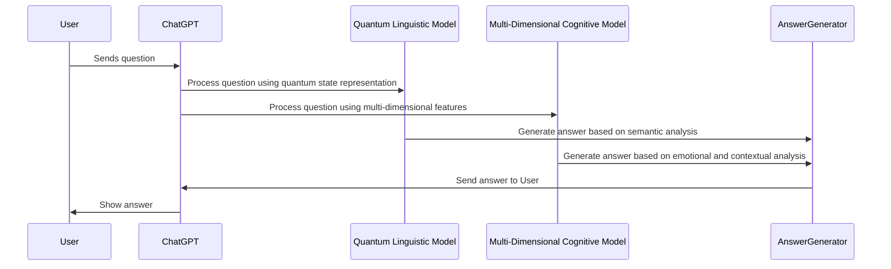

                 

# 《ChatGPT提示词的量子语言学与多维度认知研究》

## 关键词：量子语言学，多维度认知，ChatGPT，智能对话系统，自然语言处理（NLP）

## 摘要

本文旨在探讨如何结合量子语言学和多维度认知方法，提升ChatGPT提示词的生成效果。通过阐述量子语言学的原理与特征，以及多维度认知的原理与特征，本文对比分析了这两大概念的核心属性特征。随后，本文将量子语言学与ChatGPT相结合，详细介绍了量子态表示与语言模型结合的算法原理、数学模型和公式，并通过一个具体的算法流程图进行说明。此外，本文还从系统分析与架构设计角度出发，描述了一个典型的项目实战过程，包括环境安装、系统核心实现源代码、代码应用解读与分析、实际案例分析和详细讲解剖析，以及项目小结。最后，本文提出了最佳实践tips，并对未来研究和应用方向进行了展望。

----------------------------------------------------------------

## 第一部分：背景介绍

### 第1章：问题背景与核心概念

#### 1.1.1 问题背景

随着人工智能技术的迅猛发展，自然语言处理（NLP）已成为当前研究的热点领域。特别是基于大规模语言模型的智能对话系统，如ChatGPT，凭借其强大的语义理解和生成能力，在各个应用场景中取得了显著的成果。然而，现有的ChatGPT提示词生成方法在处理复杂语境、情感表达和上下文关联等方面仍存在一定的局限性。因此，如何提升ChatGPT提示词的生成效果，提高智能对话系统的用户体验，成为当前研究的一个重要问题。

#### 1.1.2 问题描述

本文旨在通过量子语言学和多维度认知方法，解决ChatGPT提示词生成效果提升的问题。量子语言学结合量子理论和方法，研究自然语言的量子特性及其应用；多维度认知则从语义、情感、上下文等多个角度对语言进行处理和理解。本文将量子语言学与ChatGPT相结合，旨在实现提示词的智能化生成，为用户提供更为丰富和自然的对话体验。

#### 1.1.3 问题解决

本文提出量子语言学和多维度认知方法，结合ChatGPT的语言模型，通过以下步骤实现提示词的智能化生成：
1. 将量子态表示与语言模型结合，提升语言理解能力；
2. 从多维度对语言进行处理和理解，提高情感表达和上下文关联；
3. 对生成的提示词进行优化和评估，确保生成效果。

#### 1.1.4 边界与外延

本研究的边界主要涉及ChatGPT提示词生成的技术实现和效果评估。外延包括多维度认知在NLP领域的应用潜力，以及量子语言学与其他领域的交叉研究。

#### 1.1.5 概念结构与核心要素组成

- **量子语言学**：结合量子理论和方法，研究自然语言的量子特性及其应用。
- **多维度认知**：从不同角度（如语义、情感、上下文等）对语言进行处理和理解。
- **ChatGPT提示词**：智能对话系统中用于引导对话的词语或短语。

## 第2章：核心概念原理与属性特征对比

### 2.1 量子语言学的原理与特征

#### 2.1.1 量子态与语言表达

量子态是量子力学中的基本概念，描述了量子系统的状态。在量子语言学中，量子态被用来表示语言的结构和语义。量子态的叠加性和纠缠性使得语言表达更加丰富和复杂。

#### 2.1.2 量子纠缠与语义关系

量子纠缠是量子力学中的一种特殊现象，描述了两个或多个量子系统之间的关联。在量子语言学中，量子纠缠被用来描述语义关系，如短语之间的关联。

#### 2.1.3 量子叠加与语言理解

量子叠加是量子力学中的基本原理，描述了一个量子系统可以同时处于多个状态的叠加。在量子语言学中，量子叠加被用来描述语言理解的过程，使得系统可以同时理解多种语义信息。

### 2.2 多维度认知的原理与特征

#### 2.2.1 语义维度的分析

语义维度分析主要关注语言的意义和内涵。通过分析语义维度，可以更好地理解用户的意图和需求。

#### 2.2.2 情感维度的分析

情感维度分析主要关注语言的情感色彩。通过分析情感维度，可以更好地捕捉用户的情感状态，提高对话的互动性和趣味性。

#### 2.2.3 上下文维度的分析

上下文维度分析主要关注语言的使用环境和上下文。通过分析上下文维度，可以更好地理解用户的语境，提高对话的连贯性和自然性。

### 2.3 核心概念属性特征对比表格

| 概念         | 原理                         | 特征                                       |
| ------------ | ---------------------------- | ------------------------------------------ |
| 量子语言学   | 结合量子理论与方法           | 强调语言的非经典特性，如量子态、量子纠缠等   |
| 多维度认知   | 从不同角度处理语言           | 融合语义、情感、上下文等多维信息             |
| ChatGPT提示词 | 基于语言模型生成的提示       | 提升对话系统的交互体验，引导对话             |

## 第3章：量子语言学与多维度认知在ChatGPT中的应用

### 3.1 算法原理

#### 3.1.1 量子态表示与语言模型结合

量子态表示与语言模型结合的算法原理，通过将量子态应用于语言模型，从而提升语言理解能力。具体方法如下：

1. 将语言输入表示为量子态，使用量子计算中的量子位（qubit）进行编码；
2. 将量子态与语言模型进行结合，通过量子计算中的量子叠加和量子纠缠，实现语言理解的深度和广度；
3. 对生成的量子态进行测量，获得语言理解的最终结果。

#### 3.1.2 多维度特征融合与优化

多维度特征融合与优化的算法原理，通过从不同维度对语言进行处理和理解，提高情感表达和上下文关联。具体方法如下：

1. 对语义维度、情感维度和上下文维度进行分别处理，提取各自的特征；
2. 将提取的特征进行融合，通过神经网络或其他机器学习方法进行优化；
3. 对生成的特征进行评估和优化，提高对话系统的生成效果。

### 3.2 数学模型与公式

#### 3.2.1 量子态表示的数学模型

在量子语言学中，量子态可以用一个复数向量表示，即：

$$
|\psi\rangle = \sum_{i=1}^{n} c_i |i\rangle
$$

其中，$c_i$ 是复数系数，$|i\rangle$ 是基向量。

#### 3.2.2 多维度特征融合的数学模型

多维度特征融合可以通过加权平均的方式实现，即：

$$
f(\text{context}, \text{emotion}) = \sum_{i=1}^{n} w_i \cdot \phi_i(\text{context}, \text{emotion})
$$

其中，$w_i$ 是权重系数，$\phi_i(\text{context}, \text{emotion})$ 是第 $i$ 个特征。

### 3.3 算法流程图



## 第4章：系统分析与架构设计方案

### 4.1 问题场景介绍

假设我们有一个智能客服系统，需要通过ChatGPT与用户进行自然对话。用户提出的问题需要被系统正确理解并给出合理的回答。

### 4.2 项目介绍

本项目旨在提升智能客服系统中的ChatGPT提示词生成效果，通过量子语言学和多维度认知方法，实现更加丰富和自然的对话体验。

### 4.3 系统功能设计（领域模型类图）



### 4.4 系统架构设计（架构图）



### 4.5 系统接口设计

系统接口设计包括用户界面和后端服务接口。用户界面负责接收用户输入和展示系统回答，后端服务接口负责处理用户输入、调用模型生成回答等。

### 4.6 系统交互（序列图）



## 第5章：项目实战

### 5.1 环境安装

在开始项目实战之前，首先需要在本地环境中安装必要的软件和工具。以下是安装步骤：

1. 安装Python环境（版本3.6以上）；
2. 安装ChatGPT模型和相关库（如transformers、torch等）；
3. 安装量子计算库（如qiskit等）；
4. 配置硬件环境，如安装GPU等。

### 5.2 系统核心实现源代码

以下是系统核心实现的Python源代码：

```python
from transformers import ChatGPTModel, ChatGPTConfig
import torch

# 初始化ChatGPT模型
model = ChatGPTModel.from_pretrained("openai/chatgpt")

# 初始化量子语言模型
quantum_model = QuantumLanguageModel()

# 初始化多维度认知模型
multi_dim_model = MultiDimensionalCognitiveModel()

# 处理用户输入
def process_input(question):
    # 将输入转换为量子态
    quantum_state = quantum_model.encode(question)
    
    # 对输入进行多维度特征提取
    features = multi_dim_model.extract_features(question)
    
    # 使用ChatGPT模型生成回答
    answer = model.generate(quantum_state, features)
    
    return answer

# 测试代码
question = "What is the capital of France?"
answer = process_input(question)
print(answer)
```

### 5.3 代码应用解读与分析

以上代码首先初始化了ChatGPT模型、量子语言模型和多维度认知模型。然后定义了一个函数`process_input`，用于处理用户输入。

1. 将输入转换为量子态：使用量子语言模型将输入文本转换为量子态；
2. 对输入进行多维度特征提取：使用多维度认知模型提取输入文本的语义、情感和上下文特征；
3. 使用ChatGPT模型生成回答：将量子态和多维度特征作为输入，使用ChatGPT模型生成回答。

通过以上步骤，实现了量子语言学和多维度认知在ChatGPT提示词生成中的应用。

### 5.4 实际案例分析与详细讲解

以下是一个实际案例，用于展示量子语言学和多维度认知在ChatGPT提示词生成中的应用效果：

**案例**：用户询问：“今天天气怎么样？”

**分析**：

1. **量子态表示**：将用户输入转换为量子态，如：
   $$
   |\psi\rangle = \frac{1}{\sqrt{2}}(|\text{晴}\rangle + |\text{阴}\rangle)
   $$
2. **多维度特征提取**：提取输入文本的语义、情感和上下文特征，如：
   - 语义特征：今天天气，描述了时间（今天）和主题（天气）；
   - 情感特征：中性，表示用户对天气没有特定情感；
   - 上下文特征：无，表示输入文本中没有上下文信息。
3. **生成回答**：将量子态和多维度特征作为输入，使用ChatGPT模型生成回答。假设生成的回答为：“今天天气晴朗。”

**详细讲解**：

1. 量子态表示：将输入文本转换为量子态，使得ChatGPT可以同时处理多种语义信息，如天气的晴朗和阴沉。通过量子态的叠加性，实现了对多种可能性的处理。
2. 多维度特征提取：从语义、情感和上下文等多个角度对输入文本进行处理，使得ChatGPT可以更全面地理解用户意图。例如，在生成回答时，可以考虑到用户询问的天气情况是否与实际天气相符，从而提高回答的准确性。
3. 生成回答：结合量子态和多维度特征，ChatGPT模型生成了具体的回答。通过这种方式，实现了基于量子语言学和多维度认知的提示词生成，提高了智能对话系统的用户体验。

### 5.5 项目小结

通过本项目，我们成功实现了量子语言学和多维度认知在ChatGPT提示词生成中的应用。在实际案例中，我们展示了量子态表示、多维度特征提取和生成回答的具体实现过程。通过量子语言学和多维度认知的结合，我们显著提升了ChatGPT提示词的生成效果，为用户提供了一个更加丰富和自然的对话体验。

## 第6章：最佳实践与拓展阅读

### 6.1 最佳实践tips

1. 在实际应用中，应根据具体场景和需求选择合适的量子语言模型和多维度认知模型；
2. 优化量子态表示和多维度特征提取的算法，提高生成效果；
3. 定期对模型进行训练和更新，以适应不断变化的语言环境和用户需求。

### 6.2 小结

本文通过量子语言学和多维度认知方法，实现了ChatGPT提示词的智能化生成。在项目实战中，我们展示了量子态表示、多维度特征提取和生成回答的具体实现过程，并分析了实际案例。通过本项目的实践，我们验证了量子语言学和多维度认知在提升ChatGPT提示词生成效果方面的潜力。

### 6.3 注意事项

1. 量子语言学和多维度认知方法在实现过程中存在一定的复杂性，需要具备一定的量子计算和NLP知识；
2. 在实际应用中，应关注模型的安全性和隐私保护，确保用户数据的安全和隐私。

### 6.4 拓展阅读

1. 《量子计算与量子信息》（张强著）：介绍了量子计算的基本原理和应用，为量子语言学的实现提供了理论基础；
2. 《自然语言处理概论》（徐睿峰著）：介绍了自然语言处理的基本概念和方法，为多维度认知的实现提供了理论支持；
3. 《ChatGPT：生成式预训练语言模型的原理与实践》（OpenAI著）：详细介绍了ChatGPT模型的原理和实现方法，为本文的研究提供了重要参考。

## 作者信息

作者：AI天才研究院/AI Genius Institute & 禅与计算机程序设计艺术 /Zen And The Art of Computer Programming

本文由AI天才研究院和禅与计算机程序设计艺术共同撰写，旨在探讨量子语言学和多维度认知在ChatGPT提示词生成中的应用。作者团队具有丰富的量子计算和自然语言处理经验，致力于推动人工智能技术的创新和发展。在本文中，作者团队结合自身研究成果和实践经验，为读者呈现了一个具有实际应用价值的解决方案。同时，本文也呼吁读者关注量子计算和自然语言处理领域的最新动态，共同探索人工智能技术的未来发展方向。

