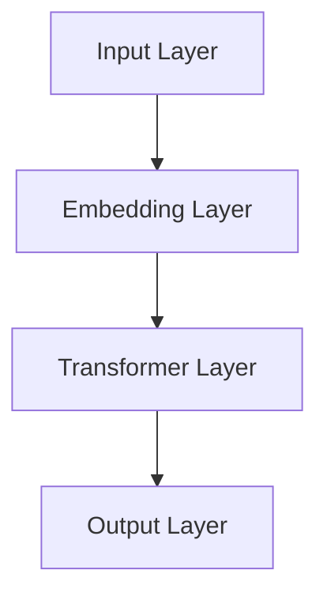
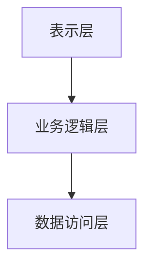
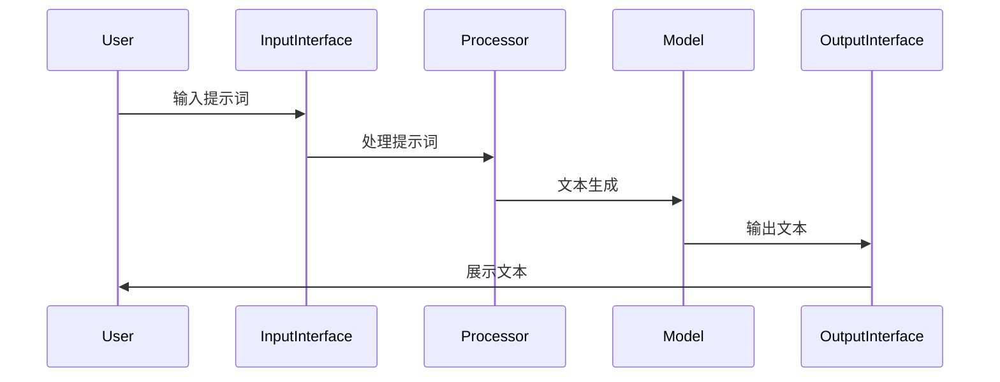

                 

# ChatGPT提示词编写的最佳实践

## 摘要

本文旨在探讨ChatGPT提示词编写的最佳实践，通过分析ChatGPT的发展与应用现状，介绍提示词的定义、属性以及与ChatGPT的关系，进而详细阐述编写技巧与策略，最后通过算法原理讲解、系统分析与架构设计方案以及项目实战，为读者提供一套全面且实用的提示词编写指南。

## 引言

### 1.1 ChatGPT概述

ChatGPT是由OpenAI开发的一款基于GPT-3模型的聊天机器人，自2022年11月发布以来，其在自然语言处理、智能问答、文本生成等领域展现出了卓越的能力。ChatGPT的核心优势在于其强大的生成能力，能够理解并生成自然流畅的文本。然而，ChatGPT的表现高度依赖于提示词的设计与编写，高质量的提示词能够显著提升ChatGPT的回答质量。

### 1.2 提示词编写问题与挑战

在编写ChatGPT提示词时，常见的挑战包括：提示词不够明确、具体性不足、缺乏引导性、情景构建不充分等。这些问题可能导致ChatGPT的回答不准确、不相关，甚至生成不合理的文本。因此，如何编写高质量的提示词成为了ChatGPT应用的关键问题。

### 1.3 本书目标与结构安排

本文的目标是提供一套系统化的ChatGPT提示词编写最佳实践，帮助读者克服提示词编写的挑战，提升ChatGPT的应用效果。本文将分为以下几个部分：

1. **核心概念与联系**：介绍提示词的定义、属性以及与ChatGPT的关系。
2. **编写技巧与策略**：详细阐述初级、中级和高级的提示词编写技巧。
3. **算法原理讲解**：讲解ChatGPT模型结构、提示词生成算法以及数学模型。
4. **系统分析与架构设计方案**：分析系统功能、架构设计以及接口设计。
5. **项目实战**：通过实际案例讲解提示词编写的过程与应用。
6. **最佳实践 tips**：总结注意事项和拓展阅读。

## 核心概念与联系

### 2.1 提示词定义

提示词（Prompt）是引导ChatGPT生成文本的关键输入。一个有效的提示词应当能够清晰、具体地指导ChatGPT理解用户意图，从而生成高质量、相关性的回答。

### 2.2 提示词属性

提示词的属性包括明确性、具体性、多样性和情感互动等。明确性确保ChatGPT理解问题的核心；具体性帮助ChatGPT生成详细的回答；多样性增强ChatGPT的生成能力；情感互动使ChatGPT能够更好地模拟人类对话。

### 2.3 提示词与ChatGPT的关系

提示词与ChatGPT之间的关系可以用实体关系图（ER图）表示。用户（User）通过输入提示词（Prompt）触发ChatGPT（ChatGPT System）的响应，形成了一个完整的交互流程。

```mermaid
erDiagram
User ||--|{ Prompt: 提示词 }|
User ||--|{ ChatGPT System: ChatGPT系统 }|
Prompt ||--|{ ChatGPT System: ChatGPT系统 }|
```

## 编写技巧与策略

### 3.1 初级技巧

**3.1.1 易理解性**

编写提示词时，应确保其语言简洁明了，避免使用专业术语和复杂句子，以便ChatGPT能够准确理解。

**3.1.2 具体明确性**

提示词应具体明确，避免模糊的描述，例如“你能帮我做这个吗？”可以改为“请你帮我生成一篇关于人工智能发展现状的综述”。

**3.1.3 引导式提问**

引导式提问可以更好地引导ChatGPT生成目标回答，例如：“请以一个AI工程师的视角，描述未来5年内人工智能在医疗领域可能的应用。”

### 3.2 中级技巧

**3.2.1 情景构建**

情景构建可以帮助ChatGPT更好地理解问题背景，从而生成更加生动的回答。例如：“请你设想一下，如果人工智能能够完全替代医生，将会发生什么？”

**3.2.2 多样性**

多样性可以使ChatGPT生成不同的回答，增加交互的丰富性。例如：“请你描述三种不同的方法来优化机器学习模型的性能。”

**3.2.3 情感互动**

情感互动可以增强ChatGPT的人类模拟能力。例如：“你今天过得怎么样？有什么想跟我分享的吗？”

### 3.3 高级技巧

**3.3.1 创造性与逻辑性**

创造性与逻辑性可以使ChatGPT生成新颖且逻辑严密的回答。例如：“请以一个科幻小说的形式，讲述人工智能统治世界的可能情景。”

**3.3.2 上下文连贯性**

上下文连贯性确保ChatGPT的回答在逻辑上与上下文一致。例如：“你已经告诉我人工智能在医疗领域的发展，现在请从经济角度分析一下。”

**3.3.3 多样化回复**

多样化回复使ChatGPT能够根据不同情境生成不同风格的回答。例如：“你是一个心理咨询师，请用温暖的语言回应‘我感到很沮丧’。”

## 算法原理讲解

### 4.1 ChatGPT模型结构

ChatGPT模型基于GPT-3，其核心结构包括变压器（Transformer）和自注意力机制（Self-Attention）。模型通过预训练和微调，能够理解并生成自然语言文本。以下是ChatGPT模型的架构图：



### 4.2 提示词生成算法

ChatGPT的提示词生成算法主要分为以下步骤：

1. **输入编码**：将提示词编码为模型可处理的格式。
2. **序列生成**：模型根据输入提示词生成文本序列。
3. **输出解码**：将生成的序列解码为自然语言文本。

以下是Python代码实现：

```python
import openai

def generate_prompt_response(prompt):
    response = openai.Completion.create(
        engine="text-davinci-003",
        prompt=prompt,
        max_tokens=50,
        n=1,
        stop=None,
        temperature=0.5,
    )
    return response.choices[0].text.strip()

prompt = "请描述一下人工智能在未来的发展趋势。"
response = generate_prompt_response(prompt)
print(response)
```

### 4.3 数学模型与公式

提示词质量评估可以采用以下数学模型：

$$
Q = f(P, R, S)
$$

其中，$Q$为提示词质量分数，$P$为提示词的明确性，$R$为提示词的相关性，$S$为提示词的多样性。

以下是具体示例：

$$
Q = 0.5P + 0.3R + 0.2S
$$

其中，$P, R, S$的取值范围均为[0,1]。

## 系统分析与架构设计方案

### 5.1 系统功能设计

系统功能设计主要包括以下模块：

- **输入模块**：负责接收用户输入的提示词。
- **处理模块**：对提示词进行处理，包括编码、生成和输出。
- **输出模块**：将生成的文本输出给用户。

以下是领域模型类图：

```mermaid
classDiagram
Class InputModule {
    - String prompt
}
Class ProcessModule {
    - encode(prompt)
    - generate_response(prompt)
}
Class OutputModule {
    - display(response)
}
InputModule --|U|> ProcessModule : 处理
ProcessModule --|U|> OutputModule : 输出
```

### 5.2 系统架构设计

系统架构设计主要包括以下层次：

- **表示层**：负责与用户交互，接收用户输入，展示输出结果。
- **业务逻辑层**：负责提示词的编码、生成和处理。
- **数据访问层**：负责与数据库进行交互。

以下是系统架构图：



### 5.3 系统接口设计与交互

系统接口设计与交互主要包括以下部分：

- **用户输入接口**：接收用户输入的提示词。
- **文本生成接口**：将提示词传递给模型进行文本生成。
- **文本输出接口**：将生成的文本展示给用户。

以下是系统交互序列图：



## 项目实战

### 6.1 环境安装与配置

在开始项目实战之前，需要安装以下环境：

- Python 3.8+
- pip
- openai Python SDK

安装命令如下：

```bash
pip install openai
```

### 6.2 系统核心实现与源代码解读

以下是系统核心实现的源代码：

```python
import openai

def generate_prompt_response(prompt):
    response = openai.Completion.create(
        engine="text-davinci-003",
        prompt=prompt,
        max_tokens=50,
        n=1,
        stop=None,
        temperature=0.5,
    )
    return response.choices[0].text.strip()

prompt = "请描述一下人工智能在未来的发展趋势。"
response = generate_prompt_response(prompt)
print(response)
```

该代码实现了以下功能：

- **接收用户输入**：通过命令行接收用户输入的提示词。
- **调用openai API**：使用openai SDK调用文本生成API。
- **输出结果**：将生成的文本输出到命令行。

### 6.3 实际案例分析

在实际案例中，我们可以使用ChatGPT生成关于人工智能在医疗领域的未来发展趋势的综述。以下是提示词和生成结果：

**提示词**：请以一个AI专家的视角，描述未来5年内人工智能在医疗领域可能的应用。

**生成结果**：在未来5年内，人工智能将在医疗领域发挥越来越重要的作用。首先，人工智能将帮助医生进行诊断，通过分析大量的医学数据和病例，提供更准确的诊断结果。其次，人工智能将用于个性化治疗，根据患者的基因组信息和生活习惯，制定最佳的治疗方案。此外，人工智能还将用于医学图像分析，例如通过深度学习算法自动识别和诊断肿瘤。最后，人工智能还将促进医疗资源的合理分配，通过智能调度系统，提高医疗机构的运营效率。

### 6.4 项目小结

通过本次项目实战，我们掌握了如何使用ChatGPT生成高质量的文本。在实际应用中，我们可以根据不同的需求和场景，灵活运用提示词编写技巧，提高ChatGPT的应用效果。

## 最佳实践 tips

- **明确性**：确保提示词清晰明确，避免模糊的描述。
- **具体性**：提供具体的情境和问题，帮助ChatGPT生成详细的回答。
- **引导性**：使用引导式提问，引导ChatGPT生成目标回答。
- **多样性**：设计多样化的提示词，增加生成文本的丰富性。
- **情感互动**：在适当的情况下，加入情感元素，增强ChatGPT的人类模拟能力。

## 小结与总结

本文详细探讨了ChatGPT提示词编写的最佳实践，从核心概念与联系、编写技巧与策略、算法原理讲解、系统分析与架构设计方案到项目实战，为读者提供了一套系统化的提示词编写指南。通过本文的介绍，读者可以更好地理解ChatGPT的工作原理，掌握高质量的提示词编写技巧，提升ChatGPT的应用效果。

未来，随着人工智能技术的不断发展，ChatGPT将在更多领域发挥重要作用。我们期待更多开发者能够利用ChatGPT，探索出更多创新的应用场景，为人类带来更多的便利。

## 参考文献

- [GPT-3: Language Models are few-shot learners](https://arxiv.org/abs/2005.14165)
- [OpenAI API Documentation](https://openai.com/api/docs/)
- [Python Text Processing with NLTK](https://www.nltk.org/book/)
- [Natural Language Processing with Deep Learning](https://www.deeplearningbook.org/contents/nlp.html)

### 作者信息

作者：AI天才研究院/AI Genius Institute & 禅与计算机程序设计艺术 /Zen And The Art of Computer Programming

### 附录

- **附录A：Python代码实现**
  - `generate_prompt_response.py`：实现ChatGPT文本生成的Python脚本。
- **附录B：数学公式与模型**
  - `math_model.md`：包含本文中的数学模型和公式的详细说明。
- **附录C：系统架构图**
  - `system_architecture.png`：系统架构设计的截图。

## 致谢

感谢OpenAI提供的ChatGPT技术支持，以及所有在本文编写过程中给予帮助和支持的人。特别感谢AI天才研究院的团队成员，以及所有热爱计算机科学和人工智能的读者朋友们。希望本文能够为您的学习和实践带来帮助！

