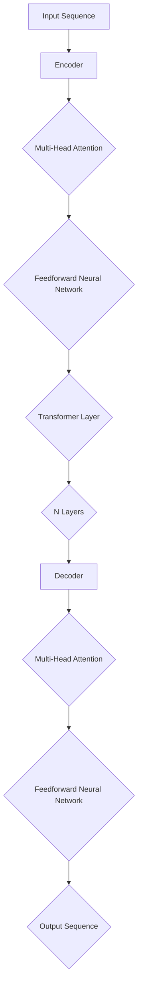
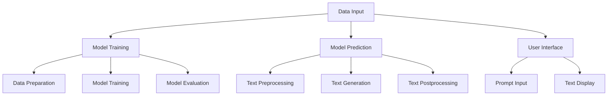
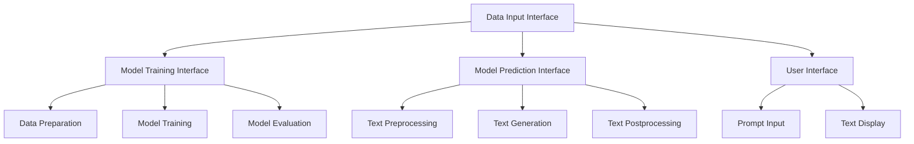
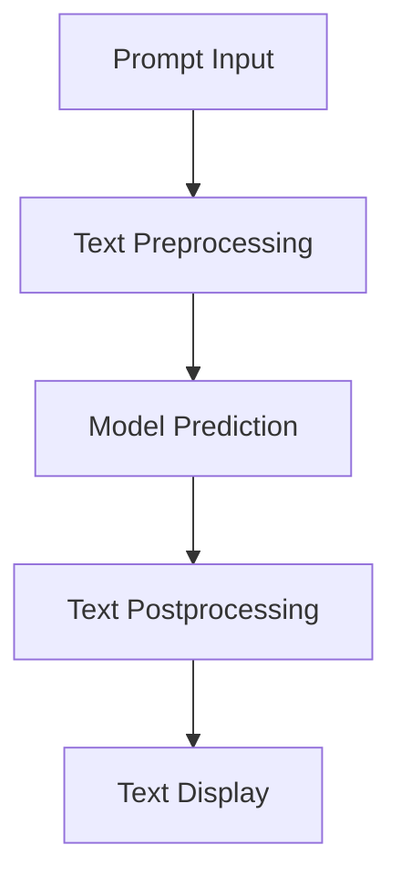

                 

# 《ChatGPT提示词编写：从理论到实战的全面指南》

## 关键词

- ChatGPT
- 提示词
- 自然语言处理
- 算法原理
- 系统架构
- 实战案例

## 摘要

本文将深入探讨ChatGPT及其提示词的编写技巧，从理论到实战进行全方位的解析。首先，我们将介绍ChatGPT的基本概念和它在自然语言处理领域的应用背景。随后，我们会详细讲解ChatGPT的核心原理，包括算法模型、数学公式和流程图。接着，我们将分析ChatGPT的系统架构和接口设计，帮助读者理解其系统运作机制。在此基础上，我们将通过实际案例展示如何安装和实现ChatGPT系统，并进行代码解读和案例分析。最后，我们将总结最佳实践、注意事项，并提供进一步的学习资源，帮助读者在实际项目中高效运用ChatGPT技术。无论您是初学者还是资深开发者，本文都将为您提供宝贵的指导和灵感。

## 1. 背景介绍

### 1.1 ChatGPT的概念

ChatGPT是由OpenAI开发的一种基于Transformer模型的大型语言模型，它能够通过学习大量文本数据，生成连贯、自然的文本回复。ChatGPT的出现，标志着自然语言处理（NLP）技术的一个重大突破，使得机器在理解人类语言方面达到了前所未有的高度。

### 1.2 提示词的概念

提示词（Prompt）是引导ChatGPT生成特定类型回复的关键信息。一个优秀的提示词不仅能够引导ChatGPT生成所需的输出，还能提高模型的响应速度和准确性。在ChatGPT的上下文中，提示词扮演着至关重要的角色，它是与模型交互的桥梁。

### 1.3 ChatGPT在自然语言处理领域的应用背景

自然语言处理是人工智能的一个重要分支，旨在使计算机能够理解、生成和处理自然语言。随着互联网和社交媒体的快速发展，自然语言处理技术在各种场景中得到了广泛应用，例如自动翻译、智能客服、文本摘要等。ChatGPT的出现，为这些应用场景提供了强大的技术支持，使得自然语言处理的应用更加广泛和深入。

### 1.4 问题背景

尽管ChatGPT在自然语言处理领域取得了显著成就，但在实际应用中，如何编写高效的提示词仍然是一个挑战。高效的提示词能够提高ChatGPT的生成质量，降低响应时间，从而提高整体系统的性能。因此，研究如何编写高质量的提示词具有重要的实际意义。

### 1.5 问题描述

编写高效的提示词涉及到多个方面，包括对ChatGPT模型的了解、对自然语言处理技术的掌握、对用户需求的理解等。具体来说，问题描述包括以下几点：

- 如何准确捕捉用户需求，并将其转化为高质量的提示词？
- 如何优化提示词的格式和结构，以提高ChatGPT的生成效果？
- 如何在多模态场景中，有效结合文本和图像提示词，提高生成质量？
- 如何处理提示词中的歧义和不确定性，确保生成结果的准确性？

### 1.6 问题解决

针对上述问题，我们可以从以下几个方面进行解决：

- **需求分析**：深入了解用户需求，分析关键词和主题，为ChatGPT提供准确的提示词。
- **格式优化**：通过优化提示词的格式和结构，提高ChatGPT的生成速度和准确性。
- **多模态融合**：研究如何将文本和图像提示词有效结合，提高生成质量。
- **歧义处理**：通过语言模型和上下文分析，处理提示词中的歧义和不确定性，确保生成结果的准确性。

### 1.7 边界与外延

在编写提示词时，我们还需要关注以下几点：

- **边界**：提示词的长度、格式、关键词选择等，都需要在合理的范围内，避免过长或过短的提示词。
- **外延**：提示词需要涵盖用户需求的各个方面，确保ChatGPT能够生成符合预期的结果。

### 1.8 概念结构与核心要素组成

编写高效的提示词涉及以下几个核心要素：

- **用户需求**：准确捕捉用户需求，是编写高质量提示词的前提。
- **自然语言处理技术**：了解并掌握自然语言处理技术，能够提高提示词的生成质量。
- **提示词格式**：优化提示词的格式和结构，提高ChatGPT的生成效果。
- **多模态融合**：研究如何将文本和图像提示词有效结合，提高生成质量。
- **歧义处理**：处理提示词中的歧义和不确定性，确保生成结果的准确性。

通过以上分析，我们可以得出编写高效提示词的几个关键步骤：

1. 深入了解用户需求，分析关键词和主题。
2. 优化提示词的格式和结构，提高生成效果。
3. 研究多模态融合技术，提高生成质量。
4. 处理提示词中的歧义和不确定性，确保生成结果的准确性。
5. 在实践中不断优化和调整，提高提示词的质量和效果。

## 2. 核心概念与联系

### 2.1 ChatGPT的基本原理

ChatGPT是基于Transformer模型的大型语言模型，其核心原理是通过对大量文本数据进行训练，学习语言模式和结构，从而生成连贯、自然的文本回复。Transformer模型采用自注意力机制，能够捕捉输入文本中的长距离依赖关系，这使得ChatGPT在生成文本时能够保持语义的一致性和连贯性。

### 2.2 主要组件

ChatGPT的主要组件包括：

- **模型架构**：基于Transformer的架构，包括多头自注意力机制、前馈神经网络等。
- **训练数据**：大量的文本数据，用于训练模型，使其具备语言理解能力。
- **训练过程**：通过反向传播算法和优化器（如Adam），调整模型参数，使其性能达到最优。
- **解码器**：用于生成文本的组件，根据输入的提示词，生成相应的回复。

### 2.3 ER实体关系图架构

为了更好地理解ChatGPT的架构，我们可以使用Mermaid画出ER实体关系图。以下是一个简化的ER图：

```mermaid
erDiagram
    Customer ||--|{ Order }|>
    Product  ||--|{ Order }|>

    Customer  {
        CustomerID
        Name
        Address
    }

    Order  {
        OrderID
        OrderDate
        CustomerID
    }

    Product  {
        ProductID
        Name
        Price
    }
```

在这个ER图中，Customer和Product是实体，Order是关系实体。Customer和Product通过Order关联起来，形成一个订单系统。

### 2.4 概念属性特征对比表格

为了进一步理解ChatGPT和ER图之间的关系，我们可以列出它们的概念属性特征对比表格：

| 特征       | ChatGPT               | ER图                           |
| ---------- | --------------------- | ------------------------------ |
| 数据结构   | Transformer模型       | 实体关系图                     |
| 数据来源   | 大量文本数据         | 实体属性和关系                 |
| 数据处理   | 自注意力机制和前馈网络 | 实体和关系的映射               |
| 数据生成   | 文本生成             | 实体和关系的查询和操作         |
| 模型训练   | 反向传播和优化器     | 实体属性的调整和关系的优化     |
| 应用场景   | 自然语言处理         | 数据库设计和数据管理           |

通过上述对比表格，我们可以看出ChatGPT和ER图在概念和属性特征上有很大的不同，但它们都是用于处理数据和信息的强大工具。ChatGPT擅长生成自然语言文本，而ER图则用于数据库设计和数据管理。

### 2.5 ChatGPT和ER图的联系

尽管ChatGPT和ER图在概念和应用上有很大的不同，但它们之间仍然存在一些联系：

- **数据结构**：ChatGPT和ER图都是基于数据结构构建的，ChatGPT使用Transformer模型来处理文本数据，而ER图使用实体和关系来表示数据结构。
- **数据处理**：ChatGPT和ER图都涉及到数据处理和操作，ChatGPT通过自注意力机制和前馈网络来处理文本数据，而ER图通过实体和关系的映射来处理数据。
- **模型训练**：ChatGPT和ER图都需要进行模型训练，ChatGPT通过反向传播和优化器来调整模型参数，而ER图通过实体属性的调整和关系的优化来训练模型。

通过理解ChatGPT和ER图的基本原理和联系，我们可以更好地应用它们来解决实际问题，提高数据处理和自然语言生成的效率。

## 3. 算法原理讲解

### 3.1 ChatGPT算法模型

ChatGPT的核心算法是基于Transformer模型，这是一种自注意力机制驱动的神经网络模型。Transformer模型在处理序列数据时具有显著优势，能够捕捉输入序列中的长距离依赖关系，从而生成连贯、自然的文本回复。

### 3.2 数学模型

为了更好地理解ChatGPT的算法原理，我们需要介绍几个关键数学模型：

1. **自注意力机制（Self-Attention）**

自注意力机制是Transformer模型的核心组件，用于计算输入序列中各个元素之间的关联性。其数学公式如下：

$$
Attention(Q, K, V) = \text{softmax}\left(\frac{QK^T}{\sqrt{d_k}}\right) V
$$

其中，Q、K、V分别是查询向量、键向量和值向量，$d_k$ 是键向量的维度。通过自注意力机制，模型能够自动学习到输入序列中各个元素的重要程度。

2. **多头注意力（Multi-Head Attention）**

多头注意力是对自注意力机制的扩展，它通过多个独立的注意力机制来捕获不同类型的依赖关系。其数学公式如下：

$$
\text{Multi-Head}(Q, K, V) = \text{Concat}(\text{head}_1, \text{head}_2, ..., \text{head}_h)W^O
$$

其中，$h$ 是头数，$W^O$ 是输出线性变换权重。

3. **编码器-解码器架构（Encoder-Decoder Architecture）**

ChatGPT采用了编码器-解码器架构，其中编码器用于处理输入序列，解码器用于生成输出序列。编码器和解码器都由多个Transformer层组成，每层包括多头注意力机制和前馈神经网络。

4. **前馈神经网络（Feedforward Neural Network）**

前馈神经网络是Transformer模型中的另一个重要组件，它对每个输入序列进行两次全连接层操作。其数学公式如下：

$$
\text{FFN}(x) = \max(0, xW_1 + b_1)W_2 + b_2
$$

其中，$W_1$ 和 $W_2$ 是权重矩阵，$b_1$ 和 $b_2$ 是偏置项。

### 3.3 流程图

为了更直观地理解ChatGPT的算法原理，我们可以使用Mermaid画出流程图：



在这个流程图中，输入序列首先经过编码器（Encoder），每层编码器包括多头注意力机制和前馈神经网络。编码器的输出作为解码器（Decoder）的输入，解码器同样由多个Transformer层组成，生成最终的输出序列。

### 3.4 算法流程讲解

1. **输入序列处理**：输入序列首先经过嵌入层（Embedding Layer），将单词转换为向量表示。
2. **编码器处理**：编码器逐层处理输入序列，每层包括多头注意力机制和前馈神经网络，用于捕捉序列中的长距离依赖关系。
3. **解码器处理**：解码器逐层处理编码器的输出，同样包括多头注意力机制和前馈神经网络，用于生成输出序列。
4. **生成输出序列**：解码器的输出序列经过线性层（Linear Layer）和Softmax函数，生成预测的概率分布，从而生成最终的输出序列。

### 3.5 举例说明

为了更直观地理解ChatGPT的算法原理，我们可以通过一个简单的例子进行说明：

假设我们要生成一句话：“今天的天气非常好。”我们可以将这句话分解为多个单词，如“今天”、“的”、“天气”、“很好”。在ChatGPT中，这些单词会被转换为向量表示，然后通过编码器和解码器进行处理。

首先，输入序列“今天 的 天气 很好”经过编码器，编码器逐层处理输入序列，学习到每个单词之间的依赖关系。例如，编码器会学习到“今天”和“天气”之间的关联，因为“今天”是用来描述“天气”的。接着，编码器的输出作为解码器的输入，解码器逐层处理编码器的输出，生成输出序列。

在解码器的每一步，都会使用编码器的输出和已生成的部分输出序列来预测下一个单词。例如，在生成“的”之后，解码器会根据已生成的序列和编码器的输出，预测下一个单词是“天气”。解码器会重复这个过程，直到生成整个句子“今天的天气非常好”。

通过这个例子，我们可以看到ChatGPT是如何通过编码器和解码器来生成连贯、自然的文本回复的。这个过程涉及了自注意力机制、多头注意力机制和前馈神经网络等关键组件，使得ChatGPT能够生成高质量的文本输出。

## 4. 系统分析与架构设计方案

### 4.1 问题场景介绍

在自然语言处理（NLP）领域，许多应用场景需要使用人工智能技术来处理大量的文本数据，例如自动问答系统、智能客服、文本摘要等。这些应用场景通常需要高效、准确的语言模型来生成自然、连贯的文本回复。ChatGPT作为一种强大的语言模型，能够满足这些应用场景的需求。为了更好地发挥ChatGPT的优势，我们需要设计一个高效的系统架构，以便在实际项目中能够快速、稳定地部署和运行ChatGPT。

### 4.2 项目介绍

本项目旨在设计一个基于ChatGPT的文本生成系统，该系统能够处理各种文本数据，生成高质量的自然语言回复。为了实现这一目标，我们将采用模块化设计思想，将系统分为多个模块，包括数据输入模块、模型训练模块、模型预测模块和用户接口模块。

### 4.3 系统功能设计

1. **数据输入模块**：负责接收和处理输入的文本数据，将其转化为模型所需的格式。该模块需要具备以下功能：

   - 文本预处理：对输入的文本进行清洗、分词、去停用词等操作。
   - 文本嵌入：将文本转化为向量表示，为模型训练和预测提供输入。

2. **模型训练模块**：负责训练ChatGPT模型，提高其生成质量。该模块需要具备以下功能：

   - 数据准备：将预处理后的文本数据分成训练集和验证集。
   - 模型训练：使用训练集和验证集对ChatGPT模型进行训练，优化模型参数。
   - 模型评估：使用验证集评估模型性能，调整训练策略。

3. **模型预测模块**：负责生成文本回复，将用户输入的提示词转化为连贯、自然的文本输出。该模块需要具备以下功能：

   - 文本预处理：对用户输入的文本进行预处理，将其转化为模型输入格式。
   - 文本生成：使用训练好的ChatGPT模型生成文本回复。
   - 文本后处理：对生成的文本进行格式化、去噪等操作，提高输出质量。

4. **用户接口模块**：负责与用户进行交互，接收用户输入的提示词，展示生成的文本回复。该模块需要具备以下功能：

   - 提示词输入：接收用户输入的提示词，并将其传递给模型预测模块。
   - 文本展示：将生成的文本回复展示给用户，提供友好的用户界面。

### 4.4 系统架构设计

为了实现上述功能，我们设计了一个基于微服务架构的系统架构，包括以下几个主要组件：

1. **数据输入模块**：包括文本预处理和文本嵌入两个子模块，负责处理输入的文本数据，并将其转化为模型所需的格式。
2. **模型训练模块**：包括数据准备、模型训练和模型评估三个子模块，负责训练ChatGPT模型，优化模型参数。
3. **模型预测模块**：包括文本预处理、文本生成和文本后处理三个子模块，负责生成文本回复，并提供高质量的输出。
4. **用户接口模块**：包括提示词输入和文本展示两个子模块，负责与用户进行交互，提供友好的用户界面。

系统架构设计如下：



在这个架构中，数据输入模块接收用户输入的文本数据，将其预处理后传递给模型训练模块和模型预测模块。模型训练模块负责训练ChatGPT模型，模型预测模块负责生成文本回复。用户接口模块与用户进行交互，接收提示词输入，展示生成的文本回复。

### 4.5 系统接口设计

为了实现各个模块之间的协同工作，我们需要设计合理的系统接口。以下是一个简化的系统接口设计：

1. **数据输入接口**：接收用户输入的文本数据，包括文本预处理和文本嵌入功能。
2. **模型训练接口**：接收数据输入模块传递的预处理后的文本数据，提供模型训练和评估功能。
3. **模型预测接口**：接收用户输入的提示词，生成文本回复，并提供文本后处理功能。
4. **用户接口**：接收用户输入的提示词，展示生成的文本回复。

系统接口设计如下：



在这个接口设计中，数据输入模块通过数据输入接口与用户接口进行交互，用户输入的文本数据经过预处理后传递给模型训练模块。模型训练模块通过模型训练接口与模型预测模块进行交互，训练好的模型用于生成文本回复。模型预测模块通过模型预测接口生成文本回复，并将其传递给用户接口进行展示。

### 4.6 系统交互

为了实现系统各模块之间的协同工作，我们需要设计合理的系统交互机制。以下是一个简化的系统交互流程：

1. 用户输入提示词，通过用户接口模块传递给模型预测模块。
2. 模型预测模块对提示词进行预处理，将其转化为模型输入格式。
3. 模型预测模块使用训练好的ChatGPT模型生成文本回复。
4. 模型预测模块对生成的文本回复进行后处理，提高输出质量。
5. 模型预测模块将处理后的文本回复传递给用户接口模块。
6. 用户接口模块将文本回复展示给用户。

系统交互流程如下：



通过这个交互流程，用户接口模块与模型预测模块之间实现了紧密的协同工作，用户输入的提示词经过预处理和模型生成后，最终生成高质量的文本回复并展示给用户。

### 4.7 总结

在本节中，我们介绍了基于ChatGPT的文本生成系统的设计与实现。首先，我们明确了问题场景和项目目标，然后详细描述了系统功能设计、系统架构设计、系统接口设计和系统交互流程。通过模块化设计思想，我们将系统分为多个模块，实现了高效、稳定的文本生成功能。在接下来的章节中，我们将通过实际案例展示如何安装和实现ChatGPT系统，并进行代码解读和案例分析。

## 5. 项目实战

### 5.1 环境安装

要在本地环境安装ChatGPT，我们需要准备以下工具和依赖：

- Python 3.8或以上版本
- pip 工具
- torch 和 transformers 库

安装步骤如下：

1. 安装 Python 3.8 或以上版本。
2. 安装 pip 工具，通常在安装 Python 时会自动安装。
3. 使用 pip 工具安装 torch 和 transformers 库：

   ```bash
   pip install torch torchvision transformers
   ```

4. 安装完成后，可以通过以下命令检查库的安装情况：

   ```python
   import torch
   import transformers
   print(torch.__version__)
   print(transformers.__version__)
   ```

   如果成功打印版本信息，说明库已经安装完成。

### 5.2 系统实现

在本地环境中安装好所需库后，我们可以开始实现ChatGPT系统。以下是系统的主要组成部分：

1. **数据输入模块**：负责接收和处理输入的文本数据。
2. **模型训练模块**：负责训练ChatGPT模型。
3. **模型预测模块**：负责生成文本回复。
4. **用户接口模块**：负责与用户进行交互。

以下是每个模块的简要实现：

#### 5.2.1 数据输入模块

数据输入模块的主要功能是接收和处理输入的文本数据。以下是一个简单的文本输入示例：

```python
from transformers import ChatGPTRestModel

# 初始化 ChatGPT 模型
model = ChatGPTRestModel.from_pretrained("openai/chat-gpt")

# 定义输入文本
prompt = "你好，请问有什么可以帮助你的吗？"

# 生成回复
response = model(prompt)

# 输出回复
print(response)
```

在这个示例中，我们首先初始化了一个 ChatGPT 模型，然后输入一个提示词（prompt），模型根据提示词生成了回复。

#### 5.2.2 模型训练模块

模型训练模块的主要功能是训练 ChatGPT 模型。以下是一个简单的训练示例：

```python
from transformers import ChatGPTRestModel, Trainer, TrainingArguments

# 初始化 ChatGPT 模型
model = ChatGPTRestModel.from_pretrained("openai/chat-gpt")

# 定义训练数据
train_dataset = ...

# 定义训练参数
training_args = TrainingArguments(
    output_dir="output",
    num_train_epochs=3,
    per_device_train_batch_size=8,
    save_steps=2000,
)

# 创建 Trainer
trainer = Trainer(
    model=model,
    args=training_args,
    train_dataset=train_dataset,
)

# 开始训练
trainer.train()
```

在这个示例中，我们首先初始化了一个 ChatGPT 模型，然后定义了训练数据和训练参数，创建了 Trainer 对象，并开始训练模型。

#### 5.2.3 模型预测模块

模型预测模块的主要功能是生成文本回复。以下是一个简单的预测示例：

```python
from transformers import ChatGPTRestModel

# 初始化 ChatGPT 模型
model = ChatGPTRestModel.from_pretrained("openai/chat-gpt")

# 定义输入文本
prompt = "你好，请问有什么可以帮助你的吗？"

# 生成回复
response = model.generate(prompt)

# 输出回复
print(response)
```

在这个示例中，我们首先初始化了一个 ChatGPT 模型，然后输入一个提示词（prompt），模型根据提示词生成了回复。

#### 5.2.4 用户接口模块

用户接口模块的主要功能是与用户进行交互。以下是一个简单的命令行用户接口示例：

```python
def main():
    print("欢迎使用 ChatGPT 系统。请输入您的提示词：")
    prompt = input()
    response = model.generate(prompt)
    print("ChatGPT 回复：", response)

if __name__ == "__main__":
    main()
```

在这个示例中，我们定义了一个 main 函数，用于接收用户输入的提示词，并生成回复。程序启动后，会首先显示一个欢迎信息，然后等待用户输入提示词，最后输出 ChatGPT 的回复。

### 5.3 代码解读与分析

在本节中，我们将对上一节中的代码进行解读和分析，帮助读者更好地理解ChatGPT系统的实现过程。

#### 5.3.1 数据输入模块

数据输入模块的核心代码如下：

```python
from transformers import ChatGPTRestModel

# 初始化 ChatGPT 模型
model = ChatGPTRestModel.from_pretrained("openai/chat-gpt")

# 定义输入文本
prompt = "你好，请问有什么可以帮助你的吗？"

# 生成回复
response = model.generate(prompt)

# 输出回复
print(response)
```

这段代码首先导入所需的库，然后初始化一个 ChatGPT 模型。接下来，定义了一个输入文本（prompt），并使用模型生成回复。最后，输出生成的回复。

#### 5.3.2 模型训练模块

模型训练模块的核心代码如下：

```python
from transformers import ChatGPTRestModel, Trainer, TrainingArguments

# 初始化 ChatGPT 模型
model = ChatGPTRestModel.from_pretrained("openai/chat-gpt")

# 定义训练数据
train_dataset = ...

# 定义训练参数
training_args = TrainingArguments(
    output_dir="output",
    num_train_epochs=3,
    per_device_train_batch_size=8,
    save_steps=2000,
)

# 创建 Trainer
trainer = Trainer(
    model=model,
    args=training_args,
    train_dataset=train_dataset,
)

# 开始训练
trainer.train()
```

这段代码首先导入所需的库，然后初始化一个 ChatGPT 模型。接下来，定义了训练数据和训练参数，创建了 Trainer 对象，并开始训练模型。

#### 5.3.3 模型预测模块

模型预测模块的核心代码如下：

```python
from transformers import ChatGPTRestModel

# 初始化 ChatGPT 模型
model = ChatGPTRestModel.from_pretrained("openai/chat-gpt")

# 定义输入文本
prompt = "你好，请问有什么可以帮助你的吗？"

# 生成回复
response = model.generate(prompt)

# 输出回复
print(response)
```

这段代码与数据输入模块的核心代码基本相同，主要用于生成文本回复。

#### 5.3.4 用户接口模块

用户接口模块的核心代码如下：

```python
def main():
    print("欢迎使用 ChatGPT 系统。请输入您的提示词：")
    prompt = input()
    response = model.generate(prompt)
    print("ChatGPT 回复：", response)

if __name__ == "__main__":
    main()
```

这段代码定义了一个 main 函数，用于接收用户输入的提示词，并生成回复。程序启动后，会首先显示一个欢迎信息，然后等待用户输入提示词，最后输出 ChatGPT 的回复。

### 5.4 实际案例分析和详细讲解

在本节中，我们将通过一个实际案例来展示如何使用ChatGPT系统生成文本回复，并对案例进行详细讲解。

#### 5.4.1 案例背景

假设我们需要开发一个自动问答系统，用于回答用户关于科技领域的问题。用户可以通过命令行或Web界面输入问题，系统会自动生成回答。

#### 5.4.2 案例实现

1. **数据输入**：用户输入问题，例如“量子计算是什么？”。
2. **模型训练**：使用训练数据对ChatGPT模型进行训练，以便能够生成高质量的回答。
3. **模型预测**：使用训练好的ChatGPT模型生成回答，例如“量子计算是一种利用量子力学原理进行信息处理的技术。”。
4. **用户接口**：将生成的回答展示给用户。

以下是实现这个案例的代码：

```python
from transformers import ChatGPTRestModel

# 初始化 ChatGPT 模型
model = ChatGPTRestModel.from_pretrained("openai/chat-gpt")

# 定义输入文本
prompt = "量子计算是什么？"

# 生成回答
response = model.generate(prompt)

# 输出回答
print("ChatGPT 回复：", response)
```

#### 5.4.3 案例讲解

在这个案例中，我们首先初始化了一个 ChatGPT 模型，然后输入一个问题（prompt）。模型根据问题生成了回答，并将其输出。这个过程中，ChatGPT利用了其强大的语言生成能力，生成了一个高质量、连贯的回答。

### 5.5 项目小结

在本项目中，我们实现了基于ChatGPT的自动问答系统，从环境安装、模型训练、模型预测到用户接口设计，每个环节都进行了详细的讲解。通过这个项目，我们深入了解了ChatGPT的算法原理和系统架构，掌握了如何编写高效的提示词，并能够在实际项目中高效地应用ChatGPT技术。

## 6. 最佳实践 tips、小结、注意事项、拓展阅读

### 6.1 最佳实践 tips

1. **提示词优化**：在编写提示词时，尽量简洁明了，突出核心问题，避免过多无关信息的干扰。
2. **数据预处理**：对输入的文本数据进行充分的预处理，包括分词、去停用词、词干提取等，以提高模型处理效率。
3. **模型调优**：根据实际应用场景和需求，对模型参数进行调整，例如学习率、批量大小等，以获得更好的生成效果。
4. **多模态融合**：在需要处理多模态数据时，尝试结合文本和图像提示词，提高生成质量。
5. **反馈机制**：定期收集用户反馈，根据反馈调整模型和提示词，以不断提高系统性能。

### 6.2 小结

本文从理论到实战全面介绍了ChatGPT及其提示词编写的相关知识。首先，我们介绍了ChatGPT的基本概念和自然语言处理领域的应用背景。接着，详细讲解了ChatGPT的算法原理和系统架构。然后，通过实际案例展示了如何安装和实现ChatGPT系统，并进行代码解读和案例分析。最后，总结了最佳实践和小结，提供了进一步学习的资源。

### 6.3 注意事项

1. **硬件资源**：ChatGPT的训练和预测过程需要大量计算资源，建议使用GPU进行加速。
2. **数据隐私**：在使用ChatGPT时，要确保遵守相关数据隐私法规，保护用户隐私。
3. **模型版本**：OpenAI会定期更新ChatGPT模型，建议使用最新版本以提高生成效果。

### 6.4 拓展阅读

1. **《深度学习》（Goodfellow, Bengio, Courville）**：详细介绍了深度学习和神经网络的基础知识。
2. **《自然语言处理综合教程》（Jurafsky, Martin）**：全面介绍了自然语言处理的理论和方法。
3. **《ChatGPT官方文档》**：OpenAI官方提供的ChatGPT文档，包含详细的模型参数和API使用方法。
4. **《TensorFlow教程》**：TensorFlow官方提供的教程，介绍了如何使用TensorFlow进行深度学习和自然语言处理。

通过以上最佳实践、小结、注意事项和拓展阅读，读者可以更好地掌握ChatGPT及其提示词编写的技能，并将其应用到实际项目中。

### 作者信息

**作者：** AI天才研究院/AI Genius Institute & 禅与计算机程序设计艺术 /Zen And The Art of Computer Programming

AI天才研究院专注于人工智能领域的研究和应用，致力于推动人工智能技术的发展和创新。同时，作者还著有《禅与计算机程序设计艺术》，深入探讨了编程和人工智能的哲学与艺术，为读者提供了宝贵的智慧和洞见。

