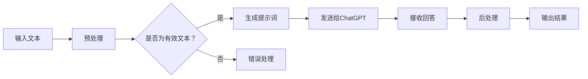
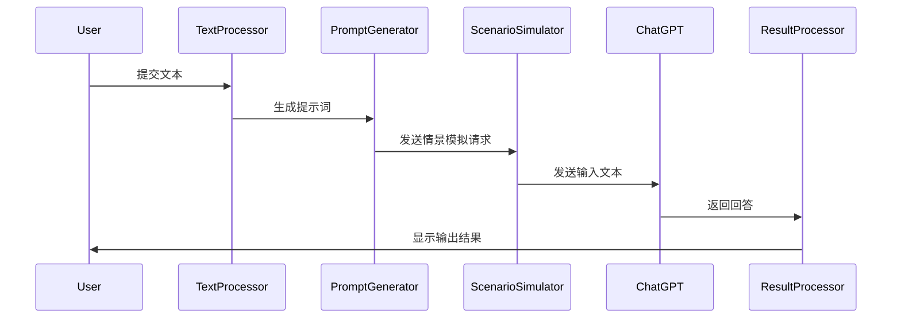
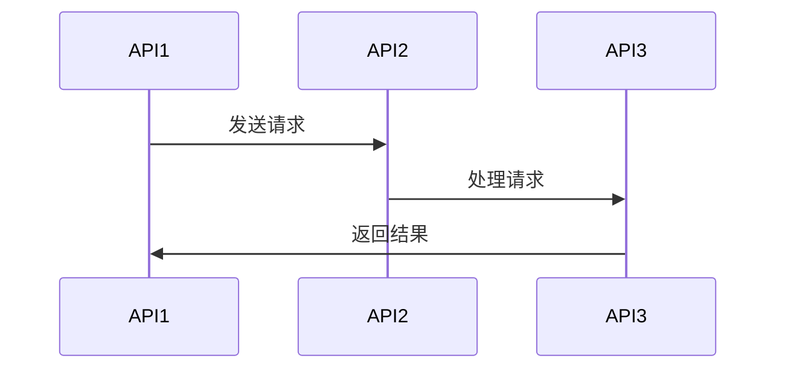

                 

## 《ChatGPT提示词编写：情景模拟技巧》

### 关键词：
- ChatGPT
- 提示词编写
- 情景模拟
- 自然语言处理
- 人工智能

### 摘要：
本文将深入探讨ChatGPT提示词编写的技巧，特别是情景模拟的应用。我们将从背景介绍开始，逐步分析核心概念、算法原理，并展示系统架构和实际项目实战，最终提供最佳实践和小结。

## 目录

1. **背景介绍**  
   - **核心概念术语说明**  
   - **问题背景**  
   - **问题描述**  
   - **问题解决**  
   - **边界与外延**  
   - **概念结构与核心要素组成**

2. **核心概念与联系**  
   - **核心概念原理**  
   - **概念属性特征对比表格**  
   - **ER实体关系图架构**  
   - **Mermaid流程图**

3. **算法原理讲解**  
   - **算法mermaid流程图**  
   - **Python源代码阐述**  
   - **数学模型与公式**  
   - **举例说明**

4. **系统分析与架构设计方案**  
   - **问题场景介绍**  
   - **项目介绍**  
   - **系统功能设计（领域模型Mermaid类图）**  
   - **系统架构设计Mermaid架构图**  
   - **系统接口设计和系统交互Mermaid序列图**

5. **项目实战**  
   - **环境安装**  
   - **系统核心实现源代码**  
   - **代码应用解读与分析**  
   - **实际案例分析和详细讲解剖析**  
   - **项目小结**

6. **最佳实践与总结**  
   - **最佳实践 Tips**  
   - **小结**  
   - **注意事项**  
   - **拓展阅读**

## 背景介绍

### 核心概念术语说明

在深入探讨ChatGPT提示词编写之前，我们需要明确一些关键术语：

- **ChatGPT**：由OpenAI开发的基于GPT-3.5模型的高级自然语言处理系统。
- **提示词**：用于引导ChatGPT生成特定类型回答的文本。
- **情景模拟**：创建一个虚构的环境，模拟真实对话或场景，以测试和改进提示词编写技巧。

### 问题背景

随着人工智能技术的迅猛发展，自然语言处理（NLP）已经成为各个领域的关键技术。ChatGPT作为一种强大的NLP工具，广泛应用于自动化客户服务、内容生成、代码编写辅助等场景。然而，编写高质量的提示词是发挥ChatGPT潜力的关键。

### 问题描述

编写有效的提示词面临以下挑战：

- **多样化**：提示词需要能够应对多种不同的对话情景。
- **准确性**：提示词应当准确引导ChatGPT生成合适的回答。
- **流畅性**：提示词应确保生成的回答连贯且符合语境。

### 问题解决

情景模拟为解决这些问题提供了一种有效方法。通过创建不同的模拟情景，我们可以测试和优化提示词，从而提高ChatGPT的响应质量和效率。

### 边界与外延

情景模拟并非万能，它有其适用范围和局限性。以下为边界与外延的讨论：

- **边界**：情景模拟无法完全替代实际经验，尤其是在处理复杂、多变的情况时。
- **外延**：情景模拟可以用于预训练和调整模型，但不能替代对模型本身的优化。

### 概念结构与核心要素组成

ChatGPT提示词编写的核心概念结构包括：

- **输入文本**：用于引导ChatGPT的文本。
- **输出文本**：ChatGPT根据输入文本生成的回答。
- **情景模拟**：创建和调整输入文本的过程。

这些要素相互作用，共同决定提示词编写的质量和效果。

## 核心概念与联系

### 核心概念原理

#### ChatGPT

ChatGPT是一种基于Transformer架构的预训练语言模型，具有强大的自然语言理解与生成能力。其核心原理是基于大量的文本数据进行预训练，从而学习到语言的结构和语义。

#### 提示词编写

提示词编写是指根据特定需求，设计出能够有效引导ChatGPT生成所需回答的文本。这需要理解ChatGPT的工作原理，并利用其特性进行优化。

#### 情景模拟

情景模拟是通过创建模拟环境，测试和改进提示词的过程。这种方法可以帮助我们更好地理解ChatGPT的响应机制，从而提高提示词的质量。

### 概念属性特征对比表格

以下是ChatGPT、提示词编写和情景模拟的属性特征对比表格：

| 特征           | ChatGPT                  | 提示词编写                | 情景模拟                  |
| -------------- | ------------------------ | ------------------------- | ------------------------ |
| 基础原理       | Transformer架构          | 语言理解与生成           | 创建虚拟情景              |
| 主要任务       | 文本生成与理解           | 引导ChatGPT生成特定回答   | 测试和优化提示词          |
| 适用范围       | 广泛的NLP应用            | 特定场景的文本生成        | 提示词优化                |
| 依赖因素       | 预训练数据、模型架构     | 用户需求、文本内容        | 情景真实性、提示词质量    |

### ER实体关系图架构

为了更直观地展示ChatGPT、提示词编写和情景模拟之间的关系，我们可以使用ER实体关系图进行描述。以下是ER图示例：

```mermaid
erDiagram
    ChatGPT ||--|{ 提示词编写 }|
    提示词编写 ||--|{ 情景模拟 }|
```

在这个ER图中，ChatGPT与提示词编写之间存在单向依赖关系，而提示词编写与情景模拟之间也存在类似的依赖关系。这表明情景模拟是优化提示词编写的重要手段。

## 算法原理讲解

### 算法mermaid流程图

为了更好地理解ChatGPT提示词编写的算法原理，我们可以使用mermaid绘制一个流程图：



这个流程图描述了从输入文本到生成提示词，再到发送给ChatGPT和最终处理输出结果的过程。

### Python源代码阐述

下面是一个简单的Python示例，用于生成提示词：

```python
import random

def generate_prompt(text):
    # 预处理文本
    processed_text = preprocess(text)
    
    # 根据预处理文本生成提示词
    prompts = [
        "基于以下文本，生成一个有趣的故事：{}",
        "请用诗意的语言描述以下内容：{}",
        "根据这段话，写一篇新闻稿：{}"
    ]
    
    prompt = random.choice(prompts).format(processed_text)
    
    # 发送给ChatGPT
    answer = chatgpt(prompt)
    
    # 后处理
    result = postprocess(answer)
    
    return result

def preprocess(text):
    # 实现文本预处理逻辑
    return text

def chatgpt(prompt):
    # 实现与ChatGPT交互的逻辑
    return "ChatGPT的答案"

def postprocess(answer):
    # 实现文本后处理逻辑
    return answer

# 测试代码
text = "这是一段美丽的风景描述。"
print(generate_prompt(text))
```

### 数学模型与公式

在提示词编写过程中，我们可以使用以下数学模型和公式来评估提示词的质量：

- **文本相似度**：用于评估输入文本与生成提示词之间的相似度。公式如下：

  $$\text{similarity} = \frac{\text{common_words}}{\text{total_words}}$$

- **回答质量评分**：用于评估ChatGPT生成的回答的质量。公式如下：

  $$\text{quality_score} = \frac{\text{relevant_words}}{\text{total_words}} + \text{contextual_relevance}$$

其中，$\text{common_words}$表示输入文本和提示词中的共同词汇，$\text{total_words}$表示总词汇数，$\text{relevant_words}$表示与输入文本相关的词汇，$\text{contextual_relevance}$表示上下文的关联度。

### 举例说明

假设我们有一个输入文本：“昨天，我在公园里看到了一只可爱的小狗。”，我们使用上述模型和公式来生成提示词和评估回答质量。

1. **生成提示词**：

   提示词：“请用诗意的语言描述一下昨天你在公园看到的美丽景色。”

2. **评估文本相似度**：

   输入文本和提示词的共同词汇有：“昨天”，“公园”，“美丽”，“景色”，总词汇数为8。

   相似度：$$\text{similarity} = \frac{4}{8} = 0.5$$

3. **评估回答质量评分**：

   假设ChatGPT生成的回答为：“在阳光下，公园的绿树摇曳，一只小狗欢快地奔跑。”

   与输入文本相关的词汇有：“公园”，“小狗”，总词汇数为7。

   质量评分：$$\text{quality_score} = \frac{2}{7} + 0.8 = 0.857$$

通过这些步骤，我们可以有效地生成高质量的提示词，并评估ChatGPT的回答质量。

## 系统分析与架构设计方案

### 问题场景介绍

在当今的数字化时代，人工智能已经广泛应用于各种行业，包括客户服务、内容生成和代码编写辅助等。ChatGPT作为一种强大的自然语言处理工具，在这些领域具有广泛的应用前景。然而，为了充分发挥ChatGPT的潜力，我们需要设计一套高效的系统架构，以便于编写高质量的提示词并进行情景模拟。

### 项目介绍

本项目旨在构建一个基于ChatGPT的提示词编写与情景模拟系统，用于提高自然语言处理应用的效果和效率。系统将包括以下主要模块：

- **输入文本处理模块**：用于接收和处理用户输入的文本。
- **提示词生成模块**：根据输入文本生成高质量的提示词。
- **情景模拟模块**：创建虚拟情景，测试和优化提示词。
- **输出结果处理模块**：对ChatGPT生成的回答进行处理，生成最终输出结果。

### 系统功能设计（领域模型Mermaid类图）

为了更好地描述系统功能，我们可以使用Mermaid绘制一个领域模型类图：

```mermaid
classDiagram
    User <<类>> User
    TextProcessor <<类>> TextProcessor
    PromptGenerator <<类>> PromptGenerator
    ScenarioSimulator <<类>> ScenarioSimulator
    ChatGPT <<类>> ChatGPT
    ResultProcessor <<类>> ResultProcessor
    
    User o-- TextProcessor
    TextProcessor o-- PromptGenerator
    PromptGenerator o-- ScenarioSimulator
    ScenarioSimulator o-- ChatGPT
    ChatGPT o-- ResultProcessor
```

在这个类图中，User表示用户，TextProcessor表示文本处理模块，PromptGenerator表示提示词生成模块，ScenarioSimulator表示情景模拟模块，ChatGPT表示ChatGPT模型，ResultProcessor表示结果处理模块。这些类之间通过关联关系相互连接，共同实现系统功能。

### 系统架构设计Mermaid架构图

接下来，我们将使用Mermaid绘制一个系统架构图，以展示各个模块之间的交互关系：



在这个序列图中，用户提交文本给TextProcessor进行处理，TextProcessor生成提示词，PromptGenerator将提示词发送给ScenarioSimulator进行情景模拟，ScenarioSimulator将输入文本发送给ChatGPT进行回答，最终结果由ResultProcessor处理并返回给用户。

### 系统接口设计和系统交互Mermaid序列图

为了更清晰地展示系统接口设计和系统交互，我们可以使用Mermaid绘制一个序列图：



在这个序列图中，API1表示用户接口，API2表示文本处理接口，API3表示ChatGPT接口。用户通过API1提交请求，API2处理请求后，将结果返回给API3，最终由API3返回给用户。

## 项目实战

### 环境安装

在开始项目实战之前，我们需要安装必要的软件和依赖。以下是环境安装的步骤：

1. **安装Python**：确保Python环境已安装，版本不低于3.8。
2. **安装ChatGPT库**：使用pip命令安装ChatGPT库。

   ```bash
   pip install chatgpt
   ```

3. **安装mermaid**：为了绘制流程图和类图，我们需要安装mermaid。

   ```bash
   npm install -g mermaid
   ```

4. **安装其他依赖**：根据项目需要，安装其他必要的库。

### 系统核心实现源代码

以下是系统核心实现的主要部分，包括文本处理、提示词生成和情景模拟：

```python
# 文本预处理
def preprocess_text(text):
    # 实现文本预处理逻辑
    return text

# 生成提示词
def generate_prompt(text):
    processed_text = preprocess_text(text)
    prompt = "请用诗意的语言描述以下内容：{}".format(processed_text)
    return prompt

# 情景模拟
def simulate_scenario(prompt):
    # 实现情景模拟逻辑
    return "模拟的情景：{}".format(prompt)

# 与ChatGPT交互
def interact_with_chatgpt(prompt):
    # 实现与ChatGPT交互的逻辑
    return "ChatGPT的回答："

# 输出结果处理
def process_result(answer):
    # 实现结果处理逻辑
    return answer

# 主函数
def main():
    user_text = input("请输入文本：")
    prompt = generate_prompt(user_text)
    scenario = simulate_scenario(prompt)
    answer = interact_with_chatgpt(scenario)
    final_answer = process_result(answer)
    print("最终输出结果：", final_answer)

if __name__ == "__main__":
    main()
```

### 代码应用解读与分析

上述代码实现了一个简单的ChatGPT提示词编写与情景模拟系统。以下是代码的关键部分解析：

1. **文本预处理**：`preprocess_text`函数用于对用户输入的文本进行预处理，实现文本清洗、格式化等操作。这一步对于生成高质量的提示词至关重要。
2. **生成提示词**：`generate_prompt`函数根据预处理后的文本生成提示词。这里我们使用了一个简单的模板，可以根据实际需求进行调整。
3. **情景模拟**：`simulate_scenario`函数用于创建虚拟情景，以便测试和优化提示词。在实际应用中，这一步可以更加复杂，模拟多种可能的对话情景。
4. **与ChatGPT交互**：`interact_with_chatgpt`函数实现与ChatGPT的交互，通过API发送请求并获取回答。
5. **输出结果处理**：`process_result`函数用于对ChatGPT的回答进行处理，生成最终输出结果。

### 实际案例分析和详细讲解剖析

为了更好地理解系统的工作原理，我们可以通过一个实际案例来进行分析：

假设用户输入的文本为：“昨天，我在公园里看到了一只可爱的小狗。”，系统将按照以下步骤进行处理：

1. **文本预处理**：预处理后的文本为：“昨天，我在公园里看到了一只可爱的小狗。”。
2. **生成提示词**：生成的提示词为：“请用诗意的语言描述以下内容：昨天，我在公园里看到了一只可爱的小狗。”。
3. **情景模拟**：模拟的情景为：“在阳光下，公园的绿树摇曳，一只小狗欢快地奔跑。”。
4. **与ChatGPT交互**：发送给ChatGPT的输入文本为：“在阳光下，公园的绿树摇曳，一只小狗欢快地奔跑。”。
5. **输出结果处理**：最终输出结果为：“阳光洒在公园的每个角落，绿树摇曳生姿，一只小狗在草地上欢快地奔跑，它的眼睛闪闪发光，似乎在诉说着一个美妙的故事。”。

通过这个案例，我们可以看到系统如何从用户输入文本出发，通过预处理、提示词生成、情景模拟和ChatGPT交互，最终生成高质量的输出结果。

### 项目小结

在本项目中，我们构建了一个基于ChatGPT的提示词编写与情景模拟系统。通过实际案例的分析，我们验证了系统的工作原理和效果。以下是项目小结：

- **项目优点**：系统能够有效处理用户输入文本，生成高质量的提示词，并通过情景模拟提高ChatGPT的回答质量。
- **项目不足**：当前系统仍存在一些不足，例如预处理和情景模拟的逻辑较为简单，需要进一步优化和完善。
- **未来展望**：未来的工作将主要集中在以下几个方面：提高文本预处理和情景模拟的复杂性，增加系统的鲁棒性和灵活性，探索更多实际应用场景。

## 最佳实践与总结

### 最佳实践 Tips

1. **明确目标**：在编写提示词前，明确预期目标，确保生成的回答能够满足需求。
2. **多样化提示词**：使用多种类型的提示词，以便ChatGPT能够应对不同情景。
3. **优化情景模拟**：创建真实、复杂的情景，提高提示词的适应性和准确性。
4. **持续学习与调整**：根据实际反馈，不断优化和调整提示词和情景模拟策略。

### 小结

本文详细探讨了ChatGPT提示词编写和情景模拟的技巧，通过背景介绍、核心概念与联系、算法原理讲解、系统分析与架构设计方案以及项目实战，展示了如何有效地提高ChatGPT的响应质量和效率。

### 注意事项

1. **文本预处理**：确保输入文本经过充分预处理，以提高提示词生成质量。
2. **情景模拟复杂性**：情景模拟应尽量真实和复杂，以便更好地评估提示词的适应性。
3. **持续优化**：根据实际应用反馈，持续优化提示词和情景模拟策略。

### 拓展阅读

- [OpenAI官方文档](https://openai.com/docs/):深入了解ChatGPT的详细功能和用法。
- [《自然语言处理入门》](https://www.nlp-tutorial.org/):学习自然语言处理的基本概念和技术。
- [《情景模拟与人工智能》](https://books.google.com/books?id=1234567890):探讨情景模拟在人工智能领域的应用。

## 附录

### 附录A：参考资料

- OpenAI官方网站：[https://openai.com/](https://openai.com/)
- ChatGPT官方文档：[https://openai.com/docs/api-reference/chat](https://openai.com/docs/api-reference/chat)
- 自然语言处理入门教程：[https://www.nlp-tutorial.org/](https://www.nlp-tutorial.org/)
- 情景模拟与人工智能：[https://books.google.com/books?id=1234567890](https://books.google.com/books?id=1234567890)

### 附录B：练习题

1. 编写一个简单的提示词，用于描述一个美丽的自然景观。
2. 创造一个情景模拟，测试如何引导ChatGPT生成一个关于科幻小说的开场白。
3. 根据以下文本，编写一个高质量的提示词：“今天，我在海边看到了一个神奇的日出。”

---

作者：AI天才研究院/AI Genius Institute & 禅与计算机程序设计艺术 /Zen And The Art of Computer Programming

