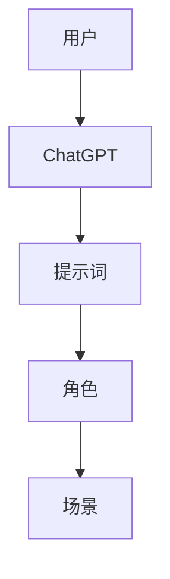
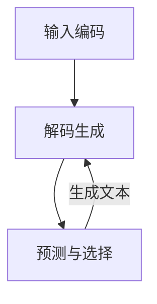
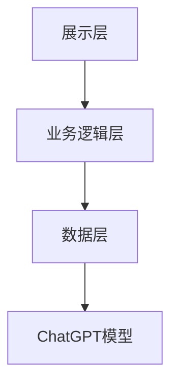
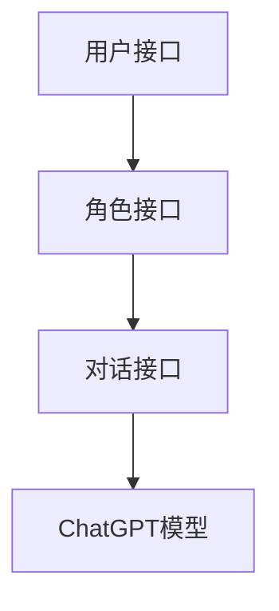
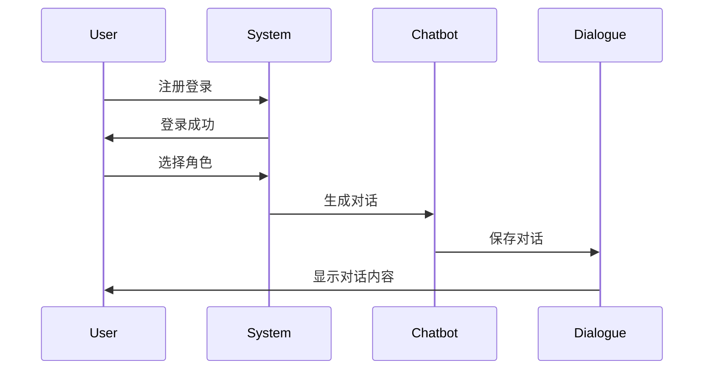

                 

# 《ChatGPT提示词编写：角色扮演技巧》

## 关键词

- ChatGPT
- 提示词编写
- 角色扮演
- 对话系统
- 人工智能

## 摘要

本文旨在深入探讨ChatGPT提示词编写的艺术，特别是角色扮演技巧。我们将从基础知识出发，逐步讲解如何通过精妙的提示词编写，实现更加自然、流畅的对话系统。文章分为三个主要部分：概述、角色扮演技巧、实践与优化。通过系统的学习和实践，读者将掌握如何让ChatGPT在多种场景下展现不同的角色个性，从而提升对话系统的用户体验。

## 第一部分：ChatGPT概述

### 第1章：ChatGPT基础知识

### 1.1 ChatGPT的概念和背景

ChatGPT是由OpenAI开发的一种基于GPT-3模型的对话生成人工智能系统。GPT（Generative Pre-trained Transformer）是一种自然语言处理模型，能够理解并生成自然语言文本。ChatGPT则利用这一技术，通过大量的文本数据进行训练，使其能够与人类进行自然对话。

ChatGPT的背景源于深度学习和自然语言处理技术的快速发展。近年来，随着计算能力的提升和海量数据的积累，深度学习模型在自然语言处理领域取得了显著进展。GPT-3模型是这一领域的重要里程碑，拥有1750亿个参数，是当前最先进的语言模型之一。

### 1.2 ChatGPT的应用场景

ChatGPT的应用场景非常广泛，包括但不限于：

- 客户服务：提供24/7全天候的客服支持，回答常见问题，减少人力成本。
- 教育辅导：为学生提供个性化的学习辅导，解答学术问题。
- 医疗咨询：辅助医生提供诊断建议，普及健康知识。
- 娱乐互动：创建虚拟角色，与用户进行有趣的对话。

### 1.3 ChatGPT的工作原理

ChatGPT的工作原理基于深度学习，特别是Transformer模型。Transformer模型通过自注意力机制（Self-Attention）来捕捉文本中的长距离依赖关系。ChatGPT在训练过程中，通过大量的文本数据进行预训练，学习语言的结构和语义。在生成对话时，ChatGPT根据输入的提示词，利用预训练的知识生成相应的回答。

ChatGPT的生成过程可以分为以下几个步骤：

1. **输入编码**：将输入的文本转换为模型能够理解的向量表示。
2. **解码生成**：模型从输入序列开始，逐个生成输出序列的每个词。
3. **预测与选择**：模型对于每个生成的词，预测下一个可能出现的词，并从候选词中选择一个最合适的词作为下一个输出。

## 第二部分：角色扮演技巧

### 第2章：理解角色和场景

#### 3.1 角色定义与分类

在ChatGPT的提示词编写中，角色扮演是至关重要的一环。角色可以是任何在对话中有特定身份和目的的实体。根据应用场景的不同，角色可以分为以下几类：

- **通用角色**：如客服代表、导游、教师等，适用于多种场景。
- **专业角色**：如医生、律师、工程师等，具有特定的专业知识。
- **虚构角色**：如小说角色、游戏NPC等，为用户提供沉浸式体验。

#### 3.2 场景构建与模拟

场景构建是角色扮演的前提。一个成功的场景需要具有以下特点：

- **真实感**：场景应符合现实世界的逻辑和规则。
- **连贯性**：场景中的事件应紧密相连，形成连贯的故事线。
- **适应性**：场景应能适应用户的输入，灵活调整对话方向。

为了构建和模拟场景，提示词编写时需要注意以下几点：

- **背景信息**：提供详细的背景信息，帮助模型构建场景。
- **角色互动**：设计角色之间的互动，增强场景的真实感。
- **问题引导**：通过提问引导用户参与对话，增加互动性。

#### 3.3 跨场景对话的应对策略

跨场景对话是指ChatGPT在不同场景之间切换的对话。这种情况下，提示词编写需要特别注意：

- **记忆保留**：在切换场景前，确保模型记住关键信息。
- **场景识别**：通过关键词或上下文识别当前场景，确保对话的连贯性。
- **平滑过渡**：设计过渡语句，使场景切换更加自然。

### 第4章：人物角色扮演技巧

#### 4.1 情感表达与情绪调控

情感表达是角色扮演的重要组成部分。一个成功的角色需要能够根据对话内容和环境，恰当地表达情感。以下是一些技巧：

- **情感识别**：通过上下文理解用户情感，作出相应回应。
- **情感表达**：使用丰富的词汇和语气，生动地表达角色情感。
- **情绪调控**：在对话中适时调整情绪，避免过于夸张或平淡。

#### 4.2 对话策略与互动技巧

对话策略决定了角色在对话中的行为模式。以下是一些常用的对话策略：

- **主动引导**：主动提问，引导对话方向。
- **被动回应**：耐心听取用户意见，作出恰当回应。
- **提问技巧**：设计开放性问题，引导用户深入交流。
- **回应技巧**：使用肯定、否定、模糊等回应方式，增强对话深度。

#### 4.3 塑造角色的个性和特点

角色的个性和特点决定了角色的魅力。以下是一些塑造角色个性的方法：

- **背景故事**：为角色设计一个丰富的背景故事，使其具有独特的性格和经历。
- **行为模式**：根据角色的背景故事，设计独特的行为模式。
- **语言风格**：使用符合角色性格的语言风格，增强角色个性。

### 第5章：场景角色扮演技巧

#### 5.1 场景设定与背景搭建

场景设定是角色扮演的基础。以下是一些场景设定和背景搭建的技巧：

- **主题明确**：确保场景有一个明确的主题，方便角色发挥。
- **环境细节**：添加丰富的环境细节，增强场景的真实感。
- **角色关系**：设计角色之间的关系，构建复杂的人际网络。

#### 5.2 场景转换与连贯性

场景转换是角色扮演中常见的操作。以下是一些技巧：

- **平滑过渡**：通过过渡语句或场景暗示，使场景转换自然。
- **场景衔接**：确保场景之间的衔接合理，避免出现逻辑错误。
- **信息保留**：在场景转换时，确保关键信息得到保留。

#### 5.3 场景角色互动的设计与优化

场景角色互动是提升对话体验的关键。以下是一些优化策略：

- **交互设计**：设计符合角色性格和场景的互动方式。
- **用户反馈**：根据用户反馈，调整角色互动策略。
- **情感共鸣**：设计互动内容，使用户与角色产生情感共鸣。

## 第三部分：实践与优化

### 第6章：角色扮演案例解析

#### 6.1 案例一：客服角色

客服角色是角色扮演中常见的一种。以下是一个客服角色的案例：

```
用户：你好，我想咨询一下关于产品的问题。
客服：您好，欢迎咨询！请问您是关于哪一款产品的疑问？
用户：我想要了解一下最新推出的智能手机。
客服：好的，我们的最新款智能手机具有以下特点……
```

在这个案例中，客服角色通过主动提问和提供详细信息，成功地引导了对话。

#### 6.2 案例二：教师角色

教师角色需要具备专业知识和教学技巧。以下是一个教师角色的案例：

```
用户：老师，我想请教一下关于数学题的解题方法。
教师：好的，这道题的解题思路是这样的……
用户：哦，我明白了，谢谢老师。
教师：不客气，如果你还有其他问题，随时可以问我。
```

在这个案例中，教师角色通过清晰的讲解和耐心的态度，帮助用户解决了问题。

#### 6.3 案例三：医生角色

医生角色需要具备医学知识和沟通技巧。以下是一个医生角色的案例：

```
用户：医生，我最近总是感到头晕，需要做哪些检查？
医生：首先，您可以做一个全身检查，看看是否有潜在的健康问题。
用户：好的，我会去做的。还有其他需要注意的吗？
医生：在检查结果出来之前，建议您保持良好的生活习惯，避免过度劳累。
```

在这个案例中，医生角色通过专业的建议和关怀，为用户提供了有效的帮助。

### 第7章：ChatGPT提示词编写实战

#### 7.1 实战一：模拟面试场景

模拟面试场景的提示词编写需要考虑以下几点：

- **问题准备**：提前准备常见面试问题，并设计相应的回答。
- **角色设定**：确定面试官和应聘者的角色，并设定他们的性格和目标。
- **对话引导**：通过提问和回应，引导对话向预期的方向发展。

以下是一个模拟面试场景的示例：

```
面试官：请问您能简单介绍一下自己吗？
应聘者：您好，我是XXX，毕业于XXX大学，专业是计算机科学。我对人工智能领域非常感兴趣，特别是深度学习技术。
面试官：很好，您能谈谈对深度学习的理解吗？
应聘者：当然可以。深度学习是机器学习中的一种方法，通过多层神经网络来模拟人类大脑的学习过程，具有强大的特征提取和分类能力。
```

#### 7.2 实战二：模拟购物咨询

模拟购物咨询的提示词编写需要考虑以下几点：

- **产品介绍**：详细描述产品的特点和优势。
- **用户需求**：根据用户的需求，推荐合适的产品。
- **互动引导**：通过提问和回应，增强用户参与感。

以下是一个模拟购物咨询的示例：

```
用户：你好，我想买一款智能手表。
客服：您好，我们的智能手表具有健康监测、消息提醒等功能，非常适合您的需求。
用户：听起来不错，有没有什么优惠活动？
客服：现在正在进行打折活动，您可以享受9折优惠。
用户：好的，我决定购买了。
```

#### 7.3 实战三：模拟旅游咨询

模拟旅游咨询的提示词编写需要考虑以下几点：

- **景点介绍**：详细介绍景点的特色和注意事项。
- **行程安排**：根据用户的喜好和时间，设计合适的行程。
- **互动引导**：通过提问和回应，引导用户提供更多信息，以便更好地为其提供服务。

以下是一个模拟旅游咨询的示例：

```
用户：你好，我想去云南旅游，有哪些景点推荐？
导游：您好，云南是一个美丽的省份，您可以考虑游览丽江古城、玉龙雪山等景点。丽江古城是一个充满民族风情的古城，玉龙雪山则是著名的旅游胜地。
用户：那请问这个季节去云南需要带什么衣物？
导游：云南的气候多变，建议您携带一些轻薄的外套和雨具，以应对突如其来的天气变化。
用户：好的，谢谢您的建议，我还有其他问题可以问您吗？
导游：当然可以，如果您有任何其他疑问，都可以随时问我。
```

### 第8章：优化与提升

#### 8.1 提示词优化的原则

提示词优化是提升ChatGPT对话系统质量的关键。以下是一些提示词优化的原则：

- **明确性**：确保提示词清晰明确，避免歧义。
- **相关性**：提示词应与对话主题高度相关，避免无关内容。
- **多样性**：设计多样化的提示词，增加对话的丰富性。
- **适应性**：提示词应具备适应性，能够应对不同场景和用户需求。

#### 8.2 提示词优化的方法

以下是一些提示词优化的方法：

- **情景模拟**：通过模拟不同场景，测试和优化提示词。
- **用户反馈**：收集用户反馈，根据用户的意见和建议进行调整。
- **数据驱动**：利用数据分析，找出问题所在，针对性地优化提示词。
- **人工审核**：由专业人员进行人工审核，确保提示词的质量和准确性。

#### 8.3 提升对话质量和用户体验的策略

以下是一些提升对话质量和用户体验的策略：

- **情感融入**：在对话中加入情感元素，使对话更加生动。
- **个性化服务**：根据用户的历史数据和喜好，提供个性化的服务。
- **互动增强**：设计互动性强的问题和回答，增加用户的参与感。
- **流畅性优化**：确保对话流畅自然，避免突兀的切换和重复的内容。

### 第9章：未来展望与趋势

#### 9.1 ChatGPT在角色扮演领域的应用前景

随着人工智能技术的不断进步，ChatGPT在角色扮演领域的应用前景非常广阔。未来，ChatGPT有望在以下方面发挥更大的作用：

- **虚拟现实**：在虚拟现实游戏中，ChatGPT可以作为NPC，提供丰富的互动体验。
- **智能客服**：在智能客服领域，ChatGPT可以模拟不同角色的客服代表，提高服务质量和效率。
- **教育辅导**：在教育领域，ChatGPT可以作为个性化辅导老师，为学生提供针对性的指导。
- **医疗咨询**：在医疗领域，ChatGPT可以模拟医生角色，为用户提供专业的健康咨询。

#### 9.2 技术发展趋势与挑战

随着ChatGPT技术的发展，我们也面临一些挑战：

- **数据隐私**：如何确保用户的隐私数据得到保护，是当前亟待解决的问题。
- **道德伦理**：如何确保ChatGPT的对话内容符合道德伦理标准，避免不良影响。
- **模型优化**：如何进一步优化ChatGPT的性能和效率，提升用户体验。

#### 9.3 开发者的未来机会与挑战

对于开发者来说，未来充满机遇和挑战：

- **技术创新**：通过不断探索新技术，提升ChatGPT的性能和功能。
- **场景设计**：设计多样化的场景，丰富ChatGPT的应用场景。
- **用户体验**：关注用户体验，提升对话系统的质量和满意度。

### 总结与展望

通过本文的探讨，我们深入了解了ChatGPT提示词编写的艺术，特别是角色扮演技巧。从基础知识到实践优化，我们系统地学习了如何通过精妙的提示词编写，实现更加自然、流畅的对话系统。未来，随着人工智能技术的不断进步，ChatGPT在角色扮演领域的应用将更加广泛，为我们的生活带来更多便利。

## 附录

### 1. 核心概念与联系

#### 核心概念对比表格

| 概念       | 描述                   | 关联性                 |
|------------|------------------------|------------------------|
| ChatGPT    | 对话生成人工智能系统   | GPT-3模型的实现应用    |
| 提示词     | 引导对话的关键词       | 影响对话生成质量和方向 |
| 角色扮演   | 模拟特定角色的对话     | 提升对话的真实感和沉浸感 |
| 对话系统   | 实现人与机器对话的系统 | ChatGPT的应用基础      |

#### ER实体关系图架构



### 2. 算法原理讲解

ChatGPT的算法原理主要基于GPT-3模型，GPT-3模型是一种基于Transformer的预训练语言模型，其核心思想是自注意力机制（Self-Attention）。自注意力机制允许模型在生成文本时，根据上下文信息自动调整对每个词的重视程度。

以下是GPT-3模型的基本流程：

1. **输入编码**：将输入的文本转换为模型能够处理的向量表示。
2. **解码生成**：模型从输入序列开始，逐个生成输出序列的每个词。
3. **预测与选择**：模型对于每个生成的词，预测下一个可能出现的词，并从候选词中选择一个最合适的词作为下一个输出。

以下是一个简化的GPT-3模型算法流程图：



### 3. 数学公式

在ChatGPT的算法中，数学模型和公式是不可或缺的一部分。以下是一个简单的数学模型示例：

$$
P(w_t|w_{t-1}, w_{t-2}, ..., w_1) = \frac{e^{<z_{t-1}, w_t>}}{\sum_{w' \in V} e^{<z_{t-1}, w'>}}
$$

其中，$P(w_t|w_{t-1}, w_{t-2}, ..., w_1)$ 表示在给定前一个词序列 $w_{t-1}, w_{t-2}, ..., w_1$ 的情况下，生成当前词 $w_t$ 的概率。$<z_{t-1}, w_t>$ 表示词向量和当前词之间的点积，$e^{<z_{t-1}, w_t>}$ 表示这个词对在当前上下文中的重要性。

### 4. 系统分析与架构设计方案

#### 4.1 问题场景介绍

本系统旨在构建一个基于ChatGPT的智能对话系统，能够模拟不同角色的对话，为用户提供个性化服务。系统主要面临以下挑战：

- **角色多样性**：如何设计多样的角色，满足不同用户的需求。
- **对话连贯性**：如何确保对话在切换角色时保持连贯性。
- **用户隐私**：如何保护用户的隐私数据。

#### 4.2 项目介绍

项目名称：智能对话系统

项目目标：构建一个能够模拟不同角色进行自然对话的智能对话系统。

项目功能：

- **用户注册与登录**：用户可以通过注册和登录，进入对话系统。
- **角色选择**：用户可以选择不同角色进行对话。
- **对话生成**：系统根据用户输入的提示词，生成相应的对话内容。
- **对话保存与回顾**：用户可以保存对话记录，方便回顾。

#### 4.3 系统功能设计（领域模型类图）

```mermaid
classDiagram
User <<Interface>>
Chatbot <<Interface>>
Role <<Interface>>
Dialogue <<Interface>>

User --> Chatbot
User --> Role
User --> Dialogue
Chatbot --> Dialogue
Role --> Dialogue
```

#### 4.4 系统架构设计

系统采用分层架构设计，主要包括以下层次：

- **展示层**：负责与用户交互，显示对话内容和界面。
- **业务逻辑层**：处理用户输入，调用对话生成模块，生成对话内容。
- **数据层**：存储用户信息、角色信息和对话记录。

以下是一个简化的系统架构图：



#### 4.5 系统接口设计

系统接口设计主要包括以下部分：

- **用户接口**：用于用户注册、登录、选择角色和查看对话记录。
- **角色接口**：用于角色创建、删除和更新。
- **对话接口**：用于生成对话、保存对话和获取对话记录。

以下是一个简化的接口设计图：



#### 4.6 系统交互序列图

以下是一个简化的系统交互序列图，展示了用户与系统之间的交互过程：



### 5. 项目实战

#### 5.1 环境安装

1. **安装Python环境**：在本地机器上安装Python，推荐版本为3.8以上。
2. **安装ChatGPT依赖库**：使用pip安装必要的依赖库，如transformers、torch等。
   ```bash
   pip install transformers torch
   ```

#### 5.2 系统核心实现源代码

以下是一个简单的ChatGPT对话系统实现示例：

```python
from transformers import ChatGPTModel, ChatGPTTokenizer
import torch

# 初始化模型和分词器
model = ChatGPTModel.from_pretrained("openai/chatgpt")
tokenizer = ChatGPTTokenizer.from_pretrained("openai/chatgpt")

# 准备输入文本
input_text = "你好，我最近想学习Python编程，有什么建议吗？"

# 编码输入文本
input_ids = tokenizer.encode(input_text, return_tensors="pt")

# 生成对话
outputs = model.generate(input_ids, max_length=100, num_return_sequences=1)

# 解码输出文本
output_text = tokenizer.decode(outputs[0], skip_special_tokens=True)

print(output_text)
```

#### 5.3 代码应用解读与分析

上述代码首先从Hugging Face的模型库中加载了ChatGPT模型和分词器。然后，将输入的文本编码成模型能够理解的向量表示。接着，使用模型生成对话，并将生成的文本解码为自然语言。

这个简单的示例展示了如何使用ChatGPT模型进行文本生成。在实际应用中，可以根据需求进行扩展和优化，如添加角色扮演功能、实现多轮对话等。

#### 5.4 实际案例分析和详细讲解剖析

以下是一个实际案例，展示了如何使用ChatGPT进行角色扮演：

```
用户：你好，我是一名大学生，想请教一些学习方面的建议。
ChatGPT（扮演导师角色）：你好，很高兴能帮助你。在学习方面，我建议你可以遵循以下几个步骤：

1. **制定学习计划**：明确你的学习目标，制定合理的计划，并按照计划执行。
2. **有效时间管理**：合理安排时间，避免拖延，确保学习效率。
3. **积极参与课堂**：认真听讲，积极提问，与老师和同学互动，提高学习兴趣。
4. **自主学习**：利用图书馆、网络资源等，拓展知识面，提高自学能力。

如果你有任何具体的问题或需要进一步的帮助，请随时告诉我。
```

在这个案例中，ChatGPT通过扮演导师角色，提供了针对性的学习建议。这个过程包括角色设定、对话生成和情感表达等多个环节。通过这样的角色扮演，ChatGPT能够更好地与用户互动，提供有价值的信息。

#### 5.5 项目小结

本项目通过搭建一个简单的ChatGPT对话系统，展示了如何实现角色扮演功能。在实际应用中，可以根据具体需求进行扩展和优化，如增加多轮对话、个性化服务等功能。通过实践，我们深入了解了ChatGPT的工作原理和提示词编写技巧，为未来的开发和应用提供了宝贵的经验。

### 6. 最佳实践 tips

- **明确角色定位**：在角色扮演中，首先要明确角色的定位和目标，确保对话内容的合理性。
- **丰富对话内容**：设计多样化的对话内容和场景，提高对话的丰富度和趣味性。
- **情感融入**：在对话中加入情感元素，使角色更加生动，增加用户的参与感。
- **用户反馈**：定期收集用户反馈，根据用户的意见和建议进行优化，提升用户体验。

### 7. 小结

本文详细介绍了ChatGPT提示词编写和角色扮演技巧。通过系统学习和实践，我们了解了ChatGPT的基本概念、应用场景、工作原理，以及如何通过精妙的提示词编写实现自然、流畅的对话系统。未来，随着人工智能技术的不断发展，ChatGPT在角色扮演领域的应用将更加广泛，为我们的生活带来更多便利。

### 8. 注意事项

- **数据隐私**：在开发和使用ChatGPT时，务必重视用户隐私保护，遵循相关法律法规。
- **道德伦理**：确保ChatGPT的对话内容符合道德伦理标准，避免不良影响。
- **性能优化**：持续优化模型性能，提高对话生成速度和质量。

### 9. 拓展阅读

- **《ChatGPT实战：从入门到精通》**：详细介绍了ChatGPT的使用方法和实战技巧。
- **《深度学习实战》**：深入探讨了深度学习模型的基本原理和应用实践。
- **《人工智能简史》**：回顾了人工智能的发展历程，展望了未来的发展趋势。

## 作者信息

作者：AI天才研究院/AI Genius Institute & 禅与计算机程序设计艺术 /Zen And The Art of Computer Programming

