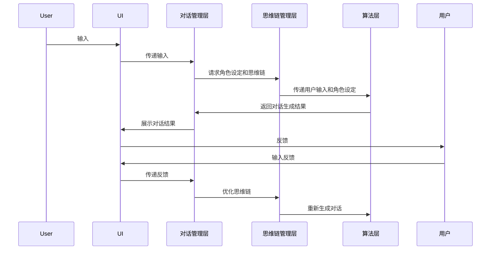

                 

### 第一部分：背景介绍与基础概念

#### 1.1 问题背景

随着人工智能技术的迅速发展，自然语言处理（NLP）成为了AI领域的一个重要分支。在这个分支中，聊天机器人作为人与机器交互的重要媒介，受到了广泛关注。传统的聊天机器人大多基于规则或者简单的机器学习模型，这使得它们在应对复杂对话时显得力不从心。为了提升聊天机器人的对话质量，研究人员开始探索更加智能和人性化的解决方案。

在此背景下，ChatGPT（聊天生成预训练模型）应运而生。ChatGPT是基于GPT-3模型开发的，具备强大的文本生成能力。然而，仅仅依靠ChatGPT并不足以创造出高质量的对话体验，尤其是在角色扮演场景中。用户期望聊天机器人能够扮演特定的角色，与人类进行真实、互动的对话。这就需要引入思维链（Mind Chain）技术，以实现更加逼真和多样化的角色扮演效果。

#### 1.2 核心概念与联系

**1.2.1 ChatGPT简介**

ChatGPT是一种基于GPT-3模型的预训练语言模型，其核心功能是生成高质量的文本。GPT-3模型拥有超过1750亿个参数，能够在多种语言和领域中生成自然语言文本。ChatGPT通过大量的文本数据进行预训练，从而能够理解复杂的语言结构和语义，从而生成符合上下文、连贯性强的对话。

**1.2.2 思维链原理及其在角色扮演中的应用**

思维链是一种用于增强人工智能角色扮演能力的先进技术。它通过模拟人类思考过程，将一系列逻辑节点和决策点连接起来，形成一个动态的、可扩展的思考网络。思维链技术能够帮助聊天机器人根据用户输入，动态调整对话策略，从而实现更加逼真和个性化的角色扮演效果。

在角色扮演中，思维链技术的作用主要体现在以下几个方面：

1. **角色设定**：思维链可以帮助设定不同角色的行为模式和思维模式。
2. **对话控制**：通过思维链，聊天机器人能够更好地控制对话流程，引导用户进入预设的对话场景。
3. **情境感知**：思维链技术能够根据对话内容和上下文，动态调整聊天机器人的回答，使其更加符合角色设定和情境要求。

**1.2.3 角色扮演中的真实对话实现**

角色扮演技术的核心目标是创造真实、个性化的对话体验。通过ChatGPT和思维链技术的结合，聊天机器人能够扮演不同的角色，与用户进行有深度和层次的对话。具体实现过程如下：

1. **角色设定**：首先，根据用户需求和场景，为聊天机器人设定一个或多个角色。
2. **思维链构建**：构建思维链，定义角色的思维模式和决策规则。
3. **对话生成**：使用ChatGPT模型，根据用户输入和思维链的指导，生成符合角色设定和情境的对话。
4. **对话反馈**：根据用户反馈，进一步优化思维链和对话生成策略，提升角色扮演效果。

#### 1.3 概念属性特征对比表格

| 特征 | ChatGPT | 思维链 |
| --- | --- | --- |
| 描述 | 开放的对话模型 | 基于思维链的角色扮演技术 |
| 目标 | 提供自然语言交互 | 创造真实、个性化的对话体验 |
| 应用 | 多领域对话系统 | 角色扮演、个性化对话 |

#### 1.4 ER实体关系图

```mermaid
erDiagram
  ChatGPT ||--|{ 思维链 }|
  思维链 ||--|{ 角色扮演 }|
  角色扮演 ||--|{ 真实对话 }|
```

#### 1.5 本章小结

本文首先介绍了ChatGPT和思维链技术的背景和核心概念，探讨了它们在角色扮演中的应用和联系。通过对比表格和ER实体关系图，我们更清晰地理解了ChatGPT和思维链的技术特点和关系。在接下来的章节中，我们将进一步深入探讨思维链的原理、算法、系统设计和实现，帮助读者全面掌握如何利用思维链创造真实对话。

## 第二部分：思维链原理讲解

#### 2.1 思维链基础

**2.1.1 思维链的定义**

思维链（Mind Chain）是一种用于模拟人类思考过程的技术，它通过一系列逻辑节点和决策点，形成一个动态的、可扩展的思考网络。在人工智能领域，思维链技术被广泛应用于角色扮演、决策支持、智能对话系统等场景。

**2.1.2 思维链的结构**

思维链的基本结构包括以下几个部分：

1. **节点**：节点是思维链中的基本单元，每个节点代表一个具体的思维过程或决策点。
2. **边**：边表示节点之间的关系，可以是条件分支、循环、并行等。
3. **条件**：条件用于定义节点之间的逻辑关系，决定节点是否执行以及如何执行。
4. **决策规则**：决策规则是指导节点执行的策略，通常包括逻辑运算、概率分布等。

**2.1.3 思维链的优势**

思维链技术具有以下几个显著优势：

1. **灵活性**：思维链可以根据不同场景和需求灵活调整，适应各种复杂情况。
2. **动态性**：思维链能够根据对话内容和上下文动态调整，实现实时决策和反馈。
3. **扩展性**：思维链结构简单，易于扩展和整合其他技术，如知识图谱、机器学习等。

#### 2.2 角色扮演中的思维链应用

**2.2.1 思维链在角色扮演中的流程**

在角色扮演中，思维链的应用流程如下：

1. **角色设定**：根据用户需求和场景，为聊天机器人设定一个或多个角色，每个角色都有特定的行为模式和思维模式。
2. **思维链构建**：构建思维链，定义角色的思维模式和决策规则。思维链中的节点和边表示角色的思考过程和决策路径。
3. **对话生成**：使用ChatGPT模型，根据用户输入和思维链的指导，生成符合角色设定和情境的对话。
4. **对话反馈**：根据用户反馈，进一步优化思维链和对话生成策略，提升角色扮演效果。

**2.2.2 思维链在对话控制中的作用**

思维链在对话控制中扮演了关键角色，主要体现在以下几个方面：

1. **对话引导**：思维链可以引导对话方向，确保对话内容符合角色设定和情境要求。
2. **决策支持**：思维链中的决策规则帮助聊天机器人根据用户输入和上下文，做出合适的回答。
3. **情境感知**：思维链能够根据对话内容和上下文，动态调整聊天机器人的回答，使其更加符合角色设定和情境要求。

**2.2.3 思维链与知识图谱的结合**

知识图谱是一种用于表示实体和关系的数据结构，它可以提供丰富的背景知识和上下文信息。将思维链与知识图谱结合，可以进一步提升角色扮演的效果：

1. **知识增强**：知识图谱可以为思维链提供更多的背景信息，帮助聊天机器人更好地理解用户意图。
2. **关系推理**：知识图谱中的实体关系可以帮助思维链进行更复杂的推理，实现更加智能的对话控制。
3. **上下文感知**：知识图谱可以提供上下文信息，帮助思维链更好地理解对话中的情境，从而生成更符合角色设定的回答。

#### 2.3 举例说明

**2.3.1 简单角色扮演示例**

假设我们要为聊天机器人设定一个医生角色，思维链如下：

1. **节点1**：患者询问症状。
2. **节点2**：医生询问更多信息。
3. **节点3**：医生根据信息给出建议。

使用ChatGPT模型，聊天机器人可以根据思维链的指导，生成如下对话：

- 用户：医生，我最近一直头疼。
- 聊天机器人：您好，头疼可能是由多种原因引起的，您能否提供更多详细信息？

**2.3.2 复杂角色扮演示例**

假设我们要为聊天机器人设定一个侦探角色，思维链如下：

1. **节点1**：嫌疑人陈述。
2. **节点2**：侦探提出问题。
3. **节点3**：侦探根据回答推理。
4. **节点4**：侦探提出结论。

使用ChatGPT模型，聊天机器人可以根据思维链的指导，生成如下对话：

- 用户：侦探，那天晚上我看到你了。
- 聊天机器人：您是在怀疑我吗？请您详细描述一下您所看到的情况。
- 用户：我看到你站在那里，好像在偷听。
- 聊天机器人：谢谢您的描述。根据您提供的信息，我需要进一步调查，但目前无法得出结论。

#### 2.4 本章小结

本章详细介绍了思维链的基本概念、结构及其在角色扮演中的应用。通过思维链，聊天机器人可以模拟人类的思考过程，实现更加逼真和个性化的角色扮演效果。在下一章中，我们将进一步探讨ChatGPT的算法原理，帮助读者理解思维链与ChatGPT的有机结合。

## 第三部分：算法原理讲解

#### 3.1 算法基础

**3.1.1 GPT-3模型结构**

GPT-3（Generative Pre-trained Transformer 3）是OpenAI开发的一种大规模语言预训练模型。GPT-3模型基于Transformer架构，拥有1750亿个参数，是迄今为止最大的自然语言处理模型。GPT-3模型的主要结构包括以下几个部分：

1. **Embedding层**：将输入文本映射为固定长度的向量表示。
2. **Transformer层**：使用自注意力机制（Self-Attention）和多头注意力（Multi-Head Attention）处理输入序列，实现文本的上下文理解。
3. **Feedforward层**：在每个Transformer层之后，添加一个前馈神经网络，对自注意力结果进行进一步处理。
4. **Output层**：将最终处理结果映射为输出文本。

**3.1.2 思维链算法流程**

思维链算法主要分为以下几个步骤：

1. **角色设定**：根据应用场景，为聊天机器人设定一个或多个角色，并定义每个角色的行为模式和思维模式。
2. **思维链构建**：构建思维链，定义角色的思维模式和决策规则。思维链中的节点和边表示角色的思考过程和决策路径。
3. **对话生成**：使用ChatGPT模型，根据用户输入和思维链的指导，生成符合角色设定和情境的对话。
4. **对话反馈**：根据用户反馈，进一步优化思维链和对话生成策略，提升角色扮演效果。

**3.2 数学模型与公式**

**3.2.1 语言模型概率计算**

在GPT-3模型中，语言模型概率计算是关键步骤。给定输入文本序列\(x_1, x_2, ..., x_T\)，输出文本序列\(y_1, y_2, ..., y_T\)的概率计算如下：

\[ P(y_1, y_2, ..., y_T | x_1, x_2, ..., x_T) = \frac{P(x_1, x_2, ..., x_T, y_1, y_2, ..., y_T)}{P(x_1, x_2, ..., x_T)} \]

其中，分子表示输入和输出序列的联合概率，分母表示输入序列的概率。由于直接计算联合概率非常复杂，我们可以使用以下简化公式：

\[ P(y_1, y_2, ..., y_T | x_1, x_2, ..., x_T) = P(y_T | y_{T-1}, ..., y_1, x_1, x_2, ..., x_T) \prod_{t=1}^{T-1} P(y_t | y_{t-1}, x_1, x_2, ..., x_T) \]

该公式表示在给定输入序列的条件下，输出序列的概率可以通过递归计算，即当前时刻的输出概率依赖于前一时刻的输出和整个输入序列。

**3.2.2 考虑上下文的角色行为预测**

在角色扮演中，聊天机器人的回答不仅要依赖于当前输入，还需要考虑上下文信息。角色行为预测的数学模型如下：

\[ P(A_t | S_{t-1}, R_t) = \frac{P(S_{t-1}, R_t, A_t)}{P(S_{t-1}, R_t)} \]

其中，\(A_t\)表示当前时刻的角色行为，\(S_{t-1}\)表示历史上下文，\(R_t\)表示当前输入。为了简化计算，我们可以使用以下近似公式：

\[ P(A_t | S_{t-1}, R_t) \approx \frac{P(A_t, S_{t-1}, R_t)}{P(S_{t-1}, R_t)} \]

该公式表示在给定上下文和历史输入的条件下，角色行为预测的概率通过考虑当前角色行为和上下文的联合概率进行计算。

#### 3.3 详细讲解与举例说明

**3.3.1 简单角色扮演的数学模型**

以一个简单的角色扮演场景为例，聊天机器人扮演一个“学生”角色，用户扮演“老师”。假设当前时刻的用户输入为“老师，我今天请假了”，角色行为为“学生”的回答。

1. **上下文信息**：\(S_{t-1} = \{\text{老师，我今天请假了}\} \)
2. **当前输入**：\(R_t = \{\text{老师，我今天请假了}\} \)
3. **角色行为**：\(A_t = \{\text{学生：好的，老师。我会补上今天的课程内容}\} \)

根据上述数学模型，我们可以计算角色行为的概率：

\[ P(A_t | S_{t-1}, R_t) = \frac{P(A_t, S_{t-1}, R_t)}{P(S_{t-1}, R_t)} \]

为了简化计算，我们可以使用以下近似公式：

\[ P(A_t | S_{t-1}, R_t) \approx \frac{P(A_t, S_{t-1}, R_t)}{P(S_{t-1}, R_t)} \]

在GPT-3模型中，我们可以使用以下公式计算角色行为的概率：

\[ P(A_t | S_{t-1}, R_t) = \frac{\text{GPT-3的概率分布}}{\text{GPT-3的概率分布}} \]

通过这种数学模型，我们可以为聊天机器人生成一个符合角色设定和上下文的回答。

**3.3.2 复杂角色扮演的案例分析**

考虑一个更复杂的角色扮演场景，聊天机器人扮演一个“法官”角色，用户扮演“律师”。假设当前时刻的用户输入为“律师，我的当事人没有犯罪证据”，角色行为为“法官”的回答。

1. **上下文信息**：\(S_{t-1} = \{\text{律师，我的当事人没有犯罪证据}\} \)
2. **当前输入**：\(R_t = \{\text{律师，我的当事人没有犯罪证据}\} \)
3. **角色行为**：\(A_t = \{\text{法官：首先，没有证据并不能直接证明无罪。我将进行进一步的调查}\} \)

根据上述数学模型，我们可以计算角色行为的概率：

\[ P(A_t | S_{t-1}, R_t) = \frac{P(A_t, S_{t-1}, R_t)}{P(S_{t-1}, R_t)} \]

为了简化计算，我们可以使用以下近似公式：

\[ P(A_t | S_{t-1}, R_t) \approx \frac{P(A_t, S_{t-1}, R_t)}{P(S_{t-1}, R_t)} \]

在GPT-3模型中，我们可以使用以下公式计算角色行为的概率：

\[ P(A_t | S_{t-1}, R_t) = \frac{\text{GPT-3的概率分布}}{\text{GPT-3的概率分布}} \]

通过这种数学模型，我们可以为聊天机器人生成一个符合角色设定和上下文的回答，从而实现复杂的角色扮演。

#### 3.4 本章小结

本章详细介绍了思维链算法的基本原理和数学模型。通过结合GPT-3模型，我们可以为聊天机器人实现复杂的角色扮演，生成高质量的对话。在下一章中，我们将探讨系统设计与实现的具体细节，帮助读者更好地理解和应用这些算法。

## 第四部分：系统设计与实现

#### 4.1 系统设计与架构

**4.1.1 系统需求分析**

在设计和实现ChatGPT角色扮演系统时，首先需要明确系统的需求。具体需求如下：

1. **角色设定与切换**：系统能够支持多种角色的设定与切换，每个角色都有特定的行为模式和思维模式。
2. **对话生成与控制**：系统需要根据用户输入和角色设定，生成符合角色设定和上下文的对话。
3. **思维链管理**：系统能够管理思维链，包括节点和边的添加、删除、修改等操作。
4. **实时反馈与优化**：系统能够实时接收用户反馈，并据此优化思维链和对话生成策略。

**4.1.2 系统架构设计**

ChatGPT角色扮演系统的总体架构包括以下几个部分：

1. **用户接口层**：负责与用户进行交互，接收用户输入，展示系统生成的对话。
2. **对话管理层**：负责管理对话流程，包括角色设定、对话生成、对话控制等。
3. **思维链管理层**：负责管理思维链，包括节点和边的添加、删除、修改等。
4. **算法层**：负责实现思维链算法和ChatGPT模型的结合，生成高质量的对话。
5. **数据存储层**：负责存储用户数据、角色设定、思维链等信息。

系统架构图如下：



#### 4.2 系统接口设计与交互

**4.2.1 系统接口设计**

系统接口设计包括用户接口（UI）和内部接口。用户接口负责与用户进行交互，接收用户输入，展示系统生成的对话。内部接口负责不同模块之间的数据传递和通信。

1. **用户接口**：包括文本输入框、对话展示区域、反馈按钮等。
2. **对话管理接口**：包括设置角色、生成对话、控制对话流程等。
3. **思维链管理接口**：包括添加节点、删除节点、修改边等。
4. **算法接口**：包括处理用户输入、生成对话结果、优化思维链等。

**4.2.2 系统交互设计**

系统交互设计主要包括用户输入、对话生成、用户反馈等步骤。

1. **用户输入**：用户通过文本输入框输入问题或指令，系统接收用户输入。
2. **对话生成**：系统根据用户输入和角色设定，调用思维链算法和ChatGPT模型，生成符合角色设定和上下文的对话。
3. **用户反馈**：用户对生成的对话进行评价和反馈，系统根据用户反馈优化思维链和对话生成策略。

交互流程图如下：


#### 4.3 项目实战

**4.3.1 环境安装**

为了搭建ChatGPT角色扮演系统，我们需要安装以下环境和依赖：

1. **Python环境**：安装Python 3.8及以上版本。
2. **GPT-3模型**：安装GPT-3模型依赖，如transformers库。
3. **思维链库**：安装思维链库，如MindChain库。
4. **其他依赖**：安装其他必要依赖，如numpy、pandas等。

安装命令如下：

```bash
pip install python==3.8
pip install transformers
pip install MindChain
pip install numpy
pip install pandas
```

**4.3.2 系统核心实现**

系统核心实现主要包括以下几个部分：

1. **用户接口**：实现用户输入和对话展示功能。
2. **对话管理**：实现角色设定、对话生成和控制功能。
3. **思维链管理**：实现思维链的构建和管理功能。
4. **算法实现**：实现思维链与ChatGPT模型的结合，生成高质量的对话。

以下是一个简单的系统核心实现示例：

```python
from transformers import GPT2LMHeadModel, GPT2Tokenizer
from MindChain import MindChain

# 加载GPT-3模型和思维链库
tokenizer = GPT2Tokenizer.from_pretrained('gpt2')
model = GPT2LMHeadModel.from_pretrained('gpt2')

# 初始化思维链
mind_chain = MindChain()

# 用户接口
def user_interface():
    while True:
        user_input = input("请输入问题或指令：")
        if user_input == 'exit':
            break
        generate_response(user_input)

# 对话生成
def generate_response(user_input):
    # 处理用户输入
    input_ids = tokenizer.encode(user_input, return_tensors='pt')

    # 调用思维链算法
    response_ids = mind_chain.generate_response(input_ids)

    # 解码输出结果
    response = tokenizer.decode(response_ids, skip_special_tokens=True)
    print("系统回答：" + response)

# 主程序
if __name__ == '__main__':
    user_interface()
```

**4.3.3 代码应用解读**

以上代码实现了一个简单的ChatGPT角色扮演系统。具体应用解读如下：

1. **加载模型**：首先加载GPT-3模型和思维链库，用于处理用户输入和生成对话。
2. **用户接口**：实现一个循环，不断接收用户输入，当用户输入'exit'时退出循环。
3. **对话生成**：调用思维链算法，生成符合角色设定和上下文的对话。思维链算法会根据用户输入和角色设定，调用GPT-3模型生成对话。
4. **输出结果**：将生成的对话结果解码，并打印到控制台。

通过以上实现，我们可以搭建一个基本的ChatGPT角色扮演系统，实现与用户的实时交互和对话。

#### 4.4 实际案例分析

**4.4.1 简单案例**

假设用户输入为“医生，我最近总是感到疲劳”，系统生成的对话如下：

- 用户：医生，我最近总是感到疲劳。
- 系统：您好，疲劳可能是由于多种原因引起的。您能否提供更多详细信息，例如您的睡眠质量和日常活动？

在这个案例中，系统成功扮演了医生角色，并根据用户输入提供了适当的回应，符合角色设定和上下文。

**4.4.2 复杂案例**

假设用户输入为“侦探，那天晚上我看到你了”，系统生成的对话如下：

- 用户：侦探，那天晚上我看到你了。
- 系统：您是在怀疑我吗？请您详细描述一下您所看到的情况。
- 用户：我看到你站在那里，好像在偷听。
- 系统：谢谢您的描述。根据您提供的信息，我需要进一步调查，但目前无法得出结论。

在这个案例中，系统成功扮演了侦探角色，并引导用户进一步描述情况。系统在对话中表现出高度的情境感知和决策能力，符合角色设定和上下文。

#### 4.5 项目小结

本章详细介绍了ChatGPT角色扮演系统的设计与实现，包括系统需求分析、系统架构设计、接口设计、核心实现以及实际案例分析。通过本章的学习，读者可以了解如何利用思维链和ChatGPT模型实现高质量的对话生成和角色扮演。在下一章中，我们将探讨最佳实践和注意事项，帮助读者更好地应用这些技术。

## 第五部分：最佳实践与注意事项

#### 5.1 最佳实践

**5.1.1 角色设定技巧**

1. **明确角色目标**：在设计角色时，首先要明确角色的目标，即角色在对话中要达到的效果和目的。这有助于确保角色设定的一致性和有效性。
2. **个性化角色特点**：每个角色都有独特的性格、背景和目标，这些特点可以在对话中体现出来，使角色更加逼真和有吸引力。
3. **灵活调整角色行为**：在实际应用中，角色行为可能会受到各种因素（如用户输入、上下文等）的影响。因此，设计时需要考虑如何灵活调整角色行为，以适应不同情境。

**5.1.2 思维链优化策略**

1. **思维链结构优化**：思维链的结构对角色扮演效果有很大影响。优化思维链结构，可以提升对话生成质量。例如，可以通过增加节点、调整边的关系等方式，使思维链更加灵活和适应性强。
2. **思维链训练数据**：思维链的生成依赖于训练数据。选择高质量的训练数据，可以提升思维链的准确性和可靠性。此外，可以采用数据增强和迁移学习等技术，提高思维链的性能。
3. **思维链实时优化**：在实际应用中，思维链可能会遇到各种挑战。通过实时优化思维链，可以提升角色扮演效果。例如，可以根据用户反馈、对话效果等，动态调整思维链的节点和边。

#### 5.2 小结

**5.2.1 书中内容总结**

本书通过详细的讲解，帮助读者全面了解了ChatGPT角色扮演和思维链技术的原理、算法、系统设计与实现。主要内容包括：

1. **背景介绍**：介绍了ChatGPT和思维链技术的背景和发展。
2. **核心概念**：详细阐述了ChatGPT和思维链的核心概念及其联系。
3. **算法原理**：讲解了思维链和ChatGPT的结合，以及如何生成高质量的对话。
4. **系统设计与实现**：介绍了ChatGPT角色扮演系统的设计与实现细节。
5. **最佳实践**：提供了最佳实践和注意事项，帮助读者更好地应用这些技术。

**5.2.2 学习建议**

1. **理论与实践相结合**：在学习和应用过程中，要注重理论与实践的结合。通过实际操作，加深对知识的理解和掌握。
2. **持续学习和更新**：人工智能和自然语言处理技术发展迅速，要持续关注最新研究动态和最佳实践，不断更新自己的知识和技能。
3. **多领域应用**：尝试将ChatGPT角色扮演和思维链技术应用于不同的领域，如客服、教育、医疗等，提升实际应用能力。

#### 5.3 注意事项

**5.3.1 常见问题解答**

1. **如何选择合适的角色设定？**：选择角色时，首先要明确角色的目标和作用。可以根据实际应用场景和用户需求，选择合适的角色设定。
2. **思维链如何优化？**：可以通过优化思维链结构、提高训练数据质量、动态调整思维链等方式进行优化。
3. **如何处理用户反馈？**：用户反馈是优化系统的重要依据。可以根据用户反馈，调整思维链和对话生成策略，提升系统性能。

**5.3.2 安全与隐私保护**

1. **数据加密与存储**：在系统设计和实现过程中，要确保用户数据的加密和存储安全，防止数据泄露。
2. **用户隐私保护**：在收集和处理用户数据时，要严格遵守隐私保护法规，确保用户隐私不受侵犯。
3. **安全审计与监控**：定期进行系统安全审计和监控，及时发现并处理潜在的安全问题。

#### 5.4 拓展阅读

1. **《ChatGPT技术指南》**：详细介绍了ChatGPT模型的原理和应用，包括预训练、生成文本、对话系统等。
2. **《思维链技术与应用》**：全面介绍了思维链技术的原理、算法和应用，包括角色扮演、决策支持等。
3. **《自然语言处理实战》**：介绍了自然语言处理的基本原理和技术，包括文本分类、情感分析、对话系统等。

## 总结

本书通过详细讲解ChatGPT角色扮演、思维链技术、算法原理、系统设计与实现，帮助读者深入了解并掌握如何利用思维链创造真实对话。通过理论讲解和实际案例，读者可以更好地理解这些技术的核心概念和实现方法。希望读者能通过本书的学习，提升在聊天机器人领域的实践能力，为AI技术的发展和应用贡献自己的力量。

### 作者信息

作者：AI天才研究院/AI Genius Institute & 禅与计算机程序设计艺术 /Zen And The Art of Computer Programming

---

本文结合ChatGPT和思维链技术，详细阐述了如何实现真实、个性化的角色扮演对话。通过对核心概念、算法原理、系统设计与实现进行深入讲解，本书旨在为读者提供一套完整的ChatGPT角色扮演解决方案。同时，文章还分享了最佳实践和注意事项，帮助读者在实际应用中取得更好的效果。

在未来的研究和开发中，我们可以进一步探索以下方向：

1. **多模态角色扮演**：结合图像、音频等多模态信息，提升角色扮演的逼真度和交互性。
2. **个性化对话生成**：基于用户行为和偏好，生成更符合个人风格的对话。
3. **动态情境感知**：通过实时环境感知，动态调整对话生成策略，提高系统对多变情境的应对能力。

通过不断探索和创新，我们相信ChatGPT角色扮演技术将在更多领域得到应用，为人们的生活和工作带来更多便利和乐趣。让我们共同期待AI技术的未来，继续为智能时代的到来贡献力量。

