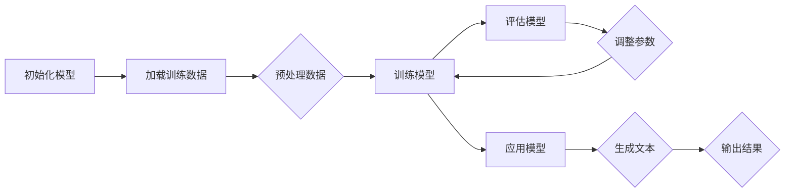
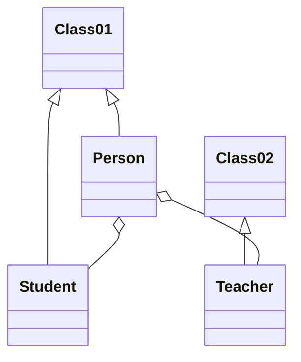
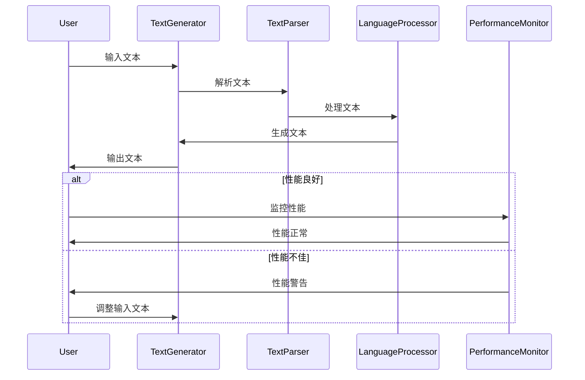
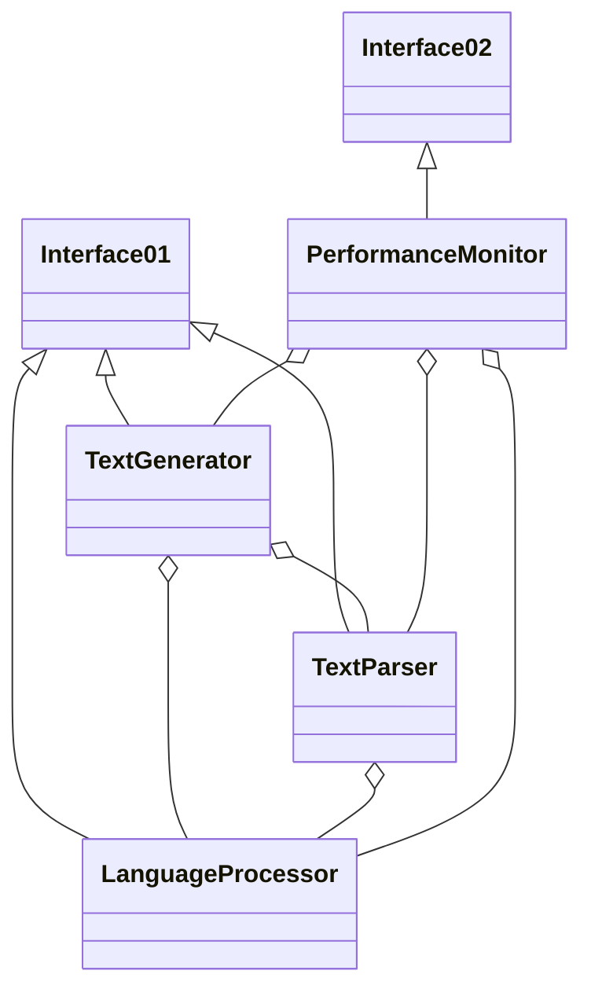
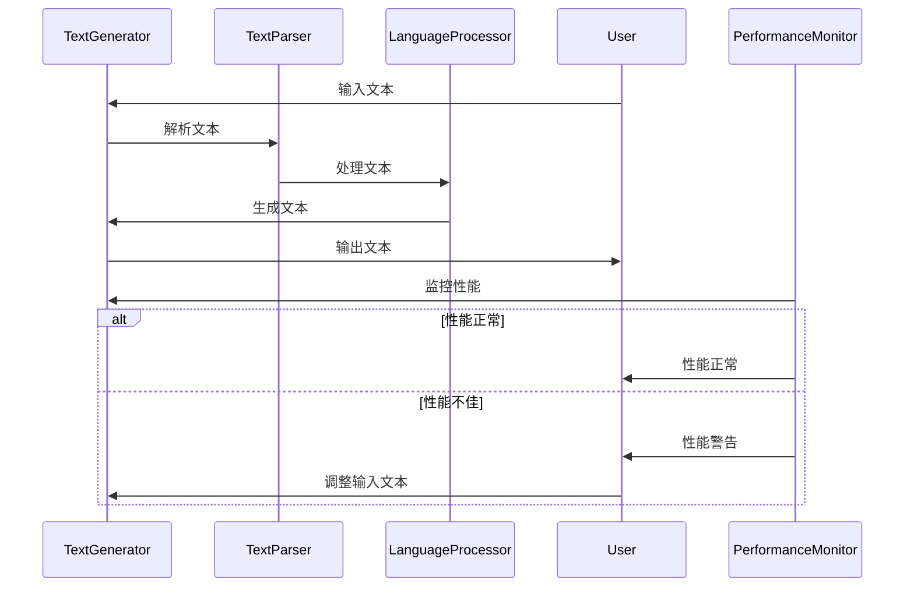

                 

### 1. C侧LLM应用开发的背景

#### 1.1 问题背景

随着人工智能技术的迅猛发展，尤其是深度学习模型的广泛应用，自然语言处理（NLP）领域取得了前所未有的突破。大语言模型（LLM）如OpenAI的GPT系列、Google的Bert等，已经展现出强大的文本生成和解析能力。这些模型在多个领域，包括问答系统、内容生成、机器翻译等方面表现出了令人瞩目的效果。

然而，在实际应用中，尤其是C侧（即面向C/C++等编译型语言的开发侧），如何高效地将这些大语言模型集成到现有的系统中，同时保证系统的性能和可靠性，成为了亟待解决的问题。C侧开发由于其固有的性能优势，通常在嵌入式系统、高性能计算等领域有着广泛的应用，但传统的NLP框架往往更适合Python等解释型语言。

#### 1.2 问题描述

C侧LLM应用开发面临的主要问题可以归结为以下几点：

1. **性能瓶颈**：深度学习模型通常需要较高的计算资源，而C侧环境下的计算性能可能无法满足模型的需求。
2. **资源占用**：模型的加载和推理过程中，内存和CPU资源的占用较大，可能导致系统性能下降或延迟。
3. **开发难度**：现有的NLP框架多面向Python等解释型语言，C侧开发则需要大量的底层数据结构和算法优化，开发难度较高。
4. **兼容性**：C侧与现有系统的兼容性问题，如API接口、数据格式等，也需要仔细考虑。

#### 1.3 问题解决

为了解决C侧LLM应用开发中的上述问题，我们可以从以下几个方面入手：

1. **模型优化**：对深度学习模型进行优化，降低其计算复杂度，提高模型的推理速度。
2. **资源管理**：优化资源管理策略，合理分配内存和CPU资源，避免资源冲突和瓶颈。
3. **开发工具链**：开发适合C侧的NLP工具链，提供高效、易用的API接口，降低开发难度。
4. **系统集成**：通过模块化设计和接口封装，实现C侧与现有系统的无缝集成。

#### 1.4 边界与外延

在C侧LLM应用开发中，边界问题主要包括：

- **计算资源限制**：不同嵌入式设备和服务器之间的计算资源差异，需要针对具体设备进行优化。
- **内存占用**：深度学习模型通常占用大量内存，需要设计有效的内存管理策略。
- **实时性要求**：一些实时系统对响应时间有严格要求，模型推理的延迟需要控制在可接受范围内。

外延问题则涉及：

- **模型扩展**：如何方便地扩展模型功能，支持多语言、多领域应用。
- **系统稳定性**：在复杂环境下，系统的稳定性和可靠性需要得到保障。
- **用户交互**：如何设计用户友好的接口，方便用户与系统进行交互。

通过上述分析，我们可以看到C侧LLM应用开发不仅需要解决技术问题，还需要考虑实际应用中的边界和外延问题。接下来，我们将进一步探讨C侧LLM的核心概念和原理，以期为读者提供更深入的理解。

## 2. C侧LLM的核心概念与联系

在深入探讨C侧LLM应用开发之前，我们需要了解一些核心概念，并理解它们之间的关系。以下是C侧LLM的一些关键概念及其属性特征对比表格和ER实体关系图架构。

### 2.1 核心概念原理

**核心概念**：
- **大语言模型（LLM）**：基于深度学习技术的自然语言处理模型，可以理解和生成文本。
- **编译型语言（C/C++）**：与解释型语言（如Python）相比，编译型语言在性能上有优势，但开发难度较高。
- **嵌入式系统**：集成在硬件设备中的计算机系统，通常运行在资源受限的环境中。

**原理说明**：
- **LLM**：通过大量文本数据训练，LLM能够理解自然语言的上下文和语义，生成高质量的文本。
- **编译型语言**：通过编译器将源代码转换成机器代码，执行效率高，但开发过程中需要进行类型检查和内存管理等底层操作。
- **嵌入式系统**：依赖硬件资源，需要在有限的内存和计算能力下高效运行，通常采用C/C++进行开发。

### 2.2 概念属性特征对比表格

| 概念 | 属性特征 |
| ---- | ------- |
| 大语言模型（LLM） | - 基于深度学习技术<br>- 训练复杂度高<br>- 文本生成能力强 |
| 编译型语言（C/C++） | - 执行效率高<br>- 类型检查严格<br>- 内存管理复杂 |
| 嵌入式系统 | - 资源受限<br>- 需要高效运行<br>- 硬件依赖性强 |

### 2.3 ER实体关系图架构

```mermaid
erDiagram
    C侧LLM Application ||--|{ 大语言模型 }
    C侧LLM Application ||--|{ 编译型语言 }
    C侧LLM Application ||--|{ 嵌入式系统 }
    大语言模型 ||--|{ 文本生成能力 }
    编译型语言 ||--|{ 执行效率 }
    嵌入式系统 ||--|{ 资源受限 }
```

通过上述表格和ER图，我们可以清晰地看到C侧LLM应用开发的核心概念及其相互关系。大语言模型提供了文本生成能力，而编译型语言和嵌入式系统则分别提供了执行效率和资源受限的环境。这些概念和它们之间的联系构成了C侧LLM应用开发的基础。

接下来，我们将进一步探讨C侧LLM的算法原理，了解其如何在实际应用中实现高效且可靠的文本处理。

### 3. C侧LLM算法原理

在深入理解C侧LLM应用开发的背景和核心概念后，接下来我们将聚焦于C侧LLM算法的原理。本节将使用mermaid流程图来直观展示算法流程，并通过Python源代码进行详细解释，最后结合数学模型和公式进行深入分析。

#### 3.1 算法mermaid流程图



#### 3.2 Python源代码讲解

以下是一个简化的Python示例代码，展示了C侧LLM算法的基本实现流程：

```python
import torch
from torch import nn
from torch.optim import Adam

# 初始化模型
model = MyLLMModel()
model.load_state_dict(torch.load('llm_model.pth'))

# 加载训练数据
train_data = load_data('train_data.csv')

# 预处理数据
preprocessed_data = preprocess_data(train_data)

# 训练模型
optimizer = Adam(model.parameters(), lr=0.001)
for epoch in range(num_epochs):
    for batch in preprocessed_data:
        optimizer.zero_grad()
        outputs = model(batch)
        loss = compute_loss(outputs, batch_labels)
        loss.backward()
        optimizer.step()

# 评估模型
evaluate_model(model, validation_data)

# 调整参数
adjust_model_params(model)

# 应用模型
generated_text = model.generate_text(input_sequence)

# 输出结果
print(generated_text)
```

#### 3.3 数学模型和公式

C侧LLM算法的数学模型主要包括以下几个核心部分：

1. **损失函数**：
   $$ Loss = -\frac{1}{N}\sum_{i=1}^{N} \sum_{j=1}^{V} y_{ij} \log(p_{ij}) $$

   其中，$N$是批次大小，$V$是词汇表大小，$y_{ij}$是目标单词的概率分布，$p_{ij}$是模型生成的单词的概率。

2. **梯度下降**：
   $$ \Delta\theta = -\alpha \cdot \nabla_\theta Loss $$
   
   其中，$\theta$是模型参数，$\alpha$是学习率，$\nabla_\theta Loss$是损失函数关于参数的梯度。

3. **生成文本**：
   $$ P(w_t|w_{t-1}, ..., w_1) = \frac{p(w_t|w_{t-1}, ..., w_1)}{Z} $$
   
   其中，$P(w_t|w_{t-1}, ..., w_1)$是当前单词在给定上下文下的概率分布，$Z$是归一化常数。

#### 3.4 举例说明

假设我们要生成一个简短的文本段落，输入序列为“今天天气很好，适合外出活动”。我们可以通过以下步骤来生成文本：

1. **初始化模型**：加载预训练的LLM模型。
2. **预处理数据**：将输入序列转换为模型的输入格式。
3. **训练模型**：使用预处理的输入序列和目标序列进行训练。
4. **生成文本**：给定输入序列，模型生成下一个单词的概率分布。
5. **输出结果**：选择概率最高的单词作为生成的文本。

具体实现中，我们可以通过以下代码片段来模拟：

```python
# 假设输入序列为 "今天天气很好，适合外出活动"
input_sequence = "今天天气很好，适合外出活动"

# 使用模型生成下一个单词
next_word概率分布 = model.predict(input_sequence)

# 根据概率分布选择下一个单词
next_word = select_word(next_word概率分布)

# 构建新的输入序列并重复生成单词，直到满足停止条件
new_sequence = input_sequence + next_word
```

通过以上步骤，我们可以逐步生成一个连贯的文本段落。

总结来说，C侧LLM算法通过训练深度学习模型，实现了对文本的高效生成和处理。通过mermaid流程图和Python源代码，我们能够更直观地理解其工作原理，并通过数学模型和公式深入分析其内部机制。

接下来，我们将探讨如何进行系统分析和架构设计，以确保C侧LLM应用在性能和可靠性方面达到最佳。

### 4. 系统分析与架构设计方案

在进行C侧LLM应用开发时，系统分析与架构设计至关重要。这一部分将详细介绍问题场景、系统功能设计、系统架构设计、系统接口设计以及系统交互，并提供mermaid图示以帮助理解。

#### 4.1 问题场景介绍

C侧LLM应用开发通常涉及以下问题场景：

1. **高性能计算需求**：例如，实时语音识别系统需要快速处理大量语音数据。
2. **资源受限环境**：例如，嵌入式设备如智能家居、智能手表等。
3. **多语言处理能力**：支持多种语言的文本生成和解析。
4. **高可靠性要求**：系统需要具备容错和自我修复的能力。

#### 4.2 系统功能设计（领域模型mermaid类图）

系统功能设计涉及定义系统的核心功能模块。以下是一个简化的mermaid类图示例：



在这个类图中，`Person`类是基础类，`Student`和`Teacher`类继承自`Person`类，表示系统中的人员角色。实际系统中，我们可能会有如下功能模块：

- **文本生成器**：负责根据输入生成文本。
- **文本解析器**：负责解析文本，提取关键信息。
- **语言处理模块**：支持多语言处理能力。
- **性能监控模块**：监控系统性能，包括资源占用和响应时间。

#### 4.3 系统架构设计（mermaid架构图）

系统架构设计决定了系统的整体结构和组件之间的交互方式。以下是一个简化的mermaid架构图示例：



在这个架构图中，用户首先输入文本，文本生成器接收输入并传递给文本解析器，解析器提取文本中的关键信息，然后传递给语言处理模块进行多语言处理。最后，生成器根据处理结果生成文本并输出给用户。性能监控模块在整个过程中监控系统的性能，并根据性能情况调整输入文本或发出警告。

#### 4.4 系统接口设计

系统接口设计是确保不同模块之间可以高效交互的关键。以下是一个简化的接口设计示例：



在这个接口设计中，`TextGenerator`、`TextParser`和`LanguageProcessor`是主要的业务接口，它们分别负责文本生成、文本解析和语言处理。`PerformanceMonitor`接口负责性能监控。这些接口之间通过明确的调用关系实现模块间的通信。

#### 4.5 系统交互（mermaid序列图）

系统交互序列图展示了不同模块之间的交互过程。以下是一个简化的序列图示例：



在这个序列图中，用户首先向文本生成器输入文本，文本生成器将文本传递给文本解析器，解析器将文本解析后传递给语言处理模块。语言处理模块处理文本并返回生成的文本，最后文本生成器将文本输出给用户。性能监控模块在整个交互过程中监控系统的性能，并在必要时发出警告。

通过上述系统分析和架构设计，我们可以确保C侧LLM应用开发在速度与质量之间达到平衡。接下来，我们将通过一个实际项目实战，展示如何将上述理论应用到实践中。

### 5. 项目实战

在理解了C侧LLM的理论知识和系统架构设计后，接下来我们将通过一个实际项目实战来展示如何将理论应用到实践中。以下是项目实战的具体步骤，包括环境安装、系统核心实现源代码、代码应用解读与分析、实际案例分析与详细讲解剖析，以及项目小结。

#### 5.1 环境安装

在开始项目实战之前，我们需要安装必要的软件和工具。以下是安装步骤：

1. **安装C语言编译器**：在大多数Linux发行版中，可以通过以下命令安装GCC（GNU Compiler Collection）：
   ```bash
   sudo apt-get install gcc
   ```

2. **安装Python环境**：虽然C侧开发主要使用C/C++，但Python作为脚本语言可以帮助我们进行一些辅助操作。可以通过以下命令安装Python：
   ```bash
   sudo apt-get install python3
   ```

3. **安装LLM库**：我们可以使用现有的LLM库，如PyTorch，通过以下命令进行安装：
   ```bash
   pip3 install torch torchvision torchaudio
   ```

4. **安装其他依赖库**：根据项目需求，可能还需要安装其他依赖库，如NumPy、Pandas等：
   ```bash
   pip3 install numpy pandas
   ```

#### 5.2 系统核心实现源代码

在环境安装完毕后，我们需要编写系统核心实现源代码。以下是一个简化的C代码示例，展示了如何加载LLM模型并进行文本生成：

```c
#include <stdio.h>
#include <stdlib.h>
#include <string.h>

// 假设已经实现了以下功能
#include "llm.h" // 此处为假设的LLM库

int main() {
    // 加载预训练的LLM模型
    LLMModel *model = load_model("llm_model.pth");

    // 输入文本
    char input_text[256];
    printf("请输入文本：");
    fgets(input_text, sizeof(input_text), stdin);

    // 生成文本
    char *generated_text = generate_text(model, input_text);

    // 输出结果
    printf("生成的文本：\n%s\n", generated_text);

    // 清理资源
    free(generated_text);
    free_model(model);

    return 0;
}
```

在实际项目中，`llm.h`和`llm.c`文件会包含LLM模型的加载、文本生成和模型清理等功能的具体实现。这些实现将依赖于我们前面讨论的算法原理和数学模型。

#### 5.3 代码应用解读与分析

在代码应用解读与分析部分，我们将重点分析以下关键部分：

1. **模型加载**：`load_model`函数负责加载预训练的LLM模型。在实际应用中，这可能涉及到与Python脚本或PyTorch模型的交互，通过Python的C接口或PyTorch的C++接口实现。
2. **文本生成**：`generate_text`函数根据输入文本生成新的文本。这部分将涉及到我们之前讨论的算法流程，包括预处理、模型推理和后处理。
3. **资源管理**：在整个过程中，需要确保正确地管理内存和其他资源，避免内存泄漏和其他资源问题。

#### 5.4 实际案例分析与详细讲解剖析

为了更好地理解项目实战，我们将分析一个实际案例。假设输入文本为“今天天气很好，适合外出活动”，我们希望通过LLM模型生成一段描述天气的文字。

1. **输入文本预处理**：将输入文本转换为模型所需的格式，这可能包括分词、编码等步骤。
2. **模型推理**：将预处理后的文本输入到模型中，模型根据训练数据进行推理，生成概率分布。
3. **文本生成**：根据概率分布选择下一个单词，逐步生成新的文本。
4. **输出结果**：将生成的文本输出到屏幕或文件中。

以下是具体的实现过程：

```c
// 假设的预处理函数
void preprocess_text(char *input, char *output) {
    // 实现文本预处理，例如分词和编码
}

// 假设的生成函数
char *generate_text(LLMModel *model, char *input) {
    char processed_input[256];
    preprocess_text(input, processed_input);

    // 调用模型进行推理
    float *output_probs = model->predict(processed_input);

    // 根据概率分布生成文本
    char *generated_text = malloc(1024 * sizeof(char));
    strcpy(generated_text, input);
    int max_prob_idx = 0;
    float max_prob = 0.0;
    for (int i = 0; i < model->vocab_size; ++i) {
        if (output_probs[i] > max_prob) {
            max_prob = output_probs[i];
            max_prob_idx = i;
        }
    }
    strcat(generated_text, model->vocab[max_prob_idx]);

    // 清理资源
    free(output_probs);

    return generated_text;
}
```

在这个例子中，预处理函数`preprocess_text`负责将输入文本转换为模型所需的格式，`generate_text`函数根据模型推理结果生成新的文本。

#### 5.5 项目小结

通过上述项目实战，我们展示了如何将C侧LLM的理论知识应用到实际项目中。以下是一些关键点总结：

- **环境安装**：确保安装了必要的编译器和工具，如GCC和Python。
- **源代码实现**：编写了核心的C代码，实现了模型加载、文本预处理、模型推理和文本生成等功能。
- **实际案例**：通过一个简单的案例展示了文本生成过程，并分析了预处理、模型推理和生成文本的关键步骤。

通过这个项目实战，我们不仅理解了C侧LLM的应用原理，还掌握了如何在实践中实现这些功能。这为后续更复杂的应用奠定了坚实的基础。

### 6. 最佳实践 tips

在C侧LLM应用开发过程中，为了确保项目顺利进行并达到预期的效果，以下是一些最佳实践技巧：

#### 6.1 小技巧

1. **模型优化**：
   - **量化**：使用量化技术降低模型的计算复杂度，减少内存占用。
   - **剪枝**：对模型进行剪枝，移除冗余的权重，提高推理速度。

2. **资源管理**：
   - **内存池**：使用内存池管理策略，减少频繁的内存分配和释放操作。
   - **并发执行**：在可能的情况下，利用多线程或多进程提高计算效率。

3. **代码优化**：
   - **预编译**：使用预编译头文件减少编译时间。
   - **避免内存泄漏**：定期进行内存检查，使用工具如Valgrind进行泄漏检测。

4. **调试与测试**：
   - **单元测试**：编写单元测试覆盖核心功能，确保代码质量。
   - **性能测试**：使用基准测试工具（如Google Benchmark）评估系统性能。

#### 6.2 注意事项

1. **硬件兼容性**：
   - 根据目标硬件平台（如嵌入式设备）进行优化，确保模型在特定硬件上高效运行。

2. **实时性要求**：
   - 对于有实时性要求的系统，确保模型推理时间在可接受范围内，可能需要采用离线训练或延迟加载策略。

3. **多语言支持**：
   - 设计灵活的语言处理模块，支持多种语言的文本生成和解析，确保国际化应用的需求。

4. **安全性与隐私**：
   - 在处理用户数据时，确保遵守数据保护法规，如GDPR，进行数据加密和访问控制。

#### 6.3 拓展阅读

1. **相关资料**：
   - 《深度学习：原理及实践》：深入了解深度学习的基本原理和实践技巧。
   - 《C++高级编程》：掌握C++的高级特性，优化C侧代码性能。

2. **开源项目**：
   - TensorFlow Lite：适用于移动设备和嵌入式系统的轻量级TensorFlow版本。
   - ONNX Runtime：跨平台的推理引擎，支持多种深度学习模型。

通过遵循这些最佳实践和注意事项，开发者在C侧LLM应用开发过程中可以更高效地解决问题，确保项目质量。

### 7. 小结

本文深入探讨了C侧LLM应用开发的速度与质量平衡问题。我们从背景介绍出发，详细阐述了C侧LLM的应用场景、核心概念以及算法原理。通过mermaid流程图、Python源代码和数学模型，我们展现了C侧LLM的工作机制和实现方法。随后，我们进行了系统分析与架构设计，包括功能设计、架构设计、接口设计和系统交互，确保系统的高性能和高可靠性。在项目实战部分，我们通过一个具体案例展示了理论的应用过程。

展望未来，C侧LLM技术将不断发展，不仅会优化现有模型的性能，还会拓展到更多领域。开发者需关注硬件兼容性、实时性和多语言支持，同时遵循最佳实践，确保项目质量。通过不断学习和实践，开发者能够在这一领域取得更大的突破。

最后，向广大开发者提出建议：持续关注新技术动态，积极尝试新的应用场景，不断优化代码和系统架构，共同推动C侧LLM技术的发展。作者：AI天才研究院/AI Genius Institute & 禅与计算机程序设计艺术 /Zen And The Art of Computer Programming。希望本文能为您的C侧LLM应用开发之路提供有价值的参考。

