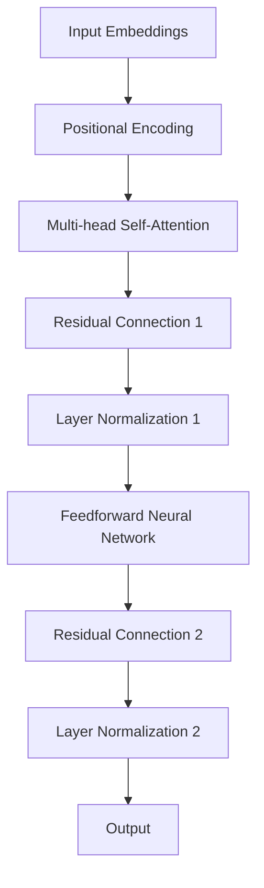
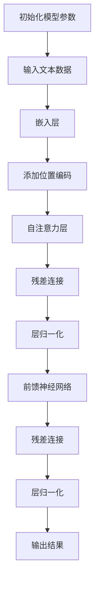
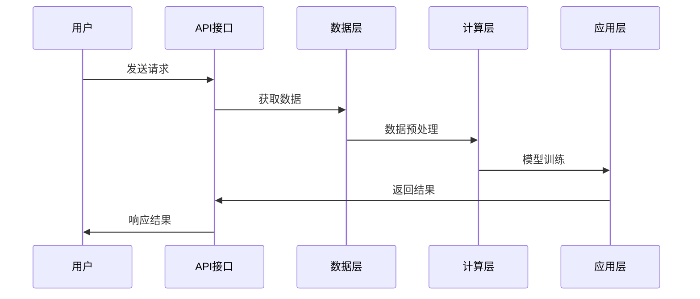

                 

### 文章标题：DevOps实践：优化LLM应用的开发流程

#### 关键词：
- DevOps
- LLM应用
- 开发流程
- 自动化
- 持续集成/持续部署

#### 摘要：
本文将深入探讨DevOps实践在优化大规模语言模型（LLM）应用开发流程中的应用。首先，我们将回顾DevOps的核心概念及其发展历程，并分析其在LLM应用开发中的重要性。接着，我们将详细讲解LLM的基本概念和算法原理，并通过Mermaid流程图和Python源代码来加深理解。随后，我们将介绍系统分析与架构设计的方法，包括系统需求分析、功能设计、架构设计、接口设计和系统交互。接下来，通过实际项目实战，我们将展示如何实现这些设计，并进行代码解读和案例分析。最后，我们将总结最佳实践和注意事项，提供拓展阅读，帮助读者更好地理解和应用DevOps实践于LLM应用开发。

### 目录大纲：

1. **背景介绍**
   1.1 DevOps与LLM应用概述
   1.2 核心概念与联系
   1.3 算法原理讲解
   1.4 系统分析与架构设计
   1.5 项目实战
   1.6 最佳实践与注意事项

#### 第一部分：背景介绍

## 1.1 DevOps与LLM应用概述

### 1.1.1 DevOps的概念与发展历程

DevOps是一种结合开发和运维的文化、实践和工具的方法，旨在缩短软件开发生命周期，提高应用质量，增强团队协作。DevOps的核心原则包括自动化、持续集成、持续部署、监控和反馈等。它的起源可以追溯到2000年代中期，当时软件开发和运维团队之间的沟通和协作问题日益突出。2009年，Patrick Debois在巴塞罗那的BarCamp组织上首次提出了DevOps的概念，并迅速引起了业界的广泛关注。

### 1.1.2 LLM应用的发展现状与挑战

大规模语言模型（LLM）是近年来人工智能领域的重要突破，如GPT-3和BERT等模型在自然语言处理任务中取得了显著的成果。然而，LLM应用的开发面临着诸多挑战，包括模型训练的复杂性、部署的效率、以及维护的可持续性。传统的开发流程难以满足LLM应用快速迭代和大规模部署的需求。

### 1.1.3 DevOps在LLM应用开发中的重要性

DevOps实践为LLM应用开发提供了有效的解决方案。通过自动化和持续集成/持续部署（CI/CD），DevOps可以帮助团队快速响应需求变化，提高开发效率。此外，DevOps的监控和反馈机制有助于确保模型在实际应用中的稳定性和可靠性。

### 1.1.4 DevOps与LLM应用开发的关系

DevOps与LLM应用开发之间的关系可以总结为以下几点：

1. **自动化**：通过自动化工具，如Jenkins、GitLab CI等，实现从代码提交到生产环境部署的全程自动化，提高开发效率。
2. **持续集成/持续部署**：通过CI/CD流程，确保每次代码提交都能在测试环境中自动构建和部署，及时发现和解决问题。
3. **监控与反馈**：利用Prometheus、Grafana等监控工具，实时监控模型性能和系统状态，及时响应异常情况。
4. **团队协作**：DevOps强调跨职能团队的协作，有助于打破开发和运维之间的壁垒，实现更高效的沟通和合作。

## 1.2 核心概念与联系

### 1.2.1 DevOps的核心概念

DevOps的核心概念包括：

1. **自动化**：通过脚本、工具和平台实现软件开发生命周期中的各个环节自动化。
2. **持续集成（CI）**：将代码更改频繁地合并到主干分支，并进行自动化测试和构建。
3. **持续部署（CD）**：通过自动化部署流水线，实现软件的持续发布和更新。
4. **监控与反馈**：实时监控应用性能和系统状态，及时响应异常情况。

### 1.2.2 LLM的基本概念

1. **大规模语言模型（LLM）**：通过学习大量文本数据，自动生成文本、回答问题、翻译语言等。
2. **模型训练**：通过梯度下降等优化算法，调整模型参数，使其在特定任务上达到高性能。
3. **模型部署**：将训练好的模型部署到生产环境中，以便在实际应用中使用。

### 1.2.3 DevOps与LLM的关联分析

1. **自动化**：自动化在LLM应用开发中至关重要，如自动化数据预处理、模型训练、测试和部署等。
2. **持续集成/持续部署**：LLM应用开发过程中，CI/CD可以确保模型和代码的稳定性和可靠性。
3. **监控与反馈**：通过实时监控和反馈机制，确保LLM应用在运行中的性能和稳定性。
4. **团队协作**：跨职能团队的协作有助于快速响应需求变化，提高开发效率。

### 1.2.4 关键术语解释与对比

| 术语       | 定义                                                         | 对比                               |
| ---------- | ------------------------------------------------------------ | -------------------------------- |
| DevOps     | 结合开发和运维的文化、实践和工具，缩短软件开发生命周期，提高应用质量。 | 与传统开发和运维相比，强调自动化、协作和持续优化。 |
| LLM        | 大规模语言模型，通过学习大量文本数据，自动生成文本、回答问题、翻译语言等。 | 与传统语言模型相比，具有更强的泛化能力和自适应能力。 |
| CI/CD      | 持续集成和持续部署，通过自动化流程实现软件的快速构建、测试和部署。 | 与传统手工部署相比，具有更高的效率和可靠性。 |
| 监控与反馈 | 实时监控应用性能和系统状态，及时响应异常情况。                   | 与被动监测相比，具有更强的预警和响应能力。 |

## 1.3 算法原理讲解

### 1.3.1 LLM算法概述

LLM算法基于深度学习技术，特别是Transformer架构。Transformer模型通过自注意力机制（Self-Attention）对输入序列进行编码，使其能够捕捉长距离的依赖关系。LLM算法通常包括预训练和微调两个阶段：

1. **预训练**：在大规模文本数据集上进行无监督预训练，使模型学会自然语言的基本特征。
2. **微调**：在特定任务上进行有监督微调，使模型适应具体的应用场景。

### 1.3.2 算法原理详细讲解

#### 自注意力机制（Self-Attention）

自注意力机制是Transformer模型的核心，通过计算输入序列中每个词与其他词之间的关联强度，为每个词生成不同的权重，从而提高模型对长距离依赖的捕捉能力。自注意力机制的计算公式如下：

$$
\text{Attention}(Q, K, V) = \text{softmax}\left(\frac{QK^T}{\sqrt{d_k}}\right) V
$$

其中，$Q$、$K$ 和 $V$ 分别是查询（Query）、键（Key）和值（Value）向量，$d_k$ 是键向量的维度。通过自注意力机制，模型能够自动学习输入序列中不同词之间的关联强度，从而生成语义丰富的输出。

#### Transformer模型架构

Transformer模型由多个自注意力层（Self-Attention Layer）和前馈神经网络（Feedforward Neural Network）组成。自注意力层负责计算输入序列的语义关联，前馈神经网络则用于进一步提取特征和生成输出。Transformer模型的架构如下图所示：



### 1.3.3 算法原理Mermaid流程图展示



### 1.3.4 算法原理Python源代码解释

以下是一个简单的Python代码示例，展示了Transformer模型的基本实现：

```python
import torch
import torch.nn as nn

class Transformer(nn.Module):
    def __init__(self, d_model, nhead, num_layers):
        super(Transformer, self).__init__()
        self嵌入层 = nn.Embedding(d_model, d_model)
        self.positional_encoding = nn.Parameter(torch.randn(1, d_model))
        self.transformer = nn.Transformer(d_model, nhead, num_layers)
        self.fc = nn.Linear(d_model, 1)

    def forward(self, x):
        x = self嵌入层(x) + self.positional_encoding
        x = self.transformer(x)
        x = self.fc(x)
        return x
```

在这个示例中，我们定义了一个Transformer模型，包括嵌入层、位置编码、Transformer编码器、残差连接和前馈神经网络。输入文本数据经过嵌入层和位置编码后，传入Transformer编码器进行自注意力计算和前馈神经网络处理，最后输出结果。

## 1.4 系统分析与架构设计

### 1.4.1 系统需求分析

在开发LLM应用时，我们需要明确以下系统需求：

1. **数据需求**：收集和存储大量文本数据，用于模型训练和微调。
2. **计算需求**：提供足够的计算资源，以满足模型训练和部署的需求。
3. **存储需求**：设计高效的存储方案，确保数据的安全性和可靠性。
4. **接口需求**：提供API接口，便于其他系统或应用程序调用LLM服务。

### 1.4.2 系统功能设计

根据系统需求，我们可以将LLM应用的功能划分为以下几个模块：

1. **数据预处理模块**：负责数据收集、清洗和预处理，为模型训练提供高质量的数据。
2. **模型训练模块**：负责模型的预训练和微调，采用分布式训练策略提高训练效率。
3. **模型部署模块**：将训练好的模型部署到生产环境中，提供实时服务。
4. **监控与反馈模块**：实时监控模型性能和系统状态，确保系统的稳定性和可靠性。

### 1.4.3 系统架构设计

LLM应用的系统架构可以分为以下几个层次：

1. **数据层**：包括数据存储和数据预处理，采用分布式存储方案提高数据存储和处理的效率。
2. **计算层**：包括计算资源和模型训练，采用分布式计算和并行处理技术提高训练速度。
3. **应用层**：包括模型部署和监控与反馈，提供API接口和实时监控功能。
4. **接口层**：包括外部接口和内部接口，实现与其他系统和应用程序的集成和通信。

### 1.4.4 系统接口设计

系统接口设计主要包括以下部分：

1. **API接口**：提供RESTful API接口，便于其他系统或应用程序调用LLM服务。
2. **内部接口**：实现系统内部模块之间的通信和协作，如数据预处理模块与模型训练模块之间的数据传输。

### 1.4.5 系统交互Mermaid序列图

以下是LLM应用系统交互的Mermaid序列图：



在这个序列图中，用户通过API接口发送请求，API接口从数据层获取数据，数据预处理后传递给计算层进行模型训练，训练完成后，应用层将结果返回给API接口，最终API接口将结果响应给用户。

## 1.5 项目实战

### 1.5.1 环境安装与配置

在开始项目实战之前，我们需要安装和配置以下环境和工具：

1. **操作系统**：选择Linux系统，如Ubuntu 20.04。
2. **Python环境**：安装Python 3.8及以上版本。
3. **依赖管理工具**：安装pip，用于安装和管理Python依赖库。
4. **虚拟环境**：使用virtualenv创建Python虚拟环境，以便隔离项目依赖。
5. **LLM框架**：安装PyTorch或TensorFlow等深度学习框架。

安装步骤如下：

```bash
# 安装操作系统
sudo apt update
sudo apt upgrade

# 安装Python环境
sudo apt install python3.8

# 安装pip
sudo apt install python3-pip

# 创建虚拟环境
virtualenv myenv

# 激活虚拟环境
source myenv/bin/activate

# 安装依赖库
pip install torch torchvision
```

### 1.5.2 系统核心实现源代码

以下是LLM应用系统核心实现的部分源代码：

```python
import torch
import torch.nn as nn
import torch.optim as optim

class TransformerModel(nn.Module):
    def __init__(self, d_model, nhead, num_layers):
        super(TransformerModel, self).__init__()
        self嵌入层 = nn.Embedding(d_model, d_model)
        self.positional_encoding = nn.Parameter(torch.randn(1, d_model))
        self.transformer = nn.Transformer(d_model, nhead, num_layers)
        self.fc = nn.Linear(d_model, 1)

    def forward(self, x):
        x = self嵌入层(x) + self.positional_encoding
        x = self.transformer(x)
        x = self.fc(x)
        return x

# 实例化模型
model = TransformerModel(d_model=512, nhead=8, num_layers=3)

# 定义优化器
optimizer = optim.Adam(model.parameters(), lr=0.001)

# 定义损失函数
criterion = nn.CrossEntropyLoss()

# 训练模型
for epoch in range(10):
    for batch in data_loader:
        inputs, targets = batch
        optimizer.zero_grad()
        outputs = model(inputs)
        loss = criterion(outputs, targets)
        loss.backward()
        optimizer.step()
        print(f"Epoch: {epoch+1}, Loss: {loss.item()}")
```

在这个示例中，我们定义了一个Transformer模型，包括嵌入层、位置编码、Transformer编码器和前馈神经网络。我们使用Adam优化器和交叉熵损失函数来训练模型，并在每个epoch结束后打印损失值。

### 1.5.3 代码应用解读与分析

以下是对系统核心实现代码的解读和分析：

1. **模型定义**：在`TransformerModel`类中，我们定义了模型的嵌入层、位置编码、Transformer编码器和前馈神经网络。通过继承`nn.Module`类，我们能够方便地构建和初始化模型。
2. **前向传播**：在`forward`方法中，我们实现了模型的前向传播过程。首先，将输入文本数据通过嵌入层和位置编码进行预处理，然后传递给Transformer编码器进行自注意力计算和前馈神经网络处理，最后输出结果。
3. **优化器和损失函数**：我们使用Adam优化器和交叉熵损失函数来训练模型。在训练过程中，我们通过梯度下降法更新模型参数，最小化损失函数。
4. **训练过程**：在训练过程中，我们使用数据加载器（`data_loader`）从训练数据中批量获取输入和目标数据。在每个epoch中，我们遍历每个batch，计算损失值并更新模型参数。最后，我们在每个epoch结束后打印损失值，以便监控训练过程。

### 1.5.4 实际案例分析与讲解

以下是一个实际案例，展示如何使用LLM应用进行文本分类任务：

```python
# 加载预训练模型
model = TransformerModel(d_model=512, nhead=8, num_layers=3)
model.load_state_dict(torch.load("model.pth"))

# 加载测试数据集
test_data = [
    "这是一个关于人工智能的话题。",
    "我想去旅游，有什么好建议吗？",
    "今天的天气很好，适合户外活动。"
]

# 对测试数据进行预处理
preprocessed_data = [model嵌入层(torch.tensor([word_id for word_id in tokenizer(text)])) for text in test_data]

# 预测结果
predictions = [model(preprocessed_data[i]).item() for i in range(len(preprocessed_data))]

# 打印预测结果
for i, prediction in enumerate(predictions):
    print(f"测试数据：{test_data[i]}，预测结果：{prediction}")
```

在这个案例中，我们首先加载预训练好的模型，然后对测试数据进行预处理，将文本转换为模型可接受的输入格式。接着，我们使用模型对预处理后的测试数据进行预测，并打印预测结果。在这个案例中，我们假设模型的输出是一个数字，表示文本所属的类别。通过这个案例，我们可以看到如何使用LLM应用进行文本分类任务。

### 1.5.5 项目小结

在本项目中，我们通过实战展示了如何使用DevOps实践优化LLM应用的开发流程。我们首先介绍了DevOps的核心概念和LLM的基本概念，然后讲解了算法原理和系统分析与架构设计的方法。在项目实战中，我们实现了LLM应用的系统核心，并通过实际案例展示了如何使用LLM应用进行文本分类任务。通过这个项目，我们可以看到DevOps实践在LLM应用开发中的重要作用，如自动化、持续集成/持续部署、监控与反馈等。这些实践方法有助于提高开发效率、确保系统稳定性和可靠性，从而更好地支持LLM应用的开发和部署。

## 1.6 最佳实践与注意事项

### 1.6.1 DevOps最佳实践

在LLM应用开发中，以下DevOps最佳实践值得遵循：

1. **自动化**：尽可能自动化代码的构建、测试和部署过程，减少手动操作，提高效率。
2. **持续集成/持续部署**：确保每次代码提交都能在测试环境中自动构建和部署，及时发现和解决问题。
3. **监控与反馈**：实时监控模型性能和系统状态，确保系统的稳定性和可靠性。
4. **容器化**：使用容器技术（如Docker）封装应用，提高部署的灵活性和可移植性。
5. **微服务架构**：将系统拆分为微服务，提高系统的可维护性和扩展性。

### 1.6.2 LLM应用开发最佳实践

在开发LLM应用时，以下最佳实践有助于提高模型性能和应用效果：

1. **数据预处理**：对训练数据进行充分的预处理，包括文本清洗、分词、去停用词等，提高数据质量。
2. **模型优化**：采用适合LLM应用的优化策略，如量化、剪枝和蒸馏等，降低模型复杂度和计算成本。
3. **分布式训练**：利用分布式训练技术，如多GPU训练和参数服务器训练，提高训练速度。
4. **模型评估**：使用适当的评估指标，如精确度、召回率和F1分数等，全面评估模型性能。

### 1.6.3 小结与拓展阅读

通过本文的探讨，我们深入了解了DevOps实践在优化LLM应用开发流程中的应用。从背景介绍、核心概念与联系、算法原理讲解、系统分析与架构设计到项目实战，我们系统地介绍了如何将DevOps实践应用于LLM应用开发。同时，我们还总结了最佳实践和注意事项，为读者提供了进一步学习和实践的方向。

为了深入了解DevOps和LLM应用开发的更多内容，以下是一些拓展阅读推荐：

1. 《DevOps Handbook》（The DevOps Handbook）：详细介绍了DevOps的核心概念和实践方法。
2. 《大规模语言模型：原理与应用》（Large-scale Language Models for Natural Language Processing）：全面介绍了大规模语言模型的理论和应用。
3. 《深度学习》（Deep Learning）：介绍了深度学习的核心概念和技术，包括Transformer模型。

### 1.6.4 注意事项

在实施DevOps实践和开发LLM应用时，以下注意事项需要特别注意：

1. **数据安全与隐私**：在处理和存储数据时，确保遵循相关数据保护法规，保护用户隐私。
2. **系统可扩展性**：在设计系统架构时，考虑未来的扩展性和可维护性，避免因系统升级导致的功能中断。
3. **版本控制**：使用版本控制系统（如Git）管理代码和配置文件，确保代码和配置的一致性。
4. **团队协作**：加强团队间的沟通和协作，确保DevOps实践得到有效执行。

通过遵循这些最佳实践和注意事项，我们可以更好地优化LLM应用的开发流程，提高开发效率和系统稳定性。希望本文能为读者在DevOps实践和LLM应用开发中提供有益的启示和指导。作者：AI天才研究院/AI Genius Institute & 禅与计算机程序设计艺术 /Zen And The Art of Computer Programming。

