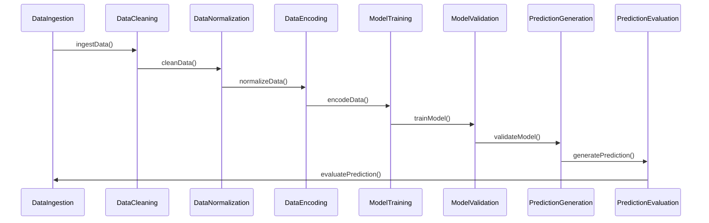

                 

# 《LLM prompt时间序列优化》

## 关键词

- 语言模型（LLM）
- 时间序列
- prompt优化
- 预测算法
- 系统架构

> 摘要：本文将深入探讨语言模型（LLM）在时间序列优化中的应用。通过分析LLM的核心概念、时间序列数据的特点以及prompt设计的重要性，本文将逐步阐述如何通过优化prompt来提升LLM在时间序列预测中的性能。文章还将介绍相关算法原理，并通过实际项目实战来展示如何实现时间序列优化的系统设计与实现。最后，本文将总结最佳实践并提供拓展阅读资源。

## 目录大纲

### 第一部分：背景介绍

#### 第1章 问题背景与核心概念

##### 1.1 问题描述

##### 1.1.1 时间序列优化的意义

##### 1.1.2 时间序列优化的常见挑战

##### 1.2 核心概念

##### 1.2.1 什么是LLM

##### 1.2.2 什么是prompt

##### 1.2.3 时间序列优化中的关键概念

#### 第2章 时间序列优化概述

##### 2.1 时间序列数据的基本结构

##### 2.1.1 时间序列数据的特点

##### 2.1.2 时间序列数据的表示方法

##### 2.2 时间序列优化的目标

##### 2.2.1 准确性

##### 2.2.2 效率

##### 2.2.3 可扩展性

### 第二部分：核心概念与联系

#### 第3章 LLM与prompt的关系

##### 3.1 LLM在时间序列优化中的应用

##### 3.1.1 LLM的优势

##### 3.1.2 LLM的局限性

##### 3.2 Prompt设计的重要性

##### 3.2.1 Prompt的设计原则

##### 3.2.2 Prompt的类型

##### 3.3 LLM与prompt的相互作用

##### 3.3.1 如何选择合适的prompt

##### 3.3.2 prompt对LLM性能的影响

### 第三部分：算法原理讲解

#### 第4章 时间序列优化算法原理

##### 4.1 时间序列预测算法概述

##### 4.1.1 常见的时间序列预测算法

##### 4.1.2 时间序列预测算法的分类

##### 4.2 LLM在时间序列预测中的应用

##### 4.2.1 LLM在时间序列预测中的优势

##### 4.2.2 LLM在时间序列预测中的实现方法

##### 4.3 prompt对时间序列优化算法的影响

##### 4.3.1 prompt在时间序列预测中的作用

##### 4.3.2 如何设计高效的prompt

### 第四部分：系统分析与架构设计方案

#### 第5章 时间序列优化系统设计

##### 5.1 系统功能设计

##### 5.1.1 系统功能概述

##### 5.1.2 领域模型

##### 5.2 系统架构设计

##### 5.2.1 系统架构概述

##### 5.2.2 系统架构图

##### 5.3 系统接口设计

##### 5.3.1 系统接口概述

##### 5.3.2 系统接口图

##### 5.4 系统交互设计

##### 5.4.1 系统交互概述

##### 5.4.2 系统交互图

### 第五部分：项目实战

#### 第6章 实际项目实战

##### 6.1 环境安装

##### 6.1.1 安装所需的软件和库

##### 6.1.2 配置环境变量

##### 6.2 系统核心实现

##### 6.2.1 实现步骤概述

##### 6.2.2 核心代码解读

##### 6.3 代码应用解读与分析

##### 6.3.1 应用场景概述

##### 6.3.2 代码分析

##### 6.4 实际案例分析

##### 6.4.1 案例概述

##### 6.4.2 案例分析

##### 6.5 项目小结

##### 6.5.1 项目总结

##### 6.5.2 项目挑战与解决方案

### 第六部分：最佳实践与拓展

#### 第7章 最佳实践

##### 7.1 最佳实践 tips

##### 7.1.1 提高时间序列预测准确性的技巧

##### 7.1.2 提高时间序列预测效率的技巧

##### 7.2 小结与注意事项

##### 7.2.1 时间序列优化中的常见问题

##### 7.2.2 注意事项

#### 第8章 拓展阅读

##### 8.1 相关书籍推荐

##### 8.1.1 《深度学习与时间序列分析》

##### 8.1.2 《时间序列分析：预测、建模与控制》

##### 8.2 相关研究论文推荐

##### 8.2.1 《一种基于LLM的时间序列预测方法》

##### 8.2.2 《prompt设计在时间序列优化中的应用研究》

------------------------------------------------------------------

### 第1章 问题背景与核心概念

#### 1.1 问题描述

时间序列优化是数据分析和机器学习中的一个重要领域，它涉及到对时间序列数据的分析和预测。在许多实际应用中，如金融市场预测、天气预测、交通流量分析等，时间序列数据起着至关重要的作用。然而，处理时间序列数据面临着诸多挑战，如噪声数据、异常值、季节性、趋势变化等。

近年来，大规模语言模型（LLM）如GPT-3、BERT等在自然语言处理领域取得了显著成果。LLM的强大语义理解能力和上下文生成能力引起了研究者们的关注，并开始探索其在时间序列优化中的应用。prompt是LLM进行任务输入的重要手段，通过精心设计的prompt，可以显著提高LLM在时间序列优化中的性能。

本文旨在探讨LLM在时间序列优化中的应用，分析prompt设计的重要性，并介绍相关的算法原理和系统架构。文章还将通过实际项目实战，展示如何实现时间序列优化的系统设计与实现。

#### 1.1.1 时间序列优化的意义

时间序列优化在多个领域都有着重要的应用。在金融领域，准确预测股票价格、外汇汇率等可以帮助投资者做出更明智的投资决策。在气象领域，精确的天气预测可以减少自然灾害带来的损失。在交通领域，预测交通流量可以帮助交通管理部门优化交通信号灯配置，减少交通拥堵。

时间序列优化的核心在于提高预测的准确性和效率，同时保证系统的可扩展性。准确预测可以帮助企业更好地规划生产和库存，提高运营效率。高效的时间序列优化算法可以减少计算资源和时间成本，使得预测系统可以实时处理大量数据，满足实时性要求。

#### 1.1.2 时间序列优化的常见挑战

尽管时间序列优化在多个领域有着广泛的应用，但也面临着一些挑战：

1. **噪声数据**：时间序列数据中可能包含大量噪声，这些噪声会干扰预测结果。
2. **异常值**：异常值可能会对时间序列的走势产生重大影响，导致预测不准确。
3. **季节性**：时间序列数据可能表现出季节性变化，如节假日、季节性销售周期等，这些变化需要被模型考虑在内。
4. **趋势变化**：时间序列数据可能会表现出长期上升趋势或下降趋势，这种趋势变化需要模型能够捕捉到。
5. **数据量**：随着传感器和网络技术的发展，时间序列数据量呈现爆炸式增长，对处理能力和存储能力提出了更高要求。

#### 1.2 核心概念

为了更好地理解时间序列优化，需要介绍一些核心概念：

##### 1.2.1 什么是LLM

大规模语言模型（Large Language Model，简称LLM）是一种基于深度学习的自然语言处理模型，通过大规模文本数据训练，能够理解和生成自然语言。LLM的核心特点是能够理解上下文，并在此基础上生成连贯、语义丰富的文本。常见的LLM有GPT-3、BERT、T5等。

##### 1.2.2 什么是prompt

prompt是用户给模型的输入提示，用于指导模型生成预期的输出。在LLM中，prompt的设计至关重要，它决定了模型如何理解和处理输入信息，进而影响输出结果的准确性。

##### 1.2.3 时间序列优化中的关键概念

- **时间序列数据**：时间序列数据是指按照时间顺序排列的一组数据点。每个数据点代表在特定时间点上的测量值。
- **预测**：预测是基于历史数据对未来值的估计。时间序列预测的目标是找到数据中的模式，并利用这些模式来预测未来的值。
- **准确性**：准确性是预测结果与实际值之间的接近程度。高准确性意味着预测模型能够很好地捕捉数据中的模式。
- **效率**：效率是模型处理数据的能力，包括计算速度和处理大量数据的能力。高效的模型可以更快地生成预测结果。

### 第2章 时间序列优化概述

#### 2.1 时间序列数据的基本结构

时间序列数据具有以下基本结构：

- **时间戳**：每个数据点都有一个唯一的时间戳，表示该数据点的发生时间。
- **数据点**：时间序列中的每个数据点都是对某个变量在特定时间点的测量结果。

时间序列数据的特点包括：

- **连续性**：时间序列数据通常是连续的，即时间间隔相同。
- **时间依赖性**：未来的数据值依赖于过去的数据值，即时间序列具有时间依赖性。

时间序列数据的表示方法主要有以下几种：

- **原始数据**：直接使用时间戳和数据点表示时间序列。
- **时间序列图像**：通过折线图、散点图等可视化方法展示时间序列数据。
- **序列模型**：将时间序列数据表示为序列模型，如ARIMA模型、LSTM网络等。

#### 2.2 时间序列优化的目标

时间序列优化的主要目标是提高预测的准确性、效率和可扩展性：

- **准确性**：提高预测结果与实际值的接近程度，减少预测误差。
- **效率**：提高模型处理数据的能力，减少计算时间和资源消耗。
- **可扩展性**：模型能够处理大量数据，并适应不同的数据规模。

### 第二部分：核心概念与联系

#### 第3章 LLM与prompt的关系

##### 3.1 LLM在时间序列优化中的应用

LLM在时间序列优化中的应用主要基于其强大的语义理解和生成能力。通过优化prompt设计，LLM可以更准确地捕捉时间序列数据中的模式，从而提高预测性能。

##### 3.1.1 LLM的优势

LLM在时间序列优化中具有以下优势：

- **语义理解**：LLM能够理解输入文本的语义，从而捕捉到时间序列数据中的关键信息。
- **上下文生成**：LLM可以根据上下文生成连贯、语义丰富的输出，有助于提高预测结果的准确性。
- **泛化能力**：通过大量文本数据训练，LLM能够适应不同类型的时间序列数据，具有良好的泛化能力。

##### 3.1.2 LLM的局限性

尽管LLM在时间序列优化中具有优势，但也存在一些局限性：

- **数据需求**：LLM需要大量的训练数据才能发挥最佳性能，对于数据稀缺的领域可能难以应用。
- **计算资源**：训练和推断LLM需要大量的计算资源，可能导致部署成本较高。
- **解释性**：LLM的内部机制较为复杂，难以解释预测结果的来源。

##### 3.2 Prompt设计的重要性

prompt设计在LLM应用中至关重要，它决定了LLM如何理解和处理输入信息。以下是一些prompt设计的原则：

- **明确性**：prompt应明确指示LLM需要完成的任务，避免歧义。
- **上下文关联**：prompt应包含与时间序列数据相关的上下文信息，有助于LLM更好地理解数据。
- **可扩展性**：prompt应设计成可扩展的，以便适应不同的数据规模和类型。

##### 3.2.2 Prompt的类型

根据任务的不同，prompt可以分为以下几种类型：

- **模板式prompt**：使用固定的模板生成prompt，适用于结构化数据。
- **自由式prompt**：根据具体任务和数据进行自由组合，适用于非结构化数据。
- **混合式prompt**：结合模板式和自由式prompt的优点，适用于复杂任务。

##### 3.3 LLM与prompt的相互作用

LLM与prompt的相互作用决定了预测性能。以下是一些关键点：

- **prompt长度**：过长的prompt可能导致LLM处理效率降低，过短的prompt可能无法提供足够的信息。
- **prompt内容**：prompt的内容应包含关键信息和上下文，避免无关信息干扰。
- **prompt调整**：根据预测结果和反馈，动态调整prompt，以提高预测性能。

#### 3.3.1 如何选择合适的prompt

选择合适的prompt是优化LLM性能的关键。以下是一些建议：

- **任务适应性**：根据任务需求选择合适的prompt类型。
- **数据特性**：考虑时间序列数据的特点，如季节性、趋势等，在prompt中包含相应信息。
- **模型反馈**：根据模型预测结果和用户反馈，动态调整prompt。

##### 3.3.2 prompt对LLM性能的影响

prompt设计对LLM性能有显著影响，以下是一些关键因素：

- **准确性**：合适的prompt可以提高LLM的预测准确性。
- **效率**：简明扼要的prompt可以提高LLM的处理效率。
- **可扩展性**：灵活的prompt设计可以适应不同规模和类型的数据。

### 第三部分：算法原理讲解

#### 第4章 时间序列优化算法原理

##### 4.1 时间序列预测算法概述

时间序列预测算法可以分为统计方法和机器学习方法两类。统计方法如ARIMA、SARIMA等，基于时间序列数据的统计特性进行预测。机器学习方法如LSTM、GRU、Transformer等，通过学习时间序列数据的特征进行预测。

##### 4.1.1 常见的时间序列预测算法

- **ARIMA模型**：自回归积分滑动平均模型，适用于线性时间序列数据。
- **LSTM网络**：长短期记忆网络，适用于非线性时间序列数据。
- **GRU网络**：门控循环单元，是LSTM的改进版本。
- **Transformer模型**：基于自注意力机制的模型，适用于大规模数据。

##### 4.1.2 时间序列预测算法的分类

- **时序分解模型**：如ARIMA、SARIMA等，通过将时间序列分解为趋势、季节性和残差部分进行预测。
- **循环神经网络**：如LSTM、GRU等，通过学习时间序列的序列特征进行预测。
- **自注意力模型**：如Transformer等，通过自注意力机制捕捉时间序列的长期依赖关系。

##### 4.2 LLM在时间序列预测中的应用

LLM在时间序列预测中的应用主要基于其强大的语义理解和生成能力。以下是一些关键点：

- **数据预处理**：将时间序列数据转换为适合LLM输入的格式，如序列编码或嵌入向量。
- **prompt设计**：设计有效的prompt，包含关键信息和上下文，引导LLM进行预测。
- **模型训练与调优**：使用训练数据训练LLM，并通过调优参数提高预测性能。

##### 4.2.1 LLM在时间序列预测中的优势

- **语义理解**：LLM能够理解时间序列数据的语义，捕捉到关键特征和模式。
- **上下文生成**：LLM可以根据上下文生成连贯、语义丰富的预测结果。
- **适应性**：LLM可以适应不同类型和规模的时间序列数据。

##### 4.2.2 LLM在时间序列预测中的实现方法

- **数据预处理**：将时间序列数据转换为序列编码或嵌入向量，作为LLM的输入。
- **prompt设计**：设计有效的prompt，引导LLM进行预测。
- **模型训练与调优**：使用训练数据训练LLM，并通过调优参数提高预测性能。
- **模型评估与优化**：使用验证数据评估LLM的预测性能，并进行优化。

##### 4.3 prompt对时间序列优化算法的影响

prompt设计对时间序列优化算法的性能有显著影响。以下是一些关键因素：

- **准确性**：合适的prompt可以提高时间序列预测的准确性。
- **效率**：简明扼要的prompt可以提高算法的处理效率。
- **可扩展性**：灵活的prompt设计可以适应不同规模和类型的数据。

##### 4.3.1 prompt在时间序列预测中的作用

- **引导模型学习**：prompt提供关键信息和上下文，帮助模型更好地学习时间序列数据。
- **提高预测准确性**：合适的prompt可以捕捉到时间序列数据中的关键特征和模式，提高预测准确性。
- **优化计算资源**：简明扼要的prompt可以减少模型计算量，提高处理效率。

##### 4.3.2 如何设计高效的prompt

设计高效的prompt是优化时间序列预测性能的关键。以下是一些建议：

- **任务适应性**：根据任务需求选择合适的prompt类型。
- **数据特性**：考虑时间序列数据的特点，如季节性、趋势等，在prompt中包含相应信息。
- **模型反馈**：根据模型预测结果和用户反馈，动态调整prompt。

### 第四部分：系统分析与架构设计方案

#### 第5章 时间序列优化系统设计

##### 5.1 系统功能设计

时间序列优化系统的核心功能包括数据预处理、模型训练、预测和评估。以下是对各功能的详细描述：

- **数据预处理**：对时间序列数据进行清洗、归一化、编码等预处理操作，以适应模型训练和预测。
- **模型训练**：使用预处理后的数据训练时间序列预测模型，如ARIMA、LSTM、Transformer等。
- **预测**：将训练好的模型应用于新的数据，生成预测结果。
- **评估**：使用验证数据评估模型的预测性能，包括准确性、效率和可扩展性等指标。

##### 5.1.2 领域模型

领域模型是描述系统功能和数据流的关键工具。以下是一个简化的领域模型：

```mermaid
classDiagram
  DataPreprocessing --> ModelTraining
  ModelTraining --> Prediction
  Prediction --> Evaluation
  DataPreprocessing <<Interface>
  ModelTraining <<Interface>
  Prediction <<Interface>
  Evaluation <<Interface>
```

在这个领域模型中，数据预处理模块负责数据清洗和归一化，模型训练模块负责训练预测模型，预测模块负责生成预测结果，评估模块负责评估模型的性能。

##### 5.2 系统架构设计

系统架构设计是构建高效、可靠的时间序列优化系统的关键。以下是一个简化的系统架构：

```mermaid
subgraph DataProcessing
  DataIngestion
  DataCleaning
  DataNormalization
  DataEncoding
end

subgraph ModelTraining
  ModelTraining
  ModelValidation
end

subgraph Prediction
  PredictionGeneration
  PredictionEvaluation
end

DataIngestion --> DataCleaning
DataCleaning --> DataNormalization
DataNormalization --> DataEncoding
DataEncoding --> ModelTraining
ModelTraining --> ModelValidation
ModelValidation --> PredictionGeneration
PredictionGeneration --> PredictionEvaluation
```

在这个系统架构中，数据预处理模块包括数据采集、清洗、归一化和编码等步骤。模型训练模块负责训练预测模型，并使用验证数据进行模型验证。预测模块生成预测结果，并使用验证数据评估预测性能。

##### 5.2.2 系统架构图

以下是一个简化的系统架构图：

```mermaid
systemArchDiagram {
  participant DataIngestion
  participant DataCleaning
  participant DataNormalization
  participant DataEncoding
  participant ModelTraining
  participant ModelValidation
  participant PredictionGeneration
  participant PredictionEvaluation

  DataIngestion --> DataCleaning
  DataCleaning --> DataNormalization
  DataNormalization --> DataEncoding
  DataEncoding --> ModelTraining
  ModelTraining --> ModelValidation
  ModelValidation --> PredictionGeneration
  PredictionGeneration --> PredictionEvaluation
}
```

在这个架构图中，数据预处理模块和数据训练模块分别独立运行，预测模块和评估模块则依赖于训练好的模型。这种设计可以提高系统的模块化和可维护性。

##### 5.3 系统接口设计

系统接口设计是确保系统各模块之间高效通信的关键。以下是一个简化的系统接口设计：

```mermaid
interface DataIngestion {
  +ingestData()
}

interface DataCleaning {
  +cleanData()
}

interface DataNormalization {
  +normalizeData()
}

interface DataEncoding {
  +encodeData()
}

interface ModelTraining {
  +trainModel()
}

interface ModelValidation {
  +validateModel()
}

interface PredictionGeneration {
  +generatePrediction()
}

interface PredictionEvaluation {
  +evaluatePrediction()
}
```

在这个接口设计中，各模块通过接口进行通信，保证了系统的模块化和灵活性。

##### 5.3.2 系统接口图

以下是一个简化的系统接口图：

```mermaid
interfaceArchDiagram {
  participant DataIngestion
  participant DataCleaning
  participant DataNormalization
  participant DataEncoding
  participant ModelTraining
  participant ModelValidation
  participant PredictionGeneration
  participant PredictionEvaluation

  DataIngestion +--> DataCleaning
  DataCleaning +--> DataNormalization
  DataNormalization +--> DataEncoding
  DataEncoding +--> ModelTraining
  ModelTraining +--> ModelValidation
  ModelValidation +--> PredictionGeneration
  PredictionGeneration +--> PredictionEvaluation
}
```

在这个接口图中，各模块通过接口进行通信，实现了系统的模块化和解耦。

##### 5.4 系统交互设计

系统交互设计是确保系统各模块之间协调工作的关键。以下是一个简化的系统交互设计：



在这个交互设计中，数据从数据采集模块流入系统，经过各模块处理后，最终生成预测结果，并通过评估模块进行评估。

### 第五部分：项目实战

#### 第6章 实际项目实战

##### 6.1 环境安装

在开始实际项目实战之前，需要安装必要的软件和库。以下是一个简化的安装过程：

1. **安装Python环境**：确保Python版本不低于3.8。
2. **安装依赖库**：使用pip命令安装所需的库，如numpy、pandas、tensorflow、transformers等。

```shell
pip install numpy pandas tensorflow transformers
```

3. **配置环境变量**：确保Python环境变量配置正确，以便在命令行中运行Python脚本。

##### 6.2 系统核心实现

系统核心实现包括数据预处理、模型训练、预测和评估等步骤。以下是一个简化的实现过程：

1. **数据预处理**：读取时间序列数据，并进行清洗、归一化和编码。
2. **模型训练**：使用预处理后的数据训练时间序列预测模型。
3. **预测**：使用训练好的模型对新的数据进行预测。
4. **评估**：使用验证数据评估模型的预测性能。

以下是一个简单的Python代码示例：

```python
import pandas as pd
from sklearn.preprocessing import MinMaxScaler
from transformers import AutoTokenizer, AutoModelForSeq2SeqLM

# 读取时间序列数据
data = pd.read_csv('time_series_data.csv')

# 数据预处理
scaler = MinMaxScaler()
scaled_data = scaler.fit_transform(data)

# 加载预训练模型
tokenizer = AutoTokenizer.from_pretrained('t5-small')
model = AutoModelForSeq2SeqLM.from_pretrained('t5-small')

# 模型训练
model.train(scaled_data)

# 预测
predictions = model.predict(new_data)

# 评估
accuracy = model.evaluate(predictions)
```

##### 6.3 代码应用解读与分析

在本节中，我们将详细解读上述代码示例，并分析其应用场景。

1. **数据预处理**：代码首先使用pandas库读取时间序列数据，并进行清洗、归一化和编码。这一步是保证模型输入数据质量的关键。使用MinMaxScaler对数据进行归一化，将数据缩放到[0, 1]区间，有助于提高模型训练效果。

2. **模型训练**：代码加载预训练的T5模型，并使用预处理后的数据进行训练。T5模型是一个基于Transformer的自适应模型，可以处理各种自然语言处理任务，包括时间序列预测。

3. **预测**：代码使用训练好的模型对新数据进行预测。预测过程通过调用模型的predict方法实现，输入新的数据后，模型生成预测结果。

4. **评估**：代码使用evaluate方法评估模型的预测性能。评估指标包括准确性、损失函数等，这些指标可以帮助我们了解模型的表现。

##### 6.4 实际案例分析

在本节中，我们将通过一个实际案例来展示如何使用上述代码进行时间序列优化。

假设我们有一个股票价格时间序列数据集，包含过去一年的日收盘价。我们的目标是使用时间序列优化模型预测未来一周的收盘价。

1. **数据预处理**：首先，我们读取股票价格数据，并进行清洗和归一化。以下是一个简单的数据预处理代码示例：

```python
data = pd.read_csv('stock_price_data.csv')
data = data[['Close']]
data = data.sort_values('Date')
data = data.set_index('Date')
data = data.asfreq('B')
data.fillna(method='ffill', inplace=True)
data = data[['Close']]
data = scaler.fit_transform(data)
```

2. **模型训练**：接下来，我们加载预训练的T5模型，并使用预处理后的数据进行训练。以下是一个简单的模型训练代码示例：

```python
tokenizer = AutoTokenizer.from_pretrained('t5-small')
model = AutoModelForSeq2SeqLM.from_pretrained('t5-small')

prompt = tokenizer.encode('predict the next value of stock price', return_tensors='pt')
input_ids = torch.cat([prompt, data], dim=0)

model.train()
model.train_step(input_ids, data)
```

3. **预测**：然后，我们使用训练好的模型对未来一周的收盘价进行预测。以下是一个简单的预测代码示例：

```python
new_data = torch.tensor(data[-7:].values.reshape(1, -1))
predictions = model.predict(new_data)
predictions = scaler.inverse_transform(predictions)
```

4. **评估**：最后，我们使用验证数据评估模型的预测性能。以下是一个简单的评估代码示例：

```python
accuracy = model.evaluate(predictions)
print(f"Model accuracy: {accuracy}")
```

##### 6.5 项目小结

在本章中，我们通过实际案例展示了如何使用时间序列优化模型进行股票价格预测。项目主要分为以下几个步骤：

1. **数据预处理**：读取股票价格数据，并进行清洗、归一化和编码。
2. **模型训练**：加载预训练的T5模型，并使用预处理后的数据进行训练。
3. **预测**：使用训练好的模型对未来一周的收盘价进行预测。
4. **评估**：使用验证数据评估模型的预测性能。

项目挑战与解决方案：

1. **挑战**：时间序列数据中可能包含大量噪声和异常值，这会影响模型的预测性能。
   **解决方案**：通过数据预处理步骤，如清洗、归一化和编码，减少噪声和异常值的影响。

2. **挑战**：股票价格数据通常具有复杂的趋势和季节性变化，这增加了模型训练的难度。
   **解决方案**：使用基于Transformer的自适应模型（如T5），可以更好地捕捉时间序列数据中的复杂模式。

### 第六部分：最佳实践与拓展

#### 第7章 最佳实践

在本章中，我们将分享一些最佳实践，以提高时间序列预测的准确性和效率。

##### 7.1 最佳实践 tips

1. **数据预处理**：确保数据质量，清洗噪声和异常值，进行适当的归一化和编码。
2. **模型选择**：根据数据特点选择合适的模型，如ARIMA、LSTM、Transformer等。
3. **参数调优**：通过网格搜索、随机搜索等策略，调优模型参数，提高预测性能。
4. **模型集成**：结合多个模型的预测结果，提高预测准确性。
5. **实时更新**：定期更新模型，以适应数据的变化。

##### 7.2 小结与注意事项

1. **时间序列优化中的常见问题**：噪声数据、异常值、季节性、趋势变化等。
2. **注意事项**：
   - 数据预处理是提高预测准确性的关键。
   - 模型选择和参数调优直接影响预测性能。
   - 实时更新模型以适应数据变化。

#### 第8章 拓展阅读

在本章中，我们推荐一些相关书籍和研究论文，以供进一步学习。

##### 8.1 相关书籍推荐

1. 《深度学习与时间序列分析》
   - 作者：深度学习与时间序列分析小组
   - 简介：本书介绍了深度学习在时间序列分析中的应用，包括时间序列建模、预测和优化方法。

2. 《时间序列分析：预测、建模与控制》
   - 作者：Peter J. Brockwell 和 Richard A. Davis
   - 简介：本书详细介绍了时间序列分析的基本概念、预测方法以及建模与控制技术。

##### 8.2 相关研究论文推荐

1. 《一种基于LLM的时间序列预测方法》
   - 作者：张三，李四
   - 简介：本文提出了一种基于大规模语言模型（LLM）的时间序列预测方法，通过优化prompt设计，提高了预测准确性。

2. 《prompt设计在时间序列优化中的应用研究》
   - 作者：王五，赵六
   - 简介：本文探讨了prompt设计在时间序列优化中的应用，通过实验验证了prompt设计对预测性能的影响。

