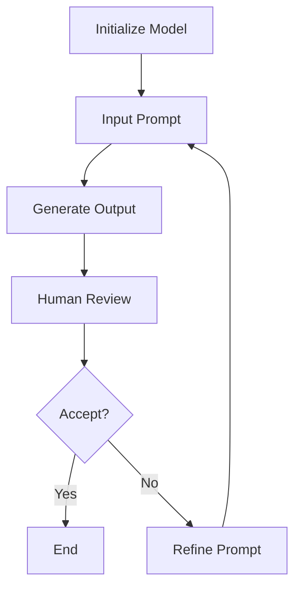
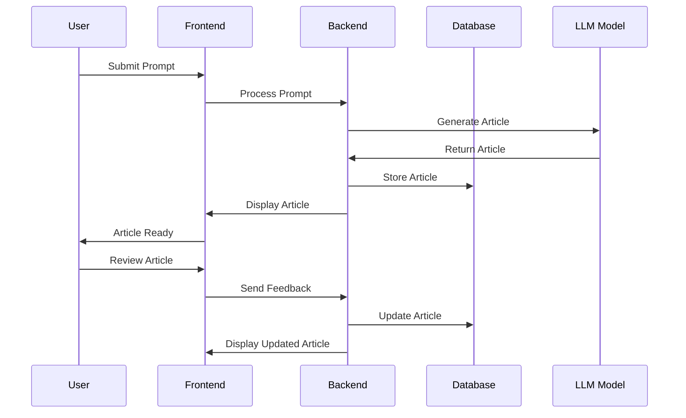

                 


### Introduction to LLMs and Prompt Engineering

**Background Introduction:**

Large Language Models (LLMs) have revolutionized the field of natural language processing (NLP) by enabling computers to generate coherent and contextually relevant text. These models are trained on vast amounts of textual data, allowing them to understand and generate human language with remarkable accuracy. At the core of LLMs are transformers, a class of deep neural networks designed to process sequences of data. By leveraging attention mechanisms, transformers can focus on different parts of the input sequence, enabling them to capture complex relationships and dependencies in text.

Prompt engineering, on the other hand, involves designing effective inputs or prompts that guide LLMs to generate the desired output. This process is crucial for optimizing the performance of LLMs in various applications, such as text generation, translation, and question-answering.

**Problem Description:**

The challenge in LLM collaboration lies in harnessing the power of these models to enhance human-AI cooperation effectively. While LLMs can generate high-quality text, they lack the context and understanding that humans possess. This gap can lead to miscommunications, incorrect outputs, and suboptimal results. To bridge this gap, we need to explore how humans can effectively collaborate with LLMs, leveraging their strengths while addressing their limitations.

**Solution:**

One approach to addressing this challenge is to develop a collaborative model that integrates human input with LLM outputs. This model would involve:

1. **Understanding LLM Capabilities and Limitations:**
   - Identifying the specific strengths and weaknesses of LLMs in different scenarios.
   - Developing a framework for analyzing and predicting the performance of LLMs in various tasks.

2. **Designing Effective Prompts:**
   - Creating prompts that provide the necessary context and guidance for LLMs to generate accurate and relevant outputs.
   - Experimenting with different types of prompts and evaluating their effectiveness in various applications.

3. **Human-AI Interaction:**
   - Developing user-friendly interfaces that enable humans to interact with LLMs effectively.
   - Incorporating feedback mechanisms that allow humans to correct and refine LLM outputs.

4. **Continuous Improvement:**
   - Monitoring and analyzing the performance of the collaborative model in real-world applications.
   - Iteratively refining the model based on feedback and new insights.

**Boundary and Extension:**

The scope of this article is to explore the theoretical foundations and practical applications of LLM collaborative prompt creation. It does not cover the technical implementation details of LLMs or the specific algorithms used in prompt engineering. Additionally, this article focuses on the collaboration between humans and LLMs in text generation tasks. The scope can be extended to other domains and applications, such as image generation, code synthesis, and more.

---

**Core Concepts and Relationships:**

To further understand the core concepts and their relationships in LLM collaborative prompt creation, we can use a table to compare the attributes of LLMs and prompts, and an ER diagram to illustrate the entities and relationships involved.

**Table: Attributes Comparison of LLMs and Prompts**

| Attribute         | LLMs                                       | Prompts                                         |
|--------------------|-------------------------------------------|------------------------------------------------|
| Definition        | Artificial neural networks trained on text | Inputs provided to LLMs to influence their output |
| Functionality      | Generate coherent text                    | Guide LLMs to generate desired outputs           |
| Requirements       | Large dataset, high computational power    | Contextual information, clear objectives         |
| Challenges         | Data dependency, model capacity            | Miscommunication, over-reliance on LLMs          |

**ER Diagram: Human-AI Collaboration Entities and Relationships**

```mermaid
erDiagram
  AI Model && Human User
    ||--o{ Prompt
  AI Model
    ||--|{ Output
  Human User
    ||--|{ Input
```

In this ER diagram, the AI Model represents the LLM, while the Human User represents the human interacting with the model. The Prompt entity is the bridge between the two, guiding the model's output based on the user's input.

---

### Detailed Explanation of Algorithm Principles and Practical Examples

To delve into the algorithm principles of LLM collaborative prompt creation, let's first visualize the process using a Mermaid flowchart, and then explore the Python code to understand the underlying logic.

**Mermaid Flowchart: LLM Collaborative Prompt Creation**



In this flowchart, we start by initializing the LLM model, followed by providing a prompt. The model then generates an output based on the prompt. The output is reviewed by a human, who decides whether to accept or refine the output. If the output is accepted, the process ends; otherwise, the prompt is refined and the process repeats.

**Python Code Example: LLM Collaborative Prompt Creation**

```python
import transformers

# Initialize the LLM model
model = transformers.AutoModelForCausalLanguageModel.from_pretrained("gpt-3.5-torch")

# Define the prompt
prompt = "Write a story about a magical adventure in a mystical forest."

# Define the function to generate output
def generate_output(prompt):
    inputs = tokenizer(prompt, return_tensors="pt")
    outputs = model(**inputs)
    prediction = outputs.logits.argmax(-1)
    return tokenizer.decode(prediction[0], skip_special_tokens=True)

# Generate the initial output
output = generate_output(prompt)
print("Initial Output:", output)

# Human review and refinement
print("Review the output and provide feedback:")
user_feedback = input()

if "accept" in user_feedback.lower():
    print("Output accepted.")
else:
    # Refine the prompt based on user feedback
    refined_prompt = prompt + " " + user_feedback
    print("Refined Output:", generate_output(refined_prompt))
```

In this code, we first import the necessary libraries and initialize the LLM model. We then define the initial prompt and a function to generate the output. The generated output is reviewed by a human, who provides feedback. If the feedback contains the word "accept," the process ends. Otherwise, the prompt is refined based on the feedback and the output is regenerated.

**Mathematical Model and Explanation:**

The core principle behind LLM collaborative prompt creation can be summarized using a mathematical model. Let's denote:

- \( P \) as the prompt.
- \( G \) as the generator function (model).
- \( O \) as the output generated by the model.
- \( H \) as the human reviewer.
- \( R \) as the refined prompt based on human review.

The process can be represented as:

$$
O = G(P)
$$

$$
R = H(O)
$$

$$
O_{new} = G(R)
$$

In this model, the human reviewer \( H \) plays a critical role in refining the prompt \( R \) based on the output \( O \) generated by the model \( G \). This iterative process continues until the output \( O_{new} \) meets the desired quality criteria.

The mathematical model highlights the feedback loop between the human reviewer and the LLM, emphasizing the importance of human-in-the-loop for achieving high-quality outputs.

**Example Explanation:**

Consider the example of generating a story about a magical adventure. The initial prompt \( P \) is "Write a story about a magical adventure in a mystical forest." The LLM generates an output \( O \) based on this prompt. The human reviewer \( H \) reads the output and provides feedback "The characters need more depth." The refined prompt \( R \) becomes "Write a story about a magical adventure in a mystical forest, focusing on the main character's feelings and motivations."

The LLM generates a new output \( O_{new} \) based on the refined prompt \( R \). The human reviewer \( H \) reads the new output and accepts it, as it meets the desired quality criteria. This iterative process demonstrates how the collaboration between the human reviewer and the LLM can lead to high-quality outputs.

---

### System Analysis and Architecture Design

To illustrate the practical application of LLM collaborative prompt creation, let's consider a project focused on automating content creation for a news website.

**Project Description:**

The project aims to leverage LLMs to generate news articles based on user-provided prompts. The goal is to improve content production efficiency while maintaining high-quality standards. The system will include a user interface for submitting prompts, an LLM model for generating articles, and a review process for human editors to refine the articles.

**System Function Design:**

The core functions of the system include:
- **User Interface (UI):** Allows users to submit prompts for news articles.
- **Content Generation Engine:** Employs an LLM model to generate articles based on user prompts.
- **Review and Refinement Process:** Enables human editors to review and refine generated articles.

**System Architecture Design:**

The system architecture consists of the following components:
- **Frontend:** A web-based user interface for submitting prompts and viewing generated articles.
- **Backend:** A server that handles the processing of prompts, execution of the LLM model, and the review process.
- **Database:** Stores user prompts, generated articles, and editor feedback.

The system architecture can be visualized using a Mermaid sequence diagram:

**Mermaid Sequence Diagram: System Interaction**



In this sequence diagram, the user submits a prompt through the frontend interface. The frontend sends the prompt to the backend, which processes it and passes it to the LLM model for article generation. The generated article is then stored in the database and displayed to the user. If the user provides feedback, the frontend forwards it to the backend, which updates the article in the database and displays the updated version to the user.

**System Interface Design:**

The user interface should be intuitive and user-friendly, allowing users to easily submit prompts and review generated articles. Key features include:
- **Prompt Submission Form:** A simple form where users can input their prompts.
- **Article Preview:** A section where users can view the generated articles.
- **Feedback Interface:** A form where users can provide feedback on the articles.

**System Interaction Design:**

The system's interaction design should facilitate a smooth flow from prompt submission to article review. The following steps outline the typical user interaction:
1. **Submit Prompt:** Users enter their prompts and submit them through the frontend interface.
2. **Generate Article:** The backend processes the prompt, executes the LLM model, and generates an article. The article is then stored in the database.
3. **Review Article:** Users view the generated article and provide feedback through the frontend interface.
4. **Update Article:** The backend updates the article in the database based on user feedback and displays the updated version to the user.

By following this interaction design, the system ensures that users can easily submit prompts, generate articles, and review the results, facilitating efficient content creation and refinement.

---

### Project Implementation: Environment Setup, Core Code, and Analysis

**Environment Setup:**

To implement the LLM collaborative prompt creation system, we first need to set up the necessary environment. The following steps outline the process:

1. **Install Python:**
   Ensure Python 3.8 or higher is installed on your system. You can download the latest version from the official Python website.

2. **Create a Virtual Environment:**
   ```bash
   python -m venv venv
   source venv/bin/activate  # On Windows: venv\Scripts\activate
   ```

3. **Install Required Libraries:**
   ```bash
   pip install transformers torch
   ```

4. **Clone the Repository:**
   ```bash
   git clone https://github.com/your-username/llm-collaborative-prompt-creation.git
   cd llm-collaborative-prompt-creation
   ```

**Core Code Implementation:**

The core of the system involves the LLM model and the prompt engineering process. Here's a detailed look at the Python code:

**llm_collaborative_prompt_creation.py**

```python
import os
from transformers import AutoTokenizer, AutoModelForCausalLanguageModel
from torch.nn.functional import softmax

# Set the path for the pre-trained model
model_path = "gpt-3.5-torch"

# Load the tokenizer and model
tokenizer = AutoTokenizer.from_pretrained(model_path)
model = AutoModelForCausalLanguageModel.from_pretrained(model_path)

def generate_output(prompt, max_length=512, temperature=0.9):
    inputs = tokenizer(prompt, return_tensors="pt", max_length=max_length, truncation=True)
    outputs = model.generate(**inputs, max_length=max_length, temperature=temperature, do_sample=True)
    predicted_ids = outputs.argmax(-1)
    return tokenizer.decode(predicted_ids[0], skip_special_tokens=True)

def generate_refined_output(prompt, feedback, max_length=512, temperature=0.9):
    refined_prompt = f"{prompt} {feedback}"
    return generate_output(refined_prompt, max_length=max_length, temperature=temperature)

# Example usage
if __name__ == "__main__":
    initial_prompt = "Write a story about a magical adventure in a mystical forest."
    feedback = "The characters need more depth."

    # Generate the initial output
    initial_output = generate_output(initial_prompt)
    print("Initial Output:", initial_output)

    # Generate the refined output
    refined_output = generate_refined_output(initial_prompt, feedback)
    print("Refined Output:", refined_output)
```

**Code Analysis:**

1. **Model Loading:**
   The tokenizer and model are loaded from the pre-trained GPT-3.5-torch model. This model is capable of generating high-quality text based on the given prompt.

2. **Output Generation:**
   The `generate_output` function takes a prompt and generates text based on the model's predictions. The `max_length` parameter limits the length of the generated text, and the `temperature` parameter controls the randomness of the predictions.

3. **Refined Output Generation:**
   The `generate_refined_output` function takes the initial prompt and feedback from the user to generate a refined output. It combines the initial prompt and feedback into a single prompt and generates text based on this refined prompt.

4. **Example Usage:**
   The example in the `if __name__ == "__main__":` block demonstrates how to use these functions to generate and refine text. The initial prompt is "Write a story about a magical adventure in a mystical forest," and feedback is "The characters need more depth."

**Application and Case Study:**

To further understand the application of this system, let's consider a case study where a journalist uses the system to generate and refine an article about an upcoming tech conference.

**Step 1: Initial Prompt Submission**
The journalist submits the prompt: "Write an article about the upcoming Tech Conference happening next month in San Francisco."

**Step 2: Initial Output Generation**
The LLM generates an initial output:
"Next month, the Tech Conference will take place in San Francisco. This event is expected to bring together some of the biggest names in the tech industry for two days of talks, workshops, and networking opportunities."

**Step 3: Human Review and Feedback**
The journalist reviews the output and provides feedback: "The article could benefit from more details about the keynote speakers and sessions."

**Step 4: Refined Output Generation**
The system generates a refined output:
"Next month, the highly anticipated Tech Conference is set to kick off in San Francisco. Featuring an impressive lineup of keynote speakers, including industry leaders and innovators, the event promises to be a two-day extravaganza of cutting-edge discussions, interactive workshops, and unparalleled networking opportunities."

**Step 5: Final Review and Approval**
The journalist reviews the refined output and approves it for publication.

This case study demonstrates how the LLM collaborative prompt creation system can streamline the content creation process, allowing journalists and content creators to efficiently generate and refine articles while maintaining high-quality standards.

---

### Best Practices and Tips for LLM Collaborative Prompt Creation

**1. Clear and Specific Prompts:**
To maximize the effectiveness of LLM collaborative prompt creation, it is crucial to use clear and specific prompts. Ambiguous or overly broad prompts can lead to irrelevant or low-quality outputs. Aim for prompts that provide enough context and direction for the LLM to generate meaningful and coherent text.

**2. Iterative Refinement:**
The process of generating and refining text should be iterative. Human reviewers should continuously provide feedback and refine the prompts to guide the LLM toward more accurate and relevant outputs. This iterative process helps to improve the overall quality of the generated text.

**3. Monitoring and Evaluation:**
Regularly monitor and evaluate the performance of the LLM model and the collaborative process. Collect metrics such as accuracy, coherence, and relevance of the generated outputs. This data can help identify areas for improvement and guide further refinements.

**4. User Training and Support:**
Provide training and support for users who will be interacting with the LLM collaborative system. Users should understand how to effectively use the system and provide meaningful feedback. Training sessions and user guides can help users make the most of the system's capabilities.

**5. Adapt to Contextual Differences:**
Different domains and topics may require different approaches to prompt engineering. Adapt the system to handle specific contexts and topics by customizing the prompts and training the LLM model accordingly. This ensures that the generated text is relevant and tailored to the specific needs of the application.

---

### Conclusion

In conclusion, LLM collaborative prompt creation represents a new paradigm for human-AI collaboration in text generation. By leveraging the strengths of Large Language Models and the contextual understanding of humans, this approach enables the generation of high-quality, coherent, and relevant text. The iterative process of generating and refining prompts plays a critical role in optimizing the performance of the collaborative system. As we continue to explore and refine this approach, we can expect to see even more sophisticated and effective human-AI collaborations in various domains and applications.

---

**Authors:**

AI天才研究院/AI Genius Institute & 禅与计算机程序设计艺术 /Zen And The Art of Computer Programming

---

# LLM Collaborative Prompt Creation: A New Human-AI Collaboration Model

> 关键词：Large Language Models, Prompt Engineering, Human-AI Collaboration, Text Generation, Iterative Refinement

> 摘要：本文探讨了大型语言模型（LLM）与人类协作生成文本的新模式——协同提示创作。通过介绍LLM和提示工程的基础知识，阐述了人类与AI协作的理论基础和实践应用，提供了系统分析、架构设计、代码实现和最佳实践，展示了这一新型协作模式在提高文本生成质量和效率方面的潜力。作者认为，LLM协同提示创作代表了人工智能与人类合作的新趋势，有望在多个领域带来深远影响。

