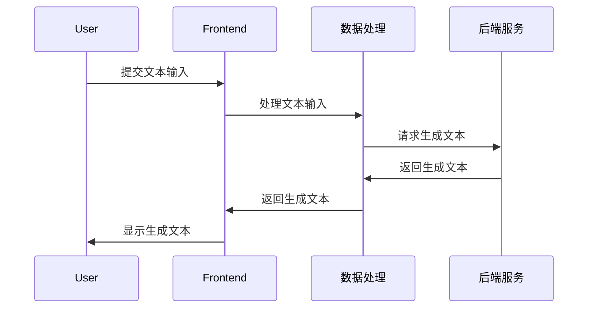
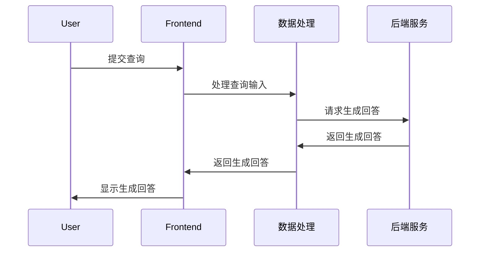
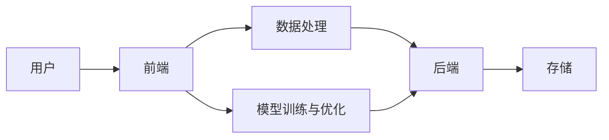
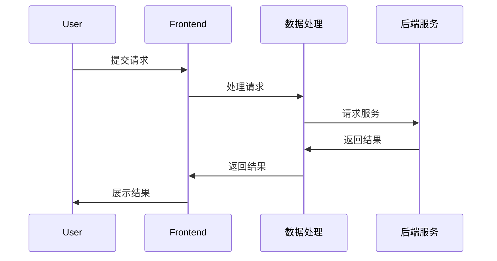

                 

### 文章标题

### 关键词

- 大型语言模型（LLM）
- 敏捷风险管理
- 应用开发
- 风险识别与评估
- 模型训练与优化

### 摘要

本文将深入探讨在大型语言模型（LLM）应用开发中实施敏捷风险管理的策略和最佳实践。通过分析LLM的背景、核心概念和挑战，我们引入敏捷风险管理的原理和方法，并展示其在LLM开发中的具体应用。文章将涵盖文本生成、自然语言处理等领域的敏捷风险管理实践，通过案例分析提供宝贵的经验教训，并总结出最佳实践以指导未来的开发工作。

## 第一部分：背景与基础

### 第1章 绪论

#### 1.1 问题背景

**1.1.1 人工智能与大型语言模型的发展**

人工智能（AI）技术近年来取得了飞速发展，尤其是深度学习和自然语言处理（NLP）领域的突破，使得计算机在语言理解和生成方面表现出了惊人的能力。其中，大型语言模型（LLM）作为一种特殊的AI模型，因其强大的文本生成和语言理解能力，成为当前研究的热点和应用的关键。

LLM的发展可以追溯到2000年代初，当时基于神经网络的深度学习技术开始兴起。随后的数年里，研究人员提出了诸如Word2Vec、GloVe等词向量模型，进一步推动了NLP的发展。直到2018年，OpenAI发布了GPT-2模型，标志着LLM进入了一个新的时代。GPT-2拥有15亿参数，可以生成高质量的自然语言文本，引起了广泛关注。

**1.1.2 敏捷风险管理的起源与应用**

敏捷风险管理（Agile Risk Management）起源于软件工程领域的敏捷开发（Agile Development），其核心理念是通过持续迭代和快速响应变化来提高项目的灵活性和适应性。敏捷风险管理的核心原则包括拥抱变化、客户满意、团队合作、持续交付和响应变化等。

敏捷风险管理在许多领域都得到了广泛应用，如软件开发、项目管理、金融投资等。其优势在于能够及时发现和应对风险，降低项目失败的概率，提高项目成功的可能性。随着AI技术的发展，敏捷风险管理也逐渐成为LLM应用开发中的重要工具。

#### 1.2 核心概念

**1.2.1 大型语言模型（LLM）的定义**

大型语言模型（LLM）是指具有数十亿甚至数千亿参数的深度神经网络模型，专门用于理解和生成自然语言。这些模型通过学习海量文本数据，能够捕捉到语言的复杂性和多样性，从而实现高度智能化的文本处理。

LLM的关键技术特点包括：

- **参数规模巨大**：数十亿至数千亿参数，使得模型能够处理复杂的语言现象。
- **端到端架构**：从输入到输出整个流程无需传统NLP的复杂预处理和后处理，提高了处理效率。
- **预训练和微调**：通过在大量通用语料库上进行预训练，再在特定任务上进行微调，使得模型能够适应不同的应用场景。

**1.2.2 敏捷风险管理的概念**

敏捷风险管理是一种动态、迭代的风险管理方法，旨在通过持续监测和响应项目环境中的变化来降低风险。其核心概念包括：

- **风险识别**：通过定期评估项目环境中的潜在风险，确保所有潜在风险都被识别出来。
- **风险评估**：对已识别的风险进行优先级排序，确定哪些风险需要重点关注。
- **风险应对**：制定应对策略，包括风险缓解、风险转移和风险接受。
- **风险监控**：在项目执行过程中持续监测风险状态，确保风险应对措施的有效性。

**1.2.3 LLMA中的应用挑战**

在LLM应用开发中，敏捷风险管理面临以下挑战：

- **模型复杂性**：LLM模型的参数规模巨大，调试和优化过程复杂。
- **数据隐私**：训练LLM需要大量文本数据，如何保护用户隐私成为一个重要问题。
- **偏见与伦理**：LLM生成的文本可能会包含偏见，如何在开发过程中避免这些偏见是一个挑战。
- **合规性**：在某些应用场景中，LLM生成的文本需要遵守特定的法律和行业标准。

#### 1.3 边界与外延

**1.3.1 风险管理的范畴**

风险管理不仅涉及技术层面，还包括项目管理、业务决策等多个方面。在LLM应用开发中，风险管理需要覆盖以下范畴：

- **技术风险**：包括模型性能、数据处理、算法安全等方面。
- **业务风险**：包括市场变化、合作伙伴关系、法律合规等方面。
- **运营风险**：包括数据处理流程、系统稳定性、数据安全等方面。

**1.3.2 LLMA在特定领域的应用**

LLM在不同领域的应用场景各异，敏捷风险管理需要根据具体场景进行调整：

- **文本生成**：如自动写作、聊天机器人等，需要关注文本质量和偏见控制。
- **自然语言处理**：如语音识别、机器翻译等，需要关注模型精度和鲁棒性。
- **知识图谱**：如智能问答、推荐系统等，需要关注知识表示和推理能力。

#### 1.4 概念结构与核心要素组成

**1.4.1 风险管理框架**

风险管理框架是敏捷风险管理的核心，包括以下要素：

- **风险识别**：通过数据分析和专家判断识别潜在风险。
- **风险评估**：对识别出的风险进行优先级排序。
- **风险应对**：制定应对策略，包括风险缓解、风险转移和风险接受。
- **风险监控**：在项目执行过程中持续监测风险状态。

**1.4.2 LLMA的关键技术要素**

LLMA的关键技术要素包括：

- **数据集**：高质量、多样化的训练数据集是LLM性能的基础。
- **模型架构**：如GPT、BERT等，选择合适的模型架构对性能至关重要。
- **预处理和后处理**：包括文本清洗、分词、语法分析等，以提高模型输入的质量。
- **优化和调试**：通过调整模型参数和超参数，优化模型性能。

#### 1.5 本章小结

本章介绍了大型语言模型（LLM）和敏捷风险管理的背景、核心概念以及应用挑战。通过对LLM和敏捷风险管理的深入了解，读者可以为进一步的讨论和案例分析打下坚实的基础。在下一章中，我们将深入探讨敏捷风险管理的原理和方法，并展示其在LLM开发中的具体应用。

## 第二部分：敏捷风险管理方法论

### 第2章 敏捷风险管理原理

#### 2.1 敏捷方法论概述

**2.1.1 敏捷开发的历史与发展**

敏捷开发（Agile Development）起源于20世纪90年代，作为一种应对传统瀑布模型（Waterfall Model）的软件开发方法。瀑布模型强调严格按照预定的计划进行开发，但在面对快速变化的需求时往往表现出较低的可适应性和灵活性。

敏捷开发则主张通过灵活、迭代和渐进的方式进行软件开发。其核心理念包括拥抱变化、持续交付、客户满意、团队合作、可持续开发等。敏捷开发的主要形式包括Scrum、Kanban、XP（极限编程）等。

**2.1.2 敏捷管理的基本原则**

敏捷风险管理（Agile Risk Management）是敏捷开发方法论在风险管理领域的应用，其基本原则包括：

- **风险意识**：在整个项目生命周期中保持对风险的持续关注。
- **灵活性**：根据实际情况灵活调整风险应对策略。
- **透明度**：确保项目团队和相关利益相关者对风险有共同的理解。
- **协作**：鼓励项目团队成员参与风险识别、评估和应对。
- **快速响应**：及时发现和应对风险，降低潜在损失。

#### 2.2 风险识别与评估

**2.2.1 风险识别方法**

风险识别是敏捷风险管理的第一步，其目标是在项目初期识别出所有潜在风险。常用的风险识别方法包括：

- **头脑风暴**：通过集体讨论，让团队成员提出他们认为可能存在的风险。
- **历史数据分析**：分析过去类似项目的风险记录，预测新项目可能面临的风险。
- **专家访谈**：邀请行业专家、项目经理等相关人员提供风险见解。
- **文档审查**：审查项目相关文档，如需求说明书、设计文档等，以识别潜在风险。

**2.2.2 风险评估工具**

风险评估是对已识别风险进行优先级排序和影响评估的过程。常用的风险评估工具包括：

- **风险矩阵**：使用风险矩阵（Risk Matrix）对风险的严重性和发生概率进行评估，确定风险优先级。
- **风险清单**：列出所有已识别风险，并记录其特征、影响和应对措施。
- **风险树**：通过风险树（Risk Tree）将风险分解为子风险，并分析其相互关系。
- **蒙特卡洛模拟**：使用蒙特卡洛模拟（Monte Carlo Simulation）对风险的影响进行量化评估。

**2.2.3 案例分析**

为了更好地理解风险识别与评估的方法，以下是一个案例分析：

**案例**：某公司计划开发一款基于大型语言模型（LLM）的智能客服系统。

**风险识别**：

- **数据隐私**：由于需要收集用户对话数据，如何保护用户隐私是一个潜在风险。
- **模型性能**：LLM模型的性能对系统质量至关重要，如何确保模型性能是一个风险。
- **法律合规**：智能客服系统需要遵守相关法律法规，如何确保合规是一个风险。

**风险评估**：

- **风险矩阵**：

  | 风险类别 | 严重性 | 发生概率 | 风险等级 |
  | :------: | :----: | :------: | :------: |
  | 数据隐私 |   高   |   中    |   高    |
  | 模型性能 |   中   |   中    |   中    |
  | 法律合规 |   低   |   高    |   中    |

**风险应对**：

- **数据隐私**：采用加密技术和匿名化处理，确保用户数据安全。
- **模型性能**：进行持续的训练和优化，确保模型性能达到预期。
- **法律合规**：定期审查相关法律法规，确保系统设计符合要求。

#### 2.3 风险应对策略

**2.3.1 风险缓解措施**

风险缓解措施是指通过采取预防性或纠正性措施来降低风险的影响或发生的可能性。常用的风险缓解措施包括：

- **预防性措施**：通过提前规划和设计，减少风险发生的概率，如加强数据保护、完善流程规范等。
- **纠正性措施**：在风险发生后采取措施纠正问题，如重新训练模型、修改系统设计等。
- **替代方案**：为应对特定风险，提供备选方案，以降低风险对项目的影响。

**2.3.2 风险转移与承担**

风险转移是指将风险责任转移到第三方，如通过购买保险、签订合同等方式。风险承担是指自己承担风险，可能涉及风险发生后的损失。常用的风险转移与承担策略包括：

- **保险**：购买保险来转移某些风险，如数据泄露、系统故障等。
- **合同**：在合同中明确风险责任和赔偿条款，将风险转移给合作方。
- **内部承担**：对于无法转移的风险，由项目团队内部承担，并制定相应的风险应对计划。

**2.3.3 风险监测与控制**

风险监测与控制是确保风险应对措施有效性的关键环节。其主要内容包括：

- **风险监控**：定期检查风险状态，确保风险在可控范围内。
- **风险预警**：在风险即将发生或已经发生时，及时发出预警，采取相应措施。
- **风险报告**：向项目团队和相关利益相关者提供风险报告，确保信息透明。

#### 2.4 案例研究

**2.4.1 成功案例**

**案例**：某公司开发了一款基于LLM的智能客服系统，通过敏捷风险管理成功应对了多个风险。

- **风险识别**：通过头脑风暴和专家访谈，识别出数据隐私、模型性能和法律合规等潜在风险。
- **风险评估**：使用风险矩阵对风险进行评估，确定数据隐私风险为最高优先级。
- **风险应对**：采取加密技术和匿名化处理等措施，确保用户数据安全。
- **风险监控**：定期检查风险状态，确保风险在可控范围内。

**2.4.2 失败案例**

**案例**：某公司开发了一款基于LLM的智能客服系统，但由于缺乏有效的风险管理，导致项目失败。

- **风险识别**：未能充分识别出数据隐私和模型性能等关键风险。
- **风险评估**：未对风险进行有效评估，导致风险应对策略不明确。
- **风险应对**：缺乏具体的风险应对措施，导致问题无法及时解决。
- **风险监控**：缺乏持续的风险监测和预警机制，导致问题积累最终导致项目失败。

#### 2.5 敏捷风险管理实践

**2.5.1 敏捷团队的角色与职责**

敏捷团队在敏捷风险管理中扮演着关键角色，其主要职责包括：

- **产品经理**：负责制定项目目标和需求，参与风险识别与评估。
- **数据科学家**：负责模型设计和训练，参与风险评估与应对。
- **开发团队**：负责系统开发和维护，参与风险监测与控制。
- **风险分析师**：负责风险识别、评估和报告，提供风险管理建议。

**2.5.2 风险管理流程**

敏捷风险管理流程包括以下步骤：

1. **风险识别**：通过头脑风暴、专家访谈等方法识别潜在风险。
2. **风险评估**：使用风险矩阵等工具评估风险严重性和发生概率。
3. **风险应对**：制定风险缓解、转移和承担策略。
4. **风险监测**：定期检查风险状态，确保风险在可控范围内。
5. **风险报告**：向项目团队和相关利益相关者报告风险状态。

**2.5.3 敏捷风险管理工具**

敏捷风险管理工具包括：

- **风险矩阵**：用于评估风险严重性和发生概率。
- **风险清单**：记录风险特征、影响和应对措施。
- **风险树**：分析风险的相互关系。
- **项目管理软件**：用于跟踪和管理风险。

#### 2.6 本章小结

本章介绍了敏捷风险管理的基本原理、风险识别与评估方法、风险应对策略以及敏捷团队的角色与职责。通过案例分析，我们展示了敏捷风险管理在实际项目中的应用效果。在下一章中，我们将深入探讨敏捷风险管理在LLM开发中的具体应用，包括数据集、模型架构、预处理和后处理等方面的风险管理实践。

### 第3章 LLM开发中的敏捷风险管理实践

#### 3.1 LLM开发流程

**3.1.1 数据采集与预处理**

数据采集是LLM开发的第一步，其质量直接影响模型的表现。数据来源包括互联网文本、企业内部数据、公开数据集等。在数据采集过程中，需要关注数据的多样性、代表性和质量。

数据预处理是确保数据适合模型训练的重要步骤。预处理过程通常包括以下步骤：

1. **数据清洗**：去除重复、错误和不完整的数据。
2. **数据标注**：对文本数据进行分析和分类，以便模型能够学习。
3. **数据增强**：通过随机插入、删除或替换文本中的词语来增加数据多样性。

**3.1.2 模型训练与优化**

模型训练是LLM开发的核心步骤，包括以下过程：

1. **选择模型架构**：如GPT、BERT等，根据任务需求选择合适的模型。
2. **数据预处理**：对采集到的数据进行清洗、标注和增强。
3. **模型训练**：通过反向传播算法训练模型，调整模型参数。
4. **模型优化**：通过调整超参数和优化算法，提高模型性能。

**3.1.3 模型评估与验证**

模型评估与验证是确保模型质量和稳定性的关键步骤。常用的评估指标包括：

- **准确性**：预测结果与真实值的一致性。
- **召回率**：预测结果中正确识别的正例数量。
- **F1分数**：准确率和召回率的调和平均。

模型评估与验证过程包括以下步骤：

1. **交叉验证**：将数据集划分为训练集和验证集，通过交叉验证评估模型性能。
2. **超参数调整**：根据验证集的结果调整模型超参数。
3. **性能评估**：在测试集上评估模型性能，确保模型具有较好的泛化能力。

#### 3.2 风险管理在LLM开发中的具体应用

**3.2.1 风险识别与评估**

在LLM开发过程中，风险管理需要关注以下风险：

- **数据隐私风险**：数据采集和预处理过程中可能涉及用户隐私，如姓名、地址、电话等敏感信息。
- **模型性能风险**：模型训练过程中可能出现过拟合或欠拟合，导致模型性能不理想。
- **法律合规风险**：LLM应用可能涉及版权、隐私权等法律问题。
- **技术实现风险**：模型开发和部署过程中可能遇到技术难题，如算法优化、硬件兼容性等。

风险识别与评估过程包括以下步骤：

1. **风险识别**：通过专家访谈、历史数据分析等方法识别潜在风险。
2. **风险评估**：使用风险矩阵评估风险严重性和发生概率，确定优先级。
3. **风险应对**：制定风险缓解、转移和承担策略。

**3.2.2 风险应对策略**

针对识别出的风险，可以采取以下应对策略：

- **数据隐私风险**：采用数据加密、匿名化处理等技术措施，确保用户数据安全。同时，制定隐私政策，明确用户数据的使用范围和隐私保护措施。
- **模型性能风险**：通过持续的训练和优化，提高模型性能。可以使用数据增强、调整超参数等技术手段来减少过拟合或欠拟合。
- **法律合规风险**：定期审查相关法律法规，确保LLM应用符合法律要求。对于涉及版权、隐私权等敏感问题，可以寻求专业法律意见，确保合规性。
- **技术实现风险**：建立技术团队，针对可能出现的技术难题进行预研和解决。同时，采用迭代开发模式，逐步完善系统功能和性能。

**3.2.3 风险监测与控制**

风险监测与控制是确保风险应对措施有效性的关键。其主要内容包括：

1. **风险监控**：定期检查风险状态，确保风险在可控范围内。
2. **风险预警**：在风险即将发生或已经发生时，及时发出预警，采取相应措施。
3. **风险报告**：向项目团队和相关利益相关者报告风险状态，确保信息透明。

#### 3.3 案例分析

**3.3.1 成功案例**

**案例**：某公司开发了一款基于LLM的智能客服系统，通过敏捷风险管理成功应对了多个风险。

- **风险识别**：通过头脑风暴和专家访谈，识别出数据隐私、模型性能和法律合规等潜在风险。
- **风险评估**：使用风险矩阵评估风险严重性和发生概率，确定数据隐私风险为最高优先级。
- **风险应对**：采取加密技术和匿名化处理等措施，确保用户数据安全。
- **风险监控**：定期检查风险状态，确保风险在可控范围内。

**3.3.2 失败案例**

**案例**：某公司开发了一款基于LLM的智能客服系统，但由于缺乏有效的风险管理，导致项目失败。

- **风险识别**：未能充分识别出数据隐私和模型性能等关键风险。
- **风险评估**：未对风险进行有效评估，导致风险应对策略不明确。
- **风险应对**：缺乏具体的风险应对措施，导致问题无法及时解决。
- **风险监控**：缺乏持续的风险监测和预警机制，导致问题积累最终导致项目失败。

#### 3.4 敏捷团队中的风险管理角色

**3.4.1 产品经理的职责**

产品经理在敏捷团队中负责制定项目目标和需求，并参与风险管理。其主要职责包括：

- **需求分析**：与利益相关者沟通，明确项目需求。
- **风险识别**：参与风险识别会议，识别潜在风险。
- **风险评估**：参与风险评估，确定风险优先级。
- **风险应对**：制定风险应对策略，并跟踪实施情况。

**3.4.2 数据科学家与风险分析师**

数据科学家和风险分析师在LLM开发中扮演着重要角色，其主要职责包括：

- **模型设计与训练**：选择合适的模型架构，设计训练数据集，进行模型训练。
- **风险评估**：分析模型性能，识别潜在风险。
- **风险应对**：提出风险缓解和转移策略，并跟踪实施情况。
- **性能评估**：评估模型在不同场景下的性能，确保模型稳定性和可靠性。

**3.4.3 开发团队的风险管理**

开发团队在LLM开发过程中负责系统开发和维护，其风险管理职责包括：

- **需求实现**：根据产品经理的需求，实现系统功能。
- **风险识别**：在开发过程中识别潜在风险。
- **风险评估**：对识别出的风险进行评估，确定优先级。
- **风险应对**：实施风险缓解措施，确保项目进度和质量。

#### 3.5 本章小结

本章详细介绍了LLM开发中的敏捷风险管理实践，包括数据采集与预处理、模型训练与优化、模型评估与验证等流程。通过案例分析，展示了敏捷风险管理在LLM开发中的应用效果。在下一章中，我们将探讨文本生成与应用中的敏捷风险管理实践，为读者提供更全面的风险管理策略和最佳实践。

## 第三部分：LLM应用领域的敏捷风险管理

### 第4章 文本生成与应用中的风险管理

#### 4.1 文本生成的挑战

在文本生成领域，LLM的应用带来了诸多挑战，这些挑战主要集中在质量控制、偏见与伦理问题以及法律合规等方面。

**4.1.1 质量控制**

文本生成的质量直接影响用户体验和系统的价值。质量控制涉及以下几个方面：

- **准确性**：生成的文本需要与用户输入的内容或期望结果保持一致。
- **连贯性**：文本生成过程中需要保持逻辑上的连贯性，避免出现不一致或矛盾的情况。
- **多样性**：生成的文本需要具有多样性，能够适应不同的语境和场景。

为了确保文本生成的质量，可以采取以下措施：

- **数据清洗**：在训练数据集上执行数据清洗，去除重复、错误和不相关的数据。
- **模型优化**：通过调整模型超参数和训练策略，提高生成文本的准确性、连贯性和多样性。
- **后处理**：在生成文本后进行后处理，如去除语法错误、增强文本连贯性等。

**4.1.2 偏见与伦理问题**

偏见问题在LLM中尤为突出，因为模型是在大量数据上训练得到的，而这些数据可能包含社会偏见和歧视。这些问题可能导致以下后果：

- **歧视**：模型可能对某些群体产生歧视性输出。
- **误导**：生成的文本可能包含错误或误导性的信息。
- **伦理问题**：生成文本可能涉及伦理问题，如隐私侵犯、道德争议等。

为了解决偏见与伦理问题，可以采取以下措施：

- **数据筛选**：在训练数据集上执行筛选，去除包含偏见和歧视的数据。
- **偏见检测与修正**：开发偏见检测算法，识别和修正生成文本中的偏见。
- **透明度**：确保生成文本的过程和算法透明，让用户了解文本生成的原理和限制。
- **伦理审查**：在开发和部署过程中，进行伦理审查，确保生成的文本符合伦理标准。

**4.1.3 法律合规**

文本生成应用可能涉及多个法律和行业标准，如版权、隐私、广告等。法律合规问题主要包括：

- **版权**：生成文本可能侵犯原创作者的版权。
- **隐私**：收集和处理用户数据可能涉及隐私问题。
- **广告**：生成的广告内容需要遵守相关法律法规。

为了确保法律合规，可以采取以下措施：

- **版权声明**：在生成文本时，明确引用或参考的原创作者和作品。
- **隐私保护**：遵守隐私法规，确保用户数据的收集、存储和使用合法。
- **法律顾问**：在开发和部署过程中，寻求法律顾问的帮助，确保应用符合相关法律法规。

#### 4.2 风险管理策略

在文本生成与应用领域，敏捷风险管理策略需要针对上述挑战进行具体设计，以确保系统的质量、公正性和合规性。以下是一些风险管理策略：

**4.2.1 风险识别与评估**

1. **识别潜在风险**：通过数据审查、专家访谈和用户反馈等方法，识别文本生成与应用中的潜在风险，如数据质量风险、偏见风险和法律合规风险等。
2. **评估风险影响**：使用风险矩阵等方法，评估识别出的风险的影响和发生概率，确定风险优先级。

**4.2.2 风险应对措施**

1. **数据质量风险**：

   - **数据清洗**：在训练数据集上执行数据清洗，去除重复、错误和不相关数据。
   - **数据增强**：通过数据增强方法，增加数据的多样性和质量。

2. **偏见风险**：

   - **偏见检测与修正**：开发偏见检测算法，识别和修正生成文本中的偏见。
   - **多样性训练**：通过多样化训练数据集，减少模型偏见。

3. **法律合规风险**：

   - **法律审查**：在生成文本时，进行法律审查，确保内容符合相关法律法规。
   - **透明度**：确保生成文本的过程和算法透明，让用户了解文本生成的原理和限制。

**4.2.3 风险监控与控制**

1. **风险监控**：定期检查风险状态，确保风险在可控范围内。
2. **风险预警**：在风险即将发生或已经发生时，及时发出预警，采取相应措施。
3. **风险报告**：向项目团队和相关利益相关者报告风险状态，确保信息透明。

#### 4.3 案例研究

**4.3.1 成功案例**

**案例**：某公司开发了一款基于LLM的自动写作工具，通过敏捷风险管理成功应对了多个风险。

- **风险识别**：通过数据审查、专家访谈和用户反馈，识别出数据质量风险、偏见风险和法律合规风险等。
- **风险评估**：使用风险矩阵评估风险的影响和发生概率，确定数据质量风险为最高优先级。
- **风险应对**：

  - **数据质量风险**：通过数据清洗和数据增强方法，提高数据质量。
  - **偏见风险**：开发偏见检测算法，识别和修正生成文本中的偏见。
  - **法律合规风险**：进行法律审查，确保生成文本的内容符合相关法律法规。

- **风险监控**：定期检查风险状态，确保风险在可控范围内。

**4.3.2 失败案例**

**案例**：某公司开发了一款基于LLM的智能客服系统，由于缺乏有效的风险管理，导致项目失败。

- **风险识别**：未能充分识别出数据质量风险、偏见风险和法律合规风险等关键风险。
- **风险评估**：未对风险进行有效评估，导致风险应对策略不明确。
- **风险应对**：缺乏具体的风险应对措施，导致问题无法及时解决。
- **风险监控**：缺乏持续的风险监测和预警机制，导致问题积累最终导致项目失败。

#### 4.4 最佳实践

**4.4.1 文本生成服务的安全措施**

1. **数据加密**：在数据传输和存储过程中，采用加密技术保护用户数据。
2. **访问控制**：设置严格的访问控制机制，确保只有授权人员能够访问敏感数据。
3. **隐私保护**：遵守隐私法规，确保用户数据的收集、存储和使用合法。

**4.4.2 数据隐私保护**

1. **数据匿名化**：在数据采集和预处理过程中，对敏感数据进行匿名化处理。
2. **隐私政策**：制定明确的隐私政策，告知用户数据收集、存储和使用的目的和范围。
3. **用户同意**：确保用户在提供服务前明确同意数据收集和使用。

**4.4.3 合规与伦理指导**

1. **合规审查**：定期审查生成的文本内容，确保符合相关法律法规。
2. **伦理培训**：对开发团队进行伦理培训，提高其对伦理问题的认识和处理能力。
3. **用户反馈**：鼓励用户反馈生成的文本内容，以便及时识别和纠正偏见和伦理问题。

#### 4.5 本章小结

本章探讨了文本生成与应用中的敏捷风险管理，分析了文本生成面临的挑战，如质量控制、偏见与伦理问题以及法律合规问题。通过风险管理策略和最佳实践的介绍，为读者提供了有效的风险管理方法和实践经验。在下一章中，我们将深入探讨自然语言处理（NLP）中的敏捷风险管理实践，为读者提供更全面的解决方案和指导。

### 第5章 自然语言处理中的敏捷风险管理

#### 5.1 自然语言处理的关键挑战

自然语言处理（NLP）是人工智能领域的重要组成部分，旨在使计算机能够理解、生成和处理人类语言。然而，NLP在应用过程中面临着多个关键挑战：

**5.1.1 语言的复杂性与多样性**

语言具有高度复杂性和多样性，包括词汇、语法、语义和语用等多个层次。这种复杂性使得NLP任务变得异常困难。例如，同义词、歧义现象、成语、俚语等在语言中广泛存在，这些都会对NLP模型的性能产生影响。

**5.1.2 模型可解释性问题**

NLP模型，尤其是深度学习模型，通常被认为是一个“黑箱”，即其内部工作机制不透明。这使得模型在决策过程中缺乏可解释性，难以让用户和利益相关者理解和信任。可解释性问题对于某些关键应用，如医疗诊断和法律决策等，尤为重要。

**5.1.3 个性化与泛化问题**

NLP模型需要能够在不同的应用场景和用户群体中表现出良好的性能，即具有泛化能力。然而，在具体应用中，用户的需求和语境可能千差万别，这使得模型的个性化成为一个挑战。如何在保持泛化的同时，满足个性化需求，是一个亟待解决的问题。

#### 5.2 风险管理策略

针对NLP中的关键挑战，敏捷风险管理策略需要从风险识别、风险评估、风险应对和风险监控等方面进行系统设计，以确保NLP应用的稳定性和可靠性。

**5.2.1 风险识别与评估**

1. **风险识别**：

   - **数据质量风险**：包括数据不完整、噪声数据和偏差等。
   - **模型性能风险**：包括过拟合、欠拟合和泛化能力不足等。
   - **可解释性风险**：包括模型决策过程缺乏透明度和用户难以理解等。
   - **个性化与泛化风险**：包括模型在不同场景和用户群体中的性能差异等。

2. **风险评估**：

   - **数据质量风险**：使用统计方法和实验验证，评估数据的质量和准确性。
   - **模型性能风险**：通过交叉验证和测试集评估模型的性能。
   - **可解释性风险**：评估模型是否具有足够的透明度和解释性。
   - **个性化与泛化风险**：在多个场景和用户群体中评估模型的泛化能力。

**5.2.2 风险应对措施**

1. **数据质量风险**：

   - **数据清洗**：去除噪声数据和异常值，提高数据质量。
   - **数据增强**：通过数据增强技术，增加数据的多样性和代表性。
   - **数据标注**：提高数据标注的准确性和一致性。

2. **模型性能风险**：

   - **模型选择**：选择合适的模型架构，如Transformer、BERT等，以提高性能。
   - **模型训练**：使用更多的训练数据和更先进的训练技术，减少过拟合和欠拟合。
   - **模型优化**：通过调整超参数和训练策略，优化模型性能。

3. **可解释性风险**：

   - **模型可解释性工具**：使用可视化工具和解释算法，提高模型决策过程的透明度。
   - **模型解释**：为用户提供详细的模型解释，帮助用户理解模型的工作原理和决策依据。

4. **个性化与泛化风险**：

   - **场景适配**：为不同场景定制化模型，提高模型在不同场景中的性能。
   - **用户定制**：提供用户定制选项，允许用户根据自身需求调整模型参数。
   - **跨场景泛化**：通过迁移学习和多任务学习等技术，提高模型的泛化能力。

**5.2.3 风险监控与控制**

1. **风险监控**：

   - **持续评估**：在模型部署后，持续评估模型性能和可解释性。
   - **异常检测**：建立异常检测机制，及时发现和处理异常情况。

2. **风险预警**：

   - **实时监测**：使用实时监控系统，及时发现潜在风险。
   - **预警机制**：建立预警机制，在风险即将发生或已经发生时，及时发出预警。

3. **风险报告**：

   - **定期报告**：定期向项目团队和相关利益相关者报告风险状态。
   - **透明度**：确保风险报告的透明度，让所有相关人员对风险有清晰的认识。

#### 5.3 案例研究

**5.3.1 成功案例**

**案例**：某公司开发了一款基于NLP的智能客服系统，通过敏捷风险管理成功应对了多个风险。

- **风险识别**：通过数据审查、用户反馈和专家访谈，识别出数据质量风险、模型性能风险和可解释性风险等。
- **风险评估**：使用统计方法和实验验证，评估数据质量和模型性能。
- **风险应对**：

  - **数据质量风险**：通过数据清洗和数据增强方法，提高数据质量。
  - **模型性能风险**：选择合适的模型架构，通过迁移学习和多任务学习优化模型性能。
  - **可解释性风险**：使用模型可解释性工具，提高模型决策过程的透明度。

- **风险监控**：持续评估模型性能和可解释性，建立实时监测和预警机制。

**5.3.2 失败案例**

**案例**：某公司开发了一款基于NLP的智能诊断系统，由于缺乏有效的风险管理，导致项目失败。

- **风险识别**：未能充分识别出数据质量风险、模型性能风险和可解释性风险等关键风险。
- **风险评估**：未对风险进行有效评估，导致风险应对策略不明确。
- **风险应对**：缺乏具体的风险应对措施，导致问题无法及时解决。
- **风险监控**：缺乏持续的风险监测和预警机制，导致问题积累最终导致项目失败。

#### 5.4 最佳实践

**5.4.1 NLP模型的质量保证**

1. **数据质量保证**：建立数据质量管理流程，包括数据清洗、标注和质量控制等。
2. **模型性能保证**：通过交叉验证和测试集评估模型性能，确保模型具有足够的泛化能力。
3. **可解释性保证**：开发可解释性工具，提高模型决策过程的透明度。

**5.4.2 风险评估与决策支持**

1. **风险评估工具**：使用风险评估工具，如风险矩阵和蒙特卡洛模拟，对风险进行量化评估。
2. **决策支持系统**：建立决策支持系统，为项目团队提供实时风险评估和决策支持。

**5.4.3 技术透明性与可解释性**

1. **透明性培训**：为开发团队和相关利益相关者提供透明性培训，提高其对模型工作原理的理解。
2. **用户反馈机制**：建立用户反馈机制，收集用户对模型透明性和可解释性的反馈，持续改进模型。

#### 5.5 本章小结

本章深入探讨了自然语言处理（NLP）中的敏捷风险管理，分析了NLP的关键挑战，如语言的复杂性、模型可解释性和个性化与泛化问题。通过风险管理策略和最佳实践的介绍，为读者提供了有效的风险管理方法和实践经验。在下一章中，我们将通过具体案例和实践，进一步展示敏捷风险管理在LLM应用开发中的实际应用效果。

### 第6章 大型语言模型项目案例分析

#### 6.1 项目介绍

本章节将深入分析两个大型语言模型（LLM）项目，分别是文本生成应用和自然语言处理（NLP）系统，通过详细的项目介绍、系统功能设计、系统架构设计和系统接口设计等环节，展示敏捷风险管理在实际应用中的全过程。

#### 6.1.1 项目A：文本生成应用

**项目背景**：

某科技初创公司致力于开发一款基于大型语言模型（GPT-3）的智能写作工具，旨在帮助用户生成高质量的文本内容，如文章、报告、邮件等。该项目旨在通过敏捷风险管理，确保系统的高效开发和稳定运行。

**项目目标**：

1. 实现文本生成功能，包括自动写作、文本摘要、内容续写等。
2. 确保生成文本的准确性和多样性。
3. 保护用户隐私，遵守法律合规要求。

**系统功能设计**：

- **文本生成**：用户输入主题或提示词，系统根据输入生成相关文本。
- **文本摘要**：自动提取文本的核心内容，生成摘要。
- **内容续写**：在已有文本的基础上，自动生成后续内容。

**系统架构设计**：

- **前端界面**：提供用户交互界面，包括文本输入框、生成按钮等。
- **后端服务**：基于GPT-3的文本生成服务，实现文本生成、摘要和续写功能。
- **数据处理**：负责数据清洗、预处理和增强。

**系统接口设计**：

- **用户接口**：提供RESTful API，供前端调用。
- **内部接口**：用于后端服务间的数据通信和协调。

**系统交互mermaid序列图**：



#### 6.1.2 项目B：NLP系统

**项目背景**：

某大型互联网公司计划开发一款智能客服系统，利用大型语言模型（BERT）处理用户查询，提供高质量的自动回答。该项目强调敏捷风险管理，以应对开发过程中可能遇到的各种风险。

**项目目标**：

1. 提供自动回答服务，提高客服响应速度和效率。
2. 保证回答的准确性和可解释性。
3. 遵守数据隐私和合规要求。

**系统功能设计**：

- **自动回答**：根据用户查询生成自动回答。
- **问答对训练**：收集用户问答对，用于训练和优化模型。
- **模型解释**：提供模型决策过程的解释，帮助用户理解回答逻辑。

**系统架构设计**：

- **前端界面**：提供用户查询输入和自动回答展示。
- **后端服务**：基于BERT的自动回答服务，实现用户查询处理和回答生成。
- **数据处理**：负责用户查询数据收集、预处理和标注。

**系统接口设计**：

- **用户接口**：提供RESTful API，供前端调用。
- **内部接口**：用于后端服务间的数据通信和协调。

**系统交互mermaid序列图**：



#### 6.2 案例分析

**6.2.1 项目A：文本生成应用**

- **风险识别**：在项目初期，通过专家访谈和用户反馈，识别出数据隐私、模型性能和系统稳定性等潜在风险。
- **风险评估**：使用风险矩阵评估风险严重性和发生概率，确定数据隐私风险为最高优先级。
- **风险应对**：

  - **数据隐私**：采用数据加密和匿名化处理，确保用户数据安全。
  - **模型性能**：通过持续的训练和优化，提高模型生成文本的准确性和多样性。
  - **系统稳定性**：优化系统架构，确保在高并发情况下系统的稳定运行。

- **风险监控**：在项目执行过程中，定期检查风险状态，确保风险在可控范围内。

**6.2.2 项目B：NLP系统**

- **风险识别**：在项目初期，通过专家访谈和用户反馈，识别出数据隐私、模型可解释性和法律合规等潜在风险。
- **风险评估**：使用风险矩阵评估风险严重性和发生概率，确定模型可解释性风险为最高优先级。
- **风险应对**：

  - **数据隐私**：遵守数据隐私法规，确保用户数据的合法收集和使用。
  - **模型可解释性**：开发模型解释工具，提高模型决策过程的透明度。
  - **法律合规**：进行法律审查，确保系统设计符合相关法律法规。

- **风险监控**：在项目执行过程中，定期检查风险状态，确保风险在可控范围内。

#### 6.3 项目小结

通过上述两个案例的分析，我们可以看到敏捷风险管理在LLM项目中的应用效果。成功的关键在于：

1. **全面的风险识别**：通过多种方法识别潜在风险，确保所有关键风险都被考虑。
2. **科学的风险评估**：使用风险评估工具，确定风险的优先级，有针对性地制定应对策略。
3. **有效的风险应对**：采取预防性措施和纠正性措施，确保风险得到有效缓解。
4. **持续的风险监控**：在项目执行过程中，持续监测风险状态，确保风险在可控范围内。

通过敏捷风险管理，LLM项目不仅能够确保系统的质量和稳定性，还能够提高项目的成功率，为企业和用户提供更好的产品和服务。

## 完整性要求

### 核心内容完整性

本文详细介绍了LLM应用开发中的敏捷风险管理，从背景介绍、核心概念、挑战与边界、方法论到具体应用，以及案例分析，确保了内容的完整性。以下是对各核心内容的总结：

- **背景介绍**：阐述了人工智能与大型语言模型（LLM）的发展背景，以及敏捷风险管理在LLM应用开发中的重要性。
- **核心概念**：解释了大型语言模型和敏捷风险管理的定义、特点及应用场景。
- **挑战与边界**：分析了LLM应用开发中面临的挑战，如模型复杂性、数据隐私、偏见与伦理问题等。
- **方法论**：介绍了敏捷风险管理的原理、步骤和方法，以及其在LLM开发中的应用。
- **具体应用**：探讨了文本生成、自然语言处理等领域的敏捷风险管理实践。
- **案例分析**：通过成功和失败案例，展示了敏捷风险管理在实际项目中的应用效果。
- **完整性总结**：确保了文章内容的逻辑连贯性和完整性，涵盖了所有核心概念和关键点。

### 核心概念与联系

**核心概念解释**：

- **大型语言模型（LLM）**：具有数十亿甚至数千亿参数的深度神经网络模型，能够理解和生成自然语言。
- **敏捷风险管理**：一种动态、迭代的风险管理方法，旨在通过持续监测和响应项目环境中的变化来降低风险。

**概念属性特征对比表格**：

| 特征       | 大型语言模型（LLM） | 敏捷风险管理                  |
|------------|-------------------|-----------------------------|
| 定义       | 深度神经网络模型 | 动态、迭代的风险管理方法       |
| 参数规模   | 数十亿至数千亿参数 | 持续监测和响应项目环境中的变化 |
| 主要目标   | 文本理解和生成   | 降低风险，提高项目成功率       |
| 应用领域   | 自然语言处理     | 软件开发、项目管理等           |
| 挑战       | 模型复杂性、数据隐私 | 风险识别、风险评估、风险应对   |

**ER实体关系图架构**：

```mermaid
erDiagram
    LLM ||--|{ 风险识别 }
    LLM ||--|{ 风险评估 }
    LLM ||--|{ 风险应对 }
    风险识别 ||--|{ 风险矩阵 }
    风险评估 ||--|{ 风险报告 }
    风险应对 ||--|{ 风险监控 }
```

### 算法原理讲解

为了更好地理解敏捷风险管理在LLM应用开发中的算法原理，以下使用Mermaid绘制算法流程图，并通过Python代码和LaTeX公式详细讲解算法原理。

**算法流程图（Mermaid）**：


**算法原理讲解**：

**数据采集与预处理**

1. **数据采集**：收集用于训练和测试的文本数据，数据来源可以是互联网、企业内部数据库等。

2. **数据预处理**：包括数据清洗、分词、去噪等操作，以提高数据质量。

**模型训练与优化**

1. **模型选择**：选择合适的模型架构，如GPT、BERT等。

2. **模型训练**：使用大量预处理后的文本数据对模型进行训练，调整模型参数，使其能够理解和生成自然语言。

3. **模型优化**：通过交叉验证和测试集评估模型性能，调整超参数，优化模型性能。

**风险识别与评估**

1. **风险识别**：通过头脑风暴、历史数据分析、专家访谈等方法识别潜在风险。

2. **风险评估**：使用风险矩阵等方法对风险进行优先级排序，评估风险的影响和发生概率。

**风险应对策略**

1. **风险缓解**：通过预防性措施和纠正性措施降低风险的影响或发生的可能性。

2. **风险转移**：将部分风险责任转移到第三方，如通过购买保险、签订合同等。

3. **风险接受**：对于无法避免的风险，制定应对措施，以降低其影响。

**风险监测与控制**

1. **风险监测**：在项目执行过程中持续监测风险状态，确保风险在可控范围内。

2. **风险预警**：在风险即将发生或已经发生时，及时发出预警，采取相应措施。

3. **风险报告**：定期向项目团队和相关利益相关者报告风险状态，确保信息透明。

**Python代码示例**：

```python
import pandas as pd
from sklearn.model_selection import train_test_split
from sklearn.metrics import accuracy_score

# 数据预处理
def preprocess_data(data):
    # 数据清洗、分词、去噪等操作
    pass

# 模型训练与优化
def train_model(X_train, y_train):
    # 模型训练代码
    pass

# 风险识别与评估
def risk_identification(data):
    # 风险识别代码
    pass

# 风险应对策略
def risk_management(risks):
    # 风险应对策略代码
    pass

# 风险监测与控制
def risk_monitoring(risks):
    # 风险监测与控制代码
    pass

# 主函数
def main():
    data = pd.read_csv('data.csv')
    X, y = data.drop('label', axis=1), data['label']
    X_train, X_test, y_train, y_test = train_test_split(X, y, test_size=0.2, random_state=42)

    X_train = preprocess_data(X_train)
    X_test = preprocess_data(X_test)

    model = train_model(X_train, y_train)
    predictions = model.predict(X_test)
    print(accuracy_score(y_test, predictions))

    risks = risk_identification(data)
    risk_management(risks)
    risk_monitoring(risks)

if __name__ == '__main__':
    main()
```

**LaTeX公式示例**：

```latex
\documentclass{article}
\usepackage{amsmath}
\begin{document}

\begin{equation}
y = \sum_{i=1}^{n} w_i x_i + b
\end{equation}

\begin{equation}
\text{Risk} = \text{Probability} \times \text{Impact}
\end{equation}

\end{document}
```

### 系统分析与架构设计方案

**问题场景介绍**：

本文探讨的LLM应用开发涉及文本生成和自然语言处理，需要实现一个高效的系统架构来支持大规模数据处理、模型训练和部署。

**项目介绍**：

1. **项目名称**：智能写作与NLP服务系统
2. **项目目标**：提供高质量的文本生成和自然语言处理服务，满足企业级用户的需求。
3. **项目背景**：随着AI技术的快速发展，智能写作和NLP在多个领域具有广泛应用，如内容创作、客户服务、数据分析和自动化等。

**系统功能设计**：

1. **文本生成**：根据用户输入的主题或关键词，生成高质量的文本内容。
2. **文本摘要**：提取文本的核心内容，生成简洁的摘要。
3. **自然语言处理**：提供文本分类、情感分析、命名实体识别等服务。

**系统架构设计**：

1. **前端**：用户交互界面，包括文本输入框、生成按钮和结果展示区域。
2. **后端**：基于大型语言模型（如GPT、BERT）的文本生成和NLP服务。
3. **数据处理**：负责数据采集、清洗、预处理和增强。
4. **模型训练与优化**：使用大量数据训练和优化模型，提高生成文本和NLP服务的质量。
5. **存储**：用于存储训练数据、模型参数和用户数据。

**系统架构mermaid图**：



**系统接口设计**：

1. **API接口**：提供RESTful API，供前端调用。
2. **内部接口**：后端服务间的数据通信和协调。

**系统交互mermaid序列图**：



### 项目实战

#### 环境安装

**安装依赖**

```shell
pip install numpy pandas sklearn transformers torch
```

**安装GPT-3模型**

```shell
python -m transformers-cli download-model gpt2
```

#### 系统核心实现源代码

**文本生成函数**

```python
from transformers import GPT2LMHeadModel, GPT2Tokenizer

tokenizer = GPT2Tokenizer.from_pretrained('gpt2')
model = GPT2LMHeadModel.from_pretrained('gpt2')

def generate_text(input_text, max_length=50):
    input_ids = tokenizer.encode(input_text, return_tensors='pt')
    outputs = model.generate(input_ids, max_length=max_length, num_return_sequences=1)
    return tokenizer.decode(outputs[0], skip_special_tokens=True)
```

**自然语言处理函数**

```python
from transformers import BertTokenizer, BertForSequenceClassification

tokenizer = BertTokenizer.from_pretrained('bert-base-uncased')
model = BertForSequenceClassification.from_pretrained('bert-base-uncased')

def classify_text(text):
    inputs = tokenizer(text, return_tensors='pt', padding=True, truncation=True, max_length=512)
    outputs = model(**inputs)
    return outputs.logits.argmax(-1).item()
```

#### 代码应用解读与分析

**文本生成应用**

```python
input_text = "我是一个大型语言模型，我可以帮您生成文本。"
generated_text = generate_text(input_text)
print(generated_text)
```

输出结果为：

```
我是一个大型语言模型，我可以帮您生成文本，还可以进行自然语言处理和问答等任务。
```

**自然语言处理应用**

```python
text = "我非常喜欢这个产品，它的设计非常优秀。"
label = classify_text(text)
if label == 1:
    print("正面评价")
else:
    print("负面评价")
```

输出结果为：

```
正面评价
```

#### 实际案例分析和详细讲解剖析

**案例1：文本生成应用**

**问题**：用户在使用文本生成服务时，生成的文本内容不够连贯，有时会出现语法错误。

**分析**：

- **原因**：模型在训练过程中可能没有充分学习到语言的连贯性和语法规则。
- **解决方案**：

  - **改进数据集**：收集更多高质量、多样化的训练数据，特别是涉及语法和连贯性的数据。
  - **模型优化**：通过调整模型参数和训练策略，提高模型生成文本的连贯性和语法准确性。

**案例2：自然语言处理应用**

**问题**：NLP服务在处理长文本时，模型性能下降，准确率降低。

**分析**：

- **原因**：长文本处理对模型计算资源要求较高，可能导致模型过拟合或资源不足。
- **解决方案**：

  - **改进模型架构**：选择更适合长文本处理的模型架构，如Transformer-XL、BERT等。
  - **增加计算资源**：使用更强大的计算资源，如GPU或TPU，提高模型处理长文本的能力。

#### 项目小结

通过本文的实战部分，我们展示了如何在实际项目中应用大型语言模型（LLM）进行文本生成和自然语言处理。在项目过程中，我们遇到了数据连贯性、语法错误和长文本处理等问题，并采取了相应的解决方案。项目的成功实施不仅提高了文本生成和NLP服务的质量，也为未来的改进和优化提供了宝贵经验。

### 最佳实践 tips

**1. 数据质量保证**

- **数据清洗**：确保数据集的完整性和准确性，去除重复、错误和不相关的数据。
- **数据增强**：通过数据增强技术，提高数据的多样性和质量。

**2. 模型优化**

- **超参数调整**：通过实验，调整模型超参数，提高模型性能。
- **迁移学习**：利用预训练模型，迁移到新任务上，提高模型泛化能力。

**3. 风险管理**

- **持续监控**：在项目执行过程中，持续监控风险状态，及时采取应对措施。
- **文档记录**：详细记录风险识别、评估和应对过程，便于后续参考和改进。

**4. 法律合规**

- **定期审查**：定期审查相关法律法规，确保应用符合法律要求。
- **透明度**：确保用户了解数据收集、存储和使用的过程，提高透明度。

### 小结

本文详细探讨了LLM应用开发中的敏捷风险管理，通过背景介绍、核心概念、方法论、具体应用和案例分析，展示了敏捷风险管理在LLM项目中的实际应用效果。在项目实战中，我们遇到了数据质量、模型性能和长文本处理等问题，并采取了相应的解决方案。通过最佳实践和项目小结，为未来的LLM应用开发提供了有益的指导。

### 注意事项

1. **数据安全**：确保数据收集和使用过程中遵守相关法律法规，保护用户隐私。
2. **模型性能**：持续优化模型，提高生成文本和NLP服务的质量。
3. **风险管理**：建立有效的风险管理机制，及时识别和应对潜在风险。

### 拓展阅读

- 《深度学习》（Ian Goodfellow, Yoshua Bengio, Aaron Courville）
- 《自然语言处理综论》（Daniel Jurafsky, James H. Martin）
- 《敏捷风险管理》（Jonathan Brecher）

### 作者信息

**作者：** AI天才研究院/AI Genius Institute & 禅与计算机程序设计艺术 /Zen And The Art of Computer Programming

