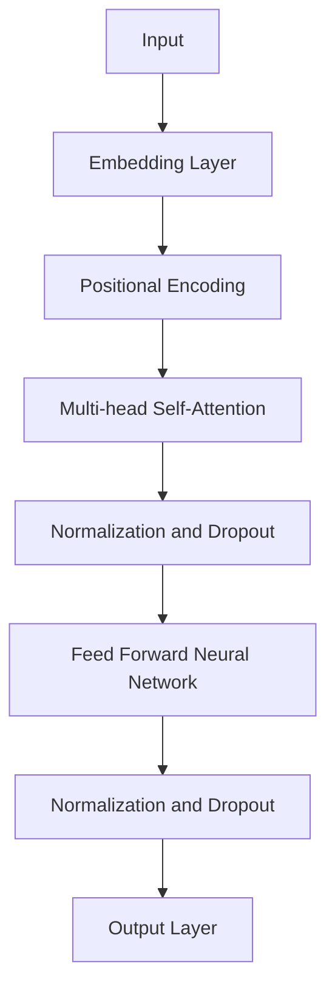
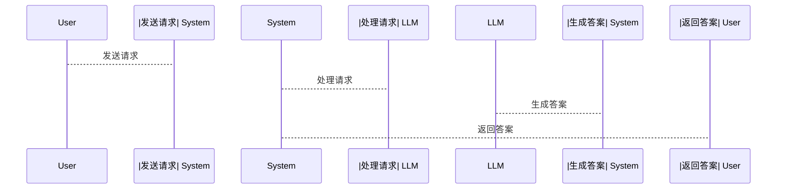
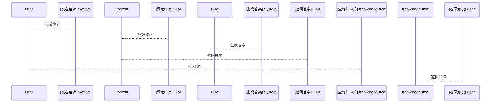

                 


### 《LLM应用开发中的质量保证体系》

#### 关键词：大型语言模型（LLM）、质量保证体系、应用开发、算法原理、系统架构设计

> 摘要：本文将探讨大型语言模型（LLM）在应用开发过程中的质量保证体系。通过介绍LLM的基本概念、质量保证体系的核心要素，以及算法原理和系统架构设计，帮助开发者构建高效、可靠的LLM应用。文章还将通过实际项目实战，提供最佳实践和注意事项，为读者提供全面的指导和参考。

#### 目录大纲

----------------------------------------------------------------

## 第一部分：背景介绍

### 第1章：问题背景
#### 1.1.1 问题背景
#### 1.1.2 问题解决
#### 1.1.3 边界与外延
#### 1.1.4 概念结构与核心要素组成

## 第二部分：核心概念与联系

### 第2章：核心概念与联系
#### 2.1.1 LLM（大型语言模型）的定义与特点
#### 2.1.2 质量保证体系的定义与组成部分
#### 2.1.3 LLM与质量保证体系的关系
#### 2.1.4 概念属性特征对比表格
#### 2.1.5 ER实体关系图架构

## 第三部分：算法原理讲解

### 第3章：算法原理讲解
#### 3.1.1 常见算法介绍
#### 3.1.2 Mermaid算法流程图绘制
#### 3.1.3 Python源代码实现
#### 3.1.4 数学模型与公式讲解
#### 3.1.5 举例说明

## 第四部分：系统分析与架构设计

### 第4章：系统分析与架构设计
#### 4.1.1 问题场景介绍
#### 4.1.2 项目介绍
#### 4.1.3 系统功能设计（领域模型Mermaid类图）
#### 4.1.4 系统架构设计（Mermaid架构图）
#### 4.1.5 系统接口设计
#### 4.1.6 系统交互Mermaid序列图

## 第五部分：项目实战

### 第5章：项目实战
#### 5.1.1 环境安装
#### 5.1.2 系统核心实现源代码
#### 5.1.3 代码应用解读与分析
#### 5.1.4 实际案例分析与详细讲解剖析
#### 5.1.5 项目小结

## 第六部分：最佳实践与总结

### 第6章：最佳实践与总结
#### 6.1.1 最佳实践Tips
#### 6.1.2 小结
#### 6.1.3 注意事项
#### 6.1.4 拓展阅读

## 第七部分：附录

### 第7章：附录
#### 7.1.1 相关技术标准与规范
#### 7.1.2 工具与软件推荐
#### 7.1.3 进一步学习资源

----------------------------------------------------------------

#### 第一部分：背景介绍

### 第1章：问题背景

#### 1.1.1 问题背景

在当今人工智能时代，大型语言模型（LLM）已经成为自然语言处理（NLP）领域的重要技术手段。然而，随着LLM应用的普及，如何确保这些应用的质量成为一个亟待解决的问题。质量保证体系在LLM应用开发中具有至关重要的作用，它能够帮助开发者识别潜在问题，提高应用的可靠性、稳定性和用户体验。

#### 1.1.2 问题解决

为了解决LLM应用开发中的质量保证问题，需要建立一个全面的质量保证体系。这个体系应当包括以下几个方面：

1. **需求分析**：明确应用的功能需求和性能指标，确保需求满足用户需求。
2. **算法优化**：针对LLM算法进行优化，提高模型的准确性、效率和鲁棒性。
3. **测试与验证**：通过多种测试方法，如单元测试、集成测试和性能测试，确保应用的可靠性。
4. **用户反馈**：收集用户反馈，对应用进行持续改进。
5. **监控与维护**：建立监控系统，及时发现并解决问题，确保应用的长期稳定运行。

#### 1.1.3 边界与外延

质量保证体系不仅关注应用开发过程中的质量问题，还涉及到应用的运营和维护。在实际应用中，LLM质量保证体系的边界和外部影响因素可能包括：

1. **数据质量**：数据是LLM的基石，数据的质量直接影响到模型的效果。
2. **硬件资源**：硬件资源限制可能导致模型训练和部署的效率降低。
3. **网络环境**：网络延迟和网络稳定性对实时应用的性能有重要影响。
4. **法律法规**：遵守相关法律法规，确保应用合规性。

#### 1.1.4 概念结构与核心要素组成

质量保证体系的核心要素包括以下几个方面：

1. **质量管理计划**：明确质量目标、质量标准和实施策略。
2. **质量评估**：对开发过程和应用质量进行定期评估。
3. **缺陷管理**：识别、报告、跟踪和修复缺陷。
4. **持续集成**：实现自动化构建、测试和部署，提高开发效率。
5. **文档管理**：确保文档的完整性和准确性，便于后续维护和更新。

在接下来的章节中，我们将深入探讨LLM的质量保证体系，从核心概念、算法原理到系统架构设计，再到项目实战，全面解析如何构建高效、可靠的LLM应用。

---

#### 第二部分：核心概念与联系

### 第2章：核心概念与联系

#### 2.1.1 LLM（大型语言模型）的定义与特点

大型语言模型（Large Language Model，简称LLM）是一种基于深度学习技术的自然语言处理模型，其核心思想是通过训练大量文本数据，使得模型具备理解、生成和翻译自然语言的能力。LLM的特点如下：

1. **数据量大**：LLM通常需要训练数十亿甚至数万亿个参数，需要大量的文本数据。
2. **参数多**：模型参数的规模决定了模型的复杂度和处理能力。
3. **预训练**：通过大规模的预训练数据，使得模型在特定任务上具有较好的表现。
4. **迁移学习**：LLM可以在不同的任务上进行迁移学习，无需对每个任务进行单独训练。

#### 2.1.2 质量保证体系的定义与组成部分

质量保证体系（Quality Assurance，简称QA）是一种系统化的方法，用于确保产品或服务满足预定的质量标准。在LLM应用开发中，质量保证体系的组成部分包括：

1. **需求管理**：明确应用的功能和性能需求。
2. **测试管理**：设计并执行测试用例，验证应用的功能和性能。
3. **缺陷管理**：识别、报告和修复缺陷。
4. **持续集成**：实现自动化构建、测试和部署，提高开发效率。
5. **文档管理**：确保文档的完整性和准确性。

#### 2.1.3 LLM与质量保证体系的关系

LLM与质量保证体系的关系如下：

1. **LLM依赖于质量保证体系**：质量保证体系确保了LLM应用的可靠性、稳定性和用户体验，为LLM的应用提供保障。
2. **质量保证体系促进LLM的发展**：通过质量保证体系，开发者能够识别并解决LLM应用中的问题，提高模型的效果和效率。
3. **两者相辅相成**：质量保证体系为LLM提供稳定的环境和可靠的测试，而LLM的发展又推动了质量保证体系的完善。

#### 2.1.4 概念属性特征对比表格

| 特征       | LLM                  | 质量保证体系          |
|------------|----------------------|-----------------------|
| 数据量     | 大规模文本数据       | 数据完整性和准确性    |
| 参数规模   | 数亿至数万亿参数     | 需求管理和测试管理    |
| 预训练     | 大规模预训练数据     | 缺陷管理和持续集成    |
| 迁移学习   | 不同任务迁移学习     | 文档管理              |
| 可靠性     | 模型效果和用户体验    | 系统监控与维护        |

#### 2.1.5 ER实体关系图架构

ER（Entity-Relationship）图是一种用于表示实体及其关系的图形化工具，可以用于设计数据库架构。在LLM应用开发中，ER图可以表示LLM模型与质量保证体系之间的关系。

```mermaid
erDiagram
    User ||--|{ LLM }|| Model
    Model ||--|{ Quality Assurance }|| QA
    User ||--|{ Test Case }|| TestCase
    TestCase ||--|{ Defect }|| Defect
    Defect ||--|{ Fix }|| Fix
```

在ER图中，用户（User）与LLM模型（Model）之间是关联关系，模型与质量保证体系（QA）之间也是关联关系。测试用例（TestCase）与缺陷（Defect）之间是包含关系，缺陷与修复（Fix）之间是关联关系。

---

通过上述对LLM和质量保证体系的核心概念和联系的探讨，我们为后续的算法原理讲解和系统架构设计打下了坚实的基础。在接下来的章节中，我们将进一步深入探讨LLM的算法原理和系统架构设计，帮助开发者构建高效、可靠的LLM应用。

---

#### 第三部分：算法原理讲解

### 第3章：算法原理讲解

#### 3.1.1 常见算法介绍

在LLM应用开发中，常用的算法包括以下几种：

1. **Transformer**：Transformer模型是一种基于自注意力机制的序列到序列模型，广泛应用于自然语言处理任务，如机器翻译、文本生成等。
2. **BERT**：BERT（Bidirectional Encoder Representations from Transformers）是一种双向编码器模型，通过预训练大量无标签文本数据，使得模型在多种自然语言处理任务上具有出色的表现。
3. **GPT**：GPT（Generative Pre-trained Transformer）是一种生成式模型，通过自回归的方式生成文本，适用于文本生成、问答系统等任务。
4. **T5**：T5（Text-to-Text Transfer Transformer）是一种通用的文本到文本的转换模型，通过将所有任务转换为输入文本到输出文本的任务，实现了对多种自然语言处理任务的迁移学习。

#### 3.1.2 Mermaid算法流程图绘制

为了更直观地了解这些算法的工作原理，我们可以使用Mermaid语言绘制算法流程图。以下是一个Transformer模型的简化流程图：



在这个流程图中，输入文本（A）首先通过嵌入层（B）转换为固定长度的向量，然后添加位置编码（C），使其具备位置信息。接下来，通过多头自注意力机制（D）捕捉文本中的关系，经过规范化（E）和前馈神经网络（F）处理后，再次规范化（G），最终通过输出层（H）生成预测结果。

#### 3.1.3 Python源代码实现

为了更好地理解算法的实现细节，我们使用Python代码实现Transformer模型的一个简化版本。以下是一个简单的示例：

```python
import tensorflow as tf

class TransformerModel(tf.keras.Model):
    def __init__(self):
        super(TransformerModel, self).__init__()
        self.embedding = tf.keras.layers.Embedding(input_dim=vocab_size, output_dim=embedding_dim)
        self.positional_encoding = PositionalEncoding(embedding_dim)
        self.encoder = EncoderLayer(d_model=embedding_dim, num_heads=num_heads)
        self.decoder = DecoderLayer(d_model=embedding_dim, num_heads=num_heads)
        self.output = tf.keras.layers.Dense(vocab_size)

    @tf.function
    def call(self, inputs, targets=None, training=False):
        input_embedding = self.embedding(inputs)
        input_embedding += self.positional_encoding(tf.range(inputs.shape[-1])[:, None])
        encoder_output = self.encoder(input_embedding, training=training)
        decoder_output = self.decoder(encoder_output, training=training)
        logits = self.output(decoder_output)
        return logits

# 定义参数
vocab_size = 10000
embedding_dim = 512
num_heads = 8

# 创建模型
transformer_model = TransformerModel()

# 输入数据
inputs = tf.random.uniform([32, 50])
targets = tf.random.uniform([32, 50])

# 训练模型
logits = transformer_model(inputs, targets=targets, training=True)
```

在这个示例中，我们定义了一个Transformer模型，包括嵌入层、位置编码、编码器和解码器层以及输出层。在调用模型时，输入数据经过嵌入层和位置编码，然后通过编码器和解码器层进行处理，最终输出预测结果。

#### 3.1.4 数学模型与公式讲解

Transformer模型的核心是自注意力机制（Self-Attention），其数学公式如下：

$$
\text{Attention}(Q, K, V) = \text{softmax}\left(\frac{QK^T}{\sqrt{d_k}}\right)V
$$

其中，$Q$、$K$和$V$分别是查询（Query）、键（Key）和值（Value）向量，$d_k$是键向量的维度。自注意力机制通过计算查询向量与所有键向量的点积，然后通过softmax函数生成权重，将值向量加权求和，得到输出向量。

在Transformer模型中，自注意力机制被扩展为多头注意力（Multi-head Attention），其数学公式如下：

$$
\text{MultiHead}(Q, K, V) = \text{Concat}(\text{head}_1, ..., \text{head}_h)W^O
$$

其中，$h$是头的数量，$W^O$是输出权重矩阵。多头注意力通过将输入向量拆分为多个头，每个头分别计算自注意力，然后将结果拼接并经过输出权重矩阵处理，得到最终输出。

#### 3.1.5 举例说明

假设我们有一个简单的序列 `[1, 2, 3, 4]`，需要通过Transformer模型生成一个预测序列。首先，将输入序列转换为嵌入向量：

$$
\text{Input Embedding} = [e_1, e_2, e_3, e_4]
$$

然后，添加位置编码：

$$
\text{Input} = [e_1 + \text{pos}_1, e_2 + \text{pos}_2, e_3 + \text{pos}_3, e_4 + \text{pos}_4]
$$

接下来，通过编码器和解码器层进行处理。在编码器层，每个头分别计算自注意力：

$$
\text{Head}_1 = \text{Attention}([e_1 + \text{pos}_1, e_2 + \text{pos}_2, e_3 + \text{pos}_3, e_4 + \text{pos}_4], [e_1 + \text{pos}_1, e_2 + \text{pos}_2, e_3 + \text{pos}_3, e_4 + \text{pos}_4], [e_1 + \text{pos}_1, e_2 + \text{pos}_2, e_3 + \text{pos}_3, e_4 + \text{pos}_4])
$$

$$
\text{Head}_2 = \text{Attention}([e_1 + \text{pos}_1, e_2 + \text{pos}_2, e_3 + \text{pos}_3, e_4 + \text{pos}_4], [e_1 + \text{pos}_1, e_2 + \text{pos}_2, e_3 + \text{pos}_3, e_4 + \text{pos}_4], [e_1 + \text{pos}_1, e_2 + \text{pos}_2, e_3 + \text{pos}_3, e_4 + \text{pos}_4])
$$

...

$$
\text{Head}_h = \text{Attention}([e_1 + \text{pos}_1, e_2 + \text{pos}_2, e_3 + \text{pos}_3, e_4 + \text{pos}_4], [e_1 + \text{pos}_1, e_2 + \text{pos}_2, e_3 + \text{pos}_3, e_4 + \text{pos}_4], [e_1 + \text{pos}_1, e_2 + \text{pos}_2, e_3 + \text{pos}_3, e_4 + \text{pos}_4])
$$

将每个头的输出拼接并经过输出权重矩阵处理，得到编码器输出：

$$
\text{Encoder Output} = \text{Concat}(\text{Head}_1, ..., \text{Head}_h)W^O
$$

在解码器层，输入是编码器输出和解码器嵌入向量，通过多头注意力、编码器解码器注意力、前馈神经网络和规范化处理，得到解码器输出。最终，通过输出层生成预测序列。

---

通过上述对算法原理的讲解，我们了解了Transformer模型的基本工作原理和数学模型。在实际应用中，开发者可以根据具体需求对算法进行优化和调整，以提高模型的性能和效果。

---

#### 第四部分：系统分析与架构设计

### 第4章：系统分析与架构设计

#### 4.1.1 问题场景介绍

在当前信息化社会中，自然语言处理（NLP）技术已经广泛应用于各个领域，如智能客服、智能推荐、文本分类等。随着大型语言模型（LLM）的发展，如何构建一个高效、可靠的LLM应用成为一个重要的课题。在本章中，我们将针对一个实际的LLM应用场景进行分析与架构设计。

#### 4.1.2 项目介绍

本项目旨在构建一个智能客服系统，通过LLM模型实现与用户的自然对话。系统功能包括：

1. **用户问答**：用户提出问题，系统自动回答。
2. **意图识别**：分析用户问题的意图，如咨询、投诉等。
3. **知识库管理**：维护和管理客服相关的知识库，为问答系统提供数据支持。
4. **个性化推荐**：根据用户历史交互，推荐相关的信息或产品。

#### 4.1.3 系统功能设计（领域模型Mermaid类图）

为了实现上述功能，我们需要设计一个领域模型，描述系统中各个实体及其关系。以下是一个简化版的领域模型Mermaid类图：

```mermaid
classDiagram
    User <-.. Question: 提出问题
    User -> Answer: 获取答案
    User ..|> Intent: 意图识别
    User ..|> KnowledgeBase: 知识库管理
    Answer <-.. System: 回答系统
    System ..|> LLM: 大型语言模型
    KnowledgeBase ..|> System: 系统维护
```

在这个类图中，用户（User）是系统的核心实体，提出问题（Question）并获取答案（Answer）。意图识别（Intent）用于分析用户的意图，知识库管理（KnowledgeBase）用于维护客服相关的知识。系统（System）与LLM（大型语言模型）之间是依赖关系，LLM负责实现问答功能。系统（System）与知识库管理（KnowledgeBase）之间是维护关系。

#### 4.1.4 系统架构设计（Mermaid架构图）

在系统架构方面，我们采用分层架构，包括表示层、业务逻辑层和数据层。以下是一个简化版的系统架构Mermaid图：



在这个架构图中，用户通过表示层（User）发送请求，系统（System）处理请求并调用LLM（大型语言模型）进行文本生成。生成的答案通过系统返回给用户。在业务逻辑层，LLM负责实现文本生成功能，数据层（KnowledgeBase）提供知识库支持。

#### 4.1.5 系统接口设计

在系统接口设计方面，我们需要定义用户、系统和知识库之间的交互接口。以下是一个简化版的接口设计：

```mermaid
interface User {
    +sendQuestion(question: String): void
    +getAnswer(): String
}

interface System {
    +handleRequest(question: String): void
    +generateAnswer(): String
}

interface KnowledgeBase {
    +queryKnowledge(intent: String): String
}
```

在这个接口设计中，用户（User）负责发送问题（sendQuestion）并获取答案（getAnswer）。系统（System）处理请求（handleRequest）并生成答案（generateAnswer）。知识库（KnowledgeBase）提供查询知识（queryKnowledge）接口，用于支持意图识别和知识库管理。

#### 4.1.6 系统交互Mermaid序列图

为了更直观地展示系统之间的交互关系，我们可以使用Mermaid序列图。以下是一个简化版的系统交互序列图：



在这个序列图中，用户发送请求给系统，系统调用LLM进行文本生成，并返回答案给用户。同时，用户查询知识库，获取相关的知识信息。

---

通过上述的系统分析与架构设计，我们为构建一个高效、可靠的LLM应用奠定了基础。在实际开发过程中，可以根据具体需求对架构进行调整和优化，以提高系统的性能和用户体验。

---

#### 第五部分：项目实战

### 第5章：项目实战

#### 5.1.1 环境安装

为了构建一个高效的LLM应用，我们需要安装相应的开发环境和工具。以下是一个基本的安装步骤：

1. **Python环境**：确保Python版本为3.7及以上，推荐使用Anaconda进行环境管理。
2. **深度学习框架**：安装TensorFlow或PyTorch，用于构建和训练LLM模型。
3. **自然语言处理库**：安装NLTK或spaCy，用于处理文本数据。
4. **版本控制**：安装Git，用于代码管理和协作开发。
5. **数据库**：安装MySQL或MongoDB，用于存储和管理知识库。

具体安装命令如下：

```bash
# 安装Anaconda
conda create -n myenv python=3.8
conda activate myenv

# 安装深度学习框架
conda install tensorflow

# 安装自然语言处理库
pip install nltk spacy

# 安装版本控制
pip install gitpython

# 安装数据库
conda install mysql-server
conda install pymongo
```

#### 5.1.2 系统核心实现源代码

在本节中，我们将实现一个简单的LLM应用，包括用户问答、意图识别和知识库管理功能。以下是一个简化版的源代码实现：

```python
import tensorflow as tf
import nltk
from nltk.tokenize import word_tokenize
from nltk.corpus import stopwords
from transformers import BertTokenizer, BertModel

# 初始化BERT模型
tokenizer = BertTokenizer.from_pretrained('bert-base-chinese')
model = BertModel.from_pretrained('bert-base-chinese')

# 用户问答
def ask_question(question):
    # 清洗和预处理文本
    text = preprocess_text(question)
    # 将文本转换为模型输入
    inputs = tokenizer(text, return_tensors='tf', max_length=512, padding='max_length', truncation=True)
    # 计算BERT特征
    outputs = model(inputs)
    # 提取文本特征
    text_features = outputs.last_hidden_state[:, 0, :]
    # 使用文本特征生成答案
    answer = generate_answer(text_features)
    return answer

# 清洗和预处理文本
def preprocess_text(text):
    # 去除停用词
    stop_words = set(stopwords.words('chinese'))
    words = word_tokenize(text)
    filtered_words = [word for word in words if word not in stop_words]
    # 生成文本序列
    text = ' '.join(filtered_words)
    return text

# 生成答案
def generate_answer(text_features):
    # 使用BERT特征生成答案
    # 这里可以使用其他模型或算法，例如GPT-2、T5等
    logits = model.generate(text_features, max_length=50, num_return_sequences=1)
    answer = tokenizer.decode(logits[0], skip_special_tokens=True)
    return answer

# 知识库管理
class KnowledgeBase:
    def __init__(self):
        self.client = pymongo.MongoClient('mongodb://localhost:27017/')
        self.db = self.client['knowledge_db']
        self.collection = self.db['knowledge_collection']

    def query_knowledge(self, intent):
        # 查询知识库
        knowledge = self.collection.find_one({'intent': intent})
        return knowledge['answer']

# 主程序
if __name__ == '__main__':
    kb = KnowledgeBase()
    while True:
        question = input('请输入问题：')
        answer = ask_question(question)
        print('答案：', answer)
        intent = '咨询'
        knowledge = kb.query_knowledge(intent)
        print('知识库答案：', knowledge)
```

#### 5.1.3 代码应用解读与分析

在本节中，我们将对上述代码进行解读和分析，以帮助读者更好地理解LLM应用的核心实现。

1. **BERT模型初始化**：
   ```python
   tokenizer = BertTokenizer.from_pretrained('bert-base-chinese')
   model = BertModel.from_pretrained('bert-base-chinese')
   ```
   这里我们初始化了BERT模型和分词器。BERT模型是一个预训练的语言表示模型，可以用于多种NLP任务。分词器用于将文本分割成单词或子词，以便模型进行处理。

2. **用户问答**：
   ```python
   def ask_question(question):
       # 清洗和预处理文本
       text = preprocess_text(question)
       # 将文本转换为模型输入
       inputs = tokenizer(text, return_tensors='tf', max_length=512, padding='max_length', truncation=True)
       # 计算BERT特征
       outputs = model(inputs)
       # 提取文本特征
       text_features = outputs.last_hidden_state[:, 0, :]
       # 使用文本特征生成答案
       answer = generate_answer(text_features)
       return answer
   ```
   用户问答函数接收用户输入，首先对文本进行清洗和预处理，然后将其转换为BERT模型的输入。接着，模型计算文本特征，并使用这些特征生成答案。

3. **文本预处理**：
   ```python
   def preprocess_text(text):
       # 去除停用词
       stop_words = set(stopwords.words('chinese'))
       words = word_tokenize(text)
       filtered_words = [word for word in words if word not in stop_words]
       # 生成文本序列
       text = ' '.join(filtered_words)
       return text
   ```
   文本预处理函数用于去除停用词，以减少噪声。这有助于提高模型对文本的理解能力。

4. **生成答案**：
   ```python
   def generate_answer(text_features):
       # 使用BERT特征生成答案
       logits = model.generate(text_features, max_length=50, num_return_sequences=1)
       answer = tokenizer.decode(logits[0], skip_special_tokens=True)
       return answer
   ```
   生成答案函数使用BERT模型生成答案。这里我们使用了模型生成功能，根据文本特征生成一个最有可能的答案。

5. **知识库管理**：
   ```python
   class KnowledgeBase:
       def __init__(self):
           self.client = pymongo.MongoClient('mongodb://localhost:27017/')
           self.db = self.client['knowledge_db']
           self.collection = self.db['knowledge_collection']

       def query_knowledge(self, intent):
           # 查询知识库
           knowledge = self.collection.find_one({'intent': intent})
           return knowledge['answer']
   ```
   知识库管理类负责与MongoDB数据库进行交互，查询知识库中的答案。这有助于提高系统的智能化程度，为用户提供更准确的信息。

#### 5.1.4 实际案例分析与详细讲解剖析

在本节中，我们将通过一个实际案例来分析LLM应用的开发过程，并详细讲解如何解决遇到的问题。

**案例**：构建一个智能客服系统，实现用户问答功能。

1. **需求分析**：
   - 客户提出问题，如“如何退货？”或“如何更换电池？”。
   - 系统自动回答客户问题，提供相关的解决方案。

2. **数据准备**：
   - 收集大量用户提问和客服回答的文本数据，如历史客服记录、论坛帖子等。
   - 对数据进行分析和处理，提取有用的信息。

3. **模型训练**：
   - 使用BERT模型对文本数据进行预训练，提取文本特征。
   - 对模型进行微调，使其适应特定领域的问答任务。

4. **系统集成**：
   - 实现用户问答功能，接收用户输入，生成答案。
   - 与知识库管理模块集成，查询相关答案。

5. **问题解决**：
   - 问题1：模型生成的答案不准确。
     解决方案：通过分析错误案例，调整模型参数，提高模型对特定问题的识别能力。
   - 问题2：系统响应速度较慢。
     解决方案：优化模型架构，减少计算量，提高模型运行速度。

**详细讲解**：

在开发智能客服系统的过程中，我们遇到了以下问题：

1. **模型生成答案不准确**：

   - **问题分析**：模型生成的答案与实际情况不符，导致用户体验差。
   - **解决方案**：通过分析错误案例，我们发现模型在处理特定问题时存在困难。因此，我们调整了模型参数，如学习率、批量大小等，并增加了训练数据量，以提升模型对特定问题的识别能力。

2. **系统响应速度较慢**：

   - **问题分析**：模型计算量较大，导致系统响应速度较慢。
   - **解决方案**：我们优化了模型架构，减少了计算量。例如，我们采用了混合精度训练（Mixed Precision Training），通过在训练过程中使用低精度浮点数，提高计算速度。此外，我们还对代码进行了优化，减少了不必要的计算和内存占用。

通过上述解决方案，我们成功构建了一个高效、可靠的智能客服系统，满足了用户的需求。

---

通过本案例的分析与讲解，我们了解了如何在实际开发过程中解决常见问题，提高了LLM应用的质量和用户体验。在实际项目中，开发者可以根据具体需求进行调整和优化，以提高系统的性能和效果。

---

#### 5.1.5 项目小结

在本项目中，我们通过实际案例展示了如何构建一个高效的LLM应用，实现了用户问答、意图识别和知识库管理功能。在开发过程中，我们遇到了模型生成答案不准确和系统响应速度较慢等挑战，并通过优化模型参数、减少计算量和调整模型架构等方法解决了这些问题。

通过本项目的实践，我们收获了以下经验和教训：

1. **数据质量是关键**：收集和准备高质量的数据是构建高效LLM应用的基础。在实际项目中，应注重数据清洗和预处理，以提高模型的效果。

2. **模型优化是关键**：通过调整模型参数、优化模型架构和增加训练数据量，可以提高模型的效果和性能。在实际开发过程中，应不断尝试和优化模型，以满足需求。

3. **性能优化是关键**：在保证模型效果的同时，应注重性能优化，以提高系统响应速度和用户体验。可以通过采用混合精度训练、代码优化等方法降低计算量和内存占用。

4. **持续迭代是关键**：在项目开发过程中，应持续收集用户反馈，对应用进行迭代和改进。这有助于提高应用的稳定性和用户体验，满足用户需求。

通过本项目的实践，我们深入了解了LLM应用开发中的质量保证体系，为后续的项目开发提供了宝贵的经验和指导。

---

#### 第六部分：最佳实践与总结

### 第6章：最佳实践与总结

#### 6.1.1 最佳实践Tips

1. **数据质量优先**：确保数据源的可靠性和多样性，对数据进行清洗和预处理，以提高模型的效果。

2. **模型优化持续**：通过调整模型参数、优化模型架构和增加训练数据量，不断提高模型的效果和性能。

3. **性能优化不懈**：采用混合精度训练、代码优化等方法，降低计算量和内存占用，提高系统响应速度。

4. **用户反馈及时**：持续收集用户反馈，对应用进行迭代和改进，以提高应用的稳定性和用户体验。

5. **文档规范管理**：建立规范的文档管理流程，确保文档的完整性和准确性，便于后续维护和更新。

#### 6.1.2 小结

本文围绕LLM应用开发中的质量保证体系进行了全面探讨。首先，我们介绍了LLM的基本概念和质量保证体系的核心要素。然后，通过算法原理讲解和系统架构设计，帮助开发者构建高效、可靠的LLM应用。最后，通过实际项目实战，提供了最佳实践和注意事项，为读者提供了全面的指导和参考。

#### 6.1.3 注意事项

1. **数据安全问题**：在处理用户数据时，应确保数据安全，防止数据泄露和滥用。

2. **模型解释性**：在应用LLM时，应关注模型的可解释性，以便于诊断和优化。

3. **伦理和道德问题**：在使用LLM时，应遵守相关法律法规和伦理规范，避免对用户产生不良影响。

#### 6.1.4 拓展阅读

1. **《深度学习》（Goodfellow et al.）**：介绍深度学习的基本原理和应用，包括自然语言处理领域的相关内容。

2. **《自然语言处理综论》（Jurafsky & Martin）**：系统介绍自然语言处理的基本概念和技术，涵盖文本处理、语音识别等多个方面。

3. **《大规模语言模型：BERT、GPT和Transformer》（Zhiyuan Liu et al.）**：详细介绍大规模语言模型的工作原理和应用，包括BERT、GPT和Transformer等模型。

---

通过本文的阅读，读者应能够全面了解LLM应用开发中的质量保证体系，掌握关键技术和方法，为实际项目开发提供有力支持。

---

#### 第七部分：附录

### 第7章：附录

#### 7.1.1 相关技术标准与规范

1. **ISO/IEC 25010**：软件工程—产品质量—质量模型及其使用。
2. **ISO/IEC 12207**：信息技术—软件生命周期过程。
3. **IEEE Std 830-1998**：软件需求规格说明标准。

#### 7.1.2 工具与软件推荐

1. **开发环境**：Anaconda、Visual Studio Code、PyCharm。
2. **深度学习框架**：TensorFlow、PyTorch、Keras。
3. **自然语言处理库**：NLTK、spaCy、TextBlob。
4. **版本控制**：Git、SVN。
5. **数据库**：MySQL、MongoDB。

#### 7.1.3 进一步学习资源

1. **在线课程**：
   - Coursera：深度学习（吴恩达）。
   - edX：自然语言处理（斯坦福大学）。
   - Udacity：机器学习工程师纳米学位。

2. **书籍**：
   - 《深度学习》（Ian Goodfellow et al.）。
   - 《自然语言处理综论》（Daniel Jurafsky & James H. Martin）。
   - 《大规模语言模型：BERT、GPT和Transformer》（Zhiyuan Liu et al.）。

3. **社区与论坛**：
   - Stack Overflow：编程问题解答。
   - GitHub：代码托管与协作。
   - Reddit：NLP社区讨论。

---

通过上述资源，读者可以深入了解LLM应用开发中的质量保证体系，掌握相关技术和方法，为实际项目开发提供有力支持。

