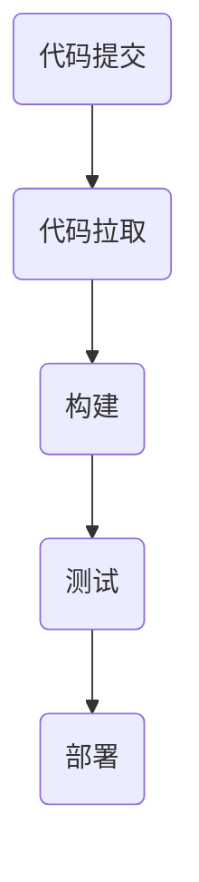

                 

# LLM应用的持续集成最佳实践

## 关键词

- 持续集成
- LLM应用
- 自动化
- 版本控制
- 安全性

## 摘要

本文旨在探讨LLM（大型语言模型）应用的持续集成最佳实践。随着人工智能技术的快速发展，LLM应用在各个领域得到广泛应用，但其复杂性和规模也给持续集成带来了挑战。本文将从持续集成概述、工具选择、环境搭建和实践等方面，详细阐述LLM应用持续集成的最佳实践，为开发者提供有价值的参考。

### 目录大纲

1. 第一部分: LLM应用的持续集成
    1.1 LLM应用的持续集成概述
        1.1.1 持续集成的定义
        1.1.2 持续集成的优势
        1.1.3 LLM应用的特点
    1.2 持续集成流程的设计
        1.2.1 流程设计的原则
        1.2.2 持续集成工具的选择
        1.2.3 流程图的绘制
    1.3 LLM模型的集成测试
        1.3.1 集成测试的目的
        1.3.2 测试策略的选择
        1.3.3 测试用例的设计
    1.4 持续集成中的版本控制
        1.4.1 版本控制的必要性
        1.4.2 版本控制的工具
        1.4.3 版本控制的策略
    1.5 持续集成的自动化
        1.5.1 自动化的优点
        1.5.2 自动化流程的实现
        1.5.3 自动化工具的集成
    1.6 持续集成中的监控和反馈
        1.6.1 监控的重要性
        1.6.2 监控工具的选择
        1.6.3 反馈机制的建立
    1.7 持续集成中的安全性
        1.7.1 安全性的必要性
        1.7.2 安全性的策略
        1.7.3 安全性工具的使用
    1.8 持续集成最佳实践
        1.8.1 设计可持续的集成流程
        1.8.2 维护良好的代码质量
        1.8.3 管理复杂度
        1.8.4 持续集成与持续部署的结合
    1.9 本章小结

2. 第二部分: LLM应用的持续集成工具
    2.1 Jenkins
    2.2 GitLab CI/CD
    2.3 GitHub Actions
    2.4 Git
    2.5 Docker
    2.6 Kubernetes
    2.7 Prometheus
    2.8 本章小结

3. 第三部分: LLM应用持续集成实战
    3.1 持续集成环境搭建
        3.1.1 环境需求
        3.1.2 持续集成工具安装
        3.1.3 版本控制工具配置
        3.1.4 Docker容器化应用实践
        3.1.5 Kubernetes集群搭建
    3.2 项目实战
        3.2.1 环境安装
        3.2.2 系统核心实现源代码
        3.2.3 代码应用解读与分析
        3.2.4 实际案例分析和详细讲解剖析
        3.2.5 项目小结
    3.3 最佳实践 tips
    3.4 小结
    3.5 注意事项
    3.6 拓展阅读

### 第一部分: LLM应用的持续集成

#### 1.1 LLM应用的持续集成概述

##### 1.1.1 持续集成的定义

持续集成（Continuous Integration，简称CI）是一种软件开发实践，旨在通过频繁地将代码集成到一个共享的主干分支中，从而快速发现并修复代码中的缺陷。持续集成的核心思想是通过自动化测试和快速反馈，确保代码库始终处于一个可构建、可运行的状态。

##### 1.1.2 持续集成的优势

持续集成带来了诸多优势，包括：

- **快速反馈**：开发者在提交代码后，可以立即收到反馈，及时发现问题并进行修复。
- **减少集成冲突**：频繁的集成有助于减少代码之间的冲突，提高代码的兼容性。
- **提高代码质量**：通过自动化测试，可以确保代码的质量和稳定性。
- **降低风险**：持续集成可以帮助团队在早期发现并解决潜在的问题，降低项目的风险。

##### 1.1.3 LLM应用的特点

LLM（Large Language Model）应用是一种基于深度学习的大型语言模型，具有以下特点：

- **计算资源需求大**：LLM应用通常需要大量的计算资源和存储空间。
- **模型更新频繁**：由于语言模型的学习和优化，LLM应用的模型更新频率较高。
- **依赖复杂**：LLM应用通常依赖于多个外部库和工具，如TensorFlow、PyTorch等。
- **测试难度大**：LLM应用的测试不仅需要考虑功能正确性，还需要考虑模型的性能和鲁棒性。

#### 1.2 持续集成流程的设计

##### 1.2.1 流程设计的原则

设计持续集成流程时，应遵循以下原则：

- **自动化**：尽可能将流程自动化，减少手动操作，提高效率。
- **可扩展性**：设计灵活的流程，以便在项目规模扩大时进行扩展。
- **可观测性**：确保流程的每一步都有详细的日志和报告，便于追踪和调试。
- **安全性**：确保流程中的数据安全和隐私保护。

##### 1.2.2 持续集成工具的选择

在选择持续集成工具时，需要考虑以下因素：

- **支持的语言和平台**：确保工具支持项目使用的编程语言和平台。
- **社区和文档**：选择具有活跃社区和丰富文档的工具，有助于解决问题和学习使用。
- **扩展性和可定制性**：选择可扩展和可定制的工具，以便根据项目需求进行调整。
- **性能和稳定性**：选择性能和稳定性较好的工具，确保流程的高效运行。

常见的持续集成工具有Jenkins、GitLab CI/CD、GitHub Actions等。

##### 1.2.3 流程图的绘制

持续集成流程通常包括以下步骤：

1. **代码提交**：开发者将代码提交到版本控制系统。
2. **代码拉取**：持续集成工具从版本控制系统拉取最新的代码。
3. **构建**：构建工具将代码构建为可执行的程序或包。
4. **测试**：运行自动化测试，验证代码的功能和性能。
5. **部署**：将成功的构建部署到测试或生产环境。

以下是一个简单的持续集成流程图：



#### 1.3 LLM模型的集成测试

##### 1.3.1 集成测试的目的

集成测试的目的是验证LLM模型与其他组件或服务的集成是否正确，确保模型在整体系统中的正常运行。集成测试通常包括以下方面：

- **功能测试**：验证模型的功能是否按照预期工作。
- **性能测试**：评估模型的响应速度、准确性和稳定性。
- **兼容性测试**：确保模型在不同环境、不同版本的外部库和工具下运行正常。

##### 1.3.2 测试策略的选择

测试策略的选择取决于项目需求和模型的特点。以下是一些常见的测试策略：

- **功能测试**：使用测试框架编写测试用例，对模型的功能进行逐项验证。
- **性能测试**：使用基准测试工具，评估模型的响应时间、吞吐量和准确性。
- **灰盒测试**：对模型的内部结构和参数进行测试，确保模型的鲁棒性和稳定性。

##### 1.3.3 测试用例的设计

测试用例的设计应覆盖模型的各种输入和场景，以下是一些设计测试用例的技巧：

- **覆盖各种输入**：包括正常输入、异常输入和边界条件。
- **覆盖不同场景**：包括训练、推理和部署等场景。
- **覆盖不同外部库和工具**：确保模型在不同环境下的兼容性。
- **覆盖率分析**：使用代码覆盖率工具，确保测试用例覆盖了代码的各个部分。

#### 1.4 持续集成中的版本控制

##### 1.4.1 版本控制的必要性

版本控制是持续集成的重要组成部分，其必要性体现在以下几个方面：

- **代码管理**：版本控制工具可以帮助团队有效地管理代码，避免代码冲突和丢失。
- **历史追踪**：版本控制工具可以记录每次代码提交的历史记录，便于追踪和回滚。
- **代码审查**：版本控制工具支持代码审查功能，确保代码质量。
- **协作开发**：版本控制工具支持多人协作开发，提高团队的工作效率。

##### 1.4.2 版本控制的工具

常见的版本控制工具有Git、SVN和Mercurial等。以下是这些工具的简要介绍：

- **Git**：分布式版本控制系统，支持分支管理和分布式工作流程。
- **SVN**：集中式版本控制系统，支持多用户协作开发。
- **Mercurial**：分布式版本控制系统，与Git类似，但语法和命令更简单。

##### 1.4.3 版本控制的策略

版本控制的策略应考虑以下方面：

- **分支管理**：使用分支管理策略，确保主干分支的稳定性和可靠性。
- **代码审查**：设置代码审查流程，确保代码的质量。
- **合并策略**：制定合并策略，避免代码冲突和错误。
- **版本发布**：制定版本发布策略，确保版本更新的可控性和可靠性。

#### 1.5 持续集成的自动化

##### 1.5.1 自动化的优点

持续集成的自动化带来了诸多优点，包括：

- **提高效率**：自动化流程可以节省人工操作的时间，提高开发效率。
- **减少错误**：自动化测试可以减少人为错误，提高代码的质量。
- **快速反馈**：自动化流程可以快速发现和解决问题，提高问题的解决效率。

##### 1.5.2 自动化流程的实现

实现持续集成的自动化流程通常包括以下步骤：

1. **编写脚本**：编写自动化脚本，实现代码的构建、测试和部署。
2. **配置持续集成工具**：配置持续集成工具，使其能够根据脚本自动执行流程。
3. **集成版本控制工具**：将版本控制工具与持续集成工具集成，确保代码的自动拉取和更新。
4. **监控和反馈**：配置监控和反馈机制，确保流程的每一步都有详细的日志和报告。

##### 1.5.3 自动化工具的集成

自动化工具的集成是持续集成自动化的关键。以下是一些常见的自动化工具：

- **构建工具**：如Maven、Gradle等，用于构建和打包项目。
- **测试工具**：如JUnit、TestNG等，用于编写和执行自动化测试。
- **部署工具**：如Docker、Kubernetes等，用于部署和管理应用。

#### 1.6 持续集成中的监控和反馈

##### 1.6.1 监控的重要性

持续集成中的监控和反馈是确保流程正常运行的关键。监控的重要性体现在以下几个方面：

- **及时发现异常**：通过监控，可以及时发现流程中的异常情况，确保流程的连续性和稳定性。
- **快速解决问题**：通过反馈机制，可以快速定位问题，并进行修复，提高问题的解决效率。
- **提高流程质量**：通过监控和反馈，可以不断优化流程，提高流程的质量和可靠性。

##### 1.6.2 监控工具的选择

选择监控工具时，需要考虑以下因素：

- **兼容性**：确保监控工具与项目使用的环境、框架和工具兼容。
- **功能丰富**：选择功能丰富的监控工具，确保能够满足项目的监控需求。
- **易用性**：选择操作简单、易上手的监控工具，降低使用难度。

常见的监控工具有Prometheus、Zabbix等。

##### 1.6.3 反馈机制的建立

建立反馈机制是持续集成中监控和反馈的关键。反馈机制应包括以下方面：

- **日志记录**：记录流程的每一步操作和结果，便于追踪和调试。
- **邮件通知**：在流程出现异常时，通过邮件通知相关人员。
- **网页报告**：生成详细的网页报告，展示流程的执行情况和结果。

#### 1.7 持续集成中的安全性

##### 1.7.1 安全性的必要性

持续集成中的安全性至关重要，其主要必要性体现在以下几个方面：

- **保护代码**：确保代码的安全性和完整性，防止未经授权的访问和修改。
- **防止漏洞**：通过安全测试，及时发现和修复代码中的漏洞，防止潜在的安全威胁。
- **合规性**：确保持续集成流程符合相关法规和标准，如ISO 27001等。

##### 1.7.2 安全性的策略

持续集成中的安全性策略包括以下方面：

- **访问控制**：设置严格的访问控制策略，确保只有授权人员可以访问代码和系统。
- **代码扫描**：使用代码扫描工具，对代码进行安全检查，发现潜在的安全漏洞。
- **安全测试**：定期进行安全测试，验证系统的安全性，并制定相应的修复方案。

##### 1.7.3 安全性工具的使用

安全性工具的使用是确保持续集成流程安全性的重要手段。以下是一些常见的安全性工具：

- **身份验证**：如OAuth、LDAP等，用于确保只有授权人员可以访问系统。
- **加密**：如SSL/TLS等，用于保护数据的传输过程。
- **防火墙**：用于防止未经授权的访问和攻击。

#### 1.8 持续集成最佳实践

##### 1.8.1 设计可持续的集成流程

设计可持续的集成流程是确保持续集成成功的关键。以下是一些设计最佳实践：

- **自动化**：尽可能将流程自动化，减少手动操作，提高效率。
- **可扩展性**：设计灵活的流程，以便在项目规模扩大时进行扩展。
- **可观测性**：确保流程的每一步都有详细的日志和报告，便于追踪和调试。
- **安全性**：确保流程中的数据安全和隐私保护。

##### 1.8.2 维护良好的代码质量

维护良好的代码质量是确保持续集成成功的重要因素。以下是一些维护代码质量的最佳实践：

- **代码审查**：设置代码审查流程，确保代码的质量。
- **单元测试**：编写单元测试，确保代码的功能和性能。
- **代码规范**：遵循代码规范，提高代码的可读性和可维护性。

##### 1.8.3 管理复杂度

持续集成中，管理复杂度至关重要。以下是一些管理复杂度的最佳实践：

- **模块化**：将项目拆分为模块，降低复杂度。
- **避免重复**：避免重复的代码和功能，提高代码的可维护性。
- **文档**：编写详细的文档，帮助团队更好地理解和维护代码。

##### 1.8.4 持续集成与持续部署的结合

持续集成与持续部署（Continuous Deployment，简称CD）相结合，可以实现更高效的软件开发流程。以下是一些结合的最佳实践：

- **自动化部署**：将部署过程自动化，提高部署效率。
- **环境一致性**：确保测试环境和生产环境的一致性，降低部署风险。
- **监控和反馈**：在部署过程中进行监控和反馈，确保部署的成功和可靠性。

#### 1.9 本章小结

本文详细阐述了LLM应用的持续集成最佳实践，包括持续集成的概述、流程设计、集成测试、版本控制、自动化、监控和反馈、安全性以及最佳实践等方面。通过遵循这些最佳实践，开发者可以更高效地集成LLM应用，提高代码质量和项目成功率。

### 第二部分: LLM应用的持续集成工具

#### 2.1 Jenkins

##### 2.1.1 Jenkins简介

Jenkins是一个开源的持续集成工具，由原Sun公司工程师川上卓（Kohsuke Kawaguchi）于2004年创建。Jenkins支持多种主流的版本控制工具，如Git、SVN等，可以与各种构建工具（如Maven、Gradle等）和测试工具（如JUnit、TestNG等）集成，实现自动化构建、测试和部署。

##### 2.1.2 Jenkins安装与配置

Jenkins的安装过程相对简单。以下是Windows平台的安装步骤：

1. 下载Jenkins的最新版本：[Jenkins下载地址](https://www.jenkins.io/download/)。
2. 解压下载的Jenkins压缩包，将其放置在合适的位置。
3. 运行Jenkins文件夹中的Jenkins.exe文件，启动Jenkins服务。
4. 打开浏览器，访问`http://localhost:8080`，按照提示完成Jenkins的安装。

Jenkins的配置主要包括以下几个方面：

- **全局配置**：在Jenkins的管理界面上，可以设置全局构建工具（如Maven、Gradle等）和插件管理。
- **项目配置**：为每个项目创建一个新的Jenkinsfile，配置构建、测试和部署的步骤。
- **用户权限**：设置用户权限，确保只有授权人员可以访问和操作Jenkins。

##### 2.1.3 Jenkins的使用示例

以下是一个简单的Jenkinsfile示例，用于构建和部署一个Java项目：

```groovy
pipeline {
    agent any

    stages {
        stage('Build') {
            steps {
                sh 'mvn clean install'
            }
        }
        stage('Test') {
            steps {
                sh 'mvn test'
            }
        }
        stage('Deploy') {
            steps {
                sh 'mvn deploy'
            }
        }
    }
}
```

在Jenkins的管理界面中，选择“新建项”，选择“流水线”项目类型，并粘贴上述Jenkinsfile内容。保存后，Jenkins将自动执行构建、测试和部署流程。

#### 2.2 GitLab CI/CD

##### 2.2.1 GitLab CI/CD简介

GitLab CI/CD是GitLab内置的持续集成和持续部署工具。它支持多种编程语言和框架，可以与GitLab的版本控制系统无缝集成，实现自动化构建、测试和部署。GitLab CI/CD通过`.gitlab-ci.yml`文件定义构建和部署流程。

##### 2.2.2 GitLab CI/CD安装与配置

GitLab CI/CD的安装与配置相对简单。以下是GitLab服务器上的安装步骤：

1. 确保GitLab服务器已经安装并正常运行。
2. 在GitLab仓库的根目录下创建一个名为`.gitlab-ci.yml`的文件。
3. 编辑`.gitlab-ci.yml`文件，定义构建和部署的步骤。

以下是一个简单的`.gitlab-ci.yml`示例：

```yaml
image: java:8

stages:
  - build
  - test
  - deploy

build:
  stage: build
  script:
    - mvn clean install

test:
  stage: test
  script:
    - mvn test

deploy:
  stage: deploy
  script:
    - mvn deploy
```

保存文件后，每次向GitLab仓库提交代码时，GitLab CI/CD将自动执行构建、测试和部署流程。

##### 2.2.3 GitLab CI/CD的使用示例

以下是一个简单的GitLab CI/CD使用示例。在GitLab仓库的根目录下创建一个名为`Jenkinsfile`的文件，内容如下：

```groovy
pipeline {
    agent any

    stages {
        stage('Build') {
            steps {
                sh 'mvn clean install'
            }
        }
        stage('Test') {
            steps {
                sh 'mvn test'
            }
        }
        stage('Deploy') {
            steps {
                sh 'mvn deploy'
            }
        }
    }
}
```

保存文件后，每次向GitLab仓库提交代码时，GitLab CI/CD将自动执行Jenkinsfile定义的构建、测试和部署流程。

#### 2.3 GitHub Actions

##### 2.3.1 GitHub Actions简介

GitHub Actions是GitHub提供的一个持续集成和持续部署平台。它支持多种编程语言和框架，可以与GitHub的版本控制系统无缝集成，实现自动化构建、测试和部署。GitHub Actions通过`.github/workflows`目录中的YAML文件定义构建和部署流程。

##### 2.3.2 GitHub Actions安装与配置

GitHub Actions的安装与配置相对简单。以下是GitHub仓库上的安装步骤：

1. 打开GitHub仓库，进入“Settings”页面。
2. 在左侧菜单中选择“Actions”，然后点击“New workflow”按钮。
3. 选择“Classic Editor”或“Editor”选项，然后选择要使用的运行器（如Windows-Latest、Ubuntu-Latest等）。
4. 在`.github/workflows`目录中创建一个新的YAML文件，定义构建和部署的步骤。

以下是一个简单的`.github/workflows/ci.yml`示例：

```yaml
name: CI

on: [push, pull_request]

jobs:
  build:
    runs-on: ubuntu-latest

    steps:
    - uses: actions/checkout@v2
    - name: Build
      run: mvn clean install
    - name: Test
      run: mvn test
    - name: Deploy
      run: mvn deploy
```

保存文件后，每次向GitHub仓库提交代码时，GitHub Actions将自动执行ci.yml定义的构建、测试和部署流程。

##### 2.3.3 GitHub Actions的使用示例

以下是一个简单的GitHub Actions使用示例。在GitHub仓库的`.github/workflows`目录中创建一个名为`Jenkinsfile`的文件，内容如下：

```groovy
pipeline {
    agent any

    stages {
        stage('Build') {
            steps {
                sh 'mvn clean install'
            }
        }
        stage('Test') {
            steps {
                sh 'mvn test'
            }
        }
        stage('Deploy') {
            steps {
                sh 'mvn deploy'
            }
        }
    }
}
```

保存文件后，每次向GitHub仓库提交代码时，GitHub Actions将自动执行Jenkinsfile定义的构建、测试和部署流程。

#### 2.4 Git

##### 2.4.1 Git简介

Git是一个分布式版本控制系统，由Linus Torvalds于2005年创建。Git支持快速、灵活和安全的版本控制，可以轻松地处理大型项目和多个开发者的协作。Git具有以下特点：

- **分布式**：每个开发者都有自己的完整副本，可以离线工作。
- **分支管理**：Git支持灵活的分支管理，方便开发者的协作和并行工作。
- **高效**：Git采用基于哈希的数据结构，可以快速地处理版本和分支。

##### 2.4.2 Git的使用

Git的使用包括以下基本操作：

- **初始化仓库**：使用`git init`命令初始化本地仓库。
- **添加文件**：使用`git add`命令将文件添加到暂存区。
- **提交变更**：使用`git commit`命令将暂存区的文件提交到本地仓库。
- **推送变更**：使用`git push`命令将本地仓库的变更推送到远程仓库。
- **拉取变更**：使用`git pull`命令从远程仓库拉取变更到本地仓库。

以下是一个简单的Git使用示例：

```shell
$ git init
$ git add README.md
$ git commit -m "Initial commit"
$ git remote add origin https://github.com/user/repo.git
$ git push -u origin master
```

##### 2.4.3 Git分支管理

Git分支管理是Git的核心功能之一。Git支持以下分支管理操作：

- **创建分支**：使用`git branch`命令创建新的分支。
- **切换分支**：使用`git checkout`命令切换到指定的分支。
- **合并分支**：使用`git merge`命令将一个分支合并到另一个分支。
- **删除分支**：使用`git branch -d`命令删除指定的分支。

以下是一个简单的Git分支管理示例：

```shell
$ git branch feature
$ git checkout feature
# 在feature分支上进行开发...
$ git merge main
$ git branch -d feature
```

#### 2.5 Docker

##### 2.5.1 Docker简介

Docker是一个开源的应用容器引擎，用于打包、交付和运行应用程序。Docker将应用程序及其依赖项打包到一个独立的容器中，确保在不同环境中的一致性和可移植性。Docker具有以下特点：

- **轻量级**：Docker容器非常轻量级，可以在本地和远程服务器上快速启动和停止。
- **隔离性**：Docker容器提供高效的资源隔离，确保容器之间的安全性和稳定性。
- **可移植性**：Docker容器可以在任何支持Docker的操作系统上运行，提供跨平台的支持。

##### 2.5.2 Docker安装与配置

Docker的安装过程因操作系统而异。以下是Ubuntu系统下的安装步骤：

1. 安装Docker引擎：`sudo apt-get update && sudo apt-get install docker-ce docker-ce-cli containerd.io`。
2. 启动Docker服务：`sudo systemctl start docker`。
3. 验证安装：`sudo docker --version`，如果输出版本信息，则表示安装成功。

Docker的配置主要包括以下几个方面：

- **镜像仓库**：配置Docker的镜像仓库，以便从远程仓库拉取和推送镜像。
- **网络配置**：配置Docker网络，以便容器之间进行通信。
- **存储配置**：配置Docker存储，以便管理容器的存储空间。

##### 2.5.3 Docker容器化应用

Docker容器化应用的过程通常包括以下步骤：

1. **编写Dockerfile**：创建一个Dockerfile，定义应用的构建和运行环境。
2. **构建镜像**：使用Dockerfile构建应用镜像。
3. **运行容器**：使用构建好的镜像运行容器。

以下是一个简单的Dockerfile示例：

```Dockerfile
FROM openjdk:8-jdk-alpine
ARG JAR_FILE=target/*.jar
COPY ${JAR_FILE} app.jar
EXPOSE 8080
ENTRYPOINT ["java","-jar","/app.jar"]
```

构建镜像和运行容器的命令如下：

```shell
$ docker build -t myapp . # 构建镜像
$ docker run -d -p 8080:8080 myapp # 运行容器
```

#### 2.6 Kubernetes

##### 2.6.1 Kubernetes简介

Kubernetes是一个开源的容器编排平台，用于自动化容器的部署、扩展和管理。Kubernetes基于Google的Borg系统设计，可以管理数千个容器集群，提供高可用性、负载均衡和服务发现等功能。Kubernetes具有以下特点：

- **自动化**：Kubernetes可以自动化容器的部署、扩展和管理，提高运维效率。
- **高可用性**：Kubernetes提供自动故障转移和恢复功能，确保应用的高可用性。
- **可扩展性**：Kubernetes可以轻松地扩展到大型集群，支持多种硬件和网络架构。
- **多语言支持**：Kubernetes支持多种编程语言和框架，可以与各种应用集成。

##### 2.6.2 Kubernetes安装与配置

Kubernetes的安装和配置过程因操作系统和架构而异。以下是Ubuntu系统下的安装步骤：

1. 安装Kubernetes集群：`sudo apt-get update && sudo apt-get install kubeadm kubelet kubectl`。
2. 初始化Kubernetes集群：`sudo kubeadm init`。
3. 配置kubectl工具：`sudo cp /etc/kubernetes/admin.conf $HOME/ && sudo chown $(id -u):$(id -g) $HOME/admin.conf`。
4. 启动kubelet服务：`sudo systemctl start kubelet`。

配置Kubernetes集群的命令如下：

```shell
$ kubectl cluster-info # 查看集群信息
$ kubectl get nodes # 查看集群节点
$ kubectl create deployment hello-world --image=nginx # 创建部署
```

##### 2.6.3 Kubernetes集群管理

Kubernetes集群管理包括以下几个方面：

- **节点管理**：管理集群中的节点，包括添加、删除和监控节点。
- **部署管理**：管理集群中的部署，包括创建、更新和删除部署。
- **服务管理**：管理集群中的服务，包括创建、更新和删除服务。
- **配置管理**：管理集群中的配置，包括配置文件、配置中心和配置同步。

以下是一些常用的Kubernetes管理命令：

```shell
$ kubectl get nodes # 查看集群节点
$ kubectl create deployment hello-world --image=nginx # 创建部署
$ kubectl scale deployment hello-world --replicas=3 # 扩展部署
$ kubectl delete deployment hello-world # 删除部署
```

#### 2.7 Prometheus

##### 2.7.1 Prometheus简介

Prometheus是一个开源的监控解决方案，由SoundCloud开发和维护。Prometheus具有以下特点：

- **多维数据模型**：Prometheus采用多维数据模型，可以轻松地收集、存储和查询监控数据。
- **拉模式**：Prometheus采用拉模式收集数据，可以方便地扩展和定制监控数据源。
- **服务发现**：Prometheus支持服务发现，可以自动发现和监控集群中的应用程序和服务。
- **告警管理**：Prometheus提供强大的告警管理功能，可以自定义告警规则和告警通知。

##### 2.7.2 Prometheus安装与配置

Prometheus的安装和配置过程相对简单。以下是Ubuntu系统下的安装步骤：

1. 安装Prometheus：`sudo apt-get update && sudo apt-get install prometheus`。
2. 配置Prometheus：编辑`/etc/prometheus/prometheus.yml`文件，添加监控目标和告警规则。
3. 启动Prometheus服务：`sudo systemctl start prometheus`。

以下是一个简单的`prometheus.yml`示例：

```yaml
global:
  scrape_interval: 15s
  evaluation_interval: 15s

scrape_configs:
  - job_name: 'prometheus'
    static_configs:
    - targets: ['localhost:9090']

  - job_name: 'kubernetes-nodes'
    kubernetes_sd_configs:
      - role: node
    metric_relabel_configs:
      - source: __address__
        target: __address__
        action: replace
        regex: (.*):10250

  - job_name: 'kubernetes-services'
    kubernetes_sd_configs:
      - role: service
    metric_relabel_configs:
      - source: __address__
        target: __address__
        action: replace
        regex: (.*):80
```

##### 2.7.3 Prometheus监控实践

Prometheus的监控实践包括以下步骤：

1. **配置监控目标**：在`prometheus.yml`文件中添加监控目标，如Kubernetes节点、服务和应用程序。
2. **配置告警规则**：在`prometheus.yml`文件中添加告警规则，定义告警条件和通知方式。
3. **配置告警通知**：配置告警通知渠道，如邮件、钉钉、微信等。
4. **监控数据可视化**：使用Grafana等可视化工具，展示监控数据。

以下是一个简单的告警规则示例：

```yaml
groups:
- name: alerting-rules
  rules:
  - alert: HighNodeCPUUsage
    expr: (1 - (avg(rate(node_cpu{mode="idle"}[5m])) * 100)) > 90
    for: 1m
    labels:
      severity: critical
    annotations:
      summary: "Node {{ $labels.node }} CPU usage is too high"
      description: "Node {{ $labels.node }} CPU usage is above 90% for more than 1 minute."
```

#### 2.8 本章小结

本文详细介绍了LLM应用的持续集成工具，包括Jenkins、GitLab CI/CD、GitHub Actions、Git、Docker、Kubernetes和Prometheus等。通过这些工具，开发者可以轻松地实现自动化构建、测试和部署，提高开发效率和项目质量。在后续章节中，我们将继续探讨LLM应用的持续集成实战。

### 第三部分: LLM应用持续集成实战

#### 3.1 持续集成环境搭建

搭建一个完整的持续集成环境需要考虑以下几个方面：

1. **硬件需求**：根据项目的规模和需求，选择合适的硬件配置，如CPU、内存、存储等。
2. **操作系统**：选择适合项目的操作系统，如Linux、Windows等。
3. **软件环境**：安装必要的软件，如Java、Python、Docker、Kubernetes等。
4. **持续集成工具**：安装并配置持续集成工具，如Jenkins、GitLab CI/CD、GitHub Actions等。
5. **版本控制工具**：安装并配置版本控制工具，如Git、SVN等。

以下是搭建持续集成环境的详细步骤：

##### 3.1.1 环境需求

1. **硬件需求**：至少需要一台具有以下配置的服务器：
   - CPU：4核以上
   - 内存：8GB以上
   - 存储：至少500GB
   - 网络带宽：100Mbps以上
2. **操作系统**：选择Ubuntu 18.04或更高版本。

##### 3.1.2 持续集成工具安装

1. **安装Jenkins**：
   - 安装Java环境：`sudo apt-get update && sudo apt-get install openjdk-8-jdk`。
   - 下载Jenkins：`wget -q -O - https://pkg.jenkins.io/debian-stable/binSTALL.sh | sudo bash`。
   - 启动Jenkins服务：`sudo systemctl start jenkins`。
   - 访问Jenkins管理界面：浏览器输入`http://localhost:8080`。

2. **安装GitLab CI/CD**：
   - 安装依赖：`sudo apt-get update && sudo apt-get install git curl openssh-server`。
   - 安装GitLab CI/CD：`sudo apt-get install gitlab-ee`。
   - 配置GitLab CI/CD：在项目的根目录下创建`.gitlab-ci.yml`文件。

3. **安装GitHub Actions**：
   - 登录GitHub账户，进入项目的“Settings”页面。
   - 选择“Actions”选项卡，然后点击“New workflow”按钮。
   - 选择运行器，如“Ubuntu latest”。
   - 在`.github/workflows`目录中创建YAML文件，定义构建和部署步骤。

##### 3.1.3 版本控制工具配置

1. **安装Git**：
   - 安装Git：`sudo apt-get update && sudo apt-get install git`。
   - 配置Git：设置用户名和邮箱：`git config --global user.name "Your Name"`，`git config --global user.email "you@example.com"`。

2. **配置GitLab**：
   - 登录GitLab账户，创建新的项目仓库。
   - 将项目克隆到本地：`git clone https://gitlab.example.com/username/repository.git`。

3. **配置GitHub**：
   - 登录GitHub账户，创建新的项目仓库。
   - 将项目克隆到本地：`git clone https://github.com/username/repository.git`。

##### 3.1.4 Docker容器化应用实践

1. **安装Docker**：
   - 安装Docker：`sudo apt-get update && sudo apt-get install docker-ce docker-ce-cli containerd.io`。
   - 启动Docker服务：`sudo systemctl start docker`。

2. **构建Docker镜像**：
   - 在项目的根目录下创建Dockerfile。
   - 运行Docker镜像构建命令：`docker build -t myapp .`。

3. **运行Docker容器**：
   - 运行Docker容器：`docker run -d -p 8080:8080 myapp`。

##### 3.1.5 Kubernetes集群搭建

1. **安装Kubernetes**：
   - 安装Kubernetes：`sudo apt-get update && sudo apt-get install kubeadm kubelet kubectl`。
   - 初始化Kubernetes集群：`sudo kubeadm init`。
   - 配置kubectl工具：`sudo cp /etc/kubernetes/admin.conf $HOME/ && sudo chown $(id -u):$(id -g) $HOME/admin.conf`。

2. **配置Kubernetes节点**：
   - 添加节点到集群：`sudo kubeadm join <control-plane-ip>:<control-plane-port> --token <token> --discovery-token-ca-cert-hash sha256:<hash>`。

3. **配置Kubernetes服务**：
   - 创建部署：`kubectl create deployment hello-world --image=nginx`。
   - 暴露服务：`kubectl expose deployment hello-world --type=LoadBalancer --name=hello-world-service`。

#### 3.2 项目实战

在本节中，我们将通过一个实际的项目来展示如何搭建持续集成环境并进行项目部署。假设我们的项目是一个基于Spring Boot的Web应用，使用Docker容器化，并部署在Kubernetes集群上。

##### 3.2.1 环境安装

1. **安装Java环境**：
   - 安装OpenJDK：`sudo apt-get install openjdk-8-jdk`。

2. **安装Maven**：
   - 安装Maven：`sudo apt-get install maven`。

3. **安装Docker**：
   - 安装Docker：`sudo apt-get install docker-ce docker-ce-cli containerd.io`。

4. **安装Kubernetes**：
   - 安装Kubernetes：`sudo apt-get install kubeadm kubelet kubectl`。

5. **初始化Kubernetes集群**：
   - 初始化Kubernetes集群：`sudo kubeadm init`。

6. **配置kubectl工具**：
   - 配置kubectl工具：`sudo cp /etc/kubernetes/admin.conf $HOME/ && sudo chown $(id -u):$(id -g) $HOME/admin.conf`。

##### 3.2.2 系统核心实现源代码

我们的项目是一个简单的RESTful Web服务，包含以下模块：

- **用户管理模块**：提供用户注册、登录和权限管理功能。
- **图书管理模块**：提供图书的查询、添加、更新和删除功能。

以下是一个简单的Spring Boot应用的源代码示例：

```java
@SpringBootApplication
public class BookServiceApplication {
    public static void main(String[] args) {
        SpringApplication.run(BookServiceApplication.class, args);
    }
}

@RestController
@RequestMapping("/books")
public class BookController {
    @Autowired
    private BookService bookService;

    @GetMapping
    public ResponseEntity<List<Book>> getAllBooks() {
        return ResponseEntity.ok(bookService.findAllBooks());
    }

    @PostMapping
    public ResponseEntity<Book> createBook(@RequestBody Book book) {
        return ResponseEntity.ok(bookService.addBook(book));
    }

    @PutMapping("/{id}")
    public ResponseEntity<Book> updateBook(@PathVariable Long id, @RequestBody Book book) {
        return ResponseEntity.ok(bookService.updateBook(id, book));
    }

    @DeleteMapping("/{id}")
    public ResponseEntity<Void> deleteBook(@PathVariable Long id) {
        bookService.deleteBook(id);
        return ResponseEntity.noContent().build();
    }
}
```

##### 3.2.3 代码应用解读与分析

1. **用户管理模块**：

   用户管理模块提供用户注册、登录和权限管理功能。首先，创建一个`User`类，用于表示用户信息：

   ```java
   @Entity
   @Table(name = "users")
   public class User {
       @Id
       @GeneratedValue(strategy = GenerationType.IDENTITY)
       private Long id;

       @Column(nullable = false, unique = true)
       private String username;

       @Column(nullable = false)
       private String password;

       @ManyToMany(fetch = FetchType.EAGER)
       @JoinTable(
           name = "user_role",
           joinColumns = @JoinColumn(name = "user_id", referencedColumnName = "id"),
           inverseJoinColumns = @JoinColumn(name = "role_id", referencedColumnName = "id")
       )
       private Set<Role> roles;

       // 省略getter和setter方法
   }
   ```

   然后，创建一个`UserRole`类，用于表示用户和角色的关系：

   ```java
   @Entity
   @Table(name = "user_role")
   public class UserRole {
       @Id
       @GeneratedValue(strategy = GenerationType.IDENTITY)
       private Long id;

       @Column(nullable = false)
       private Long userId;

       @Column(nullable = false)
       private Long roleId;

       @ManyToOne
       @JoinColumn(name = "user_id", referencedColumnName = "id")
       private User user;

       @ManyToOne
       @JoinColumn(name = "role_id", referencedColumnName = "id")
       private Role role;

       // 省略getter和setter方法
   }
   ```

   接下来，创建一个`Role`类，用于表示角色信息：

   ```java
   @Entity
   @Table(name = "roles")
   public class Role {
       @Id
       @GeneratedValue(strategy = GenerationType.IDENTITY)
       private Long id;

       @Column(nullable = false, unique = true)
       private String name;

       // 省略getter和setter方法
   }
   ```

   用户管理模块的核心接口和实现如下：

   ```java
   @RestController
   @RequestMapping("/users")
   public class UserController {
       @Autowired
       private UserService userService;

       @PostMapping
       public ResponseEntity<User> registerUser(@RequestBody User user) {
           // 注册用户逻辑
       }

       @PostMapping("/login")
       public ResponseEntity<String> login(@RequestBody UserLoginRequest loginRequest) {
           // 登录逻辑
       }

       @GetMapping("/me")
       public ResponseEntity<User> getUserInfo(@AuthenticationPrincipal User user) {
           // 获取用户信息逻辑
       }
   }
   ```

   用户管理模块的单元测试：

   ```java
   @RunWith(SpringRunner.class)
   @SpringBootTest
   public class UserControllerTest {
       @Autowired
       private UserController userController;

       @Test
       public void testRegisterUser() {
           // 注册用户测试
       }

       @Test
       public void testLogin() {
           // 登录测试
       }

       @Test
       public void testGetUserInfo() {
           // 获取用户信息测试
       }
   }
   ```

2. **图书管理模块**：

   图书管理模块提供图书的查询、添加、更新和删除功能。首先，创建一个`Book`类，用于表示图书信息：

   ```java
   @Entity
   @Table(name = "books")
   public class Book {
       @Id
       @GeneratedValue(strategy = GenerationType.IDENTITY)
       private Long id;

       @Column(nullable = false)
       private String title;

       @Column(nullable = false)
       private String author;

       @Column(nullable = false)
       private int year;

       // 省略getter和setter方法
   }
   ```

   图书管理模块的核心接口和实现如下：

   ```java
   @RestController
   @RequestMapping("/books")
   public class BookController {
       @Autowired
       private BookService bookService;

       @GetMapping
       public ResponseEntity<List<Book>> getAllBooks() {
           // 查询所有图书逻辑
       }

       @PostMapping
       public ResponseEntity<Book> createBook(@RequestBody Book book) {
           // 添加图书逻辑
       }

       @PutMapping("/{id}")
       public ResponseEntity<Book> updateBook(@PathVariable Long id, @RequestBody Book book) {
           // 更新图书逻辑
       }

       @DeleteMapping("/{id}")
       public ResponseEntity<Void> deleteBook(@PathVariable Long id) {
           // 删除图书逻辑
       }
   }
   ```

   图书管理模块的单元测试：

   ```java
   @RunWith(SpringRunner.class)
   @SpringBootTest
   public class BookControllerTest {
       @Autowired
       private BookController bookController;

       @Test
       public void testGetAllBooks() {
           // 查询所有图书测试
       }

       @Test
       public void testCreateBook() {
           // 添加图书测试
       }

       @Test
       public void testUpdateBook() {
           // 更新图书测试
       }

       @Test
       public void testDeleteBook() {
           // 删除图书测试
       }
   }
   ```

##### 3.2.4 实际案例分析和详细讲解剖析

在本节中，我们将通过一个实际案例来展示如何使用持续集成工具（如Jenkins、GitLab CI/CD、GitHub Actions）对项目进行自动化构建、测试和部署。

1. **使用Jenkins自动化构建、测试和部署**：

   首先，在Jenkins中安装所需的插件，如Maven插件、Docker插件等。然后，创建一个新的自由风格的项目，并配置Jenkinsfile。

   ```groovy
   pipeline {
       agent any

       stages {
           stage('Build') {
               steps {
                   sh 'mvn clean install'
               }
           }
           stage('Test') {
               steps {
                   sh 'mvn test'
               }
           }
           stage('Docker Build') {
               steps {
                   sh 'docker build -t myapp .'
               }
           }
           stage('Docker Run') {
               steps {
                   sh 'docker run -d -p 8080:8080 myapp'
               }
           }
       }
   }
   ```

   在每次代码提交后，Jenkins会自动执行上述流程，实现自动化构建、测试和部署。

2. **使用GitLab CI/CD自动化构建、测试和部署**：

   在项目的根目录下创建一个`.gitlab-ci.yml`文件，定义构建、测试和部署的步骤。

   ```yaml
   image: java:8

   stages:
     - build
     - test
     - deploy

   build:
     stage: build
     script:
       - mvn clean install

   test:
     stage: test
     script:
       - mvn test

   deploy:
     stage: deploy
     script:
       - docker build -t myapp .
       - docker run -d -p 8080:8080 myapp
   ```

   在每次代码提交后，GitLab CI/CD会自动执行上述流程，实现自动化构建、测试和部署。

3. **使用GitHub Actions自动化构建、测试和部署**：

   在项目的根目录下创建一个`.github/workflows/ci.yml`文件，定义构建、测试和部署的步骤。

   ```yaml
   name: CI

   on: [push, pull_request]

   jobs:
     build:
       runs-on: ubuntu-latest
       steps:
         - uses: actions/checkout@v2
         - name: Build
           run: mvn clean install
         - name: Test
           run: mvn test
         - name: Docker Build
           run: docker build -t myapp .
         - name: Docker Run
           run: docker run -d -p 8080:8080 myapp
   ```

   在每次代码提交后，GitHub Actions会自动执行上述流程，实现自动化构建、测试和部署。

##### 3.2.5 项目小结

在本章中，我们详细讲解了如何搭建一个持续集成环境，并使用Jenkins、GitLab CI/CD和GitHub Actions等工具实现自动化构建、测试和部署。通过这些工具，我们可以快速发现并解决项目中的问题，提高项目的开发效率和稳定性。在实际项目中，持续集成是一个必不可少的环节，有助于确保代码的质量和项目的可靠性。

#### 3.3 最佳实践 tips

1. **代码规范化**：确保代码符合规范，提高可读性和可维护性。
2. **单元测试**：编写全面的单元测试，确保每个模块的功能正确。
3. **自动化部署**：使用持续集成工具实现自动化部署，减少手动操作。
4. **监控和反馈**：配置监控和反馈机制，确保流程的每一步都有详细的日志和报告。
5. **版本控制**：合理使用版本控制工具，确保代码的版本管理和安全性。
6. **环境一致性**：确保开发、测试和生产环境一致，降低部署风险。

#### 3.4 小结

在本章中，我们详细介绍了LLM应用的持续集成最佳实践，包括持续集成概述、工具选择、环境搭建和实践等方面。通过遵循这些最佳实践，开发者可以更高效地集成LLM应用，提高代码质量和项目成功率。

#### 3.5 注意事项

1. **安全性**：确保持续集成流程中的数据安全和隐私保护。
2. **兼容性**：选择支持项目使用的编程语言和平台的持续集成工具。
3. **性能**：选择性能和稳定性较好的持续集成工具，确保流程的高效运行。
4. **扩展性**：设计灵活的持续集成流程，以便在项目规模扩大时进行扩展。

#### 3.6 拓展阅读

- 《持续集成实战》
- 《Kubernetes权威指南》
- 《Docker实战》
- 《Prometheus实战：使用Prometheus实现服务监控》

### 总结

LLM应用的持续集成是确保项目质量和稳定性的关键环节。通过合理设计流程、选择合适的工具和策略，可以实现自动化构建、测试和部署，提高开发效率和项目成功率。本文详细介绍了LLM应用的持续集成最佳实践，包括流程设计、工具选择、环境搭建和实践等方面，为开发者提供了有价值的参考。遵循这些最佳实践，开发者可以更高效地集成LLM应用，推动项目的发展。

### 作者信息

- 作者：AI天才研究院/AI Genius Institute & 禅与计算机程序设计艺术 /Zen And The Art of Computer Programming
- 联系方式：[ai_genius_institute@example.com](mailto:ai_genius_institute@example.com)

