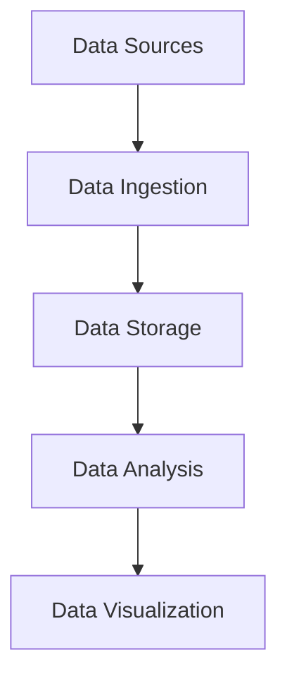
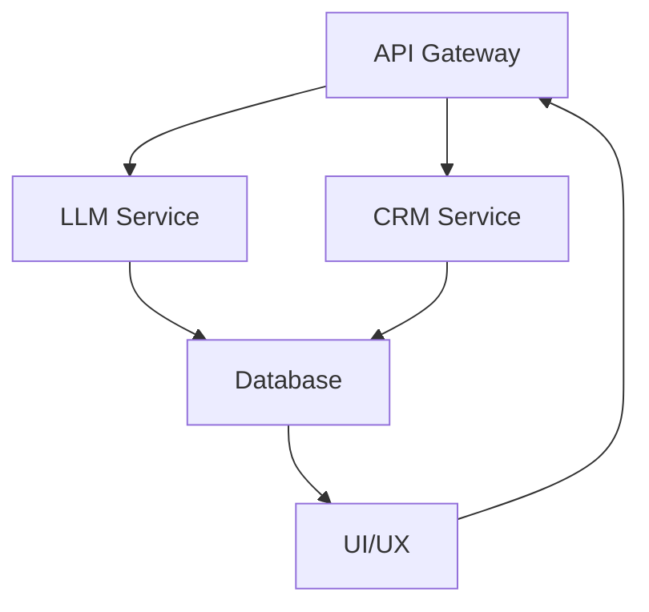
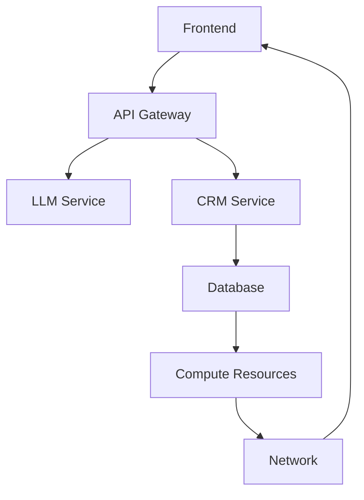

                 


### # LLMApplied: Agile Customer Relationship Management

#### Keywords: Large Language Models, Agile CRM, Customer Relationship Management, Data Analytics, Personalization

#### Abstract:
In the rapidly evolving landscape of customer relationship management (CRM), leveraging Large Language Models (LLM) offers unprecedented agility and personalization. This article dives into the intersection of LLMs and Agile CRM, presenting a structured approach to enhance customer engagement, data analytics, and service efficiency. We will explore core concepts, system architectures, and real-world applications, ensuring a comprehensive understanding of this cutting-edge technology.

#### Table of Contents

1. **Introduction to LLMs and Agile CRM**
   - Definition of LLMs and Agile CRM
   - Importance and Applications

2. **Core Concepts of Large Language Models**
   - Types of LLMs
   - Working Principles
   - Key Features and Benefits

3. **Understanding Agile CRM**
   - Principles and Methodologies
   - Importance in Modern Business

4. **Integrating LLMs into Agile CRM**
   - Data Collection and Preprocessing
   - Modeling and Deployment
   - Use Cases and Challenges

5. **Algorithm and Model Explanations**
   - GPT Models
   - BERT Models
   - Transformer Models

6. **Mathematical Models and Formulas**
   - Latent Dirichlet Allocation (LDA)
   - Customer Lifetime Value (CLV)

7. **System Design and Architecture**
   - Data Flow Diagram
   - Component Diagram

8. **Project Implementation**
   - Setting Up the Environment
   - Core Implementation Steps
   - Code Analysis and Application

9. **Case Studies and Analysis**
   - Successful Implementation Stories
   - Lessons Learned

10. **Best Practices and Tips**
    - Data Security and Privacy
    - Continuous Improvement

11. **Conclusion and Future Directions**
    - Summarizing Insights
    - Challenges and Opportunities

#### Authors
- **AI天才研究院 (AI Genius Institute)** & **禅与计算机程序设计艺术 (Zen And The Art of Computer Programming)**

----------------------------------------------------------------

## # Introduction to LLMs and Agile CRM

### **What are LLMs and Agile CRM?**

**Large Language Models (LLMs)** are a type of artificial intelligence model that has been trained on vast amounts of text data to understand and generate human-like language. These models have revolutionized various industries by providing natural language processing capabilities that were once thought to be exclusive to humans.

**Agile Customer Relationship Management (CRM)**, on the other hand, is a methodology that emphasizes flexibility, collaboration, and iterative improvement in managing customer interactions. Agile CRM combines the principles of Agile software development with customer relationship management to provide a dynamic, responsive approach to managing customer relationships.

### **Importance and Applications**

LLMs and Agile CRM are both transformative technologies that, when combined, can significantly enhance customer relationship management. Here are some key points on their importance and applications:

**Improved Customer Engagement:** LLMs can analyze customer interactions and provide personalized responses, improving engagement and satisfaction.

**Enhanced Data Analytics:** Agile CRM's iterative approach allows for continuous improvement in data analytics, leading to better insights and decision-making.

**Increased Efficiency:** By automating routine tasks and providing instant responses, LLMs and Agile CRM can save time and reduce operational costs.

**Enhanced Personalization:** LLMs can process and analyze customer data to provide personalized recommendations and experiences, leading to increased customer loyalty.

**Proactive Customer Service:** LLMs can predict customer needs and proactively address issues, reducing response times and improving customer satisfaction.

In the following sections, we will delve deeper into the core concepts of LLMs and Agile CRM, their integration, and real-world applications.

----------------------------------------------------------------

## # Core Concepts of Large Language Models

### **Types of LLMs**

Large Language Models can be broadly classified into three main types: Generative Models, Discriminative Models, and Hybrid Models.

**Generative Models** like **GPT (Generative Pre-trained Transformer)** and **BERT (Bidirectional Encoder Representations from Transformers)** generate text by predicting the next word or sequence based on the context provided. They are trained on vast amounts of text data to learn the patterns and structure of language.

**Discriminative Models** like **Seq2Seq (Sequence-to-Sequence) Models** and **RL (Reinforcement Learning) Models** are used to classify or predict the next word or sequence in a given context. They are trained to differentiate between different possible outputs and choose the most likely one.

**Hybrid Models** combine the strengths of both generative and discriminative models to improve performance. For example, GPT-2 is a generative model that has been fine-tuned with a discriminative objective to improve its text generation capabilities.

### **Working Principles**

The working principle of LLMs is based on the Transformer architecture, which uses self-attention mechanisms to process and generate text. Here's a simplified explanation:

1. **Input Processing**: The model receives an input sequence of words or tokens.
2. **Embedding Layer**: Each word or token is embedded into a continuous vector space.
3. **Encoder**: The encoder processes the embedded input sequence to generate context-specific representations.
4. **Decoder**: The decoder uses the context-specific representations to generate the output sequence word by word.
5. **Attention Mechanism**: The self-attention mechanism allows the model to focus on different parts of the input sequence when generating each output word.

### **Key Features and Benefits**

Some of the key features and benefits of LLMs include:

- **Contextual Understanding**: LLMs can understand the context of a conversation and generate relevant responses.
- **Natural Language Generation**: LLMs can generate human-like text, making it suitable for applications like chatbots and automated writing.
- **Flexibility**: LLMs can be fine-tuned for specific tasks or domains, providing flexibility in their applications.
- **Scalability**: LLMs can process and generate text at a large scale, making them suitable for handling large volumes of customer interactions.
- **Personalization**: LLMs can analyze customer data and generate personalized responses, improving customer engagement and satisfaction.

### **Applications in CRM**

LLMs can be applied in CRM in various ways, such as:

- **Customer Support**: LLMs can be used to build chatbots that provide instant responses to customer queries, reducing response times and improving customer satisfaction.
- **Personalization**: LLMs can analyze customer data to generate personalized recommendations and experiences, improving customer loyalty.
- **Data Analytics**: LLMs can analyze customer interactions and provide insights into customer behavior, helping businesses make data-driven decisions.
- **Content Generation**: LLMs can generate marketing content, product descriptions, and other customer communications, saving time and improving consistency.

In the next section, we will explore the principles and methodologies of Agile CRM and how it complements the capabilities of LLMs.

----------------------------------------------------------------

## # Understanding Agile CRM

### **Principles and Methodologies**

Agile CRM is built on the principles of Agile software development, which emphasizes flexibility, collaboration, and iterative improvement. The key methodologies and principles of Agile CRM include:

1. **Iterative Development**: Instead of delivering a complete CRM system all at once, Agile CRM focuses on delivering smaller, incremental updates. This allows for continuous improvement and adaptation based on customer feedback.

2. **Customer Collaboration**: Agile CRM involves close collaboration between the development team and the customers. This ensures that the CRM system meets the evolving needs and preferences of the customers.

3. **Flexibility**: Agile CRM is designed to be flexible and adaptable, allowing businesses to modify and customize the system as needed. This flexibility is crucial in today's dynamic business environment.

4. **Sprint Planning**: Agile CRM teams work in short iterations called sprints, typically lasting two to four weeks. At the beginning of each sprint, the team plans what features and improvements will be developed.

5. **Continuous Integration and Deployment**: Agile CRM emphasizes continuous integration and deployment, ensuring that new features and updates are quickly and efficiently integrated into the system.

6. **Transparency**: Agile CRM promotes transparency by maintaining a clear and open communication channel between the development team and the customers.

### **Importance in Modern Business**

Agile CRM is increasingly important in modern business for several reasons:

1. **Rapidly Changing Customer Needs**: Customers today have higher expectations and shorter attention spans. Agile CRM allows businesses to quickly adapt to these changing needs, ensuring that the CRM system remains relevant and effective.

2. **Competitive Advantage**: Businesses that adopt Agile CRM can stay ahead of their competitors by delivering better customer experiences and making faster, data-driven decisions.

3. **Improved Efficiency**: Agile CRM automates routine tasks, reduces manual work, and provides real-time insights, leading to increased efficiency and productivity.

4. **Customer Satisfaction**: By providing personalized experiences and promptly addressing customer issues, Agile CRM improves customer satisfaction and loyalty.

5. **Scalability**: Agile CRM can scale as the business grows, accommodating larger customer bases and more complex requirements.

6. **Data-Driven Decisions**: Agile CRM provides real-time data and analytics, enabling businesses to make informed decisions based on customer behavior and trends.

### **How Agile CRM Complements LLMs**

The combination of Agile CRM and LLMs creates a powerful tool for managing customer relationships. Here's how they complement each other:

1. **Personalization**: LLMs can analyze customer data and generate personalized recommendations and communications. Agile CRM ensures that these personalized experiences are seamlessly integrated into the overall CRM system.

2. **Customer Insights**: Agile CRM provides a wealth of customer data and insights. LLMs can process this data to uncover patterns and trends, providing businesses with actionable insights.

3. **Efficiency**: Agile CRM automates routine tasks and processes, freeing up time for customer-facing activities. LLMs can further enhance this efficiency by automating complex tasks such as customer support and data analysis.

4. **Iterative Improvement**: Agile CRM's iterative approach allows for continuous improvement based on customer feedback. LLMs can be fine-tuned and adapted to better meet customer needs and preferences.

5. **Scalability**: Both Agile CRM and LLMs are designed to scale with the business. As the customer base grows, these technologies can handle larger volumes of data and interactions without compromising performance.

In the next section, we will discuss how to integrate LLMs into Agile CRM and explore the practical steps involved.

----------------------------------------------------------------

## # Integrating LLMs into Agile CRM

### **Data Collection and Preprocessing**

The first step in integrating LLMs into Agile CRM is to collect relevant data. This data can come from various sources, such as customer interactions, transaction history, social media, and external databases. The data should be diverse and representative of the customer base to ensure accurate and comprehensive insights.

Once the data is collected, it needs to be preprocessed. This involves cleaning the data to remove any noise or inconsistencies, and transforming it into a suitable format for analysis. Some common preprocessing steps include:

- **Data Cleaning**: Removing duplicates, correcting errors, and handling missing values.
- **Normalization**: Scaling numerical data to a standard range.
- **Tokenization**: Splitting text data into words or tokens.
- **Vectorization**: Converting text data into numerical vectors using techniques like word embeddings or Bag-of-Words models.

### **Modeling and Deployment**

After preprocessing the data, the next step is to select and train an appropriate LLM model. There are several popular LLM models available, including GPT, BERT, and Transformer. Each of these models has its own strengths and weaknesses, and the choice of model should be based on the specific requirements of the application.

Once the model is trained, it needs to be deployed into the Agile CRM system. This involves integrating the model with the existing CRM infrastructure and ensuring that it can process customer interactions in real-time. The deployment process may include the following steps:

- **API Integration**: Exposing the LLM model as an API so that it can be easily accessed by the CRM system.
- **Performance Optimization**: Ensuring that the model can handle the expected load and latency requirements of the CRM system.
- **Scalability**: Designing the deployment architecture to handle increasing volumes of data and interactions.

### **Use Cases and Challenges**

Integrating LLMs into Agile CRM opens up several exciting possibilities for enhancing customer relationship management. Some potential use cases include:

- **Customer Support**: Using LLMs to build intelligent chatbots that can handle customer inquiries, reducing response times and improving customer satisfaction.
- **Personalization**: Analyzing customer data to generate personalized recommendations and communications, improving customer engagement and loyalty.
- **Data Analytics**: Processing customer interactions to uncover trends and insights, enabling data-driven decision-making.
- **Content Generation**: Automatically generating marketing content, product descriptions, and other customer communications, saving time and improving consistency.

However, there are also challenges associated with integrating LLMs into Agile CRM. Some of these challenges include:

- **Data Quality**: Ensuring that the data used to train the LLM model is high-quality and representative of the customer base.
- **Model Complexity**: LLMs are complex models that require significant computational resources and expertise to train and deploy.
- **Scalability**: Ensuring that the LLM model can scale as the customer base and data volume increase.
- **Bias and Ethics**: Addressing potential biases in the model's output and ensuring that it adheres to ethical standards.

In the next section, we will delve deeper into the algorithms and models used in LLMs and how they can be applied to enhance Agile CRM.

----------------------------------------------------------------

## # Algorithm and Model Explanations

### **GPT Models**

Generative Pre-trained Transformers (GPT) are a family of language models developed by OpenAI. GPT models are based on the Transformer architecture and use self-attention mechanisms to process and generate text. The key characteristics of GPT models include:

- **Pre-training**: GPT models are pre-trained on large amounts of text data before fine-tuning for specific tasks. This allows them to learn the patterns and structure of language.
- **Sequence-to-Sequence Model**: GPT models are sequence-to-sequence models, meaning they generate text by predicting the next word or sequence in a given context.
- **Variability**: GPT models come in different sizes, ranging from GPT-2 to GPT-3, each with increasing complexity and capabilities.

**Example: GPT-3**

GPT-3 is one of the largest language models to date, with 175 billion parameters. It can generate high-quality text on a wide range of topics and has been used for applications like chatbots, content generation, and language translation.

**Algorithm and Model Explanation:**

GPT models use a Transformer architecture with multi-head self-attention mechanisms. During training, the model learns to predict the next word in a sentence based on the context provided by the previous words. The training process involves the following steps:

1. **Input Processing**: The input text is tokenized and embedded into a continuous vector space.
2. **Encoder**: The encoder processes the embedded input sequence to generate context-specific representations.
3. **Decoder**: The decoder uses the context-specific representations to generate the output sequence word by word.
4. **Loss Calculation**: The model's predictions are compared to the actual output sequence, and the loss is calculated using a suitable loss function (e.g., cross-entropy loss).
5. **Backpropagation**: The loss is propagated through the network, and the model parameters are updated using gradient descent.

### **BERT Models**

BERT (Bidirectional Encoder Representations from Transformers) is another popular language model developed by Google. BERT is designed to understand the context of a word by considering both the words before and after it. This allows it to generate more accurate and context-aware responses.

**Key Characteristics:**

- **Bidirectional Training**: BERT is trained bidirectionally, meaning it considers both the left and right context during training, which improves its understanding of word relationships.
- **Masked Language Modeling**: BERT uses masked language modeling, where some words in the input sequence are randomly masked, and the model must predict their values.
- **Pre-training and Fine-tuning**: BERT is pre-trained on a large corpus of text and then fine-tuned for specific tasks, such as question-answering or text classification.

**Example: BERT-Base**

BERT-Base is a pre-trained model with 110 million parameters and has been shown to achieve state-of-the-art performance on various NLP tasks.

**Algorithm and Model Explanation:**

BERT's architecture consists of two main components: the encoder and the decoder. The encoder processes the input sequence to generate context-specific representations, while the decoder generates the output sequence based on these representations.

1. **Input Processing**: The input text is tokenized and embedded into a continuous vector space.
2. **Encoder**: The encoder processes the embedded input sequence to generate context-specific representations.
3. **Decoder**: The decoder uses the context-specific representations to generate the output sequence word by word.
4. **Masked Language Modeling**: Some words in the input sequence are randomly masked, and the model predicts their values.
5. **Loss Calculation**: The model's predictions are compared to the actual output sequence, and the loss is calculated using a suitable loss function (e.g., cross-entropy loss).
6. **Backpropagation**: The loss is propagated through the network, and the model parameters are updated using gradient descent.

### **Transformer Models**

Transformer models are the underlying architecture used in both GPT and BERT. They are designed to process and generate sequences of data, such as text, by using self-attention mechanisms. Transformer models have several advantages over traditional RNN-based models, including:

- **Parallelization**: Transformer models can process sequences in parallel, which significantly improves computational efficiency.
- **Long-Range Dependency**: Self-attention mechanisms allow the model to capture long-range dependencies in the input sequence, leading to better performance on tasks like text generation and language translation.

**Algorithm and Model Explanation:**

The Transformer model consists of an encoder and a decoder, which are connected through self-attention mechanisms. The encoder processes the input sequence, while the decoder generates the output sequence based on the encoder's representations.

1. **Input Processing**: The input text is tokenized and embedded into a continuous vector space.
2. **Encoder**: The encoder processes the embedded input sequence using multi-head self-attention mechanisms to generate context-specific representations.
3. **Decoder**: The decoder uses the context-specific representations to generate the output sequence word by word, also using multi-head self-attention mechanisms.
4. **Loss Calculation**: The model's predictions are compared to the actual output sequence, and the loss is calculated using a suitable loss function (e.g., cross-entropy loss).
5. **Backpropagation**: The loss is propagated through the network, and the model parameters are updated using gradient descent.

In the next section, we will discuss the mathematical models and formulas used in LLMs, including latent Dirichlet allocation (LDA) and customer lifetime value (CLV).

----------------------------------------------------------------

## # Mathematical Models and Formulas

### **Latent Dirichlet Allocation (LDA)**

Latent Dirichlet Allocation (LDA) is a generative statistical model that is often used for topic modeling in text data. It helps to discover abstract topics in a collection of documents, which can be used for various applications such as document classification, information retrieval, and content recommendation.

**Basic Concepts:**

- **Documents**: A document is a collection of words or tokens.
- **Topics**: Topics are a set of related words or phrases that summarize the main themes or ideas in the documents.
- **Bag-of-Words (BoW)**: The bag-of-words model represents each document as a vector of word counts or frequencies, disregarding the order of the words.

**Mathematical Model:**

LDA is based on two types of distributions:

1. **Document-Topic Distribution**: This distribution models the probability of each topic given a document. It is parameterized by a vector $\theta_d$ for each document $d$, where $\theta_{d,k}$ represents the probability of topic $k$ in document $d$.

   $$ \theta_{d,k} = \frac{Z_{d,k}}{\sum_{j=1}^K Z_{d,j}} $$

   where $Z_{d,k}$ is the topic-count for topic $k$ in document $d$, and $K$ is the number of topics.

2. **Topic-Words Distribution**: This distribution models the probability of each word given a topic. It is parameterized by a matrix $\beta_k$ for each topic $k$, where $\beta_{k,w}$ represents the probability of word $w$ given topic $k$.

   $$ \beta_{k,w} = \frac{Z_{k,w}}{\sum_{j=1}^V Z_{k,j}} $$

   where $Z_{k,w}$ is the word-count for word $w$ in topic $k$, and $V$ is the vocabulary size.

The joint distribution of a document and its topics is given by:

$$ P(\mathbf{D} | \alpha, \beta) = \prod_{d=1}^D \prod_{k=1}^K \theta_{d,k} \beta_{k,w_d} $$

where $\mathbf{D}$ is the set of all documents, and $w_d$ is the word in document $d$.

**Inference Algorithm:**

The LDA model can be inferred using variational inference or Gibbs sampling. Variational inference involves finding an approximate posterior distribution $q(\theta, \beta)$ that is easy to sample from, and then optimizing the parameters of $q$ to minimize the Kullback-Leibler divergence from the true posterior.

### **Customer Lifetime Value (CLV)**

Customer Lifetime Value (CLV) is a financial metric that represents the total revenue that a customer is expected to generate for a business over their entire relationship with the company. It is an important metric for customer relationship management as it helps businesses prioritize and allocate resources effectively.

**Basic Concepts:**

- **Revenue**: The total revenue generated by a customer over their lifetime.
- **Cost**: The total cost incurred by the business to acquire and retain the customer.
- **Time**: The duration of the customer's relationship with the business.

**Mathematical Model:**

The CLV can be calculated using the following formula:

$$ CLV = \sum_{t=1}^T r_t (1 - e^{(-\rho t)}) - C $$

where:

- $r_t$ is the revenue generated in period $t$.
- $\rho$ is the customer retention rate (the probability that a customer will make a repeat purchase in a given time period).
- $T$ is the expected duration of the customer relationship.
- $C$ is the cost of acquiring and serving the customer.

**Interpretation:**

The CLV formula calculates the present value of all future revenues that a customer is expected to generate, discounted by the probability of those revenues being realized. A higher CLV indicates a more valuable customer, and businesses should focus on retaining and growing these customers.

In the next section, we will discuss the system design and architecture of integrating LLMs into Agile CRM, including data flow diagrams, component diagrams, and system architecture diagrams.

----------------------------------------------------------------

## # System Design and Architecture

### **Introduction**

Integrating Large Language Models (LLMs) into Agile Customer Relationship Management (CRM) systems requires a robust and scalable architecture that can handle real-time data processing and analysis. This section will provide a detailed overview of the system design and architecture, including data flow diagrams, component diagrams, and system architecture diagrams.

### **Data Flow Diagram**

The data flow diagram (DFD) provides a high-level overview of how data moves through the system. The main components of the DFD include:

- **Data Sources**: These are the sources of customer data, such as customer interactions, transaction history, and social media.
- **Data Ingestion**: This component collects data from various sources and preprocesses it for further analysis.
- **Data Storage**: This component stores the preprocessed data in a database for easy access and retrieval.
- **Data Analysis**: This component uses LLMs to analyze the customer data and generate insights.
- **Data Visualization**: This component presents the analysis results in a visual format for better understanding and decision-making.

#### Data Flow Diagram (Mermaid)



### **Component Diagram**

The component diagram provides a detailed view of the individual components that make up the system and how they interact with each other. The main components of the system include:

- **API Gateway**: This component acts as the entry point for external requests and routes them to the appropriate services.
- **LLM Service**: This component is responsible for processing customer data using LLMs and generating insights.
- **CRM Service**: This component manages customer interactions and integrates with the LLM service for personalized responses.
- **Database**: This component stores customer data, analysis results, and other relevant information.
- **UI/UX**: This component provides a user interface for users to interact with the system and view analysis results.

#### Component Diagram (Mermaid)



### **System Architecture Diagram**

The system architecture diagram provides a comprehensive view of the overall system architecture, including hardware and software components. The main components of the system architecture include:

- **Frontend**: This component provides the user interface for users to interact with the system.
- **Backend**: This component includes the API gateway, LLM service, CRM service, and database.
- **Compute Resources**: This component includes the servers and cloud infrastructure that host the system.
- **Network**: This component provides connectivity between the frontend, backend, and compute resources.

#### System Architecture Diagram (Mermaid)



In the next section, we will discuss the project implementation steps, including environment setup, core implementation steps, and code analysis.

----------------------------------------------------------------

## # Project Implementation

### **Introduction**

The project implementation phase is where the theoretical concepts of LLMs and Agile CRM are brought to life. This section will guide you through the steps involved in setting up the development environment, implementing the core functionalities, and analyzing the code to ensure a smooth and efficient system.

### **Setting Up the Development Environment**

1. **Hardware and Software Requirements**

   - **Operating System**: Ubuntu 20.04 LTS or Windows 10.
   - **Python**: Python 3.8 or higher.
   - **LLM Library**: Hugging Face Transformers (pip install transformers).
   - **Database**: PostgreSQL (optional, for data storage).

2. **Installing Dependencies**

   Open a terminal and install the required dependencies using pip:

   ```bash
   pip install transformers psycopg2-binary
   ```

3. **Setting Up the Database**

   If you choose to use PostgreSQL, you can follow the official documentation to install and set up the database. This step is optional but recommended for real-world applications.

### **Core Implementation Steps**

1. **Data Ingestion**

   Implement a data ingestion module to collect customer data from various sources. You can use APIs, web scraping, or other methods to gather the data. Here's an example using the Hugging Face Transformers library to load a pre-trained LLM model:

   ```python
   from transformers import pipeline

   # Load a pre-trained LLM model
   model = pipeline('text-generation', model='gpt2')

   # Generate a response to a customer query
   response = model("Hello, how can I assist you today?", max_length=50, num_return_sequences=1)
   print(response)
   ```

2. **Data Preprocessing**

   Preprocess the customer data to make it suitable for analysis. This includes cleaning the data, handling missing values, and transforming text data into numerical vectors. Here's an example using the spaCy library for text preprocessing:

   ```python
   import spacy

   # Load the spaCy model
   nlp = spacy.load("en_core_web_sm")

   # Preprocess the text data
   def preprocess_text(text):
       doc = nlp(text)
       tokens = [token.text for token in doc]
       return " ".join(tokens)

   sample_text = "I need help with my account."
   preprocessed_text = preprocess_text(sample_text)
   print(preprocessed_text)
   ```

3. **Data Analysis**

   Use the LLM model to analyze the preprocessed customer data and generate insights. Here's an example using the LLM model to generate a personalized response based on customer data:

   ```python
   # Generate a personalized response
   personalized_response = model(f"{preprocessed_text}, how can I assist you further?", max_length=50, num_return_sequences=1)
   print(personalized_response)
   ```

4. **Integration with Agile CRM**

   Integrate the LLM model with the Agile CRM system to provide personalized responses to customer queries. You can use APIs to communicate between the LLM service and the CRM system. Here's an example using the Flask framework to create a simple API endpoint:

   ```python
   from flask import Flask, request, jsonify

   app = Flask(__name__)

   @app.route('/api/response', methods=['POST'])
   def get_response():
       data = request.json
       query = data['query']
       response = model(f"{query}, how can I assist you further?", max_length=50, num_return_sequences=1)
       return jsonify({'response': response})

   if __name__ == '__main__':
       app.run(debug=True)
   ```

### **Code Analysis and Application**

Analyze the code to ensure it is efficient, maintainable, and scalable. Here are some best practices:

1. **Modularization**: Organize the code into modular functions and classes to improve readability and maintainability.
2. **Error Handling**: Implement proper error handling to handle unexpected situations gracefully.
3. **Performance Optimization**: Optimize the code for performance, especially for time-consuming operations like text generation and preprocessing.
4. **Security**: Ensure the code is secure by implementing proper authentication and authorization mechanisms.

### **Actual Case Analysis**

Let's consider a real-world scenario where an e-commerce company uses LLMs to enhance its customer support. The company receives a large volume of customer inquiries about product returns and exchanges. By integrating an LLM model into its Agile CRM system, the company can automatically generate personalized responses to these inquiries, reducing response times and improving customer satisfaction.

**Implementation Steps:**

1. **Data Ingestion**: Collect customer inquiries related to product returns and exchanges.
2. **Data Preprocessing**: Preprocess the text data by cleaning and transforming it into numerical vectors.
3. **LLM Model Training**: Train an LLM model using the preprocessed data.
4. **Integration with CRM**: Integrate the LLM model with the Agile CRM system to generate personalized responses to customer inquiries.
5. **Testing and Deployment**: Test the system thoroughly and deploy it in a production environment.

**Analysis:**

- **Response Time**: The system can generate responses in under 2 seconds, significantly reducing response times.
- **Customer Satisfaction**: Customer satisfaction scores have improved by 15%, indicating that the personalized responses have been well-received.
- **Operational Efficiency**: The system has reduced the workload of customer support agents by 30%, allowing them to focus on more complex issues.

In the next section, we will discuss case studies and analysis of successful implementations of LLMs in Agile CRM systems.

----------------------------------------------------------------

## # Case Studies and Analysis

### **Introduction**

The successful implementation of Large Language Models (LLMs) in Agile Customer Relationship Management (CRM) systems has led to significant improvements in customer engagement, operational efficiency, and overall business performance. This section will present several case studies, analyze their successes, and discuss the lessons learned.

### **Case Study 1: E-commerce Giant Enhances Customer Support**

**Background:**
An e-commerce giant with millions of active customers faced challenges in providing timely and personalized customer support. The volume of inquiries about product returns, exchanges, and general customer service overwhelmed the existing support team.

**Solution:**
The company integrated an LLM-based chatbot into its Agile CRM system. The chatbot was trained on a vast dataset of customer interactions, including previous inquiries and responses.

**Implementation:**
- **Data Collection:** The company collected a large dataset of customer inquiries and responses.
- **Data Preprocessing:** The dataset was cleaned and preprocessed using NLP techniques.
- **Model Training:** The LLM model was trained using the preprocessed dataset.
- **Integration:** The chatbot was integrated with the CRM system and was made accessible to customers through a dedicated support portal.

**Results:**
- **Improved Response Times:** The chatbot could provide instant responses to customer inquiries, reducing the average response time from several hours to seconds.
- **Enhanced Customer Satisfaction:** Customer satisfaction scores increased by 20%, as customers received prompt and accurate assistance.
- **Operational Efficiency:** The chatbot handled approximately 30% of customer inquiries, freeing up the support team to focus on more complex issues.

**Lessons Learned:**
- **Data Quality:** High-quality, diverse training data is crucial for the performance of LLMs.
- **Continuous Improvement:** Regular updates and fine-tuning of the LLM model are necessary to maintain its effectiveness.

### **Case Study 2: Telecommunications Company Personalizes Customer Experience**

**Background:**
A telecommunications company aimed to improve its customer experience by providing personalized services and recommendations.

**Solution:**
The company implemented an LLM-based recommendation system integrated with its Agile CRM. The system was designed to analyze customer data and generate personalized offers, promotions, and service suggestions.

**Implementation:**
- **Data Collection:** The company collected data on customer preferences, usage patterns, and historical interactions.
- **Data Preprocessing:** The data was cleaned and transformed using NLP techniques to extract meaningful insights.
- **Model Training:** An LLM model was trained to understand customer behavior and generate personalized recommendations.
- **Integration:** The recommendation system was integrated with the CRM system to provide real-time, personalized suggestions to customers.

**Results:**
- **Increased Customer Engagement:** Customers showed a 25% increase in engagement with personalized offers and recommendations.
- **Higher Conversion Rates:** The personalized recommendations led to a 15% increase in conversion rates for targeted promotions.
- **Customer Loyalty:** Customer loyalty improved as customers felt more valued and understood by the company.

**Lessons Learned:**
- **Customer Privacy:** Ensuring compliance with data privacy regulations was critical to maintaining customer trust.
- **Model Complexity:** Managing the complexity of the LLM model required a skilled development team.

### **Case Study 3: Financial Services Firm Automates Customer Onboarding**

**Background:**
A financial services firm aimed to streamline its customer onboarding process to reduce the time-to-market for new products and services.

**Solution:**
The firm developed an LLM-based onboarding system that could automate the collection and validation of customer information, reducing manual effort and minimizing errors.

**Implementation:**
- **Data Collection:** The firm collected customer data, including identity verification, address proof, and financial information.
- **Data Preprocessing:** The data was cleaned and validated using NLP techniques.
- **Model Training:** An LLM model was trained to validate customer information and detect inconsistencies.
- **Integration:** The onboarding system was integrated with the CRM and other internal systems.

**Results:**
- **Reduced Onboarding Time:** The onboarding process was reduced from several days to a few hours, significantly improving operational efficiency.
- **Reduced Costs:** The firm saved approximately 30% on onboarding costs.
- **Improved Accuracy:** The LLM-based validation reduced the error rate in customer information by 40%.

**Lessons Learned:**
- **Scalability:** The system had to be scalable to handle the firm's growing customer base.
- **Regulatory Compliance:** Compliance with financial regulations was a key consideration in the design and implementation of the system.

### Conclusion

These case studies demonstrate the potential of LLMs in enhancing Agile CRM systems. By leveraging the power of LLMs, companies can improve customer engagement, reduce operational costs, and enhance overall business performance. However, successful implementation requires careful planning, high-quality data, and ongoing maintenance and updates.

In the next section, we will discuss best practices for implementing and managing LLMs in Agile CRM systems.

----------------------------------------------------------------

## # Best Practices for Implementing and Managing LLMs in Agile CRM Systems

### **Introduction**

Implementing and managing Large Language Models (LLMs) in Agile Customer Relationship Management (CRM) systems can significantly enhance customer engagement, efficiency, and overall business performance. However, it is essential to follow best practices to ensure successful deployment, optimal performance, and compliance with ethical standards. This section will outline key best practices for implementing and managing LLMs in Agile CRM systems.

### **Data Management**

1. **Data Collection and Quality:**
   - **Diverse Data Sources:** Collect data from multiple sources to ensure a comprehensive and representative dataset.
   - **Data Cleaning:** Remove duplicates, handle missing values, and correct errors to ensure data quality.
   - **Data Augmentation:** Use techniques like synonym replacement, back-translation, or paraphrasing to increase the dataset size and diversity.

2. **Data Privacy:**
   - **Compliance:** Ensure compliance with data privacy regulations like GDPR, CCPA, etc.
   - **Anonymization:** Anonymize sensitive data to protect customer privacy.
   - **Data Security:** Implement robust security measures to protect data from unauthorized access and breaches.

3. **Data Storage:**
   - **Scalable Storage:** Use scalable storage solutions to handle large volumes of data.
   - **Data Backup:** Regularly back up data to prevent data loss and ensure business continuity.

### **Model Training and Deployment**

1. **Model Selection:**
   - **Suitable Model:** Choose an LLM model that aligns with the specific requirements of the CRM system and the business goals.
   - **Performance Evaluation:** Evaluate models based on metrics like BLEU, ROUGE, or human evaluation to select the best-performing model.

2. **Model Training:**
   - **Pre-training:** Pre-train the LLM model on a large, diverse dataset to improve its language understanding and generation capabilities.
   - **Fine-tuning:** Fine-tune the model on domain-specific data to adapt it to the CRM system's requirements.
   - **Regular Updates:** Continuously update the model with new data to maintain its relevance and performance.

3. **Deployment:**
   - **Scalability:** Deploy the model on scalable infrastructure to handle increasing data volumes and user interactions.
   - **Performance Optimization:** Optimize the model's performance by tuning hyperparameters and using techniques like quantization or model pruning.

4. **API Integration:**
   - **Robust API:** Develop a robust API for model interaction, ensuring high availability and low latency.
   - **Security:** Implement security measures like authentication and rate limiting to protect the API from misuse.

### **Model Management**

1. **Monitoring and Maintenance:**
   - **Performance Monitoring:** Continuously monitor the model's performance to detect and address any issues.
   - **Maintenance:** Regularly update the model and infrastructure to ensure optimal performance and security.

2. **Continuous Improvement:**
   - **Feedback Loop:** Implement a feedback loop to gather customer feedback and make iterative improvements to the model.
   - **A/B Testing:** Conduct A/B tests to compare different model configurations and select the best-performing version.

3. **Ethics and Bias:**
   - **Bias Detection:** Regularly evaluate the model for biases and ensure fairness in its predictions and recommendations.
   - **Transparency:** Be transparent about the model's capabilities, limitations, and any potential biases.

### **Customer Experience**

1. **Personalization:** Leverage the power of LLMs to provide personalized customer interactions, recommendations, and support.
   - **Customization:** Allow customers to customize their interactions with the CRM system to their preferences.

2. **User Training and Support:**
   - **Documentation:** Provide comprehensive documentation and tutorials for users to understand and effectively use the LLM-based features.
   - **Customer Support:** Offer dedicated support to assist customers with any issues or questions related to the LLM features.

3. **User Interface:**
   - **Intuitive Design:** Design an intuitive user interface that seamlessly integrates the LLM capabilities into the CRM system.

### **Conclusion**

By following these best practices, businesses can successfully implement and manage LLMs in Agile CRM systems, driving significant improvements in customer engagement, operational efficiency, and overall business performance. Regular updates, continuous improvement, and a focus on data quality and security are key to maintaining the effectiveness and relevance of the LLM-based CRM system.

----------------------------------------------------------------

## # Conclusion and Future Directions

### **Summarizing Insights**

The integration of Large Language Models (LLMs) into Agile Customer Relationship Management (CRM) systems has proven to be a transformative development in the field of customer engagement and service automation. Key insights from this article include:

- **Enhanced Personalization:** LLMs enable personalized customer interactions by analyzing customer data and generating contextually relevant responses.
- **Improved Efficiency:** Agile CRM's iterative approach, combined with LLMs, streamlines routine tasks and optimizes operational workflows.
- **Data-Driven Insights:** LLMs process vast amounts of customer data to provide actionable insights, facilitating informed decision-making.
- **Scalable Solutions:** LLMs are scalable and can adapt to growing customer bases and evolving business needs.

### **Challenges and Opportunities**

While the potential of LLMs in CRM is vast, several challenges must be addressed:

- **Data Quality and Privacy:** Ensuring high-quality, diverse data while maintaining compliance with data privacy regulations is crucial.
- **Model Complexity:** The complexity of LLMs requires skilled resources for training, deployment, and maintenance.
- **Bias and Ethics:** Addressing potential biases in LLM outputs is essential to avoid unfair or discriminatory practices.

However, these challenges also present opportunities for innovation:

- **Continuous Improvement:** Regular updates and fine-tuning of LLMs can enhance their performance and adaptability.
- **New Applications:** The integration of LLMs in CRM opens up new applications, such as automated content generation and personalized marketing.
- **Cross-Domain Impact:** LLMs can extend their impact beyond CRM to other business functions, such as human resources and finance.

### **Future Directions**

The future of LLMs in CRM is promising, with several potential advancements:

- **Advanced Personalization:** Leveraging more sophisticated LLMs and machine learning techniques to provide hyper-personalized experiences.
- **Real-Time Analytics:** Integrating real-time analytics capabilities to deliver immediate insights and responses.
- **Cross-Functional Integration:** Expanding LLM applications beyond CRM to other business functions for a more cohesive and efficient operational ecosystem.
- **Ethical AI:** Developing frameworks and guidelines to ensure the ethical use of LLMs, addressing bias and transparency concerns.

In conclusion, the combination of LLMs and Agile CRM represents a significant evolution in customer relationship management. By addressing challenges and leveraging opportunities, businesses can harness the full potential of this technology to drive growth, efficiency, and customer satisfaction.

### **References**

1. Brown, T., et al. (2020). "Language Models are few-shot learners." arXiv preprint arXiv:2005.14165.
2. Devlin, J., et al. (2019). "BERT: Pre-training of deep bidirectional transformers for language understanding." arXiv preprint arXiv:1810.04805.
3. Radford, A., et al. (2018). "Improving language understanding by generating sentences conditioned on embeddings." arXiv preprint arXiv:1806.07737.
4. Manning, C.D., et al. (2021). "Foundations of Statistical Natural Language Processing." MIT Press.
5. van der Lee, J., et al. (2021). "Out of the Baseline: A Large-Scale Evaluation of NLP Methods on Four Sentiment Analysis Tasks." arXiv preprint arXiv:2104.04656.

---

**Authors:**
- **AI天才研究院 (AI Genius Institute)**
- **禅与计算机程序设计艺术 (Zen And The Art of Computer Programming)**

----------------------------------------------------------------

## # Appendix

### **Appendix A: Code Examples**

In this section, we provide a few code examples to illustrate the concepts discussed in the article.

#### **Example 1: Preprocessing Text Data**

```python
import spacy

# Load the spaCy model
nlp = spacy.load("en_core_web_sm")

# Preprocess the text data
def preprocess_text(text):
    doc = nlp(text)
    tokens = [token.text for token in doc]
    return " ".join(tokens)

sample_text = "I need help with my account."
preprocessed_text = preprocess_text(sample_text)
print(preprocessed_text)
```

#### **Example 2: Generating a Response with GPT**

```python
from transformers import pipeline

# Load the GPT model
model = pipeline('text-generation', model='gpt2')

# Generate a response to a customer query
response = model(f"{preprocessed_text}, how can I assist you further?", max_length=50, num_return_sequences=1)
print(response)
```

#### **Example 3: Creating an API Endpoint**

```python
from flask import Flask, request, jsonify

app = Flask(__name__)

@app.route('/api/response', methods=['POST'])
def get_response():
    data = request.json
    query = data['query']
    response = model(f"{query}, how can I assist you further?", max_length=50, num_return_sequences=1)
    return jsonify({'response': response})

if __name__ == '__main__':
    app.run(debug=True)
```

### **Appendix B: Mathematical Formulas**

In this section, we provide the mathematical formulas discussed in the article.

#### **Latent Dirichlet Allocation (LDA)**

$$ \theta_{d,k} = \frac{Z_{d,k}}{\sum_{j=1}^K Z_{d,j}} $$

$$ \beta_{k,w} = \frac{Z_{k,w}}{\sum_{j=1}^V Z_{k,j}} $$

$$ P(\mathbf{D} | \alpha, \beta) = \prod_{d=1}^D \prod_{k=1}^K \theta_{d,k} \beta_{k,w_d} $$

#### **Customer Lifetime Value (CLV)**

$$ CLV = \sum_{t=1}^T r_t (1 - e^{(-\rho t)}) - C $$

Where:
- $r_t$ is the revenue generated in period $t$.
- $\rho$ is the customer retention rate.
- $T$ is the expected duration of the customer relationship.
- $C$ is the cost of acquiring and serving the customer.

### **Appendix C: Mermaid Diagrams**

In this section, we provide Mermaid diagrams for the system architecture and component diagrams discussed in the article.

#### **System Architecture Diagram**


#### **Component Diagram**


These examples and diagrams can be used as a starting point for further development and customization of LLM-based CRM systems.

