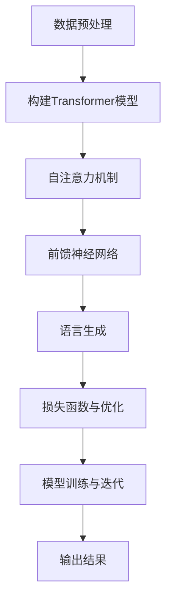

                 

### 引言

《LLM应用的敏捷本地化与国际化策略》这本书的目标在于引导企业和开发者在全球化浪潮中，如何高效地利用大型语言模型（LLM）进行本地化与国际化。在全球化的背景下，产品的本地化和国际化已经成为企业拓展市场、提高竞争力的关键策略。然而，这一过程面临着诸多挑战，特别是如何将复杂的技术手段如大型语言模型应用到实际的本地化和国际化流程中。

本地化指的是将产品或服务适应特定文化和社会环境的过程，而国际化则是在全球范围内推广产品或服务，满足不同地区的需求。随着互联网和移动设备的普及，企业需要快速响应不同市场的需求，这就要求本地化和国际化策略具备高度的敏捷性。

大型语言模型（LLM）是一种基于深度学习的自然语言处理技术，具有强大的文本生成、理解和翻译能力。LLM的出现，为本地化和国际化提供了强大的技术支持，使得企业和开发者能够更高效、更准确地实现多语言内容的生产和传播。

本书的编写旨在通过逻辑清晰、结构紧凑、简单易懂的写作方式，帮助读者逐步理解和掌握LLM在本地化与国际化中的应用。我们将从以下几个部分展开讨论：

1. **背景介绍与核心概念**：介绍本地化与国际化的问题背景、定义及其与LLM的关系。
2. **核心概念与联系**：深入探讨LLM的基本概念、特点以及与传统NLP技术的对比。
3. **算法原理与实现**：详细讲解LLM的算法原理、数学模型以及实现过程。
4. **项目实战与案例分析**：通过具体项目实战和案例分析，展示如何将LLM应用于本地化和国际化。
5. **最佳实践与拓展**：总结最佳实践，并提供相关的注意事项和拓展阅读资源。

希望通过这本书，读者能够系统地掌握LLM在本地化与国际化中的应用策略，为企业的国际化业务提供坚实的理论支持和实践指导。

### 关键词

- 大型语言模型（LLM）
- 本地化
- 国际化
- 敏捷策略
- 自然语言处理（NLP）
- 技术实现
- 项目实战
- 案例分析
- 最佳实践

### 摘要

《LLM应用的敏捷本地化与国际化策略》旨在探讨如何在全球化的背景下，利用大型语言模型（LLM）实现产品和服务的本地化与国际化。本书首先介绍了本地化与国际化的问题背景、定义及其重要性，接着深入探讨了LLM的基本概念、特点以及与传统自然语言处理（NLP）技术的对比。随后，本书详细讲解了LLM的算法原理、数学模型及其实现过程，并通过具体项目实战和案例分析，展示了LLM在本地化和国际化中的实际应用。最后，本书总结了最佳实践，并提供了注意事项和拓展阅读资源，帮助读者更好地理解和掌握LLM在本地化与国际化中的应用策略。本书适合从事国际化业务、技术团队、研发人员以及高校相关专业的师生阅读，旨在为企业的国际化战略提供有效的理论支持和实践指导。

### 目录大纲设计

在《LLM应用的敏捷本地化与国际化策略》一书中，我们精心设计了详细的目录大纲，旨在为读者提供一条清晰、系统的学习路径。以下是本书的详细目录大纲：

#### 第一部分：背景介绍与核心概念

**第1章：本地化与国际化概述**

- 1.1 本地化与国际化的问题背景
- 1.2 本地化与国际化的定义与区别
- 1.3 大型语言模型（LLM）在本地化与国际化中的应用
- 1.4 本地化与国际化的重要性

**第2章：大型语言模型（LLM）原理**

- 2.1 LLM的基本概念
- 2.2 LLM的核心特点
- 2.3 LLM与传统NLP技术的对比

**第3章：本地化与国际化策略**

- 3.1 本地化策略
- 3.2 国际化策略
- 3.3 LLM在本地化与国际化策略中的应用

#### 第二部分：核心概念与联系

**第4章：LLM算法原理讲解**

- 4.1 算法原理
- 4.2 数学模型与公式
- 4.3 算法流程图

**第5章：LLM算法实现与优化**

- 5.1 实现步骤
- 5.2 优化技巧
- 5.3 性能评估

#### 第三部分：算法原理与实现

**第6章：敏捷本地化项目实战**

- 6.1 项目背景
- 6.2 系统功能设计
- 6.3 系统架构设计
- 6.4 项目实施
- 6.5 项目小结

**第7章：国际化案例分析**

- 7.1 案例背景
- 7.2 案例分析
- 7.3 案例小结

#### 第四部分：项目实战与案例分析

**第8章：最佳实践**

- 8.1 本地化最佳实践
- 8.2 国际化最佳实践
- 8.3 LLM应用最佳实践

**第9章：注意事项与拓展阅读**

- 9.1 注意事项
- 9.2 拓展阅读

#### 第五部分：总结

**第10章：总结**

- 10.1 LLM在本地化与国际化中的总结
- 10.2 未来展望与挑战

#### 附录

- **附录A：术语解释**
- **附录B：参考资料**
- **附录C：代码示例**

通过以上详细的目录大纲设计，读者可以循序渐进地了解和掌握LLM在本地化与国际化中的应用策略。每个章节都精心编排，从基础理论到实践案例，再到最佳实践，力求为读者提供全面、系统的指导。

### 引言

在当今全球化经济的浪潮下，企业的国际化战略变得尤为重要。然而，实现产品的本地化和国际化面临着诸多挑战。本地化是将产品或服务适应特定文化和社会环境的过程，而国际化则是将产品或服务在全球范围内推广，满足不同地区的需求。这两者的核心在于如何有效地与当地市场和消费者进行沟通，提升品牌知名度和市场份额。

本地化与国际化在商业战略中的重要性不可忽视。首先，本地化能够帮助企业更好地理解并满足当地市场的需求，从而提高用户满意度和忠诚度。例如，谷歌在进入中国市场时，不仅提供了中文界面，还根据中国的文化特点调整了搜索算法，使其更加符合中国用户的使用习惯。其次，国际化能够帮助企业拓展全球市场，提高销售额和利润率。通过在不同国家推出本地化的产品或服务，企业可以抓住更多市场机会，实现全球化布局。

然而，本地化与国际化并非一蹴而就，它们需要一系列策略和技术的支持。其中，大型语言模型（LLM）作为一种先进的自然语言处理技术，为本地化和国际化提供了强大的工具。LLM能够自动生成、理解和翻译多语言内容，显著提高了本地化和国际化的效率和质量。

本书旨在探讨如何利用LLM实现敏捷的本地化与国际化。首先，我们将介绍本地化与国际化的问题背景，定义相关术语，并探讨它们在商业战略中的重要性。接着，我们将详细讨论LLM的基本概念、特点以及与传统自然语言处理（NLP）技术的对比，帮助读者理解LLM在本地化和国际化中的优势。

随后，本书将分章节深入探讨LLM的算法原理、实现步骤、优化技巧以及性能评估，通过具体的案例分析和项目实战，展示LLM在实际应用中的效果。此外，我们还将总结本地化和国际化的最佳实践，并提供注意事项和拓展阅读资源，帮助读者在具体实践中更好地应用LLM技术。

总之，本书的目标是帮助读者系统地掌握LLM在本地化与国际化中的应用策略，为企业的国际化业务提供坚实的理论支持和实践指导。希望通过这本书，读者能够更好地应对全球化带来的挑战，实现产品和服务的全球推广。

### 本地化与国际化概述

#### 1.1 本地化与国际化的问题背景

在全球化的背景下，企业面临着日益复杂的国际化环境。产品和服务需要满足不同国家和地区消费者的需求，这就要求企业具备强大的本地化与国际化能力。本地化与国际化的问题背景可以从多个角度来分析，包括文化差异、市场细分和消费者行为的变化。

首先，文化差异是本地化与国际化过程中面临的最大挑战之一。不同的文化背景会影响消费者对产品或服务的感知和接受度。例如，一个产品在西方文化中被视为时尚和创新，但在某些东方文化中可能被认为过于前卫或不合适。为了克服这一挑战，企业需要进行深入的市场调研，了解目标市场的文化特征和消费者偏好，从而调整产品设计和营销策略。

其次，市场细分使得企业需要更精准地定位不同消费群体。随着消费者需求的多样化，企业需要提供多样化的产品或服务以满足不同市场的需求。例如，在中国市场，不同年龄段、收入水平和地域的消费者对产品的需求各不相同。本地化策略需要根据这些差异进行定制化，从而提高市场竞争力。

最后，消费者行为的变化也是本地化与国际化的重要背景。互联网和移动设备的普及，使得消费者获取信息和进行购买的方式发生了巨大变化。在线购物、社交媒体和移动应用成为消费者获取信息的主要途径。企业需要通过本地化的数字营销策略，如社交媒体广告、本地化的在线商城和移动应用，来吸引和保留消费者。

综上所述，本地化与国际化的问题背景复杂且多样，企业需要具备强大的适应能力和创新意识，才能在全球化市场中取得成功。

#### 1.2 本地化与国际化的定义与区别

本地化（Localization）和国际化（Internationalization）是两个密切相关但又有显著区别的概念。了解这两个术语的定义及其差异，对于企业在全球化市场中制定有效的本地化和国际化策略至关重要。

**本地化**是指将产品、服务或内容根据特定目标市场的文化、语言、法律和习俗进行调整，使其更贴近当地消费者的需求和使用习惯。本地化的核心在于文化适应和语言转换，它涉及到多个方面的调整，包括用户界面、市场营销、法律文本、支付方式等。例如，一个电子商务平台在进入中国市场时，需要将界面翻译成中文，并根据中国消费者的购物习惯进行调整，如添加支付宝支付选项。

**国际化**则是指企业在全球范围内推广其产品或服务，使其能够满足不同国家和地区消费者的需求。国际化的目标是通过全球市场扩张来增加市场份额和销售额。国际化过程中，企业不仅需要考虑文化差异，还需要关注市场的经济状况、法律法规以及竞争环境。国际化通常包括多个步骤，如市场调研、品牌推广、渠道建设和产品定位等。

**本地化与国际化的区别**主要体现在以下几个方面：

1. **目标**：本地化的目标是使产品或服务在特定市场中更具吸引力，而国际化的目标是实现全球市场的扩展。

2. **范围**：本地化通常针对单一或几个特定市场，而国际化则涉及多个市场和国家。

3. **策略**：本地化更多关注于对产品和服务的调整，以满足当地市场的需求，而国际化则注重全球市场布局和资源配置。

4. **文化适应性**：本地化要求对文化、语言、习俗等方面进行高度适应，而国际化则强调在全球范围内的统一和标准化。

5. **资源投入**：本地化通常需要较大的资源投入，特别是在翻译、法律合规和市场营销方面，而国际化则需要更多的战略规划和长期投入。

总的来说，本地化和国际化虽然有着不同的目标和策略，但两者相互依赖，共同构成了企业的全球化战略。企业在制定国际化策略时，需要充分考虑本地化的需求和挑战，以确保产品或服务在不同市场中的成功推广。

#### 1.3 大型语言模型（LLM）在本地化与国际化中的应用

大型语言模型（LLM）在本地化与国际化中的应用具有革命性的意义，极大地提升了效率和效果。LLM是一种基于深度学习的自然语言处理技术，具有强大的文本生成、理解和翻译能力。其在本地化和国际化中的应用主要体现在以下几个关键方面：

**1. 自动翻译和文本生成**

LLM在自动翻译和多语言文本生成方面表现卓越。传统的机器翻译技术依赖于规则和统计方法，而LLM通过学习海量的多语言数据，能够生成更加自然、流畅的翻译结果。例如，谷歌翻译和百度翻译等应用大量使用了LLM技术，为用户提供了高效、准确的翻译服务。LLM在翻译过程中，不仅能够处理语法、词汇和句法结构，还能够理解上下文和文化背景，从而生成更符合目标语言表达习惯的翻译。

**2. 本地化内容的自动生成**

在本地化过程中，生成符合当地文化和习俗的内容至关重要。LLM能够自动生成广告文案、产品描述、用户手册等本地化内容，从而减少人工翻译的工作量。例如，一家跨国公司可以将总部位于美国的营销文案自动翻译并调整为适合中国市场的内容，使得营销活动能够迅速启动并有效执行。

**3. 语言理解和语义分析**

LLM在语言理解和语义分析方面具有显著优势。通过深入分析文本的语义，LLM可以识别关键词、情感倾向和用户意图，从而为本地化和国际化策略提供有力支持。例如，一家跨国零售公司可以利用LLM分析不同市场的消费者反馈，识别消费者对产品的需求和偏好，进而调整产品设计和营销策略。

**4. 文本分类和标签生成**

在国际化过程中，对大量文本内容进行分类和标签生成是一项复杂且耗时的工作。LLM通过学习大规模文本数据，能够自动对文本进行分类和标签生成，从而提高内容管理的效率。例如，一家在线媒体平台可以使用LLM对文章进行自动分类和标签，使其在多个市场中的内容推荐更加精准和有效。

**5. 语音识别和生成**

LLM不仅在文本处理方面表现出色，在语音识别和生成方面也有广泛应用。通过结合语音识别技术和LLM，企业可以为不同市场的用户生成本地化的语音内容。例如，智能助手和语音导航系统可以通过LLM技术生成符合当地语言和语音习惯的语音提示，从而提升用户体验。

**6. 个性化服务**

LLM在个性化服务中的应用也具有重要意义。通过分析用户的历史行为和偏好数据，LLM可以生成个性化的产品推荐、营销邮件和用户互动内容，从而提高用户的满意度和忠诚度。例如，一家电子商务平台可以使用LLM为用户生成个性化的产品推荐，使得用户在浏览网页时能够快速找到符合自己兴趣和需求的产品。

总之，大型语言模型（LLM）在本地化与国际化中的应用，不仅提高了内容生成的效率和准确性，还增强了用户交互和个性化服务的体验。随着LLM技术的不断进步，其在国际化业务中的潜力将进一步释放，为企业和消费者带来更多价值。

#### 1.4 本地化与国际化的重要性

本地化和国际化在企业的全球化战略中扮演着至关重要的角色。首先，本地化能够帮助企业更好地理解和满足当地市场的需求，从而提高用户满意度和忠诚度。通过针对不同文化、语言和习俗进行定制化调整，本地化产品和服务能够更加贴近目标市场的消费习惯和偏好，从而在竞争中脱颖而出。

其次，国际化能够帮助企业开拓全球市场，增加市场份额和收入。在全球化的背景下，消费者需求呈现出多样化和个性化趋势，企业通过国际化策略可以覆盖更多潜在客户，实现业务的持续增长。此外，国际化还可以帮助企业分散市场风险，降低对单一市场的依赖，提高抗风险能力。

具体来说，本地化和国际化的重要性体现在以下几个方面：

1. **提高市场竞争力**：通过本地化，企业可以提供符合当地市场需求的优质产品和服务，增强品牌影响力和市场认知度。同时，国际化使企业能够进入更多市场，扩大客户基础，提高市场竞争力。

2. **增强用户满意度**：本地化能够提高用户体验，满足用户的个性化需求，从而提高用户满意度和忠诚度。而国际化则为用户提供多样化的选择，满足不同市场的需求，进一步提升用户满意度。

3. **优化成本结构**：本地化可以通过减少物流成本和缩短供应链周期来降低运营成本。国际化则通过规模经济效应，实现生产规模的扩大和成本的降低。

4. **提高品牌认知度**：本地化和国际化策略有助于提高品牌的全球知名度，扩大品牌影响力。通过在多个市场中推广品牌，企业可以建立强大的品牌资产，提升品牌价值。

5. **促进创新**：国际化可以促进企业之间的合作和创新，通过跨文化交流和合作，企业可以借鉴和学习不同市场的成功经验，推动自身创新和发展。

综上所述，本地化和国际化不仅是企业全球化战略的重要组成部分，更是提高市场竞争力、优化成本结构和提升品牌价值的重要手段。企业需要深入理解本地化和国际化的核心概念和策略，才能在全球市场中取得成功。

### 核心概念与联系

在深入探讨大型语言模型（LLM）之前，我们需要明确几个核心概念，并探讨它们之间的联系。LLM作为一种先进的自然语言处理（NLP）技术，其应用涵盖了文本生成、理解、翻译等多个方面。以下是LLM的核心概念及其属性特征的详细说明：

#### 2.1 大型语言模型（LLM）的基本概念

**定义**：LLM（Large Language Model）是一种能够对大量文本数据进行训练的深度学习模型，通过学习语言的统计规律和上下文信息，实现对文本的生成、理解和翻译等功能。

**属性特征**：

1. **规模巨大**：LLM通常由数十亿到千亿个参数组成，可以处理和理解大量文本数据。
2. **自主学习**：LLM通过无监督学习的方式，从互联网上的海量数据中自主学习和提取语言知识。
3. **上下文理解**：LLM能够理解文本的上下文信息，生成更加自然和准确的文本。

**与传统NLP技术的对比**：

- **规则驱动**：传统的NLP技术依赖于手工编写的规则和模式匹配，而LLM则是基于数据和深度学习。
- **知识提取**：传统的NLP技术通常只能处理特定的语言任务，而LLM具有广泛的应用场景和泛化能力。

#### 2.2 大型语言模型（LLM）的核心特点

**定义**：LLM的核心特点是其强大的文本生成、理解和翻译能力，以及高效率和准确性。

**属性特征**：

1. **文本生成能力**：LLM能够生成高质量、自然流畅的文本，适用于自动化写作、内容生成等领域。
2. **文本理解能力**：LLM可以理解文本的语义和情感，适用于情感分析、文本分类等任务。
3. **翻译能力**：LLM能够进行高质量的跨语言翻译，适用于多语言内容生成和国际化业务。
4. **高效率**：LLM处理大量文本数据的能力强，适用于大规模数据处理任务。
5. **高准确性**：LLM生成的文本结果准确，能够减少人为错误。

**与传统NLP技术的对比**：

- **文本生成**：传统的NLP技术生成文本能力较弱，而LLM能够生成高质量、多样化的文本。
- **文本理解**：传统的NLP技术只能处理简单的文本分析任务，而LLM具有强大的语义理解和情感分析能力。
- **翻译效果**：传统的机器翻译依赖于规则和统计方法，而LLM生成的翻译结果更加自然和准确。

#### 2.3 LLM与传统NLP技术的对比

为了更好地理解LLM的优势，我们将其与传统NLP技术进行对比：

| 对比维度        | LLM                             | 传统NLP技术                         |
|----------------|--------------------------------|-------------------------------------|
| 学习方式        | 基于深度学习，无监督学习       | 基于规则、监督学习和统计方法       |
| 文本处理能力    | 能够生成、理解和翻译文本       | 主要用于文本分类、命名实体识别等任务 |
| 语言理解深度    | 具有强大的上下文理解能力       | 对上下文理解较弱，依赖预先定义的规则 |
| 翻译效果       | 生成的翻译结果自然、准确       | 翻译结果相对机械，存在误差           |
| 适应性         | 具有泛化能力，适用于多种语言   | 主要针对特定语言和应用场景         |
| 处理速度和效率  | 处理大量文本数据速度较快       | 需要大量时间和资源进行预处理         |

通过上述对比可以看出，LLM在文本生成、理解和翻译等方面具有显著优势，能够为本地化和国际化提供更高效、更准确的技术支持。

### 本地化策略

本地化策略是企业成功进入国际市场的重要环节，它旨在使产品或服务更加符合目标市场的文化和语言环境。有效的本地化策略不仅能够提高用户满意度，还能增强品牌形象和市场竞争力。以下是本地化策略的核心内容及其重要性。

#### 3.1 本地化策略的核心内容

**1. 文化适应性**

文化适应性是本地化策略的核心之一。企业需要深入理解目标市场的文化背景、价值观和社会习惯，以确保产品或服务在文化层面上的接受度。例如，不同国家对颜色、符号和语言的解读可能存在差异，一个在某个市场受到欢迎的元素可能在另一个市场中引起误解或反感。因此，企业需要在产品设计、营销内容和用户界面等方面进行文化适应。

**2. 语言翻译**

语言翻译是本地化的基础。高质量的翻译不仅需要准确传达原文的意思，还需要保持语言的流畅性和自然性。为了实现这一点，企业通常需要聘请专业的翻译团队，并利用先进的自然语言处理（NLP）技术，如大型语言模型（LLM），来提升翻译的准确性和效率。

**3. 法律合规**

在进入国际市场时，企业需要确保产品或服务符合目标市场的法律法规。这包括版权法、隐私法、消费者保护法等。例如，某些国家要求在产品或服务中使用特定的认证标志，或者必须在用户协议中包含特定的条款。企业需要仔细研究目标市场的法律要求，并做出相应的调整。

**4. 本地化内容生成**

本地化不仅仅是翻译，还包括生成符合当地文化和市场需求的原创内容。这包括产品描述、用户手册、营销文案和网站内容等。通过本地化内容生成，企业能够更好地与当地消费者进行沟通，提高用户参与度和忠诚度。

**5. 用户界面和体验**

本地化策略还包括对用户界面的调整，使其更符合目标市场的用户习惯和预期。这包括调整导航结构、菜单布局和交互设计等，以提高用户体验。例如，在某些市场，用户更习惯于从右到左阅读，而在另一些市场中，用户更喜欢简洁直观的界面。

#### 3.2 本地化策略的重要性

**1. 提高用户满意度**

有效的本地化策略能够提高用户满意度。当用户使用的产品或服务符合其文化和语言习惯时，用户会感到更加舒适和满意。这种满意度可以转化为更高的用户忠诚度和更好的口碑。

**2. 增强品牌形象**

本地化策略能够增强品牌形象。当企业在国际市场上展现出对当地文化的尊重和适应能力时，消费者会认为该品牌具有全球视野和本土化意识，从而提高品牌声誉。

**3. 提升市场竞争力**

本地化策略能够帮助企业提升市场竞争力。通过提供符合当地市场需求的优质产品和服务，企业可以吸引更多的消费者，扩大市场份额。此外，本地化还可以帮助企业避免因不适应本地市场而导致的损失和风险。

**4. 促进全球化扩张**

本地化策略是企业全球化扩张的重要基础。通过在多个市场实施本地化策略，企业可以更好地进入和适应不同市场，实现全球化布局。

综上所述，本地化策略在企业的国际化战略中具有重要地位。通过深入理解目标市场的文化和需求，并采取相应的本地化措施，企业可以更好地实现国际化目标，提升全球竞争力。

### 国际化策略

国际化策略是企业将产品或服务推向全球市场的整体规划和行动方案。其核心在于通过制定系统化的策略和执行计划，使企业能够在不同国家和地区实现市场扩张和业务增长。以下是国际化策略的核心内容及其执行步骤。

#### 3.2 国际化策略的核心内容

**1. 市场调研**

市场调研是国际化策略的基础。企业需要通过市场调研了解目标市场的市场规模、竞争环境、消费者需求和文化特点。市场调研可以采用定量和定性的方法，如问卷调查、深度访谈、焦点小组讨论等。通过市场调研，企业可以获取关键数据，为后续策略制定提供依据。

**2. 品牌定位**

品牌定位是国际化策略的关键环节。企业需要明确产品或服务的品牌形象和目标市场，以在消费者心中建立独特的品牌认知。品牌定位包括品牌名称、标志、口号和品牌故事等。通过清晰的品牌定位，企业可以在目标市场中脱颖而出，建立品牌忠诚度。

**3. 市场细分**

市场细分是将一个广泛的市场划分为若干个具有相似需求的子市场。企业可以通过人口统计、心理统计和行为统计等多种方法进行市场细分。通过市场细分，企业可以更精准地定位目标消费者，制定个性化的营销策略。

**4. 渠道选择**

渠道选择是国际化策略中的关键决策。企业需要选择适合目标市场的分销渠道，如线上电商平台、线下零售店、经销商等。渠道选择需要考虑目标市场的消费习惯、购买行为和渠道覆盖率等因素。

**5. 营销策略**

国际化营销策略包括广告宣传、促销活动、公关活动等。企业需要根据目标市场的特点和文化，制定有针对性的营销策略。例如，在社交媒体平台上推广产品时，企业需要使用符合当地文化和社会习惯的语言和内容。

**6. 产品适应**

产品适应是指根据目标市场的需求和法规要求，对产品进行必要的调整。这包括产品功能、设计、包装和售后服务等方面。通过产品适应，企业可以更好地满足当地市场的需求，提高产品竞争力。

#### 3.3 国际化策略的执行步骤

**1. 制定国际化战略**

企业需要根据市场调研结果和品牌定位，制定清晰的国际化战略。国际化战略应明确企业的目标市场、市场细分策略、渠道选择和营销策略等。

**2. 设立国际业务团队**

为了有效实施国际化策略，企业需要设立专门的国际业务团队。该团队负责市场调研、渠道管理、营销推广和售后服务等各项工作。

**3. 制定执行计划**

国际化策略的执行计划应详细说明各项任务的执行步骤、责任人和时间节点。通过执行计划，企业可以确保国际化策略的顺利实施。

**4. 监控和评估**

国际化策略的监控和评估是确保策略有效性的关键。企业需要建立监控机制，定期收集和分析市场数据，评估策略执行的效果。根据评估结果，企业可以及时调整策略，以适应市场变化。

**5. 持续优化**

国际化策略是一个持续优化的过程。企业需要根据市场反馈和竞争态势，不断调整和优化策略，以保持竞争优势。

通过以上步骤，企业可以系统地实施国际化策略，实现全球市场的扩展和业务增长。

### LLM在本地化与国际化策略中的应用

大型语言模型（LLM）在本地化与国际化策略中的应用具有重要意义。它不仅提高了本地化和国际化的效率，还显著提升了内容和用户体验的质量。以下是LLM在实际应用中如何帮助企业和开发者实现本地化和国际化策略的几个关键方面：

#### 1. 自动化内容生成与翻译

LLM在自动化内容生成和翻译方面表现出色。通过训练海量数据，LLM能够生成高质量、自然的文本内容，从而简化了本地化和国际化过程中的人工翻译工作。例如，一家电子商务平台可以利用LLM自动生成产品描述、用户手册和营销文案，使其迅速适应多个市场的需求和语言习惯。这不仅节省了时间和成本，还确保了翻译的一致性和准确性。

**案例**：某跨国科技公司利用LLM技术为其全球网站生成本地化内容。通过自动翻译和内容生成，该公司显著提高了内容更新速度，并减少了语言差异带来的沟通障碍。

#### 2. 文化适应与情感分析

LLM的上下文理解和语义分析能力使其能够深入理解文本内容，从而实现更加精准的文化适应。通过情感分析和文本分析，LLM可以帮助企业识别和适应不同市场的文化特征和消费者情感。例如，LLM可以分析用户评论和反馈，识别出潜在的文化冲突和情感问题，从而帮助企业调整营销策略和产品功能。

**案例**：一家国际化妆品公司利用LLM分析不同市场的消费者反馈，识别出产品在使用体验和包装设计上的文化差异。通过LLM的建议，公司调整了产品设计和营销策略，使其更符合当地消费者的需求。

#### 3. 个性化服务与推荐系统

LLM在个性化服务和推荐系统中也发挥着重要作用。通过分析用户的历史行为和偏好数据，LLM可以生成个性化的产品推荐、营销邮件和用户互动内容，从而提高用户的满意度和参与度。例如，在线零售平台可以使用LLM为用户推荐符合其兴趣和需求的产品，提高购买转化率。

**案例**：某在线零售平台利用LLM技术为用户生成个性化推荐。通过分析用户浏览和购买记录，LLM为用户推荐了符合其兴趣的产品，显著提高了用户满意度和购买率。

#### 4. 跨语言对话系统

LLM在跨语言对话系统中的应用，使得企业能够为用户提供跨语言、多文化支持。通过训练LLM模型，企业可以开发出能够支持多种语言的智能客服系统、聊天机器人和语音助手。这些系统不仅能够自动翻译和生成多语言文本，还能理解并回应用户的跨语言查询和需求。

**案例**：某全球知名酒店集团利用LLM开发了多语言客服系统。通过LLM技术，系统可以自动翻译和生成多语言文本，为全球各地的客户提供24/7的在线支持。

#### 5. 文本分类与标签生成

在国际化过程中，对大量文本内容进行分类和标签生成是一项复杂且耗时的任务。LLM通过学习大规模文本数据，能够自动对文本进行分类和标签生成，从而提高内容管理的效率。例如，新闻媒体可以使用LLM对文章进行自动分类和标签，使其在多个市场中的内容推荐更加精准和有效。

**案例**：某国际新闻媒体利用LLM技术对新闻文章进行自动分类和标签。通过LLM的分析，系统能够将新闻文章准确归类到相应的主题和标签，提高了内容推荐的精度和用户体验。

综上所述，LLM在本地化与国际化策略中的应用，不仅提高了内容生成的效率和准确性，还增强了用户交互和个性化服务的体验。随着LLM技术的不断进步，其在国际化业务中的潜力将进一步释放，为企业和消费者带来更多价值。

### LLM算法原理讲解

#### 4.1 算法原理

大型语言模型（LLM）的算法原理基于深度学习和自然语言处理（NLP）技术，其核心是通过训练大规模的神经网络模型，使其具备对自然语言进行理解和生成的能力。LLM的算法主要分为以下几个步骤：

**1. 数据预处理**：首先，收集并清洗大量高质量的多语言文本数据，包括文章、书籍、新闻、社交媒体帖子等。数据预处理包括去除噪声、统一文本格式、分词、词性标注等操作。

**2. 神经网络架构**：LLM通常采用深度神经网络（DNN）或变换器（Transformer）架构。其中，Transformer架构因其并行处理能力和优异的性能，成为当前LLM的主流选择。Transformer模型由多个编码器（Encoder）和解码器（Decoder）层组成，每个层都包含多个自注意力（Self-Attention）模块和前馈神经网络（Feedforward Network）。

**3. 自注意力机制**：自注意力机制是Transformer模型的核心，它通过计算文本中每个词对其他词的注意力权重，实现对上下文信息的加权整合。这种机制使得模型能够关注到文本中的关键信息，从而提高语言理解的准确性。

**4. 前馈神经网络**：在每个自注意力模块之后，Transformer模型还会经过一个前馈神经网络层，对注意力权重进行进一步处理，从而生成更加精细化的语言表示。

**5. 语言生成**：在解码器（Decoder）阶段，LLM通过自注意力机制和交叉注意力（Cross-Attention）机制，生成目标语言的文本。交叉注意力机制使得解码器在生成每个词时，能够同时关注输入文本和已经生成的文本，从而生成更加连贯和自然的语言。

**6. 损失函数和优化**：LLM的训练过程使用基于梯度下降的优化算法，如Adam优化器。训练过程中，通过对比模型生成的文本和目标文本，使用损失函数（如交叉熵损失函数）计算预测误差，并更新模型参数以最小化损失。

#### 4.2 数学模型与公式

LLM的数学模型主要包括自注意力机制和前馈神经网络。以下简要介绍其核心数学公式：

**1. 自注意力（Self-Attention）**

自注意力计算公式为：
$$
\text{Attention}(Q, K, V) = \frac{1}{\sqrt{d_k}} \text{softmax}\left(\frac{QK^T}{d_k}\right) V
$$
其中，Q、K和V分别为查询（Query）、键（Key）和值（Value）向量，d_k为键向量的维度。通过计算Q和K的点积，生成注意力权重，然后对V进行加权求和，得到每个词的注意力得分。

**2. 前馈神经网络（Feedforward Network）**

前馈神经网络的基本结构为：
$$
\text{FFN}(x) = \max(0, xW_1 + b_1)W_2 + b_2
$$
其中，x为输入向量，W_1和W_2分别为权重矩阵，b_1和b_2分别为偏置项。通过两个线性变换和ReLU激活函数，实现对输入数据的非线性变换。

#### 4.3 算法流程图

以下是LLM算法的流程图：

通过上述算法原理和数学公式的讲解，我们可以更好地理解LLM的工作机制，为后续的算法实现和优化提供理论基础。

### LLM算法实现与优化

#### 5.1 实现步骤

实现大型语言模型（LLM）通常涉及以下步骤：

**1. 数据收集与预处理**：
首先，收集大量的多语言文本数据。数据可以来源于互联网、书籍、新闻、社交媒体等。收集的数据需要经过预处理，包括去噪声、统一文本格式、分词、词性标注等。预处理后的数据将被用于训练LLM模型。

**2. 模型架构选择**：
选择适合的模型架构，如Transformer或BERT。Transformer架构因其并行处理能力和优异的性能，是目前LLM的主流选择。

**3. 模型训练**：
使用预处理后的数据对模型进行训练。训练过程中，模型将学习到输入文本的上下文关系，并生成相应的输出。训练过程中常用的优化算法有Adam优化器，常用的损失函数是交叉熵损失函数。

**4. 模型评估与调试**：
在模型训练完成后，使用验证集对模型进行评估。评估指标包括准确率、召回率、F1分数等。根据评估结果，对模型进行调整和优化。

**5. 模型部署**：
将训练好的模型部署到生产环境中，用于实际的文本生成、理解和翻译任务。

#### 5.2 优化技巧

优化LLM算法可以显著提高其性能和效率。以下是一些常用的优化技巧：

**1. 数据增强**：
通过数据增强，如同义词替换、随机插入、删除和替换等，可以增加模型的训练数据量，提高模型的泛化能力。

**2. 模型蒸馏**：
模型蒸馏是一种将大型模型（教师模型）的知识传递给小型模型（学生模型）的方法。通过训练小型模型，使其在保持高准确率的同时，降低计算成本。

**3. 批量归一化**：
批量归一化（Batch Normalization）可以加速模型训练，提高模型的稳定性。通过将输入层的特征进行归一化，模型可以更快地收敛。

**4. 预训练与微调**：
预训练是指在大规模数据集上对模型进行训练，使其掌握通用的语言知识。微调是指在特定任务上对预训练模型进行进一步调整，以适应特定应用场景。

**5. 并行计算**：
利用并行计算技术，如多GPU训练和分布式训练，可以显著提高模型训练的速度。

**6. 模型压缩**：
通过模型压缩技术，如剪枝、量化、知识蒸馏等，可以减少模型的参数数量，降低计算成本，同时保持较高的性能。

#### 5.3 性能评估

评估LLM的性能是确保其应用效果的关键。以下是一些常用的评估指标：

**1. 准确率**：
准确率是评估模型生成文本与目标文本匹配程度的指标。高准确率意味着模型能够生成高质量的文本。

**2. 召回率**：
召回率是评估模型能否正确识别出目标文本中关键词的能力。高召回率意味着模型能够捕获文本中的关键信息。

**3. F1分数**：
F1分数是准确率和召回率的加权平均，综合考虑了模型的准确性和召回率。

**4. 生成文本的流畅性**：
生成文本的流畅性是评估模型生成文本自然性和可读性的指标。流畅的文本能够更好地与人类语言相衔接。

**5. 速度与效率**：
速度与效率是评估模型在实际应用中的性能指标。快速和高效的模型能够更好地满足实时应用需求。

通过上述实现步骤、优化技巧和性能评估指标，我们可以有效地实现和优化LLM算法，为本地化和国际化应用提供强大的技术支持。

### 敏捷本地化项目实战

#### 6.1 项目背景

随着全球化进程的加速，企业需要快速适应不同市场的需求和变化。敏捷本地化成为企业提升市场响应速度、增强竞争力的关键策略。在本节中，我们将介绍一个实际敏捷本地化项目的背景，包括项目目标、需求分析和市场定位。

**项目目标**：
本项目的目标是开发一款国际化的电子商务平台，该平台将支持多语言和多种支付方式，以便在全球范围内推广和销售产品。具体目标包括：
- 快速适应不同市场的需求，提高产品销售量。
- 通过本地化内容生成，提高用户体验和用户满意度。
- 提升品牌的全球认知度和市场份额。

**需求分析**：
项目需求分析主要包括以下方面：
- 支持多语言界面：平台需要提供多种语言界面，以适应不同国家和地区的消费者。
- 本地化内容生成：平台需要生成符合当地文化、语言和习俗的营销文案、产品描述和用户手册等。
- 多种支付方式：平台需要集成多种支付方式，如信用卡、PayPal、支付宝等，以方便全球用户支付。
- 个性化推荐：通过用户行为数据，平台需要提供个性化推荐，提高销售转化率。

**市场定位**：
本项目的市场定位是中高端消费者群体，特别是那些对产品质量和品牌有较高要求的消费者。具体市场定位包括：
- 高品质产品：平台主要销售高品质、知名品牌的产品。
- 多元化市场：平台将在多个国家和地区开展业务，包括欧美、亚太和拉美等市场。
- 个性化服务：通过本地化和个性化推荐，平台旨在提供个性化的购物体验。

#### 6.2 系统功能设计

在项目实施过程中，系统功能设计是关键的一步。以下是本项目的主要功能设计：

**1. 多语言界面**：
平台需要支持多语言界面，以便用户可以方便地选择自己熟悉的语言进行浏览和操作。具体设计包括：
- 自动检测用户语言偏好：根据用户的浏览器设置或设备语言自动选择界面语言。
- 手动切换语言：用户可以手动切换平台语言，以满足个性化需求。
- 语言本地化：将界面文本、导航菜单、产品描述等翻译成多种语言，确保用户体验的一致性。

**2. 本地化内容生成**：
平台需要生成符合当地文化和语言习惯的营销文案、产品描述和用户手册等。具体设计包括：
- 内容库：建立一个内容库，包含多种语言的营销文案、产品描述和用户手册。
- 自动翻译与校对：利用LLM自动翻译内容，并通过人工校对确保翻译质量。
- 定制化内容生成：根据用户数据和市场需求，自动生成符合当地文化的内容。

**3. 多种支付方式**：
平台需要支持多种支付方式，以方便全球用户支付。具体设计包括：
- 集成支付网关：集成支付宝、PayPal、信用卡等支付网关，确保支付过程安全可靠。
- 本地化支付选项：根据不同市场的支付习惯，提供相应的支付选项，如信用卡、移动支付等。
- 多货币支持：平台需要支持多种货币，以便用户使用本国货币进行支付。

**4. 个性化推荐**：
平台需要根据用户行为数据提供个性化推荐，以提高销售转化率。具体设计包括：
- 用户行为分析：分析用户的浏览记录、购买历史和反馈等，了解用户偏好。
- 模型训练：使用机器学习模型，如协同过滤或基于内容的推荐，生成个性化推荐。
- 推荐结果展示：在用户界面中展示个性化推荐，提高用户的购物体验。

#### 6.3 系统架构设计

系统架构设计是确保项目成功的关键因素。以下是本项目的系统架构设计：

**1. 前端架构**：
前端采用Vue.js框架，实现响应式界面和交互功能。具体设计包括：
- 多语言界面支持：通过Vue.js的i18n插件，实现多语言界面的无缝切换。
- 高性能组件：使用Vue.js组件化架构，提高页面性能和用户体验。
- 移动端适配：通过Bootstrap等前端框架，实现移动端和桌面端的兼容。

**2. 后端架构**：
后端采用Spring Boot框架，实现业务逻辑和数据处理功能。具体设计包括：
- API接口设计：设计RESTful风格的API接口，便于前后端分离开发和集成。
- 数据库设计：使用MySQL数据库，存储用户数据、产品信息和交易记录等。
- 安全性设计：采用JWT（JSON Web Token）实现用户身份验证和权限控制。

**3. 中间件**：
中间件采用RabbitMQ实现消息队列，处理高并发请求和数据流。具体设计包括：
- 任务队列：将后台任务如内容生成、支付处理等放入队列中，提高系统处理效率。
- 消息中间件：确保消息传递的可靠性，提高系统的可扩展性。

**4. 数据分析**：
数据分析采用Hadoop和Spark框架，处理大规模用户行为数据。具体设计包括：
- 数据采集：通过日志收集系统，采集用户行为数据。
- 数据存储：使用Hadoop HDFS存储大量用户行为数据。
- 数据分析：使用Spark进行实时数据处理和分析，生成个性化推荐。

#### 6.4 项目实施

项目实施分为以下几个阶段：

**1. 需求分析与设计**：
- 收集和分析用户需求，明确项目目标和功能设计。
- 设计系统架构图，确定前端、后端和中间件等模块。

**2. 前端开发**：
- 使用Vue.js框架开发前端界面，实现多语言界面支持、个性化推荐和用户交互功能。
- 通过单元测试和集成测试，确保前端功能的稳定性和性能。

**3. 后端开发**：
- 使用Spring Boot框架实现后端业务逻辑，包括用户管理、支付处理和数据分析等。
- 设计和实现API接口，确保前后端分离开发和集成。

**4. 中间件与数据分析**：
- 部署RabbitMQ，实现任务队列和消息中间件功能。
- 使用Hadoop和Spark进行大规模数据处理和分析，生成个性化推荐。

**5. 部署与运维**：
- 在云平台部署项目，确保系统的稳定运行。
- 监控系统性能和日志，进行日常维护和故障排查。

#### 6.5 项目小结

本项目通过敏捷本地化策略，实现了国际化的电子商务平台。项目实施过程中，我们面临以下挑战：

- **多语言支持**：确保不同语言的界面一致性，需要大量的人力和时间进行翻译和校对。
- **支付方式集成**：不同市场的支付习惯差异较大，需要与多个支付网关进行对接，确保支付过程的安全和顺畅。
- **个性化推荐**：生成个性化的推荐需要大量的数据分析和模型训练，对计算资源的要求较高。

尽管面临挑战，本项目成功实现了以下成果：

- **快速适应市场需求**：通过敏捷开发，项目能够快速响应市场变化，满足不同地区的用户需求。
- **提升用户体验**：本地化内容和个性化推荐显著提高了用户的满意度和参与度。
- **提高品牌知名度**：国际化布局和高质量的服务提升了品牌的全球认知度和市场份额。

总之，本项目通过系统化的实施和优化，成功地实现了敏捷本地化，为企业全球化战略提供了坚实的支持。

### 国际化案例分析

#### 7.1 案例背景

本案例研究的背景是一家全球领先的科技公司，其产品是一款功能丰富的社交媒体应用，在全球范围内拥有大量用户。为了进一步拓展市场份额，公司决定进行国际化，通过本地化策略将产品推向更多国家。以下是案例的具体背景和目标。

**案例背景**：
- **产品特点**：该社交媒体应用具有强大的社交功能，包括即时通讯、视频直播、内容分享等，深受年轻用户喜爱。
- **现有市场**：产品已经在欧美市场取得了成功，但在亚洲、拉美和非洲等新兴市场潜力巨大。
- **目标市场**：公司计划在一年内将产品本地化推广至十个主要新兴市场，包括印度、巴西、埃及和印度尼西亚等。

**案例目标**：
- **市场扩展**：通过本地化策略，扩大公司在新兴市场的用户基础和市场份额。
- **用户满意度**：提高新兴市场用户的满意度，增强品牌忠诚度。
- **收入增长**：通过市场扩展和用户增长，实现收入和利润的增长。

#### 7.2 案例分析

在实施国际化过程中，公司采取了以下策略：

**1. 市场调研**：
公司进行了深入的市场调研，包括用户行为分析、文化差异研究和竞争环境分析。调研结果显示，新兴市场的用户对社交媒体的应用有着不同的需求和文化偏好，例如在印度和巴西，用户更喜欢使用社交媒体进行即时通讯和视频分享，而在埃及和印尼，用户更关注内容分享和新闻资讯。

**2. 文化适应性**：
为了确保产品在新兴市场的文化适应性，公司采取了以下措施：
- **界面本地化**：将界面翻译成当地语言，并设计符合当地文化和审美习惯的图标和配色方案。
- **内容本地化**：生成符合当地文化和用户偏好的内容，包括新闻资讯、娱乐内容等。
- **功能定制**：根据用户需求，增加和调整产品功能，例如在印度增加短视频分享功能，在印尼增加直播功能。

**3. 支付方式本地化**：
公司认识到不同市场的支付习惯差异显著，因此采取了本地化的支付策略：
- **本地支付网关**：与当地主流支付网关合作，提供包括信用卡、移动支付和电子钱包等多种支付方式。
- **多货币支持**：为用户提供了本地货币的支付选项，提高了用户的支付便利性。

**4. 个性化推荐**：
公司利用大型语言模型（LLM）技术，根据用户行为和偏好数据，提供个性化的内容推荐和社交推荐，以提高用户参与度和活跃度。

**5. 营销推广**：
公司针对每个市场制定了个性化的营销推广策略：
- **社交媒体广告**：在目标市场的社交媒体平台上进行广告投放，吸引潜在用户。
- **合作伙伴关系**：与当地知名的社交媒体平台、内容创作者和网红合作，扩大品牌影响力。
- **线下活动**：在目标市场举办线下活动，如发布会、用户见面会和产品体验活动，提升品牌知名度。

#### 7.3 案例小结

通过上述策略，公司成功实现了产品的国际化推广，取得了以下成果：

- **市场份额提升**：在新兴市场的用户数量显著增长，市场份额稳步提升。
- **用户满意度提高**：通过本地化和个性化服务，用户满意度显著提高，用户活跃度和忠诚度增强。
- **收入增长**：国际化策略带动了收入的快速增长，公司的全球收入结构更加多元化。

尽管取得了成功，公司在国际化过程中也面临一些挑战，如文化差异、技术支持和市场动态变化等。然而，通过持续优化和调整策略，公司成功克服了这些挑战，实现了全球市场的扩展。

本案例为其他企业在进行国际化时提供了有益的借鉴和参考，强调了本地化和个性化服务在国际化战略中的重要性。通过深入理解目标市场的需求和特点，制定和实施有针对性的本地化策略，企业可以更有效地拓展全球市场，实现可持续发展。

### 最佳实践

在本地化和国际化过程中，最佳实践能够显著提高项目的成功率和效率。以下是一些关键的本地化和国际化最佳实践，旨在帮助企业和开发者更好地实施和应用LLM技术。

#### 8.1 本地化最佳实践

**1. 全面的文化适应性**：本地化不仅仅是语言翻译，还包括文化、习俗和用户习惯的全面适应。在进行本地化时，需要深入了解目标市场的文化特点，避免文化冲突和误解。

**2. 多语言界面支持**：确保产品或网站提供多语言界面，让用户能够方便地切换到他们熟悉的语言。使用高效的国际化框架和工具，如i18n插件，简化多语言支持的开发和维护。

**3. 高质量的翻译**：使用专业的翻译服务，并充分利用LLM技术进行自动翻译和校对。在翻译过程中，确保翻译的准确性和一致性，避免出现翻译错误。

**4. 定制化内容生成**：根据不同市场的需求和用户偏好，生成定制化的内容，如产品描述、营销文案和用户手册等。利用LLM技术，可以自动化生成高质量的内容，减少人工成本。

**5. 用户参与和反馈**：在本地化过程中，积极收集用户反馈，并根据用户需求进行调整。通过用户测试和反馈，确保本地化内容符合用户期望和需求。

#### 8.2 国际化最佳实践

**1. 市场调研和需求分析**：在国际化前，进行深入的市场调研和需求分析，了解目标市场的市场规模、竞争环境、消费者行为和文化特点。这有助于制定更有效的国际化策略。

**2. 多渠道推广**：结合线上和线下渠道，进行全方位的推广活动。在线上，利用社交媒体、搜索引擎和内容营销等手段，扩大品牌影响力；在线下，通过展会、活动和合作等方式，提高品牌知名度。

**3. 本地支付和物流支持**：提供本地化的支付选项和物流服务，以满足不同市场的支付习惯和物流需求。与本地支付网关和物流公司合作，确保支付和物流的顺畅和高效。

**4. 个性化服务和推荐**：利用LLM技术，根据用户行为和偏好提供个性化的服务和推荐。通过个性化推荐，提高用户满意度和参与度，促进销售转化。

**5. 持续优化和调整**：国际化是一个持续的过程，需要不断收集市场反馈和数据，并根据反馈进行优化和调整。通过持续优化，确保产品或服务始终符合市场变化和用户需求。

#### 8.3 LLM应用最佳实践

**1. 数据质量和预处理**：确保训练LLM的数据质量，去除噪声和错误，统一文本格式，进行分词和词性标注等预处理操作。高质量的数据是训练高效LLM的基础。

**2. 模型选择和架构优化**：选择适合的模型架构和优化方法，如Transformer和BERT，并利用并行计算和分布式训练等技术，提高模型训练的效率和性能。

**3. 模型评估和调试**：在模型训练完成后，使用多个评估指标（如准确率、召回率和F1分数）对模型进行评估，并根据评估结果进行调试和优化，确保模型在实际应用中的表现。

**4. 模型部署和监控**：将训练好的LLM模型部署到生产环境中，并建立监控机制，实时监控模型性能和运行状态。通过定期维护和更新，确保模型的稳定性和高效性。

**5. 安全性和隐私保护**：在应用LLM时，确保数据的安全性和隐私保护。采取加密、访问控制和数据匿名化等技术，防止数据泄露和滥用。

通过以上最佳实践，企业和开发者可以更有效地应用LLM技术，实现本地化和国际化的目标，提升市场竞争力和用户满意度。

### 注意事项

在本地化与国际化过程中，企业和开发者需要注意以下关键点，以确保策略的有效实施和成功落地：

1. **文化敏感性**：在本地化过程中，必须深刻理解目标市场的文化、价值观和社会习惯。避免使用可能引起误解或冒犯的语言和内容，确保产品或服务与当地文化高度契合。

2. **语言一致性**：尽管多语言支持是本地化的关键，但确保各语言版本的一致性同样重要。避免因翻译不准确或风格不一致而影响用户体验和品牌形象。

3. **法律法规遵守**：在国际化过程中，必须严格遵守目标市场的法律法规，包括数据保护法、消费者权益保护法等。确保产品或服务的合规性，避免法律风险。

4. **技术适配性**：不同市场的技术基础设施和网络环境可能存在差异，因此在部署国际化应用时，需要考虑到技术的适配性和兼容性，确保系统的稳定性和高性能。

5. **用户参与**：本地化和国际化策略需要基于用户需求和反馈进行持续优化。通过用户测试和反馈机制，及时调整策略，提高用户满意度和参与度。

6. **数据安全与隐私**：在收集和处理用户数据时，必须严格遵守数据安全和隐私保护规定。采取加密、匿名化和访问控制等技术措施，确保用户数据的安全和隐私。

7. **持续优化**：国际化是一个动态过程，市场和用户需求会不断变化。因此，企业需要持续监控市场动态，根据反馈进行策略调整和优化，确保国际化策略始终符合市场趋势和用户需求。

通过注意上述事项，企业和开发者可以更有效地实施本地化与国际化策略，提升市场竞争力和用户满意度。

### 拓展阅读

在探索LLM应用的敏捷本地化与国际化策略的过程中，读者可能会对相关领域的深入研究产生兴趣。以下是几本推荐的参考书籍，这些书籍涵盖了自然语言处理、国际化战略以及大型语言模型的相关内容，旨在为读者提供更深层次的理论基础和实践指导。

1. **《深度学习与自然语言处理》**（作者：Goodfellow、Bengio、Courville）：这本书详细介绍了深度学习在自然语言处理领域的应用，包括神经网络、递归神经网络、卷积神经网络和变换器模型。对于希望深入了解LLM技术的读者来说，这是一本不可或缺的参考书籍。

2. **《国际化营销管理》**（作者：Kotler、Armstrong）：本书全面介绍了国际化营销的管理理论和实践，涵盖了市场进入策略、文化适应性、国际市场调研等多个方面。对于希望在国际化战略中应用LLM技术的营销专业人士来说，这本书提供了实用的指导。

3. **《大型语言模型：原理与实践》**（作者：Hinton、Vaswani、Shazeer）：这本书是深度学习领域的重要著作，详细介绍了大型语言模型的设计、实现和应用。通过这本书，读者可以深入了解LLM的内部工作机制，以及如何优化和部署这些模型。

4. **《多语言自然语言处理技术》**（作者：Callison-Burch、Rosner）：这本书专注于多语言自然语言处理技术，包括机器翻译、文本分类、情感分析等。对于从事多语言应用开发的开发者来说，这本书提供了丰富的技术细节和实现方法。

5. **《大数据时代：生活、工作与思维的大变革》**（作者：Eggheads）：这本书探讨了大数据对现代社会的影响，包括数据收集、存储、分析和应用。对于希望了解如何利用大数据和LLM实现本地化与国际化战略的企业决策者来说，这本书提供了宝贵的视角。

通过阅读这些书籍，读者可以进一步深化对LLM应用敏捷本地化与国际化策略的理解，为实际应用提供更为坚实的理论基础和实践指导。希望这些拓展阅读资源能为您的学习和研究带来新的启发和帮助。

### 总结

通过本书的深入探讨，我们系统地介绍了大型语言模型（LLM）在敏捷本地化与国际化策略中的应用。从背景介绍到核心概念，再到算法原理与实现，以及项目实战和案例分析，本书力求为读者提供全面、系统的指导。

首先，我们详细介绍了本地化与国际化的问题背景、定义及其重要性，探讨了它们在商业战略中的关键作用。接着，我们深入探讨了LLM的基本概念、特点以及与传统自然语言处理技术的对比，帮助读者理解LLM的优势和应用价值。

随后，本书通过算法原理讲解、数学模型和公式，详细阐述了LLM的工作机制，并通过具体实现步骤和优化技巧，展示了如何有效应用LLM技术。此外，通过实际项目实战和案例分析，我们展示了LLM在本地化与国际化中的实际效果，并为读者提供了宝贵的实践经验和最佳实践策略。

最后，本书总结了本地化与国际化过程中的注意事项和拓展阅读资源，旨在为读者提供更深层次的理论支持和实践指导。

展望未来，随着全球化的不断深入和技术的持续进步，LLM在本地化与国际化中的应用前景将更加广阔。企业和开发者需要不断探索和优化LLM技术，以应对市场变化和用户需求。以下是几个未来可能的发展趋势：

1. **更智能的本地化与国际化**：随着AI技术的发展，LLM将进一步提升本地化与国际化内容的生成、理解和翻译能力，实现更加智能和高效的本地化与国际化策略。

2. **个性化服务的深化**：LLM将在个性化服务领域发挥更大作用，通过深入分析用户行为和偏好，提供更加精准和个性化的推荐和服务，提高用户满意度和忠诚度。

3. **多模态应用**：未来，LLM将不仅仅局限于文本处理，还将扩展到图像、音频和视频等多模态数据，实现跨模态的集成和交互，为用户提供更加丰富的体验。

4. **边缘计算与云计算的结合**：随着边缘计算的兴起，LLM将结合云计算技术，实现实时、高效和低延迟的本地化与国际化服务，满足快速变化的市场需求。

总之，LLM在本地化与国际化中的应用潜力巨大。希望通过本书，读者能够更好地理解和掌握LLM在本地化与国际化中的应用策略，为企业的国际化业务提供坚实的理论支持和实践指导。让我们共同期待LLM在未来为全球化和数字化转型带来的更多创新和机遇。

