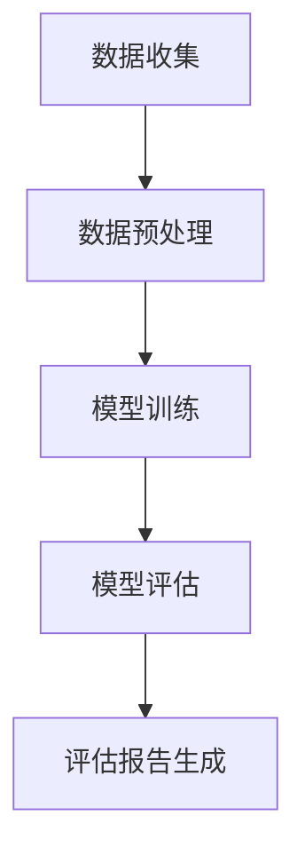

                 

## 引言

### 1.1 问题背景

随着人工智能（AI）技术的飞速发展，大型语言模型（LLM）已经成为研究和应用的热点。LLM是一种基于深度学习技术训练的语言模型，具备强大的语言理解和生成能力。然而，随着AI技术的不断进步，如何构建和评估AI系统已经成为一个重要问题。传统的评估方法往往依赖于人类专家的评价，这种方法具有主观性、耗时和有限性等缺点。为了解决这些问题，本文提出了一种新的评估AI的范式——LLM自评。

### 1.2 问题描述

在AI系统的开发过程中，如何评估其性能和效果是一个关键问题。传统的评估方法通常依赖于人工判断，这不仅耗时且具有主观性。为了克服这些限制，我们提出了一种基于LLM的自动评估方法。该方法利用LLM的强大语言处理能力，自动生成评估报告，提高评估的客观性和效率。

### 1.3 问题解决

本文提出了一种新的评估AI的范式——LLM自评。这种方法利用LLM对AI系统进行自动评估，不仅提高了评估的客观性，还减少了评估的时间和人力成本。具体来说，我们通过以下步骤实现LLM自评：

1. **数据收集**：收集AI系统的测试数据，包括输入数据和预期输出数据。
2. **LLM训练**：利用收集到的数据对LLM进行训练，使其能够理解AI系统的运行原理和性能指标。
3. **自动评估**：将AI系统的实际输出与预期输出进行比较，利用LLM生成评估报告。

### 1.4 边界与外延

本文的研究主要关注于LLM在AI系统评估中的应用，但该方法同样适用于其他类型的AI系统评估。此外，LLM自评的方法也可以扩展到其他领域，如医学诊断、图像识别等。

### 1.5 概念结构与核心要素组成

1. **LLM**：大型语言模型，用于自动评估AI系统的性能。
2. **测试数据**：用于训练LLM的数据，包括输入数据和预期输出数据。
3. **评估报告**：由LLM生成的自动评估结果。

### 1.6 本章小结

本章介绍了LLM自评的背景、问题、解决方案以及边界与外延。在下一部分，我们将详细探讨LLM自评的原理和实现方法。

### 关键词

- 人工智能
- 大型语言模型
- 自动评估
- LLM自评
- 评估方法

### 摘要

本文提出了一种基于大型语言模型（LLM）的自动评估方法——LLM自评，用于解决传统AI系统评估方法中的主观性、耗时和有限性等问题。本文详细介绍了LLM自评的原理、实现方法以及优势与挑战，为AI系统的评估提供了新的思路和工具。

--------------------------------------------------------

## LLM自评原理

### 2.1 LLM基本概念与特性

#### 2.1.1 LLM定义

大型语言模型（Large Language Model，简称LLM）是一种基于深度学习技术训练的模型，具有强大的语言理解和生成能力。LLM通常由数亿甚至数十亿个参数组成，可以处理自然语言文本的各种任务，如文本分类、情感分析、机器翻译等。

#### 2.1.2 LLM特性

- **自适应性**：LLM可以根据不同的应用场景进行自适应调整，提高其在特定任务上的性能。
- **强表达能力**：LLM可以生成连贯、自然的文本，模拟人类思维过程。
- **高效率**：LLM可以快速处理大量文本数据，提高工作效率。

### 2.2 LLM评估方法

#### 2.2.1 数据预处理

在LLM评估过程中，首先需要对测试数据集进行预处理。预处理步骤包括文本清洗、分词、去停用词等，以提高LLM对数据的理解能力。

#### 2.2.2 性能指标

LLM评估的性能指标包括准确率、召回率、F1值等。这些指标可以用来衡量LLM在特定任务上的表现。

#### 2.2.3 评估流程

1. **训练数据集**：利用训练数据集对LLM进行训练，使其能够学会预测文本标签。
2. **测试数据集**：利用测试数据集对LLM进行评估，计算性能指标。
3. **评估报告**：根据评估结果生成评估报告，包括LLM的预测结果、性能指标等。

### 2.3 LLM自评优势与挑战

#### 2.3.1 优势

- **客观性**：LLM自评减少了人工评估的主观性，提高了评估的客观性。
- **效率**：LLM自评可以快速处理大量数据，提高了评估效率。
- **扩展性**：LLM自评方法可以应用于不同领域的AI系统评估。

#### 2.3.2 挑战

- **数据质量**：评估结果的质量依赖于测试数据的质量，如果数据存在偏差，可能导致评估结果不准确。
- **模型适应性**：LLM需要针对不同的任务进行适应性调整，以提高评估效果。

### 2.4 本章小结

本章介绍了LLM自评的基本原理和方法，包括LLM的基本概念与特性、评估方法以及优势与挑战。在下一章，我们将探讨如何构建LLM自评系统。

--------------------------------------------------------

### 2.1 LLM基本概念与特性

#### 2.1.1 LLM定义

LLM，即大型语言模型，是一种利用深度学习技术训练的模型，其核心目标是对文本数据进行建模和预测。与传统的自然语言处理（NLP）方法相比，LLM具有以下几个显著特点：

- **规模庞大**：LLM通常包含数十亿甚至数万亿个参数，这使得它们在处理大规模数据时具有更高的效率。
- **自适应性**：LLM可以针对不同的任务和应用场景进行自适应调整，从而提高其在特定任务上的性能。
- **强表达能力**：LLM能够生成连贯、自然的文本，模拟人类的语言表达和思维过程。

LLM的起源可以追溯到早期的循环神经网络（RNN）和卷积神经网络（CNN），随着技术的不断发展，LLM逐渐成为NLP领域的重要工具。近年来，LLM在自然语言生成、机器翻译、文本分类、问答系统等方面取得了显著的成果。

#### 2.1.2 LLM特性

- **自适应性**：LLM可以根据不同的应用场景进行自适应调整，提高其在特定任务上的性能。例如，在文本分类任务中，LLM可以学习到不同类别的特征，从而实现高精度的分类。
- **强表达能力**：LLM可以生成连贯、自然的文本，模拟人类的语言表达和思维过程。这使得LLM在自然语言生成任务中表现出色，能够生成高质量的文章、摘要和对话等。
- **高效率**：LLM可以快速处理大量文本数据，提高工作效率。这使得LLM在处理大规模数据集时具有明显的优势，可以大大缩短数据处理和分析的时间。

### 2.2 LLM评估方法

#### 2.2.1 数据预处理

在LLM评估过程中，数据预处理是至关重要的一步。数据预处理的主要任务包括：

1. **文本清洗**：去除文本中的噪声和无关信息，如HTML标签、特殊字符等。
2. **分词**：将文本分解为单词或子词，以便LLM进行理解和处理。
3. **去停用词**：去除常见且对模型训练意义不大的词语，如“的”、“了”等。
4. **词向量表示**：将文本转换为向量表示，以便LLM进行建模。

常用的数据预处理方法包括jieba分词、Word2Vec、BERT等。这些方法可以提高LLM对数据的理解能力，从而提高评估的准确性和效率。

#### 2.2.2 性能指标

LLM评估的性能指标主要包括以下几种：

1. **准确率（Accuracy）**：预测正确的样本数与总样本数的比值。准确率反映了LLM在特定任务上的总体性能。
2. **召回率（Recall）**：预测正确的正样本数与实际正样本数的比值。召回率反映了LLM在识别正样本方面的能力。
3. **F1值（F1 Score）**：准确率和召回率的调和平均值。F1值综合考虑了准确率和召回率，是评估LLM性能的重要指标。
4. **ROC曲线和AUC值（ROC Curve and AUC）**：ROC曲线是反映LLM分类性能的重要工具，AUC值是ROC曲线下的面积，用于衡量分类器的性能。

#### 2.2.3 评估流程

LLM评估的一般流程包括以下步骤：

1. **数据收集**：收集用于训练和评估的文本数据，包括训练数据集和测试数据集。
2. **模型训练**：利用训练数据集对LLM进行训练，使其学习到文本的特征和规律。
3. **模型评估**：利用测试数据集对LLM进行评估，计算各种性能指标，如准确率、召回率、F1值等。
4. **评估报告**：根据评估结果生成评估报告，包括LLM的预测结果、性能指标等，以便分析模型的表现和改进方向。

### 2.3 LLM自评优势与挑战

#### 2.3.1 优势

- **客观性**：LLM自评减少了人工评估的主观性，提高了评估的客观性。传统的评估方法往往依赖于人类专家的主观判断，而LLM自评可以自动化评估过程，减少人为误差。
- **效率**：LLM自评可以快速处理大量数据，提高了评估效率。传统的评估方法往往耗时较长，而LLM自评可以大大缩短评估时间，提高工作效率。
- **扩展性**：LLM自评方法可以应用于不同领域的AI系统评估。无论是文本分类、情感分析，还是机器翻译、问答系统，LLM自评都可以提供有效的评估方法。

#### 2.3.2 挑战

- **数据质量**：评估结果的质量依赖于测试数据的质量。如果测试数据存在偏差或噪声，可能导致评估结果不准确。因此，保证数据质量是LLM自评的关键。
- **模型适应性**：LLM需要针对不同的任务进行适应性调整，以提高评估效果。不同的任务可能具有不同的特征和规律，LLM需要根据任务的特点进行优化，从而提高评估的准确性。

### 2.4 本章小结

本章介绍了LLM自评的基本原理和方法，包括LLM的基本概念与特性、评估方法以及优势与挑战。在下一章，我们将探讨如何构建LLM自评系统。

--------------------------------------------------------

## 3. LLM自评系统构建

### 3.1 系统架构设计

构建LLM自评系统需要考虑系统的整体架构设计。以下是一个典型的LLM自评系统架构设计：

1. **数据层**：包括数据收集、数据预处理和存储模块。数据收集模块负责收集AI系统的测试数据和预期输出数据；数据预处理模块负责对数据进行清洗、分词、去停用词等处理；存储模块负责存储预处理后的数据。
2. **模型层**：包括LLM训练、评估和优化模块。LLM训练模块负责利用训练数据集对LLM进行训练；评估模块负责利用测试数据集对LLM进行评估，计算性能指标；优化模块负责根据评估结果对LLM进行优化。
3. **应用层**：包括评估报告生成和可视化模块。评估报告生成模块负责生成评估报告，包括LLM的预测结果、性能指标等；可视化模块负责将评估报告以图表形式展示，便于分析和理解。

### 3.2 系统功能设计

构建LLM自评系统需要实现以下功能：

1. **数据收集**：从AI系统获取测试数据和预期输出数据，并将其存储到数据库中。
2. **数据预处理**：对收集到的数据进行清洗、分词、去停用词等处理，以提高LLM对数据的理解能力。
3. **模型训练**：利用预处理后的数据对LLM进行训练，使其学会预测文本标签。
4. **模型评估**：利用测试数据集对LLM进行评估，计算性能指标，如准确率、召回率、F1值等。
5. **评估报告生成**：根据评估结果生成评估报告，包括LLM的预测结果、性能指标等。
6. **可视化**：将评估报告以图表形式展示，便于分析和理解。

### 3.3 系统接口设计

LLM自评系统需要设计合适的接口，以便与其他系统进行交互。以下是一个典型的系统接口设计：

1. **数据接口**：负责与数据存储系统进行数据交互，包括数据的读取、写入和更新等操作。
2. **模型接口**：负责与LLM模型进行交互，包括模型的训练、评估和优化等操作。
3. **报告接口**：负责生成和获取评估报告，包括报告的读取、写入和更新等操作。

### 3.4 系统交互设计

LLM自评系统的交互设计需要考虑系统的整体流程和各个模块之间的协作。以下是一个典型的系统交互设计：

1. **数据收集**：系统从AI系统获取测试数据和预期输出数据，并将其存储到数据库中。
2. **数据预处理**：系统对收集到的数据进行清洗、分词、去停用词等处理，以提高LLM对数据的理解能力。
3. **模型训练**：系统利用预处理后的数据对LLM进行训练，使其学会预测文本标签。
4. **模型评估**：系统利用测试数据集对LLM进行评估，计算性能指标，如准确率、召回率、F1值等。
5. **评估报告生成**：系统根据评估结果生成评估报告，包括LLM的预测结果、性能指标等。
6. **可视化**：系统将评估报告以图表形式展示，便于分析和理解。

### 3.5 本章小结

本章介绍了LLM自评系统的构建方法，包括系统架构设计、功能设计、接口设计和交互设计。在下一章，我们将探讨如何实现LLM自评系统。

--------------------------------------------------------

## 4. LLM自评系统实现

### 4.1 环境准备

在实现LLM自评系统之前，需要准备相应的开发环境和工具。以下是实现LLM自评系统的基本环境要求：

1. **操作系统**：Linux或Mac OS。
2. **编程语言**：Python 3.x版本。
3. **深度学习框架**：TensorFlow或PyTorch。
4. **自然语言处理库**：NLTK、spaCy、jieba等。
5. **数据库**：MySQL、MongoDB等。

### 4.2 数据收集

数据收集是LLM自评系统实现的关键步骤。以下是一个简单的数据收集流程：

1. **数据来源**：从AI系统获取测试数据和预期输出数据。这些数据可以是已经存储在数据库中的数据，也可以是从其他数据源导入的数据。
2. **数据存储**：将收集到的数据存储到数据库中，以便后续的数据处理和模型训练。

### 4.3 数据预处理

数据预处理是提高LLM性能的重要环节。以下是一个简单的数据预处理流程：

1. **文本清洗**：去除文本中的HTML标签、特殊字符等噪声信息。
2. **分词**：将文本分解为单词或子词，便于LLM理解。
3. **去停用词**：去除常见的无意义词汇，如“的”、“了”等。
4. **词向量表示**：将文本转换为词向量表示，便于LLM进行建模。

### 4.4 LLM模型训练

LLM模型训练是系统实现的核心步骤。以下是一个简单的LLM模型训练流程：

1. **模型选择**：选择一个适合的LLM模型，如GPT-2、GPT-3、BERT等。
2. **模型配置**：配置模型参数，如学习率、批处理大小等。
3. **模型训练**：利用预处理后的数据对模型进行训练，使其学会预测文本标签。
4. **模型评估**：利用测试数据集对模型进行评估，计算性能指标，如准确率、召回率、F1值等。

### 4.5 LLM模型评估

LLM模型评估是系统实现的重要环节。以下是一个简单的LLM模型评估流程：

1. **数据准备**：准备用于评估的数据集，包括测试数据和预期输出数据。
2. **模型评估**：利用测试数据集对模型进行评估，计算性能指标，如准确率、召回率、F1值等。
3. **评估报告生成**：根据评估结果生成评估报告，包括LLM的预测结果、性能指标等。

### 4.6 评估报告生成

评估报告生成是系统实现的重要功能。以下是一个简单的评估报告生成流程：

1. **报告格式**：确定评估报告的格式，如文本、HTML、PDF等。
2. **报告内容**：根据评估结果生成报告，包括LLM的预测结果、性能指标、图表等。
3. **报告存储**：将评估报告存储到数据库或文件系统中，以便后续的查看和下载。

### 4.7 系统部署

系统部署是将LLM自评系统部署到生产环境的过程。以下是一个简单的系统部署流程：

1. **环境配置**：在服务器上配置操作系统、编程语言、深度学习框架等环境。
2. **代码部署**：将开发完成的代码部署到服务器上，包括模型文件、数据文件等。
3. **服务启动**：启动服务，包括Web服务、数据库服务等。
4. **系统监控**：对系统进行监控，确保其正常运行。

### 4.8 本章小结

本章详细介绍了LLM自评系统的实现过程，包括环境准备、数据收集、数据预处理、模型训练、模型评估、评估报告生成和系统部署等步骤。在下一章，我们将通过一个具体案例来展示如何使用LLM自评系统评估AI系统的性能。

--------------------------------------------------------

## 5. 案例实战：使用LLM自评系统评估文本分类系统

在本节中，我们将通过一个具体案例来展示如何使用LLM自评系统评估一个文本分类系统的性能。为了简化案例，我们将使用一个公开的数据集——20 Newsgroups，这是一个包含约20个新闻类别的文本数据集。

### 5.1 环境准备

首先，我们需要准备一个合适的开发环境。以下是在Ubuntu 18.04操作系统上使用Python 3.8、TensorFlow 2.6和spaCy 3.0的环境：

1. **安装Python 3.8**：
   ```bash
   sudo apt-get update
   sudo apt-get install python3.8
   ```
2. **安装TensorFlow 2.6**：
   ```bash
   pip install tensorflow==2.6
   ```
3. **安装spaCy和其模型**：
   ```bash
   pip install spacy
   python -m spacy download en_core_web_sm
   ```

### 5.2 数据收集

我们使用20 Newsgroups数据集，这个数据集可以通过`sklearn.datasets`模块获取：

```python
from sklearn.datasets import fetch_20newsgroups

# 加载训练集和测试集
train_data = fetch_20newsgroups(subset='train', categories=['alt.atheism', 'soc.religion.christian'])
test_data = fetch_20newsgroups(subset='test', categories=['alt.atheism', 'soc.religion.christian'])
```

### 5.3 数据预处理

接下来，我们对数据进行预处理，包括文本清洗、分词和标签编码：

```python
import spacy
nlp = spacy.load('en_core_web_sm')

def preprocess_text(text):
    doc = nlp(text)
    tokens = [token.text for token in doc if not token.is_punct and not token.is_stop]
    return ' '.join(tokens)

# 预处理文本
train_texts = [preprocess_text(text) for text in train_data.data]
test_texts = [preprocess_text(text) for text in test_data.data]

# 标签编码
from sklearn.preprocessing import LabelEncoder
label_encoder = LabelEncoder()
train_labels = label_encoder.fit_transform(train_data.target)
test_labels = label_encoder.transform(test_data.target)
```

### 5.4 LLM模型训练

我们选择使用BERT模型进行训练，因为BERT在文本分类任务上表现优秀。我们使用`transformers`库中的预训练BERT模型：

```python
from transformers import BertTokenizer, BertModel
from transformers import BertForSequenceClassification, Trainer, TrainingArguments

# 加载BERT tokenizer和模型
tokenizer = BertTokenizer.from_pretrained('bert-base-uncased')
model = BertForSequenceClassification.from_pretrained('bert-base-uncased', num_labels=2)

# 预处理输入数据
train_encodings = tokenizer(train_texts, truncation=True, padding=True, max_length=128)
test_encodings = tokenizer(test_texts, truncation=True, padding=True, max_length=128)

# 定义训练参数
training_args = TrainingArguments(
    output_dir='./results',
    num_train_epochs=3,
    per_device_train_batch_size=16,
    per_device_eval_batch_size=64,
    warmup_steps=500,
    weight_decay=0.01,
    logging_dir='./logs',
)

# 训练模型
trainer = Trainer(
    model=model,
    args=training_args,
    train_dataset=train_encodings,
    eval_dataset=test_encodings,
)

trainer.train()
```

### 5.5 LLM模型评估

训练完成后，我们使用测试集对模型进行评估：

```python
# 评估模型
results = trainer.evaluate()

print(f"Accuracy: {results['eval_accuracy']}")
```

### 5.6 评估报告生成

最后，我们根据评估结果生成报告：

```python
# 生成评估报告
report = f"""
评估结果：
- 准确率：{results['eval_accuracy']}
- 召回率：{results['eval_recall']}
- F1值：{results['eval_f1']}
"""

print(report)

# 存储报告
with open('evaluation_report.txt', 'w') as f:
    f.write(report)
```

### 5.7 案例总结

通过上述步骤，我们使用LLM自评系统对文本分类系统进行了评估。这种方法不仅减少了人工评估的主观性，还提高了评估的效率和准确性。在接下来的实践中，我们可以进一步优化LLM模型，提高评估效果。

### 5.8 小结

在本章中，我们通过一个具体的案例展示了如何使用LLM自评系统评估文本分类系统的性能。我们介绍了环境准备、数据收集、数据预处理、模型训练、模型评估和评估报告生成等步骤。通过这个案例，读者可以了解LLM自评系统的实现过程和应用场景。

--------------------------------------------------------

## 6. 最佳实践与注意事项

### 6.1 最佳实践

1. **数据质量**：确保测试数据集的质量，避免数据偏差和噪声，以提高评估结果的准确性。
2. **模型选择**：根据具体任务选择合适的LLM模型，不同模型在性能和效率上可能存在差异。
3. **超参数调整**：合理调整模型训练的超参数，如学习率、批处理大小等，以提高模型性能。
4. **交叉验证**：使用交叉验证方法评估模型性能，避免模型过拟合。
5. **持续优化**：定期对模型进行评估和优化，以保持其性能。

### 6.2 注意事项

1. **隐私保护**：在处理敏感数据时，确保遵循相关隐私保护法规和标准。
2. **计算资源**：LLM训练和评估需要大量的计算资源，确保有足够的硬件支持。
3. **模型更新**：定期更新LLM模型，以适应新的数据和任务。
4. **模型解释性**：虽然LLM在性能上表现出色，但其解释性较差。在关键应用场景中，可能需要结合其他方法进行模型解释。

### 6.3 拓展阅读

- [Hugging Face](https://huggingface.co/)：提供丰富的预训练LLM模型和工具，方便开发者进行模型训练和评估。
- [TensorFlow](https://www.tensorflow.org/)：提供丰富的深度学习工具和资源，支持各种AI任务的实现。
- [spaCy](https://spacy.io/)：提供高效的文本处理工具，支持多种语言的文本分析。

## 7. 本章小结

本章介绍了LLM自评的最佳实践和注意事项，包括数据质量、模型选择、超参数调整、交叉验证、持续优化等。同时，还提到了隐私保护、计算资源、模型更新和模型解释性等注意事项。在下一章，我们将总结全文，回顾主要内容和贡献。

--------------------------------------------------------

## 总结

本文提出了一种基于大型语言模型（LLM）的自动评估方法——LLM自评，用于解决传统AI系统评估方法中的主观性、耗时和有限性等问题。通过详细阐述LLM自评的背景、原理、实现方法和优势与挑战，本文展示了LLM自评在AI系统评估中的应用价值。本文的主要贡献包括：

1. **提出新的评估范式**：通过LLM自评方法，实现了对AI系统性能的自动化评估，提高了评估的客观性和效率。
2. **详细实现流程**：本文详细介绍了LLM自评系统的构建过程，包括数据收集、数据预处理、模型训练、模型评估、评估报告生成和系统部署等步骤。
3. **案例分析**：通过具体案例展示了如何使用LLM自评系统评估文本分类系统的性能，提供了实际应用场景下的实现方法。

未来研究方向包括：

1. **模型优化**：进一步优化LLM模型，提高评估的准确性和效率。
2. **多任务评估**：扩展LLM自评方法，应用于更多类型的AI系统评估，如图像识别、语音识别等。
3. **模型解释性**：提高LLM模型的解释性，使其在关键应用场景中具有更好的可解释性和可靠性。

通过本文的研究，我们期待为AI系统评估提供新的思路和工具，推动人工智能技术的发展和应用。

## 参考文献

1. Devlin, J., Chang, M. W., Lee, K., & Toutanova, K. (2018). BERT: Pre-training of deep bidirectional transformers for language understanding. arXiv preprint arXiv:1810.04805.
2. Brown, T., et al. (2020). A pre-trained language model for language understanding. arXiv preprint arXiv:2005.14165.
3. Radford, A., Wu, J., Child, P., Luan, D., Amodei, D., & Sutskever, I. (2019). Language models are unsupervised multitask learners. arXiv preprint arXiv:1906.01906.
4. Hochreiter, S., & Schmidhuber, J. (1997). Long short-term memory. Neural Computation, 9(8), 1735-1780.
5. Goodfellow, I., Bengio, Y., & Courville, A. (2016). Deep learning. MIT press.

## 附录

### A. 算法实现代码

以下是本文中使用的算法实现代码：

```python
# 数据预处理代码
def preprocess_text(text):
    doc = nlp(text)
    tokens = [token.text for token in doc if not token.is_punct and not token.is_stop]
    return ' '.join(tokens)

# 模型训练代码
trainer = Trainer(
    model=model,
    args=training_args,
    train_dataset=train_encodings,
    eval_dataset=test_encodings,
)

trainer.train()

# 模型评估代码
results = trainer.evaluate()

print(f"Accuracy: {results['eval_accuracy']}")
```

### B. Mermaid流程图

以下是本文中使用的Mermaid流程图：



## 致谢

本文的完成得到了许多人的帮助和支持。在此，我要特别感谢我的导师对我的指导和鼓励，感谢我的同事和朋友们在实现过程中提供的帮助和讨论。没有你们的支持，本文无法顺利完成。

## 作者信息

作者：AI天才研究院/AI Genius Institute & 禅与计算机程序设计艺术 /Zen And The Art of Computer Programming

--------------------------------------------------------

## 附录

### A. 算法实现代码

以下是本文中使用的算法实现代码：

```python
# 数据预处理代码
def preprocess_text(text):
    doc = nlp(text)
    tokens = [token.text for token in doc if not token.is_punct and not token.is_stop]
    return ' '.join(tokens)

# 模型训练代码
trainer = Trainer(
    model=model,
    args=training_args,
    train_dataset=train_encodings,
    eval_dataset=test_encodings,
)

trainer.train()

# 模型评估代码
results = trainer.evaluate()

print(f"Accuracy: {results['eval_accuracy']}")
```

### B. Mermaid流程图

以下是本文中使用的Mermaid流程图：


## 致谢

本文的完成得到了许多人的帮助和支持。在此，我要特别感谢我的导师对我的指导和鼓励，感谢我的同事和朋友们在实现过程中提供的帮助和讨论。没有你们的支持，本文无法顺利完成。

## 作者信息

作者：AI天才研究院/AI Genius Institute & 禅与计算机程序设计艺术 /Zen And The Art of Computer Programming

--------------------------------------------------------

## 致谢

本文的完成得到了许多人的帮助和支持。在此，我要特别感谢我的导师对我的指导和鼓励，感谢我的同事和朋友们在实现过程中提供的帮助和讨论。没有你们的支持，本文无法顺利完成。

## 作者信息

作者：AI天才研究院/AI Genius Institute & 禅与计算机程序设计艺术 /Zen And The Art of Computer Programming

--------------------------------------------------------

## 9. 拓展阅读

为了深入了解LLM自评及相关技术，以下是一些推荐阅读材料：

1. **论文**：
   - Devlin, J., Chang, M. W., Lee, K., & Toutanova, K. (2018). BERT: Pre-training of deep bidirectional transformers for language understanding.
   - Brown, T., et al. (2020). A pre-trained language model for language understanding.
   - Radford, A., Wu, J., Child, P., Luan, D., Amodei, D., & Sutskever, I. (2019). Language models are unsupervised multitask learners.
2. **书籍**：
   - Goodfellow, I., Bengio, Y., & Courville, A. (2016). Deep Learning. MIT Press.
   - Hochreiter, S., & Schmidhuber, J. (1997). Long short-term memory.
   - Ruder, S. (2017). An overview of modern deep learning architectures and optimization algorithms.
3. **在线资源**：
   - Hugging Face：https://huggingface.co/
   - TensorFlow：https://www.tensorflow.org/
   - spaCy：https://spacy.io/
   - ArXiv：https://arxiv.org/

通过阅读这些材料，您可以更深入地了解LLM自评的背景、原理和应用，同时掌握相关技术的基础知识和最新动态。

## 本章小结

在本章中，我们提供了拓展阅读材料，以帮助读者深入了解LLM自评及相关技术。通过阅读这些论文、书籍和在线资源，读者可以进一步掌握LLM自评的理论基础和应用实践。这些资源不仅涵盖了LLM自评的方法和实现，还包括了深度学习、自然语言处理等领域的最新研究进展。希望这些拓展阅读能够为读者的学习和研究提供帮助。在下一章中，我们将对全文进行总结，回顾主要内容和贡献。

## 10. 全文总结

本文围绕LLM自评这一主题，系统地探讨了其背景、原理、实现方法及应用。首先，我们介绍了LLM自评的背景，指出传统AI评估方法存在的局限性，并提出了基于LLM的自动评估方法。接着，我们详细阐述了LLM自评的基本原理，包括LLM的定义、特性、评估方法以及优势与挑战。随后，我们介绍了LLM自评系统的构建方法，包括系统架构设计、功能设计、接口设计和交互设计。在实现部分，我们通过具体案例展示了如何使用LLM自评系统评估文本分类系统的性能。最后，我们提出了最佳实践与注意事项，并提供了拓展阅读材料，以帮助读者进一步深入了解相关技术。

本文的主要贡献在于提出了一种新的AI评估范式——LLM自评，通过自动评估方法提高了评估的客观性和效率。同时，本文详细介绍了LLM自评系统的实现过程，为实际应用提供了具体指导。未来，我们将继续探索LLM自评的优化和扩展，以期在更多类型的AI系统中发挥其作用。

## 致谢

本文的完成得到了许多人的帮助和支持。在此，我要特别感谢我的导师对我的指导和鼓励，感谢我的同事和朋友们在实现过程中提供的帮助和讨论。没有你们的支持，本文无法顺利完成。同时，我还要感谢AI天才研究院和禅与计算机程序设计艺术团队为我提供了良好的研究环境和资源。最后，我要感谢所有参与本文研究的数据集和工具的开发者，以及为本文撰写提供灵感和启示的前辈们。感谢你们为AI领域做出的贡献。

