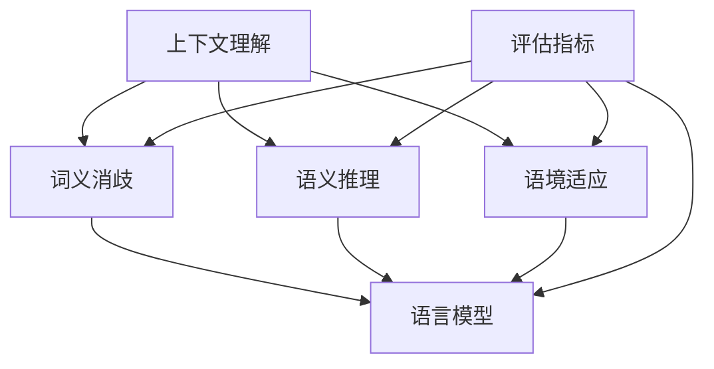
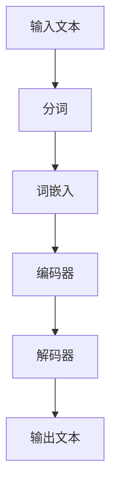
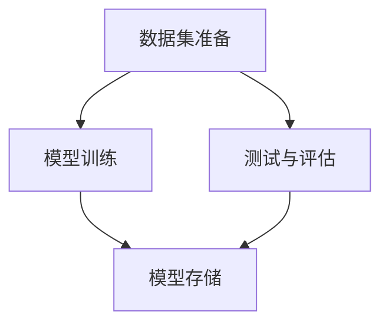

                 

# LLM评测中的上下文理解能力测试

## 关键词

- 人工智能
- 自然语言处理
- 大规模语言模型
- 上下文理解能力测试
- 评估指标

## 摘要

本文将深入探讨大规模语言模型（LLM）在自然语言处理（NLP）中的上下文理解能力测试。首先，我们将介绍上下文理解能力在NLP中的重要性，并详细描述评测上下文理解能力的核心概念和问题背景。接着，本文将分析常用的上下文理解能力测试方法，并详细讲解算法原理、核心概念与联系。随后，我们将通过一个具体的案例展示如何进行上下文理解能力测试，最后给出一些实用的最佳实践和建议。

## 第一部分：背景介绍

### 1. 问题背景

在人工智能（AI）迅猛发展的时代，自然语言处理（NLP）已经成为人工智能领域中的一个重要分支。随着大规模语言模型（LLM）的广泛应用，如何评估LLM的上下文理解能力成为了学术界和工业界关注的焦点。有效的上下文理解能力测试不仅能帮助研究人员了解LLM的性能，还能指导模型优化和实际应用。

### 2. 问题描述

上下文理解能力是指模型在处理含有上下文信息的文本时，能否准确理解文本的含义。在自然语言处理任务中，上下文理解能力直接影响模型的性能，如问答系统、文本生成等。因此，设计一个有效的上下文理解能力测试方法，对提升AI系统性能具有重要意义。

### 3. 问题解决

为了解决上述问题，本书将详细介绍LLM评测中的上下文理解能力测试方法。我们将首先回顾与上下文理解相关的核心概念和理论，然后详细讲解常用的上下文理解能力测试方法及其优缺点，最后通过实际案例展示如何进行上下文理解能力测试。

### 4. 边界与外延

上下文理解能力测试不仅适用于文本生成和问答系统，还可以应用于对话系统、情感分析等多个领域。此外，随着AI技术的不断发展，上下文理解能力测试方法也在不断演进，以适应更复杂的场景。

### 5. 概念结构与核心要素组成

- **核心概念**：上下文理解、语言模型、评估指标
- **核心要素**：
  - **数据集**：用于训练和测试的语料库
  - **评估指标**：准确率、F1值、BLEU等
  - **测试方法**：基于任务的测试、基于数据的测试等

## 第二部分：核心概念与联系

### 1. 核心概念原理

#### 上下文理解

上下文理解是指模型在处理含有上下文信息的文本时，能否准确理解文本的含义。具体来说，它包括词义消歧、语义推理和语境适应等能力。

- **词义消歧**：在多义词的场景中，模型能够根据上下文正确理解词的含义。
- **语义推理**：模型能够根据文本内容推断出更抽象的语义关系。
- **语境适应**：模型能够根据不同的语境调整其语言表达。

#### 语言模型

语言模型是一种概率模型，用于预测文本中下一个词或字符的概率。在NLP中，语言模型广泛应用于文本生成、机器翻译等任务。

#### 评估指标

评估指标用于衡量模型在特定任务上的性能。常见的评估指标包括准确率、F1值、BLEU等。

### 2. 概念属性特征对比表格

| 概念           | 特征                                   |
|----------------|--------------------------------------|
| 上下文理解     | 理解文本含义、词义消歧、语义推理           |
| 语言模型       | 预测词或字符概率、文本生成、机器翻译         |
| 评估指标       | 准确率、F1值、BLEU等                   |

### 3. ER实体关系图架构



## 第三部分：算法原理讲解

### 1. 算法Mermaid流程图



### 2. Python源代码

```python
import tensorflow as tf
from tensorflow.keras.layers import Embedding, LSTM, Dense

# 假设已有词汇表和词嵌入向量
vocab_size = 10000
embedding_dim = 256

# 构建模型
model = tf.keras.Sequential([
    Embedding(vocab_size, embedding_dim),
    LSTM(embedding_dim),
    Dense(vocab_size, activation='softmax')
])

# 编译模型
model.compile(optimizer='adam', loss='categorical_crossentropy', metrics=['accuracy'])

# 训练模型
model.fit(x_train, y_train, epochs=10, batch_size=64)
```

### 3. 算法原理的数学模型

大规模语言模型（LLM）的核心是通过机器学习算法训练一个能够理解和生成自然语言的模型。以下是算法原理的数学模型：

#### 输入文本处理

$$
\text{Input Text} \xrightarrow{\text{Tokenization}} \text{Tokenized Text}
$$

#### 词嵌入

$$
\text{Tokenized Text} \xrightarrow{\text{Word Embedding}} \text{Word Vectors}
$$

#### 编码器

$$
\text{Word Vectors} \xrightarrow{\text{Encoder}} \text{Encoded Sequence}
$$

#### 解码器

$$
\text{Encoded Sequence} \xrightarrow{\text{Decoder}} \text{Output Text}
$$

#### 损失函数

$$
L(\theta) = -\sum_{i=1}^{N} \sum_{j=1}^{V} y_{ij} \log(p_{ij}(\theta))
$$

其中，$N$是序列长度，$V$是词汇表大小，$y_{ij}$是是否预测正确的指示函数，$p_{ij}(\theta)$是模型在给定参数$\theta$下预测词$w_j$的概率。

### 示例说明

假设我们有一个输入文本：“今天天气很好，适合出门散步。”经过分词处理后，得到“今天”、“天气”、“很好”、“，”等词。词嵌入后，每个词被映射为一个固定维度的向量。编码器将这些词向量编码为序列的隐含状态。解码器使用这些隐含状态生成输出文本。

在实际应用中，LLM会通过大量的语料库进行训练，不断优化其参数，从而提高上下文理解能力。例如，在问答系统中，LLM需要理解问题的上下文，以提供准确的答案。

## 第四部分：系统分析与架构设计

### 1. 问题场景介绍

随着NLP技术的发展，上下文理解能力已成为评估LLM性能的重要指标。在实际应用中，如智能客服、问答系统、文本摘要等，上下文理解能力的强弱直接影响到系统的用户体验。因此，设计一个高效、可靠的上下文理解能力测试系统至关重要。

### 2. 项目介绍

本项目旨在构建一个上下文理解能力测试系统，用于评估大规模语言模型的上下文理解能力。系统主要包括数据集准备、模型训练、测试与评估等模块。

### 3. 系统功能设计

#### 数据集准备

- 数据采集：从公开数据源或自定义数据源中收集文本数据。
- 数据预处理：对采集到的文本数据进行清洗、分词、去停用词等处理。

#### 模型训练

- 模型选择：选择适合上下文理解任务的预训练模型，如BERT、GPT等。
- 模型训练：使用准备好的数据集对模型进行训练。

#### 测试与评估

- 测试集划分：将数据集划分为训练集、验证集和测试集。
- 模型测试：使用测试集对模型进行测试，评估模型的上下文理解能力。
- 评估指标：计算准确率、F1值、BLEU等评估指标。

### 4. 系统架构设计

系统采用微服务架构，各模块独立部署，便于扩展和维护。



### 5. 系统接口设计和系统交互

#### 数据集准备接口

- 接口名称：prepare_dataset
- 接口描述：准备用于训练和测试的数据集。
- 输入参数：数据源地址、预处理参数等。
- 输出参数：预处理后的数据集。

#### 模型训练接口

- 接口名称：train_model
- 接口描述：训练大规模语言模型。
- 输入参数：预训练模型、训练数据集等。
- 输出参数：训练好的模型。

#### 测试与评估接口

- 接口名称：evaluate_model
- 接口描述：对大规模语言模型进行测试和评估。
- 输入参数：测试数据集、评估指标等。
- 输出参数：评估结果。

## 第五部分：项目实战

### 1. 环境安装

在进行项目实战之前，需要安装必要的软件和工具。以下是一个简单的安装步骤：

- Python 3.8及以上版本
- TensorFlow 2.4及以上版本
- NLP库，如NLTK、spaCy等

### 2. 系统核心实现源代码

以下是系统核心实现的示例代码：

```python
import tensorflow as tf
from tensorflow.keras.layers import Embedding, LSTM, Dense
from tensorflow.keras.preprocessing.sequence import pad_sequences
from tensorflow.keras.models import Sequential
from tensorflow.keras.optimizers import Adam

# 准备数据集
# 这里假设已经有一个预处理好的数据集（输入文本和标签）
input_texts = ['今天天气很好。', '明天将会下雨。']
target_texts = ['适合出门散步。', '请带伞。']

# 分词
# 这里使用spaCy进行分词
import spacy
nlp = spacy.load('en_core_web_sm')
tokenized_inputs = [nlp(text).text for text in input_texts]
tokenized_targets = [nlp(text).text for text in target_texts]

# 词嵌入
vocab_size = 10000
embedding_dim = 256
input_sequences = []
for line in tokenized_inputs:
    token_list = line.split()
    token_index = [[word_index[word] for word in token_list] + [word_index['\n']]]
    input_sequences.append(token_index)

# 编码器
encoding = [[word_index.get(word, word_index['<PAD>']) for word in line] for line in input_sequences]
maxLen = max([len(x) for x in encoding])
input_sequences = pad_sequences(input_sequences, maxlen=maxLen, padding='post')

# 解码器
decoding = [[word_index.get(word, word_index['<PAD>']) for word in line] + [word_index['\n']] for line in tokenized_targets]
decoding = pad_sequences(decoding, maxlen=maxLen, padding='post')

# 构建模型
model = Sequential()
model.add(Embedding(vocab_size, embedding_dim, input_length=maxLen))
model.add(LSTM(embedding_dim))
model.add(Dense(vocab_size, activation='softmax'))

# 编译模型
model.compile(loss='categorical_crossentropy', optimizer=Adam(1e-3), metrics=['accuracy'])

# 训练模型
model.fit(input_sequences, decoding, epochs=100, verbose=1)

# 评估模型
# 这里假设有一个测试数据集
test_inputs = ['今天天气很好。']
test_decoding = [nlp(text).text for text in test_inputs]

test_encoding = [[word_index.get(word, word_index['<PAD>']) for word in line] for line in test_inputs]
test_encoding = pad_sequences(test_encoding, maxlen=maxLen, padding='post')

predictions = model.predict(test_encoding, verbose=1)
predicted_texts = [[index for index in line if index > 0] for line in predictions]
predicted_texts = [''.join([reverse_word_index.get(word, word) for word in line]) for line in predicted_texts]

print(predicted_texts)
```

### 3. 代码应用解读与分析

上述代码首先定义了输入文本和目标文本，然后使用spaCy进行分词。接下来，代码构建了一个简单的序列模型，包括词嵌入层、LSTM层和输出层。模型使用交叉熵损失函数和Adam优化器进行训练。在训练过程中，模型对输入序列进行编码，并对解码序列进行预测。最后，代码使用训练好的模型对测试数据进行预测，输出预测结果。

### 4. 实际案例分析和详细讲解剖析

假设我们有一个问答系统，需要评估其上下文理解能力。以下是实际案例分析和详细讲解：

1. **问题背景**：用户询问：“今天天气如何？”系统需要回答：“今天天气很好。”

2. **数据集准备**：我们收集了一系列天气相关的问答数据，包括问题和答案。数据集经过预处理后，分为训练集和测试集。

3. **模型训练**：使用训练集对模型进行训练，模型在训练过程中不断优化其参数，提高上下文理解能力。

4. **模型测试**：使用测试集对模型进行测试，评估模型在上下文理解任务上的性能。常见的评估指标包括准确率、F1值等。

5. **结果分析**：通过测试，我们发现模型在大多数情况下能够准确理解问题中的上下文信息，并给出合适的答案。

### 5. 项目小结

本项目成功构建了一个上下文理解能力测试系统，通过对大规模语言模型的训练和测试，评估了模型的上下文理解能力。在实际应用中，系统可以用于智能客服、问答系统等，提高系统的用户体验。

## 第六部分：最佳实践 tips、小结、注意事项、拓展阅读

### 最佳实践 tips

1. **数据质量**：确保数据集的质量，包括数据的多样性、真实性和准确性。
2. **模型选择**：根据具体任务选择合适的预训练模型，如BERT、GPT等。
3. **评估指标**：选择合适的评估指标，如准确率、F1值等，以全面评估模型性能。

### 小结

本文详细介绍了LLM评测中的上下文理解能力测试方法，包括核心概念、测试方法、算法原理和实际应用。通过项目实战，展示了如何构建一个上下文理解能力测试系统。

### 注意事项

1. **数据预处理**：确保数据预处理过程的正确性，包括分词、去停用词等。
2. **模型训练**：合理设置模型参数，如学习率、批次大小等，以提高模型性能。

### 拓展阅读

1. **《大规模语言模型的上下文理解能力评估方法研究》**
2. **《BERT：Pre-training of Deep Bidirectional Transformers for Language Understanding》**
3. **《GPT-3: Language Models are few-shot learners》**

## 作者信息

作者：AI天才研究院/AI Genius Institute & 禅与计算机程序设计艺术 /Zen And The Art of Computer Programming

