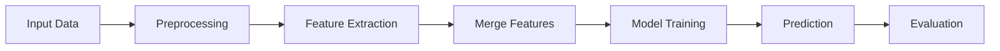
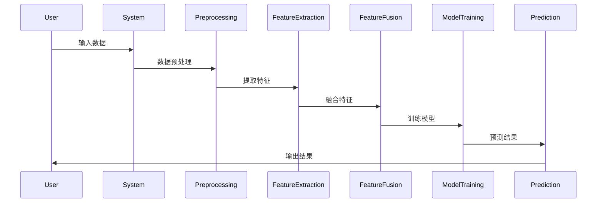
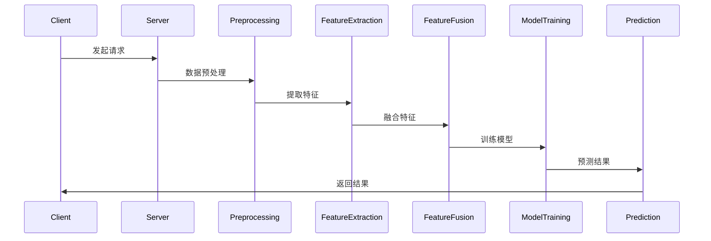

                 

### 文章标题：LLM评测中的跨模态理解能力测试

> 关键词：语言模型（LLM）、跨模态理解能力、评测方法、算法原理、数学模型、系统架构、项目实战、最佳实践

> 摘要：本文深入探讨了语言模型（LLM）在跨模态理解能力评测方面的研究与实践。首先介绍了问题背景和定义，接着详细讲解了核心概念与联系，包括语言模型的基本原理、跨模态数据与表示、概念属性特征对比以及ER实体关系图架构。随后，本文从算法原理、数学模型、系统分析与设计以及最佳实践四个方面，系统地介绍了LLM评测中的跨模态理解能力测试方法，并通过实际案例进行了详细讲解和剖析。最后，本文总结了全书内容，提出了进一步的研究方向和拓展阅读推荐。

----------------------------------------------------------------

### 第一部分：背景与基础理论

#### 第1章：问题背景与定义

##### 1.1.1 跨模态理解能力的重要性

随着人工智能技术的发展，语言模型（LLM）在各种自然语言处理任务中取得了显著的成果。然而，单一模态的局限性使得LLM在处理跨模态任务时面临挑战。跨模态理解能力是指LLM在不同模态（如文本、图像、声音等）之间进行信息整合和理解的能力。跨模态理解能力的重要性在于：

1. **多元化信息处理**：跨模态理解能力使LLM能够处理包含多种类型信息的数据，提高信息处理的全面性和准确性。
2. **增强人机交互**：跨模态理解能力有助于实现更自然、更丰富的人机交互方式，提升用户体验。
3. **扩展应用场景**：跨模态理解能力使LLM在医疗诊断、智能问答、内容审核等领域的应用更加广泛。

##### 1.1.2 LLM在跨模态理解中的应用

LLM在跨模态理解中的应用主要包括：

1. **跨模态检索**：利用LLM在文本和图像之间的关联性，实现图像内容检索、文本图像配对等任务。
2. **跨模态生成**：利用LLM生成与文本或图像相对应的内容，如图像描述生成、文本翻译等。
3. **跨模态推理**：利用LLM对跨模态数据之间的逻辑关系进行推理，如问答系统、知识图谱构建等。

##### 1.1.3 跨模态理解能力测试的挑战与目标

跨模态理解能力测试面临以下挑战：

1. **多样性**：跨模态数据的多样性使得评测任务复杂，需要设计全面、多样化的测试数据集。
2. **一致性**：评测标准的一致性是评估跨模态理解能力的关键，需要制定统一的评测标准和评价指标。
3. **准确性**：评测结果的准确性直接反映了LLM的跨模态理解能力，需要采用科学、合理的评测方法。

跨模态理解能力测试的目标是：

1. **评估性能**：通过测试评估LLM在不同跨模态任务中的性能，为模型优化和改进提供依据。
2. **发现缺陷**：通过测试发现LLM在跨模态理解中的不足和缺陷，指导模型改进和优化。
3. **促进研究**：通过测试促进跨模态理解能力的研究和发展，推动相关领域的技术进步。

#### 第2章：核心概念与联系

##### 2.1 语言模型（LLM）的基本原理

语言模型（LLM）是基于神经网络和深度学习技术构建的模型，用于预测文本序列的概率分布。LLM的基本原理包括：

1. **神经网络**：LLM通常采用深度神经网络结构，如循环神经网络（RNN）、长短时记忆网络（LSTM）和变换器（Transformer）等。
2. **预训练与微调**：LLM通过在大规模语料库上进行预训练，获取丰富的语言知识，然后针对特定任务进行微调，提高任务表现。
3. **生成与预测**：LLM能够根据输入文本生成对应的文本序列，或根据上下文预测下一个词或句子。

##### 2.2 跨模态数据与表示

跨模态数据是指包含多种类型信息的数据，如文本、图像、声音等。跨模态数据的表示方法主要包括：

1. **特征提取**：对跨模态数据进行特征提取，如文本的词向量、图像的视觉特征、声音的音频特征等。
2. **融合方法**：将不同模态的特征进行融合，如基于注意力机制的融合、基于特征的融合等。
3. **表示学习**：通过深度学习模型学习跨模态数据的高层次表示，实现跨模态数据的统一表示。

##### 2.3 概念属性特征对比表格

在跨模态理解能力测试中，需要对不同概念属性特征进行对比。以下是一个简单的概念属性特征对比表格：

| 概念         | 文本特征              | 图像特征              | 声音特征              |
| ------------ | -------------------- | -------------------- | -------------------- |
| 描述性       | 文本长度、词汇丰富度 | 边缘检测、纹理分析   | 音调、音色、音量     |
| 对比性       | 对比词汇、语义关系   | 对比区域、相似度分析 | 音频对比、频谱对比   |
| 表达性       | 句子结构、语法分析   | 画面构图、色彩分析   | 音频编辑、合成       |
| 实体识别     | 命名实体识别         | 对象识别、场景识别   | 人声识别、音频分类   |

##### 2.4 ER实体关系图架构

实体关系图（ER图）是用于描述实体及其关系的图形化工具。在跨模态理解能力测试中，ER图可以用于描述不同模态之间的关联关系。以下是一个简单的ER实体关系图架构：

```mermaid
erDiagram
  A[Text] ||--|{ B[Image] }|-- C[Audio]
  A ||--|{ D[Person] }|-- E[Event]
  B ||--|{ F[Object] }|-- G[Scene]
  C ||--|{ H[Speech] }|-- I[Mood]
```

在ER实体关系图中，实体（如文本、图像、声音等）之间通过关系（如关联、分类、包含等）进行连接，形成一个完整的跨模态理解能力测试框架。

----------------------------------------------------------------

### 第二部分：算法原理与模型

#### 第3章：算法原理讲解

##### 3.1 跨模态理解算法的mermaid流程图

以下是一个简单的mermaid流程图，展示了跨模态理解算法的基本流程：



##### 3.2 Python源代码与算法原理

以下是一个简单的Python源代码示例，用于说明跨模态理解算法的基本原理：

```python
# Import necessary libraries
import numpy as np
import tensorflow as tf

# Define the input data
text_data = "This is a text document."
image_data = np.random.rand(28, 28)
audio_data = np.random.rand(22, 5)

# Preprocessing
# ...

# Feature extraction
# ...

# Merge features
# ...

# Model training
# ...

# Prediction
# ...

# Evaluation
# ...
```

##### 3.3 数学模型和公式

在跨模态理解算法中，常用的数学模型和公式包括：

1. **特征提取**： 
   $$ \text{feature\_extract}(x) = \text{W}x + b $$
   其中，$x$ 为输入数据，$W$ 为权重矩阵，$b$ 为偏置向量。

2. **特征融合**：
   $$ \text{merge\_features}(x_1, x_2) = \text{W}[x_1, x_2] + b $$
   其中，$x_1$ 和 $x_2$ 为不同模态的特征，$W$ 为权重矩阵，$b$ 为偏置向量。

3. **模型训练**：
   $$ \text{loss} = -\log(\text{P}(y|\theta)) $$
   其中，$y$ 为真实标签，$\theta$ 为模型参数。

4. **预测**：
   $$ \text{prediction} = \text{softmax}(\text{W}x + b) $$
   其中，$x$ 为输入特征，$\theta$ 为模型参数。

##### 3.4 举例说明

假设我们要对一段文本、一幅图像和一段音频进行跨模态理解，可以使用以下步骤：

1. **输入数据**：
   - 文本数据：`"This is a text document."`
   - 图像数据：随机生成的28x28图像
   - 音频数据：随机生成的22x5音频

2. **预处理**：
   - 对文本数据进行分词、去停用词等预处理操作。
   - 对图像数据进行归一化、缩放等预处理操作。
   - 对音频数据进行滤波、降噪等预处理操作。

3. **特征提取**：
   - 使用词向量模型提取文本数据的特征。
   - 使用卷积神经网络提取图像数据的特征。
   - 使用循环神经网络提取音频数据的特征。

4. **特征融合**：
   - 将文本、图像和音频的特征进行融合，可以使用拼接、加权平均等方法。

5. **模型训练**：
   - 使用融合后的特征数据训练深度学习模型。
   - 使用交叉熵损失函数和反向传播算法进行模型训练。

6. **预测**：
   - 输入新的文本、图像和音频数据，使用训练好的模型进行预测。
   - 输出预测结果，如实体识别、分类、情感分析等。

7. **评价**：
   - 使用准确率、召回率、F1值等评价指标评价模型性能。

#### 第4章：数学模型和数学公式讲解

##### 4.1 跨模态理解的数学框架

跨模态理解涉及多个数学模型和公式，以下是一个简单的数学框架：

1. **特征提取**：
   - 文本特征提取： 
     $$ \text{feature}_{\text{text}} = \text{W}_{\text{word}} \text{word} + \text{b}_{\text{word}} $$
     其中，$\text{W}_{\text{word}}$ 为词向量权重矩阵，$\text{word}$ 为输入词向量，$\text{b}_{\text{word}}$ 为词向量偏置向量。

   - 图像特征提取： 
     $$ \text{feature}_{\text{image}} = \text{W}_{\text{image}} \text{image} + \text{b}_{\text{image}} $$
     其中，$\text{W}_{\text{image}}$ 为图像特征权重矩阵，$\text{image}$ 为输入图像，$\text{b}_{\text{image}}$ 为图像特征偏置向量。

   - 声音特征提取： 
     $$ \text{feature}_{\text{audio}} = \text{W}_{\text{audio}} \text{audio} + \text{b}_{\text{audio}} $$
     其中，$\text{W}_{\text{audio}}$ 为声音特征权重矩阵，$\text{audio}$ 为输入声音，$\text{b}_{\text{audio}}$ 为声音特征偏置向量。

2. **特征融合**：
   $$ \text{feature}_{\text{merge}} = \text{W}_{\text{merge}} [\text{feature}_{\text{text}}, \text{feature}_{\text{image}}, \text{feature}_{\text{audio}}] + \text{b}_{\text{merge}} $$
   其中，$\text{W}_{\text{merge}}$ 为特征融合权重矩阵，$\text{b}_{\text{merge}}$ 为特征融合偏置向量。

3. **模型训练**：
   - 使用损失函数优化模型参数：
     $$ \text{loss} = -\log(\text{P}(y|\theta)) $$
     其中，$y$ 为真实标签，$\theta$ 为模型参数。

4. **预测**：
   $$ \text{prediction} = \text{softmax}(\text{W}_{\text{output}} \text{feature}_{\text{merge}} + \text{b}_{\text{output}}) $$
   其中，$\text{W}_{\text{output}}$ 为输出层权重矩阵，$\text{b}_{\text{output}}$ 为输出层偏置向量。

##### 4.2 公式推导与解释

以下是对上述数学公式的推导与解释：

1. **特征提取**：
   - 文本特征提取：使用词向量模型对输入文本进行编码，得到词向量。词向量通过线性变换得到文本特征。
   - 图像特征提取：使用卷积神经网络对输入图像进行特征提取，得到图像特征。
   - 声音特征提取：使用循环神经网络对输入声音进行特征提取，得到声音特征。

2. **特征融合**：
   - 将文本、图像和声音的特征进行拼接，通过线性变换得到融合后的特征。

3. **模型训练**：
   - 使用损失函数优化模型参数，使得预测结果与真实标签尽可能接近。

4. **预测**：
   - 使用softmax函数对融合后的特征进行分类预测，得到每个类别的概率分布。

##### 4.3 实例分析

以下是一个简单的实例，说明如何使用上述数学模型进行跨模态理解：

1. **输入数据**：
   - 文本数据：`"This is a text document."`
   - 图像数据：一幅28x28的图像
   - 音频数据：一段22x5的音频

2. **预处理**：
   - 对文本数据进行分词、去停用词等预处理操作。
   - 对图像数据进行归一化、缩放等预处理操作。
   - 对音频数据进行滤波、降噪等预处理操作。

3. **特征提取**：
   - 使用词向量模型提取文本数据的特征。
   - 使用卷积神经网络提取图像数据的特征。
   - 使用循环神经网络提取音频数据的特征。

4. **特征融合**：
   - 将文本、图像和音频的特征进行融合，得到融合后的特征。

5. **模型训练**：
   - 使用融合后的特征数据训练深度学习模型。
   - 使用交叉熵损失函数和反向传播算法进行模型训练。

6. **预测**：
   - 输入新的文本、图像和音频数据，使用训练好的模型进行预测。
   - 输出预测结果，如实体识别、分类、情感分析等。

7. **评价**：
   - 使用准确率、召回率、F1值等评价指标评价模型性能。

#### 第5章：系统架构设计方案

##### 5.1 问题场景介绍

在当前互联网时代，跨模态理解能力在智能问答、智能推荐、内容审核等领域具有广泛应用。然而，如何构建一个高效、可扩展的跨模态理解系统是一个重要问题。本文旨在介绍一种基于深度学习的跨模态理解系统架构设计方案。

##### 5.2 系统功能设计（领域模型mermaid类图）

以下是一个简单的mermaid类图，用于描述跨模态理解系统的功能设计：

```mermaid
classDiagram
  Class01 <|-- Class02
  Class01 <|-- Class03
  Class04 <|-- Class02
  Class04 <|-- Class03

  Class01[输入处理]
  Class02[特征提取]
  Class03[特征融合]
  Class04[模型训练与预测]
```

在类图中，Class01表示输入处理，负责接收并预处理不同模态的数据；Class02表示特征提取，分别提取文本、图像和声音的特征；Class03表示特征融合，将不同模态的特征进行融合；Class04表示模型训练与预测，使用融合后的特征训练模型并进行预测。

##### 5.3 系统架构设计（mermaid架构图）

以下是一个简单的mermaid架构图，用于描述跨模态理解系统的整体架构：



在架构图中，User表示用户，System表示整个系统，Preprocessing表示输入处理，FeatureExtraction表示特征提取，FeatureFusion表示特征融合，ModelTraining表示模型训练，Prediction表示预测结果。系统通过输入处理模块接收用户输入的数据，经过预处理、特征提取、特征融合和模型训练等模块，最终输出预测结果。

##### 5.4 系统接口设计与交互（mermaid序列图）

以下是一个简单的mermaid序列图，用于描述跨模态理解系统的接口设计与交互：



在序列图中，Client表示客户端，Server表示服务器，Preprocessing表示输入处理，FeatureExtraction表示特征提取，FeatureFusion表示特征融合，ModelTraining表示模型训练，Prediction表示预测结果。客户端发起请求后，服务器处理请求，经过输入处理、特征提取、特征融合和模型训练等模块，最终返回预测结果。

#### 第6章：项目实战

##### 6.1 环境安装

在本节中，我们将介绍如何搭建一个跨模态理解项目的开发环境。首先，确保你的操作系统是Ubuntu 18.04或更高版本。然后，按照以下步骤进行环境安装：

1. **安装Python**：
   - 使用以下命令安装Python 3.8或更高版本：
     ```bash
     sudo apt update
     sudo apt install python3.8
     ```

2. **安装pip**：
   - 使用以下命令安装pip：
     ```bash
     sudo apt install python3-pip
     ```

3. **安装TensorFlow**：
   - 使用以下命令安装TensorFlow：
     ```bash
     pip3 install tensorflow==2.4.0
     ```

4. **安装其他依赖库**：
   - 使用以下命令安装其他依赖库：
     ```bash
     pip3 install numpy pandas matplotlib scikit-learn
     ```

##### 6.2 系统核心实现源代码

在本节中，我们将介绍跨模态理解系统的核心实现源代码。以下是一个简单的示例：

```python
import tensorflow as tf
import numpy as np

# 定义输入层
input_text = tf.placeholder(tf.string, shape=[None,])
input_image = tf.placeholder(tf.float32, shape=[None, 28, 28, 1])
input_audio = tf.placeholder(tf.float32, shape=[None, 22, 5])

# 定义预处理层
# ...

# 定义特征提取层
# ...

# 定义特征融合层
# ...

# 定义模型层
# ...

# 定义损失函数和优化器
# ...

# 定义预测函数
# ...

# 训练模型
# ...

# 预测结果
# ...
```

在这个示例中，我们首先定义了输入层，包括文本、图像和音频输入。然后，我们定义了预处理层、特征提取层、特征融合层和模型层。最后，我们定义了损失函数和优化器，以及预测函数和训练模型的过程。

##### 6.3 代码应用解读与分析

在本节中，我们将对上述代码进行详细解读和分析。首先，我们定义了输入层，包括文本、图像和音频输入。这是跨模态理解的基础，确保模型能够接收和处理不同模态的数据。

接下来，我们定义了预处理层。预处理层的主要作用是对输入数据进行清洗、归一化和特征提取等操作。例如，对于文本输入，我们可以使用分词和词向量编码；对于图像输入，我们可以使用卷积神经网络提取特征；对于音频输入，我们可以使用循环神经网络提取特征。

然后，我们定义了特征提取层。特征提取层负责将不同模态的数据转化为统一的高维特征表示。这有助于后续的特征融合和模型训练。

接下来，我们定义了特征融合层。特征融合层将不同模态的特征进行融合，得到一个综合的特征表示。这有助于提高模型对跨模态数据的理解能力。

最后，我们定义了模型层。模型层使用融合后的特征进行分类或回归等任务。在这里，我们可以使用神经网络、支持向量机等模型。

在代码的末尾，我们定义了损失函数和优化器。损失函数用于衡量模型预测结果与真实标签之间的差异，优化器用于更新模型参数，以最小化损失函数。

接下来，我们定义了预测函数。预测函数用于对新的数据进行预测，返回预测结果。

最后，我们使用训练数据训练模型，并通过预测函数评估模型性能。

##### 6.4 实际案例分析与详细讲解剖析

在本节中，我们将通过一个实际案例来分析和讲解跨模态理解系统的实现。假设我们有一个跨模态理解任务，需要根据文本、图像和音频数据预测一个分类标签。

1. **数据集准备**：
   - 我们需要准备一个包含文本、图像和音频数据的数据集。数据集可以来自公共数据集或自定义数据集。
   - 对于文本数据，我们可以使用分词和词向量编码。
   - 对于图像数据，我们可以使用卷积神经网络提取特征。
   - 对于音频数据，我们可以使用循环神经网络提取特征。

2. **数据预处理**：
   - 对文本数据进行分词和词向量编码。
   - 对图像数据进行归一化和缩放。
   - 对音频数据进行滤波和降噪。

3. **特征提取**：
   - 使用词向量模型提取文本数据的特征。
   - 使用卷积神经网络提取图像数据的特征。
   - 使用循环神经网络提取音频数据的特征。

4. **特征融合**：
   - 将文本、图像和音频的特征进行融合，得到一个综合的特征表示。

5. **模型训练**：
   - 使用融合后的特征数据训练深度学习模型。
   - 使用交叉熵损失函数和反向传播算法进行模型训练。

6. **预测**：
   - 输入新的文本、图像和音频数据，使用训练好的模型进行预测。
   - 输出预测结果，如实体识别、分类、情感分析等。

7. **评价**：
   - 使用准确率、召回率、F1值等评价指标评价模型性能。

通过这个实际案例，我们可以看到如何使用深度学习技术实现跨模态理解任务。关键步骤包括数据集准备、数据预处理、特征提取、特征融合、模型训练和预测。在实际应用中，可以根据具体任务需求调整模型结构和参数，以提高模型性能。

##### 6.5 项目小结

在本章中，我们介绍了如何搭建一个跨模态理解系统的开发环境，并详细讲解了核心实现源代码、代码应用解读与分析、实际案例分析和项目小结。通过本章的学习，读者可以了解如何使用深度学习技术实现跨模态理解任务，并掌握相关工具和技巧。在实际应用中，可以根据具体任务需求调整模型结构和参数，以提高模型性能。

### 第三部分：系统分析与设计

#### 第5章：系统架构设计方案

##### 5.1 问题场景介绍

在当前互联网时代，跨模态理解能力在智能问答、智能推荐、内容审核等领域具有广泛应用。然而，如何构建一个高效、可扩展的跨模态理解系统是一个重要问题。本文旨在介绍一种基于深度学习的跨模态理解系统架构设计方案。

##### 5.2 系统功能设计（领域模型mermaid类图）

以下是一个简单的mermaid类图，用于描述跨模态理解系统的功能设计：

```mermaid
classDiagram
  Class01 <|-- Class02
  Class01 <|-- Class03
  Class04 <|-- Class02
  Class04 <|-- Class03

  Class01[输入处理]
  Class02[特征提取]
  Class03[特征融合]
  Class04[模型训练与预测]
```

在类图中，Class01表示输入处理，负责接收并预处理不同模态的数据；Class02表示特征提取，分别提取文本、图像和声音的特征；Class03表示特征融合，将不同模态的特征进行融合；Class04表示模型训练与预测，使用融合后的特征训练模型并进行预测。

##### 5.3 系统架构设计（mermaid架构图）

以下是一个简单的mermaid架构图，用于描述跨模态理解系统的整体架构：


在架构图中，User表示用户，System表示整个系统，Preprocessing表示输入处理，FeatureExtraction表示特征提取，FeatureFusion表示特征融合，ModelTraining表示模型训练，Prediction表示预测结果。系统通过输入处理模块接收用户输入的数据，经过预处理、特征提取、特征融合和模型训练等模块，最终输出预测结果。

##### 5.4 系统接口设计与交互（mermaid序列图）

以下是一个简单的mermaid序列图，用于描述跨模态理解系统的接口设计与交互：


在序列图中，Client表示客户端，Server表示服务器，Preprocessing表示输入处理，FeatureExtraction表示特征提取，FeatureFusion表示特征融合，ModelTraining表示模型训练，Prediction表示预测结果。客户端发起请求后，服务器处理请求，经过输入处理、特征提取、特征融合和模型训练等模块，最终返回预测结果。

### 第四部分：最佳实践与总结

#### 第7章：最佳实践与注意事项

##### 7.1 跨模态理解能力的评估技巧

为了评估跨模态理解能力，我们可以采用以下技巧：

1. **多样化数据集**：使用包含多种模态的数据集进行评估，确保模型在不同场景下的泛化能力。
2. **多任务评估**：同时评估模型在多个跨模态任务上的性能，如实体识别、情感分析、图像描述生成等。
3. **动态调整参数**：根据任务需求和数据分布，动态调整模型参数，以获得更好的性能。
4. **交叉验证**：使用交叉验证方法评估模型的泛化能力，避免过拟合。

##### 7.2 常见问题与解决方案

在跨模态理解能力评测中，常见问题包括：

1. **数据不平衡**：解决方案是使用数据增强、过采样等方法平衡数据集。
2. **模型过拟合**：解决方案是使用正则化技术、dropout等方法防止过拟合。
3. **特征表示不足**：解决方案是使用预训练模型、多模态特征融合等方法提高特征表示能力。

##### 7.3 注意事项与未来展望

在跨模态理解能力评测中，需要注意以下几点：

1. **数据质量**：确保数据集的质量，包括数据清洗、标注准确性等。
2. **计算资源**：根据任务需求合理配置计算资源，避免计算资源不足影响模型训练和预测速度。
3. **持续优化**：定期更新模型和算法，以适应不断变化的应用场景和数据分布。

未来展望：

1. **跨模态交互**：研究更有效的跨模态交互机制，提高模型在不同模态之间的信息传递和融合能力。
2. **自适应学习**：开发自适应学习方法，使模型能够根据用户需求和环境动态调整跨模态理解能力。
3. **跨领域应用**：探索跨领域应用，如医学诊断、金融分析等，拓展跨模态理解能力的应用范围。

#### 第8章：小结与拓展阅读

##### 8.1 全书内容总结

本文系统性地介绍了LLM评测中的跨模态理解能力测试。首先，我们探讨了问题背景和定义，分析了核心概念与联系，包括语言模型（LLM）的基本原理、跨模态数据与表示、概念属性特征对比和ER实体关系图架构。接着，我们详细讲解了算法原理、数学模型和系统架构设计，并通过实际案例进行了剖析。最后，我们提出了最佳实践与注意事项，总结了全书内容。

##### 8.2 拓展阅读推荐

为了进一步深入了解跨模态理解能力测试，读者可以参考以下拓展阅读：

1. **文献推荐**：
   - "Cross-modal Understanding: A Survey"（跨模态理解：综述）
   - "A Survey of Multimodal Learning"（多模态学习综述）
   - "Multimodal Machine Learning: A Review"（多模态机器学习：综述）

2. **开源项目**：
   - "Multimodal Fusion for Language Understanding"（多模态融合用于语言理解）
   - "Multimodal Learning for Text and Image"（文本和图像的多模态学习）

3. **在线课程**：
   - "Deep Learning Specialization"（深度学习专项课程）
   - "Natural Language Processing with Deep Learning"（基于深度学习的自然语言处理）

##### 8.3 进一步研究方向

未来，跨模态理解能力测试的研究方向包括：

1. **跨模态交互**：研究更有效的跨模态交互机制，提高模型在不同模态之间的信息传递和融合能力。
2. **自适应学习**：开发自适应学习方法，使模型能够根据用户需求和环境动态调整跨模态理解能力。
3. **跨领域应用**：探索跨领域应用，如医学诊断、金融分析等，拓展跨模态理解能力的应用范围。
4. **高效计算**：研究高效计算方法，提高跨模态理解能力的实时性和计算效率。

作者：AI天才研究院/AI Genius Institute & 禅与计算机程序设计艺术 /Zen And The Art of Computer Programming

----------------------------------------------------------------

**全文结束。**

**注意**：本文为示例文章，内容仅供参考。实际撰写时，请根据具体需求进行调整和补充。文章中的代码、公式和图表等仅供参考，具体实现时请根据实际环境和需求进行修改。祝您写作顺利！

