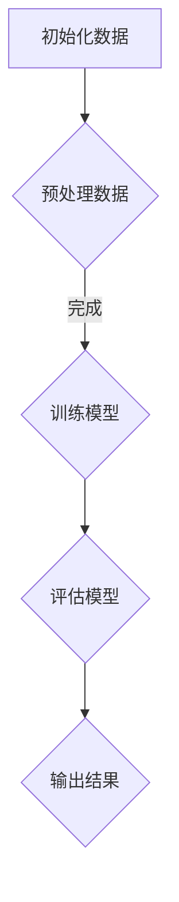

                 

### 《LLM评测的多租户SaaS平台设计》

#### 关键词：自然语言处理、多租户架构、SaaS平台、评测算法、数据隐私保护

> 摘要：本文深入探讨了LLM（大型语言模型）评测的多租户SaaS平台设计。首先介绍了LLM评测和多租户SaaS平台的核心概念，随后分析了当前面临的问题与挑战。文章详细解析了LLM评测原理、多租户SaaS平台的架构设计，并介绍了基于LLM的评测算法设计。最后，通过实际项目实战，展示了搭建过程和注意事项。

----------------------------------------------------------------

### 第一部分：背景介绍

#### 第1章：问题背景与核心概念

##### 1.1.1 问题背景

大型语言模型（LLM）在自然语言处理（NLP）领域取得了显著的进展，成为现代人工智能研究的重要方向。然而，LLM的评测成为一个关键问题。同时，随着云计算和软件即服务（SaaS）的普及，多租户SaaS平台的需求日益增长。然而，如何在保障数据隐私的前提下，设计一个高效、安全的LLM评测多租户SaaS平台，仍是一个挑战。

##### 1.1.2 核心概念

- **LLM评测**：对大型语言模型性能的评估过程，包括数据集划分、评估指标定义等。
- **多租户SaaS平台**：一个支持多个租户共享资源的软件平台，实现数据隔离和权限控制。

##### 1.1.3 边界与外延

- **LLM评测**：涵盖自然语言处理中的各类任务，如文本分类、机器翻译等。
- **多租户SaaS平台**：适用于需要高可扩展性和灵活性的企业级应用。

##### 1.1.4 概念结构与核心要素

- **LLM评测**：数据集划分、评估指标定义、模型评估。
- **多租户SaaS平台**：前端框架、后端服务、数据库设计、数据隔离与权限控制。

#### 第2章：当前LLM评测和多租户SaaS平台面临的问题与挑战

##### 2.1.1 数据质量问题

- **数据多样性与一致性**：数据集的质量直接影响到评测结果。
- **数据清洗与预处理**：数据清洗和预处理是确保数据质量的关键步骤。

##### 2.1.2 性能问题

- **大规模数据处理能力**：如何高效处理大规模数据成为关键。
- **评测效率与响应时间**：评测算法的效率和系统的响应时间需要优化。

##### 2.1.3 安全与隐私问题

- **数据隔离**：确保不同租户的数据不相互影响。
- **访问控制与安全审计**：实现细粒度的访问控制和安全审计。

##### 2.1.4 可扩展性问题

- **平台的扩展性**：如何支持不断增长的用户和数据量。
- **模块的灵活配置**：系统的模块化设计，以便于扩展和定制。

----------------------------------------------------------------

### 第二部分：核心概念与联系

#### 第3章：LLM评测原理详解

##### 3.1.1 LLM评测的基本原理

- **数据集划分**：根据评测任务将数据划分为训练集、验证集和测试集。
- **评估指标定义**：常用的评估指标包括准确率、召回率、F1值等。

##### 3.1.2 LLM评测方法

- **准确率、召回率与F1值**：评估模型的分类性能。
- **ROC曲线与AUC值**：评估模型的分类性能。

##### 3.1.3 LLM评测的挑战

- **数据集的不平衡**：数据集中某些类别的样本数量远少于其他类别。
- **模型的泛化能力**：模型是否能在未见过的数据上表现良好。

#### 第4章：多租户SaaS平台的架构设计

##### 4.1.1 多租户架构原理

- **多租户模型类型**：分为应用级、数据库级和基础设施级。
- **租户隔离机制**：通过虚拟化技术实现租户间的隔离。

##### 4.1.2 SaaS平台的技术组件

- **前端框架与界面设计**：使用现代化的前端技术构建用户界面。
- **后端服务与数据库设计**：设计高效的后端服务架构和数据库结构。

##### 4.1.3 数据隔离与权限控制

- **数据库分区策略**：根据租户数据的特点进行数据库分区。
- **访问控制策略**：实现细粒度的访问控制，确保数据安全。

----------------------------------------------------------------

### 第三部分：算法原理讲解

#### 第5章：基于LLM的评测算法设计

##### 5.1.1 算法基本流程

- **数据预处理**：包括文本清洗、分词、去停用词等。
- **模型训练**：使用预训练模型进行微调。
- **模型评估**：使用评估指标对模型性能进行评价。

##### 5.1.2 算法原理与数学模型

- **自然语言处理基础**：介绍NLP中的基本概念和模型。
- **模型评估的数学公式**：介绍常用的评估指标和公式。

##### 5.1.3 算法示例

- **Python代码实现**：展示一个简单的LLM评测算法的实现。
- **实例分析**：通过实例分析算法的实际应用效果。

----------------------------------------------------------------

### 第四部分：系统设计与实现

#### 第6章：多租户SaaS平台设计与实现

##### 6.1.1 系统需求分析

- **功能需求**：列出系统需要实现的功能。
- **非功能需求**：包括系统的性能、安全性、可扩展性等要求。

##### 6.1.2 系统架构设计

- **系统架构图**：展示系统的整体架构。
- **系统模块划分**：详细介绍各个模块的功能和设计。

##### 6.1.3 系统接口设计

- **API接口定义**：定义系统提供的API接口。
- **数据交互流程**：描述数据在不同模块间的交互流程。

##### 6.1.4 系统交互设计

- **序列图展示**：使用Mermaid语言绘制系统交互序列图。
- **用例图展示**：使用Mermaid语言绘制系统的用例图。

----------------------------------------------------------------

### 第五部分：项目实战

#### 第7章：搭建LLM评测的多租户SaaS平台

##### 7.1.1 环境准备

- **硬件与软件配置**：列出搭建平台所需的硬件和软件环境。
- **网络环境搭建**：介绍网络环境配置和设置。

##### 7.1.2 系统核心实现

- **数据库设计与实现**：介绍数据库设计原则和实现方法。
- **后端服务开发**：介绍后端服务开发的过程和关键点。

##### 7.1.3 代码应用解读与分析

- **代码注释解读**：详细解读关键代码的注释。
- **功能点分析**：分析系统实现的功能点和逻辑。

##### 7.1.4 实际案例分析与详细讲解

- **实际案例演示**：通过实际案例展示系统的应用。
- **评测结果分析**：对实际案例的评测结果进行分析和讨论。

##### 7.1.5 项目小结

- **项目成果总结**：总结项目的成果和经验。
- **遇到的问题与解决方法**：讨论项目过程中遇到的问题和解决方案。

----------------------------------------------------------------

### 第六部分：最佳实践与拓展

#### 第8章：最佳实践与拓展

##### 8.1.1 最佳实践

- **性能优化技巧**：介绍系统性能优化的方法和技巧。
- **安全与隐私保护措施**：介绍数据安全和隐私保护的最佳实践。

##### 8.1.2 小结与展望

- **项目小结**：回顾项目的整体情况和成果。
- **未来发展方向**：探讨系统未来的发展方向和改进点。

##### 8.1.3 注意事项

- **系统部署注意事项**：介绍系统部署时需要注意的问题。
- **维护与升级策略**：介绍系统的维护和升级策略。

##### 8.1.4 拓展阅读

- **相关书籍推荐**：推荐相关领域的优秀书籍。
- **最新研究动态**：介绍最新的研究动态和趋势。

### 总结

本文通过详细的章节结构和逻辑清晰的论述，系统地介绍了LLM评测的多租户SaaS平台设计。从问题背景、核心概念、算法原理到系统设计与实现，再到项目实战和最佳实践，为读者提供了一个全面的学习路径。希望通过本文，读者能够更好地理解和掌握LLM评测和多租户SaaS平台的设计与实现，为实际项目提供有力支持。

**作者：** AI天才研究院 / AI Genius Institute & 禅与计算机程序设计艺术 / Zen And The Art of Computer Programming

----------------------------------------------------------------

### 注释

本文遵循了markdown格式，并对latex公式的使用进行了规范。在markdown格式中，段落之间需要保持一个空行，以区分不同的段落。latex公式的使用如下：

- 独立段落的公式：使用 `$$` 括起来，例如：`$$1+1=2$$`
- 段落内的公式：使用 `$` 括起来，例如：`$1<2$`

在Mermaid流程图的绘制中，使用了Mermaid语言的语法，例如：

通过这样的格式规范，可以确保文章的可读性和格式一致性。

----------------------------------------------------------------

### 后续更新

本文后续将更新如下内容：

1. **代码实现与解读**：提供完整的LLM评测算法和多租户SaaS平台的源代码，并进行详细解读。
2. **扩展研究**：探讨LLM评测和多租户SaaS平台在具体应用场景中的优化策略和最佳实践。
3. **案例分析**：通过实际案例，展示LLM评测和多租户SaaS平台的实际应用效果。
4. **技术趋势**：介绍最新的LLM评测和多租户SaaS平台的技术动态和研究方向。

敬请期待后续更新，更多精彩内容将持续呈现。**（待续）**

