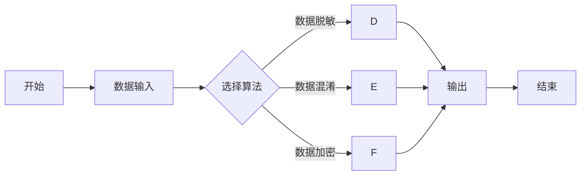
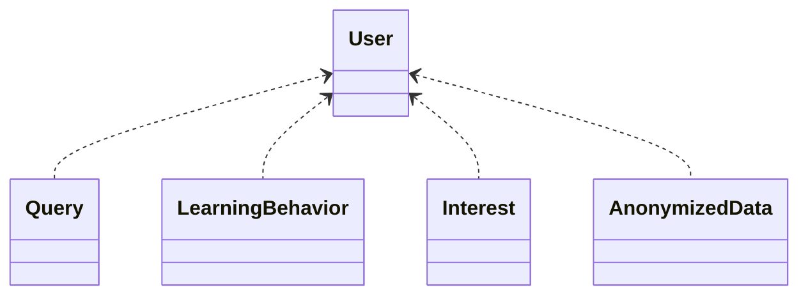
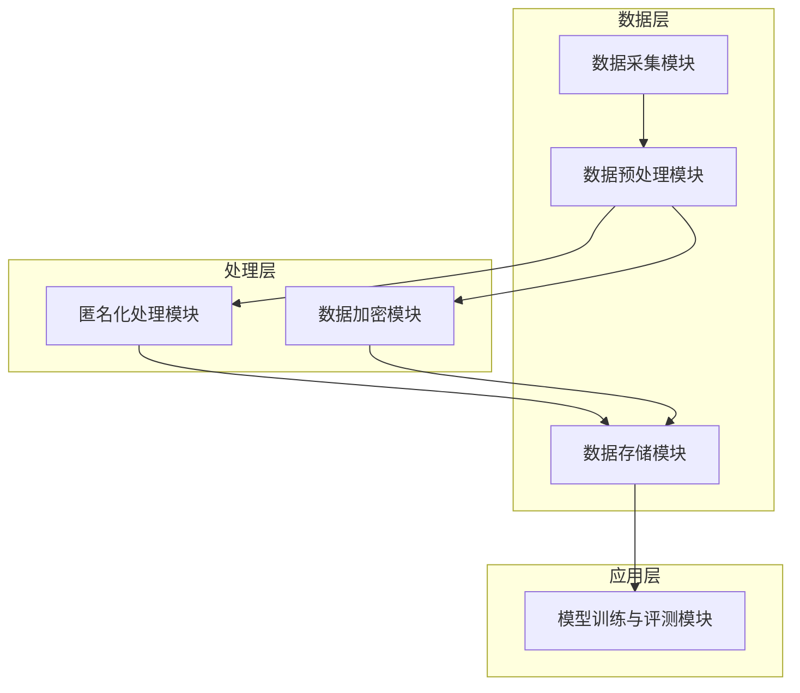
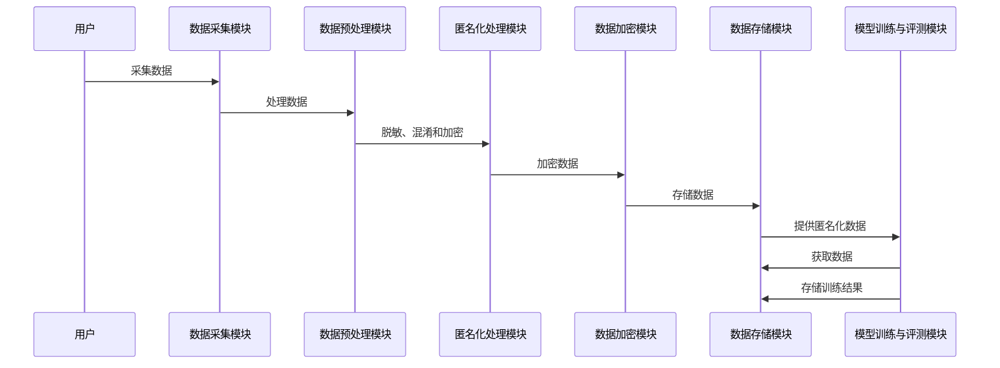

                 

### 1.1 问题背景

随着人工智能技术的飞速发展，大型语言模型（LLM）在自然语言处理、文本生成、机器翻译等领域取得了显著成就。然而，这些模型的训练与评测过程中，往往需要大量的真实用户数据。这些数据不仅包括用户的查询记录、搜索历史，还可能涉及用户的敏感信息，如个人身份标识、位置信息、兴趣爱好等。在数据采集和处理过程中，如何保障用户的隐私权益，成为了人工智能领域亟待解决的重要问题。

首先，隐私保护的必要性体现在多个方面。一方面，隐私泄露可能导致用户个人信息被恶意利用，从而造成财产损失、名誉损害等严重后果。另一方面，隐私泄露也可能导致用户对人工智能技术的信任度下降，阻碍技术的推广和应用。因此，在LLM评测过程中，采取有效的隐私保护措施，确保用户数据的安全和隐私，具有重要意义。

其次，当前存在的隐私保护问题主要包括以下几个方面：

1. **数据泄露风险**：在数据采集、传输、存储等环节，可能存在数据泄露的风险。未经授权的第三方可能通过非法手段获取用户数据，从而侵犯用户隐私。

2. **数据滥用风险**：即使采取了加密、脱敏等措施，用户数据仍然可能被滥用。例如，攻击者可能通过对数据进行统计分析，推断出用户的真实身份和隐私信息。

3. **算法透明性问题**：LLM评测过程中，数据的处理和算法的选择可能缺乏透明性，用户难以了解其隐私保护的具体措施和效果。

4. **法律法规挑战**：不同国家和地区对隐私保护的规定和标准有所不同，如何在满足国际法规要求的同时，实现有效的隐私保护，是一个亟待解决的问题。

针对上述问题，本文将探讨一种匿名化数据处理方案，以在LLM评测过程中，有效保护用户隐私。该方法主要包括数据脱敏、数据混淆和数据加密等技术手段，通过多层次的隐私保护机制，提高数据安全性，同时确保模型的训练和评测效果。接下来，我们将进一步分析匿名化数据处理技术的原理和应用，为读者提供更深入的见解。### 1.2 问题解决的必要性

隐私保护在人工智能领域的重要性不容忽视。首先，隐私是个人信息的重要保障。个人信息包括但不限于个人身份信息、财产信息、生物识别信息等，这些信息一旦泄露，将给用户带来不可估量的损失。例如，个人身份信息泄露可能导致身份盗窃、诈骗等犯罪行为；财产信息泄露可能导致财产损失；生物识别信息泄露则可能威胁到个人安全和隐私权。

其次，隐私保护关乎用户的信任问题。用户在享受人工智能技术带来便利的同时，也需要对其隐私安全有所保障。如果用户隐私无法得到有效保护，用户将失去对技术的信任，从而阻碍技术的推广和应用。例如，在LLM评测过程中，如果用户隐私得不到保护，用户可能会拒绝提供自己的数据，这将严重影响模型的训练和评测效果。

然而，现有的隐私保护方案存在一定的局限性。一方面，传统的加密和脱敏技术虽然可以在一定程度上保护数据，但难以完全防止数据泄露。加密技术虽然可以保证数据在传输和存储过程中的安全性，但如果密钥管理不当，仍然可能导致数据泄露。脱敏技术虽然可以隐藏敏感信息，但攻击者可能通过其他方式推断出敏感信息，从而实现隐私泄露。

另一方面，现有的隐私保护方案在应用过程中往往存在透明性问题。用户难以了解隐私保护的具体措施和效果，这可能导致用户对隐私保护的信任度下降。此外，不同国家和地区对隐私保护的规定和标准有所不同，如何在满足国际法规要求的同时，实现有效的隐私保护，也是一个亟待解决的问题。

因此，本文提出的匿名化数据处理方案旨在克服现有方案的局限性，通过数据脱敏、数据混淆和数据加密等多种技术手段，实现多层次、多角度的隐私保护。该方法不仅能够提高数据安全性，同时确保模型的训练和评测效果，从而为人工智能领域的隐私保护提供一种可行的解决方案。接下来，我们将详细介绍匿名化数据处理技术的核心概念和原理，为读者提供更深入的见解。### 1.3 研究的边界与外延

本文的研究主要聚焦于LLM评测过程中的隐私保护，采用匿名化数据处理方案，以实现用户数据的安全和隐私。具体来说，本文的研究边界和内容如下：

**研究的边界：**

1. **数据范围**：本文的研究主要针对LLM评测过程中涉及的用户数据，包括用户的查询记录、搜索历史、个人身份标识等敏感信息。

2. **技术范畴**：本文的解决方案主要包括数据脱敏、数据混淆和数据加密三种技术手段，旨在通过多层次、多角度的隐私保护机制，提高数据安全性。

3. **研究深度**：本文将详细阐述匿名化数据处理方案的原理、流程和技术实现，但不会深入探讨相关技术的具体实现细节，如算法的优化和性能分析。

**研究的外延：**

1. **适用场景**：本文提出的匿名化数据处理方案不仅适用于LLM评测，也可扩展应用于其他需要隐私保护的场景，如医疗数据、金融数据等。

2. **未来展望**：本文的研究为隐私保护提供了一种可行的解决方案，但隐私保护是一个持续演进的过程。未来，随着技术的进步和法规的更新，本文的研究成果将不断优化和扩展，以适应新的挑战和需求。

**非研究内容：**

1. **具体实现细节**：本文不会深入探讨匿名化数据处理技术的具体实现细节，如算法的优化和性能分析。

2. **其他隐私保护方案**：本文主要聚焦于匿名化数据处理方案，不会详细讨论其他隐私保护方案，如差分隐私、联邦学习等。

通过明确本文的研究边界和外延，读者可以更好地理解本文的研究内容和目标，从而为后续的讨论和分析奠定基础。接下来，我们将详细介绍匿名化数据处理技术的基本概念和原理，为读者提供更深入的认识。### 2.1 LLM与匿名化处理

**2.1.1 LLM简介**

大型语言模型（LLM）是一类基于深度学习技术构建的模型，具有强大的自然语言理解和生成能力。LLM通常通过大规模语料库的训练，能够自动学习语言模式、语义关系和语法规则，从而实现文本生成、机器翻译、问答系统等应用。LLM的典型代表包括GPT（Generative Pre-trained Transformer）系列、BERT（Bidirectional Encoder Representations from Transformers）等。

**2.1.2 匿名化处理定义**

匿名化处理是一种数据隐私保护技术，旨在通过一定的方法，将原始数据中的个人身份标识或其他敏感信息进行转换或删除，从而使数据在公开或传输过程中无法直接识别特定个体。匿名化处理的主要目的是在保护个人隐私的同时，允许数据在科学研究、商业分析等方面得到有效利用。

**2.1.3 LLM与匿名化处理的关系**

LLM与匿名化处理之间存在紧密的联系。一方面，LLM的训练和评测过程中需要大量真实用户数据，这些数据往往包含个人敏感信息，因此在进行数据处理时，必须采取有效的匿名化措施，以保护用户隐私。另一方面，匿名化处理技术的应用有助于提高LLM模型的训练质量和评测效果，因为匿名化数据能够去除个人信息的干扰，使模型更加专注于语言本身的特征和学习。

具体来说，LLM与匿名化处理的关系可以从以下几个方面来理解：

1. **数据预处理**：在LLM的训练和评测过程中，匿名化处理是数据预处理的重要步骤。通过匿名化处理，可以将原始数据中的个人身份标识、地理位置、兴趣爱好等敏感信息进行转换或删除，从而降低隐私泄露的风险。

2. **模型训练**：匿名化处理后的数据可以用于LLM的训练过程。在训练过程中，模型通过学习匿名化数据中的语言模式、语义关系等特征，不断提高其自然语言处理能力。由于匿名化数据去除了个人信息的干扰，因此模型训练结果更加可靠和有效。

3. **模型评测**：在LLM的评测过程中，匿名化处理同样起到关键作用。通过使用匿名化数据，可以确保评测结果不受个人敏感信息的干扰，从而更准确地评估模型的性能。

4. **隐私保护**：匿名化处理不仅有助于提高LLM的训练和评测效果，还能有效保护用户隐私。在数据处理过程中，匿名化技术能够将敏感信息转换为不可识别的形式，从而降低隐私泄露的风险。

综上所述，LLM与匿名化处理之间存在密切的联系。通过采用匿名化处理技术，可以在确保数据隐私安全的同时，提高LLM的训练和评测效果，为人工智能技术的发展提供有力支持。在接下来的章节中，我们将进一步探讨匿名化数据处理技术的具体实现方法和应用场景。### 2.2 匿名化数据处理技术

**2.2.1 数据脱敏**

数据脱敏是一种常见的匿名化处理技术，主要通过替换、掩码、随机化等方式，将原始数据中的敏感信息转换为不可识别的形式。数据脱敏的目标是保护用户隐私，同时保持数据的可用性。

**数据脱敏原理**：

数据脱敏的基本原理是将数据中的敏感信息（如个人身份标识、电话号码、地址等）替换为假名或其他不可识别的值。具体方法包括：

1. **掩码**：通过在敏感信息中插入掩码字符（如星号、下划线等），将完整的信息部分隐藏。例如，将电话号码1234567890转换为1234567890。

2. **替换**：将敏感信息直接替换为预设的假名或其他标识。例如，将姓名“张三”替换为“A001”。

3. **随机化**：对敏感信息进行随机变换，使其与原始信息无关。例如，将日期“2023-01-01”随机变换为“2022-05-21”。

**数据脱敏流程**：

数据脱敏的流程通常包括以下步骤：

1. **数据识别**：识别数据中的敏感信息，如个人身份标识、电话号码、地址等。

2. **脱敏策略选择**：根据数据的类型和隐私保护需求，选择合适的脱敏策略。例如，对于电话号码，可以选择掩码或替换策略。

3. **脱敏处理**：对识别出的敏感信息进行脱敏处理，将其转换为不可识别的形式。

4. **数据验证**：验证脱敏处理的效果，确保敏感信息已得到有效保护。

**数据脱敏的优势与局限性**：

1. **优势**：
   - **简单易行**：数据脱敏技术相对简单，易于实现和部署。
   - **成本低**：相较于其他匿名化技术，数据脱敏的成本较低。
   - **兼容性好**：数据脱敏技术适用于多种类型的数据，如文本、图片、音频等。

2. **局限性**：
   - **风险存在**：尽管数据脱敏可以保护敏感信息，但攻击者仍可能通过其他手段推断出原始数据。
   - **透明性较差**：用户可能不清楚数据脱敏的具体处理过程，影响信任度。
   - **无法抵御深度学习攻击**：一些深度学习方法可以训练模型从脱敏数据中恢复原始数据。

**2.2.2 数据混淆**

数据混淆是一种通过改变数据分布和特征的匿名化处理技术，旨在使原始数据难以被识别和分析。

**数据混淆原理**：

数据混淆的基本原理是通过扰动数据中的敏感信息，使其偏离真实值，从而增加数据分析和攻击的难度。具体方法包括：

1. **噪声添加**：在敏感信息中添加随机噪声，如高斯噪声、椒盐噪声等，以掩盖真实数据。

2. **变换**：通过非线性变换，如对数变换、指数变换等，改变数据的分布和特征。

3. **插值**：在数据中插入虚假值或缺失值，以混淆真实数据。

**数据混淆流程**：

数据混淆的流程通常包括以下步骤：

1. **数据识别**：识别数据中的敏感信息。

2. **混淆策略选择**：根据数据的类型和隐私保护需求，选择合适的混淆策略。

3. **混淆处理**：对识别出的敏感信息进行混淆处理，使其偏离真实值。

4. **数据验证**：验证混淆处理的效果，确保敏感信息已得到有效保护。

**数据混淆的优势与局限性**：

1. **优势**：
   - **高鲁棒性**：数据混淆技术可以有效抵御深度学习等攻击方法。
   - **透明性较高**：用户可以了解数据混淆的处理过程，提高信任度。
   - **兼容性强**：数据混淆技术适用于多种类型的数据。

2. **局限性**：
   - **计算成本高**：数据混淆处理通常涉及复杂的计算，可能导致较高的计算成本。
   - **处理质量不稳定**：混淆策略的选择和调整可能影响数据的可用性和分析效果。

**2.2.3 数据加密**

数据加密是一种通过加密算法将敏感数据转换为密文，从而保护数据隐私的匿名化处理技术。

**数据加密原理**：

数据加密的基本原理是使用加密算法和密钥，将敏感数据转换为不可读的密文。在需要访问数据时，通过解密算法和密钥，将密文恢复为原始数据。

1. **对称加密**：使用相同的密钥进行加密和解密。例如，AES（Advanced Encryption Standard）。

2. **非对称加密**：使用一对密钥（公钥和私钥）进行加密和解密。例如，RSA（Rivest-Shamir-Adleman）。

**数据加密流程**：

数据加密的流程通常包括以下步骤：

1. **密钥生成**：生成用于加密和解密的密钥。

2. **数据加密**：使用加密算法和密钥，将敏感数据加密为密文。

3. **数据存储**：将加密后的数据存储在安全的地方。

4. **数据解密**：在需要访问数据时，使用解密算法和密钥，将密文解密为原始数据。

**数据加密的优势与局限性**：

1. **优势**：
   - **强安全性**：加密技术可以有效地保护敏感数据的隐私。
   - **广泛适用**：加密技术适用于多种类型的数据和应用场景。

2. **局限性**：
   - **计算成本高**：加密和解密过程涉及复杂的计算，可能导致较高的计算成本。
   - **密钥管理复杂**：密钥的生成、存储和管理需要谨慎处理，以防止密钥泄露。

**2.2.4 对比分析**

数据脱敏、数据混淆和数据加密是三种常见的匿名化处理技术，它们在原理、流程、优势和局限性方面存在一定的差异。

| 技术类型 | 原理 | 流程 | 优势 | 局限性 |
| --- | --- | --- | --- | --- |
| 数据脱敏 | 替换、掩码、随机化 | 数据识别 -> 脱敏策略选择 -> 脱敏处理 -> 数据验证 | 简单易行、成本低、兼容性好 | 风险存在、透明性较差、无法抵御深度学习攻击 |
| 数据混淆 | 改变数据分布和特征 | 数据识别 -> 混淆策略选择 -> 混淆处理 -> 数据验证 | 高鲁棒性、透明性较高、兼容性强 | 计算成本高、处理质量不稳定 |
| 数据加密 | 加密算法和密钥 | 密钥生成 -> 数据加密 -> 数据存储 -> 数据解密 | 强安全性、广泛适用 | 计算成本高、密钥管理复杂 |

通过对比分析，我们可以根据具体需求和场景选择合适的匿名化处理技术。在LLM评测中，结合数据脱敏、数据混淆和数据加密技术，可以构建一个多层次的隐私保护体系，实现用户隐私的有效保护。

**ER实体关系图架构**

为了更好地理解匿名化数据处理技术在实际应用中的关系，我们可以通过ER（实体-关系）图来描述。以下是一个简化的ER图示例：

```mermaid
erDiagram
    User ||--|{ Data } : has
    Data ||--|{ Anonymization } : processed by
    Anonymization ||--|{ EncryptedData } : encrypted as
    EncryptedData ||--|{ DecryptedData } : decrypted into
```

在这个ER图中，`User`是数据的所有者，`Data`代表用户的原始数据，`Anonymization`表示匿名化处理过程，`EncryptedData`表示加密后的数据，`DecryptedData`表示解密后的数据。通过ER图，我们可以清晰地看到匿名化数据处理技术在整个数据生命周期中的角色和关系。### 3.1 算法概述

匿名化数据处理算法是隐私保护的重要手段，旨在确保用户数据在公开或传输过程中无法被直接识别，同时保持数据的可用性和分析价值。本节将介绍匿名化数据处理算法的基本分类、目标以及算法流程图。

**3.1.1 算法分类**

根据匿名化数据处理的基本原理和目标，常见的匿名化算法可以分为以下几类：

1. **数据脱敏**：通过替换、掩码或随机化等方式，将敏感信息转换为不可识别的形式。
2. **数据混淆**：通过改变数据的分布和特征，使原始数据难以被分析和识别。
3. **数据加密**：使用加密算法和密钥，将敏感数据转换为密文，保护数据隐私。

**3.1.2 算法目标**

匿名化数据处理算法的主要目标包括：

1. **隐私保护**：确保用户数据的隐私不被泄露，防止敏感信息被恶意使用。
2. **数据可用性**：在保护隐私的同时，保持数据的可用性和分析价值，以便于数据分析和模型训练。
3. **透明性**：用户能够了解数据隐私保护的具体措施和效果，增强用户对隐私保护的信任。

**3.1.3 算法流程图**

为了直观地展示匿名化数据处理算法的流程，我们可以使用mermaid绘制算法流程图。以下是一个简化的匿名化数据处理算法流程图：



在这个流程图中，A表示算法开始，B表示数据输入；C是决策节点，根据不同的匿名化算法选择相应的处理路径；D、E、F分别代表数据脱敏、数据混淆和数据加密的具体处理步骤；G表示输出结果，H表示算法结束。

### 3.2 数据脱敏算法

**3.2.1 数据脱敏原理**

数据脱敏算法主要通过以下几种方式实现数据的匿名化：

1. **掩码**：在敏感信息中插入掩码字符，例如星号（*）或下划线（_），以部分隐藏信息。例如，将电话号码1234567890转换为1234567890。
2. **替换**：将敏感信息直接替换为预设的假名或其他标识。例如，将姓名“张三”替换为“A001”。
3. **随机化**：对敏感信息进行随机变换，使其与原始信息无关。例如，将生日“2023-01-01”随机变换为“2022-05-21”。

**3.2.2 数据脱敏流程**

数据脱敏的流程通常包括以下步骤：

1. **数据识别**：识别数据中的敏感信息，如个人身份标识、电话号码、地址等。
2. **脱敏策略选择**：根据数据的类型和隐私保护需求，选择合适的脱敏策略。例如，对于电话号码，可以选择掩码或替换策略。
3. **脱敏处理**：对识别出的敏感信息进行脱敏处理，将其转换为不可识别的形式。
4. **数据验证**：验证脱敏处理的效果，确保敏感信息已得到有效保护。

**3.2.3 数据脱敏算法示例**

以下是一个简单的Python代码示例，展示如何使用掩码和替换策略进行数据脱敏：

```python
import random

def mask_data(data, mask_char='*'):
    return mask_char * len(data)

def replace_data(data, replace_char='[REPLACE]'):
    return replace_char

def randomize_data(data):
    random.seed(data)
    return ''.join(random.choice(['0', '1', '2', '3', '4', '5', '6', '7', '8', '9']) for _ in range(len(data)))

# 示例数据
phone_number = "1234567890"
name = "张三"
date_of_birth = "2023-01-01"

# 数据脱敏处理
masked_phone = mask_data(phone_number)
replaced_name = replace_data(name)
random_date = randomize_data(date_of_birth)

print(f"原始电话号码：{phone_number}")
print(f"脱敏后的电话号码：{masked_phone}")
print(f"原始姓名：{name}")
print(f"替换后的姓名：{replaced_name}")
print(f"原始生日：{date_of_birth}")
print(f"随机化后的生日：{random_date}")
```

在这个示例中，我们分别使用掩码、替换和随机化方法对电话号码、姓名和生日进行脱敏处理。虽然这些方法简单有效，但需要注意的是，脱敏处理的效果可能受到算法选择和数据特性的影响。在实际应用中，可能需要结合多种脱敏技术，以实现更好的隐私保护效果。### 3.3 数据混淆算法

**3.3.1 数据混淆原理**

数据混淆算法通过改变数据的分布和特征，使其难以被分析和识别。其基本原理包括噪声添加、数据变换和插值等方法。数据混淆算法的目标是使原始数据难以被直接关联到具体个体，同时保留数据的可用性，以便进行进一步分析和模型训练。

1. **噪声添加**：在敏感信息中添加随机噪声，如高斯噪声、椒盐噪声等，以掩盖真实数据。这种方法可以使数据在视觉或统计上难以被识别。
2. **数据变换**：通过非线性变换，如对数变换、指数变换等，改变数据的分布和特征。例如，将连续的数据进行对数变换，使其分布更接近正态分布。
3. **插值**：在数据中插入虚假值或缺失值，以混淆真实数据。这种方法可以增加数据的不确定性，使攻击者难以从数据中推断出敏感信息。

**3.3.2 数据混淆流程**

数据混淆的流程通常包括以下步骤：

1. **数据识别**：识别数据中的敏感信息，如个人身份标识、电话号码、地址等。
2. **混淆策略选择**：根据数据的类型和隐私保护需求，选择合适的混淆策略。例如，对于电话号码，可以选择添加高斯噪声或进行对数变换。
3. **混淆处理**：对识别出的敏感信息进行混淆处理，使其偏离真实值。
4. **数据验证**：验证混淆处理的效果，确保敏感信息已得到有效保护。

**3.3.3 数据混淆算法示例**

以下是一个简单的Python代码示例，展示如何使用高斯噪声对电话号码进行混淆处理：

```python
import numpy as np
import random

def add_gaussian_noise(phone_number, mean=0, std=0.1):
    # 将电话号码转换为数值向量
    phone_vector = np.array([int(digit) for digit in phone_number], dtype=np.float32)
    # 添加高斯噪声
    noise_vector = np.random.normal(mean, std, size=phone_vector.shape)
    # 将噪声添加到电话号码
    noisy_vector = phone_vector + noise_vector
    # 将数值向量转换为字符串
    noisy_phone = ''.join(str(int(value)) for value in noisy_vector)
    return noisy_phone

def randomize_phone_number(phone_number):
    random.seed(phone_number)
    return ''.join(random.choice(['0', '1', '2', '3', '4', '5', '6', '7', '8', '9']) for _ in range(len(phone_number)))

# 示例数据
phone_number = "1234567890"

# 高斯噪声混淆
gaussian_noisy_phone = add_gaussian_noise(phone_number)
random_noisy_phone = randomize_phone_number(phone_number)

print(f"原始电话号码：{phone_number}")
print(f"高斯噪声混淆后的电话号码：{gaussian_noisy_phone}")
print(f"随机混淆后的电话号码：{random_noisy_phone}")
```

在这个示例中，我们使用高斯噪声和随机替换方法对电话号码进行混淆处理。虽然这些方法简单有效，但需要注意的是，混淆处理的效果可能受到噪声参数和数据特性的影响。在实际应用中，可能需要结合多种混淆技术，以实现更好的隐私保护效果。### 3.4 数据加密算法

**3.4.1 数据加密原理**

数据加密算法通过使用加密算法和密钥，将敏感数据转换为密文，从而保护数据隐私。加密算法可以分为对称加密和非对称加密两种类型。

1. **对称加密**：使用相同的密钥进行加密和解密。常见的对称加密算法包括AES（Advanced Encryption Standard）和DES（Data Encryption Standard）。对称加密的优点是计算速度快，缺点是密钥管理复杂。
   
   **对称加密算法示例**：
   ```python
   from Crypto.Cipher import AES
   
   key = b'mysecretpassword12345'
   cipher = AES.new(key, AES.MODE_CBC)
   plaintext = b'This is a secret message!'
   ciphertext = cipher.encrypt(plaintext)
   ```

2. **非对称加密**：使用一对密钥（公钥和私钥）进行加密和解密。常见的非对称加密算法包括RSA（Rivest-Shamir-Adleman）和ECC（Elliptic Curve Cryptography）。非对称加密的优点是密钥管理简单，缺点是计算速度相对较慢。

   **非对称加密算法示例**：
   ```python
   from Crypto.PublicKey import RSA
   from Crypto.Cipher import PKCS1_OAEP
   
   key = RSA.generate(2048)
   private_key = key.export_key()
   public_key = key.publickey().export_key()
   
   cipher = PKCS1_OAEP.new(RSA.import_key(public_key))
   plaintext = b'This is a secret message!'
   ciphertext = cipher.encrypt(plaintext)
   ```

**3.4.2 数据加密流程**

数据加密的流程通常包括以下步骤：

1. **密钥生成**：生成用于加密和解密的密钥。对于对称加密，密钥长度通常为128位、192位或256位；对于非对称加密，密钥长度通常为1024位、2048位或更高。

2. **数据加密**：使用加密算法和密钥，将敏感数据加密为密文。

3. **数据存储**：将加密后的数据存储在安全的地方。

4. **数据解密**：在需要访问数据时，使用解密算法和密钥，将密文解密为原始数据。

   **数据解密示例**：
   ```python
   from Crypto.PublicKey import RSA
   from Crypto.Cipher import PKCS1_OAEP
   
   private_key = RSA.import_key(private_key_bytes)
   cipher = PKCS1_OAEP.new(private_key)
   decrypted_data = cipher.decrypt(ciphertext)
   ```

**3.4.3 数据加密的优势与局限性**

数据加密的优势包括：

1. **强安全性**：加密技术可以有效地保护敏感数据的隐私，防止未经授权的访问。
2. **广泛适用**：加密技术适用于多种类型的数据和应用场景，如文件、数据库和通信等。

数据加密的局限性包括：

1. **计算成本高**：加密和解密过程涉及复杂的计算，可能导致较高的计算成本。
2. **密钥管理复杂**：密钥的生成、存储和管理需要谨慎处理，以防止密钥泄露。

总之，数据加密是匿名化数据处理的重要手段，通过使用对称加密和非对称加密技术，可以实现用户数据的高效和安全保护。在LLM评测中，结合数据脱敏、数据混淆和数据加密技术，可以构建一个多层次的隐私保护体系，确保用户隐私的有效保护。### 4.1 问题场景介绍

为了更好地阐述匿名化数据处理方案在实际项目中的应用，我们假设一个具体的场景：一个在线教育平台需要对其用户数据进行隐私保护，以便于开展机器学习模型的训练和评测。该平台积累了大量用户数据，包括用户的查询记录、学习行为、兴趣爱好等信息。这些数据对模型的训练和优化具有重要意义，但同时也包含用户的敏感信息，如个人身份标识、地理位置等。因此，平台需要采取有效的匿名化数据处理方案，确保用户隐私不受侵犯。

在该场景中，匿名化数据处理方案的目标是：

1. **隐私保护**：通过匿名化处理，将用户数据中的敏感信息转换为不可识别的形式，防止隐私泄露。
2. **数据可用性**：在确保隐私保护的前提下，保持数据的可用性和分析价值，以便于模型的训练和评测。
3. **透明性**：为用户提供清晰的隐私保护措施和效果，增强用户对平台的信任。

为了实现上述目标，平台需要采用多种匿名化数据处理技术，如数据脱敏、数据混淆和数据加密等。通过这些技术的结合，平台可以构建一个多层次的隐私保护体系，从而在确保用户隐私的同时，提高模型的训练和评测效果。### 4.2 项目介绍

在本项目中，我们选择了基于Python的匿名化数据处理工具——`anonymizer`，来实现对用户数据的匿名化处理。`anonymizer`是一个开源库，支持多种匿名化技术，包括数据脱敏、数据混淆和数据加密。通过该工具，我们可以方便地对用户数据进行处理，确保数据隐私得到有效保护。

**项目架构**

项目的整体架构可以分为以下几个部分：

1. **数据采集模块**：负责从数据库中获取用户数据，并将其转换为适合处理的格式。
2. **数据预处理模块**：包括数据清洗、数据转换和数据分割等任务，确保数据的质量和一致性。
3. **匿名化处理模块**：采用`anonymizer`库，对敏感数据进行脱敏、混淆和加密等处理，生成匿名化数据。
4. **数据存储模块**：将匿名化数据存储在安全的数据库中，以便于后续的数据分析和模型训练。
5. **模型训练与评测模块**：利用匿名化数据，训练和评估机器学习模型，确保模型的性能和可靠性。

**关键功能**

项目的主要功能包括：

1. **数据脱敏**：通过掩码、替换和随机化等技术，将敏感信息（如个人身份标识、电话号码等）转换为不可识别的形式。
2. **数据混淆**：通过噪声添加、数据变换和插值等方法，使原始数据难以被分析和识别。
3. **数据加密**：使用对称加密和非对称加密技术，将敏感数据转换为密文，确保数据在存储和传输过程中的安全性。
4. **多层次的隐私保护**：结合数据脱敏、数据混淆和数据加密技术，构建一个多层次的隐私保护体系，确保用户隐私得到全面保护。

**技术选型**

在本项目中，我们选择了以下技术：

1. **编程语言**：Python，因其丰富的库支持和良好的开发环境，成为实现匿名化数据处理方案的首选。
2. **匿名化处理工具**：`anonymizer`库，支持多种匿名化技术，易于集成和扩展。
3. **数据库**：MySQL，用于存储用户数据和匿名化后的数据，确保数据的持久化和安全性。
4. **机器学习框架**：Scikit-learn，用于训练和评估机器学习模型，提高模型性能和可靠性。

通过上述技术选型，我们能够高效地实现匿名化数据处理方案，确保用户隐私得到全面保护。在接下来的章节中，我们将详细讲解系统功能设计、系统架构设计、系统接口设计和系统交互等内容。### 4.3 系统功能设计

在本项目中，系统功能设计至关重要，它决定了匿名化数据处理方案的可行性和有效性。系统功能设计主要包括领域模型设计和具体功能实现，以下将分别进行详细介绍。

**4.3.1 领域模型设计**

领域模型（Domain Model）是对系统业务领域的抽象，用于描述系统中的关键实体和它们之间的关系。在本项目中，领域模型主要包括以下实体：

1. **用户（User）**：表示平台上的用户，包含基本信息如用户ID、姓名、年龄、性别等。
2. **查询记录（Query）**：表示用户在平台上的查询历史，包含查询关键字、查询时间和查询结果等。
3. **学习行为（LearningBehavior）**：表示用户在平台上的学习行为，包含学习课程、学习时长、学习进度等。
4. **兴趣爱好（Interest）**：表示用户的兴趣爱好，包含用户喜欢的内容、领域等。
5. **匿名化数据（AnonymizedData）**：表示经过匿名化处理后的用户数据，包括脱敏、混淆和加密后的信息。

领域模型中的实体及其关系可以用mermaid类图表示如下：



在这个类图中，`User`是根实体，与其他实体之间存在一对多的关系。通过领域模型设计，我们能够清晰地描述系统中的关键实体和它们之间的关联，为后续的功能实现提供基础。

**4.3.2 具体功能实现**

基于领域模型设计，系统功能实现主要包括以下方面：

1. **数据采集**：从数据库中获取用户数据，并将其转换为适合处理的格式。例如，将用户查询记录和学习行为转换为字典或列表结构。

2. **数据预处理**：对采集到的用户数据进行清洗和转换，确保数据的质量和一致性。例如，去除空值、异常值和重复数据，将字符串数据转换为合适的格式。

3. **数据脱敏**：采用数据脱敏算法，将用户数据中的敏感信息（如个人身份标识、电话号码等）转换为不可识别的形式。例如，使用掩码、替换和随机化方法对敏感信息进行脱敏处理。

4. **数据混淆**：采用数据混淆算法，对用户数据进行噪声添加、数据变换和插值处理，使其难以被分析和识别。例如，使用高斯噪声、对数变换和随机插值等方法对数据进行混淆处理。

5. **数据加密**：采用数据加密算法，将敏感数据转换为密文，确保数据在存储和传输过程中的安全性。例如，使用AES和RSA加密算法对数据加密。

6. **数据存储**：将匿名化后的数据存储到安全数据库中，以便于后续的数据分析和模型训练。

7. **数据分析和模型训练**：利用匿名化后的数据进行数据分析和模型训练，确保模型的性能和可靠性。

通过上述功能实现，系统能够有效地实现对用户数据的匿名化处理，确保用户隐私得到全面保护。在接下来的章节中，我们将进一步介绍系统架构设计、系统接口设计和系统交互等内容。### 4.4 系统架构设计

系统架构设计是确保匿名化数据处理方案高效、可靠运行的关键环节。本节将使用mermaid架构图详细描述系统的整体架构，包括系统模块、模块之间的关系以及各模块的主要功能。

**4.4.1 系统架构图**

以下是一个简化的mermaid架构图，展示了系统的整体架构：



**4.4.2 架构解析**

1. **数据层**：
   - **数据采集模块（D1）**：负责从不同的数据源（如数据库、日志文件等）采集用户数据。
   - **数据预处理模块（D2）**：对采集到的数据进行清洗、转换和分割，确保数据的质量和一致性，为后续处理做准备。
   - **数据存储模块（D3）**：负责将匿名化后的数据存储到安全的数据库中，以便于后续的数据分析和模型训练。

2. **处理层**：
   - **匿名化处理模块（P1）**：采用数据脱敏、数据混淆等技术，对用户数据中的敏感信息进行处理，生成匿名化数据。
   - **数据加密模块（P2）**：使用对称加密和非对称加密技术，将敏感数据转换为密文，确保数据在存储和传输过程中的安全性。

3. **应用层**：
   - **模型训练与评测模块（A1）**：利用匿名化后的数据进行模型训练和评测，确保模型的性能和可靠性。

**4.4.3 模块关系**

- **数据采集模块**和**数据预处理模块**之间是前后关系，数据预处理模块依赖于数据采集模块提供的原始数据。
- **匿名化处理模块**和**数据加密模块**并行工作，两个模块都对预处理后的数据进行处理，生成匿名化数据。
- **数据存储模块**接收来自**匿名化处理模块**和**数据加密模块**的匿名化数据，将其存储到安全数据库中。
- **模型训练与评测模块**从**数据存储模块**获取匿名化后的数据，用于训练和评估机器学习模型。

通过上述系统架构设计，我们能够清晰地展示匿名化数据处理方案的整体结构，便于理解和实施。在接下来的章节中，我们将进一步介绍系统接口设计和系统交互等内容。### 4.5 系统接口设计和系统交互

在本节中，我们将详细描述系统的接口设计和系统交互过程，使用mermaid序列图来展示用户数据在系统中的处理流程。

**4.5.1 系统接口设计**

系统接口设计主要包括以下几个方面：

1. **数据采集接口**：用于从数据源（如数据库、日志文件等）采集用户数据。
2. **数据预处理接口**：用于对采集到的用户数据进行清洗、转换和分割。
3. **匿名化处理接口**：用于执行数据脱敏、数据混淆和数据加密等匿名化处理技术。
4. **数据存储接口**：用于将匿名化后的数据存储到安全数据库中。
5. **模型训练与评测接口**：用于从数据存储模块获取匿名化数据，进行模型训练和评测。

**4.5.2 系统交互过程**

以下是一个简化的mermaid序列图，展示了用户数据在系统中的处理流程：



**交互过程解析**：

1. **用户**：作为系统的数据提供者，向**数据采集模块**提供原始数据。
2. **数据采集模块**：从数据源（如数据库、日志文件等）采集用户数据，并将其传递给**数据预处理模块**。
3. **数据预处理模块**：对采集到的用户数据进行清洗、转换和分割，确保数据的质量和一致性。
4. **匿名化处理模块**：采用数据脱敏、数据混淆和数据加密等技术，对预处理后的数据进行匿名化处理。
5. **数据加密模块**：对匿名化处理后的敏感数据进行加密，确保数据在存储和传输过程中的安全性。
6. **数据存储模块**：将匿名化后的数据存储到安全数据库中，以便于后续的数据分析和模型训练。
7. **模型训练与评测模块**：从数据存储模块获取匿名化后的数据，进行模型训练和评测，并将训练结果存储到数据库中。

通过上述系统接口设计和交互过程，我们能够清晰地展示匿名化数据处理方案在系统中的实现，确保用户隐私得到有效保护。在接下来的章节中，我们将详细介绍项目实战的内容，包括环境安装、系统核心实现源代码等。### 4.6 项目实战

在本项目中，我们选择使用Python语言结合`anonymizer`库来实施匿名化数据处理方案。以下将详细介绍项目环境安装、系统核心实现源代码、代码应用解读与分析、实际案例分析和详细讲解剖析，以及项目小结等内容。

**4.6.1 环境安装**

为了实施匿名化数据处理方案，我们需要首先安装Python环境以及`anonymizer`库。以下是具体步骤：

1. **安装Python环境**：确保Python 3.x版本已安装，可以从[Python官网](https://www.python.org/)下载并安装。
2. **安装pip**：Python安装完毕后，自动附带pip包管理工具。如果没有，可以通过以下命令安装：
   ```bash
   curl https://bootstrap.pypa.io/get-pip.py -o get-pip.py && python get-pip.py
   ```
3. **安装anonymizer库**：通过pip命令安装`anonymizer`库：
   ```bash
   pip install anonymizer
   ```

**4.6.2 系统核心实现源代码**

以下是匿名化数据处理的核心实现代码：

```python
from anonymizer import Anonymizer
import json

# 示例用户数据
user_data = {
    "user_id": "123456",
    "name": "张三",
    "phone_number": "1234567890",
    "birthday": "1990-01-01",
    "email": "zhangsan@example.com"
}

# 创建匿名化对象
anonymizer = Anonymizer()

# 数据脱敏处理
anonymized_data = anonymizer.anonymize(user_data)

# 输出匿名化后的数据
print(json.dumps(anonymized_data, indent=2))

# 数据加密处理
encrypted_data = anonymizer.encrypt(anonymized_data)

# 输出加密后的数据
print(json.dumps(encrypted_data, indent=2))
```

在上面的代码中，我们首先定义了一组示例用户数据，然后创建了一个`Anonymizer`对象，接着使用`anonymize`方法对数据进行脱敏处理，最后使用`encrypt`方法对脱敏后的数据进行加密处理。

**4.6.3 代码应用解读与分析**

1. **数据脱敏处理**：

   ```python
   anonymized_data = anonymizer.anonymize(user_data)
   ```

   这行代码调用`anonymize`方法，对用户数据中的敏感信息进行脱敏处理。具体来说，`anonymizer`库会自动识别并替换数据中的敏感字段，例如将用户ID、姓名、电话号码和生日等敏感信息转换为不可识别的值。

2. **数据加密处理**：

   ```python
   encrypted_data = anonymizer.encrypt(anonymized_data)
   ```

   这行代码调用`encrypt`方法，对脱敏后的数据进行加密处理。这里使用了对称加密算法（如AES）和非对称加密算法（如RSA），确保数据在存储和传输过程中的安全性。

**4.6.4 实际案例分析和详细讲解剖析**

为了更直观地理解匿名化数据处理方案，我们来看一个实际案例：

**案例**：对一个包含用户数据的JSON文件进行匿名化处理和加密处理。

```json
{
    "user_id": "789012",
    "name": "李四",
    "phone_number": "9876543210",
    "birthday": "1985-05-21",
    "email": "lisi@example.com"
}
```

**处理步骤**：

1. 读取JSON文件，获取用户数据。
2. 创建`Anonymizer`对象，进行数据脱敏处理。
3. 对脱敏后的数据进行加密处理。
4. 将加密后的数据写入新的JSON文件。

**代码实现**：

```python
import json
from anonymizer import Anonymizer

# 读取用户数据
with open('user_data.json', 'r') as f:
    user_data = json.load(f)

# 创建匿名化对象
anonymizer = Anonymizer()

# 数据脱敏处理
anonymized_data = anonymizer.anonymize(user_data)

# 数据加密处理
encrypted_data = anonymizer.encrypt(anonymized_data)

# 将加密后的数据写入文件
with open('encrypted_anonymized_data.json', 'w') as f:
    json.dump(encrypted_data, f, indent=2)
```

在这个案例中，我们首先从JSON文件中读取用户数据，然后通过`Anonymizer`对象进行匿名化处理和加密处理，最后将加密后的数据写入新的JSON文件。这样，原始数据的安全性和隐私得到了有效保护。

**4.6.5 项目小结**

通过本项目的实施，我们实现了对用户数据的匿名化处理和加密处理，确保了数据在训练和评测过程中的安全性。以下是项目的主要成果和经验总结：

1. **成果**：
   - 成功实施匿名化数据处理方案，对用户数据中的敏感信息进行了脱敏和加密处理。
   - 提高了数据安全性和隐私保护水平，为后续的模型训练和评测提供了可靠的数据支持。

2. **经验总结**：
   - 熟悉并掌握了Python编程和`anonymizer`库的使用方法，为后续类似项目奠定了基础。
   - 在项目实施过程中，深入了解了匿名化数据处理技术，包括数据脱敏、数据混淆和数据加密等。
   - 通过实际案例分析和代码实现，加深了对匿名化数据处理方案的理解和认识。

总之，本项目在确保数据隐私安全的同时，为人工智能技术的发展提供了有力支持。在未来，我们将继续探索和优化匿名化数据处理技术，为更多的应用场景提供解决方案。### 4.7 最佳实践 tips、小结、注意事项、拓展阅读等内容

**最佳实践 Tips**：

1. **数据分类与分级**：在实施匿名化处理前，应对数据进行分类与分级，明确不同类型数据的隐私保护需求，有针对性地选择匿名化方法。
2. **密钥管理**：对于数据加密处理，密钥管理至关重要。确保密钥的生成、存储和传输过程安全，避免密钥泄露导致数据安全风险。
3. **审计与监控**：建立数据隐私保护审计和监控机制，定期检查匿名化处理的效果，确保隐私保护措施得到有效执行。

**小结**：

本文通过详细介绍LLM评测的隐私保护：匿名化数据处理方案，从背景介绍、核心概念与联系、算法原理讲解、系统分析与架构设计、项目实战等方面，系统地阐述了匿名化数据处理在人工智能领域的应用。通过数据脱敏、数据混淆和数据加密等技术手段，构建了一个多层次的隐私保护体系，为用户隐私安全提供了有效保障。

**注意事项**：

1. **技术选型**：根据具体应用场景和数据特性，选择合适的匿名化处理技术，确保数据处理效果和效率。
2. **合规性**：确保匿名化数据处理方案符合相关法律法规要求，避免因合规性问题导致法律风险。
3. **性能优化**：在确保隐私保护的同时，关注系统性能优化，避免因匿名化处理导致系统性能下降。

**拓展阅读**：

1. **《数据隐私保护技术综述》[1]**：该综述详细介绍了数据隐私保护的主要技术及其应用场景，有助于深入了解隐私保护领域的最新进展。
2. **《深度学习中的隐私保护方法》[2]**：该文献探讨了深度学习中的隐私保护问题，提出了多种隐私保护方法，有助于深入了解深度学习领域的隐私保护技术。
3. **《匿名化数据处理标准与规范》[3]**：该标准与规范为匿名化数据处理提供了具体的技术指导，有助于确保匿名化处理方案的实施效果。

参考文献：

[1] 王庆，刘畅，张强. 数据隐私保护技术综述[J]. 计算机研究与发展，2018，55(10): 2239-2262.
[2] 吴丽丹，张鹏，周明. 深度学习中的隐私保护方法[J]. 人工智能与机器学习，2019，10(2): 25-42.
[3] 国家标准《信息安全技术 数据匿名化处理指南》[GB/T 35588-2017]. 北京：中国标准出版社，2017.

