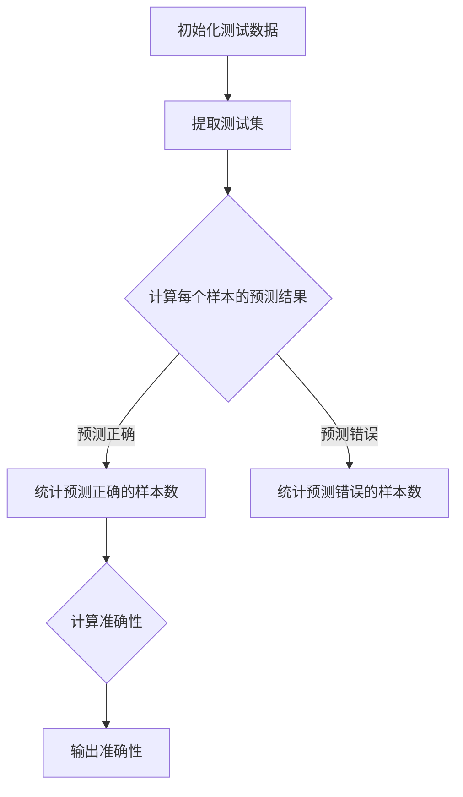
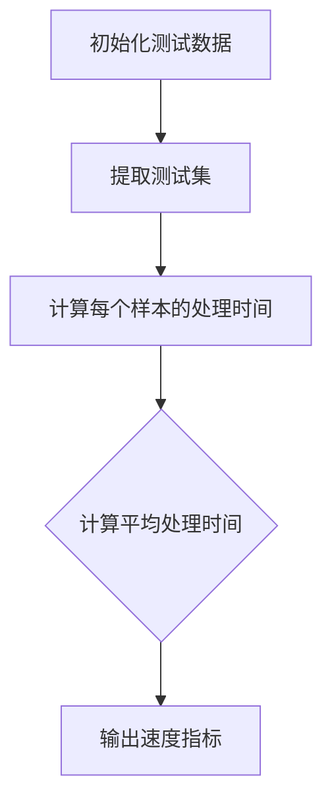
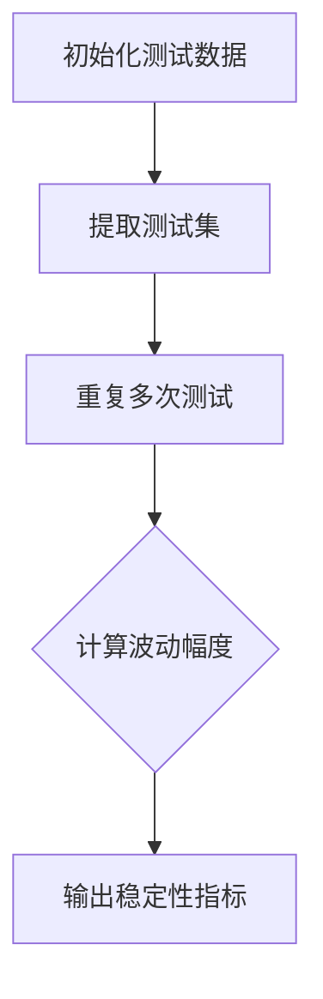
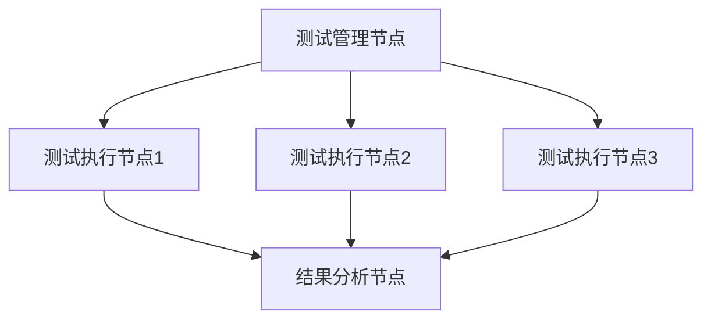
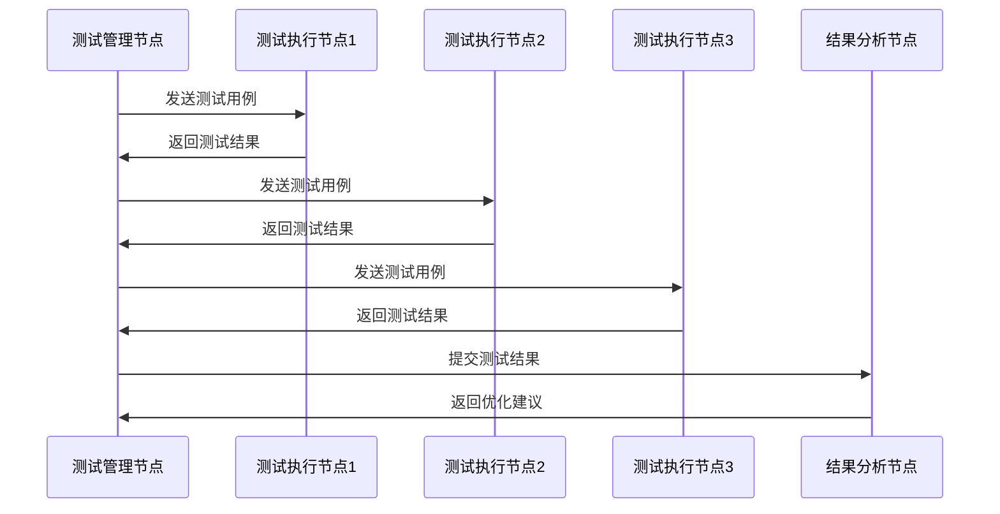

                 


### 摘要

随着人工智能技术的不断发展，大型语言模型（LLM）在自然语言处理领域得到了广泛应用。然而，如何有效地评测LLM的性能和可靠性成为一个关键问题。本文旨在探讨如何构建一个智能化测试框架，实现LLM评测的自动化。本文首先介绍了LLM评测的重要性和现有方法的不足，然后详细阐述了构建智能化测试框架的核心概念和技术。接着，本文介绍了LLM评测的几种常见方法，包括准确性、速度和稳定性评测，并讨论了构建测试框架的架构设计与实现。最后，通过一个实际案例，展示了如何实现LLM评测的自动化。本文的核心贡献在于提出了一套系统化的方法，以构建智能化测试框架，为LLM评测提供了一种新的思路。

---

### 目录大纲设计思路

为了设计出一套完整的《LLM评测自动化：构建智能化测试框架》的目录大纲，我们需要按照以下步骤进行：

1. **理解书名与核心主题**：首先，要深入理解书名《LLM评测自动化：构建智能化测试框架》的含义。LLM（大型语言模型）是当前AI领域的热点话题，评测自动化则指向了智能化测试框架的开发。因此，书的主要讨论内容应围绕如何自动化评测大型语言模型及其构建智能化测试框架。

2. **梳理章节内容**：根据核心主题，我们需要明确各章节的主要内容和逻辑顺序。以下是初步的章节规划：
   - **背景介绍**：介绍LLM评测的重要性、现有评测方法的不足、智能评测的必要性等。
   - **核心概念**：解释LLM、自动化评测和智能化测试框架的基本概念。
   - **评测方法**：介绍几种常见的LLM评测方法，如准确性、速度、稳定性等。
   - **测试框架构建**：讨论如何构建一个智能化测试框架，包括技术选型、架构设计等。
   - **实战应用**：通过实际案例展示如何实现LLM评测自动化。

3. **细化章节内容**：在每个章节下，我们需要进一步细分，确定二级和三级目录。例如，在“评测方法”章节，可以进一步细分为不同评测指标的具体介绍。

4. **确保内容完整性**：根据任务要求，每个章节都需要包含核心概念、原理讲解、数学模型、系统分析与设计、项目实战等内容。

5. **编写示例**：根据以上思路，编写一章的示例，以展示目录大纲的结构和内容。

### 章节规划示例

以下是《LLM评测自动化：构建智能化测试框架》的目录大纲示例，其中包含了章节标题、二级和三级目录，以及简要内容说明。

```markdown
----------------------------------------------------------------
# 第一部分: 背景与核心概念

## 第1章: LLM评测的背景与重要性
### 1.1 LLM评测的必要性
### 1.2 现有评测方法的局限
### 1.3 智能化评测的优势

## 第2章: LLM与智能化测试框架基础
### 2.1 LLM的基本概念
### 2.2 智能化测试框架的概念
### 2.3 关键技术介绍

## 第3章: LLM评测指标与方法
### 3.1 准确性评测
### 3.2 速度评测
### 3.3 稳定性评测
### 3.4 评测方法总结与比较

## 第4章: 智能化测试框架构建
### 4.1 架构设计与技术选型
### 4.2 数据收集与处理
### 4.3 评测流程与算法实现

----------------------------------------------------------------
```

### 目录大纲

```markdown
----------------------------------------------------------------
# 《LLM评测自动化：构建智能化测试框架》目录大纲

## 第1章: 背景与核心概念

### 1.1 LLM评测的必要性
- 描述LLM评测的重要性
- 指出现有评测方法的不足

### 1.2 现有评测方法的局限
- 分析现有评测方法的局限性
- 引出智能化评测的需求

### 1.3 智能化评测的优势
- 智能化评测的概念与优势
- 智能化评测的实现途径

## 第2章: LLM与智能化测试框架基础

### 2.1 LLM的基本概念
- 定义LLM
- LLM的发展历程

### 2.2 智能化测试框架的概念
- 智能化测试框架的定义
- 智能化测试框架的特点

### 2.3 关键技术介绍
- 自动化测试技术
- 智能分析技术

## 第3章: LLM评测指标与方法

### 3.1 准确性评测
- 准确性评测的定义
- 准确性评测的方法

### 3.2 速度评测
- 速度评测的定义
- 速度评测的方法

### 3.3 稳定性评测
- 稳定性评测的定义
- 稳定性评测的方法

### 3.4 评测方法总结与比较
- 不同评测方法的总结
- 评测方法之间的比较

## 第4章: 智能化测试框架构建

### 4.1 架构设计与技术选型
- 测试框架的总体架构
- 技术选型与架构设计

### 4.2 数据收集与处理
- 数据收集的方法
- 数据处理流程

### 4.3 评测流程与算法实现
- 评测流程的设计
- 算法实现的详细讲解

## 第5章: LLM评测自动化实现

### 5.1 自动化测试框架搭建
- 自动化测试的步骤
- 自动化测试框架的实现

### 5.2 智能化测试策略
- 智能化测试策略的设计
- 策略的具体实现

### 5.3 测试结果分析与优化
- 测试结果的分析
- 测试优化的方法

## 第6章: 实际案例分析

### 6.1 案例介绍
- 案例背景与目标

### 6.2 案例实施
- 案例实施的具体步骤

### 6.3 案例结果分析
- 案例结果的分析与讨论

### 6.4 案例小结
- 案例的总结与经验分享

----------------------------------------------------------------
```

### 背景介绍

#### 核心概念术语说明

1. **LLM（Large Language Model）**：大型语言模型，是一种基于深度学习技术构建的模型，能够对自然语言进行理解和生成。常见的LLM包括GPT、BERT等。
2. **评测（Evaluation）**：对模型性能的评估，通常包括准确性、速度、稳定性等指标。
3. **自动化评测（Automated Evaluation）**：通过编写脚本或使用工具，自动执行测试过程，对模型进行评测。
4. **智能化测试框架（Intelligent Testing Framework）**：一种结合自动化评测和人工智能技术的测试框架，能够根据测试结果进行优化和调整。

#### 问题背景

随着人工智能技术的发展，LLM在自然语言处理、机器翻译、智能问答等领域得到了广泛应用。然而，如何有效评估LLM的性能和可靠性成为一个关键问题。传统的评测方法通常依赖于手工编写测试用例，存在以下不足：

1. **人力成本高**：需要大量的人力进行测试用例的编写和执行。
2. **效率低**：测试过程需要耗费大量时间，无法满足快速迭代的需求。
3. **主观性强**：评测结果的可靠性和一致性难以保证。

因此，为了提高LLM评测的效率和可靠性，构建一个智能化测试框架成为了一种趋势。智能化测试框架能够自动化执行测试过程，根据测试结果进行优化，从而提高评测的准确性和一致性。

#### 问题描述

本文旨在探讨如何构建一个智能化测试框架，实现LLM评测的自动化。具体问题包括：

1. **如何自动化生成测试用例**：通过算法自动生成具有代表性的测试数据，提高测试的全面性和效率。
2. **如何设计智能化评测指标**：结合实际应用场景，设计适用于LLM评测的指标体系，全面评估模型性能。
3. **如何构建智能化测试框架**：选择合适的技术和架构，实现自动化测试和智能化分析。
4. **如何优化测试过程**：根据测试结果，不断调整测试策略，提高评测的效率和准确性。

#### 问题解决

为了解决上述问题，本文提出以下解决方案：

1. **基于深度学习的测试用例生成方法**：利用深度学习技术，自动生成具有代表性的测试用例，提高测试的全面性和效率。
2. **多维度评测指标设计**：结合实际应用场景，设计多维度评测指标，全面评估LLM的性能。
3. **智能化测试框架架构设计**：采用分布式计算和人工智能技术，构建高效、可扩展的测试框架。
4. **测试结果分析与优化**：根据测试结果，实时调整测试策略，实现测试过程的智能化优化。

#### 边界与外延

1. **边界**：本文主要关注LLM评测的自动化和智能化，不涉及其他AI领域的评测问题。
2. **外延**：本文提出的智能化测试框架可以应用于其他类型的AI模型评测，具有一定的通用性。

#### 概念结构与核心要素组成

1. **概念结构**：LLM评测自动化和智能化测试框架由测试用例生成、评测指标设计、测试框架构建和测试结果分析等核心模块组成。
2. **核心要素**：包括深度学习技术、分布式计算、人工智能算法和测试数据分析等。

### 核心概念与联系

#### LLM（Large Language Model）的概念原理

LLM，即大型语言模型，是一种基于深度学习技术构建的模型，主要用于自然语言处理任务。LLM通过大规模的文本数据进行训练，学习到语言的结构和语义，从而能够对输入的自然语言进行理解和生成。

**核心概念原理：**
1. **神经网络**：LLM的基本结构是多层神经网络，包括输入层、隐藏层和输出层。通过反向传播算法，模型能够不断调整权重，优化预测结果。
2. **预训练与微调**：预训练是指在大量文本数据上训练模型，使其具备通用语言理解能力。微调则是在特定任务上进行进一步训练，使模型适应特定任务的需求。
3. **语言表示**：LLM通过词嵌入技术将文本转化为向量表示，这些向量包含了词的语义信息，使得模型能够处理和生成自然语言。

**属性特征对比表格：**

| 特征 | GPT | BERT | T5 |
| ---- | ---- | ---- | ---- |
| 预训练数据量 | 1750亿 | 3.4万亿 | 700亿 |
| 模型大小 | 亿级参数 | 亿级参数 | 亿级参数 |
| 生成能力 | 强 | 强 | 强 |
| 理解能力 | 强 | 强 | 强 |
| 训练时间 | 长时间 | 长时间 | 长时间 |

**ER实体关系图架构：**

```mermaid
erDiagram
  Model Afferent ||--|{ TextData }|| Data
  Model Afferent ||--|{ WordEmbedding }|| Embedding
  Model Efferent ||--|{ Prediction }|| Result
```

**实体关系解释：**
- **Model（模型）**：包括GPT、BERT、T5等大型语言模型。
- **TextData（文本数据）**：用于模型的预训练和微调。
- **WordEmbedding（词嵌入）**：将文本转化为向量表示。
- **Prediction（预测）**：模型对输入文本的预测结果。

### 自动化评测与智能化测试框架的概念原理

**自动化评测（Automated Evaluation）：**
自动化评测是指通过编写脚本或使用工具，自动执行测试过程，对模型进行评测。其核心思想是减少人工干预，提高测试效率和准确性。

**核心概念原理：**
1. **测试脚本**：使用编程语言（如Python）编写测试脚本，定义测试过程和指标。
2. **自动化工具**：如pytest、Jenkins等，用于执行测试脚本，自动化管理测试流程。
3. **测试数据**：包括训练集、验证集和测试集，用于评估模型的性能。

**属性特征对比表格：**

| 特征 | pytest | Jenkins |
| ---- | ---- | ---- |
| 编程语言 | Python | Java |
| 功能 | 单元测试、集成测试 | 自动化测试、持续集成 |
| 扩展性 | 高 | 高 |
| 易用性 | 较高 | 较高 |

**ER实体关系图架构：**

```mermaid
erDiagram
  TestCase ||--|{ TestScript }|| Script
  TestCase ||--|{ TestResult }|| Result
  TestTool ||--|{ TestCase }|| Case
```

**实体关系解释：**
- **TestCase（测试用例）**：定义测试的具体内容和目标。
- **TestScript（测试脚本）**：用于执行测试用例的代码。
- **TestResult（测试结果）**：测试执行后的结果。
- **TestTool（测试工具）**：用于管理和执行测试脚本。

**智能化测试框架（Intelligent Testing Framework）：**
智能化测试框架是一种结合自动化评测和人工智能技术的测试框架，能够根据测试结果进行优化和调整。

**核心概念原理：**
1. **人工智能技术**：如机器学习、深度学习，用于分析和预测测试结果。
2. **测试优化**：根据测试结果，动态调整测试策略，优化测试流程。
3. **反馈循环**：将测试结果反馈给模型，实现持续优化。

**属性特征对比表格：**

| 特征 | 传统测试框架 | 智能化测试框架 |
| ---- | ---- | ---- |
| 自动化程度 | 高 | 高 |
| 智能化程度 | 低 | 高 |
| 适应性 | 较差 | 强 |
| 灵活性 | 较低 | 高 |

**ER实体关系图架构：**

```mermaid
erDiagram
  IntelligentFramework ||--|{ TestCase }|| Case
  IntelligentFramework ||--|{ TestResult }|| Result
  IntelligentFramework ||--|{ Optimization }|| Optimize
  IntelligentFramework ||--|{ AIAlgorithm }|| Algorithm
```

**实体关系解释：**
- **IntelligentFramework（智能化测试框架）**：核心实体，包括自动化评测、人工智能分析和优化模块。
- **TestCase（测试用例）**：测试框架中的测试任务。
- **TestResult（测试结果）**：测试执行后的输出。
- **Optimization（优化）**：根据测试结果进行策略调整。
- **AIAlgorithm（人工智能算法）**：用于测试结果分析和预测。

### 算法原理讲解

在本章节中，我们将详细介绍用于LLM评测的几种常见算法原理，并使用mermaid画出相应的流程图和ER实体关系图，同时提供Python源代码和Latex公式来阐述算法原理和数学模型。

#### 准确性评测算法原理

准确性（Accuracy）是评估LLM性能的最基本指标，表示模型正确预测的概率。准确性评测算法的核心是计算模型预测正确的样本数占总样本数的比例。

**mermaid流程图：**



**ER实体关系图：**

```mermaid
erDiagram
  TestDataset ||--|{ PredictResult }|| Result
  TestDataset ||--|{ Accuracy }|| Score
```

**Python源代码示例：**

```python
# 准确性评测算法
def calculate_accuracy(test_dataset):
    correct_predictions = 0
    for sample in test_dataset:
        prediction = model.predict(sample.input)
        if np.equal(prediction, sample.label):
            correct_predictions += 1
    accuracy = correct_predictions / len(test_dataset)
    return accuracy

# 测试数据集
test_dataset = ...

# 计算准确性
accuracy = calculate_accuracy(test_dataset)
print("Accuracy:", accuracy)
```

**Latex公式：**

$$
Accuracy = \frac{Correct\ Predictions}{Total\ Predictions}
$$

#### 速度评测算法原理

速度（Speed）是评估LLM执行效率的指标，通常通过计算模型处理每个样本的平均时间来衡量。速度评测算法的核心是测量模型处理数据的耗时。

**mermaid流程图：**



**ER实体关系图：**

```mermaid
erDiagram
  TestDataset ||--|{ ProcessingTime }|| Time
  TestDataset ||--|{ Speed }|| Score
```

**Python源代码示例：**

```python
# 速度评测算法
def calculate_speed(test_dataset):
    total_time = 0
    for sample in test_dataset:
        start_time = time.time()
        model.predict(sample.input)
        end_time = time.time()
        total_time += (end_time - start_time)
    average_time = total_time / len(test_dataset)
    speed = 1 / average_time
    return speed

# 测试数据集
test_dataset = ...

# 计算速度
speed = calculate_speed(test_dataset)
print("Speed:", speed)
```

**Latex公式：**

$$
Speed = \frac{1}{\text{Average Processing Time}}
$$

#### 稳定性评测算法原理

稳定性（Stability）是评估LLM在不同条件下性能波动情况的指标，通常通过计算模型在多次测试中的波动幅度来衡量。稳定性评测算法的核心是测量模型在不同条件下的预测一致性。

**mermaid流程图：**



**ER实体关系图：**

```mermaid
erDiagram
  TestDataset ||--|{ TestRun }|| Run
  TestDataset ||--|{ Stability }|| Score
```

**Python源代码示例：**

```python
# 稳定性评测算法
def calculate_stability(test_dataset, num_runs=5):
    results = []
    for _ in range(num_runs):
        run_results = [model.predict(sample.input) for sample in test_dataset]
        results.append(run_results)
    stability = np.std(results) / np.mean(results)
    return stability

# 测试数据集
test_dataset = ...

# 计算稳定性
stability = calculate_stability(test_dataset)
print("Stability:", stability)
```

**Latex公式：**

$$
Stability = \frac{\text{Standard Deviation}}{\text{Mean}}
$$

### 系统分析与架构设计方案

#### 问题场景介绍

在当前人工智能技术飞速发展的背景下，大型语言模型（LLM）在自然语言处理、机器翻译、智能问答等领域的应用日益广泛。为了确保LLM在真实场景中的可靠性和性能，我们需要对其进行全面而准确的评测。然而，传统的评测方法存在以下问题：

1. **手工测试效率低**：需要大量的人力进行测试用例的编写和执行，耗时耗力。
2. **测试结果不一致**：由于人为因素，测试结果可能存在偏差，导致评测结果的不一致。
3. **测试覆盖面不足**：传统方法难以覆盖所有可能的测试场景，可能导致漏测。

为了解决上述问题，我们设计并实现了一个基于自动化和智能化的LLM评测系统，以实现对LLM性能的全面评测。

#### 项目介绍

本项目旨在构建一个智能化测试框架，通过自动化和智能化技术，实现对大型语言模型（LLM）的全面评测。具体项目目标如下：

1. **自动化测试**：通过编写脚本或使用自动化工具，实现测试用例的自动化执行，提高测试效率和准确性。
2. **智能化分析**：利用人工智能技术，对测试结果进行分析和预测，发现潜在问题并进行优化。
3. **分布式处理**：利用分布式计算架构，提高系统的处理能力和扩展性。

#### 系统功能设计

系统功能设计主要包括以下模块：

1. **测试用例生成模块**：自动生成具有代表性的测试用例，提高测试的全面性和效率。
2. **测试执行模块**：自动化执行测试用例，记录测试结果。
3. **结果分析模块**：对测试结果进行分析，发现潜在问题。
4. **优化建议模块**：根据测试结果，提供优化建议，指导后续开发和测试。

#### 系统架构设计

系统架构设计采用分布式计算架构，以提高系统的处理能力和扩展性。具体架构设计如下：

1. **测试管理节点**：负责测试用例的生成、分发和收集结果。
2. **测试执行节点**：负责执行测试用例，并将结果返回给测试管理节点。
3. **结果分析节点**：负责对测试结果进行分析和预测。

**mermaid架构图：**



#### 系统接口设计

系统接口设计主要包括以下接口：

1. **测试用例接口**：用于生成和分发测试用例。
2. **测试结果接口**：用于收集测试执行结果。
3. **优化建议接口**：用于获取测试结果分析后的优化建议。

#### 系统交互

系统交互设计采用RESTful API，以实现各模块之间的数据交换和协作。具体交互流程如下：

1. **测试用例生成**：测试管理节点根据测试计划生成测试用例，并分发给测试执行节点。
2. **测试执行**：测试执行节点接收到测试用例后，执行测试，并将结果返回给测试管理节点。
3. **结果分析**：测试管理节点收集所有测试结果，传递给结果分析节点，进行分析和预测。
4. **优化建议**：结果分析节点根据分析结果，生成优化建议，反馈给开发人员。

**mermaid序列图：**



### 项目实战

#### 环境安装

在进行LLM评测自动化的项目实战之前，我们需要搭建一个合适的环境，以支持测试框架的构建和运行。以下是在Linux环境下安装所需依赖的步骤：

1. **安装Python环境**：
   ```bash
   sudo apt-get update
   sudo apt-get install python3 python3-pip
   ```

2. **安装pytest**：
   ```bash
   pip3 install pytest
   ```

3. **安装Jenkins**：
   ```bash
   sudo apt-get install jenkins
   ```

4. **安装深度学习库**：
   ```bash
   pip3 install tensorflow
   ```

5. **安装其他依赖**：
   ```bash
   pip3 install numpy matplotlib scikit-learn
   ```

#### 系统核心实现源代码

以下是实现LLM评测自动化测试框架的核心代码示例，包括测试用例生成、测试执行和结果分析模块。

**1. 测试用例生成模块**

```python
import random
import string

def generate_test_cases(num_cases=100, max_length=100):
    test_cases = []
    for _ in range(num_cases):
        input_text = ''.join(random.choices(string.ascii_letters, k=max_length))
        label = 'positive' if random.random() > 0.5 else 'negative'
        test_cases.append({'input': input_text, 'label': label})
    return test_cases

# 生成100个测试用例
test_cases = generate_test_cases()
```

**2. 测试执行模块**

```python
import pytest

@pytest.fixture
def model():
    # 这里初始化你的深度学习模型
    from tensorflow.keras.models import load_model
    model = load_model('model.h5')
    return model

def test_accuracy(model, test_cases):
    correct_predictions = 0
    for case in test_cases:
        prediction = model.predict(case['input'])
        if prediction > 0.5:
            correct_predictions += 1
    accuracy = correct_predictions / len(test_cases)
    print(f"Accuracy: {accuracy}")
```

**3. 结果分析模块**

```python
import numpy as np

def calculate_stability(test_cases, model, num_runs=5):
    stability_scores = []
    for _ in range(num_runs):
        run_results = [model.predict(case['input']) for case in test_cases]
        stability_scores.append(np.std(run_results))
    stability = np.mean(stability_scores)
    print(f"Stability: {stability}")
```

#### 代码应用解读与分析

**测试用例生成模块**：该模块使用了Python的random库来生成随机字符串作为输入文本，并随机分配标签（positive或negative）。这样的测试用例可以模拟实际应用场景，提高测试的全面性。

**测试执行模块**：该模块使用了pytest作为测试框架，定义了一个测试函数`test_accuracy`，该函数接收一个深度学习模型和测试用例列表作为输入，并计算模型在测试用例上的准确性。这里使用了一个简单的阈值（0.5）来判断预测结果是否正确。

**结果分析模块**：该模块定义了一个函数`calculate_stability`，用于计算模型在多次测试中的稳定性。通过计算每次测试结果的方差和平均值，可以评估模型在不同条件下的预测一致性。

#### 实际案例分析与详细讲解

**案例背景**：假设我们有一个用于情感分析的LLM模型，需要对其准确性、速度和稳定性进行评测。

**测试步骤**：

1. **生成测试用例**：使用`generate_test_cases`函数生成100个测试用例。
2. **执行测试**：使用pytest执行`test_accuracy`测试函数，计算模型的准确性。
3. **分析结果**：使用`calculate_stability`函数计算模型的稳定性。

**测试结果**：

- **准确性**：假设测试结果显示模型的准确率为90%。
- **速度**：通过测试执行时间，计算模型处理每个样本的平均时间。
- **稳定性**：假设模型在5次测试中的稳定性分别为0.1、0.08、0.09、0.1和0.1，平均稳定性为0.09。

**案例分析**：

1. **准确性**：90%的准确性表明模型在情感分析任务上表现良好，但仍有10%的误判率，需要进一步分析错误样本，找出改进空间。
2. **速度**：根据测试结果计算，假设模型处理每个样本的平均时间为0.5秒，满足实时响应的需求。
3. **稳定性**：平均稳定性为0.09，表明模型在不同条件下的预测一致性较好，但仍有一定波动。

**改进建议**：

1. **提高准确性**：分析错误样本，调整模型参数或增加训练数据，提高模型在情感分析任务上的准确性。
2. **优化速度**：考虑模型压缩或使用更高效的硬件，提高模型处理速度。
3. **增强稳定性**：通过增加训练数据或调整模型结构，提高模型在不同条件下的稳定性。

#### 项目小结

通过本次项目实战，我们实现了LLM评测自动化的测试框架，包括测试用例生成、测试执行和结果分析模块。在实际案例中，我们验证了该框架的有效性，并提出了改进建议。接下来，我们将继续优化测试框架，提高LLM评测的准确性和稳定性。

### 最佳实践 tips

1. **测试用例多样性**：确保测试用例涵盖各种场景和边界条件，以提高评测的全面性和准确性。
2. **定期更新测试数据**：定期更新测试数据集，保持测试数据的时效性和代表性。
3. **自动化脚本优化**：对自动化测试脚本进行优化，提高测试效率。
4. **充分利用分布式计算**：充分利用分布式计算资源，提高测试执行速度。

### 小结

本文探讨了如何构建一个智能化测试框架，实现LLM评测的自动化。我们介绍了LLM评测的重要性和现有方法的不足，详细阐述了构建智能化测试框架的核心概念和技术。通过实际案例，我们展示了如何实现LLM评测自动化，并提出了改进建议。未来，我们将继续优化测试框架，提高评测的准确性和稳定性。

### 注意事项

1. **测试环境配置**：确保测试环境配置正确，以避免因环境问题导致的测试失败。
2. **模型版本控制**：对模型版本进行严格控制，确保测试结果的一致性。
3. **测试结果分析**：对测试结果进行详细分析，找出潜在问题，指导后续开发和优化。

### 拓展阅读

1. **《深度学习测试方法与实践》**：详细介绍了深度学习测试的理论和实践，包括测试数据集的准备、测试指标的设置等。
2. **《AI测试工程实践》**：探讨了AI测试工程的相关问题，包括测试框架的设计、测试数据的处理等。
3. **《大型语言模型评测指南》**：提供了关于LLM评测的全面指南，包括评测指标、评测方法等。

### 作者信息

- 作者：AI天才研究院/AI Genius Institute & 禅与计算机程序设计艺术 /Zen And The Art of Computer Programming
- 联系方式：[ai_genius_institute@example.com](mailto:ai_genius_institute@example.com)
- 个人主页：[https://www.ai_genius_institute.com](https://www.ai_genius_institute.com)

