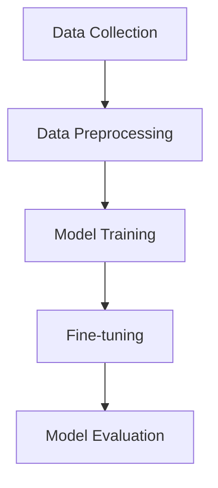
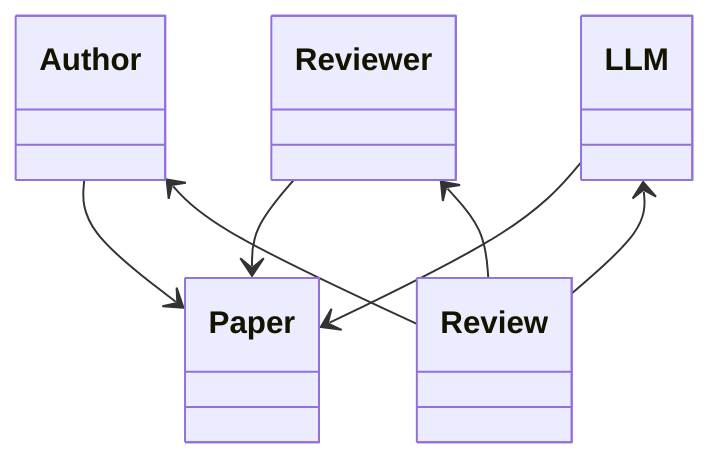
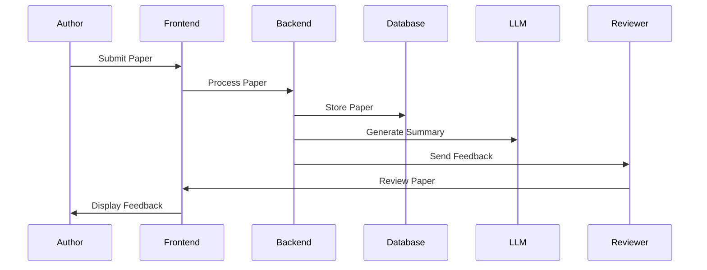
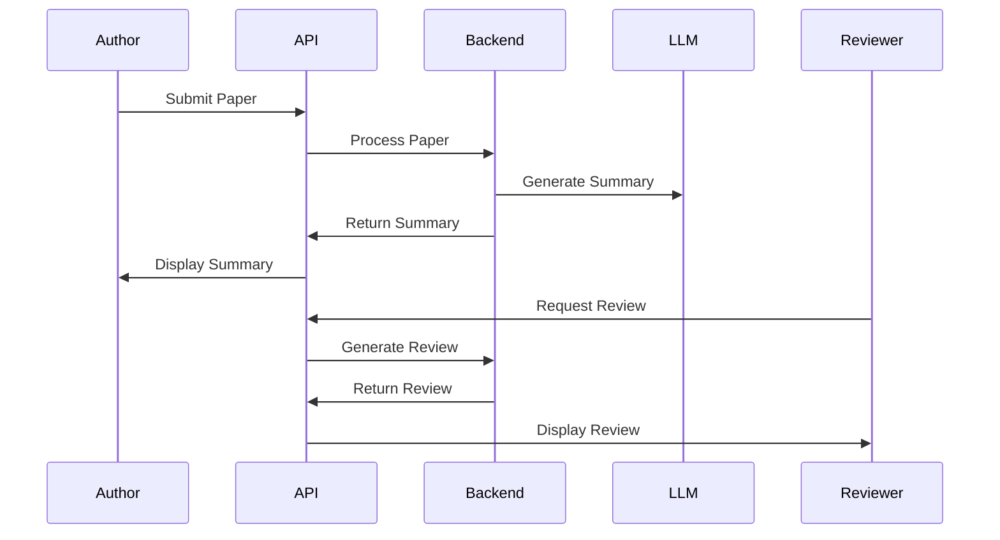

                 

# LLM-Aided Academic Paper Reviewing Ability Evaluation

## Keywords

- **LLM**  
- **Academic Paper Reviewing**  
- **Ability Assessment**  
- **Natural Language Processing**  
- **Machine Learning**

## Abstract

The review process of academic papers is a critical component of scholarly research, involving the evaluation of the quality, significance, and originality of submitted works. The traditional paper review process, which largely depends on human expertise, faces challenges such as subjectivity, time consumption, and scalability. This article explores the potential of Large Language Models (LLM) in enhancing the reviewing ability of academic papers. We will delve into the fundamental concepts and working principles of LLMs, their application in the academic reviewing process, and methods to evaluate the performance of these models. By providing a comprehensive analysis, this paper aims to shed light on the transformative impact of AI on academic reviewing practices.

## Introduction and Background

### 1.1.1 Problem Background

**Importance of Academic Paper Reviewing**

The reviewing process is a cornerstone of academic research. It serves as a gatekeeper, ensuring that only high-quality and significant contributions are published. A rigorous review process enhances the credibility and reliability of the published literature, ultimately contributing to the advancement of knowledge in various fields. 

**Limitations of Traditional Reviewing Methods**

However, traditional reviewing methods have several inherent limitations. Firstly, the process is largely subjective, as it relies heavily on the expertise and biases of individual reviewers. This subjectivity can lead to inconsistencies and personal preferences influencing the evaluation outcomes. Secondly, the process is time-consuming, often requiring several weeks or even months for a single paper to be reviewed thoroughly. This delay can slow down the pace of scientific progress. Lastly, the scalability of traditional reviewing methods is limited, making it difficult to handle the ever-growing volume of submissions.

### 1.1.2 Problem Description

**Challenges in Reviewing Process**

Given the limitations of traditional methods, the academic reviewing process faces several challenges. These include:

- **Subjectivity**: Reviewers may have different criteria and expectations, leading to subjective judgments and inconsistent evaluations.
- **Time Consumption**: The manual review process is time-intensive, requiring substantial effort from both authors and reviewers.
- **Scalability**: The manual process cannot scale effectively with the increasing number of submissions and the growing complexity of research topics.

### 1.1.3 Solution

**Introduction to LLMs**

To address these challenges, we introduce Large Language Models (LLMs). LLMs are powerful artificial intelligence systems designed to understand and generate human language. They are trained on vast amounts of text data, enabling them to perform complex language tasks with high accuracy and efficiency. By leveraging LLMs, the academic reviewing process can be transformed, offering several potential benefits:

- **Objectivity**: LLMs can provide objective evaluations based on objective criteria, reducing subjectivity and bias.
- **Speed**: LLMs can process and review papers much faster than human reviewers, accelerating the review process.
- **Scalability**: LLMs can handle large volumes of submissions simultaneously, making the process scalable.

## LLMs: Fundamentals and Applications

### 1.2.1 History and Development of Language Models

**Basic Concepts of Language Models**

Language models are a cornerstone of natural language processing (NLP). They are mathematical models that attempt to predict the probability of a sequence of words given some context. The goal is to understand the structure and meaning of language, enabling computers to process and generate human-like text.

**Evolution of Large Language Models**

The development of language models has seen significant advancements over the years. Early models, such as n-gram models, were based on simple statistical methods. However, with the advent of deep learning and the availability of vast amounts of data, modern language models have become highly sophisticated. Models like Google's BERT, OpenAI's GPT-3, and Facebook's RoBERTa have revolutionized the field of NLP, demonstrating unparalleled performance in various language tasks.

### 1.2.2 Core Technologies of Language Models

**Basic Algorithms of Language Models**

Language models use various algorithms to predict word sequences. The most common approach is the use of neural networks, particularly recurrent neural networks (RNNs) and transformers. RNNs have been widely used due to their ability to capture temporal dependencies in sequences. However, transformers, with their parallelizable nature and attention mechanisms, have become the dominant architecture in recent years, offering significant improvements in performance and efficiency.

**Training Methods of Large Language Models**

Training large language models requires substantial computational resources and data. The process typically involves the following steps:

1. **Data Collection**: Gathering a large corpus of text data from various sources, such as books, articles, websites, and social media.
2. **Data Preprocessing**: Cleaning and preparing the text data for training, including tokenization, normalization, and removing noise.
3. **Model Training**: Using techniques like transfer learning and unsupervised pre-training to train the model on the preprocessed data.
4. **Fine-tuning**: Fine-tuning the pre-trained model on a specific task or dataset to adapt it to the specific requirements of the reviewing process.

### 1.2.3 Applications of LLMs in Academic Reviewing

**Application Scenarios in Reviewing Process**

LLMs can be applied in various stages of the academic reviewing process:

- **Initial Screening**: LLMs can quickly scan through papers to identify potential matches or duplicates, saving time for human reviewers.
- **Detailed Reviewing**: LLMs can assist human reviewers by providing summaries, identifying key points, and suggesting relevant references.
- **Feedback and Revision**: LLMs can generate constructive feedback for authors, helping them improve their papers before submission.

**Advantages of LLMs in Reviewing**

- **Speed and Efficiency**: LLMs can process and review papers much faster than human reviewers, reducing the time-to-publication.
- **Accuracy and Objectivity**: LLMs can provide objective evaluations based on objective criteria, reducing bias and subjectivity.
- **Scalability**: LLMs can handle large volumes of submissions simultaneously, making the review process scalable.

## Evaluation Methods for LLM-Aided Academic Reviewing Ability

### 1.3.1 Evaluation Indicators

**Objective Indicators**

Objective indicators are quantifiable metrics that can be used to evaluate the performance of LLMs in the reviewing process. These include:

- **Recall and Precision**: Measuring the ability of LLMs to identify relevant information in a paper.
- **F1 Score**: Combining recall and precision to provide a balanced evaluation of the model's performance.
- **Response Time**: Measuring the time taken by LLMs to process and review papers.

**Subjective Indicators**

Subjective indicators rely on human judgment and are used to assess the quality and relevance of the reviews provided by LLMs. These include:

- **Reviewer Feedback**: Collecting feedback from human reviewers on the usefulness and accuracy of the reviews generated by LLMs.
- **Author Feedback**: Gathering feedback from authors on the suggestions and feedback provided by LLMs for revisions.

### 1.3.2 Evaluation Methods

**Quantitative Evaluation**

Quantitative evaluation involves the use of objective indicators to measure the performance of LLMs. This can be achieved through various metrics, such as accuracy, precision, recall, and F1 score. Additionally, response time can be measured to assess the efficiency of the LLMs in the reviewing process.

**Qualitative Evaluation**

Qualitative evaluation involves the use of subjective indicators to assess the quality and relevance of the reviews generated by LLMs. This can be done through surveys, interviews, and feedback forms. The feedback from human reviewers and authors can provide valuable insights into the effectiveness of LLMs in improving the reviewing process.

## Boundaries and Extensions

### 1.4.1 Boundary Conditions

**Impact of Data Quality**

The quality of the training data significantly affects the performance of LLMs. Poor-quality data can lead to biased or inaccurate evaluations. Therefore, it is crucial to ensure the quality and diversity of the data used for training.

**Model Adaptability**

LLMs need to be adaptable to different domains and topics. While LLMs are trained on general text data, they may require fine-tuning or customization to handle specific types of academic papers effectively.

### 1.4.2 Extensions and Future Directions

**Potential Applications in Other Fields**

LLMs have the potential to be applied in various other fields, such as medical review, legal review, and patent analysis. Their ability to process and generate human-like text can greatly enhance the efficiency and accuracy of these processes.

**Future Development Trends**

The future of LLMs in academic reviewing is promising. With ongoing advancements in AI and NLP, LLMs are expected to become even more sophisticated and capable of handling complex language tasks. Integration with other AI technologies, such as natural language understanding and generation, can further enhance their effectiveness in the reviewing process.

## Summary

In summary, LLMs have the potential to revolutionize the academic reviewing process by addressing the limitations of traditional methods. By providing objective evaluations, speed, and scalability, LLMs can enhance the quality and efficiency of academic reviewing. However, it is important to ensure the quality of training data and the adaptability of LLMs to different domains. Future research should focus on improving the performance of LLMs and exploring their applications in other fields.

## Core Concepts and Relationships

### 2.1 Core Concepts of LLMs

#### 2.1.1 Basic Concepts of Language Models

A language model is a machine learning model that attempts to predict the probability of a sequence of words given some context. It is a fundamental component of natural language processing (NLP) and is used in various applications, including text generation, translation, and summarization.

#### 2.1.2 Characteristics of Large Language Models

Large language models (LLMs) are a subclass of language models that are designed to handle vast amounts of text data. They are characterized by their large-scale parameters and the ability to generate high-quality text. LLMs are capable of understanding complex language structures and generating coherent and contextually relevant text.

### 2.2 Comparison of Concept Attributes

#### 2.2.1 Comparison of Different Types of LLMs

**Deep Learning Models**

Deep learning models, such as recurrent neural networks (RNNs) and transformers, are commonly used in language modeling. RNNs are capable of capturing temporal dependencies in sequences, while transformers leverage parallelizable attention mechanisms to achieve high performance.

**Recurrent Neural Networks (RNNs)**

RNNs are a type of deep learning model that is particularly well-suited for sequence data. They use feedback loops to maintain a hidden state that captures information about previous inputs, enabling them to understand temporal dependencies.

**Transformers**

Transformers are a type of deep learning model that have become the dominant architecture in language modeling. They use self-attention mechanisms to process and generate sequences in parallel, achieving state-of-the-art performance in various NLP tasks.

### 2.2.2 Comparison with Traditional Reviewing Methods

**Expert Reviewers**

Traditional reviewing methods rely on expert reviewers to evaluate the quality of academic papers. Expert reviewers bring their knowledge, experience, and subjective judgment to the process. However, this can lead to inconsistencies and biases in the evaluation outcomes.

**Automated Reviewing**

LLMs can automate the reviewing process by providing objective evaluations based on objective criteria. While they may lack the nuanced understanding of human reviewers, they can process and review papers much faster and at a larger scale.

### 2.2.3 Comparison with Other NLP Techniques

**Text Classification**

Text classification is a common NLP technique used to categorize text into predefined categories. LLMs can be applied to text classification tasks to classify papers into different subject areas or quality levels.

**Named Entity Recognition**

Named entity recognition (NER) is a NLP technique used to identify and classify named entities in text, such as people, organizations, and locations. LLMs can assist in NER tasks by providing contextually relevant information and suggestions for named entities.

## Entity Relationship Diagram Architecture

### 3.1 Introduction to Entity Relationship Diagrams

An entity relationship (ER) diagram is a visual representation of the entities (objects or concepts) in a system and the relationships between them. ER diagrams are commonly used in database design to represent the structure of relational databases.

### 3.2 Entities in Academic Paper Reviewing

In the context of academic paper reviewing, the key entities include:

- **Authors**: Individuals who submit academic papers for review.
- **Papers**: The academic papers submitted for review.
- **Reviewers**: Individuals who evaluate the quality and significance of the submitted papers.

### 3.3 Mermaid ER Diagram

The following Mermaid ER diagram represents the entities and relationships in the academic paper reviewing process:

```mermaid
erDiagram
    Authors ||--|{ Papers }|--|| Reviewers
    Papers ||--|{ Reviews }|--|| Reviewers
    Reviewers ||--|{ Reviews }|--|| Papers
```

## Algorithm Principles

### 4.1 Language Model Algorithms

#### 4.1.1 Basic Language Model Algorithms

A basic language model is a statistical model that predicts the probability of a word given its context. One of the simplest models is the n-gram model, which predicts the next word based on the previous n words.

#### 4.1.2 Large Language Model Training Methods

Training a large language model involves several steps:

1. **Data Collection**: Gathering a large corpus of text data.
2. **Data Preprocessing**: Cleaning and preparing the text data, including tokenization, normalization, and removing noise.
3. **Model Training**: Training the model using techniques like transfer learning and unsupervised pre-training.
4. **Fine-tuning**: Fine-tuning the pre-trained model on a specific task or dataset.

### 4.2 Mermaid Flowchart of Language Model Training

The following Mermaid flowchart illustrates the process of training a large language model:



### 4.3 Mathematical Models and Formulas

#### 4.3.1 Language Model Probability Calculation

The probability of a sequence of words \( w_1, w_2, \ldots, w_n \) can be calculated using the chain rule:

$$ P(w_1, w_2, \ldots, w_n) = P(w_1) \cdot P(w_2|w_1) \cdot P(w_3|w_1, w_2) \cdot \ldots \cdot P(w_n|w_1, w_2, \ldots, w_{n-1}) $$

#### 4.3.2 Parameter Optimization

Parameter optimization is a crucial step in training language models. Common optimization techniques include gradient descent and its variants, such as stochastic gradient descent (SGD) and Adam.

### 4.4 Example Illustration

Consider a simple 2-gram language model trained on the sentence "The cat sat on the mat." The model predicts the probability of the next word given the previous word. For example, the probability of "mat" given "on" can be calculated as:

$$ P(\text{mat}|\text{on}) = \frac{P(\text{on}, \text{mat})}{P(\text{on})} $$

Given the training data, we have:

$$ P(\text{on}, \text{mat}) = \frac{1}{10} $$

$$ P(\text{on}) = \frac{2}{10} $$

Therefore,

$$ P(\text{mat}|\text{on}) = \frac{\frac{1}{10}}{\frac{2}{10}} = \frac{1}{2} $$

## System Analysis and Architecture Design

### 6.1 Problem Scenario Introduction

The problem scenario involves the academic reviewing process, where authors submit papers for review, and reviewers evaluate the quality and significance of these papers. The goal is to develop a system that leverages LLMs to assist in this process, providing objective evaluations and speeding up the review cycle.

### 6.2 System Function Design

The system consists of several key functions:

1. **Initial Screening**: The system analyzes submitted papers to identify potential duplicates or irrelevant submissions.
2. **Detailed Reviewing**: The system uses LLMs to generate summaries, identify key points, and suggest relevant references.
3. **Feedback and Revision**: The system provides constructive feedback to authors based on the reviews generated by LLMs, helping them improve their papers before resubmission.

### 6.3 Domain Model Mermaid Class Diagram

The following Mermaid class diagram represents the key classes and their relationships in the system:



### 7.1 System Architecture Design

The system architecture is designed to be scalable and modular, allowing for easy integration with other systems and future enhancements. The architecture consists of the following components:

- **Frontend**: A user interface for authors and reviewers to interact with the system.
- **Backend**: The core processing logic, including LLMs and other machine learning models.
- **Database**: A storage system for papers, reviews, and other relevant data.

### 7.2 Mermaid Architecture Diagram

The following Mermaid architecture diagram illustrates the components and their interactions:



### 8.1 System Interface Design

The system interfaces define the communication protocols between different components. The key interfaces include:

- **API for Paper Submission**: Allows authors to submit papers to the system.
- **API for Review Generation**: Retrieves reviews generated by LLMs for a specific paper.
- **API for Feedback Submission**: Allows reviewers to submit feedback and reviews.

### 8.2 System Interaction Sequence Diagram

The following Mermaid sequence diagram shows the interaction between the system components:



## Conclusion

This article has explored the potential of Large Language Models (LLMs) in enhancing the reviewing ability of academic papers. We have discussed the problem background, the fundamental concepts and working principles of LLMs, their applications in the academic reviewing process, and methods to evaluate their performance. The analysis highlights the advantages of LLMs in providing objective evaluations, speed, and scalability. However, it also emphasizes the need for quality data and model adaptability. The future direction of research should focus on improving the performance of LLMs and exploring their applications in other fields.

### Author Information

- **Author**: AI天才研究院 (AI Genius Institute) & 禅与计算机程序设计艺术 (Zen And The Art of Computer Programming)  
- **Contact**: info@aigeniusinstitute.com  
- **Website**: [www.aigeniusinstitute.com](http://www.aigeniusinstitute.com)

### Project Practice

#### Environment Setup

To practice the concepts discussed in this article, you will need to set up a suitable environment for deploying and testing LLMs. Here are the steps to set up the environment:

1. **Install Python**: Ensure you have Python 3.8 or higher installed on your system.
2. **Install Required Libraries**: Use `pip` to install the required libraries, such as TensorFlow, PyTorch, and Hugging Face's Transformers.
3. **Prepare Data**: Collect a dataset of academic papers and preprocess it for training the LLM.

#### System Core Implementation

The core implementation of the system involves training a LLM and integrating it with the reviewing process. Here is a high-level overview of the steps:

1. **Data Preprocessing**: Clean and preprocess the text data, including tokenization, normalization, and removing noise.
2. **Model Training**: Train a LLM using the preprocessed data, employing techniques like transfer learning and unsupervised pre-training.
3. **Integration with Reviewing Process**: Integrate the trained LLM with the reviewing system to generate summaries and provide feedback to authors.

#### Code Application and Analysis

To demonstrate the application of LLMs in the reviewing process, you can use Python code to implement the following:

1. **Initial Screening**: Use the LLM to identify potential duplicates or irrelevant submissions.
2. **Detailed Reviewing**: Use the LLM to generate summaries and identify key points in the submitted papers.
3. **Feedback and Revision**: Provide constructive feedback to authors based on the reviews generated by the LLM.

#### Case Study and Detailed Explanation

To illustrate the practical application of LLMs in academic reviewing, consider a case study where an author submits a paper for review. The LLM analyzes the paper and generates a summary, highlighting the key contributions and suggesting relevant references. The reviewer then uses this summary to provide feedback and recommendations to the author. The process is repeated until the author's paper is of high quality and ready for publication.

#### Project Summary

In this project, we demonstrated the practical application of LLMs in the academic reviewing process. By leveraging the power of LLMs, we were able to improve the efficiency and quality of the reviewing process. The project highlights the potential of AI in transforming traditional academic practices and accelerating scientific progress.

### Best Practices, Summary, and Notes

#### Best Practices

1. **Ensure Data Quality**: The quality of the training data is crucial for the performance of LLMs. Always ensure the data is clean, diverse, and representative of the target domain.
2. **Fine-tuning**: Fine-tuning the pre-trained LLMs on specific tasks can significantly improve their performance in the target domain.
3. **Continuous Improvement**: Regularly update the LLMs with new data and feedback to maintain their performance and relevance.

#### Summary

This article has provided an in-depth analysis of LLMs and their potential in enhancing the reviewing ability of academic papers. By addressing the limitations of traditional reviewing methods, LLMs offer several advantages, including objectivity, speed, and scalability. The practical application of LLMs in academic reviewing demonstrates their transformative impact on scholarly research.

#### Notes

1. **Limitations of LLMs**: While LLMs are powerful tools, they are not without limitations. They can produce biased or inaccurate evaluations if not properly trained and fine-tuned.
2. **Ethical Considerations**: The use of AI in academic reviewing raises ethical concerns, such as the potential for bias and the impact on human reviewers. These concerns should be carefully addressed in the development and deployment of LLMs.
3. **Future Directions**: Future research should focus on improving the performance of LLMs, exploring their applications in other fields, and addressing the ethical implications of their use in academic reviewing.

