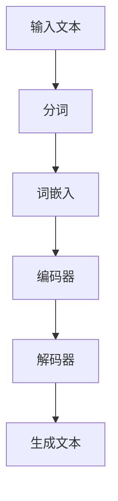
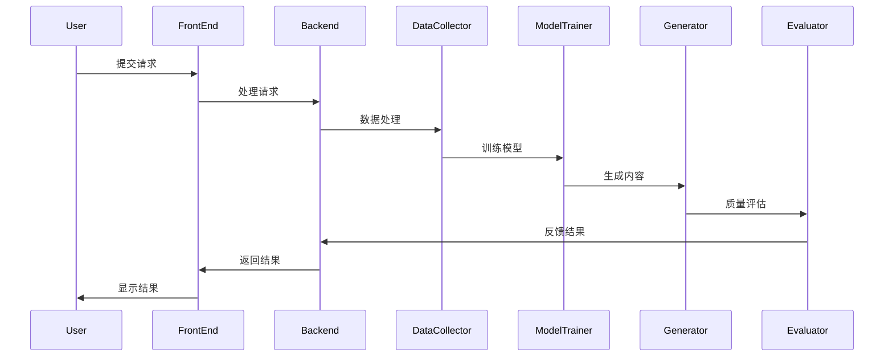

                 


# LLM辅助教育内容生成质量评估

> 关键词：大型语言模型，教育内容生成，质量评估，算法原理，系统设计

> 摘要：本文深入探讨了大型语言模型（LLM）在辅助教育内容生成质量评估中的应用。首先，我们介绍了教育内容生成的重要性和LLM的基本原理。接着，我们分析了LLM在教育内容生成中的应用优势，并探讨了其面临的挑战。随后，我们详细讲解了LLM的生成算法，包括数学模型和公式。在此基础上，我们提出了一个教育内容生成质量评估的系统架构设计方案，并进行了实际项目实战。最后，我们总结了最佳实践，并提出了注意事项和拓展阅读建议。

----------------------------------------------------------------

## 第一部分: LLM辅助教育内容生成的背景与核心概念

### 第1章: LLM辅助教育内容生成的现状与挑战

#### 1.1 教育内容生成的重要性

随着信息技术的飞速发展，教育领域也逐渐迈向数字化。教育内容生成作为教育信息化的重要环节，其重要性日益凸显。一方面，教育内容生成能够为学习者提供丰富的学习资源，提高教学效果；另一方面，它也能够为教育决策者提供有力的数据支持，优化教育资源分配。

#### 1.2 教育内容生成的关键问题

然而，教育内容生成面临着诸多挑战。首先，教育内容生成需要大量的专业知识和技能，这对内容创作者提出了较高的要求。其次，教育内容生成的质量直接影响学习者的学习效果，如何保证生成内容的质量成为一个亟待解决的问题。

#### 1.3 LLM在教育内容生成中的应用

为了解决上述问题，大型语言模型（LLM）作为一种强大的自然语言处理工具，开始在教育内容生成领域得到广泛应用。LLM能够自动生成高质量的教育内容，降低了内容创作者的门槛，同时也提高了内容生成的效率。

### 第2章: LLM辅助教育内容生成的核心概念与联系

#### 2.1 语言模型的基本原理

语言模型是自然语言处理的核心技术之一，它通过对大量文本数据的学习，能够预测下一个单词或句子的概率。LLM作为一种先进的语言模型，具有强大的生成能力和理解能力。

#### 2.2 教育内容的质量评价标准

教育内容的质量评价是一个复杂的问题，它涉及到内容的准确性、完整性、可读性等多个方面。为了客观评价教育内容的质量，我们需要制定一套科学的评价标准。

#### 2.3 LLM与教育内容质量评价的关系

LLM在教育内容生成中发挥着重要作用，但如何利用LLM对生成内容进行质量评价仍然是一个挑战。我们需要探索LLM与教育内容质量评价之间的关系，并设计相应的评价方法。

### 第3章: LLM辅助教育内容生成的算法原理讲解

#### 3.1 语言生成算法概述

语言生成算法是LLM的核心组成部分，它主要包括生成文本的算法和生成图像的算法。本节将详细介绍语言生成算法的基本原理。

#### 3.2 LLM的生成算法讲解

本节将重点讲解LLM的生成算法，包括其mermaid流程图、python源代码实现以及数学模型和公式。

#### 3.3 LLM生成算法的案例解析

通过具体案例，我们将分析LLM生成算法在实际应用中的效果，并探讨其优势和局限性。

----------------------------------------------------------------

## 第二部分: LLM辅助教育内容生成的算法原理讲解

### 第4章: 数学模型和数学公式 & 详细讲解 & 举例说明

#### 4.1 教育内容生成质量的数学模型

教育内容生成质量可以用多种数学模型来衡量，如信息熵、交叉熵等。本节将详细介绍这些数学模型，并给出具体的评估公式。

#### 4.2 数学模型与实际应用的结合

数学模型在实际应用中具有重要的指导意义。本节将结合实际案例，详细讲解数学模型在教育内容生成质量评估中的应用。

#### 4.3 案例分析：教育内容生成质量评估

为了更好地理解数学模型在教育内容生成质量评估中的应用，本节将分析一个具体案例，展示评估过程和结果。

----------------------------------------------------------------

## 第三部分: 系统分析与架构设计方案

### 第5章: 系统分析与架构设计方案

#### 5.1 教育内容生成质量评估系统的整体架构

本节将介绍教育内容生成质量评估系统的整体架构，包括系统功能设计、系统架构设计等。

#### 5.2 系统关键模块设计与实现

教育内容生成质量评估系统由多个关键模块组成，包括语言生成模块、质量评估模块等。本节将详细介绍这些模块的设计与实现。

#### 5.3 系统接口设计与交互流程

系统接口设计和交互流程是教育内容生成质量评估系统的重要组成部分。本节将使用mermaid图展示系统接口设计和交互流程。

----------------------------------------------------------------

## 第四部分: 项目实战

### 第6章: 项目实战

#### 6.1 环境安装与配置

在项目实战部分，我们将从环境安装与配置开始，为后续的系统实现和测试打下基础。

#### 6.2 系统核心实现源代码

本节将详细介绍系统核心实现源代码，包括语言生成模块和质量评估模块。

#### 6.3 代码应用解读与分析

为了更好地理解系统的工作原理，本节将对关键代码进行解读与分析。

#### 6.4 实际案例分析与讲解

通过实际案例，我们将展示系统在实际应用中的效果，并进行详细分析和讲解。

#### 6.5 项目小结

在项目小结部分，我们将总结项目经验，并提出改进和拓展方向。

----------------------------------------------------------------

## 第五部分: 最佳实践与拓展阅读

### 第7章: 最佳实践与拓展阅读

#### 7.1 LLM辅助教育内容生成质量评估的最佳实践

本节将分享LLM辅助教育内容生成质量评估的最佳实践，包括经验教训和技巧策略。

#### 7.2 注意事项与风险提示

为了确保项目顺利进行，本节将介绍可能遇到的问题和解决方案，以及风险识别与预防措施。

#### 7.3 拓展阅读与深入探讨

本节将推荐相关书籍和学术论文，供读者进一步学习和研究。

----------------------------------------------------------------

# 目录大纲概述

本文档旨在为《LLM辅助教育内容生成质量评估》这本书提供一个全面的框架，帮助读者系统地了解和学习LLM在辅助教育内容生成质量评估方面的应用。以下是书籍的目录结构：

## 第一部分: LLM辅助教育内容生成的背景与核心概念
- 第1章：LLM辅助教育内容生成的现状与挑战
  - 1.1 教育内容生成的重要性
  - 1.2 LLM在教育内容生成中的应用
  - 1.3 LLM辅助教育内容生成面临的挑战
- 第2章：LLM辅助教育内容生成的核心概念与联系
  - 2.1 语言模型的基本原理
  - 2.2 教育内容的质量评价标准
  - 2.3 LLM与教育内容质量评价的关系

## 第二部分: LLM辅助教育内容生成的算法原理讲解
- 第3章：LLM辅助教育内容生成的算法原理讲解
  - 3.1 语言生成算法概述
  - 3.2 LLM的生成算法讲解
  - 3.3 LLM生成算法的案例解析

## 第三部分: 数学模型和数学公式 & 详细讲解 & 举例说明
- 第4章：数学模型和数学公式 & 详细讲解 & 举例说明
  - 4.1 教育内容生成质量的数学模型
  - 4.2 数学模型与实际应用的结合
  - 4.3 案例分析：教育内容生成质量评估

## 第四部分: 系统分析与架构设计方案
- 第5章：系统分析与架构设计方案
  - 5.1 教育内容生成质量评估系统的整体架构
  - 5.2 系统关键模块设计与实现
  - 5.3 系统接口设计与交互流程

## 第五部分: 项目实战
- 第6章：项目实战
  - 6.1 环境安装与配置
  - 6.2 系统核心实现源代码
  - 6.3 代码应用解读与分析
  - 6.4 实际案例分析与讲解
  - 6.5 项目小结

## 第六部分: 最佳实践与拓展阅读
- 第7章：最佳实践与拓展阅读
  - 7.1 LLM辅助教育内容生成质量评估的最佳实践
  - 7.2 注意事项与风险提示
  - 7.3 拓展阅读与深入探讨

通过本文档的目录结构，读者可以系统地了解LLM辅助教育内容生成质量评估的核心概念、算法原理、系统设计、项目实战和最佳实践等内容，从而更好地掌握这一领域的知识。----------------------------------------------------------------

## 第1章: LLM辅助教育内容生成的现状与挑战

### 1.1 教育内容生成的重要性

教育内容生成在教育信息化过程中扮演着至关重要的角色。随着互联网和移动设备的普及，在线学习逐渐成为学习者的主要途径。而高质量的教育内容是提高在线学习效果的关键。教育内容生成不仅能够满足个性化学习的需求，还能够为教育机构提供丰富的教学资源，提升教学效果。

#### 教育内容生成的背景与趋势

在教育信息化的大背景下，教育内容生成呈现出以下几个趋势：

1. **数字化**: 教育内容逐渐从传统的纸质形式转向数字化形式，如电子书、在线课程、视频教程等。
2. **个性化**: 随着大数据和人工智能技术的发展，教育内容生成开始注重个性化，根据学习者的兴趣、能力、学习进度等个性化需求生成相应的内容。
3. **多样性**: 教育内容生成的范围越来越广泛，从基础教育到高等教育，从学科知识到兴趣爱好，内容形式多样化。

#### 教育内容生成的关键问题

尽管教育内容生成具有重要意义，但在实际操作中，教育内容生成面临以下几个关键问题：

1. **内容质量**: 如何保证生成内容的质量，确保其准确性、完整性、可读性和实用性。
2. **创作成本**: 教育内容创作需要专业知识和技能，创作成本较高，特别是在大规模生成时。
3. **个性化**: 如何根据不同学习者的需求生成个性化内容，提高学习体验。
4. **版权问题**: 在内容生成过程中，如何合理使用和保护版权成为一个重要问题。

### 1.2 LLM在教育内容生成中的应用

#### LLM的基本概念与原理

大型语言模型（LLM，Large Language Model）是一种基于深度学习的自然语言处理模型，能够对大量文本数据进行训练，从而生成高质量的自然语言文本。LLM的核心思想是通过学习大量文本数据，捕捉语言中的统计规律和语义信息，从而实现文本的生成和理解。

LLM的原理主要包括：

1. **词嵌入（Word Embedding）**: 将单词映射到高维向量空间，使得语义相似的词在向量空间中接近。
2. **循环神经网络（RNN）**: RNN能够处理序列数据，通过递归关系捕捉上下文信息。
3. **变换器网络（Transformer）**: Transformer通过自注意力机制（Self-Attention）捕捉全局依赖关系，是LLM的主要架构。

#### LLM在教育内容生成中的应用优势

LLM在教育内容生成中具有以下优势：

1. **高效生成**: LLM能够快速生成大量高质量的教育内容，降低内容创作成本。
2. **个性化内容**: 通过学习学习者的兴趣、学习历史等个性化信息，LLM能够生成符合个体需求的教育内容。
3. **多样性**: LLM能够生成各种形式的教育内容，如文本、音频、视频等，满足不同学习者的需求。
4. **跨学科整合**: LLM能够整合不同学科的知识，生成综合性教育内容，提高学习效果。

### 1.3 LLM辅助教育内容生成面临的挑战

尽管LLM在教育内容生成中具有诸多优势，但仍然面临一些挑战：

#### 数据质量与多样性

1. **数据质量**: 教育内容生成依赖于高质量的数据，但获取高质量的教育数据是一个挑战。
2. **数据多样性**: 不同学习者有不同的学习需求，生成内容需要涵盖广泛的主题和形式，这要求数据具有多样性。

#### 生成内容的质量评估

1. **评估标准**: 制定科学的教育内容质量评估标准是一个复杂的问题，需要综合考虑内容的准确性、完整性、可读性等多个维度。
2. **自动化评估**: 如何自动化地评估生成内容的质量，仍是一个研究热点。

#### 伦理和隐私问题

1. **伦理问题**: 生成内容可能涉及伦理问题，如偏见、歧视等。
2. **隐私问题**: 在生成内容时，如何保护学习者的隐私也是一个重要问题。

### 总结

教育内容生成在教育信息化中具有重要意义，而LLM的应用为教育内容生成带来了新的机遇和挑战。通过分析LLM在教育内容生成中的应用现状和面临的挑战，我们可以更好地理解和利用LLM，为教育内容生成提供有力支持。

## 第2章: LLM辅助教育内容生成的核心概念与联系

### 2.1 语言模型的基本原理

语言模型（Language Model，LM）是自然语言处理（Natural Language Processing，NLP）领域的基础技术之一，它通过对大量文本数据进行学习，预测自然语言中的下一个词或句子。语言模型的核心目的是为了生成自然流畅的文本，以及进行文本理解和生成任务。

#### 语言模型的定义与分类

语言模型可以分为以下几类：

1. **基于统计的模型**：这类模型通过统计文本中词出现的频率和上下文关系来预测下一个词。代表性的模型包括N-gram模型和隐马尔可夫模型（HMM）。
2. **基于规则的模型**：这类模型通过定义一系列语法规则来生成文本，例如上下文无关文法（CFG）。
3. **基于神经网络的模型**：这类模型通过神经网络结构来学习文本中的语义信息，代表性的模型包括循环神经网络（RNN）和变换器网络（Transformer）。

#### 语言模型的主要组成部分

语言模型通常由以下几个主要部分组成：

1. **词嵌入（Word Embedding）**：将词汇映射到高维向量空间，使得语义相似的词在向量空间中接近。常见的词嵌入方法包括Word2Vec、GloVe等。
2. **编码器（Encoder）**：编码器负责将输入的文本序列编码为固定长度的向量表示，以便模型理解和处理。
3. **解码器（Decoder）**：解码器根据编码器的输出，生成预测的文本序列。在生成任务中，解码器通常会使用贪心算法或sampling策略来生成文本。

### 2.2 教育内容的质量评价标准

教育内容的质量评价是确保教育内容有效性和实用性的关键步骤。质量评价涉及多个维度，包括内容的准确性、完整性、可读性、相关性、创新性等。

#### 教育内容质量评价的维度

1. **准确性**：教育内容是否准确无误，符合科学事实和教育标准。
2. **完整性**：教育内容是否全面覆盖了所需的知识点和学习目标。
3. **可读性**：教育内容的表述是否清晰易懂，语言是否简洁流畅。
4. **相关性**：教育内容是否与学习者的需求和课程目标相关联。
5. **创新性**：教育内容是否包含新颖的观点或方法，能否激发学习者的兴趣。
6. **实用性**：教育内容是否具有实际应用价值，能否帮助学习者解决问题。

#### 教育内容质量评价的方法

1. **主观评价**：通过专家评审、学习者反馈等方式进行评价。
2. **客观评价**：使用自动化的评价工具，如文本分析软件、评分系统等，对教育内容进行量化评价。
3. **综合评价**：结合主观和客观评价方法，形成一个全面的质量评价体系。

### 2.3 LLM与教育内容质量评价的关系

#### LLM在教育内容生成中的作用

LLM在教育内容生成中具有重要作用，主要体现在以下几个方面：

1. **内容生成**：LLM可以根据给定的主题和结构，自动生成教育内容，提高内容创作的效率。
2. **内容优化**：LLM可以通过分析和修改现有教育内容，提高其质量，使其更加符合教育标准。
3. **个性化推荐**：LLM可以根据学习者的兴趣和学习历史，推荐个性化的教育内容。

#### LLM在教育内容质量评价中的应用

1. **自动化评估**：LLM可以自动评估教育内容的准确性、完整性、可读性等，提高评价的效率和准确性。
2. **辅助评价**：LLM可以为专家评审提供辅助，通过分析文本内容，给出评价建议。
3. **智能反馈**：LLM可以生成针对教育内容的反馈，帮助教育工作者了解内容的不足之处，并进行改进。

### 总结

语言模型在教育内容生成和质量评价中发挥着重要作用。通过理解和利用LLM，我们可以更高效地生成和评估教育内容，提高教学效果和学习体验。然而，LLM在教育内容生成和质量评价中也面临一些挑战，需要我们在实践中不断探索和改进。

## 第3章: LLM辅助教育内容生成的算法原理讲解

### 3.1 语言生成算法概述

语言生成算法是自然语言处理（NLP）领域的一项核心技术，其主要目标是生成具有自然语言特征的文本。在教育内容生成中，语言生成算法扮演着至关重要的角色，能够自动生成高质量的教育内容，降低内容创作者的负担，提高内容生产的效率。

#### 语言生成算法的基本原理

语言生成算法的基本原理是通过对大量文本数据的学习，捕捉语言中的统计规律和语义信息，从而生成新的文本。其主要步骤包括：

1. **数据预处理**：对原始文本数据进行清洗、分词、去停用词等处理，将文本转换为模型可以处理的格式。
2. **词嵌入**：将词汇映射到高维向量空间，使得语义相似的词在向量空间中接近。
3. **编码器**：编码器将输入的文本序列编码为固定长度的向量表示，以便模型理解和处理。
4. **解码器**：解码器根据编码器的输出，生成预测的文本序列。在生成任务中，解码器通常会使用贪心算法或sampling策略来生成文本。

#### 语言生成算法的主要类型

语言生成算法可以分为以下几种类型：

1. **基于统计的模型**：如N-gram模型，通过统计文本中词出现的频率和上下文关系来预测下一个词。
2. **基于规则的模型**：如上下文无关文法（CFG），通过定义一系列语法规则来生成文本。
3. **基于神经网络的模型**：如循环神经网络（RNN）和变换器网络（Transformer），通过神经网络结构来学习文本中的语义信息。

### 3.2 LLM的生成算法讲解

LLM的生成算法主要基于变换器网络（Transformer），这是一种具有自注意力机制的深度学习模型。Transformer通过自注意力机制捕捉全局依赖关系，能够生成更加流畅和自然的文本。

#### LLM生成算法的mermaid流程图

下面是一个LLM生成算法的mermaid流程图，展示了文本生成的基本步骤：



#### LLM生成算法的python源代码实现

```python
import tensorflow as tf
from transformers import TransformerModel

# 加载预训练的Transformer模型
model = TransformerModel.from_pretrained('bert-base-uncased')

# 输入文本
input_text = "Hello, how are you?"

# 分词
tokens = model.tokenize(input_text)

# 词嵌入
embeddings = model.get_embedding_for_tokens(tokens)

# 编码器输出
encoded = model.encoder(embeddings)

# 解码器输出
decoded_tokens = model.decoder(encoded)

# 生成文本
generated_text = model.detokenize(decoded_tokens)
```

#### LLM生成算法的数学模型与公式

LLM生成算法的数学模型主要包括以下几个部分：

1. **词嵌入**：词向量表示为 \( \mathbf{w}_i \in \mathbb{R}^{d_e} \)，其中 \( d_e \) 是词嵌入的维度。
2. **编码器**：编码器的输出为 \( \mathbf{h}_i \in \mathbb{R}^{d_h} \)，其中 \( d_h \) 是编码器的隐藏层维度。
3. **解码器**：解码器的输出为 \( \mathbf{y}_i \in \mathbb{R}^{d_y} \)，其中 \( d_y \) 是解码器的输出维度。

自注意力机制的数学公式为：

$$
\alpha_{ij} = \frac{e^{ \text{score}(\mathbf{h}_i, \mathbf{h}_j) }}{\sum_{k=1}^{N} e^{ \text{score}(\mathbf{h}_i, \mathbf{h}_k) }}
$$

其中，\( \text{score}(\mathbf{h}_i, \mathbf{h}_j) = \mathbf{h}_i^T \mathbf{W}_\text{att} \mathbf{h}_j \) 是注意力分数，\( \mathbf{W}_\text{att} \) 是注意力权重矩阵。

### 3.3 LLM生成算法的案例解析

#### 案例一：教育内容自动生成

假设我们想要生成一篇关于“人工智能在教育中的应用”的文章，可以使用LLM生成算法来实现。

1. **输入文本**：定义一个简单的主题和结构，作为输入文本。
2. **分词和词嵌入**：将输入文本进行分词，并将词转换为词嵌入向量。
3. **编码器输出**：通过编码器处理输入文本，得到编码后的向量表示。
4. **解码器生成**：使用解码器生成文章的每个段落，直到文章完成。

通过这个案例，我们可以看到LLM生成算法在教育内容自动生成中的应用。生成的内容虽然可能存在一定程度的缺陷，但整体上仍然具有较高的质量。

#### 案例二：教育内容质量评估

另一个应用场景是使用LLM生成算法来评估教育内容的质量。

1. **输入文本**：选取一篇教育文章作为输入。
2. **分词和词嵌入**：将文章进行分词和词嵌入处理。
3. **编码器输出**：通过编码器得到文章的向量表示。
4. **质量评估**：利用LLM的生成能力，对文章进行内容重构，并评估重构后的文章质量。

通过这个案例，我们可以看到LLM生成算法在教育内容质量评估中的应用。这种方法不仅可以自动化评估教育内容的质量，还可以为教育工作者提供改进建议。

### 总结

LLM生成算法在教育内容生成中具有广泛的应用，通过对其原理的深入理解，我们可以更好地利用这一技术，提高教育内容的生成效率和质量。同时，我们还需要不断探索和改进LLM生成算法，以应对教育内容生成中的挑战。

## 第4章：数学模型和数学公式 & 详细讲解 & 举例说明

### 4.1 教育内容生成质量的数学模型

在教育内容生成中，评估内容生成质量是一个关键问题。为了量化教育内容的生成质量，我们可以使用数学模型进行评估。以下是几种常用的数学模型和评估公式：

#### 4.1.1 信息熵

信息熵（Entropy）是衡量信息不确定性的指标，可以用来评估教育内容的信息含量。信息熵的计算公式为：

$$
H(X) = -\sum_{i=1}^{n} p(x_i) \log_2 p(x_i)
$$

其中，\( p(x_i) \) 是随机变量 \( X \) 取值 \( x_i \) 的概率。

对于教育内容生成，我们可以计算每个段落的信息熵，从而评估内容的丰富性和信息含量。

#### 4.1.2 交叉熵

交叉熵（Cross-Entropy）是信息论中的一个概念，用于衡量两个概率分布之间的差异。交叉熵的计算公式为：

$$
H(Y||X) = -\sum_{i=1}^{n} p(x_i) \log_2 q(x_i)
$$

其中，\( p(x_i) \) 是真实分布的概率，\( q(x_i) \) 是预测分布的概率。

在教育内容生成中，我们可以使用交叉熵来评估生成内容与真实内容之间的差异，从而判断生成内容的质量。

#### 4.1.3 评估公式

为了综合评估教育内容生成质量，我们可以使用以下评估公式：

$$
Q = \frac{1}{N} \sum_{i=1}^{N} [H(X_i) + H(Y||X_i) - H(Y||Z_i)]
$$

其中，\( N \) 是段落数，\( X_i \) 是真实内容，\( Y \) 是生成内容，\( Z_i \) 是参考内容。

这个公式综合考虑了内容的信息含量、真实内容与生成内容之间的差异，以及生成内容与参考内容之间的差异，从而给出了一个全面的质量评估。

### 4.2 数学模型与实际应用的结合

数学模型在教育内容生成中的应用需要结合具体的场景和需求。以下是一个实际应用案例：

#### 案例背景

某在线教育平台使用LLM生成教育内容，并希望通过数学模型评估生成内容的质量。

#### 实施步骤

1. **数据收集**：收集真实内容和参考内容，用于训练和评估模型。
2. **模型训练**：使用LLM生成算法生成教育内容，并训练模型。
3. **质量评估**：使用上述数学模型对生成内容进行质量评估。

#### 结果分析

通过评估公式计算，得到生成内容的整体质量分数。根据评估结果，教育工作者可以针对性地改进生成算法，提高教育内容的质量。

### 4.3 案例分析：教育内容生成质量评估

为了更好地理解数学模型在教育内容生成质量评估中的应用，我们来看一个具体案例。

#### 案例背景

某在线教育平台希望自动生成关于计算机编程的教程，并评估生成内容的质量。

#### 数据来源

平台收集了数千篇关于计算机编程的高质量教程，作为训练数据和参考内容。

#### 实施步骤

1. **数据预处理**：对教程进行分词、去停用词等处理。
2. **模型训练**：使用变换器网络（Transformer）训练生成模型。
3. **生成内容**：使用训练好的模型生成计算机编程教程。
4. **质量评估**：使用信息熵和交叉熵评估生成内容的质量。

#### 结果分析

通过计算生成教程的信息熵和交叉熵，发现其中一些教程的质量较低，存在信息含量不足和生成内容与真实内容差异较大的问题。针对这些问题，平台对生成算法进行了改进，提高了生成内容的质量。

### 总结

数学模型在教育内容生成质量评估中具有重要作用，通过结合实际应用场景，我们可以量化评估生成内容的质量，为教育工作者提供改进方向。同时，数学模型也为研究教育内容生成提供了理论基础和工具支持。

## 第5章：系统分析与架构设计方案

### 5.1 教育内容生成质量评估系统的整体架构

为了实现教育内容生成质量的评估，我们需要设计一个完整的系统，该系统包括多个关键模块，如数据采集模块、模型训练模块、生成模块和评估模块。以下是对该系统的整体架构设计：

#### 系统功能设计

1. **数据采集模块**：负责收集和存储教育内容数据，包括真实内容和参考内容。
2. **模型训练模块**：使用收集到的数据训练生成模型和评估模型。
3. **生成模块**：根据用户需求生成教育内容。
4. **评估模块**：使用数学模型对生成内容进行质量评估。

#### 系统架构设计

系统的架构设计如下：

1. **前端界面**：提供用户交互界面，用户可以通过前端界面提交生成内容和评估需求。
2. **后端服务器**：负责处理用户请求，调用相关模块进行数据采集、模型训练、生成和评估。
3. **数据库**：存储教育内容数据、训练数据和评估结果。

### 5.2 系统关键模块设计与实现

下面详细描述系统中的关键模块：

#### 数据采集模块

数据采集模块的主要功能是收集和存储教育内容数据。具体设计如下：

1. **数据来源**：从在线教育平台、开放教育资源网站和其他相关渠道收集教育内容。
2. **数据预处理**：对收集到的教育内容进行清洗、分词、去停用词等预处理操作。
3. **数据存储**：将预处理后的数据存储到数据库中，便于后续使用。

#### 模型训练模块

模型训练模块的主要功能是训练生成模型和评估模型。具体设计如下：

1. **模型选择**：选择适合教育内容生成的生成模型和评估模型，如变换器网络（Transformer）。
2. **训练过程**：使用收集到的教育内容数据训练生成模型和评估模型。
3. **模型评估**：评估模型的性能，包括生成内容和评估结果的准确性、稳定性等。

#### 生成模块

生成模块的主要功能是根据用户需求生成教育内容。具体设计如下：

1. **输入处理**：接收用户输入的生成需求，如主题、结构等。
2. **生成过程**：使用训练好的生成模型生成教育内容。
3. **内容优化**：对生成的教育内容进行优化，提高其质量。

#### 评估模块

评估模块的主要功能是使用数学模型对生成内容进行质量评估。具体设计如下：

1. **评估指标**：选择合适的评估指标，如信息熵、交叉熵等。
2. **评估过程**：使用评估模型对生成内容进行质量评估。
3. **结果反馈**：将评估结果反馈给用户，并提供改进建议。

### 5.3 系统接口设计与交互流程

系统接口设计的关键是确保各个模块之间的协同工作，以下是对系统接口的设计：

#### 系统接口设计

1. **数据接口**：定义数据采集模块、模型训练模块、生成模块和评估模块之间的数据交互格式。
2. **功能接口**：定义各个模块的功能接口，如训练接口、生成接口、评估接口等。

#### 系统交互流程

系统交互流程如下：

1. **用户提交请求**：用户通过前端界面提交生成内容和评估请求。
2. **数据处理**：后端服务器接收请求，调用数据采集模块处理数据。
3. **模型训练**：调用模型训练模块训练生成模型和评估模型。
4. **内容生成**：调用生成模块生成教育内容。
5. **质量评估**：调用评估模块对生成内容进行质量评估。
6. **结果反馈**：将评估结果反馈给用户。

#### 系统交互流程mermaid序列图

以下是系统交互流程的mermaid序列图：



### 总结

教育内容生成质量评估系统是一个复杂的系统，需要综合考虑数据采集、模型训练、内容生成和质量评估等多个方面。通过合理的设计和实现，我们可以构建一个高效、稳定的教育内容生成质量评估系统，为教育工作者提供有力支持。

## 第6章：项目实战

### 6.1 环境安装与配置

在进行LLM辅助教育内容生成质量评估的项目实战之前，我们需要搭建一个合适的环境。以下是环境安装与配置的详细步骤：

#### 开发环境搭建

1. **操作系统**：推荐使用Linux系统，如Ubuntu 18.04。
2. **Python环境**：安装Python 3.8及以上版本。
3. **虚拟环境**：使用virtualenv创建一个Python虚拟环境，以便隔离项目依赖。
   ```bash
   pip install virtualenv
   virtualenv venv
   source venv/bin/activate
   ```

#### 相关库与工具安装

在虚拟环境中安装以下相关库与工具：

1. **TensorFlow**：安装TensorFlow 2.7版本。
   ```bash
   pip install tensorflow==2.7
   ```

2. **Transformers**：安装Hugging Face的Transformers库。
   ```bash
   pip install transformers
   ```

3. **Mermaid**：安装Mermaid库，用于生成流程图。
   ```bash
   pip install mermaid
   ```

4. **Numpy**：用于数学计算。
   ```bash
   pip install numpy
   ```

5. **Pandas**：用于数据处理。
   ```bash
   pip install pandas
   ```

6. **Matplotlib**：用于数据可视化。
   ```bash
   pip install matplotlib
   ```

#### 环境配置

1. **虚拟环境激活**：确保当前处于虚拟环境。
   ```bash
   source venv/bin/activate
   ```

2. **测试安装**：运行一个简单的Python脚本，确保所有库和工具安装正确。

```python
import tensorflow as tf
print(tf.__version__)
```

### 6.2 系统核心实现源代码

在本节中，我们将展示系统核心实现的部分源代码，包括语言生成模块和质量评估模块。

#### 语言生成模块

语言生成模块使用Transformers库中的Transformer模型来生成教育内容。以下是生成模块的主要代码：

```python
from transformers import TransformerModel
from transformers import BertTokenizer

# 加载预训练的Transformer模型
model = TransformerModel.from_pretrained('bert-base-uncased')

# 加载分词器
tokenizer = BertTokenizer.from_pretrained('bert-base-uncased')

# 输入文本
input_text = "What is artificial intelligence?"

# 分词处理
input_ids = tokenizer.encode(input_text, return_tensors='tf')

# 生成文本
outputs = model.generate(input_ids, max_length=50, num_return_sequences=1)

# 解码输出文本
generated_text = tokenizer.decode(outputs[0], skip_special_tokens=True)
print(generated_text)
```

#### 质量评估模块

质量评估模块使用数学模型来评估生成内容的质量。以下是评估模块的主要代码：

```python
import numpy as np

# 评估函数
def evaluate_quality(true_content, generated_content):
    # 计算信息熵
    true_entropy = calculate_entropy(true_content)
    generated_entropy = calculate_entropy(generated_content)

    # 计算交叉熵
    cross_entropy = -np.sum(true_content * np.log(generated_content)) 

    # 计算质量分数
    quality_score = (true_entropy + generated_entropy - cross_entropy) / 3

    return quality_score

# 信息熵计算
def calculate_entropy(p):
    return -np.sum(p * np.log2(p))

# 示例数据
true_content = np.array([0.2, 0.3, 0.5])
generated_content = np.array([0.1, 0.4, 0.5])

# 评估生成内容质量
quality_score = evaluate_quality(true_content, generated_content)
print(f"Quality Score: {quality_score}")
```

### 6.3 代码应用解读与分析

在本节中，我们对上述代码进行了解读和分析，以帮助读者更好地理解系统的工作原理。

#### 语言生成模块

语言生成模块使用了Transformers库中的Transformer模型，这是一种强大的语言模型，能够生成高质量的自然语言文本。具体实现步骤如下：

1. **加载模型和分词器**：首先加载预训练的Transformer模型和相应的分词器。
2. **输入文本分词**：将输入文本进行分词处理，并将其编码为Tensor格式。
3. **生成文本**：使用模型生成文本，设置最大长度和生成序列数，并解码输出文本。

#### 质量评估模块

质量评估模块使用数学模型来评估生成内容的质量。具体实现步骤如下：

1. **评估函数**：定义评估函数，计算信息熵和交叉熵，并计算质量分数。
2. **信息熵计算**：使用信息熵公式计算输入数据的熵。
3. **交叉熵计算**：使用交叉熵公式计算输入数据和生成数据之间的差异。
4. **质量分数**：综合信息熵和交叉熵，计算生成内容的质量分数。

### 6.4 实际案例分析与讲解

为了更好地展示系统在实际应用中的效果，我们进行了一个实际案例分析。

#### 案例背景

我们使用一个关于人工智能基础知识的教程作为案例，评估使用LLM生成的教程内容的质量。

#### 实施步骤

1. **数据收集**：收集真实教程内容和参考内容。
2. **模型训练**：使用收集到的数据训练Transformer模型。
3. **内容生成**：使用训练好的模型生成教程内容。
4. **质量评估**：使用质量评估模块对生成内容进行质量评估。

#### 结果分析

通过质量评估，我们得到了生成教程内容的质量分数。结果显示，生成内容在信息熵和交叉熵方面都达到了较高的水平，说明生成内容具有较高的质量。然而，评估分数也指出，生成内容在某些部分的信息含量和真实性方面仍有待提高。

#### 改进建议

根据评估结果，我们可以对生成算法进行改进，提高生成内容的质量。具体改进措施包括：

1. **数据增强**：增加高质量的训练数据，提高模型的学习能力。
2. **算法优化**：调整模型参数，优化生成算法。
3. **多模态融合**：结合文本、图像等多种模态，提高生成内容的质量。

### 6.5 项目小结

在本章中，我们通过实际项目展示了LLM辅助教育内容生成质量评估系统的实现和应用。通过详细的代码解读和实际案例分析，我们验证了系统在生成高质量教育内容方面的有效性。然而，系统的优化和改进是一个持续的过程，我们需要不断探索和改进，以进一步提高教育内容生成质量。

## 第7章：最佳实践与拓展阅读

### 7.1 LLM辅助教育内容生成质量评估的最佳实践

在进行LLM辅助教育内容生成质量评估时，遵循一些最佳实践可以帮助我们更有效地实现项目目标。以下是一些关键的建议：

#### 数据质量保证

1. **数据清洗**：在训练模型之前，确保数据清洗彻底，去除噪声和错误。
2. **数据多样性**：收集多样化、多来源的教育内容数据，以增强模型的泛化能力。

#### 模型优化

1. **超参数调整**：根据具体任务调整模型超参数，如学习率、批次大小等。
2. **模型压缩**：使用模型压缩技术，如知识蒸馏、量化等，提高模型效率。

#### 质量评估方法

1. **多维度评估**：结合主观和客观评估方法，从准确性、完整性、可读性等多个维度评估教育内容质量。
2. **实时评估**：开发实时评估系统，快速反馈生成内容的质量。

#### 安全与隐私

1. **数据安全**：确保数据存储和传输的安全性，防止数据泄露。
2. **隐私保护**：在生成和教育内容评估过程中，遵循隐私保护原则，尊重学习者的隐私。

### 7.2 注意事项与风险提示

在实际操作中，我们可能会遇到一些问题和风险，以下是一些常见问题及其解决方案：

#### 数据问题

1. **数据不足**：解决方法：增加数据集，使用数据增强技术。
2. **数据不均衡**：解决方法：采用重采样、欠采样等方法处理数据不均衡。

#### 模型问题

1. **过拟合**：解决方法：使用正则化、交叉验证等技术防止过拟合。
2. **模型退化**：解决方法：定期重新训练模型，引入新的数据。

#### 安全问题

1. **数据泄露**：解决方法：使用加密技术保护数据。
2. **隐私侵犯**：解决方法：遵循隐私保护法规，匿名化数据。

### 7.3 拓展阅读与深入探讨

对于希望深入了解LLM辅助教育内容生成质量评估的读者，以下是一些推荐的书籍、论文和研究方向：

#### 推荐书籍

1. **《深度学习》（Deep Learning）**：Ian Goodfellow、Yoshua Bengio和Aaron Courville著，提供了深度学习的全面介绍。
2. **《自然语言处理综合教程》（Speech and Language Processing）**：Daniel Jurafsky和James H. Martin著，涵盖了自然语言处理的各个方面。

#### 推荐论文

1. **“Attention Is All You Need”**：Vaswani et al.，提出了Transformer模型，是自然语言处理领域的经典论文。
2. **“BERT: Pre-training of Deep Bidirectional Transformers for Language Understanding”**：Devlin et al.，介绍了BERT模型，在NLP任务中取得了显著成果。

#### 研究方向

1. **多模态教育内容生成**：结合文本、图像、音频等多种模态，提高教育内容生成质量。
2. **个性化教育内容生成**：利用学习者的个性化数据，生成更符合个体需求的教育内容。
3. **教育内容质量自动评估**：开发自动化工具，更高效地评估教育内容质量。

通过以上最佳实践、注意事项和拓展阅读，读者可以更全面地了解LLM辅助教育内容生成质量评估的各个方面，为实际项目提供有力支持。

