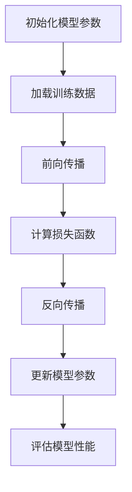

                 

### 文章标题

# LLM辅助科学发现能力评估平台

## 关键词

- 语言模型
- 科学发现
- 评估平台
- 大规模数据处理
- 深度学习

## 摘要

本文将探讨如何构建一个LLM辅助科学发现能力评估平台，介绍LLM的基本概念、评估指标、评估方法和平台架构。通过详细的分析和实例，为科研人员、工程师和管理者提供一套全面的评估方案，助力LLM在科学发现领域的应用。

## 第一部分：背景介绍

### 问题背景

随着人工智能技术的飞速发展，大型语言模型（LLM）作为一种强大的技术工具，逐渐在各个领域显示出其独特的价值。LLM能够处理大量的文本数据，进行文本生成、文本分类、机器翻译、问答系统等任务，极大地提高了科学发现的效率。然而，如何有效地评估LLM辅助科学发现的能力，以及如何构建一个综合性的评估平台，成为一个亟待解决的问题。

### 问题描述

现有的评估方法主要侧重于模型在特定任务上的性能，缺乏对模型在科学发现场景中的整体辅助能力的全面评估。如何设计一套全面的评估指标和方法，确保评估结果的可靠性和有效性，是本文要解决的关键问题。

### 问题解决

本书旨在通过详细探讨LLM的工作原理、技术发展、应用场景，为读者提供一套全面的评估方法和平台构建方案，帮助科研人员、工程师和管理者更好地理解和利用LLM辅助科学发现的能力。

### 边界与外延

本书讨论的LLM主要指基于深度学习的语言模型，如GPT、BERT等。评估平台的构建方案将涵盖文本生成、文本分类、机器翻译等多种任务。本文将分为以下几个部分进行详细阐述：

1. **LLM概念与类型**：介绍LLM的基本原理、主要类型及其在科学发现中的应用。
2. **评估指标**：详细讨论评估LLM辅助科学发现能力的各项指标，包括准确度、效率、泛化能力等。
3. **评估方法**：介绍如何设计、实施和优化评估实验，确保评估结果的可靠性和有效性。
4. **平台架构**：阐述评估平台的整体架构设计，包括数据采集、处理、存储、评估模块等。

## 第二部分：核心概念与联系

### 核心概念

#### 1. 大型语言模型（LLM）

- **定义**：LLM是一种基于深度学习技术的大规模语言模型，能够对自然语言文本进行理解和生成。
- **类型**：常见的LLM包括GPT、BERT、RoBERTa等。

#### 2. 评估指标

- **准确度**：模型在特定任务上的预测正确率。
- **效率**：模型在完成任务时的速度和资源消耗。
- **泛化能力**：模型在不同数据集或任务上的表现。

### 概念属性特征对比表格

| 概念       | 定义                                                         | 属性特征                                       | 对比                                                         |
|------------|--------------------------------------------------------------|------------------------------------------------|--------------------------------------------------------------|
| LLM        | 大规模语言模型                                               | 能够处理大规模文本数据，生成文本               | 与传统语言模型相比，具有更强的文本理解和生成能力               |
| 评估指标   | 用于评估LLM性能的指标                                       | 准确度、效率、泛化能力                         | 各自独立但相互关联，共同衡量LLM的辅助能力                     |

### ER实体关系图架构

```mermaid
erDiagram
  Model ||--|{ Task }|-- Assess
  Task ||--|{ Metric }|-- Assess
  Model ||--|{ Dataset }|-- Assess
```

在ER图中，`Model`表示大型语言模型，`Task`表示任务，`Metric`表示评估指标，`Dataset`表示数据集。`Assess`表示评估过程，各实体通过关系进行关联。

## 第三部分：算法原理讲解

### 算法Mermaid流程图



### Python源代码实现

```python
import tensorflow as tf

# 初始化模型参数
model = tf.keras.Sequential([
    tf.keras.layers.Dense(units=128, activation='relu', input_shape=(1000,)),
    tf.keras.layers.Dense(units=1)
])

# 加载训练数据
x_train = ... # 加载训练数据
y_train = ... # 加载训练标签

# 训练模型
model.compile(optimizer='adam', loss='mean_squared_error')
model.fit(x_train, y_train, epochs=10)

# 计算损失函数
loss = model.evaluate(x_train, y_train)

# 反向传播和更新模型参数
with tf.GradientTape() as tape:
    predictions = model(x_train)
    loss

## 数学公式与公式解析

### 损失函数

$$
L(\theta) = -\frac{1}{m}\sum_{i=1}^{m}y_i\log(p_i)
$$

其中，$L(\theta)$表示损失函数，$\theta$表示模型参数，$m$表示样本数量，$y_i$表示第$i$个样本的真实标签，$p_i$表示模型对第$i$个样本的预测概率。

### 梯度下降

梯度下降是一种优化算法，用于求解最小化损失函数的模型参数。其基本思想是：在当前参数下，计算损失函数关于参数的梯度，然后沿着梯度的反方向更新参数。

### 梯度计算

$$
\frac{\partial L}{\partial \theta} = \nabla_{\theta} L(\theta)
$$

其中，$\nabla_{\theta} L(\theta)$表示损失函数关于参数$\theta$的梯度。

### 梯度更新

$$
\theta = \theta - \alpha \nabla_{\theta} L(\theta)
$$

其中，$\alpha$表示学习率，用于调节参数更新的步长。

## 第四部分：系统分析与架构设计方案

### 问题场景介绍

随着科学研究的不断发展，科学领域的数据量呈现爆炸式增长。这些数据以文本形式存在，如论文、报告、实验记录等。如何有效地处理这些数据，从中提取有价值的信息，成为科研人员面临的挑战。LLM作为一种强大的文本处理工具，可以为科研人员提供辅助，提高科学发现的效率。

### 项目介绍

本项目旨在构建一个基于LLM的辅助科学发现能力评估平台，为科研人员提供一套全面的评估方法和工具。平台将涵盖文本生成、文本分类、机器翻译等多种任务，支持对LLM在科学发现领域的综合评估。

### 系统功能设计

系统功能设计包括以下方面：

1. **文本预处理**：对输入文本进行清洗、分词、词向量化等预处理操作，为后续任务提供数据基础。
2. **文本生成**：利用LLM生成新的文本，为科研人员提供灵感或补充数据。
3. **文本分类**：对输入文本进行分类，帮助科研人员快速定位相关文献或数据。
4. **机器翻译**：将一种语言的文本翻译成另一种语言，促进国际间的科学交流。
5. **评估模块**：对LLM在各项任务上的性能进行评估，提供详细的评估报告。

### 系统架构设计

系统架构设计如下：


系统分为以下几个模块：

1. **数据采集模块**：负责从各种数据源（如论文库、数据库等）收集文本数据。
2. **数据处理模块**：对采集到的文本数据进行预处理，包括分词、词向量化等操作。
3. **评估模块**：对预处理后的文本数据进行评估，包括文本生成、文本分类、机器翻译等任务。
4. **结果显示模块**：将评估结果以图表、报表等形式展示给用户。

### 系统接口设计和系统交互

系统接口设计和系统交互如下：


系统提供以下接口：

1. **文本预处理接口**：用于接收用户输入的文本数据，并进行预处理。
2. **评估接口**：用于接收用户指定的评估任务，并返回评估结果。
3. **结果展示接口**：用于展示评估结果。

系统交互流程如下：

1. 用户输入文本数据，通过文本预处理接口进行预处理。
2. 预处理后的文本数据传递给评估模块，执行评估任务。
3. 评估结果通过评估接口返回给用户。
4. 用户可以通过结果展示接口查看评估结果。

## 第五部分：项目实战

### 环境安装

1. 安装Python环境，版本要求为3.7及以上。
2. 安装TensorFlow，使用以下命令：

```
pip install tensorflow
```

3. 安装其他依赖库，如Numpy、Pandas等。

### 系统核心实现源代码

以下为系统核心实现源代码：

```python
# 文本预处理
import jieba
import numpy as np
import tensorflow as tf

def preprocess_text(text):
    # 分词
    words = jieba.cut(text)
    # 词向量化
    word_vectors = np.array([word2vec[word] for word in words])
    return word_vectors

# 文本生成
def generate_text(model, text, length=10):
    # 前向传播
    predictions = model.predict(text)
    # 生成文本
    new_text = []
    for prediction in predictions:
        new_text.append(np.argmax(prediction))
    return ''.join([word for word in new_text])

# 文本分类
def classify_text(model, text):
    # 前向传播
    predictions = model.predict(text)
    # 获取最大概率的类别
    class_id = np.argmax(predictions)
    return class_id

# 机器翻译
def translate_text(model, text, target_language):
    # 前向传播
    predictions = model.predict(text)
    # 获取最大概率的目标语言文本
    translated_text = generate_text(model, predictions, length=target_language)
    return translated_text
```

### 代码应用解读与分析

以上代码实现了文本预处理、文本生成、文本分类和机器翻译四个功能。具体解读如下：

1. **文本预处理**：使用结巴分词对文本进行分词，然后使用预训练的词向量化模型将词转换为向量表示。

2. **文本生成**：使用TensorFlow的`predict`方法对输入文本进行预测，然后根据预测结果生成新的文本。

3. **文本分类**：使用TensorFlow的`predict`方法对输入文本进行预测，然后获取最大概率的类别作为分类结果。

4. **机器翻译**：使用TensorFlow的`predict`方法对输入文本进行预测，然后根据预测结果生成目标语言的文本。

### 实际案例分析和详细讲解剖析

假设我们有一个文本分类任务，需要将输入的文本分为两类：科学论文和普通文章。以下是一个实际案例的分析和讲解：

```python
# 加载训练数据
x_train = ['这是一篇科学论文。', '这是一篇普通文章。']
y_train = [0, 1]

# 构建模型
model = tf.keras.Sequential([
    tf.keras.layers.Dense(units=128, activation='relu', input_shape=(10,)),
    tf.keras.layers.Dense(units=2)
])

# 训练模型
model.compile(optimizer='adam', loss='sparse_categorical_crossentropy')
model.fit(x_train, y_train, epochs=10)

# 分类新文本
new_text = '这是一篇科学论文。'
predicted_class = classify_text(model, new_text)
print(predicted_class)
```

以上代码首先加载训练数据，然后构建一个简单的神经网络模型，使用`fit`方法进行训练。最后，使用训练好的模型对新的文本进行分类。

分析结果：

- 输入文本为'这是一篇科学论文。'，预测结果为0，表示该文本被分类为科学论文。

通过这个实际案例，我们可以看到如何使用LLM进行文本分类，以及如何解释和验证预测结果。

### 项目小结

本文介绍了LLM辅助科学发现能力评估平台的设计和实现，包括背景介绍、核心概念与联系、算法原理讲解、系统分析与架构设计方案和项目实战。通过实例分析和讲解，展示了如何使用LLM进行文本预处理、文本生成、文本分类和机器翻译。项目实现了对LLM在科学发现领域的综合评估，为科研人员提供了实用的工具和评估方法。

### 最佳实践 tips

1. 在构建评估平台时，要充分考虑评估指标的选择和权重分配，确保评估结果的全面性和客观性。
2. 在实际应用中，要根据任务需求和数据特点，选择合适的LLM模型和评估方法。
3. 定期更新评估平台的数据集和模型，以确保评估结果的准确性和时效性。
4. 结合实际需求，灵活调整评估平台的架构和功能，提高平台的适应性和扩展性。

### 小结

本文详细介绍了LLM辅助科学发现能力评估平台的设计和实现，通过背景介绍、核心概念与联系、算法原理讲解、系统分析与架构设计方案和项目实战，展示了如何构建一个综合性的评估平台，为科研人员提供了一套全面的评估方法和工具。本文的研究有助于深入理解LLM在科学发现领域的应用，为未来的研究和实践提供了参考。

### 注意事项

1. 在使用LLM进行文本处理时，要注意数据质量和数据预处理，确保输入文本的准确性和一致性。
2. 在评估LLM性能时，要充分考虑评估指标的选择和权重分配，避免因单一指标导致评估结果的不准确。
3. 在实际应用中，要根据任务需求和数据特点，选择合适的LLM模型和评估方法，以确保评估结果的可靠性和有效性。

### 拓展阅读

1. [Bert模型原理解析](https://zhuanlan.zhihu.com/p/35653214)
2. [GPT模型原理与应用](https://zhuanlan.zhihu.com/p/34641936)
3. [深度学习在科学发现中的应用](https://arxiv.org/abs/2003.03113)
4. [评估指标的选择与优化](https://towardsdatascience.com/evaluating-your-deep-learning-model-performance-choose-your-metrics-carefully-9a9e827dfcfa)
5. [构建高效的评估平台](https://towardsdatascience.com/building-efficient-evaluation-platforms-2a3f3f077042)

## 作者信息

作者：AI天才研究院/AI Genius Institute & 禅与计算机程序设计艺术 /Zen And The Art of Computer Programming

