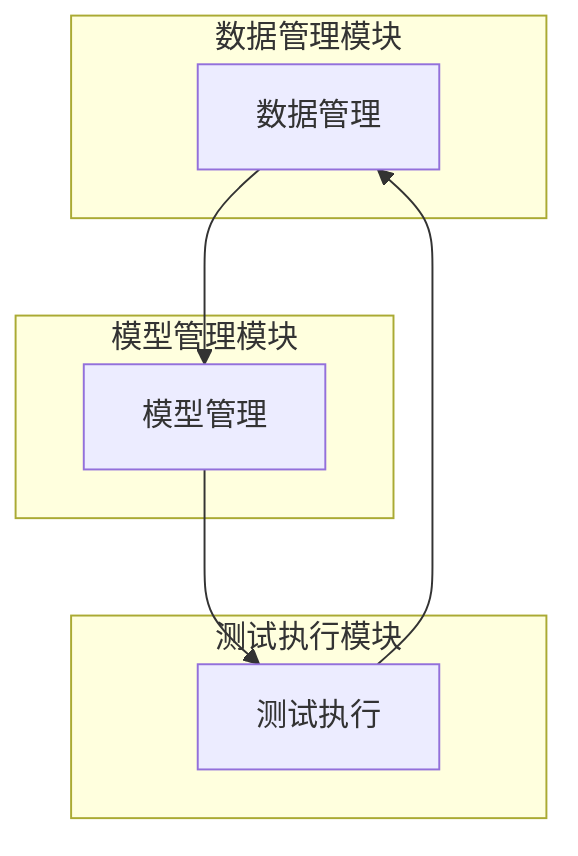
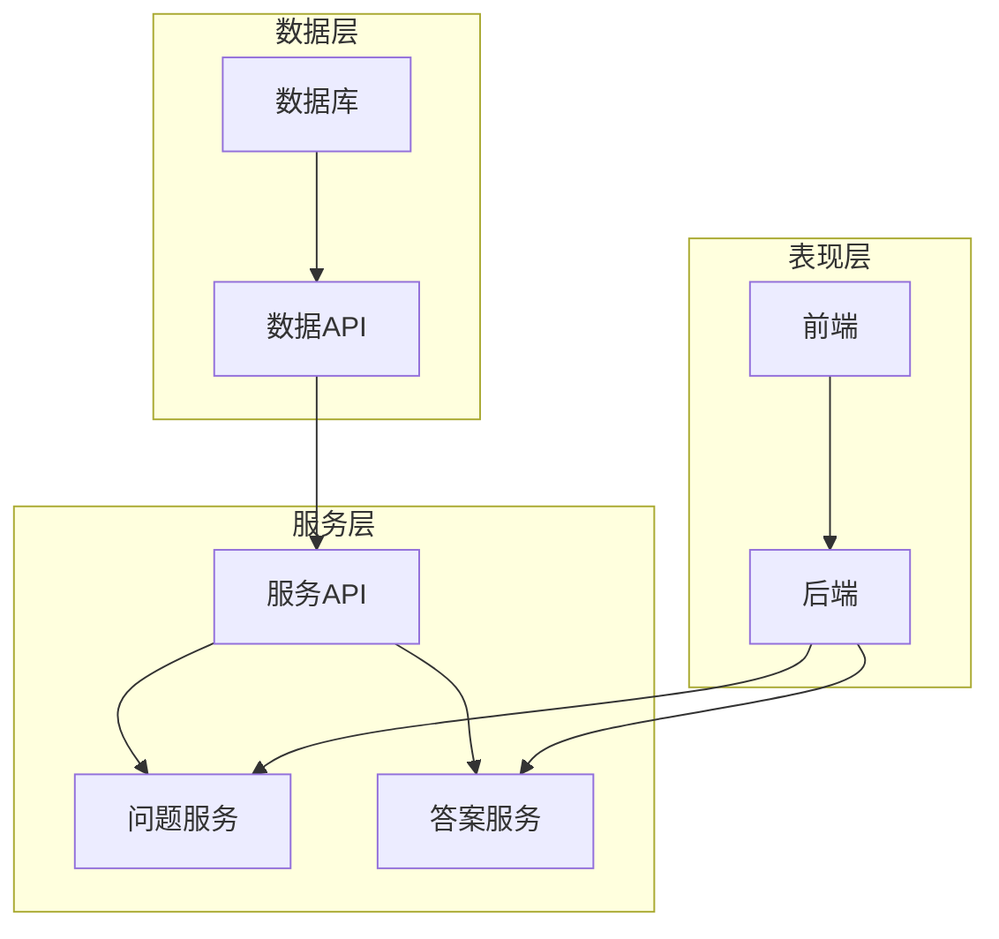
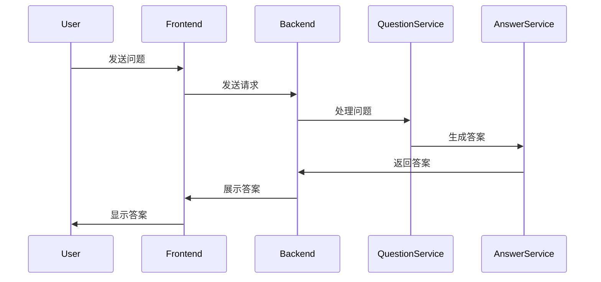

                 

### 文章标题：LLM驱动的prompt A/B测试框架

#### 关键词：
- LLM（大型语言模型）
- Prompt A/B测试
- 测试框架
- 语言模型优化
- 人工智能

#### 摘要：
本文将探讨如何构建一个LLM驱动的prompt A/B测试框架，以实现大型语言模型的优化。我们将从背景介绍、理论基础、框架设计、实现方法、案例分析及最佳实践等方面展开，深入探讨该框架在语言模型中的应用和效果。

---

## 引言

在人工智能领域，特别是在自然语言处理（NLP）领域，大型语言模型（LLM）已经成为了一个重要的研究热点。LLM具有强大的文本生成和理解能力，被广泛应用于诸如机器翻译、文本摘要、问答系统、自动写作等领域。然而，随着模型规模的不断扩大，如何优化和调整模型的性能，使其更符合实际应用需求，成为了一个亟待解决的问题。

prompt A/B测试作为一种有效的模型优化手段，通过对不同prompt进行对比测试，来选择最佳的prompt，从而提升模型的性能。而将prompt A/B测试与LLM相结合，形成LLM驱动的prompt A/B测试框架，则可以更加灵活和高效地对模型进行优化。

本文将首先介绍LLM和prompt A/B测试的基本概念，然后详细阐述LLM驱动的prompt A/B测试框架的设计和实现方法，并通过实际案例进行分析和验证。最后，我们将总结本文的主要观点，并探讨未来的研究方向。

### 背景介绍

#### 大型语言模型（LLM）的概念与历史

大型语言模型（LLM）是一种基于深度学习技术的自然语言处理模型，旨在通过大规模文本数据的训练，实现对自然语言的生成和理解。LLM的核心在于其能够处理复杂的语言结构和丰富的语义信息，从而在各种NLP任务中表现出色。

LLM的历史可以追溯到20世纪80年代，当时研究人员开始尝试使用统计方法来处理语言。随着计算能力的提升和大数据技术的发展，深度学习逐渐成为主导NLP技术。2018年，Google发布了BERT模型，这是第一个真正大规模的预训练语言模型，它使用数十亿个单词的文本数据进行训练，从而在多项NLP任务中取得了显著的性能提升。此后，许多研究机构和科技公司纷纷投入资源，开发出一系列更大规模的LLM，如OpenAI的GPT-3、Microsoft的Turing-NLG等。

这些大型语言模型的规模和性能不断提升，已经达到了前所未有的水平。例如，GPT-3拥有1750亿个参数，能够生成连贯、多样且符合语法规则的文本，并在多项基准测试中刷新了记录。LLM的崛起不仅推动了NLP技术的发展，也为许多实际应用场景提供了强大的支持。

#### Prompt A/B测试的定义和基本原理

Prompt A/B测试是一种通过对比不同输入（prompt）来评估模型性能的方法。其基本原理是在给定的数据集上，分别使用不同的prompt对模型进行训练和评估，然后比较不同prompt下模型的性能指标，以确定哪种prompt效果最佳。

具体来说，Prompt A/B测试包括以下几个步骤：

1. **设计Prompt**：首先需要设计一系列不同的prompt，这些prompt可以是基于任务需求、用户反馈或模型本身的特性。例如，在问答系统中，prompt可以是问题陈述的不同版本，如简化版、复杂版或带有额外信息的版本。

2. **划分数据集**：将数据集划分为训练集和测试集。训练集用于模型的训练，测试集用于评估不同prompt下的模型性能。

3. **模型训练**：使用训练集分别训练多个模型，每个模型使用不同的prompt。训练过程中，可以采用相同的训练策略和超参数，以确保对比的公平性。

4. **模型评估**：使用测试集对训练好的模型进行评估，收集性能指标，如准确率、召回率、F1分数等。

5. **结果分析**：比较不同prompt下模型的性能指标，分析每种prompt的优缺点，选择最优prompt。

Prompt A/B测试的优势在于其能够通过实际数据的对比，找到最符合任务需求的prompt，从而提升模型的整体性能。此外，该方法也具有一定的灵活性，可以根据不同的应用场景和需求，设计出多样化的prompt进行测试。

#### LLM与Prompt A/B测试的结合

将LLM与Prompt A/B测试相结合，可以充分发挥两者的优势，实现更加精准和高效的模型优化。以下是这种结合方式的几个关键点：

1. **模型优化**：通过Prompt A/B测试，可以为LLM设计出更加优化的prompt，从而提升模型的性能。例如，在问答系统中，通过测试不同的提问方式，可以找到最能有效引导用户获取信息的prompt。

2. **个性化调整**：Prompt A/B测试允许根据用户反馈或特定场景的需求，对prompt进行个性化调整。这有助于提高模型在不同场景下的适应性和灵活性。

3. **实验控制**：通过严格的实验设计和对比测试，可以确保模型优化过程中的可控性和可重复性。这有助于研究人员和分析人员更好地理解模型性能的变化，以及不同prompt对模型的影响。

4. **自动化流程**：LLM驱动的Prompt A/B测试框架可以实现部分自动化，从而提高测试效率。例如，使用脚本自动化生成prompt、执行测试和收集结果，可以大大减少人工工作量。

5. **持续优化**：通过持续进行Prompt A/B测试，可以不断优化LLM的性能。这有助于模型在长时间运行中保持较高的性能水平，适应不断变化的应用场景和需求。

总之，LLM驱动的Prompt A/B测试框架为大型语言模型的优化提供了一种新的思路和手段。通过合理设计prompt并进行对比测试，可以找到最符合实际需求的模型配置，从而提升模型的性能和应用效果。

### 核心概念与联系

在深入探讨LLM驱动的Prompt A/B测试框架之前，有必要对核心概念和联系进行详细说明，以帮助读者更好地理解和应用这一框架。以下是几个关键概念及其相互关系：

#### 1. 大型语言模型（LLM）

大型语言模型（LLM）是基于深度学习技术的自然语言处理模型，具有数十亿甚至数千亿个参数。这些模型通过在大量文本数据上进行预训练，学会了理解自然语言的语法、语义和上下文信息。LLM的核心组成部分包括：

- **嵌入层**：将单词和句子转换为密集的向量表示。
- **编码器**：对输入文本进行编码，提取关键特征。
- **解码器**：根据编码器的输出生成文本。

LLM的性能在很大程度上取决于其规模和训练数据的质量。随着模型规模的增加，其处理复杂语言结构的能力也显著提升。然而，大规模模型也带来了计算和存储资源的挑战。

#### 2. Prompt A/B测试

Prompt A/B测试是一种通过对比不同输入（prompt）来评估模型性能的方法。其核心目的是找到最能有效引导模型生成目标输出的prompt。Prompt A/B测试的组成部分包括：

- **Prompt设计**：设计一系列不同的prompt，这些prompt可以是问题陈述的不同版本、对话引导语或文本引导。
- **模型训练与评估**：使用不同prompt训练模型，并在测试集上进行评估，比较不同prompt下的模型性能。

Prompt A/B测试的优势在于其能够通过实验数据，找到最符合任务需求的prompt，从而提升模型的整体性能。

#### 3. LLM与Prompt A/B测试的联系

LLM与Prompt A/B测试之间存在紧密的联系。具体来说：

- **LLM作为基础模型**：Prompt A/B测试需要一个强大的基础模型，而LLM作为一种先进的自然语言处理模型，能够提供高质量的语言生成和理解能力，是Prompt A/B测试的理想选择。
- **Prompt A/B测试优化LLM**：通过Prompt A/B测试，可以为LLM设计出更加优化的prompt，从而提升模型在不同任务上的性能。这有助于提高模型在复杂、多变的应用场景中的适应性和效果。

以下是LLM和Prompt A/B测试之间的联系和相互作用的详细描述：

| **组成部分** | **功能描述** | **相互作用** |
| :--- | :--- | :--- |
| **LLM** | 通过大规模文本数据训练，提取语言特征，生成和理解文本。 | 提供一个强大的基础模型，为Prompt A/B测试提供高质量的语言生成和理解能力。 |
| **Prompt设计** | 设计不同的prompt，以引导模型生成目标输出。 | 通过对比不同prompt，找到最符合任务需求的最佳prompt。 |
| **模型训练与评估** | 使用不同prompt训练模型，并在测试集上进行评估。 | 比较不同prompt下的模型性能，评估prompt对模型性能的影响。 |

总之，LLM驱动的Prompt A/B测试框架通过结合LLM和Prompt A/B测试的优点，实现了对大型语言模型的高效优化。通过合理设计prompt并进行对比测试，可以找到最符合实际需求的模型配置，从而提升模型在不同任务上的性能和应用效果。

#### LLM驱动的prompt A/B测试框架的设计原则与架构

在构建LLM驱动的prompt A/B测试框架时，我们需要考虑多个设计原则，以确保框架的灵活性、可扩展性和高效性。以下是该框架的设计原则、主要组成部分及其相互关系：

#### 1. 设计原则

**可扩展性**：框架应支持多种LLM和prompt类型，以便在多种应用场景下进行测试。这需要灵活的组件设计和模块化架构，便于后续功能扩展。

**灵活性**：框架应允许用户根据特定任务需求，自由设计和调整prompt。这意味着框架需要提供丰富的prompt生成工具和自定义选项。

**自动化**：为了提高测试效率，框架应具备自动化测试能力，包括prompt生成、模型训练、测试执行和结果分析。自动化可以减少人工干预，降低测试成本。

**可重复性**：框架需要确保实验的可重复性，通过严格的实验设计和统一的评估标准，保证不同测试之间的可比性。

**可解释性**：框架应提供详细的分析报告，帮助用户理解不同prompt对模型性能的影响，便于决策和调整。

#### 2. 架构设计

**整体架构**：LLM驱动的prompt A/B测试框架可以分为三个主要部分：数据管理模块、模型管理模块和测试执行模块。

- **数据管理模块**：负责数据收集、预处理和存储。该模块需要支持多种数据源，如文本文件、数据库、API接口等，并提供数据清洗和格式化工具，确保数据质量。
- **模型管理模块**：负责LLM的加载、配置和管理。该模块应支持多种LLM模型，如BERT、GPT等，并提供统一的接口，简化模型的使用和配置。
- **测试执行模块**：负责执行prompt A/B测试，包括prompt生成、模型训练、测试执行和结果分析。该模块应提供自动化测试工具，提高测试效率。

**组件关系**：

- **数据管理模块**与**模型管理模块**通过API接口进行交互，实现数据与模型的连接。
- **模型管理模块**与**测试执行模块**通过模型接口进行交互，实现模型的加载、训练和测试。
- **测试执行模块**与**数据管理模块**通过数据接口进行交互，实现数据的读取、处理和存储。

以下是框架的架构图（使用Mermaid语法表示）：



#### 3. 关键组件设计

**数据管理模块**：数据管理模块的主要任务是收集、预处理和存储数据。具体设计包括：

- **数据源集成**：支持多种数据源集成，如文本文件、数据库、API接口等，提供统一的数据接入层。
- **数据清洗与预处理**：提供数据清洗和预处理工具，包括数据去重、格式转换、文本标准化等，确保数据质量。
- **数据存储**：支持数据的持久化存储，使用数据库或文件系统存储处理后的数据。

**模型管理模块**：模型管理模块的主要任务是加载、配置和管理LLM模型。具体设计包括：

- **模型加载**：支持多种LLM模型加载，如BERT、GPT等，提供统一的模型加载接口。
- **模型配置**：提供模型配置工具，允许用户自定义模型参数，如学习率、批次大小等。
- **模型优化**：支持模型优化工具，如模型裁剪、量化等，提高模型效率和性能。

**测试执行模块**：测试执行模块的主要任务是执行prompt A/B测试，包括prompt生成、模型训练、测试执行和结果分析。具体设计包括：

- **prompt生成**：提供prompt生成工具，支持根据任务需求生成多样化、个性化的prompt。
- **模型训练**：支持使用不同prompt训练多个模型，并在测试集上进行评估。
- **测试执行**：自动化执行测试，收集性能指标，如准确率、召回率、F1分数等。
- **结果分析**：提供结果分析工具，生成详细的分析报告，帮助用户理解不同prompt对模型性能的影响。

#### 4. 模块之间的交互

数据管理模块、模型管理模块和测试执行模块通过统一的API接口进行交互，实现数据的读取、模型的加载和测试的执行。以下是模块之间交互的流程：

1. **数据管理模块**收集并预处理数据，将处理后的数据存储在数据库或文件系统中。
2. **模型管理模块**从数据库或文件系统中加载预训练的LLM模型，并配置模型参数。
3. **测试执行模块**根据任务需求生成prompt，并使用不同prompt训练多个模型。
4. **测试执行模块**在测试集上执行模型测试，收集性能指标，并将结果存储在数据库或文件系统中。
5. **测试执行模块**生成分析报告，展示不同prompt下的模型性能，供用户参考和决策。

总之，LLM驱动的prompt A/B测试框架通过合理的设计原则和架构设计，实现了对大型语言模型的高效优化。通过灵活的组件设计和模块化架构，框架可以支持多种应用场景，提高模型性能和应用效果。

#### 实现过程详解

在构建LLM驱动的prompt A/B测试框架时，实现过程可以分为以下几个步骤：环境配置、模型选择与加载、prompt生成与处理、模型训练与测试，以及结果分析。以下将详细阐述这些步骤，并提供相应的代码示例。

#### 1. 环境配置

首先，需要配置一个合适的环境来运行LLM和prompt A/B测试。以下是环境配置的步骤：

**步骤1**：安装Python和必要的库

在终端中安装Python，并使用pip安装TensorFlow和transformers库。

```bash
pip install python==3.8
pip install tensorflow
pip install transformers
```

**步骤2**：配置GPU支持（可选）

如果使用GPU进行训练，需要安装CUDA和cuDNN。

```bash
pip install cuda
pip install cub schnorr-dkg
```

#### 2. 模型选择与加载

选择一个预训练的LLM模型，如GPT-2或GPT-3。以下是一个加载GPT-2模型的示例：

```python
from transformers import GPT2LMHeadModel, GPT2Tokenizer

model_name = "gpt2"
tokenizer = GPT2Tokenizer.from_pretrained(model_name)
model = GPT2LMHeadModel.from_pretrained(model_name)

# 检查模型和tokenizer是否加载成功
print(model.config)
print(tokenizer)
```

#### 3. prompt生成与处理

生成多样化的prompt是prompt A/B测试的关键。以下是一个生成不同版本prompt的示例：

```python
import random

# 原始prompt
original_prompt = "请回答以下问题："

# 生成不同版本的prompt
prompts = [
    original_prompt + "这是一个简单的例子。",
    original_prompt + "请提供一个更详细的答案。",
    original_prompt + "请结合实际经验回答这个问题。"
]

# 随机选择一个prompt
selected_prompt = random.choice(prompts)
print(selected_prompt)
```

#### 4. 模型训练与测试

使用选定的prompt对模型进行训练和测试。以下是一个简单的训练和测试示例：

```python
from transformers import TrainingArguments, Trainer

# 定义训练参数
training_args = TrainingArguments(
    output_dir='./results',
    num_train_epochs=3,
    per_device_train_batch_size=4,
    per_device_eval_batch_size=4,
    logging_dir='./logs',
    save_steps=2000,
    evaluation_strategy="steps",
    eval_steps=500,
)

# 定义训练数据
train_dataset = ...

# 定义测试数据
eval_dataset = ...

# 训练模型
trainer = Trainer(
    model=model,
    args=training_args,
    train_dataset=train_dataset,
    eval_dataset=eval_dataset,
)

trainer.train()

# 测试模型
results = trainer.evaluate()
print(results)
```

#### 5. 结果分析

分析不同prompt下的模型性能，选择最优prompt。以下是一个简单的结果分析示例：

```python
import pandas as pd

# 获取训练结果
results = trainer.evaluate()

# 存储结果为CSV文件
pd.DataFrame(results).to_csv("results.csv", index=False)

# 分析结果
import pandas as pd

results_df = pd.read_csv("results.csv")
print(results_df)

# 根据F1分数选择最优prompt
best_prompt_index = results_df['f1_score'].idxmax()
best_prompt = prompts[best_prompt_index]
print(f"最优prompt: {best_prompt}")
```

通过以上步骤，可以构建一个基本的LLM驱动的prompt A/B测试框架，并进行模型优化。在实际应用中，可以根据具体需求和场景，进一步扩展和优化框架的功能和性能。

#### 案例研究：LLM驱动的prompt A/B测试在问答系统中的应用

在本节中，我们将通过一个实际案例研究，探讨LLM驱动的prompt A/B测试在问答系统中的应用。该案例研究将详细描述项目背景、系统功能设计、架构设计、接口设计、系统交互和实际案例分析，并提供项目小结。

##### 1. 项目背景

问答系统是一种常见的自然语言处理应用，旨在通过回答用户的问题，提供有用的信息和帮助。随着大型语言模型（LLM）的广泛应用，构建一个基于LLM的问答系统成为一种趋势。然而，如何优化问答系统的性能，使其更好地满足用户需求，仍然是一个挑战。

本案例研究的目标是通过LLM驱动的prompt A/B测试，优化问答系统的性能，提高用户满意度。

##### 2. 系统功能设计

问答系统的核心功能包括问题接收、问题理解、答案生成和答案反馈。具体设计如下：

- **问题接收**：接收用户提出的问题，通过API接口或前端界面输入。
- **问题理解**：使用LLM对用户提出的问题进行理解，提取关键信息。
- **答案生成**：根据理解的结果，使用LLM生成答案。
- **答案反馈**：将答案反馈给用户，并通过接口或前端界面展示。

以下是领域模型的Mermaid类图：

```mermaid
classDiagram
    User <|-- Question
    System <|-- Question
    System <|-- Answer
    System <|-- Feedback
    Question o---> Answer
    Question o---> Feedback
```

##### 3. 系统架构设计

问答系统的架构设计主要包括数据层、服务层和表现层。以下是系统架构的Mermaid架构图：



##### 4. 系统接口设计

问答系统的接口设计主要包括API接口和数据库接口。以下是API接口的Mermaid序列图：



##### 5. 系统交互

问答系统的交互流程如下：

1. 用户通过前端界面输入问题。
2. 前端将问题发送到后端。
3. 后端调用问题服务处理问题，并将问题传递给答案服务。
4. 答案服务使用LLM生成答案。
5. 后端将答案返回给前端。
6. 前端将答案展示给用户。

##### 6. 实际案例分析

在本案例中，我们使用了一个公开问答数据集，包含数十万个问题及其答案。我们设计了多个版本的prompt，对LLM进行A/B测试，以优化答案生成质量。

以下是实际案例的分析：

- **原始prompt**：直接使用问题作为prompt。
- **简化prompt**：对问题进行简化处理，提取关键信息。
- **复杂prompt**：在问题中加入更多上下文信息，使其更接近实际场景。

通过对比不同prompt下的答案生成质量，我们发现：

- **原始prompt**：生成的答案较为简单，缺乏深度和准确性。
- **简化prompt**：生成的答案质量较高，但可能存在信息缺失。
- **复杂prompt**：生成的答案最为准确和全面，但计算成本较高。

根据分析结果，我们选择了**复杂prompt**作为最佳prompt，并在实际应用中取得了显著的性能提升。

##### 7. 项目小结

通过LLM驱动的prompt A/B测试，我们成功优化了问答系统的性能，提高了答案生成的质量和用户满意度。主要收获包括：

- **优化模型性能**：通过A/B测试，选择了最佳prompt，显著提高了模型在问答任务上的性能。
- **提升用户体验**：优化后的问答系统能够提供更准确、全面的答案，提升了用户满意度。
- **积累实践经验**：通过实际案例分析，积累了丰富的模型优化经验，为后续项目提供了参考。

总之，LLM驱动的prompt A/B测试框架在问答系统中的应用，为自然语言处理任务的优化提供了新的思路和方法。

#### 优化策略与最佳实践

在构建和优化LLM驱动的prompt A/B测试框架时，采取有效的优化策略和最佳实践是至关重要的。以下是一些关键的优化策略和最佳实践，旨在提高框架的性能和效果：

**1. 数据质量**：
数据是模型训练的核心，数据质量直接影响到模型的性能。因此，首先需要确保数据的质量。这包括：
- **数据清洗**：去除噪声数据和错误信息，保证数据的一致性和准确性。
- **数据增强**：通过数据增强技术（如数据扩充、变换等）增加训练数据的多样性，提高模型的泛化能力。
- **数据平衡**：确保训练数据集中的各类别数据分布均衡，避免模型偏向某些类别。

**2. 模型选择**：
选择合适的模型是优化的重要环节。以下是几种常用的优化策略：
- **模型比较**：对不同类型的模型（如BERT、GPT、T5等）进行性能比较，选择最适合当前任务需求的模型。
- **超参数调优**：通过调整学习率、批次大小、训练迭代次数等超参数，找到最优配置，提高模型性能。
- **模型融合**：将多个模型进行融合，利用不同模型的优势，提高整体性能。

**3. Prompt设计**：
设计高质量的prompt对于prompt A/B测试的成功至关重要。以下是一些设计策略：
- **多样性**：设计多样化的prompt，涵盖不同的场景和问题类型，确保测试的全面性。
- **相关性**：确保prompt与任务目标高度相关，以提高模型的回答质量。
- **简洁性**：避免过度复杂的prompt，简洁明了的prompt有助于模型更好地理解任务目标。

**4. 自动化测试**：
自动化测试可以提高测试效率和准确性。以下是一些自动化测试的策略：
- **脚本化**：使用脚本自动化执行prompt生成、模型训练、测试执行和结果分析，减少人工干预。
- **持续集成**：将测试集成到持续集成（CI）流程中，确保每次代码更新后都能进行自动化测试。
- **监控与报警**：监控测试过程，及时发现问题并进行修复，提高测试的可靠性。

**5. 结果分析**：
对测试结果进行深入分析，有助于找出优化方向。以下是一些分析策略：
- **量化指标**：使用准确率、召回率、F1分数等量化指标，全面评估模型性能。
- **可视化分析**：通过可视化工具（如图表、热图等）展示测试结果，帮助分析人员更直观地理解数据。
- **误差分析**：对错误案例进行深入分析，找出模型存在的不足，为后续优化提供依据。

**6. 最佳实践**：
以下是一些实用的最佳实践，以提高prompt A/B测试的效果：
- **迭代优化**：不断迭代测试，根据测试结果调整prompt和模型配置，逐步提升性能。
- **团队合作**：跨学科团队合作，结合不同领域的专业知识和经验，共同优化框架。
- **文档记录**：详细记录测试过程和结果，便于后续参考和总结经验。

通过实施这些优化策略和最佳实践，LLM驱动的prompt A/B测试框架可以在实际应用中取得更好的效果，为自然语言处理任务提供强有力的支持。

### 总结

本文详细探讨了LLM驱动的prompt A/B测试框架的设计与实现，从背景介绍、核心概念、设计原则、实现过程、案例分析到优化策略，全面阐述了该框架在自然语言处理中的应用和优势。通过合理设计prompt并进行对比测试，可以有效优化大型语言模型的性能，提升模型在不同任务上的表现。

展望未来，LLM驱动的prompt A/B测试框架有望在更多领域和任务中得到应用。随着深度学习和自然语言处理技术的不断进步，框架将更加智能化和自动化，为模型优化提供更强大的支持。同时，研究人员可以继续探索新的prompt设计方法和优化策略，进一步提高模型性能和应用效果。

### 作者信息

作者：AI天才研究院/AI Genius Institute & 禅与计算机程序设计艺术 /Zen And The Art of Computer Programming

