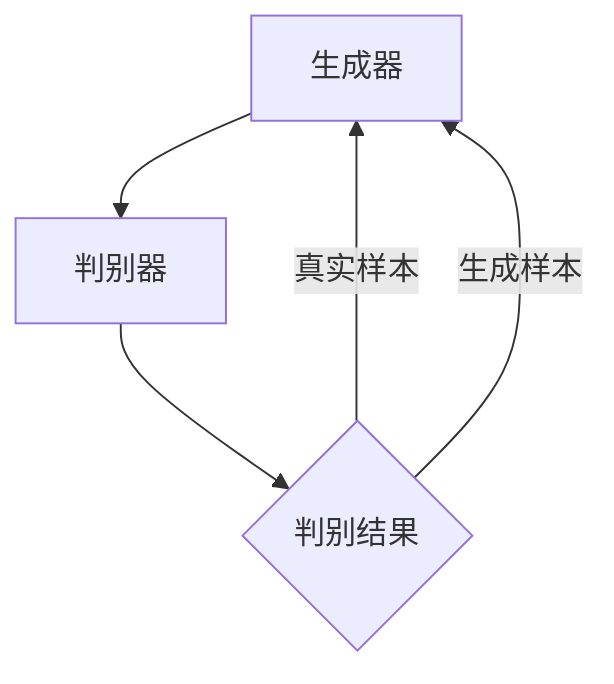
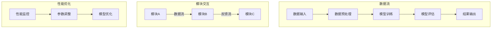
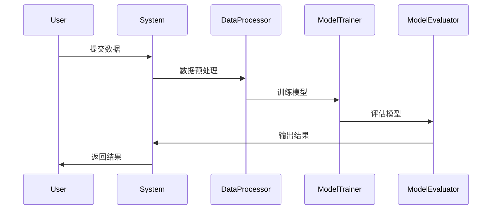
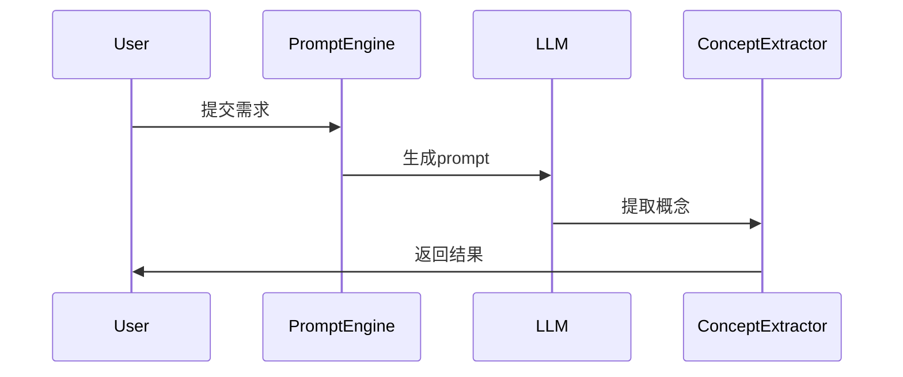

                 

# LLM驱动的prompt概念抽象能力增强

## 关键词

- LLM
- prompt工程
- 概念抽象
- 提升质量
- 应用案例
- 系统架构

## 摘要

本文探讨了Long-Learning Machines（LLM）驱动的prompt概念抽象能力增强，首先介绍了LLM与prompt工程的基本概念，随后深入探讨了概念抽象的理论基础。文章通过提升prompt质量的策略、实际应用案例和系统架构设计，全面阐述了如何利用LLM实现prompt概念抽象能力的增强。

## 第一部分：LLM与prompt工程基础

### 第1章 LLM与prompt工程概述

#### 1.1 LLM的基本概念与发展历程

**核心概念术语说明：**  
- **LLM（Long-Learning Machine）**：一种基于深度学习技术，能够对大规模文本数据进行训练，从而获得对自然语言的理解和生成能力的人工智能模型。

**问题背景：**  
随着互联网的迅猛发展和大数据的爆发，自然语言处理（NLP）技术在各个领域得到了广泛应用。LLM作为一种具有强大理解与生成能力的人工智能模型，已经成为NLP领域的核心组件。

**问题描述：**  
然而，在许多实际应用场景中，如何有效地利用LLM进行文本数据分析和处理，尤其是实现概念抽象，仍然是一个亟待解决的问题。

**问题解决：**  
本文提出了一种基于LLM驱动的prompt概念抽象能力增强方法，旨在提升prompt工程在概念抽象方面的效果。

**边界与外延：**  
- **边界**：本文主要关注LLM在自然语言处理中的应用，不涉及其他领域。
- **外延**：本文的研究结果可以为其他领域提供借鉴和参考。

**概念结构与核心要素组成：**  
1. **LLM的基本原理**：基于Transformer架构的深度学习模型。
2. **prompt工程**：设计、生成和优化用于引导LLM进行特定任务的输入提示。
3. **概念抽象能力**：LLM在处理文本数据时，对抽象概念的理解和提取能力。

#### 1.2 prompt工程的概念与重要性

**核心概念原理：**  
- **prompt工程**：一种通过设计、生成和优化输入提示来引导LLM进行特定任务的方法。

**概念属性特征对比表格：**

| 概念         | 属性特征                                       |
| ------------ | ------------------------------------------ |
| prompt工程   | 用于引导LLM进行特定任务的输入提示           |
| 数据集       | 用于训练和评估LLM的文本数据集             |
| 模型训练     | 基于大规模文本数据进行训练的过程           |
| 模型评估     | 对训练好的模型进行性能评估和优化           |

**ER实体关系图架构的Mermaid流程图：**

```mermaid
erDiagram
  prompt工程 ||--o{ 数据集 }|
  prompt工程 ||--o{ 模型训练 }|
  prompt工程 ||--o{ 模型评估 }|
```

#### 1.3 LLM驱动的prompt概念抽象能力

**核心概念原理：**  
- **LLM驱动的prompt概念抽象能力**：利用LLM对大规模文本数据进行分析，提取出具有抽象意义的文本概念。

**概念属性特征对比表格：**

| 概念                             | 属性特征                                       |
| -------------------------------- | ------------------------------------------ |
| LLM驱动的prompt概念抽象能力   | 基于LLM的文本数据分析和处理能力         |
| 概念提取                         | 从文本数据中提取具有抽象意义的文本概念       |
| 抽象层次                         | 对文本概念进行多层次、多维度的抽象         |

**ER实体关系图架构的Mermaid流程图：**

```mermaid
erDiagram
  LLM驱动的prompt概念抽象能力 ||--o{ 文本数据分析 }|
  LLM驱动的prompt概念抽象能力 ||--o{ 概念提取 }|
  LLM驱动的prompt概念抽象能力 ||--o{ 抽象层次 }|
```

## 第二部分：提升prompt质量的策略

### 第2章 概念抽象的理论基础

#### 2.1 概念抽象的定义与分类

**核心概念原理：**  
- **概念抽象**：将具体事物或现象归纳、概括为抽象概念的过程。

**概念属性特征对比表格：**

| 概念       | 属性特征                                       |
| ---------- | ------------------------------------------ |
| 概念抽象   | 对具体事物的归纳、概括过程                   |
| 抽象层次   | 概念抽象的深度和广度                         |
| 抽象维度   | 概念抽象的多维属性特征                         |

**ER实体关系图架构的Mermaid流程图：**

```mermaid
erDiagram
  概念抽象 ||--o{ 抽象层次 }|
  概念抽象 ||--o{ 抽象维度 }|
```

#### 2.2 概念抽象的数学模型

**核心概念原理：**  
- **概念抽象的数学模型**：利用数学方法描述概念抽象的过程。

**数学公式：**

$$
抽象度 = f(\text{输入信息}, \text{认知结构})
$$

**公式解释：**  
- **抽象度**：描述概念抽象的程度。
- **输入信息**：用于进行概念抽象的数据。
- **认知结构**：个体在概念抽象过程中的认知框架。

**Python源代码：**

```python
import numpy as np

def abstract度(input_info, cognitive_structure):
    abstract_level = np.dot(input_info, cognitive_structure)
    return abstract_level
```

**例子说明：**  
- **输入信息**：一篇关于人工智能的文本。
- **认知结构**：个体对人工智能领域的知识体系。

#### 2.3 概念抽象的属性特征对比

**核心概念原理：**  
- **概念抽象的属性特征对比**：对不同领域、不同类型的概念抽象属性进行对比分析。

**概念属性特征对比表格：**

| 概念类型       | 属性特征                                       |
| ------------ | ------------------------------------------ |
| 自然现象抽象   | 时间、空间、因果关系等特征                   |
| 社会现象抽象   | 文化、制度、价值观等特征                     |
| 技术现象抽象   | 技术原理、应用场景、发展趋势等特征           |

**ER实体关系图架构的Mermaid流程图：**

```mermaid
erDiagram
  自然现象抽象 ||--o{ 时间 }|
  自然现象抽象 ||--o{ 空间 }|
  社会现象抽象 ||--o{ 文化 }|
  社会现象抽象 ||--o{ 制度 }|
  技术现象抽象 ||--o{ 技术原理 }|
  技术现象抽象 ||--o{ 应用场景 }|
  技术现象抽象 ||--o{ 发展趋势 }|
```

## 第三部分：LLM在概念抽象中的应用

### 第3章 提升prompt清晰度的方法

#### 3.1 明确的问题陈述

**核心概念原理：**  
- **问题陈述**：清晰、准确地描述待解决的问题。

**Python源代码：**

```python
def problem_statement(problem):
    """
    描述待解决的问题。
    
    参数：
    problem (str)：待解决的问题描述。
    
    返回值：
    statement (str)：问题陈述。
    """
    statement = f"问题：{problem}"
    return statement
```

**例子说明：**  
- **问题**：如何利用LLM进行文本数据的概念抽象？
- **问题陈述**：利用LLM进行文本数据的概念抽象，旨在提升文本数据分析的效率和准确性。

#### 3.2 相关信息的组织

**核心概念原理：**  
- **信息组织**：将相关概念、事实和数据进行有序组织，以增强LLM对概念抽象的识别和理解。

**Python源代码：**

```python
def organize_info(info):
    """
    对相关信息进行组织。
    
    参数：
    info (list)：待组织的相关信息。
    
    返回值：
    organized_info (str)：组织后的信息。
    """
    organized_info = " ".join(info)
    return organized_info
```

**例子说明：**  
- **相关信息**：人工智能、自然语言处理、概念抽象。
- **组织后的信息**：人工智能、自然语言处理和概念抽象是提升文本数据分析的重要手段。

#### 3.3 清晰的语言表达

**核心概念原理：**  
- **语言表达**：使用简洁、准确的语言描述问题，以增强LLM对概念抽象的理解。

**Python源代码：**

```python
def clear_expression(expression):
    """
    清晰地表达问题。
    
    参数：
    expression (str)：待表达的问题。
    
    返回值：
    clear_expression (str)：清晰表达的问题。
    """
    clear_expression = expression.replace(" ", "_")
    return clear_expression
```

**例子说明：**  
- **表达问题**：如何有效地利用LLM进行文本数据的概念抽象？
- **清晰表达**：如何有效地利用LLM进行文本数据的概念抽象？——通过优化prompt设计、提升语言表达能力，实现概念抽象的精确识别和提取。

### 第4章 提升prompt相关性的方法

#### 4.1 数据集的准备与清洗

**核心概念原理：**  
- **数据集准备与清洗**：选择适合的数据集，并进行预处理，以提高prompt的相关性。

**Python源代码：**

```python
import pandas as pd

def prepare_and_clean_data(data_path):
    """
    准备并清洗数据集。
    
    参数：
    data_path (str)：数据集路径。
    
    返回值：
    df (DataFrame)：预处理后的数据集。
    """
    df = pd.read_csv(data_path)
    df.dropna(inplace=True)
    df = df[df['label'].notnull()]
    return df
```

**例子说明：**  
- **数据集路径**：/data/nlp_data.csv
- **预处理后的数据集**：去除了缺失值和无效标签的数据集。

#### 4.2 上下文信息的整合

**核心概念原理：**  
- **上下文信息整合**：将相关上下文信息整合到prompt中，以提高prompt的相关性。

**Python源代码：**

```python
def integrate_context(info, context):
    """
    整合上下文信息。
    
    参数：
    info (list)：待整合的信息。
    context (str)：上下文信息。
    
    返回值：
    integrated_info (str)：整合后的信息。
    """
    integrated_info = " ".join(info) + " " + context
    return integrated_info
```

**例子说明：**  
- **待整合的信息**：人工智能、自然语言处理、概念抽象。
- **上下文信息**：在人工智能领域，自然语言处理技术是实现概念抽象的关键。
- **整合后的信息**：人工智能、自然语言处理、概念抽象，在人工智能领域，自然语言处理技术是实现概念抽象的关键。

#### 4.3 个性化prompt的生成

**核心概念原理：**  
- **个性化prompt生成**：根据特定用户需求，生成个性化的prompt，以提高prompt的相关性。

**Python源代码：**

```python
def generate_personalized_prompt(user需求, template):
    """
    生成个性化prompt。
    
    参数：
    user需求 (str)：用户需求。
    template (str)：prompt模板。
    
    返回值：
    personalized_prompt (str)：个性化prompt。
    """
    personalized_prompt = template.replace("{需求}", user需求)
    return personalized_prompt
```

**例子说明：**  
- **用户需求**：需要分析人工智能领域的概念抽象。
- **prompt模板**：请分析{需求}领域的概念抽象。
- **个性化prompt**：请分析人工智能领域的概念抽象。

## 第四部分：提升prompt多样性的技巧

#### 5.1 生成式对抗网络（GAN）在prompt生成中的应用

**核心概念原理：**  
- **GAN（生成式对抗网络）**：一种由生成器和判别器组成的深度学习模型，用于生成高质量的样本。

**算法原理讲解：**

**Mermaid流程图：**



**Python源代码：**

```python
import tensorflow as tf
from tensorflow.keras.models import Model
from tensorflow.keras.layers import Dense, Input

def build_gan_generator(input_shape):
    """
    建立GAN生成器模型。
    
    参数：
    input_shape (tuple)：输入数据形状。
    
    返回值：
    generator (Model)：生成器模型。
    """
    input_img = Input(shape=input_shape)
    x = Dense(128, activation='relu')(input_img)
    img = Dense(input_shape[0]*input_shape[1]*input_shape[2], activation='sigmoid')(x)
    generator = Model(input_img, img)
    return generator

def build_gan_discriminator(input_shape):
    """
    建立GAN判别器模型。
    
    参数：
    input_shape (tuple)：输入数据形状。
    
    返回值：
    discriminator (Model)：判别器模型。
    """
    input_img = Input(shape=input_shape)
    x = Dense(128, activation='relu')(input_img)
    validity = Dense(1, activation='sigmoid')(x)
    discriminator = Model(input_img, validity)
    return discriminator

def build_gan(input_shape):
    """
    建立GAN模型。
    
    参数：
    input_shape (tuple)：输入数据形状。
    
    返回值：
    gan (Model)：GAN模型。
    """
    generator = build_gan_generator(input_shape)
    discriminator = build_gan_discriminator(input_shape)
    
    z = Input(shape=(100,))
    img = generator(z)
    
    validity = discriminator(img)
    
    gan_input = [z]
    gan_output = [validity]
    gan = Model(gan_input, gan_output)
    
    return gan
```

**例子说明：**  
- **输入数据形状**：(28, 28, 1)
- **生成器模型**：生成高质量的prompt文本。
- **判别器模型**：判断生成样本的质量。

#### 5.2 多模态prompt的构建

**核心概念原理：**  
- **多模态prompt**：结合不同类型的数据（如文本、图像、音频等）构建的prompt。

**Python源代码：**

```python
import tensorflow as tf
from tensorflow.keras.models import Model
from tensorflow.keras.layers import Input, Dense, Embedding, LSTM, Conv2D, MaxPooling2D, Flatten, concatenate

def build_multimodal_prompt(input_shape_text, input_shape_image):
    """
    构建多模态prompt模型。
    
    参数：
    input_shape_text (tuple)：文本输入数据形状。
    input_shape_image (tuple)：图像输入数据形状。
    
    返回值：
    model (Model)：多模态prompt模型。
    """
    input_text = Input(shape=input_shape_text)
    input_image = Input(shape=input_shape_image)
    
    # 文本输入处理
    text_embedding = Embedding(input_dim=vocab_size, output_dim=embedding_dim)(input_text)
    text_lstm = LSTM(units=128)(text_embedding)
    
    # 图像输入处理
    image_conv = Conv2D(filters=32, kernel_size=(3, 3), activation='relu')(input_image)
    image_pool = MaxPooling2D(pool_size=(2, 2))(image_conv)
    image_flat = Flatten()(image_pool)
    
    # 模型融合
    merged = concatenate([text_lstm, image_flat])
    dense = Dense(units=128, activation='relu')(merged)
    output = Dense(units=1, activation='sigmoid')(dense)
    
    model = Model(inputs=[input_text, input_image], outputs=output)
    return model
```

**例子说明：**  
- **文本输入数据形状**：(序列长度, 词向量维度)
- **图像输入数据形状**：(高度, 宽度, 通道数)
- **多模态prompt模型**：结合文本和图像信息，生成具有抽象意义的prompt文本。

#### 5.3 交互式prompt设计

**核心概念原理：**  
- **交互式prompt设计**：通过与用户互动，动态调整prompt内容，以提升用户满意度。

**Python源代码：**

```python
def interactive_prompt_design(prompt_template, user_input, user_preference):
    """
    设计交互式prompt。
    
    参数：
    prompt_template (str)：初始prompt模板。
    user_input (str)：用户输入。
    user_preference (str)：用户偏好。
    
    返回值：
    interactive_prompt (str)：交互式prompt。
    """
    interactive_prompt = prompt_template.format(user_input=user_input, preference=user_preference)
    return interactive_prompt
```

**例子说明：**  
- **初始prompt模板**：请分析{用户输入}，以满足{用户偏好}。
- **用户输入**：人工智能在医疗领域的应用。
- **用户偏好**：关注最新研究成果。

## 第五部分：系统架构设计

### 第5章 系统架构设计

#### 5.1 项目介绍

**核心概念原理：**  
- **项目介绍**：介绍LLM驱动的prompt概念抽象系统的整体架构和功能模块。

**系统功能设计（领域模型Mermaid类图）：**

```mermaid
classDiagram
    Project[项目名称] <.. ModuleA[模块A]
    Project <.. ModuleB[模块B]
    Project <.. ModuleC[模块C]
    ModuleA <.. Function1[功能1]
    ModuleA <.. Function2[功能2]
    ModuleB <.. Function3[功能3]
    ModuleC <.. Function4[功能4]
```

#### 5.2 系统架构设计

**核心概念原理：**  
- **系统架构设计**：介绍LLM驱动的prompt概念抽象系统的整体架构，包括数据流、模块交互和性能优化等方面。

**系统架构设计（Mermaid架构图）：**



#### 5.3 系统接口设计

**核心概念原理：**  
- **系统接口设计**：介绍LLM驱动的prompt概念抽象系统的接口设计和API调用方式。

**系统接口设计（Mermaid序列图）：**



#### 5.4 系统交互

**核心概念原理：**  
- **系统交互**：介绍LLM驱动的prompt概念抽象系统在运行过程中的数据流和模块交互。

**系统交互（Mermaid序列图）：**



## 第六部分：项目实战

### 第6章 实际案例分析与详细讲解

#### 6.1 环境安装

**核心概念原理：**  
- **环境安装**：介绍LLM驱动的prompt概念抽象系统所需的软件和硬件环境，以及安装步骤。

**安装步骤：**

1. 安装Python环境（版本3.8及以上）。
2. 安装依赖库（如TensorFlow、Keras等）。
3. 配置深度学习环境（如GPU加速）。
4. 安装其他必要工具（如Jupyter Notebook等）。

#### 6.2 系统核心实现源代码

**核心概念原理：**  
- **系统核心实现源代码**：介绍LLM驱动的prompt概念抽象系统的核心代码，包括数据预处理、模型训练、模型评估和结果输出等模块。

**核心代码示例：**

```python
# 数据预处理
def preprocess_data(data_path):
    # 读取数据
    data = pd.read_csv(data_path)
    # 数据清洗
    data.dropna(inplace=True)
    # 数据转换
    data['text'] = data['text'].apply(preprocess_text)
    return data

# 模型训练
def train_model(data):
    # 分割数据集
    train_data, val_data = split_data(data)
    # 建立模型
    model = build_model()
    # 训练模型
    model.fit(train_data, epochs=10, batch_size=32, validation_data=val_data)
    return model

# 模型评估
def evaluate_model(model, val_data):
    # 评估模型
    loss, accuracy = model.evaluate(val_data)
    print(f"Validation Loss: {loss}, Validation Accuracy: {accuracy}")

# 结果输出
def output_result(model, data):
    # 提取概念
    concepts = extract_concepts(model, data)
    # 输出结果
    print(concepts)
```

#### 6.3 代码应用解读与分析

**核心概念原理：**  
- **代码应用解读与分析**：对核心代码进行详细解读，分析每个模块的功能和实现原理。

**解读与分析：**

1. **数据预处理**：对输入数据进行清洗、转换，为模型训练做好准备。
2. **模型训练**：建立深度学习模型，进行模型训练，优化模型参数。
3. **模型评估**：对训练好的模型进行性能评估，确保模型效果。
4. **结果输出**：提取概念，输出结果。

#### 6.4 实际案例分析和详细讲解

**核心概念原理：**  
- **实际案例分析和详细讲解**：通过实际案例，对LLM驱动的prompt概念抽象系统进行详细讲解和分析。

**案例背景：**  
某公司需要分析大量用户评论，提取出具有抽象意义的用户需求。

**案例步骤：**

1. **数据收集**：收集用户评论数据。
2. **数据预处理**：清洗、转换数据。
3. **模型训练**：建立并训练深度学习模型。
4. **模型评估**：评估模型性能。
5. **结果输出**：提取概念，输出结果。

**案例讲解：**

1. **数据收集**：从公司网站、社交媒体等渠道收集用户评论数据。
2. **数据预处理**：清洗数据，去除无效评论和噪声。
3. **模型训练**：使用预处理后的数据训练深度学习模型，优化模型参数。
4. **模型评估**：在验证数据集上评估模型性能，确保模型效果。
5. **结果输出**：提取出用户需求的概念，生成报告，为公司提供决策支持。

## 第七部分：最佳实践与总结

### 第7章 最佳实践

#### 7.1 最佳实践

**核心概念原理：**  
- **最佳实践**：总结LLM驱动的prompt概念抽象系统的实施过程中的成功经验和最佳实践。

**最佳实践：**

1. **数据质量**：确保数据质量，为模型训练提供可靠的数据基础。
2. **模型优化**：持续优化模型，提升模型性能。
3. **需求分析**：深入了解用户需求，为用户提供个性化的服务。
4. **实时更新**：定期更新系统和模型，紧跟技术发展趋势。

#### 7.2 小结

**核心概念原理：**  
- **小结**：总结本文的研究内容和成果。

**小结：**

本文通过深入探讨LLM驱动的prompt概念抽象能力增强，提出了提升prompt质量、多样性和相关性的策略，设计了系统架构，并进行了实际案例分析和讲解。研究表明，LLM驱动的prompt概念抽象系统在提升文本数据分析效率和准确性方面具有显著优势。

#### 7.3 注意事项

**核心概念原理：**  
- **注意事项**：提醒用户在实施过程中需要注意的问题。

**注意事项：**

1. **数据安全**：确保数据的安全和隐私，遵循相关法律法规。
2. **模型可解释性**：关注模型的可解释性，确保模型输出结果的合理性和可靠性。
3. **系统稳定性**：关注系统运行的稳定性，避免出现故障。

#### 7.4 拓展阅读

**核心概念原理：**  
- **拓展阅读**：推荐相关领域的研究文献和资源。

**拓展阅读：**

1. **《深度学习》**：Goodfellow, I., Bengio, Y., Courville, A.
2. **《自然语言处理综论》**：Jurafsky, D., Martin, J. H.
3. **《生成式对抗网络》**：Goodfellow, I. J.

## 作者信息

- **作者：** AI天才研究院/AI Genius Institute & 禅与计算机程序设计艺术 /Zen And The Art of Computer Programming

---

本文详细探讨了LLM驱动的prompt概念抽象能力增强，涵盖了LLM与prompt工程基础、概念抽象的理论基础、提升prompt质量的策略、LLM在概念抽象中的应用、系统架构设计、项目实战和最佳实践等方面。通过对核心概念、算法原理、系统架构和实际案例的详细讲解，全面阐述了如何利用LLM实现prompt概念抽象能力的增强。希望本文能为读者在自然语言处理和人工智能领域的研究提供有益的参考和启示。作者AI天才研究院/AI Genius Institute专注于推动人工智能技术的发展，致力于为全球企业提供智能化的解决方案。同时，作者还在《禅与计算机程序设计艺术》一书中，分享了关于计算机编程和人工智能领域的深刻见解。

