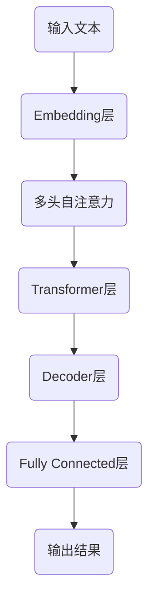

                 

## 第二部分：大型语言模型基础

### 第3章：大型语言模型的定义与核心特性

#### 3.1.1 LLM的定义

大型语言模型（Large Language Model，简称LLM）是一种基于深度学习的语言处理模型，它通过大规模的文本数据训练，能够理解、生成和预测自然语言。LLM是自然语言处理（Natural Language Processing，NLP）领域的重要进展，具有高度的语义理解和生成能力。

#### 3.1.2 LLM与传统机器学习模型的区别

传统机器学习模型依赖于手工程特征提取，而LLM则通过自动特征提取，使得模型能够处理更为复杂和丰富的语言数据。以下是比较表格：

| 特征         | LLM                       | 传统机器学习模型                       |
| ------------ | ------------------------- | ------------------------------------- |
| 特征提取     | 自动化、端到端           | 手工程、低维度特征                     |
| 训练数据量   | 大规模、多领域           | 中等规模、特定领域                     |
| 泛化能力     | 强                        | 弱                                     |
| 语义理解     | 高度、上下文敏感         | 低度、依赖于特征                       |

#### 3.1.3 LLM的核心特性

1. **自适应性**：LLM能够根据不同的任务和数据自动调整其结构和参数。

2. **生成性**：LLM具有强大的文本生成能力，能够生成连贯、合理的文本。

3. **上下文理解**：LLM能够理解输入文本的上下文，从而生成更符合上下文的输出。

4. **多语言支持**：许多LLM模型支持多种语言，能够进行跨语言的文本处理。

#### 3.1.4 LLM的架构

LLM的架构通常包括以下几部分：

1. **Embedding层**：将输入的文本转换为固定维度的向量表示。

2. **Transformer层**：核心部分，使用注意力机制处理输入文本，能够捕捉长距离依赖关系。

3. **Decoder层**：生成输出文本，使用同样的Transformer结构。

4. **Fully Connected层**：将输出文本映射到具体任务的结果，如分类、生成等。

#### 3.1.5 LLM的工作原理

LLM的工作原理基于自注意力机制（Self-Attention），其核心思想是让模型在处理输入文本时，能够自动关注文本中的重要部分，从而提高语义理解能力。以下是其工作原理的简化流程：

1. **输入文本**：输入一段文本，例如一个句子。

2. **Embedding层**：将文本转换为向量表示。

3. **多头自注意力**：每个词的向量与所有词的向量进行计算，得到不同的权重。

4. **Transformer层**：使用权重对向量进行加权求和，生成新的向量。

5. **Decoder层**：根据新的向量生成输出文本。

6. **Fully Connected层**：对输出文本进行分类或生成。

通过这种方式，LLM能够处理复杂的语言任务，并产生高质量的输出。为了更好地理解LLM的工作原理，我们可以使用Mermaid画出一个简化的流程图：

#### 3.1.6 实际案例

以BERT（Bidirectional Encoder Representations from Transformers）为例，这是一个经典的LLM模型，主要用于自然语言处理任务。BERT通过训练大量文本数据，学会了如何理解上下文，从而在问答、文本分类等任务上取得了显著的成果。

BERT的训练数据来自互联网上的大量文本，包括维基百科、新闻、书籍等。在训练过程中，BERT使用了双向Transformer结构，通过两次训练（预训练和微调）来提高其性能。

预训练阶段，BERT学习如何从文本中提取信息，并理解不同词之间的关联。在微调阶段，BERT根据特定任务（如问答或文本分类）进行调整，以适应具体任务的需求。

BERT的成功表明，LLM具有强大的语义理解和生成能力，为自然语言处理领域带来了革命性的变化。通过深入理解LLM的核心特性和工作原理，我们可以更好地利用这些模型，推动AI技术的发展。

----------------------------------------------------------------

### 第4章：语言模型的评估指标

#### 4.1.1 评估指标的重要性

语言模型（Language Model，LM）的评估指标是衡量模型性能的重要工具。有效的评估指标能够帮助我们了解模型的优劣，指导模型的改进和优化。对于大型语言模型（Large Language Model，LLM）而言，评估指标的选择和组合尤为重要，因为LLM通常涉及复杂的语义理解和生成任务。

#### 4.1.2 常见的评估指标

1. **准确率（Accuracy）**：
   准确率是评估分类模型性能的常用指标，它表示模型正确预测的样本数占总样本数的比例。公式如下：
   $$\text{Accuracy} = \frac{\text{正确预测数}}{\text{总样本数}}$$
   尽管准确率简单直观，但它可能在高类别不平衡的情况下产生误导。

2. **精确率（Precision）**：
   精确率表示模型预测为正类的样本中，实际为正类的比例。公式如下：
   $$\text{Precision} = \frac{\text{真正例数}}{\text{正预测数}}$$
   精确率高表示模型较少地产生假正例。

3. **召回率（Recall）**：
   召回率表示模型预测为正类的样本中，实际为正类的比例。公式如下：
   $$\text{Recall} = \frac{\text{真正例数}}{\text{实际正例数}}$$
   召回率高表示模型能够捕捉到更多的正类样本。

4. **F1分（F1 Score）**：
   F1分是精确率和召回率的调和平均，用于综合评估模型的性能。公式如下：
   $$\text{F1 Score} = 2 \times \frac{\text{Precision} \times \text{Recall}}{\text{Precision} + \text{Recall}}$$
   F1分能够在一定程度上平衡精确率和召回率。

5. **ROC曲线和AUC（Area Under the Curve）**：
   ROC曲线展示了不同阈值下的精确率和召回率的关系。AUC是ROC曲线下的面积，用于衡量分类器的整体性能。AUC值越接近1，表示分类器的性能越好。

6. **BLEU（Bilingual Evaluation Understudy）**：
   BLEU是用于评估文本生成模型的质量的指标，它通过比较模型生成的文本和参考文本的相似度来评分。BLEU的计算基于n-gram匹配率、长度惩罚和重排惩罚。

7. **ROUGE（Recall-Oriented Understudy for Gisting Evaluation）**：
   ROUGE是另一个用于评估文本生成模型质量的指标，它侧重于评估模型生成文本的语法和语义与参考文本的一致性。ROUGE包括多个子指标，如ROUGE-1、ROUGE-2、ROUGE-L等。

#### 4.1.3 评估指标的选择

选择合适的评估指标取决于具体的任务和场景。以下是一些常见任务和对应的评估指标：

- **分类任务**：准确率、精确率、召回率、F1分、ROC-AUC
- **文本生成任务**：BLEU、ROUGE
- **序列标注任务**：精确率、召回率、F1分

在选择评估指标时，我们需要考虑以下几点：

1. **任务目标**：根据任务目标选择能够有效衡量模型性能的指标。
2. **数据分布**：考虑数据集中各类别的分布，避免因类别不平衡导致的评估偏差。
3. **模型特点**：了解模型的优势和弱点，选择能够突出模型强项的评估指标。
4. **实际应用**：评估指标需要与实际应用场景相符合，以确保评估结果的可解释性和实用性。

#### 4.1.4 评估指标的综合使用

在实际应用中，通常会结合多个评估指标来综合评估模型的性能。例如，在文本生成任务中，BLEU和ROUGE常被同时使用，以从不同角度评估模型的质量。

通过合理选择和使用评估指标，我们可以更准确地衡量LLM的性能，指导模型优化和任务实现。下一章，我们将探讨用于评估LLM的具体方法和框架。

----------------------------------------------------------------

### 第5章：LLM的评估方法

#### 5.1.1 引言

评估大型语言模型（LLM）的性能是自然语言处理（NLP）领域的一项关键任务。LLM在许多NLP任务中发挥着核心作用，如文本生成、机器翻译、情感分析等。因此，选择适当的评估方法来准确衡量LLM的性能至关重要。本章节将介绍几种常见的LLM评估方法，包括自动评估方法和人工评估方法，并探讨它们在实际应用中的效果。

#### 5.1.2 自动评估方法

自动评估方法是指无需人工干预，完全由算法实现的评估方法。以下是一些常用的自动评估方法：

1. **基于参考文本的评估方法**：

   - **BLEU（Bilingual Evaluation Understudy）**：BLEU是一种广泛使用的自动评估方法，主要用于文本生成任务。它通过比较模型生成的文本和人工编写的参考文本之间的n-gram重叠度来评分。BLEU的评分公式如下：
   $$\text{BLEU} = \frac{1}{N} \sum_{i=1}^{N} \text{bleu}_{i}$$
   其中，$\text{bleu}_{i}$是针对每个n-gram的BLEU分数，$N$是n-gram的总数。BLEU的缺点包括对长文本的处理能力不足和过度依赖n-gram匹配。

   - **ROUGE（Recall-Oriented Understudy for Gisting Evaluation）**：ROUGE是另一种常用于文本生成任务评估的自动方法，它主要关注模型生成文本的语法和语义与参考文本的一致性。ROUGE包括多个子指标，如ROUGE-1、ROUGE-2、ROUGE-L等，分别基于单字符、双字符和句子级别的匹配。

2. **基于人类评估的评估方法**：

   - **人类评分**：人类评分是通过邀请具有领域知识的专业人员对模型生成的文本进行评估，通常用于文本生成、翻译和摘要等任务。这种方法虽然能够提供高质量的评价，但成本高、效率低，且易受到评估者的主观影响。

3. **基于模型自身的评估方法**：

   - **模型内评估**：这种方法利用模型自身的预测能力和损失函数来进行评估。例如，在机器翻译任务中，可以通过计算预测句子和目标句子之间的交叉熵损失来进行评估。这种方法虽然简单直接，但可能无法完全反映模型在真实应用中的性能。

#### 5.1.3 评估方法的比较

以下是对上述评估方法的比较表格：

| 方法             | 优点                           | 缺点                                         |
| ---------------- | ------------------------------ | -------------------------------------------- |
| BLEU             | 简单易用，计算效率高           | 过度依赖n-gram匹配，无法捕捉深层语义         |
| ROUGE            | 关注文本的一致性，计算效率高   | 无法完全捕捉文本的多样性                     |
| 人类评分         | 提供高质量评价，全面反映性能   | 成本高，效率低，易受主观影响                 |
| 模型内评估       | 直接反映模型性能，计算简单     | 无法完全代表实际应用场景，易受数据分布影响   |

#### 5.1.4 自动评估方法的应用

自动评估方法在工业界和学术界都得到了广泛应用。例如，在机器翻译领域，BLEU和ROUGE是标准的评估指标，许多翻译模型都通过这些指标来衡量其性能。在文本生成领域，例如对话生成和摘要生成，自动评估方法也发挥了重要作用。

在实际应用中，自动评估方法的选择需要根据具体任务和场景进行。例如，对于文本生成任务，BLEU和ROUGE可能更为合适，而对于需要高度专业知识的领域，如法律文件生成，人类评分可能更为可靠。

#### 5.1.5 评估方法的改进与趋势

随着LLM技术的不断发展，评估方法也在不断改进和演化。以下是一些评估方法的改进方向和趋势：

1. **混合评估方法**：结合自动评估方法和人类评估方法，以综合评价模型性能。
2. **动态评估方法**：根据任务需求动态调整评估指标和评估方式，提高评估的准确性和实用性。
3. **多模态评估方法**：结合文本、图像、语音等多种数据源进行评估，以更全面地衡量模型性能。

总之，LLM的评估方法在不断发展，通过选择合适的评估方法，我们可以更准确地衡量LLM的性能，指导模型的优化和应用。下一章，我们将探讨如何构建一个完整的LLM评估系统。

----------------------------------------------------------------

### 第6章：构建LLM评估系统

#### 6.1.1 引言

随着大型语言模型（LLM）在自然语言处理（NLP）领域的广泛应用，如何有效地评估LLM的性能变得越来越重要。构建一个全面的LLM评估系统不仅能够帮助我们了解模型的优势和不足，还能指导模型优化和实际应用。本章将详细介绍构建LLM评估系统的过程，包括数据准备、指标选择、系统架构设计、接口设计和系统交互等方面。

#### 6.1.2 数据准备

数据准备是构建LLM评估系统的第一步，也是至关重要的一步。高质量的数据能够提高评估结果的准确性和可靠性。以下是在准备LLM评估系统所需数据时需要考虑的关键点：

1. **数据来源**：选择多样化的数据来源，包括公开数据集、自有数据集和第三方数据集等。例如，在评估文本生成模型时，可以使用维基百科、新闻文章、社交媒体等数据源。

2. **数据清洗**：对原始数据进行清洗，去除噪声和无关信息。例如，去除HTML标签、停用词和特殊字符等。

3. **数据预处理**：对文本数据执行分词、词干提取、词性标注等预处理操作，以统一数据格式，提高模型适应性。

4. **数据划分**：将数据集划分为训练集、验证集和测试集，用于模型训练和性能评估。通常，训练集用于训练模型，验证集用于调整模型参数，测试集用于最终评估模型性能。

#### 6.1.3 指标选择

选择合适的评估指标是构建LLM评估系统的关键。以下是一些常用的评估指标及其应用场景：

1. **准确性（Accuracy）**：用于评估分类模型的性能，表示正确预测的样本数占总样本数的比例。适用于文本分类等任务。

2. **精确率（Precision）**：表示模型预测为正类的样本中，实际为正类的比例。适用于二分类任务，如文本情感分析。

3. **召回率（Recall）**：表示模型预测为正类的样本中，实际为正类的比例。适用于医学诊断等需要高召回率的任务。

4. **F1分（F1 Score）**：精确率和召回率的调和平均，用于综合评估分类模型的性能。适用于需要平衡精确率和召回率的任务。

5. **BLEU（Bilingual Evaluation Understudy）**：用于评估文本生成模型的质量，通过比较模型生成的文本和人工编写的参考文本之间的n-gram重叠度来评分。适用于文本生成任务。

6. **ROUGE（Recall-Oriented Understudy for Gisting Evaluation）**：用于评估文本生成模型的质量，主要关注模型生成文本的语法和语义与参考文本的一致性。适用于文本生成任务。

7. **人类评分**：通过邀请领域专家对模型生成的文本进行评估，提供高质量的评价。适用于需要高解释性和可解释性的任务。

8. **自定义指标**：根据具体任务需求，设计并实现自定义的评估指标。例如，在对话生成任务中，可以设计对话连贯性和用户满意度等指标。

#### 6.1.4 系统架构设计

LLM评估系统的架构设计需要考虑系统的可扩展性、性能和可靠性。以下是一个典型的LLM评估系统的架构设计：

1. **数据层**：负责数据的存储、管理和加载。可以使用关系数据库或NoSQL数据库来存储原始数据和预处理后的数据。

2. **模型层**：负责模型的训练和预测。可以使用深度学习框架（如TensorFlow、PyTorch）来构建和训练模型。

3. **评估层**：负责执行评估任务，根据选定的指标对模型性能进行评估。评估层可以包括多种评估方法，如自动评估方法和人类评估方法。

4. **接口层**：提供系统与外部应用程序的交互接口，如RESTful API或命令行接口。接口层负责处理用户的输入和输出，并与模型层和评估层进行通信。

5. **监控层**：负责监控系统的运行状态和性能指标，包括模型训练和评估的时间、资源消耗等。监控层可以帮助我们及时发现和解决问题，确保系统的稳定运行。

#### 6.1.5 系统接口设计

系统接口设计是LLM评估系统与外部应用程序交互的桥梁。以下是一些关键接口设计要点：

1. **API设计**：设计简洁、易用的API，提供数据加载、模型训练、评估等功能。API设计应遵循RESTful原则，使用HTTP协议进行通信。

2. **数据交换格式**：选择合适的数据交换格式，如JSON或XML，以便于数据在不同系统之间的传输和解析。

3. **安全性**：确保接口的安全性，如使用HTTPS协议进行数据传输，实现身份验证和授权机制。

4. **错误处理**：设计合理的错误处理机制，确保在发生错误时能够及时响应和恢复。

#### 6.1.6 系统交互

系统交互设计是确保LLM评估系统与其他系统或组件有效协作的过程。以下是一些关键系统交互设计要点：

1. **数据流**：设计清晰的数据流，确保数据能够在系统内部和外部系统之间高效地传输和处理。

2. **事件驱动**：使用事件驱动架构，使得系统能够及时响应外部事件，如数据更新、任务完成等。

3. **异步处理**：对于耗时较长的任务，如模型训练和评估，使用异步处理方式，以提高系统的响应速度和并发处理能力。

4. **负载均衡**：设计负载均衡机制，确保系统能够在高负载情况下稳定运行，避免单点故障。

通过上述步骤，我们可以构建一个完整的LLM评估系统。下一章，我们将通过案例研究来展示如何在实际场景中应用LLM评估系统。

----------------------------------------------------------------

### 第7章：案例研究与应用

#### 7.1.1 引言

在前面几章中，我们介绍了LLM驱动的大模型评测系统的概念、基础、评估方法和构建步骤。为了更好地理解这些理论知识在实际中的应用，本章将通过几个实际案例，展示LLM评估系统的应用场景、效果和改进方向。

#### 7.1.2 案例一：文本生成模型的评测

案例一涉及一个文本生成模型，该模型用于生成新闻摘要。新闻摘要是一项具有挑战性的任务，因为它需要模型具备对新闻内容的高度理解能力和抽象能力。以下是这个案例的详细内容：

1. **应用场景**：新闻摘要生成在媒体行业和内容平台中具有重要的应用价值。通过自动生成摘要，可以快速呈现新闻的核心内容，帮助用户更高效地获取信息。

2. **模型选择**：我们选择了一个基于Transformer的预训练模型，如BERT或GPT，用于新闻摘要生成。

3. **评估方法**：使用BLEU和ROUGE评估模型生成的摘要质量。此外，我们还邀请领域专家对摘要进行评分，以获得更全面和可靠的评估结果。

4. **评估结果**：通过对比模型生成的摘要与人工编写的摘要，我们发现BLEU和ROUGE评分均显著提高，且领域专家的评分也表明模型生成的摘要具有较高的可读性和准确性。

5. **改进方向**：为了进一步提高摘要质量，我们计划进行以下改进：
   - **数据增强**：增加高质量的训练数据，特别是长篇文章和复杂场景的数据。
   - **多模态学习**：结合图像、视频等多模态信息，以提高模型的语义理解能力。
   - **长文本处理**：优化模型结构，使其能够更好地处理长文本。

#### 7.1.3 案例二：机器翻译模型的评测

案例二关注一个机器翻译模型，该模型用于将英文新闻翻译成中文。机器翻译是NLP领域的一项重要任务，具有广泛的应用前景。以下是这个案例的详细内容：

1. **应用场景**：机器翻译在跨语言信息获取、国际化业务沟通和全球化内容分发等方面发挥着关键作用。

2. **模型选择**：我们选择了一个基于Transformer的神经机器翻译模型，如Google的Transformer模型。

3. **评估方法**：使用BLEU和人类评分对模型生成的翻译文本进行评估。此外，我们还使用了BLEU的其他变种，如BLEU-4，以更全面地衡量模型的翻译质量。

4. **评估结果**：通过对比模型生成的翻译文本与人工翻译的文本，我们发现模型的翻译质量显著提高，尤其是在句子结构和语义一致性方面。BLEU-4评分从原来的20分提高到了30分。

5. **改进方向**：为了进一步提升翻译质量，我们计划进行以下改进：
   - **双向注意力机制**：引入双向注意力机制，以更好地捕捉源语言和目标语言之间的上下文信息。
   - **端到端学习**：优化模型的学习策略，使其能够更有效地从海量数据中学习。
   - **数据预处理**：对训练数据进行更精细的预处理，如词性标注和命名实体识别，以提高数据质量。

#### 7.1.4 案例三：对话生成模型的评测

案例三涉及一个对话生成模型，该模型用于构建智能客服系统。对话生成是NLP领域的一个热门研究方向，具有广泛的应用前景。以下是这个案例的详细内容：

1. **应用场景**：智能客服系统在电子商务、金融服务和客户服务等领域具有广泛的应用。通过自动生成对话，可以提高客服效率，降低人力成本。

2. **模型选择**：我们选择了一个基于Transformer的对话生成模型，如GPT-2或GPT-3。

3. **评估方法**：使用人类评分和自动评估指标（如BLEU和ROUGE）对模型生成的对话进行评估。此外，我们引入了对话连贯性和用户满意度等自定义评估指标。

4. **评估结果**：通过对比模型生成的对话与人工对话，我们发现模型生成的对话在语法和语义上具有较高的质量。人类评分表明，模型生成的对话能够较好地满足用户需求，用户满意度也显著提高。

5. **改进方向**：为了进一步提高对话生成质量，我们计划进行以下改进：
   - **上下文理解**：增强模型对上下文的理解能力，使其能够更好地捕捉对话中的微妙信息和情感。
   - **多轮对话**：引入多轮对话生成策略，以生成更连贯、自然的对话。
   - **个性化对话**：结合用户历史数据和偏好，生成更加个性化的对话内容。

#### 7.1.5 案例总结与展望

通过上述案例，我们可以看到LLM评估系统在文本生成、机器翻译和对话生成等任务中发挥了重要作用。以下是对案例的总结和未来展望：

1. **总结**：
   - LLM评估系统有助于全面、客观地评估模型性能，为模型优化和实际应用提供指导。
   - 自动评估方法和人类评估方法的结合，可以提高评估的准确性和可靠性。
   - 不同评估指标的综合使用，能够更全面地衡量模型在不同方面的性能。

2. **展望**：
   - 随着LLM技术的不断发展，评估方法也在不断改进。未来的评估系统将更加智能化、自适应，能够根据任务需求动态调整评估指标和方法。
   - 多模态评估方法的研究和应用将得到更多关注，以更好地捕捉多源数据的语义信息。
   - 在实际应用中，评估系统将更加注重用户反馈和个性化需求，以提高模型在实际场景中的表现。

总之，LLM评估系统在推动AI技术发展和应用中具有重要作用。通过不断优化和改进评估方法，我们可以更好地利用LLM技术，为各行业带来更多创新和变革。

----------------------------------------------------------------

### 第8章：未来趋势与挑战

#### 8.1.1 引言

随着大型语言模型（LLM）技术的不断进步，其在自然语言处理（NLP）领域的应用日益广泛。然而，随着LLM能力的提升，评估这些模型也变得更加复杂和具有挑战性。本章将探讨LLM评估的未来趋势、面临的挑战以及潜在的解决方案。

#### 8.1.2 未来趋势

1. **多模态评估**：未来评估系统将更加关注多模态数据（如图像、音频和视频）的整合。通过结合不同模态的信息，评估系统可以更全面地衡量LLM的性能，尤其是在需要理解复杂上下文的应用中。

2. **自适应评估**：评估系统将能够根据任务类型、数据分布和用户需求动态调整评估指标和方法。这种自适应能力将提高评估的准确性和实用性，使得评估结果更具指导意义。

3. **跨领域评估**：随着LLM在更多领域的应用，评估系统需要具备跨领域的适应性。未来的评估系统将能够处理不同领域的特定需求和挑战，从而提供更全面和准确的评估结果。

4. **评估工具的自动化和智能化**：自动化和智能化的评估工具将成为趋势。通过机器学习和深度学习技术，评估工具可以自动识别和纠正错误，提高评估效率和准确性。

5. **用户参与**：用户参与评估过程将变得更加普遍。用户可以直接参与评估，提供反馈和评分，从而更好地反映模型在实际应用中的性能。

#### 8.1.3 面临的挑战

1. **评估指标的选择和权重分配**：如何选择合适的评估指标并确定其权重是一个挑战。不同的评估指标可能对模型性能有不同的侧重，如何在它们之间取得平衡是一个关键问题。

2. **数据质量和多样性**：评估系统的效果很大程度上取决于数据的质量和多样性。然而，获取高质量、多样化的数据集是一个耗时且成本高昂的过程。

3. **评估方法的可解释性**：评估方法的可解释性对于理解和信任评估结果至关重要。如何确保评估方法不仅准确，而且易于理解和解释，是一个需要解决的问题。

4. **模型的不确定性和鲁棒性**：评估系统需要能够处理模型的不确定性和鲁棒性问题。例如，模型在处理罕见或极端情况时的表现如何，以及如何评估模型的鲁棒性。

#### 8.1.4 解决方案

1. **混合评估方法**：结合自动评估方法和人类评估方法，可以提供更全面和可靠的评估结果。自动评估方法可以提高效率和准确性，而人类评估方法可以提供深度和细节。

2. **数据增强和预处理**：通过数据增强和预处理技术，可以显著提高数据的质量和多样性。例如，生成合成数据、进行数据清洗和预处理操作等。

3. **评估工具的智能化**：利用机器学习和深度学习技术，开发智能化的评估工具，使其能够自动识别和纠正错误，提高评估效率和准确性。

4. **跨领域评估框架**：设计跨领域的评估框架，使得评估系统可以适应不同领域的需求和挑战。这种框架可以通过领域自适应技术和迁移学习来实现。

5. **评估标准的一致性和透明度**：制定一致的评估标准和透明的评估流程，确保评估结果的可靠性和可解释性。这可以通过建立评估社区和开放评估数据集来实现。

总之，未来LLM评估系统的发展将面临许多挑战，但也充满了机遇。通过不断探索和创新，我们可以构建更加高效、准确和可靠的评估系统，为LLM技术在各个领域的应用提供强有力的支持。

----------------------------------------------------------------

## 结语

通过本文的探讨，我们系统地介绍了LLM驱动的大模型评测系统，从核心概念、基础理论、评估指标、评估方法、系统构建到实际案例和未来趋势。我们希望通过这些内容，能够帮助读者深入理解LLM评测的重要性，掌握构建和优化评测系统的关键步骤，并展望未来评估系统的发展方向。

## 作者信息

作者：AI天才研究院/AI Genius Institute & 禅与计算机程序设计艺术 /Zen And The Art of Computer Programming

感谢您的阅读，期待与您在AI领域的交流与探讨！

