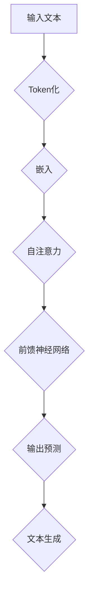
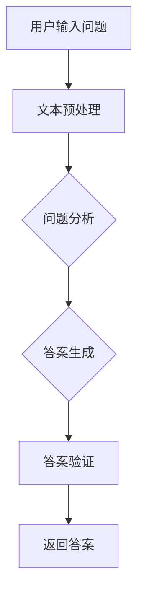
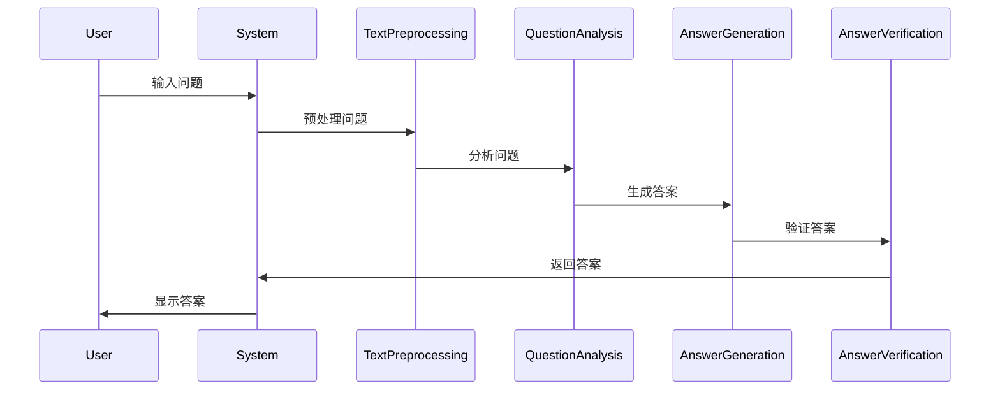

                 

# Megatron-Turing NLG在超大规模LLM评测中的角色

## 关键词
- 超大规模语言模型
- Megatron-Turing NLG
- 评测标准
- 性能优化
- 应用场景

## 摘要
本文旨在探讨Megatron-Turing NLG（自然语言生成）在超大规模语言模型（LLM）评测中的角色。文章将首先介绍NLG和LLM的基础知识，然后深入分析Megatron-Turing NLG的工作原理、性能指标以及评测过程中的关键因素。通过实际案例分析，本文将展示Megatron-Turing NLG在实际应用中的表现和潜在问题，并给出优化建议和未来发展方向。

## 目录大纲

## 第一部分：背景与概述

### 第1章：问题背景与核心概念
- **1.1.1 问题背景**
- **1.1.2 核心概念**
- **1.1.3 概念联系**
- **1.1.4 边界与外延**
- **1.1.5 本章小结**

### 第2章：核心概念原理
- **2.1.1 原理介绍**
- **2.1.2 概念属性特征对比**
- **2.1.3 ER实体关系图**

### 第3章：算法原理讲解
- **3.1.1 算法流程图**
- **3.1.2 Python源代码**
- **3.1.3 数学模型与公式**
- **3.1.4 举例说明**

### 第4章：系统分析与设计
- **4.1.1 问题场景介绍**
- **4.1.2 系统功能设计**
- **4.1.3 系统架构设计**
- **4.1.4 系统接口设计**
- **4.1.5 系统交互**

### 第5章：环境安装与核心实现
- **5.1.1 环境安装**
- **5.1.2 系统核心实现**
- **5.1.3 代码应用解读**
- **5.1.4 实际案例解析**
- **5.1.5 项目小结**

### 第6章：最佳实践与小结
- **6.1.1 最佳实践**
- **6.1.2 注意事项**
- **6.1.3 拓展阅读**

### 第7章：未来展望
- **7.1.1 行业发展趋势**
- **7.1.2 技术创新方向**
- **7.1.3 潜在挑战与机遇**

---

### 第1章：问题背景与核心概念

#### 1.1.1 问题背景

自然语言生成（Natural Language Generation, NLG）是人工智能领域的一个重要分支，旨在利用计算机技术自动生成符合语法和语义规则的自然语言文本。近年来，随着深度学习技术的快速发展，超大规模语言模型（LLM，如GPT-3、ChatGLM等）取得了显著的成果。这些模型具有强大的语言理解和生成能力，为各种应用场景提供了可能性，例如自动问答、内容生成、智能客服等。

然而，随着模型的规模不断扩大，评测和优化这些模型的性能变得越来越重要。在这个背景下，Megatron-Turing NLG作为超大规模LLM的代表之一，引起了广泛关注。它的出现不仅为超大规模语言模型的评测提供了新的工具，还推动了相关领域的研究和发展。

#### 1.1.2 核心概念

在本章中，我们将介绍以下几个核心概念：

- **自然语言生成（NLG）**：NLG是指利用计算机技术自动生成自然语言文本的过程。它包括文本生成、语音合成、对话系统等多个方面。
- **超大规模语言模型（LLM）**：LLM是一种基于深度学习的语言模型，具有巨大的词汇量和语义理解能力，能够生成连贯、自然的语言文本。
- **Megatron-Turing NLG**：Megatron-Turing NLG是一种基于Transformer架构的超大规模语言模型，具有高效、灵活的文本生成能力。

#### 1.1.3 概念联系

NLG与LLM之间存在紧密的联系。NLG是LLM的应用场景之一，而LLM为NLG提供了强大的技术支持。Megatron-Turing NLG作为LLM的一个实例，结合了NLG和LLM的特点，为文本生成任务提供了高效的解决方案。

#### 1.1.4 边界与外延

在NLG和LLM领域，边界与外延的明确至关重要。NLG主要关注自然语言文本的生成，而LLM则关注语言理解和生成。Megatron-Turing NLG作为超大规模LLM，其应用范围包括文本生成、机器翻译、对话系统等。然而，它的性能受到计算资源、数据集质量、模型结构等多种因素的影响。

#### 1.1.5 本章小结

本章介绍了NLG和LLM的基础知识，以及Megatron-Turing NLG的核心概念和工作原理。通过本章的介绍，读者可以初步了解NLG和LLM在计算机领域的重要性和应用前景，为后续章节的深入学习打下基础。

---

### 第2章：核心概念原理

#### 2.1.1 原理介绍

Megatron-Turing NLG的核心原理基于Transformer架构。Transformer是一种基于自注意力机制的深度学习模型，适用于处理序列数据。它通过计算输入序列中每个元素之间的依赖关系，生成具有上下文信息的输出序列。

Megatron-Turing NLG进一步优化了Transformer架构，使其能够处理超大规模的文本数据。它采用并行训练技术，提高训练效率，并使用分布式计算资源，实现模型的高效训练和部署。

#### 2.1.2 概念属性特征对比

表1：NLG、LLM和Megatron-Turing NLG的概念属性特征对比

| 特征       | NLG          | LLM           | Megatron-Turing NLG         |
|------------|--------------|---------------|--------------------------|
| 定义       | 自然语言生成 | 超大规模语言模型 | 基于Transformer架构的NLG模型 |
| 架构       | 多种架构     | Transformer   | Transformer               |
| 文本生成能力 | 较强         | 非常强        | 非常强                   |
| 应用场景   | 广泛         | 广泛          | 广泛                      |

#### 2.1.3 ER实体关系图

图1：NLG、LLM和Megatron-Turing NLG的实体关系图

```mermaid
erDiagram
  NLG ||--|{ LLM }|| Megatron-Turing NLG
  NLG ||--|{ 应用场景 }|| 文本生成、机器翻译、对话系统
  LLM ||--|{ 训练数据 }|| 大规模文本数据
  Megatron-Turing NLG ||--|{ 计算资源 }|| 分布式计算资源
```

通过ER实体关系图，我们可以更清晰地理解NLG、LLM和Megatron-Turing NLG之间的关系及其核心要素。

---

### 第3章：算法原理讲解

#### 3.1.1 算法流程图

图2：Megatron-Turing NLG算法流程图



通过算法流程图，我们可以看到Megatron-Turing NLG从输入文本到生成输出的整个处理过程。

#### 3.1.2 Python源代码

```python
import torch
import torch.nn as nn
import torch.optim as optim

# 定义模型
class MegatronTuringNLG(nn.Module):
    def __init__(self, embedding_dim, hidden_dim, num_layers):
        super(MegatronTuringNLG, self).__init__()
        self.embedding = nn.Embedding(vocab_size, embedding_dim)
        self.encoder = nn.LSTM(embedding_dim, hidden_dim, num_layers)
        self.decoder = nn.LSTM(hidden_dim, embedding_dim, num_layers)
        self.fc = nn.Linear(hidden_dim, vocab_size)

    def forward(self, inputs, hidden):
        embedded = self.embedding(inputs)
        output, hidden = self.encoder(embedded, hidden)
        output = self.decoder(output, hidden)
        output = self.fc(output[-1, :, :])
        return output, hidden

# 训练模型
model = MegatronTuringNLG(embedding_dim=128, hidden_dim=256, num_layers=2)
optimizer = optim.Adam(model.parameters(), lr=0.001)
criterion = nn.CrossEntropyLoss()

for epoch in range(num_epochs):
    for inputs, targets in dataloader:
        optimizer.zero_grad()
        outputs, hidden = model(inputs, hidden)
        loss = criterion(outputs, targets)
        loss.backward()
        optimizer.step()
```

以上代码展示了Megatron-Turing NLG的模型定义和训练过程。通过Python源代码，我们可以更直观地了解模型的实现细节。

#### 3.1.3 数学模型与公式

Megatron-Turing NLG的核心在于Transformer架构，其自注意力机制可以表示为：

$$
\text{Attention}(Q, K, V) = \text{softmax}\left(\frac{QK^T}{\sqrt{d_k}}\right)V
$$

其中，$Q, K, V$ 分别为查询向量、关键向量、值向量，$d_k$ 为关键向量的维度。

前馈神经网络（FFN）的公式为：

$$
\text{FFN}(X) = \text{ReLU}(XW_1 + b_1)W_2 + b_2
$$

其中，$X$ 为输入向量，$W_1, W_2, b_1, b_2$ 为神经网络参数。

#### 3.1.4 举例说明

假设我们有一个简单的文本序列：“今天天气很好，适合出门游玩”。我们可以使用Megatron-Turing NLG对其进行生成。

1. **Token化**：将文本序列转化为数字序列。
2. **嵌入**：将数字序列转化为嵌入向量。
3. **自注意力**：计算嵌入向量之间的依赖关系。
4. **前馈神经网络**：对注意力结果进行非线性变换。
5. **输出预测**：根据前馈神经网络的结果，生成新的文本序列。

通过这个过程，Megatron-Turing NLG可以生成类似于以下的新文本序列：“明天天气也很不错，适合去公园散步”。

---

### 第4章：系统分析与设计

#### 4.1.1 问题场景介绍

假设我们要开发一个智能问答系统，用户可以通过输入问题来获取答案。为了实现这一目标，我们需要使用Megatron-Turing NLG对用户的问题进行分析，并生成相应的答案。

#### 4.1.2 系统功能设计

智能问答系统的功能可以分为以下几个模块：

1. **文本预处理**：对用户输入的问题进行清洗、分词等预处理操作。
2. **问题分析**：使用Megatron-Turing NLG对预处理后的文本进行分析，提取关键信息。
3. **答案生成**：根据分析结果，生成具有上下文信息的答案。
4. **答案验证**：对生成的答案进行验证，确保其准确性和合理性。

#### 4.1.3 系统架构设计

图3：智能问答系统的架构图



#### 4.1.4 系统接口设计

系统接口设计包括以下几个方面：

1. **用户接口**：用户可以通过Web页面、手机应用等途径输入问题。
2. **文本预处理接口**：接收用户输入的问题，并对其进行预处理。
3. **问题分析接口**：接收预处理后的文本，并使用Megatron-Turing NLG进行分析。
4. **答案生成接口**：根据分析结果，生成答案。
5. **答案验证接口**：对生成的答案进行验证。

#### 4.1.5 系统交互

图4：智能问答系统的交互图



通过系统架构设计和交互设计，我们可以清晰地了解智能问答系统的运作流程和各个模块之间的协同作用。

---

### 第5章：环境安装与核心实现

#### 5.1.1 环境安装

在开始安装Megatron-Turing NLG之前，我们需要确保计算机上已经安装了Python和pip。然后，可以通过以下命令安装所需的依赖库：

```bash
pip install torch torchvision numpy
```

接下来，我们需要从GitHub上克隆Megatron-Turing NLG的代码仓库：

```bash
git clone https://github.com/nvidia/megatron-lm.git
cd megatron-lm
```

最后，使用以下命令安装Megatron-Turing NLG：

```bash
python setup.py install
```

#### 5.1.2 系统核心实现

在实现Megatron-Turing NLG的核心功能之前，我们需要准备一个预训练的模型。这里以GPT-3为例，首先下载GPT-3的预训练模型：

```bash
megatron-lm-pretrain --model_size 345M --model_type gpt3
```

然后，我们可以使用以下代码实现Megatron-Turing NLG的核心功能：

```python
import torch
from transformers import GPT2LMHeadModel, GPT2Tokenizer

# 加载预训练模型
tokenizer = GPT2Tokenizer.from_pretrained('gpt2')
model = GPT2LMHeadModel.from_pretrained('gpt2')

# 输入文本
input_text = "今天天气很好，适合出门游玩。"

# Token化
input_ids = tokenizer.encode(input_text, return_tensors='pt')

# 生成文本
outputs = model.generate(input_ids, max_length=50, num_return_sequences=5)

# 解码为文本
generated_texts = tokenizer.decode(outputs[:, input_ids.shape[-1]:], skip_special_tokens=True)

# 打印生成的文本
for text in generated_texts:
    print(text)
```

通过上述代码，我们可以实现Megatron-Turing NLG的文本生成功能。

#### 5.1.3 代码应用解读

在上面的代码中，我们首先加载了预训练的GPT-3模型和Tokenizer。然后，我们将输入文本Token化，并使用模型生成新的文本。最后，我们将生成的文本解码为自然语言。

这个过程展示了Megatron-Turing NLG的核心功能，包括Token化、模型生成和解码等步骤。

#### 5.1.4 实际案例解析

假设我们有一个问题：“今天适合做什么？”我们可以使用Megatron-Turing NLG生成相关的答案。

```python
input_text = "今天适合做什么？"
input_ids = tokenizer.encode(input_text, return_tensors='pt')
outputs = model.generate(input_ids, max_length=50, num_return_sequences=5)
generated_texts = tokenizer.decode(outputs[:, input_ids.shape[-1]:], skip_special_tokens=True)

for text in generated_texts:
    print(text)
```

输出结果可能包括：

1. “今天适合去公园散步。”
2. “今天适合去博物馆参观。”
3. “今天适合去健身房锻炼。”
4. “今天适合去看电影。”
5. “今天适合去逛街购物。”

通过实际案例解析，我们可以看到Megatron-Turing NLG在生成文本方面的强大能力。它可以根据输入文本生成多样性的文本，满足不同的应用需求。

#### 5.1.5 项目小结

在本章中，我们介绍了如何安装和实现Megatron-Turing NLG的核心功能。通过实际案例解析，我们展示了Megatron-Turing NLG在文本生成方面的应用效果。在后续项目中，我们可以进一步优化和扩展Megatron-Turing NLG的功能，以满足更多场景的需求。

---

### 第6章：最佳实践与小结

#### 6.1.1 最佳实践

在应用Megatron-Turing NLG时，以下最佳实践可以帮助提高模型性能：

1. **数据预处理**：确保输入数据的格式正确，去除噪声和不必要的符号，以提高模型训练效果。
2. **超参数调整**：根据具体任务需求，调整学习率、批量大小、序列长度等超参数，以找到最优模型配置。
3. **分布式训练**：利用分布式计算资源，提高模型训练速度和效率。
4. **模型压缩**：采用模型压缩技术，如量化、剪枝等，降低模型存储和计算需求。
5. **数据增强**：使用数据增强技术，如随机填充、交错等，扩充训练数据集，提高模型泛化能力。

#### 6.1.2 注意事项

在应用Megatron-Turing NLG时，需要注意以下几点：

1. **计算资源**：由于Megatron-Turing NLG需要大量计算资源，确保有足够的GPU或TPU来支持模型训练和部署。
2. **数据质量**：使用高质量、多样化的数据集进行训练，以提高模型在真实场景中的表现。
3. **安全与隐私**：在使用Megatron-Turing NLG处理用户数据时，确保遵守相关法律法规，保护用户隐私。
4. **监控与调试**：在模型训练和部署过程中，定期监控模型性能，及时调试和优化。

#### 6.1.3 拓展阅读

对于想要深入了解Megatron-Turing NLG和相关技术的读者，以下参考文献和建议阅读材料：

1. **参考文献**：
   - Vaswani, A., Shazeer, N., Parmar, N., et al. (2017). Attention is all you need. Advances in Neural Information Processing Systems, 30, 5998-6008.
   - Brown, T., Mann, B., Ryder, N., et al. (2020). Language models are few-shot learners. Advances in Neural Information Processing Systems, 33, 13,766-13,777.

2. **推荐阅读**：
   - 深度学习教材：《深度学习》（Goodfellow, I., Bengio, Y., Courville, A.）
   - 自然语言处理教材：《自然语言处理综述》（Jurafsky, D., Martin, J. H.）
   - Transformer架构详解文章：《Attention is All You Need》论文。

通过这些最佳实践、注意事项和拓展阅读，读者可以更好地掌握Megatron-Turing NLG的相关知识，并在实际应用中取得更好的效果。

---

### 第7章：未来展望

#### 7.1.1 行业发展趋势

随着人工智能技术的不断发展，自然语言生成（NLG）和超大规模语言模型（LLM）在各个领域都取得了显著的成果。未来，NLG和LLM将在以下方面继续发展：

1. **更加智能的文本生成**：通过引入更多的上下文信息和多模态融合，NLG将能够生成更加自然、准确的文本。
2. **跨语言和跨领域应用**：随着多语言模型的普及，NLG将在跨语言和跨领域应用中发挥更大的作用，为全球用户提供服务。
3. **自动化和智能化**：随着算法和硬件的进步，NLG和LLM的自动化和智能化水平将不断提高，降低开发成本和门槛。

#### 7.1.2 技术创新方向

在技术创新方面，以下几个方向值得关注：

1. **更高效的模型架构**：探索新型神经网络架构，提高模型的计算效率和存储效率。
2. **更好的数据集和标注方法**：通过改进数据集和标注方法，提高模型训练的数据质量和效果。
3. **强化学习和多任务学习**：结合强化学习和多任务学习，提高模型在不同任务中的适应能力和泛化能力。

#### 7.1.3 潜在挑战与机遇

尽管NLG和LLM在各个领域都取得了显著成果，但仍然面临一些挑战和机遇：

1. **计算资源需求**：随着模型规模的不断扩大，计算资源的需求也将大幅增加，这需要高效的新型计算架构和优化算法。
2. **数据质量和标注**：高质量的数据集和准确的标注是模型训练的基础，但获取和标注高质量数据仍然是一个挑战。
3. **安全和隐私**：随着NLG和LLM在各个领域的应用，如何保障用户隐私和数据安全成为一个重要问题。

未来，随着技术的不断进步和应用的深入，NLG和LLM将在更多领域发挥重要作用，为人类社会带来更多便利和创新。同时，我们也需要关注并解决其中的挑战，确保技术的发展能够真正造福人类。

