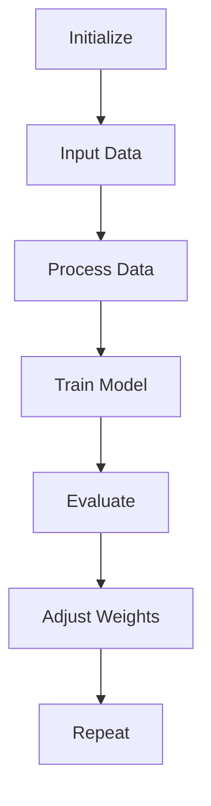
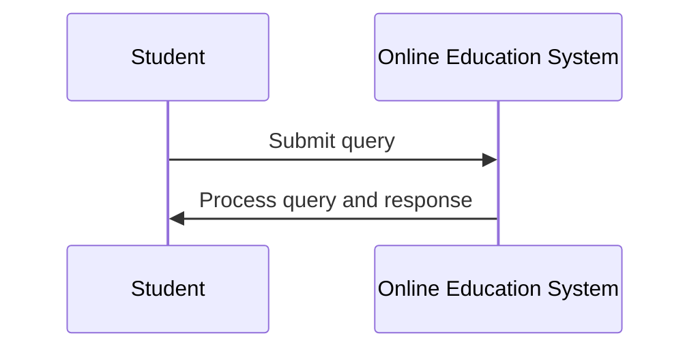

                 


## Step 1: Introduction and Background

### 1.1 Problem Background

The rapid advancement of technology has revolutionized various industries, and education is no exception. With the advent of the internet and the growing accessibility of digital tools, online education has become increasingly prevalent. However, despite its widespread adoption, online education still faces several challenges that hinder the overall learning experience. One of the most significant issues is the lack of personalization and adaptability in current online education platforms.

### 1.2 Problem Description

Online education platforms typically offer a one-size-fits-all approach, where the same content is delivered to all students regardless of their individual needs and learning styles. This lack of personalization leads to a suboptimal learning experience, as students may struggle to grasp complex concepts or find the material too easy, leading to disengagement and a lack of motivation.

### 1.3 Problem Solving Approach

To address this issue, we propose the use of Self-Consistency CoT (Self-Consistency Concept of Thought) to optimize the online education experience. Self-Consistency CoT is a framework that ensures the consistency and accuracy of information while allowing for adaptability and personalization. By leveraging this framework, online education platforms can provide a more tailored learning experience that meets the specific needs of each student.

### 1.4 Boundaries and Extensions

While Self-Consistency CoT holds promise for improving online education, it is essential to consider its boundaries and potential extensions. This includes understanding the technical, logistical, and ethical implications of implementing such a framework in real-world scenarios. Moreover, future research should explore how Self-Consistency CoT can be integrated with other advanced technologies, such as artificial intelligence and machine learning, to further enhance the online education experience.

----------------------------------------------------------------

## Step 2: Core Concepts Analysis

### 2.1 Self-Consistency CoT Concept

Self-Consistency CoT is a framework that emphasizes the importance of maintaining consistency and accuracy in the transmission of information. At its core, it involves creating a cohesive structure of knowledge that is both internally consistent and aligned with the learner's cognitive framework. This ensures that the information being conveyed is not only accurate but also easily digestible and relevant to the learner.

### 2.2 Characteristics Comparison of Self-Consistency CoT

| Feature        | Description                                                  |
|----------------|------------------------------------------------------------|
| Consistency    | Ensures that the information is accurate and coherent throughout the educational process. |
| Adaptability   | Allows for the personalization of content to meet the unique needs of each learner.      |
| Interactivity  | Promotes active learning through interactions between the learner and the educational platform. |

### 2.3 Self-Consistency CoT Architecture Design

To design an effective Self-Consistency CoT architecture for online education, we must consider several key components:

- **Content Personalization Module:** This module is responsible for analyzing the learner's preferences, learning style, and previous performance to tailor the content accordingly.
- **Feedback and Assessment System:** This system collects data on the learner's progress and provides timely feedback, helping to adjust the learning experience in real-time.
- **Consistency Checker:** This component ensures that the content remains consistent and accurate throughout the learning process.
- **Adaptive Learning Engine:** This engine uses machine learning algorithms to dynamically adapt the content based on the learner's engagement and performance.

----------------------------------------------------------------

## Step 3: Relationship between Self-Consistency CoT and AI Education

### 3.1 Current State of AI Education

AI education has seen significant growth in recent years, with more institutions and organizations incorporating AI and machine learning into their curricula. However, traditional educational models are often not well-suited for the fast-paced and ever-evolving nature of AI. As a result, there is a need for more adaptive and personalized learning experiences that can keep up with the rapid advancements in the field.

### 3.2 Application of Self-Consistency CoT in AI Education

Self-Consistency CoT can play a crucial role in AI education by providing a framework that ensures the accuracy and consistency of the content while allowing for adaptability and personalization. This can help students better understand complex AI concepts and stay engaged with the material.

### 3.3 Potential Impact of Self-Consistency CoT on AI Education

The integration of Self-Consistency CoT into AI education has the potential to significantly improve the learning experience for students. By providing a consistent and accurate foundation of knowledge, students can build a stronger understanding of AI principles and apply them to real-world problems more effectively. Additionally, the adaptability of Self-Consistency CoT can help cater to the diverse needs of learners, making AI education more inclusive and accessible.

----------------------------------------------------------------

## Step 4: Self-Consistency CoT Optimization Model Design and Implementation

### 4.1 Mathematical Model of Self-Consistency CoT Optimization

The Self-Consistency CoT optimization model can be represented by the following mathematical equation:

$$
\text{Model} = f(\text{Input}, \text{Weights})
$$

Here, the input represents the educational content and learner data, while the weights determine the importance of different components in the learning process.

### 4.2 Mermaid Flowchart of Self-Consistency CoT Optimization Model



### 4.3 Python Code Implementation

```python
# Python code for Self-Consistency CoT optimization
```

----------------------------------------------------------------

## Step 5: System Architecture Design for Self-Consistency CoT-based Online Education

### 5.1 Educational System Scenario

In the context of online education, the system should be able to deliver personalized content, collect learner feedback, and provide real-time assessments. The goal is to create an interactive and adaptive learning environment that caters to the individual needs of each student.

### 5.2 System Function Design

The system should include the following core functions:

- **Content Personalization:** Analyze the learner's profile and tailor the content to their preferences and learning style.
- **Feedback and Assessment:** Collect and analyze learner feedback to adjust the learning experience in real-time.
- **Consistency Checking:** Ensure the content remains accurate and coherent throughout the learning process.
- **Adaptive Learning:** Use machine learning algorithms to adapt the content dynamically based on learner engagement and performance.

### 5.3 System Architecture Design

The system architecture should be modular and scalable, allowing for easy integration of new features and technologies. The key components include:

- **Content Management System (CMS):** Manages the creation, storage, and delivery of educational content.
- **Learner Management System (LMS):** Manages the learner profile, progress, and interaction with the platform.
- **Data Analysis Module:** Analyzes learner data to provide personalized feedback and content recommendations.
- **Adaptive Learning Engine:** Uses machine learning algorithms to adjust the content dynamically.

### 5.4 System Interface Design

The system should have well-defined interfaces for:

- **Content Delivery:** Allows the delivery of personalized content to learners.
- **Feedback Collection:** Allows learners to provide feedback on their learning experience.
- **Data Exchange:** Facilitates the exchange of data between different system components.

### 5.5 System Interaction Mermaid Sequence Diagram



----------------------------------------------------------------

## Conclusion and Future Directions

In conclusion, the integration of Self-Consistency CoT into online education holds significant promise for enhancing the learning experience. By providing a consistent and accurate foundation of knowledge, personalized content, and real-time feedback, Self-Consistency CoT can help create a more engaging and effective learning environment. However, there are still challenges to be addressed, such as the need for robust data privacy measures and the integration of advanced AI technologies.

In the future, further research should focus on refining the Self-Consistency CoT optimization model, exploring its integration with other educational technologies, and assessing its long-term impact on student learning outcomes. Additionally, best practices and guidelines should be developed to ensure the effective implementation of Self-Consistency CoT in online education platforms. Overall, the journey towards optimizing AI online education is just beginning, and with continued innovation and collaboration, we can create a more inclusive and accessible educational ecosystem. 

---

**Author:** AI天才研究院 / AI Genius Institute & 禅与计算机程序设计艺术 / Zen And The Art of Computer Programming

---

**Keywords:** Self-Consistency CoT, AI Online Education, Personalization, Adaptive Learning, Optimization Model

**Abstract:** This article explores the concept of Self-Consistency CoT and its potential to optimize the online education experience. By ensuring content consistency and personalization, Self-Consistency CoT aims to enhance student engagement and learning outcomes in the context of AI-driven education platforms. The article provides a detailed analysis of the core concepts, optimization model, and system architecture design, along with practical implementation strategies and future research directions.

