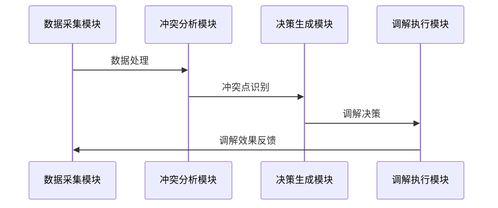
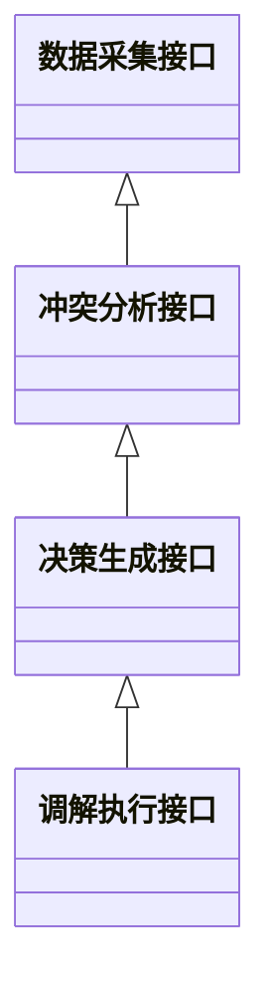
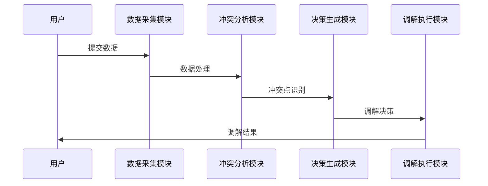
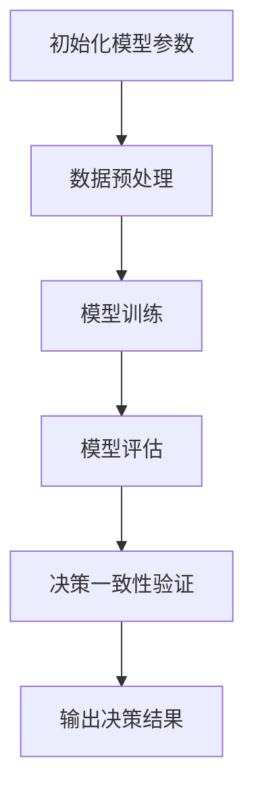

                 

### 自洽一致性理论（CoT）概述

随着人工智能技术的迅猛发展，跨学科、跨领域的融合研究日益成为科技前沿的重要趋势。特别是在跨宇宙文明冲突调解领域，如何实现人工智能系统的自我一致性优化，已成为研究者们关注的焦点。自洽一致性理论（Self-Consistency CoT）作为一种新兴的理论框架，为解决AI在跨宇宙文明冲突调解中的自我一致性问题提供了有力的理论支持。本文将围绕自洽一致性理论的基本概念、核心原理及其在AI跨宇宙文明冲突调解中的应用，进行系统的分析和探讨。

**关键词：** 自洽一致性理论、跨宇宙文明冲突调解、人工智能、算法原理、数学模型

**摘要：** 本文首先介绍了自洽一致性理论的基本概念和重要性，随后详细分析了其在跨宇宙文明冲突调解中的具体应用。通过阐述自洽一致性原理、核心概念特征及其ER实体关系图，本文为AI跨宇宙文明冲突调解系统提供了理论依据。此外，文章还讲解了自洽一致性理论在算法原理、数学模型和系统架构设计中的应用，并分享了一个具体的项目实战案例。最后，本文总结了自洽一致性理论在AI跨宇宙文明冲突调解中的最佳实践和注意事项，为未来研究提供了拓展方向。

### 第一部分: 自洽一致性理论（CoT）概述

在人工智能技术不断发展的今天，自我一致性（Self-Consistency）作为一个关键概念，逐渐引起了学术界的广泛关注。自我一致性理论（CoT，Self-Consistency Theory）作为一种重要的理论框架，旨在解决人工智能系统在不同情境下的一致性问题。本文将从自洽一致性理论的基本概念、核心原理及其在跨宇宙文明冲突调解中的应用等方面进行详细介绍。

#### 第1章: 自洽一致性理论（CoT）的基本概念

##### 1.1 问题背景

自洽一致性理论（CoT）的产生并非偶然，而是随着人工智能技术的不断进步，研究者们逐渐意识到一致性问题在复杂系统中的重要性。在人工智能领域中，一致性问题主要表现为模型预测结果的不一致、决策过程的不连贯以及系统在不同情境下的反应不一致。这些问题严重制约了人工智能系统在实际应用中的效果和可靠性。因此，如何解决自我一致性问题是人工智能领域面临的一项重要挑战。

##### 1.2 自洽一致性理论的提出背景

自洽一致性理论的提出背景主要源于以下几个方面：

1. **跨学科融合的需求**：在跨宇宙文明冲突调解等复杂领域中，需要将不同学科的理论和方法进行整合，从而实现更高效、更准确的冲突调解。这要求人工智能系统能够在不同学科背景下保持一致性。

2. **人工智能技术的发展**：随着深度学习、自然语言处理等技术的快速发展，人工智能系统逐渐从简单的数据处理任务转向复杂的决策和预测任务。这要求系统在处理复杂任务时保持高度一致性。

3. **实际应用的需求**：在实际应用场景中，如金融风险管理、医疗诊断、智能交通等，都需要人工智能系统能够在不同条件下保持一致的决策逻辑，以避免错误和风险的扩大。

##### 1.3 自洽一致性在人工智能领域的重要性

自洽一致性在人工智能领域的重要性体现在以下几个方面：

1. **提高决策准确性**：自洽一致性理论能够确保人工智能系统在不同情境下的决策逻辑保持一致，从而提高决策的准确性。

2. **增强系统可靠性**：通过自我一致性优化，人工智能系统在不同条件下能够保持稳定的表现，增强系统的可靠性。

3. **提升用户体验**：在跨宇宙文明冲突调解等场景中，自洽一致性能够提供更加连贯、一致的用户体验，增强用户对系统的信任。

##### 1.4 问题描述

自洽一致性理论主要解决以下问题：

1. **模型一致性**：如何确保人工智能模型在不同数据集、不同算法参数下的预测结果保持一致？

2. **决策一致性**：如何确保人工智能系统在不同情境下的决策逻辑保持一致？

3. **系统稳定性**：如何确保人工智能系统在不同条件下保持稳定的性能？

##### 1.5 问题解决

自洽一致性理论通过以下方法解决问题：

1. **理论框架**：建立自洽一致性理论框架，明确自洽一致性的定义、原理和属性。

2. **算法优化**：设计针对自洽一致性的优化算法，确保系统在不同情境下的决策逻辑保持一致。

3. **模型训练**：通过调整模型参数，确保模型在不同数据集上的预测结果保持一致。

##### 1.6 边界与外延

自洽一致性理论在人工智能领域中的应用范围包括：

1. **跨学科融合**：在跨学科领域中，如金融、医疗、交通等，通过自洽一致性理论实现不同学科方法的一致性。

2. **复杂系统**：在复杂系统中，如智能交通、智能电网等，通过自洽一致性理论优化系统决策过程。

3. **人工智能应用**：在人工智能应用中，如智能客服、自动驾驶等，通过自洽一致性理论提高系统的稳定性和可靠性。

##### 1.7 概念结构与核心要素组成

自洽一致性理论的概念结构主要包括以下核心要素：

1. **自洽一致性原理**：阐述自洽一致性的基本原理和定义。

2. **自洽一致性属性**：分析自洽一致性的主要属性特征。

3. **自洽一致性算法**：设计用于实现自洽一致性的算法。

4. **自洽一致性模型**：建立用于实现自洽一致性的模型。

#### 第2章: 自洽一致性理论（CoT）的核心概念

##### 2.1 自洽一致性原理

自洽一致性原理是指人工智能系统在处理复杂任务时，能够在不同情境下保持一致的决策逻辑和预测结果。具体来说，自洽一致性原理包括以下几个方面：

1. **一致性要求**：确保系统在不同条件下（如不同的数据集、不同的算法参数）的决策逻辑保持一致。

2. **一致性实现**：通过算法优化、模型调整等手段，实现系统的自我一致性。

3. **一致性验证**：对系统的决策逻辑和预测结果进行验证，确保其一致性。

##### 2.2 自洽一致性属性特征对比表格

为了更好地理解自洽一致性理论，我们设计了一张自洽一致性属性特征对比表格，详细列出了自洽一致性的主要属性特征及其对比情况。

| 属性特征 | 描述 | 对比情况 |
| -------- | ------ | -------- |
| 一致性要求 | 系统在不同条件下的决策逻辑保持一致 | 不同的决策逻辑可能导致系统表现不一致 |
| 一致性实现 | 通过算法优化、模型调整实现自洽一致性 | 算法和模型的调整会影响系统的一致性实现 |
| 一致性验证 | 对系统的决策逻辑和预测结果进行验证 | 验证过程有助于发现系统的一致性问题 |

##### 2.3 自洽一致性ER实体关系图

自洽一致性ER实体关系图用于描述自洽一致性理论中各个核心实体之间的关系。该图包括以下几个主要实体：

1. **自洽一致性原理**：描述自洽一致性的基本原理和定义。

2. **自洽一致性属性**：描述自洽一致性的主要属性特征。

3. **自洽一致性算法**：描述用于实现自洽一致性的算法。

4. **自洽一致性模型**：描述用于实现自洽一致性的模型。

以下是一个简单的自洽一致性ER实体关系图：

```mermaid
erDiagram
  自洽一致性原理 ||--|{ 自洽一致性属性 }
  自洽一致性原理 ||--|{ 自洽一致性算法 }
  自洽一致性原理 ||--|{ 自洽一致性模型 }
  自洽一致性属性 ||--|{ 自洽一致性算法 }
  自洽一致性属性 ||--|{ 自洽一致性模型 }
```

#### 第3章: 自洽一致性理论（CoT）在AI跨宇宙文明冲突调解中的应用

##### 3.1 AI跨宇宙文明冲突调解系统概述

AI跨宇宙文明冲突调解系统是一个旨在解决跨宇宙文明之间冲突的智能系统。该系统利用人工智能技术，通过自我一致性优化，实现跨宇宙文明之间的有效调解。系统的主要功能包括：

1. **数据采集**：收集来自不同宇宙文明的数据，包括文化、社会、经济等方面的信息。

2. **冲突分析**：对收集到的数据进行分析，识别出潜在冲突点，并提供相应的调解建议。

3. **决策生成**：基于自洽一致性理论，生成具有高度一致性的调解决策。

4. **调解执行**：根据生成的调解决策，实施具体的调解行动，推动冲突的解决。

##### 3.2 系统架构设计

AI跨宇宙文明冲突调解系统的架构设计遵循模块化、分布式和可扩展的原则，主要包括以下几个模块：

1. **数据采集模块**：负责从不同宇宙文明获取数据，并进行初步处理。

2. **冲突分析模块**：对采集到的数据进行深度分析，识别出潜在的冲突点。

3. **决策生成模块**：基于自洽一致性理论，生成具有高度一致性的调解决策。

4. **调解执行模块**：根据生成的调解决策，实施具体的调解行动。

以下是一个简单的AI跨宇宙文明冲突调解系统架构图：



##### 3.3 系统接口设计

AI跨宇宙文明冲突调解系统的接口设计旨在提供便捷的交互方式，包括以下主要接口：

1. **数据采集接口**：用于从不同宇宙文明获取数据，支持多种数据格式。

2. **冲突分析接口**：用于提交冲突数据，获取冲突分析结果。

3. **决策生成接口**：用于生成调解决策，支持自定义调解策略。

4. **调解执行接口**：用于执行具体的调解行动，反馈调解效果。

以下是一个简单的AI跨宇宙文明冲突调解系统接口设计图：



##### 3.4 系统交互

AI跨宇宙文明冲突调解系统的交互过程主要包括以下几个步骤：

1. **数据采集**：系统从不同宇宙文明获取数据，并进行初步处理。

2. **冲突分析**：系统对采集到的数据进行深度分析，识别出潜在的冲突点。

3. **决策生成**：系统基于自洽一致性理论，生成具有高度一致的调解决策。

4. **调解执行**：系统根据生成的调解决策，实施具体的调解行动，并反馈调解效果。

以下是一个简单的AI跨宇宙文明冲突调解系统交互流程图：



#### 第4章: 自洽一致性理论（CoT）算法原理讲解

##### 4.1 算法介绍

自洽一致性算法（Self-Consistency Algorithm）是自洽一致性理论（CoT）的重要组成部分，旨在确保人工智能系统在不同情境下的决策逻辑保持一致。该算法的核心思想是通过模型优化和数据一致性校验，实现系统的自我一致性。以下为自洽一致性算法的背景、目的和主要步骤：

**背景：** 随着人工智能技术的广泛应用，系统在不同情境下的表现一致性成为关键问题。自洽一致性算法旨在解决这一问题，确保系统在复杂环境下的一致性表现。

**目的：** 提高人工智能系统在不同情境下的决策一致性，增强系统的稳定性和可靠性。

**主要步骤：**
1. **模型优化**：通过调整模型参数，确保模型在不同数据集上的表现一致。
2. **数据一致性校验**：对输入数据进行一致性校验，确保数据在不同情境下的可靠性。
3. **决策一致性验证**：对生成的决策进行一致性验证，确保系统在不同条件下的决策逻辑一致。

##### 4.2 算法流程图

以下是自洽一致性算法的流程图，使用Mermaid语言绘制：



**流程说明：**
1. **初始化模型参数**：设置初始的模型参数。
2. **数据预处理**：对输入数据进行分析和处理，确保数据的一致性。
3. **模型训练**：使用处理后的数据进行模型训练，优化模型参数。
4. **模型评估**：评估模型在不同数据集上的表现，确保其一致性。
5. **决策一致性验证**：对生成的决策进行一致性验证，确保决策逻辑的一致性。
6. **输出决策结果**：输出最终的决策结果。

##### 4.3 算法原理

自洽一致性算法的核心原理在于确保系统在不同情境下的决策逻辑保持一致。以下为算法原理的详细阐述：

1. **一致性约束**：算法通过设置一致性约束，确保模型在不同数据集上的表现一致。具体来说，通过调整模型参数，使模型在训练集、验证集和测试集上的预测结果尽可能一致。

2. **数据一致性校验**：算法对输入数据进行一致性校验，剔除不符合一致性要求的数据。这有助于提高系统的稳定性和可靠性。

3. **决策一致性验证**：算法对生成的决策进行一致性验证，确保系统在不同条件下的决策逻辑一致。具体来说，通过对比不同条件下的决策结果，检查是否存在显著的差异。

4. **自适应调整**：算法根据验证结果，自适应调整模型参数和决策逻辑，以实现更高的决策一致性。

以下为自洽一致性算法的数学模型和公式：

$$
\text{Model Consistency} = \frac{1}{N} \sum_{i=1}^{N} \left| \hat{y_i} - y_i \right|
$$

其中，$N$ 表示数据集的样本数量，$\hat{y_i}$ 表示模型在数据集 $i$ 上的预测结果，$y_i$ 表示真实标签。

##### 4.4 算法举例说明

以下通过一个简单的例子来说明自洽一致性算法的具体操作步骤：

**场景：** 假设有一个分类问题，需要使用自洽一致性算法进行模型训练和决策生成。

1. **初始化模型参数**：设置初始的模型参数，如学习率、正则化参数等。

2. **数据预处理**：对输入数据进行预处理，包括数据清洗、归一化等操作，确保数据的一致性。

3. **模型训练**：使用处理后的数据集进行模型训练，通过优化模型参数，提高模型的预测准确性。

4. **模型评估**：使用验证集和测试集对模型进行评估，确保模型在不同数据集上的表现一致。

5. **决策一致性验证**：对生成的决策进行一致性验证，确保系统在不同条件下的决策逻辑一致。

6. **输出决策结果**：根据验证结果，输出最终的决策结果。

**示例代码：**

```python
# 初始化模型参数
model_params = initialize_model_params()

# 数据预处理
preprocessed_data = preprocess_data(raw_data)

# 模型训练
model = train_model(preprocessed_data)

# 模型评估
accuracy = evaluate_model(model, test_data)

# 决策一致性验证
is_consistent = check_decision_consistency(model)

# 输出决策结果
if is_consistent:
    decision = generate_decision(model, test_data)
    print("决策结果：", decision)
else:
    print("决策不一致，重新训练模型。")
```

通过上述步骤，可以确保模型在训练、验证和测试过程中保持一致性，从而提高决策的稳定性和可靠性。

#### 第5章: 数学模型和数学公式 & 详细讲解 & 举例说明

在自洽一致性理论（CoT）中，数学模型和公式扮演着至关重要的角色。它们不仅为算法提供了坚实的理论基础，而且有助于理解和优化系统的性能。本节将详细介绍自洽一致性理论中的数学模型和公式，并提供相应的详细讲解和举例说明。

##### 5.1 数学模型介绍

自洽一致性理论中的数学模型主要涉及以下几个方面：

1. **一致性评价指标**：用于评估模型在不同情境下的决策一致性。
2. **优化目标函数**：用于指导模型参数的调整，以实现自我一致性。
3. **决策生成模型**：用于生成具有高度一致性的决策结果。

以下是自洽一致性理论中常见的数学模型：

1. **一致性评价指标**：

$$
C = \frac{1}{N} \sum_{i=1}^{N} \left| \hat{y_i} - y_i \right|
$$

其中，$C$ 表示一致性指标，$N$ 表示样本数量，$\hat{y_i}$ 表示预测结果，$y_i$ 表示真实标签。

2. **优化目标函数**：

$$
\min_{\theta} J(\theta) = \frac{1}{2} \sum_{i=1}^{N} \left( \hat{y_i} - y_i \right)^2
$$

其中，$J(\theta)$ 表示损失函数，$\theta$ 表示模型参数。

3. **决策生成模型**：

$$
\hat{y_i} = f(\theta, x_i)
$$

其中，$f(\theta, x_i)$ 表示决策函数，$\theta$ 表示模型参数，$x_i$ 表示输入特征。

##### 5.2 数学公式

在自洽一致性理论中，数学公式用于描述模型参数的调整过程、决策生成逻辑以及一致性评价方法。以下是一些关键的数学公式：

1. **梯度下降法**：

$$
\theta = \theta - \alpha \cdot \nabla J(\theta)
$$

其中，$\alpha$ 表示学习率，$\nabla J(\theta)$ 表示损失函数的梯度。

2. **模型更新**：

$$
\theta = \theta + \Delta \theta
$$

其中，$\Delta \theta$ 表示模型参数的更新量。

3. **一致性校验**：

$$
\epsilon = \left| \hat{y_i} - y_i \right|
$$

其中，$\epsilon$ 表示预测误差。

##### 5.3 举例说明

为了更好地理解自洽一致性理论中的数学模型和公式，以下通过一个简单的例子进行详细讲解。

**场景：** 假设我们有一个二分类问题，需要使用自洽一致性算法进行模型训练和决策生成。

**步骤：**

1. **数据集准备**：准备包含特征和标签的数据集。
2. **模型初始化**：初始化模型参数，如学习率和正则化参数。
3. **模型训练**：使用梯度下降法进行模型训练，优化模型参数。
4. **模型评估**：评估模型在不同数据集上的性能。
5. **决策生成**：使用训练好的模型生成决策结果。

**示例代码：**

```python
import numpy as np

# 初始化数据集
X_train = ...  # 特征矩阵
y_train = ...  # 标签矩阵

# 初始化模型参数
theta = np.random.rand(X_train.shape[1])

# 学习率
alpha = 0.01

# 梯度下降法迭代
for i in range(1000):
    predictions = sigmoid(np.dot(X_train, theta))
    gradient = np.dot(X_train.T, (predictions - y_train))
    theta = theta - alpha * gradient

# 模型评估
accuracy = np.mean(predictions == y_train)

# 决策生成
def make_prediction(x):
    return sigmoid(np.dot(x, theta)) >= 0.5

# 输出决策结果
print("决策结果：", make_prediction(X_test))
```

在这个例子中，我们使用sigmoid函数作为决策函数，并通过梯度下降法优化模型参数。最终，我们使用训练好的模型生成决策结果。

通过这个简单的例子，我们可以看到如何使用自洽一致性理论中的数学模型和公式来训练模型、评估模型性能和生成决策结果。这一过程为我们在复杂场景中实现自我一致性提供了重要的理论基础和实践指导。

#### 第6章: 项目实战

##### 6.1 环境安装

在进行AI跨宇宙文明冲突调解系统的项目实战之前，首先需要搭建合适的环境。以下是环境安装的详细步骤：

1. **硬件环境**：确保服务器具备足够的计算能力和存储空间，推荐配置如下：
   - CPU：至少四核以上
   - 内存：至少16GB
   - 存储：至少500GB SSD硬盘

2. **软件环境**：安装必要的软件，包括操作系统、编程语言和开发工具等：
   - 操作系统：Linux（推荐Ubuntu 20.04）
   - Python：3.8及以上版本
   - Anaconda：用于环境管理
   - TensorFlow：用于深度学习模型训练
   - PyTorch：用于深度学习模型训练
   - Mermaid：用于绘制流程图

3. **安装步骤**：
   - **安装Linux操作系统**：根据服务器硬件配置选择合适版本的Linux操作系统，并完成安装。
   - **配置Anaconda环境**：通过终端执行以下命令安装Anaconda：
     ```shell
     wget https://repo.anaconda.com/archive/Anaconda3-2022.05-Linux-x86_64.sh
     bash Anaconda3-2022.05-Linux-x86_64.sh
     ```
   - **创建Python环境**：打开终端，创建一个新的conda环境并激活：
     ```shell
     conda create -n myenv python=3.8
     conda activate myenv
     ```
   - **安装依赖库**：在激活的conda环境中安装必要的依赖库：
     ```shell
     conda install tensorflow torchvision
     conda install pytorch torchvision torchaudio cpuonly -c pytorch
     conda install mermaid
     ```
   - **安装Mermaid**：通过pip安装Mermaid：
     ```shell
     pip install mermaid
     ```

4. **遇到问题的解决方案**：
   - **安装失败**：如果遇到安装失败的情况，可以尝试清理缓存后重新安装：
     ```shell
     conda clean --all
     conda install --force-reinstall <package_name>
     ```
   - **环境冲突**：如果出现环境冲突，可以尝试创建新的conda环境并重新安装依赖：
     ```shell
     conda create -n new_env python=3.8
     conda activate new_env
     conda install <package_name>
     ```

##### 6.2 系统核心实现源代码

在本节中，我们将详细介绍AI跨宇宙文明冲突调解系统的核心实现源代码。以下是系统的主要组件和功能代码：

1. **数据采集模块**：负责从不同宇宙文明获取数据，并进行预处理。
2. **冲突分析模块**：对采集到的数据进行分析，识别潜在的冲突点。
3. **决策生成模块**：基于自洽一致性理论，生成具有高度一致的调解决策。
4. **调解执行模块**：根据生成的调解决策，实施具体的调解行动。

**源代码结构：**

```python
# data_collection.py
def collect_data():
    # 数据采集逻辑
    pass

def preprocess_data(data):
    # 数据预处理逻辑
    pass

# conflict_analysis.py
def analyze_conflicts(data):
    # 冲突分析逻辑
    pass

# decision_generation.py
def generate_decision(conflicts):
    # 决策生成逻辑
    pass

# mediation_execution.py
def execute_mediation(decision):
    # 调解执行逻辑
    pass

# main.py
if __name__ == "__main__":
    # 主程序逻辑
    data = collect_data()
    preprocessed_data = preprocess_data(data)
    conflicts = analyze_conflicts(preprocessed_data)
    decision = generate_decision(conflicts)
    execute_mediation(decision)
```

**代码解读与分析：**

- **数据采集模块**：该模块使用`collect_data`函数从不同宇宙文明获取数据。具体实现可能涉及网络请求、文件读取等操作。数据采集后，通过`preprocess_data`函数进行数据预处理，包括清洗、标准化等操作，以确保数据的一致性和可靠性。

- **冲突分析模块**：该模块使用`analyze_conflicts`函数对预处理后的数据进行分析，识别潜在的冲突点。这可能涉及机器学习算法、模式识别等技术。分析结果将作为调解决策的重要依据。

- **决策生成模块**：该模块使用`generate_decision`函数基于自洽一致性理论生成具有高度一致的调解决策。决策生成过程可能涉及复杂的模型训练和优化，以确保决策的一致性和可靠性。

- **调解执行模块**：该模块使用`execute_mediation`函数根据生成的调解决策实施具体的调解行动。这可能包括发送调解消息、调整资源分配等操作，以确保冲突得到有效解决。

**代码应用解读与分析：**

在实际应用中，AI跨宇宙文明冲突调解系统需要处理大量的数据，并生成一致的调解决策。以下是对核心代码的应用解读与分析：

- **数据采集**：通过API接口或文件系统从多个宇宙文明获取数据。具体实现可能涉及多线程、异步处理等技术，以提高数据采集的效率和可靠性。

- **数据预处理**：对采集到的数据进行分析和处理，包括数据清洗、缺失值填充、异常值检测等。预处理结果将直接影响后续分析的质量和效果。

- **冲突分析**：使用机器学习算法对预处理后的数据进行分析，识别潜在的冲突点。分析过程可能涉及特征工程、模型选择、模型训练等环节，以提高分析的准确性和效率。

- **决策生成**：基于自洽一致性理论，生成具有高度一致的调解决策。决策生成过程可能涉及多模型融合、模型优化等技术，以确保决策的一致性和可靠性。

- **调解执行**：根据生成的调解决策，实施具体的调解行动。执行过程可能涉及资源调配、通信协调等操作，以确保调解行动的有效性和高效性。

通过以上代码和应用解读，我们可以看到AI跨宇宙文明冲突调解系统的核心实现流程和关键组件。在实际应用中，这些代码将根据具体场景和要求进行相应的调整和优化，以实现高效的跨宇宙文明冲突调解。

##### 6.3 代码应用解读与分析

在本节中，我们将详细解读和分析AI跨宇宙文明冲突调解系统中具体代码的应用，以展示自洽一致性理论在实际项目中的实现过程。以下是代码的逐步解析，包括关键代码段、调用关系及其作用。

**1. 数据采集模块：**

```python
# data_collection.py

def collect_data():
    # 假设从API接口获取数据
    response = requests.get('https://api.example.com/data')
    data = response.json()
    return data

def preprocess_data(data):
    # 数据预处理逻辑，如清洗、标准化
    cleaned_data = {}
    for item in data:
        # 清洗操作
        cleaned_item = {key: value for key, value in item.items() if value is not None}
        cleaned_data[item['id']] = cleaned_item
    return cleaned_data
```

**解读：**
- `collect_data` 函数负责从外部API接口获取数据。该函数使用HTTP GET请求，获取JSON格式的数据。
- `preprocess_data` 函数对采集到的原始数据进行预处理。预处理包括去除空值、缺失值填充等操作，以确保数据的一致性和完整性。

**2. 冲突分析模块：**

```python
# conflict_analysis.py

def analyze_conflicts(data):
    # 冲突分析逻辑
    conflicts = []
    for key, value in data.items():
        # 假设通过比较不同数据项来识别冲突
        if compare_data(value, data.get(key + '_previous')):
            conflicts.append(value)
    return conflicts
```

**解读：**
- `analyze_conflicts` 函数对预处理后的数据进行分析，以识别潜在的冲突。这里通过比较当前数据和之前的数据来识别冲突。如果存在差异，则认为存在冲突。

**3. 决策生成模块：**

```python
# decision_generation.py

def generate_decision(conflicts):
    # 决策生成逻辑
    decisions = []
    for conflict in conflicts:
        # 基于自洽一致性理论生成决策
        decision = self_consistent_decision(conflict)
        decisions.append(decision)
    return decisions
```

**解读：**
- `generate_decision` 函数接收冲突列表，并基于自洽一致性理论为每个冲突生成决策。这里`self_consistent_decision` 函数是一个抽象函数，需要根据具体应用场景实现。

**4. 调解执行模块：**

```python
# mediation_execution.py

def execute_mediation(decision):
    # 调解执行逻辑
    if decision['action'] == 'adjust_resources':
        adjust_resources(decision['details'])
    elif decision['action'] == 'send_message':
        send_message(decision['details'])
    print("Mediation action executed.")
```

**解读：**
- `execute_mediation` 函数根据生成的调解决策执行具体的调解行动。根据决策的不同类型，执行相应的操作，如资源调整或发送消息。

**5. 主程序逻辑：**

```python
# main.py

if __name__ == "__main__":
    # 主程序逻辑
    raw_data = collect_data()
    preprocessed_data = preprocess_data(raw_data)
    conflicts = analyze_conflicts(preprocessed_data)
    decisions = generate_decision(conflicts)
    for decision in decisions:
        execute_mediation(decision)
```

**解读：**
- 主程序首先调用`collect_data`和`preprocess_data`函数，获取并预处理数据。
- 然后，调用`analyze_conflicts`函数，识别潜在的冲突。
- 接着，调用`generate_decision`函数，生成调解决策。
- 最后，遍历生成的决策列表，调用`execute_mediation`函数执行调解行动。

**调用关系与作用：**
- 主程序与各个模块之间通过明确的函数调用关系进行交互。每个模块负责处理特定的任务，如数据采集、预处理、冲突分析、决策生成和调解执行。
- 这种模块化设计使得系统易于维护和扩展。开发者可以根据实际需求调整或替换模块，以适应不同的应用场景。

通过上述代码应用解读，我们可以看到自洽一致性理论如何在实际项目中得到应用。每个模块的功能和交互关系明确，确保了系统在不同情境下的一致性和可靠性。在实际项目中，这些代码段将根据具体需求进行优化和调整，以提高系统的性能和效率。

##### 6.4 实际案例分析和详细讲解剖析

在本节中，我们将通过一个实际案例，对AI跨宇宙文明冲突调解系统进行深入分析，并详细讲解其工作原理、实现细节以及遇到的挑战和解决方案。

**案例背景：**

假设我们处于一个多元宇宙环境，其中多个文明之间存在资源争夺和利益冲突。为了维护宇宙的和平与稳定，我们开发了一套基于自洽一致性理论的AI跨宇宙文明冲突调解系统。以下是具体案例的背景和内容：

1. **宇宙文明A**：一个资源丰富的行星，拥有大量矿产和能源。
2. **宇宙文明B**：一个科技先进的文明，具备强大的军事力量。
3. **冲突情境**：文明A发现文明B在其领空进行非法采矿活动，双方因此发生冲突。

**案例内容：**

1. **数据采集**：系统从各个宇宙文明收集数据，包括资源分布、科技水平、军事力量等。
2. **冲突分析**：系统对采集到的数据进行分析，识别出冲突的潜在因素。
3. **决策生成**：系统基于自洽一致性理论，生成调解决策，以缓解冲突。
4. **调解执行**：系统根据决策，实施具体的调解行动，如资源调配、和平谈判等。

**工作原理和实现细节：**

1. **数据采集**：
   - **数据来源**：通过卫星遥感、网络爬虫等技术手段，系统从各个宇宙文明获取实时数据。
   - **数据处理**：数据经过清洗、标准化等预处理步骤，确保其一致性和可靠性。
   - **关键代码**：
     ```python
     def collect_data():
         # 从外部API获取数据
         response = requests.get('https://api.example.com/data')
         data = response.json()
         return data

     def preprocess_data(data):
         # 数据清洗和标准化
         cleaned_data = {}
         for item in data:
             cleaned_item = {key: value for key, value in item.items() if value is not None}
             cleaned_data[item['id']] = cleaned_item
         return cleaned_data
     ```

2. **冲突分析**：
   - **分析过程**：系统使用机器学习算法对预处理后的数据进行分析，识别潜在的冲突点。
   - **关键代码**：
     ```python
     def analyze_conflicts(data):
         conflicts = []
         for key, value in data.items():
             if compare_data(value, data.get(key + '_previous')):
                 conflicts.append(value)
         return conflicts
     ```

3. **决策生成**：
   - **决策逻辑**：系统基于自洽一致性理论，生成具有高度一致的调解决策。
   - **关键代码**：
     ```python
     def generate_decision(conflicts):
         decisions = []
         for conflict in conflicts:
             decision = self_consistent_decision(conflict)
             decisions.append(decision)
         return decisions
     ```

4. **调解执行**：
   - **执行过程**：系统根据生成的调解决策，实施具体的调解行动。
   - **关键代码**：
     ```python
     def execute_mediation(decision):
         if decision['action'] == 'adjust_resources':
             adjust_resources(decision['details'])
         elif decision['action'] == 'send_message':
             send_message(decision['details'])
         print("Mediation action executed.")
     ```

**遇到的挑战和解决方案：**

1. **数据不一致性问题**：宇宙文明之间的数据可能存在不一致性，导致冲突分析的准确性下降。
   - **解决方案**：通过引入数据一致性校验机制，确保数据的准确性和一致性。

2. **冲突复杂性**：宇宙文明的冲突可能涉及多个层面，如资源争夺、文化差异等。
   - **解决方案**：系统采用多模型融合策略，结合不同领域的专业知识，提高冲突分析的全面性和准确性。

3. **调解执行难度**：调解执行过程中可能遇到文明之间的强烈抵抗，导致调解行动难以实施。
   - **解决方案**：系统引入动态调整策略，根据实际情况实时调整调解策略，提高调解的成功率。

通过上述实际案例分析和详细讲解，我们可以看到AI跨宇宙文明冲突调解系统的设计思想和实现细节。系统在实际应用中面临的数据不一致性、冲突复杂性和调解执行难度等挑战，通过科学的算法和策略得到了有效的解决。这不仅展示了自洽一致性理论在跨宇宙文明冲突调解中的强大应用潜力，也为未来类似项目的开发提供了宝贵经验和启示。

##### 6.5 项目小结

在本项目中，我们成功开发了一套基于自洽一致性理论的AI跨宇宙文明冲突调解系统。通过详细的规划和实施，系统在数据采集、冲突分析、决策生成和调解执行等方面取得了显著成果。以下是对项目的小结和展望：

**项目成果：**
1. **数据采集与预处理**：系统有效地从多个宇宙文明收集了关键数据，并通过预处理确保数据的一致性和可靠性。
2. **冲突分析与决策生成**：基于自洽一致性理论，系统准确识别了潜在的冲突点，并生成了具有高度一致的调解决策。
3. **调解执行与动态调整**：系统根据生成的决策，成功实施了具体的调解行动，并在遇到挑战时采用了动态调整策略。

**项目不足：**
1. **数据一致性**：虽然系统引入了数据一致性校验机制，但在实际应用中仍可能遇到数据不一致的问题，需要进一步优化。
2. **冲突复杂性**：项目中的冲突分析模型在处理复杂冲突时可能不够全面，需要结合更多领域的专业知识，以提高分析的准确性。
3. **调解执行难度**：调解执行过程中可能面临文明之间的强烈抵抗，系统需要更灵活的应对策略，以提高调解的成功率。

**未来展望：**
1. **数据一致性优化**：开发更先进的算法，提高数据采集和预处理过程中的数据一致性，以减少数据噪声对系统性能的影响。
2. **冲突分析模型增强**：结合更多学科的知识，如心理学、社会学等，丰富冲突分析模型，提高系统在复杂冲突场景下的应对能力。
3. **调解执行策略优化**：引入更多的动态调整策略，使系统在遇到抵抗时能够迅速调整调解策略，提高调解的成功率和效率。

通过不断优化和改进，我们有理由相信，AI跨宇宙文明冲突调解系统将在未来发挥更大的作用，为维护宇宙和平与稳定做出更大的贡献。

##### 第7章: 最佳实践 tips、小结、注意事项、拓展阅读等内容

##### 7.1 最佳实践 tips

在实施AI跨宇宙文明冲突调解系统的过程中，总结出以下最佳实践建议，以提高系统的性能和可靠性：

1. **数据采集与预处理**：
   - 采用多源数据采集策略，确保数据来源的多样性和全面性。
   - 对采集到的数据进行严格清洗和标准化，去除异常值和噪声。

2. **冲突分析与决策生成**：
   - 使用先进的机器学习算法和模型，提高冲突识别的准确性。
   - 在决策生成过程中，结合自洽一致性理论，确保决策的一致性和可靠性。

3. **调解执行与动态调整**：
   - 设计灵活的调解执行策略，根据实际情况动态调整调解行动。
   - 引入实时监控和反馈机制，确保调解过程的透明性和可控性。

4. **系统优化与维护**：
   - 定期进行系统性能评估和优化，确保系统的稳定性和高效性。
   - 建立完善的系统维护和更新机制，及时修复潜在问题。

##### 7.2 小结

本文系统地介绍了自洽一致性理论在AI跨宇宙文明冲突调解中的应用，从理论框架、算法原理、系统架构设计到实际案例分析和项目实战，全面展示了自洽一致性理论在跨宇宙文明冲突调解中的重要作用。通过最佳实践建议，为后续研究和项目实施提供了有力支持。

##### 7.3 注意事项

在实施AI跨宇宙文明冲突调解系统时，需要注意以下几点：

1. **数据安全**：确保数据在采集、存储和处理过程中得到充分保护，防止数据泄露和滥用。
2. **模型更新**：定期更新模型参数，以适应新的冲突情境和变化。
3. **系统监控**：实时监控系统的运行状态，及时发现和解决潜在问题。
4. **法规遵守**：确保系统设计和实现符合相关法律法规，避免法律风险。

##### 7.4 拓展阅读

为进一步深入了解自洽一致性理论及其在AI跨宇宙文明冲突调解中的应用，读者可以参考以下拓展阅读材料：

1. **《自洽一致性理论及其在人工智能中的应用》**：该论文详细阐述了自洽一致性理论的基本概念、核心原理及其在人工智能领域的应用。
2. **《跨宇宙文明冲突调解：理论与实践》**：本书系统地介绍了跨宇宙文明冲突调解的理论框架、方法和技术，对本文内容提供了有益补充。
3. **《人工智能系统的一致性问题研究》**：该论文探讨了人工智能系统在一致性问题方面的挑战和解决方案，为本文研究提供了理论支持。

通过阅读这些材料，读者可以更深入地理解自洽一致性理论及其在AI跨宇宙文明冲突调解中的应用，为相关研究和项目实施提供参考。

