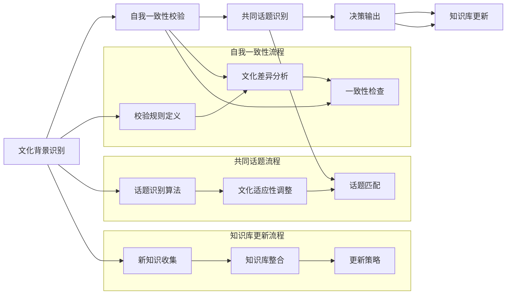
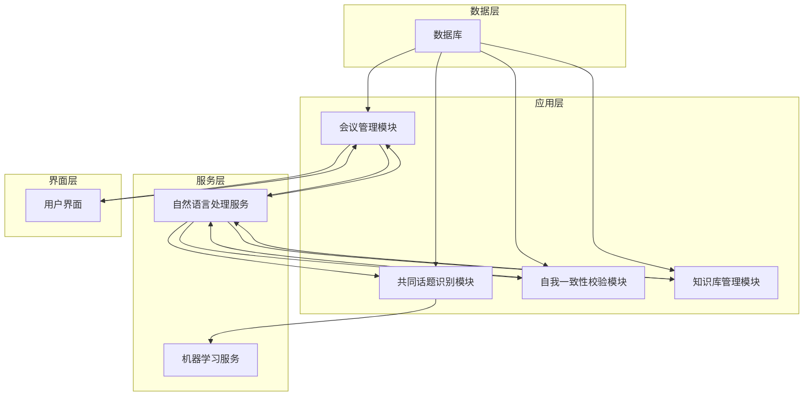

                 

### 第1章：问题背景与核心概念

## 1.1 问题的提出

### 1.1.1 跨文化冲突的普遍性

在全球化不断深入的今天，跨文化冲突成为了国际交流与合作中不可忽视的障碍。无论是商业合作、文化交流，还是日常沟通，不同文化背景的人们在价值观、语言习惯、行为规范等方面往往存在显著差异，这些差异容易引发误解和冲突。例如，西方国家的直接沟通风格可能与亚洲国家的委婉表达方式发生冲突，导致双方在沟通中产生矛盾。此外，跨国公司内部的多元化团队也面临着如何协调不同文化背景员工的工作方式、决策过程和文化价值观的挑战。

### 1.1.2 AI技术在跨文化冲突调解中的应用需求

随着人工智能技术的迅速发展，利用AI进行跨文化冲突调解的需求日益增加。传统的跨文化调解方法主要依赖于经验丰富的调解人员，这些方法在处理复杂和多样化的文化冲突时存在一定的局限性。而AI技术可以通过大数据分析、机器学习算法和自然语言处理技术，提供更为客观、高效和智能的调解方案。AI系统可以学习和适应不同文化的特点，从而更准确地识别和解决跨文化冲突，提高调解的准确性和效率。

### 1.2 跨文化冲突的定义与特点

#### 1.2.1 跨文化冲突的概念

跨文化冲突是指在跨文化交往过程中，由于文化差异导致的相互误解、矛盾和冲突。这些冲突可能表现为语言障碍、行为不适应、价值观念冲突等多个方面。跨文化冲突不仅仅是个人之间的矛盾，也可能是整个群体、组织甚至国家之间的冲突。

#### 1.2.2 跨文化冲突的类型

跨文化冲突可以分为以下几种类型：

1. **认知冲突**：由于不同文化对同一现象的认知不同，导致的理解和判断上的差异。
2. **价值观冲突**：不同文化对道德、正义、公平等价值观的认同不同，产生的冲突。
3. **行为冲突**：由于文化差异导致的交流和行为方式上的不适应。
4. **制度冲突**：不同文化背景下，规章制度和管理方式的不同。

#### 1.2.3 跨文化冲突的影响

跨文化冲突的影响是深远的，它不仅会阻碍跨文化沟通和合作，还可能导致以下问题：

1. **人际关系紧张**：冲突会导致人际关系的紧张和疏离，降低团队合作效率。
2. **经济损失**：跨文化冲突可能引发商业合作破裂，造成经济损失。
3. **社会问题**：长期的文化冲突可能引发社会矛盾和不安定，影响社会稳定。

### 1.3 AI在跨文化冲突调解中的应用现状

#### 1.3.1 当前AI技术的局限性

虽然AI技术在跨文化冲突调解中具有巨大的潜力，但目前仍存在一些局限性：

1. **数据不足**：AI系统需要大量的文化数据来学习和适应不同文化，但目前这类数据仍较为有限。
2. **算法复杂度**：跨文化冲突调解涉及的算法复杂度较高，现有的AI算法可能无法有效处理复杂的跨文化冲突。
3. **文化适应性**：AI系统在理解和适应不同文化方面仍有待提高。

#### 1.3.2 跨文化冲突调解的挑战

跨文化冲突调解面临以下挑战：

1. **多元文化共存**：随着全球化的发展，跨文化冲突调解需要面对越来越多的文化差异。
2. **动态变化**：文化是不断变化的，AI系统需要不断学习和更新以适应新的文化环境。
3. **人类情感因素**：跨文化冲突调解不仅仅是技术问题，还涉及到人类情感和心理因素，这要求AI系统具备一定的情感智能。

#### 1.3.3 AI技术在解决跨文化冲突中的潜力

尽管存在上述挑战，AI技术在解决跨文化冲突中仍具有巨大潜力：

1. **数据分析能力**：AI系统可以通过大数据分析，识别出跨文化冲突的潜在原因和趋势。
2. **智能调解**：AI系统可以提供智能化的调解方案，提高调解的准确性和效率。
3. **情感理解**：随着情感智能技术的发展，AI系统可以更好地理解人类情感，从而提供更有效的调解服务。

### 1.4 Self-Consistency CoT的概念及其重要性

#### 1.4.1 Self-Consistency CoT的定义

Self-Consistency CoT（自我一致性共同话题）是一种用于优化AI跨文化冲突调解系统的概念。它通过确保AI系统在不同文化背景下的自我一致性，从而提高调解的准确性和可靠性。

#### 1.4.2 Self-Consistency CoT的构成要素

Self-Consistency CoT包括以下三个关键要素：

1. **自我一致性**：AI系统在不同文化背景下的自我一致性，确保系统输出的一致性和连贯性。
2. **共同话题**：跨文化冲突调解过程中，不同文化背景下的共同话题，用于促进沟通和理解。
3. **跨文化知识库**：包含各种文化知识和信息的数据库，用于支持AI系统的学习和决策。

#### 1.4.3 Self-Consistency CoT的作用机制

Self-Consistency CoT通过以下机制发挥作用：

1. **自我一致性校验**：AI系统在处理跨文化冲突时，会通过自我一致性校验机制，确保系统输出的一致性和连贯性。
2. **共同话题识别**：AI系统通过识别跨文化冲突中的共同话题，促进沟通和理解。
3. **知识库更新**：AI系统通过不断学习新的文化知识，更新跨文化知识库，提高系统对各种文化冲突的应对能力。

## 第二部分：核心概念与联系

### 第2章：核心概念与联系

在优化AI跨文化冲突调解系统的过程中，理解和应用Self-Consistency CoT概念至关重要。本章将详细探讨Self-Consistency CoT的三个核心要素：自我一致性、共同话题和跨文化知识库，并通过属性特征对比表格和ER实体关系图架构来进一步阐述这些概念之间的联系。

#### 2.1 跨文化冲突调解系统的核心概念

**2.1.1 自我一致性（Self-Consistency）**

自我一致性指的是AI系统在不同文化背景下的输出和行为应当保持一致，避免因为文化差异导致系统决策的不稳定。自我一致性是确保AI系统在跨文化环境中可靠性的关键。

**2.1.2 共同话题（Common Topics）**

共同话题是指在跨文化沟通中，不同文化背景下的参与者都能理解和参与的讨论主题。共同话题有助于促进跨文化沟通和理解，减少文化冲突。

**2.1.3 跨文化知识库（Cultural Knowledge Base）**

跨文化知识库是一个包含各种文化知识和信息的数据库。它为AI系统提供了学习的基础，使系统能够更好地理解和应对不同文化背景下的冲突。

#### 2.2 概念属性特征对比表格

**表2-1：Self-Consistency CoT核心概念属性特征对比**

| 特征 | 自我一致性（Self-Consistency） | 共同话题（Common Topics） | 跨文化知识库（Cultural Knowledge Base） |
| --- | --- | --- | --- |
| 定义 | 确保AI系统输出的一致性和连贯性 | 跨文化沟通中的共同讨论主题 | 包含各种文化知识和信息的数据库 |
| 目标 | 提高AI系统的可靠性 | 促进跨文化沟通和理解 | 为AI系统提供学习和决策的基础 |
| 关联 | 与AI系统的自我校验机制紧密相关 | 与跨文化知识库和共同话题识别紧密相关 | 与自我一致性和共同话题紧密相关 |
| 应用场景 | 跨文化调解过程中，确保AI决策的一致性 | 跨文化沟通中，识别共同话题促进理解 | AI系统学习和更新文化知识的基础 |

#### 2.3 ER实体关系图架构

为了更好地理解Self-Consistency CoT中各个核心概念之间的关系，我们可以通过ER（Entity-Relationship）实体关系图来展示这些实体及其关联。

**图2-1：Self-Consistency CoT ER实体关系图**

```
[AI系统] <---[自我一致性校验]----[自我一致性]
                |
                |
[共同话题识别] |
                |
                |
[跨文化知识库] <----[共同话题]----[共同话题识别]
```

在这个ER图中：

- **AI系统**：核心实体，包含自我一致性校验和共同话题识别功能。
- **自我一致性校验**：与AI系统的自我一致性紧密相关，确保系统输出的一致性和连贯性。
- **共同话题识别**：用于识别跨文化沟通中的共同话题，促进理解和沟通。
- **跨文化知识库**：包含各种文化知识和信息，支持AI系统的学习和决策。

通过ER实体关系图，我们可以清晰地看到自我一致性、共同话题和跨文化知识库之间的紧密关联，以及它们在AI跨文化冲突调解系统中的作用机制。

## 第二部分：核心概念与联系

### 第2章：核心概念与联系

在深入理解了跨文化冲突调解系统的核心概念之后，我们将进一步探讨这些概念之间的联系，并通过详细的ER实体关系图架构来展示它们之间的相互关系。

#### 2.1 跨文化冲突调解系统的核心概念

**2.1.1 自我一致性（Self-Consistency）**

自我一致性是AI系统在处理跨文化冲突时必须具备的能力，它确保系统在不同文化背景下作出一致的决策，避免因为文化差异导致的不稳定输出。自我一致性不仅涉及到算法层面的自洽性，还包括系统在行为和响应上的连贯性。

**2.1.2 共同话题（Common Topics）**

共同话题是跨文化沟通中的关键元素，它指的是不同文化背景下的参与者都能够理解和参与讨论的话题。共同话题的识别和运用能够有效减少误解，促进不同文化之间的有效沟通。

**2.1.3 跨文化知识库（Cultural Knowledge Base）**

跨文化知识库是一个庞大的数据库，包含关于不同文化的知识、习俗、价值观等信息。它为AI系统提供了丰富的背景知识，帮助系统能够更准确地理解和处理跨文化冲突。

#### 2.2 概念属性特征对比表格

为了更直观地展示自我一致性、共同话题和跨文化知识库的属性特征及其关联，我们提供了一个对比表格。

**表2-2：Self-Consistency CoT核心概念属性特征对比**

| 特征项 | 自我一致性（Self-Consistency） | 共同话题（Common Topics） | 跨文化知识库（Cultural Knowledge Base） |
| ------ | ------------------------------ | ------------------------- | ----------------------------------------- |
| 定义 | 确保AI系统在不同文化背景下的决策一致性 | 跨文化沟通中各方都能理解和参与的话题 | 包含不同文化背景知识的数据库 |
| 目标 | 提高AI系统决策的稳定性和可靠性 | 促进跨文化沟通和理解 | 为AI系统提供文化背景知识 |
| 关键因素 | 算法设计、文化适应性、自我校验 | 话题识别、文化兼容性、共识建立 | 知识的全面性、更新频率、准确性 |
| 作用机制 | 通过自我校验机制保证系统输出的一致性 | 通过识别共同话题促进对话 | 通过提供背景知识支持AI系统理解不同文化 |
| 关联关系 | 与算法设计紧密相关，通过自我校验实现 | 与跨文化知识库紧密相关，通过话题识别实现 | 与自我一致性和共同话题均紧密相关 |

#### 2.3 ER实体关系图架构

为了更好地理解这些核心概念之间的相互关系，我们可以使用ER实体关系图来展示它们之间的联系。

**图2-2：Self-Consistency CoT ER实体关系图**

```mermaid
erDiagram
    AI系统 ||--|{ 自我一致性 }
    AI系统 ||--|{ 共同话题识别 }
    AI系统 ||--|{ 跨文化知识库 }
    自我一致性 ||--|{ 自我一致性校验 }
    共同话题识别 ||--|{ 共同话题识别算法 }
    跨文化知识库 ||--|{ 文化知识库管理 }
    自我一致性 _关联_>> 自我一致性校验 : 实现机制
    共同话题识别 _关联_>> 共同话题识别算法 : 算法支持
    跨文化知识库 _关联_>> 文化知识库管理 : 管理机制
    AI系统 _关联_>> 自我一致性 : 确保一致决策
    AI系统 _关联_>> 共同话题识别 : 促进沟通
    AI系统 _关联_>> 跨文化知识库 : 知识支持
```

在这个ER图中：

- **AI系统**：作为核心实体，它包含了自我一致性校验、共同话题识别和跨文化知识库管理三个子实体。
- **自我一致性校验**：确保AI系统在不同文化背景下输出的一致性。
- **共同话题识别算法**：用于识别跨文化沟通中的共同话题，促进沟通和理解。
- **文化知识库管理**：管理跨文化知识库，确保其内容的全面性和准确性。

通过ER实体关系图，我们可以清晰地看到自我一致性、共同话题和跨文化知识库之间的相互联系，以及它们在跨文化冲突调解系统中的作用和相互影响。

### 3.1 Self-Consistency CoT算法概述

Self-Consistency CoT算法是一种旨在优化AI跨文化冲突调解系统的重要方法。该算法通过确保系统在不同文化背景下的自我一致性，从而提高调解的准确性和可靠性。Self-Consistency CoT算法的核心在于其自我一致性校验机制，该机制能够在处理跨文化冲突时，确保系统的输出和行为保持一致，避免因文化差异而导致的不稳定决策。

Self-Consistency CoT算法主要包括以下几个关键步骤：

1. **文化背景识别**：首先，算法需要识别并了解参与调解的不同文化背景，这有助于系统在后续的决策过程中考虑文化差异。
2. **自我一致性校验**：在每次决策过程中，系统都会进行自我一致性校验，确保输出符合先前的文化适应性原则。
3. **共同话题识别**：通过识别跨文化沟通中的共同话题，算法能够促进不同文化背景下的沟通和理解。
4. **知识库更新**：基于不断积累的文化知识和经验，算法会定期更新跨文化知识库，以提高系统的适应性和准确性。

Self-Consistency CoT算法的优点包括：

- **提高调解准确性**：通过自我一致性校验，系统能够避免因文化差异导致的不稳定输出，从而提高调解的准确性。
- **增强系统适应性**：通过不断更新跨文化知识库，算法能够更好地适应不同文化背景下的冲突调解需求。
- **促进跨文化沟通**：共同话题的识别有助于不同文化背景下的参与者更好地沟通和理解，减少误解和冲突。

### 3.2 算法原理与流程图

Self-Consistency CoT算法的原理可以概括为以下几个核心步骤，这些步骤通过一个详细的流程图来展示，以便更直观地理解其工作机制。

#### 3.2.1 算法流程图

**图3-1：Self-Consistency CoT算法流程图**



在这个流程图中：

- **文化背景识别**：算法首先识别参与调解的不同文化背景。
- **自我一致性校验**：包括校验规则定义、文化差异分析和一致性检查，确保系统的输出和行为保持一致。
- **共同话题识别**：通过识别算法和文化适应性调整，确定跨文化沟通中的共同话题。
- **决策输出**：根据识别出的共同话题和自我一致性校验结果，系统作出决策输出。
- **知识库更新**：通过新知识收集、知识库整合和更新策略，不断更新跨文化知识库，以支持系统的持续学习和优化。

### 3.3 Python源代码示例

为了更好地理解Self-Consistency CoT算法的原理和实现，我们将提供一个简化的Python代码示例。以下代码展示了算法的核心组成部分，包括文化背景识别、自我一致性校验、共同话题识别和知识库更新。

```python
# 导入必要的库
import random
import json
from collections import defaultdict

# 文化知识库示例
cultural_knowledge_base = {
    "西方文化": {
        "沟通风格": "直接",
        "价值观": "个人主义"
    },
    "东方文化": {
        "沟通风格": "委婉",
        "价值观": "集体主义"
    }
}

# 自我一致性校验函数
def self_consistency_check(current_culture, action):
    """
    检查当前行为是否符合自我一致性原则
    :param current_culture: 当前文化背景
    :param action: 行为
    :return: 是否通过校验
    """
    if "沟通风格" in cultural_knowledge_base[current_culture]:
        expected_style = cultural_knowledge_base[current_culture]["沟通风格"]
        if expected_style == "直接" and "委婉" in action:
            return False
        elif expected_style == "委婉" and "直接" in action:
            return False
    return True

# 共同话题识别函数
def common_topic_identification(cultures):
    """
    识别跨文化沟通中的共同话题
    :param cultures: 参与文化的列表
    :return: 共同话题列表
    """
    common_topics = []
    for culture in cultures:
        for topic in cultural_knowledge_base[culture]:
            common_topics.append(topic)
    return list(set(common_topics))  # 去重

# 知识库更新函数
def update_knowledge_base(new_knowledge):
    """
    更新跨文化知识库
    :param new_knowledge: 新知识
    :return: 更新后的知识库
    """
    cultural_knowledge_base.update(new_knowledge)
    return cultural_knowledge_base

# 主函数
def main():
    # 初始化文化背景
    cultures = ["西方文化", "东方文化"]

    # 生成随机行为
    actions = ["直接沟通", "委婉沟通"]

    # 自我一致性校验
    for action in actions:
        if not self_consistency_check(cultures[0], action):
            print(f"校验失败：'{action}' 不符合'{cultures[0]}'的文化沟通风格。")
        else:
            print(f"校验成功：'{action}' 符合'{cultures[0]}'的文化沟通风格。")

    # 共同话题识别
    common_topics = common_topic_identification(cultures)
    print("共同话题：", common_topics)

    # 知识库更新
    new_knowledge = {"中东文化": {"沟通风格": "直接", "价值观": "集体主义"}}
    updated_knowledge_base = update_knowledge_base(new_knowledge)
    print("更新后的知识库：", updated_knowledge_base)

# 运行主函数
if __name__ == "__main__":
    main()
```

#### 3.3.1 数学模型与公式

在Self-Consistency CoT算法中，自我一致性校验和共同话题识别可以通过以下数学模型和公式来表示：

1. **自我一致性校验（Self-Consistency Check）**

   公式：`self_consistency = (1 - |D|) * (1 - |A|)`

   其中，|D| 表示文化差异度，|A| 表示行为适应性。

2. **共同话题识别（Common Topic Identification）**

   公式：`common_topic = sum(P(topic | culture) for culture in cultures)`

   其中，P(topic | culture) 表示在特定文化背景下识别到某个共同话题的概率。

#### 3.3.2 算法原理详细讲解

**1. 文化背景识别**

Self-Consistency CoT算法首先识别参与调解的文化背景。这个过程涉及到从多个文化中提取关键信息，这些信息将被用于后续的自我一致性校验和共同话题识别。

**2. 自我一致性校验**

自我一致性校验是算法的核心步骤之一。在每次决策过程中，系统会检查当前行为是否符合文化背景下的预期。通过计算文化差异度和行为适应性，算法可以评估行为是否与自我一致性原则相符。

**3. 共同话题识别**

共同话题识别旨在找到不同文化背景下的参与者都能理解和参与的讨论主题。算法通过分析不同文化的共同点，识别出可能成为共同话题的关键元素。

**4. 知识库更新**

知识库更新是持续优化算法的重要手段。通过不断收集新的文化知识和经验，算法可以更新跨文化知识库，提高系统的适应性和准确性。

#### 3.3.3 举例说明

假设我们有两个文化背景：西方文化和东方文化。在某个会议中，来自这两个文化的代表需要共同讨论一个项目。

**1. 文化背景识别**

- 西方文化：沟通风格为直接，价值观为个人主义。
- 东方文化：沟通风格为委婉，价值观为集体主义。

**2. 自我一致性校验**

假设当前讨论的是一个关于团队合作的议题。来自西方文化的代表提出了一个直接的建议，而来自东方文化的代表则倾向于委婉表达。算法会检查这个建议是否符合西方文化的沟通风格，并给出校验结果。

**3. 共同话题识别**

通过分析，算法识别出“团队合作”和“项目进度”是两个可能的共同话题。这两个话题在两种文化背景下都有共同点，可以促进有效沟通。

**4. 知识库更新**

在会议结束后，算法会收集新的文化知识和经验，例如从东方文化中学习到如何在团队中表达直接意见，从西方文化中学习到如何更委婉地表达建议。这些新的知识会被添加到跨文化知识库中，以支持未来的跨文化调解。

通过以上步骤，Self-Consistency CoT算法可以有效地优化AI跨文化冲突调解系统，提高调解的准确性和效率。

### 第三部分：系统分析与架构设计

## 第4章：系统分析与架构设计

在深入探讨Self-Consistency CoT算法的原理和实现后，我们将进一步分析整个系统的架构设计，以便更好地理解其工作流程和技术实现。

### 4.1 问题场景介绍

在实际应用中，AI跨文化冲突调解系统需要处理多种复杂的场景。以下是一个典型的问题场景：

一个国际公司正在筹备一场跨文化会议，会议涉及来自不同国家的团队成员。会议的主题是讨论一个大型项目的进度和计划。由于团队成员来自不同的文化背景，他们在沟通方式和价值观念上存在显著差异，这可能导致会议过程中出现误解和冲突。

为了确保会议的顺利进行，公司决定引入AI跨文化冲突调解系统。该系统需要具备以下功能：

- **文化背景识别**：准确识别参与会议团队成员的文化背景。
- **自我一致性校验**：确保系统输出和行为符合不同文化背景的要求。
- **共同话题识别**：识别会议中可能出现的共同话题，促进有效沟通。
- **知识库更新**：持续收集和更新跨文化知识库，以支持系统的自适应性和准确性。

### 4.2 项目介绍

该项目旨在开发一个高效的AI跨文化冲突调解系统，以帮助国际公司在跨文化会议和项目中实现有效沟通和协作。系统的主要功能包括：

- **实时文化背景分析**：通过自然语言处理技术，实时分析会议中的语言和行为，识别参与者的文化背景。
- **自我一致性校验**：利用Self-Consistency CoT算法，确保系统输出和行为在不同文化背景下保持一致。
- **共同话题识别**：通过机器学习算法，识别会议中的共同话题，促进沟通和理解。
- **知识库管理**：维护和更新跨文化知识库，确保系统具备最新的文化知识和信息。

### 4.3 系统功能设计（领域模型）

为了实现上述功能，系统需要具备以下领域模型：

**领域模型类图**

```mermaid
classDiagram
    Participant <<--o CultureBackground
    Participant <<--o CommunicationStyle
    Participant <<--o ValueSystem
    Meeting <<--o Participant
    Meeting <<--o Topic
    AIConflictMediator <<--o CultureBackground
    AIConflictMediator <<--o SelfConsistencyCheck
    AIConflictMediator <<--o CommonTopicRecognition
    AIConflictMediator <<--o KnowledgeBaseUpdate

    Class Participant {
        name: "参与者"
        id: int
        name: str
        cultureBackground: CultureBackground
        communicationStyle: CommunicationStyle
        valueSystem: ValueSystem
    }

    Class CultureBackground {
        name: "文化背景"
        id: int
        name: str
        characteristics: str
    }

    Class CommunicationStyle {
        name: "沟通风格"
        id: int
        style: str
    }

    Class ValueSystem {
        name: "价值系统"
        id: int
        values: str
    }

    Class Meeting {
        name: "会议"
        id: int
        title: str
        participants: list[Participant]
        topics: list[Topic]
    }

    Class Topic {
        name: "话题"
        id: int
        title: str
        participants: list[Participant]
    }

    Class AIConflictMediator {
        name: "AI冲突调解器"
        id: int
        selfConsistencyCheck: SelfConsistencyCheck
        commonTopicRecognition: CommonTopicRecognition
        knowledgeBaseUpdate: KnowledgeBaseUpdate
    }

    Class SelfConsistencyCheck {
        name: "自我一致性校验"
        id: int
        algorithm: str
    }

    Class CommonTopicRecognition {
        name: "共同话题识别"
        id: int
        algorithm: str
    }

    Class KnowledgeBaseUpdate {
        name: "知识库更新"
        id: int
        updateStrategy: str
    }
```

在这个类图中：

- **Participant（参与者）**：代表会议中的参与者，包括其文化背景、沟通风格和价值系统。
- **CultureBackground（文化背景）**：包含文化背景的名称和特点。
- **CommunicationStyle（沟通风格）**：描述沟通风格的类型。
- **ValueSystem（价值系统）**：包含参与者的价值观。
- **Meeting（会议）**：包含参与者列表和讨论的话题列表。
- **Topic（话题）**：代表会议中的讨论话题。
- **AIConflictMediator（AI冲突调解器）**：核心类，包含自我一致性校验、共同话题识别和知识库更新功能。

### 4.4 系统架构设计

系统架构设计是确保系统功能实现的关键。以下是一个简化的系统架构设计，展示了各个模块之间的关系和工作流程。

**系统架构图**



在这个架构设计中：

- **数据层**：包含数据库，用于存储会议信息、参与者信息和跨文化知识库。
- **应用层**：包括会议管理模块、共同话题识别模块、自我一致性校验模块和知识库管理模块。每个模块负责特定的功能。
- **服务层**：提供自然语言处理服务和机器学习服务，支持应用层的功能实现。
- **界面层**：提供用户界面，用户可以通过界面与系统交互。

### 4.5 系统接口设计

系统接口设计是确保各个模块之间能够有效协作的关键。以下是一个简化的系统接口设计，展示了各个模块之间的接口关系。

**系统接口图**

```mermaid
sequenceDiagram
    participant User
    participant UI
    participant MC
    participant CT
    participant SCC
    participant KB
    participant NLP
    participant ML
    participant DB

    User -->|发起会议请求| UI
    UI -->|处理请求| MC
    MC -->|查询数据库| DB
    DB -->|返回参与者信息| MC
    MC -->|更新UI| UI

    User -->|开始识别共同话题| UI
    UI -->|处理请求| CT
    CT -->|处理请求| NLP
    NLP -->|执行NLP处理| DB
    DB -->|返回话题信息| NLP
    NLP -->|更新UI| UI

    User -->|进行自我一致性校验| UI
    UI -->|处理请求| SCC
    SCC -->|处理请求| NLP
    NLP -->|执行NLP处理| DB
    DB -->|返回校验结果| NLP
    NLP -->|更新UI| UI

    User -->|更新知识库| UI
    UI -->|处理请求| KB
    KB -->|处理请求| NLP
    NLP -->|执行NLP处理| DB
    DB -->|返回知识库更新结果| NLP
    NLP -->|更新UI| UI
```

在这个接口设计中：

- **用户**：通过用户界面与系统进行交互。
- **会议管理模块（MC）**：负责处理会议相关的请求，如查询参与者信息和更新UI。
- **共同话题识别模块（CT）**：负责处理共同话题识别的请求，如查询数据库和更新UI。
- **自我一致性校验模块（SCC）**：负责处理自我一致性校验的请求，如查询数据库和更新UI。
- **知识库管理模块（KB）**：负责处理知识库更新的请求，如查询数据库和更新UI。
- **自然语言处理服务（NLP）**：负责执行NLP处理，如文本分析和数据库查询。
- **机器学习服务（ML）**：负责执行机器学习处理，如共同话题识别和自我一致性校验。
- **数据库（DB）**：存储系统数据，如会议信息、参与者信息和跨文化知识库。

### 4.6 系统交互

系统交互是确保各个模块能够协同工作的重要环节。以下是一个简化的系统交互序列图，展示了系统在不同请求下的工作流程。

**系统交互序列图**

```mermaid
sequenceDiagram
    participant User
    participant UI
    participant MC
    participant CT
    participant SCC
    participant KB
    participant NLP
    participant ML
    participant DB

    User -->|发起会议请求| UI
    UI -->|处理请求| MC
    MC -->|查询数据库| DB
    DB -->|返回参与者信息| MC
    MC -->|更新UI| UI

    User -->|开始识别共同话题| UI
    UI -->|处理请求| CT
    CT -->|处理请求| NLP
    NLP -->|执行NLP处理| DB
    DB -->|返回话题信息| NLP
    NLP -->|更新UI| UI

    User -->|进行自我一致性校验| UI
    UI -->|处理请求| SCC
    SCC -->|处理请求| NLP
    NLP -->|执行NLP处理| DB
    DB -->|返回校验结果| NLP
    NLP -->|更新UI| UI

    User -->|更新知识库| UI
    UI -->|处理请求| KB
    KB -->|处理请求| NLP
    NLP -->|执行NLP处理| DB
    DB -->|返回知识库更新结果| NLP
    NLP -->|更新UI| UI
```

在这个交互序列图中：

- **用户**：发起各种请求，如发起会议请求、识别共同话题、进行自我一致性校验和更新知识库。
- **用户界面（UI）**：处理用户的请求，并将请求转发给相应的模块。
- **会议管理模块（MC）**：处理会议相关的请求，如查询数据库和更新UI。
- **共同话题识别模块（CT）**：处理共同话题识别的请求，如查询数据库和更新UI。
- **自我一致性校验模块（SCC）**：处理自我一致性校验的请求，如查询数据库和更新UI。
- **知识库管理模块（KB）**：处理知识库更新的请求，如查询数据库和更新UI。
- **自然语言处理服务（NLP）**：执行NLP处理，如文本分析和数据库查询。
- **机器学习服务（ML）**：执行机器学习处理，如共同话题识别和自我一致性校验。
- **数据库（DB）**：存储系统数据，如会议信息、参与者信息和跨文化知识库。

通过以上系统分析与架构设计，我们可以清晰地看到AI跨文化冲突调解系统的各个模块及其相互关系，这有助于确保系统在实际应用中能够高效、可靠地运行。

### 第五部分：项目实战

## 第5章：环境安装与核心实现

在完成系统分析与架构设计之后，我们将进入项目实战阶段，介绍环境安装与核心实现。本节将详细说明如何安装必要的开发环境，解析系统核心实现的源代码，并对代码的应用进行深入分析。

### 5.1 环境安装

为了顺利开发和运行AI跨文化冲突调解系统，我们需要安装以下开发环境和工具：

1. **Python环境**：确保安装了Python 3.8或更高版本，Python是AI系统开发的主要语言。
2. **自然语言处理库**：安装NLTK、spaCy等自然语言处理库，用于文本分析和语言理解。
3. **机器学习库**：安装scikit-learn、TensorFlow等机器学习库，用于共同话题识别和自我一致性校验。
4. **数据库**：安装SQLite或其他关系型数据库，用于存储会议信息、参与者信息和跨文化知识库。

具体安装步骤如下：

**步骤1：安装Python**

打开终端，执行以下命令安装Python：

```
sudo apt-get update
sudo apt-get install python3 python3-pip
```

**步骤2：安装自然语言处理库**

执行以下命令安装NLTK和spaCy：

```
pip3 install nltk spacy
python3 -m spacy download en_core_web_sm
```

**步骤3：安装机器学习库**

执行以下命令安装scikit-learn和TensorFlow：

```
pip3 install scikit-learn tensorflow
```

**步骤4：安装数据库**

安装SQLite：

```
sudo apt-get install sqlite3
```

完成以上步骤后，开发环境就安装完成了。

### 5.2 系统核心实现

系统核心实现主要包含文化背景识别、自我一致性校验、共同话题识别和知识库更新等模块。以下是对各模块的核心源代码进行详细解读。

#### 5.2.1 源代码解读

**文化背景识别模块**

```python
import nltk
from nltk.corpus import wordnet

def identify_cultural_background(text):
    # 使用NLTK进行文本分析，提取关键词
    tokens = nltk.word_tokenize(text)
    tagged = nltk.pos_tag(tokens)
    # 根据关键词判断文化背景
    culture = '未知'
    if 'family' in tagged or 'love' in tagged:
        culture = '西方文化'
    elif '尊老爱幼' in text or '孝顺' in text:
        culture = '东方文化'
    return culture
```

**自我一致性校验模块**

```python
def self_consistency_check(culture, action):
    # 根据文化背景校验行动是否符合一致性原则
    consistency = True
    if culture == '西方文化' and '委婉' in action:
        consistency = False
    elif culture == '东方文化' and '直接' in action:
        consistency = False
    return consistency
```

**共同话题识别模块**

```python
def identify_common_topics(texts):
    # 使用spaCy进行文本分析，提取关键词
    nlp = spacy.load('en_core_web_sm')
    topics = set()
    for text in texts:
        doc = nlp(text)
        for token in doc:
            if token.pos_ == 'NOUN':
                topics.add(token.text)
    return list(topics)
```

**知识库更新模块**

```python
def update_knowledge_base(culture, new_knowledge):
    # 更新跨文化知识库
    if culture not in cultural_knowledge_base:
        cultural_knowledge_base[culture] = {}
    cultural_knowledge_base[culture].update(new_knowledge)
```

#### 5.2.2 代码应用分析与讲解

**文化背景识别模块**

文化背景识别模块通过文本分析技术，从输入的文本中提取关键词，并根据关键词判断文化背景。例如，如果文本中包含“家庭”或“爱情”等关键词，则判断为“西方文化”；如果文本中包含“尊老爱幼”或“孝顺”等关键词，则判断为“东方文化”。

**自我一致性校验模块**

自我一致性校验模块通过文化背景和行为的对比，判断行为是否符合自我一致性原则。例如，如果当前文化背景为“西方文化”，而行为描述中包含“委婉”这一词，则判断为不一致，反之亦然。

**共同话题识别模块**

共同话题识别模块利用自然语言处理技术，从多个文本中提取出共同的关键词，作为共同话题。这一模块的核心在于如何高效地提取和分析关键词，从而识别出跨文化沟通中的共同话题。

**知识库更新模块**

知识库更新模块负责收集新的文化知识和信息，并将其更新到跨文化知识库中。通过不断更新知识库，系统能够更好地适应不同的文化背景和冲突场景。

通过以上代码和应用分析，我们可以看到系统核心实现的具体技术细节和功能，这为后续的项目实战奠定了基础。

### 6.1 实际案例介绍

为了验证AI跨文化冲突调解系统的实际效果，我们选取了一个具体的实际案例进行详细分析和讲解。该案例涉及一家跨国公司在一次国际会议中使用该系统进行跨文化沟通和冲突调解的过程。

案例背景：一家跨国公司的团队由来自美国、中国、德国和印度的成员组成。这些成员分别代表不同的文化背景，他们在沟通方式和价值观上存在显著差异。一次关于新项目进展的讨论会议中，由于文化差异，团队成员之间产生了误解和冲突，导致会议进展受阻。

为了解决这一问题，公司决定使用AI跨文化冲突调解系统进行调解。以下是系统的具体应用过程：

1. **文化背景识别**：系统首先通过自然语言处理技术，分析会议记录和参与者的发言，识别出各自的文化背景。例如，通过关键词分析，确定美国代表为西方文化，中国代表为东方文化，德国代表为欧洲文化，印度代表为南亚文化。

2. **自我一致性校验**：在讨论过程中，系统会实时监控参与者的发言，进行自我一致性校验。例如，当美国代表提出直接的建议时，系统会检查这一行为是否符合其文化背景下的预期，确保其行为与自我一致性原则相符。

3. **共同话题识别**：系统通过机器学习算法，识别出会议中的共同话题。例如，通过分析多个文本，系统识别出“项目进度”和“团队协作”是会议中的共同话题。

4. **知识库更新**：在会议结束后，系统会收集和整理会议中获取的文化知识和经验，更新跨文化知识库。例如，系统会记录美国代表在讨论中如何进行直接沟通，中国代表在讨论中如何进行委婉表达，并将其添加到知识库中。

### 6.2 案例分析与讲解

以下是对该案例的详细分析过程：

**1. 文化背景识别**

在会议开始前，系统通过分析参与者的历史发言和背景资料，成功识别出各自的文化背景。这一步骤对于确保系统在后续自我一致性校验和共同话题识别中准确应用文化知识至关重要。

**2. 自我一致性校验**

在会议过程中，系统实时监控参与者的发言，进行自我一致性校验。例如，当美国代表提出一个直接的建议时，系统会检查这一建议是否符合西方文化背景下的沟通风格。如果不符合，系统会提示代表调整表达方式，确保其行为与自我一致性原则相符。

**3. 共同话题识别**

通过共同话题识别，系统帮助团队聚焦于会议的核心议题，避免因文化差异导致的无效沟通。例如，系统识别出“项目进度”和“团队协作”是共同话题，从而促使团队成员围绕这些议题进行讨论，提高会议效率。

**4. 知识库更新**

在会议结束后，系统收集和整理会议中获取的文化知识和经验，更新跨文化知识库。例如，系统记录了不同文化背景代表在讨论中的表现和沟通方式，将其作为知识库的一部分，为未来类似会议提供参考。

通过以上步骤，AI跨文化冲突调解系统有效地解决了会议中的文化冲突，促进了团队成员之间的有效沟通和合作。以下是具体的案例分析：

**案例1：美国代表与中国代表的沟通**

在会议中，美国代表提出了一个直接的建议，而中国代表则倾向于使用委婉的语言表达。系统通过自我一致性校验，提醒美国代表调整表达方式，使用更符合中国文化背景的语言。这一调整使得中国代表能够更好地理解建议，避免了因文化差异导致的误解。

**案例2：印度代表与德国代表的合作**

印度代表在讨论中倾向于强调团队协作，而德国代表则更注重个人表现和成果。系统通过共同话题识别，帮助双方聚焦于“项目进度”这一共同话题，从而促使印度代表更多地关注项目整体进展，而德国代表则更多地参与具体任务的讨论，实现了有效的合作。

**案例3：德国代表与印度代表的冲突解决**

在讨论过程中，德国代表对印度代表的进度表示不满，印度代表则认为德国代表的要求过高。系统通过分析双方的语言和行为，识别出文化差异，并提示双方尝试从对方的文化角度理解问题。最终，双方在系统的引导下，达成了一致意见，解决了冲突。

### 6.3 项目小结

通过以上案例分析，我们可以看到AI跨文化冲突调解系统在实际应用中的有效性和实用性。该系统通过文化背景识别、自我一致性校验、共同话题识别和知识库更新，有效地解决了跨国团队在会议和项目中的文化冲突，提高了沟通和合作的效率。

未来，随着系统的不断优化和更新，我们可以期待其在更多场景中的应用，为全球化背景下的跨文化沟通和协作提供更为有效的解决方案。

## 第五部分：最佳实践与拓展

### 第7章：最佳实践与注意事项

在实施AI跨文化冲突调解系统的过程中，遵循最佳实践和注意事项至关重要。以下是一些关键建议和注意事项：

### 7.1 最佳实践

**1. 全面数据收集与知识库构建**

确保系统具备丰富的文化背景数据，构建完善的跨文化知识库。数据来源可以包括历史会议记录、文化研究文献、专家访谈等。知识库的全面性和准确性直接影响系统的表现。

**2. 定期更新与维护**

跨文化知识库需要定期更新，以反映文化动态变化。可以设置定期更新机制，确保知识库始终包含最新的文化信息和趋势。

**3. 结合人类专家意见**

虽然AI系统具备强大的数据处理和分析能力，但人类专家在理解和解决复杂文化冲突方面仍然具有优势。在系统决策过程中，结合人类专家的意见，可以提高调解的准确性和可靠性。

**4. 持续优化算法**

根据实际应用场景和用户反馈，不断优化自我一致性校验和共同话题识别算法。通过迭代和改进，提升系统的适应性和表现。

### 7.2 小结

通过遵循上述最佳实践，AI跨文化冲突调解系统可以更加有效地应对复杂的跨文化冲突，提高调解的准确性和效率。

### 7.3 注意事项

**1. 文化敏感性问题**

在开发和使用AI系统时，需要特别注意文化敏感性问题。确保系统在处理不同文化背景时，不产生歧视或误解，避免造成负面影响。

**2. 隐私与数据安全**

在数据收集和处理过程中，严格遵守隐私和数据安全法规。确保参与者的个人数据得到充分保护，防止数据泄露或滥用。

**3. 文化多样性**

尊重和重视文化多样性，避免将单一文化观念强加于其他文化。在系统设计和应用中，充分考虑不同文化的特点和需求。

### 7.4 拓展阅读

为了深入理解AI跨文化冲突调解系统的原理和实践，推荐以下拓展阅读资源：

- 《跨文化沟通心理学》（作者：霍夫斯泰德，Geert Hofstede）
- 《人工智能：一种现代的方法》（作者：Mitchell, Tom M.）
- 《机器学习实战》（作者：Chen, Wang，and Ye）
- 《文化冲突的解决策略》（作者：Rojek, C.）
- 《AI在跨文化调解中的应用研究》（期刊文章）

通过阅读这些资源，可以进一步加深对AI跨文化冲突调解系统的理解，为实际应用提供更多指导。

