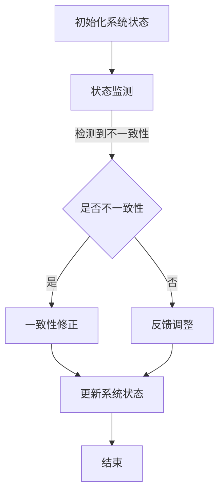
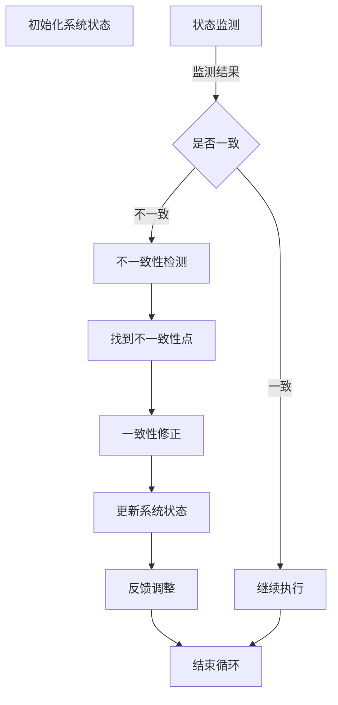
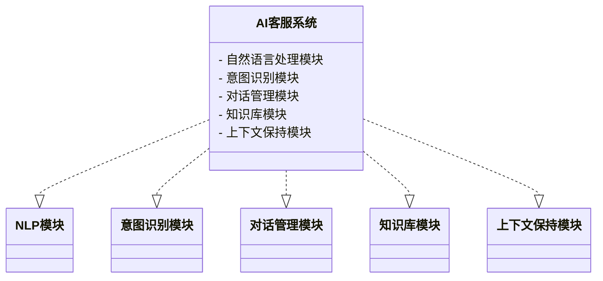
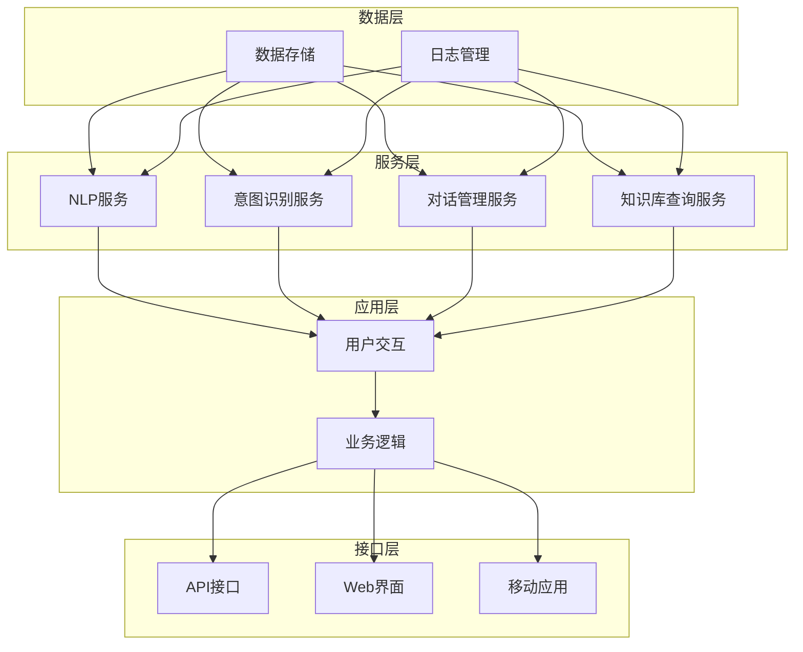
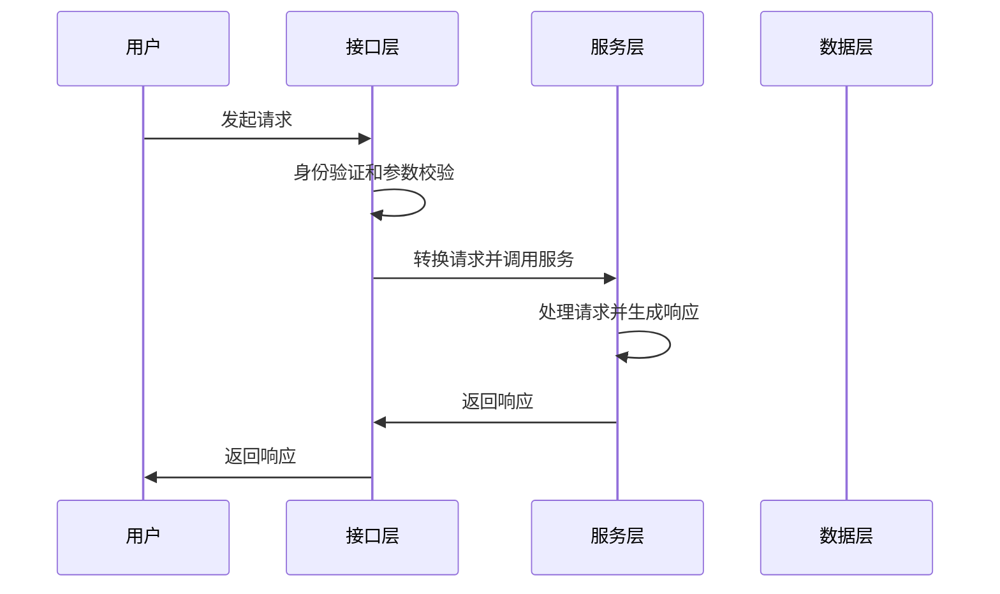

                 


### 引言

在当今信息技术飞速发展的时代，人工智能（AI）已经渗透到我们日常生活的方方面面，从智能手机的语音助手，到自动驾驶汽车，再到复杂的金融分析和医疗诊断，AI正以前所未有的速度改变着世界。作为AI技术的应用之一，AI客服系统在提升企业服务效率和用户体验方面发挥着至关重要的作用。

然而，随着AI客服系统的广泛应用，一个关键问题也逐渐显现出来：如何确保AI客服系统提供的服务始终一致、准确且可靠？这里，我们引入了一个重要的概念——Self-Consistency CoT（自一致性概念），并探讨它在AI客服系统中的实践。

本文将围绕以下几个核心问题展开讨论：

1. **自一致性概念（CoT）的起源和定义**：我们将介绍自一致性概念的基本概念，并解释它在AI客服系统中的重要性。
2. **核心概念与联系**：通过比较自一致性概念与其他相关概念，我们旨在帮助读者更好地理解其在AI客服系统中的应用。
3. **算法原理讲解**：我们将详细阐述自一致性概念（CoT）的算法原理，并通过mermaid流程图和Python代码示例，使其通俗易懂。
4. **数学模型和公式**：我们将介绍自一致性概念（CoT）所涉及的数学模型和公式，并通过实际例子进行解释。
5. **系统分析与架构设计方案**：我们将分析AI客服系统的功能需求，并设计出符合自一致性要求的系统架构。
6. **项目实战**：我们将通过一个实际项目，展示如何将自一致性概念（CoT）应用于AI客服系统中。
7. **最佳实践 tips**：最后，我们将总结本文的核心观点，并提供一些实用的最佳实践建议。

通过本文的探讨，我们希望读者能够对自一致性概念（CoT）在AI客服系统中的应用有一个全面而深入的理解，从而在实际项目中能够更好地运用这一概念，提升AI客服系统的整体性能和用户体验。

### 关键词

- **自一致性概念（CoT）**
- **AI客服系统**
- **算法原理**
- **数学模型**
- **系统架构设计**
- **项目实战**
- **最佳实践 tips**

### 摘要

本文旨在探讨Self-Consistency CoT（自一致性概念）在AI客服系统中的实践。自一致性概念是一个确保AI系统输出一致、准确和可靠的重要工具。通过详细的算法原理讲解、数学模型和公式介绍，以及系统架构设计和项目实战案例分析，本文展示了如何将自一致性概念应用于AI客服系统，以提高其服务质量和用户体验。通过本文的探讨，读者将能够深入理解自一致性概念的重要性，并在实际项目中运用这一概念，提升AI客服系统的整体性能。

### 第一部分：背景介绍

#### 第1章：问题背景

随着全球信息化和数字化进程的加速，企业服务面临着前所未有的挑战和机遇。传统的客户服务方式已经难以满足用户对高效、个性化和实时响应的需求，这使得AI客服系统应运而生。AI客服系统通过自然语言处理、机器学习等技术，能够自动识别和响应客户的查询，极大地提高了客户服务的效率和满意度。

然而，AI客服系统的广泛应用也带来了一系列问题。首先，如何确保AI客服系统提供的服务始终一致、准确且可靠？由于AI客服系统依赖于大量的数据和学习算法，其输出结果可能会受到数据质量和算法准确性的影响，导致同一问题在不同时间、不同环境下得到不同的回答，从而影响用户体验。其次，如何在复杂多变的环境中保持AI客服系统的稳定性和可扩展性，也是一个亟待解决的问题。

自一致性概念（CoT）正是在这样的背景下提出的。自一致性概念是指系统在执行任务时，其内部状态和外部输出保持一致，不产生矛盾和错误。在AI客服系统中，自一致性概念的作用在于确保系统在处理客户查询时，能够始终保持一致的响应，不会因为外部环境或内部状态的变化而出现错误或矛盾。

为了更好地理解自一致性概念在AI客服系统中的重要性，我们可以从以下几个方面进行探讨：

1. **问题背景**：随着AI客服系统的广泛应用，其一致性和可靠性变得愈发重要。自一致性概念作为一种确保系统输出一致性的方法，可以有效地解决这一问题。
2. **问题描述**：AI客服系统在处理客户查询时，可能会因为数据质量、算法准确性和环境变化等因素，导致输出结果不一致。自一致性概念通过确保系统内部状态和外部输出的一致性，解决了这一问题。
3. **问题解决**：自一致性概念通过设计一系列算法和策略，确保AI客服系统在处理客户查询时，能够始终保持一致的响应，从而提高系统的可靠性和用户体验。
4. **边界与外延**：自一致性概念不仅适用于AI客服系统，还可以应用于其他需要确保一致性的AI系统，如自动驾驶、智能医疗诊断等。
5. **概念结构与核心要素组成**：自一致性概念的核心包括一致性算法、状态监测和反馈机制等，这些要素共同作用，确保系统输出的一致性和可靠性。

通过以上探讨，我们可以看到，自一致性概念在AI客服系统中的重要性不言而喻。它不仅能够提高系统的可靠性，还能够提升用户体验，为企业带来更高的价值。在接下来的章节中，我们将深入探讨自一致性概念的定义、算法原理、数学模型和实际应用，帮助读者更好地理解这一概念，并在实际项目中运用。

#### 第2章：核心概念与联系

在深入探讨自一致性概念（CoT）在AI客服系统中的应用之前，我们需要对其定义进行明确的阐述，并与其他相关概念进行比较和分析。

**2.1 自一致性概念（CoT）的定义**

自一致性概念（CoT），即Self-Consistency Concept，是指在一个系统内部，所有组件和过程都保持一致的状态，从而确保系统的输出在给定输入条件下是稳定且可预测的。具体来说，自一致性包括以下几个方面：

1. **内部状态一致性**：系统内部各个组件的状态在执行过程中保持一致，不会出现相互矛盾的情况。
2. **输入输出一致性**：系统对相同输入产生相同的输出，即使在不同的时间或环境下。
3. **动态一致性**：系统能够根据外部环境的变化进行自适应调整，保持内部状态和外部输出的一致性。

**2.2 自一致性概念在AI客服系统中的应用**

在AI客服系统中，自一致性概念的应用主要体现在以下几个方面：

1. **对话一致性**：确保在用户对话过程中，AI客服系统能够提供一致、流畅的回答，避免出现答非所问或自相矛盾的情况。
2. **知识库一致性**：确保AI客服系统的知识库在更新和扩展过程中，保持内容的一致性和准确性，避免出现信息冲突或错误。
3. **性能一致性**：确保AI客服系统在不同的硬件环境、网络条件或负载情况下，能够保持稳定的性能表现。

**2.3 自一致性概念与其他相关概念的对比**

在讨论自一致性概念时，我们还需要与其他相关概念进行对比，以帮助读者更好地理解其独特性和应用场景。

1. **一致性（Consistency）**

一致性是指系统在数据存储和处理过程中，保持数据状态的统一性。在分布式系统中，一致性是一个核心问题。自一致性概念与一致性概念在本质上有一定的联系，但前者更加注重系统内部状态和外部输出的协调，而后者更侧重于数据的稳定性和准确性。

2. **可靠性（Reliability）**

可靠性是指系统在规定时间内能够正常运行的概率。自一致性概念是确保系统可靠性的重要手段之一，但可靠性还包括系统的稳定性、容错性和可恢复性等多个方面。因此，自一致性是系统可靠性的一部分，但不是全部。

3. **安全性（Security）**

安全性是指系统在抵御外部威胁、保护数据隐私和防止未授权访问等方面的能力。自一致性概念与安全性有密切的联系，因为系统内部状态和外部输出的不一致可能导致安全漏洞。例如，AI客服系统在处理敏感信息时，需要确保其输出的一致性和安全性。

4. **鲁棒性（Robustness）**

鲁棒性是指系统能够在面临异常输入、环境变化或硬件故障时，仍然能够稳定运行的能力。自一致性概念有助于提高系统的鲁棒性，因为通过保持系统内部状态和外部输出的协调，系统能够更好地应对外部干扰和内部错误。

**2.4 自一致性概念的结构与核心要素**

自一致性概念由以下几个核心要素组成：

1. **一致性算法**：用于监测系统内部状态和外部输出的一致性，并在不一致时进行修正。
2. **状态监测机制**：实时监控系统的状态变化，确保系统能够快速检测到不一致性。
3. **反馈机制**：通过反馈机制，将监测结果传递给系统，并指导系统进行自适应调整。

通过以上对自一致性概念的深入分析和与其他相关概念的对比，我们可以看到，自一致性概念在AI客服系统中的重要性不言而喻。它不仅能够提高系统的可靠性、性能和安全性，还能够提升用户体验，为企业创造更大的价值。在接下来的章节中，我们将进一步探讨自一致性概念的具体算法原理、数学模型和实际应用，帮助读者更深入地理解这一概念，并在实际项目中运用。

#### 第3章：算法原理讲解

在理解了自一致性概念的基本定义和应用后，我们接下来将深入探讨自一致性概念（CoT）的算法原理，并通过mermaid流程图和Python代码示例，使其通俗易懂。

**3.1 自一致性概念（CoT）的算法原理**

自一致性概念（CoT）的核心在于通过一系列算法和策略，确保系统内部状态和外部输出的一致性。具体来说，自一致性算法通常包括以下几个关键步骤：

1. **状态监测**：实时监测系统内部各个组件的状态，确保其处于一致性状态。
2. **不一致性检测**：当系统内部出现状态不一致时，进行检测和识别。
3. **一致性修正**：通过修正算法，将系统内部状态调整至一致性状态。
4. **反馈调整**：将一致性状态反馈给系统，指导系统进行后续的调整和优化。

以下是一个简化的mermaid流程图，展示自一致性算法的基本流程：



**3.2 自一致性概念（CoT）算法的mermaid流程图**

为了更好地理解自一致性算法的工作流程，我们可以通过mermaid流程图进行可视化展示：



**3.3 自一致性概念（CoT）算法的Python实现与讲解**

下面是一个简单的Python代码示例，用于实现自一致性概念的基本算法：

```python
import random

# 初始化系统状态
system_state = {
    'temperature': 20,
    'humidity': 50,
    'light': 'off'
}

def monitor_state(state):
    """监测系统状态，返回是否一致"""
    # 这里可以加入复杂的监测逻辑
    return True

def detect_inconsistency(state):
    """检测不一致性，返回不一致性点"""
    # 模拟可能的不一致性
    if random.random() > 0.9:
        return 'temperature'
    return None

def correct_inconsistency(state, inconsistency):
    """修正不一致性"""
    if inconsistency == 'temperature':
        state['temperature'] += 10
    return state

def feedback_adjustment(state):
    """反馈调整"""
    # 这里可以加入反馈调整的逻辑
    pass

def self_consistency_algorithm(state):
    """自一致性算法"""
    while True:
        if not monitor_state(state):
            inconsistency = detect_inconsistency(state)
            if inconsistency:
                state = correct_inconsistency(state, inconsistency)
                feedback_adjustment(state)
        else:
            break
    return state

# 运行自一致性算法
final_state = self_consistency_algorithm(system_state)
print("最终系统状态：", final_state)
```

在这个示例中，我们初始化了一个系统状态，并定义了状态监测、不一致性检测、一致性修正和反馈调整等函数。通过循环运行自一致性算法，我们最终得到一个一致的系统状态。

**3.4 自一致性概念（CoT）算法的数学模型**

为了更深入地理解自一致性概念，我们可以将其抽象为一个数学模型。一个简单的自一致性数学模型可以表示为：

$$
S_{new} = f(S_{current}, I_{in})
$$

其中，$S$ 表示系统状态，$I_{in}$ 表示外部输入，$f$ 表示一致性修正函数。具体来说：

- $S_{current}$：当前系统状态。
- $I_{in}$：外部输入（如传感器数据、用户请求等）。
- $f$：一致性修正函数，用于根据当前系统状态和外部输入，修正系统状态。

通过上述数学模型，我们可以看到，自一致性概念的核心在于通过函数$f$，确保系统状态$S_{current}$ 和外部输入$I_{in}$ 的一致性。

**3.5 自一致性概念（CoT）算法的实际例子**

为了更好地理解自一致性算法的实际应用，我们可以通过一个实际例子进行说明。

假设我们有一个智能恒温系统，其功能是根据室内温度和用户设定的温度，自动调节空调。在这个过程中，自一致性概念确保系统的输出（空调的开关状态）与输入（室内温度和用户设定温度）保持一致。

1. **初始化系统状态**：室内温度为20℃，用户设定的温度为23℃。
2. **状态监测**：系统监测到当前室内温度低于用户设定温度。
3. **不一致性检测**：系统检测到当前状态不一致，需要修正。
4. **一致性修正**：系统根据设定的温度，调整空调至开启状态。
5. **反馈调整**：系统监测到室内温度上升至23℃，确认状态一致。

通过这个例子，我们可以看到，自一致性算法在实际应用中，能够有效地确保系统输出与输入的一致性，从而提高系统的可靠性和用户体验。

通过以上对自一致性概念（CoT）算法原理的详细讲解，以及mermaid流程图和Python代码示例，我们可以更好地理解这一概念的核心原理和实际应用。在接下来的章节中，我们将继续探讨自一致性概念在AI客服系统中的数学模型和实际应用，帮助读者更深入地理解这一概念。

#### 第4章：数学模型和公式

在了解了自一致性概念（CoT）的算法原理后，我们将进一步探讨其在AI客服系统中的数学模型和公式，并通过具体的例子进行解释。

**4.1 自一致性概念（CoT）的数学模型**

自一致性概念（CoT）的数学模型可以描述为一个动态系统，该系统的状态随时间变化，并且受到外部输入的影响。一个简单的自一致性模型可以用以下数学公式表示：

$$
S_{t+1} = f(S_{t}, I_{t})
$$

其中：
- $S_t$：在时间 $t$ 的系统状态。
- $I_t$：在时间 $t$ 的外部输入。
- $f$：一致性修正函数，用于根据当前系统状态和外部输入，修正系统状态。

一致性修正函数 $f$ 可以表示为：

$$
f(S, I) = S + \alpha (I - S)
$$

其中：
- $\alpha$：调整参数，用于控制系统状态向外部输入的趋近速度。

这个模型的核心思想是通过调整参数 $\alpha$，确保系统状态 $S$ 与外部输入 $I$ 之间的一致性。

**4.2 自一致性概念（CoT）算法的数学公式讲解**

为了更好地理解一致性修正函数 $f$，我们可以通过以下几个步骤进行讲解：

1. **初始状态设定**：假设系统初始状态为 $S_0$，外部输入为 $I_0$。
2. **一致性修正计算**：在时间 $t$，系统状态为 $S_t$，外部输入为 $I_t$。根据一致性修正函数，我们可以计算出新的系统状态 $S_{t+1}$：
   $$ S_{t+1} = f(S_t, I_t) = S_t + \alpha (I_t - S_t) $$
3. **状态调整**：通过上述公式，我们可以看到，新的系统状态 $S_{t+1}$ 会在当前状态 $S_t$ 和外部输入 $I_t$ 之间进行调整，以趋向于外部输入。

**4.3 自一致性概念（CoT）算法的数学公式示例**

为了更直观地理解自一致性模型，我们可以通过一个具体的例子来讲解：

假设我们有一个温度控制系统，其初始状态为 $S_0 = 25^\circ$C，外部输入为用户设定的温度 $I_0 = 28^\circ$C。我们选择调整参数 $\alpha = 0.1$。

1. **初始状态**：
   $$ S_0 = 25^\circ$C $$
   $$ I_0 = 28^\circ$C $$
2. **第一个时间步**：
   $$ S_1 = f(S_0, I_0) = S_0 + \alpha (I_0 - S_0) = 25^\circ$C + 0.1 (28^\circ$C - 25^\circ$C) = 26.3^\circ$C $$
3. **第二个时间步**：
   $$ S_2 = f(S_1, I_0) = S_1 + \alpha (I_0 - S_1) = 26.3^\circ$C + 0.1 (28^\circ$C - 26.3^\circ$C) = 27.01^\circ$C $$

通过以上计算，我们可以看到，温度控制系统在每一个时间步都会根据外部输入进行调整，逐渐趋向于用户设定的温度。

**4.4 自适应性调整**

在实际应用中，自适应性调整是非常关键的。为了提高系统的自适应能力，我们可以引入自适应调整机制，使调整参数 $\alpha$ 随时间变化而变化。例如，我们可以使用以下自适应公式：

$$
\alpha_{t+1} = \alpha_t + \beta (S_t - I_t)
$$

其中，$\beta$ 是一个常数，用于控制调整参数的变化速度。

通过这个自适应公式，我们可以看到，调整参数 $\alpha$ 会根据系统状态和外部输入的偏差进行动态调整，从而提高系统的自适应性和一致性。

**4.5 自一致性模型在AI客服系统中的应用**

在AI客服系统中，自一致性模型可以应用于对话管理、意图识别和上下文保持等关键环节。以下是一个简化的例子：

假设AI客服系统在处理用户查询时，其状态包括当前用户意图（$S_t$）和用户输入（$I_t$）。外部输入可能包括用户的新查询、上下文信息等。

1. **意图识别**：系统根据用户输入识别出当前的用户意图，例如“查询天气”。
2. **上下文保持**：系统根据当前用户意图和上下文信息，保持对话的一致性和连贯性。
3. **一致性修正**：当系统检测到当前状态与用户意图不一致时，通过一致性修正函数进行调整，确保对话的一致性和流畅性。

通过自一致性模型的应用，AI客服系统能够在复杂的对话环境中，保持一致、准确和可靠的输出，从而提高用户体验和系统效率。

通过以上对自一致性概念（CoT）的数学模型和公式的详细讲解，以及实际例子，我们可以更好地理解自一致性算法在AI客服系统中的应用原理。在接下来的章节中，我们将进一步探讨AI客服系统的系统分析和架构设计，帮助读者更全面地了解如何在实际项目中应用自一致性概念。

#### 第5章：系统功能设计

在了解了自一致性概念（CoT）的理论基础后，我们将进一步探讨其在AI客服系统中的系统功能设计。本章节将介绍AI客服系统的概述，并详细讨论自一致性概念在AI客服系统中的应用，以及领域模型mermaid类图的绘制方法。

**5.1 AI客服系统概述**

AI客服系统是一种基于人工智能技术的自动客户服务系统，它能够模拟人类客服人员与客户进行对话，自动识别和处理客户的查询、投诉和需求。AI客服系统通常包括以下几个核心模块：

1. **自然语言处理（NLP）模块**：负责处理和解析客户的自然语言输入，提取关键信息，并理解客户的意图。
2. **意图识别模块**：根据客户的输入，识别客户的主要意图，如查询、投诉、咨询等。
3. **对话管理模块**：负责管理对话流程，确保对话的连贯性和一致性，根据客户的需求和反馈动态调整对话策略。
4. **知识库模块**：存储大量的客户信息和解决方案，为AI客服系统提供决策依据。
5. **上下文保持模块**：在对话过程中，保持上下文信息，确保对话的连贯性和一致性。

**5.2 自一致性概念在AI客服系统中的应用**

自一致性概念在AI客服系统中的应用至关重要，它能够确保系统的输出在相同的输入条件下保持一致性，从而提高系统的可靠性和用户体验。以下是一些关键应用场景：

1. **对话一致性**：通过自一致性算法，确保系统在处理客户查询时，能够提供一致、流畅的回答，避免答非所问或自相矛盾的情况。
2. **知识库一致性**：在AI客服系统中，知识库的准确性和一致性直接影响系统的表现。自一致性概念通过实时监测和修正知识库中的信息，确保知识库的一致性和准确性。
3. **意图识别准确性**：自一致性算法能够提高意图识别的准确性，确保系统正确理解客户的意图，从而提供更加精准的服务。
4. **上下文保持**：在复杂的对话环境中，自一致性概念能够保持对话的上下文信息，确保对话的连贯性和一致性。

**5.3 领域模型mermaid类图**

为了更好地理解自一致性概念在AI客服系统中的应用，我们可以通过mermaid类图来展示系统的领域模型。mermaid类图是一种用于表示对象和关系的图形化工具，它能够清晰地展示系统的结构和功能。

以下是一个简化的mermaid类图，用于展示AI客服系统的领域模型：



在这个mermaid类图中，我们定义了AI客服系统的核心模块，并展示了它们之间的关联关系。自然语言处理模块、意图识别模块、对话管理模块、知识库模块和上下文保持模块都是AI客服系统的重要组成部分，它们共同协作，确保系统提供一致、准确和可靠的服务。

**5.4 自一致性概念在领域模型中的应用**

在领域模型中，我们可以进一步细化自一致性概念在各个模块中的应用：

1. **自然语言处理模块**：通过自一致性算法，确保NLP模块在处理客户输入时，能够提取一致的关键信息，并理解客户的意图。
2. **意图识别模块**：自一致性算法能够提高意图识别的准确性，确保系统正确识别客户的意图，避免因为意图误解导致的服务不一致。
3. **对话管理模块**：对话管理模块需要确保在对话过程中，系统能够提供一致、流畅的回答，自一致性概念在其中起到了关键作用。
4. **知识库模块**：通过自一致性算法，确保知识库中的信息在更新和扩展过程中，保持一致性和准确性，避免信息冲突或错误。
5. **上下文保持模块**：上下文保持模块需要确保在复杂的对话环境中，系统能够保持对话的上下文信息，确保对话的一致性和连贯性。

通过以上讨论，我们可以看到，自一致性概念在AI客服系统的各个模块中都有重要的应用。在接下来的章节中，我们将继续探讨AI客服系统的系统架构设计，帮助读者更全面地了解如何在实际项目中应用自一致性概念。

#### 第6章：系统架构设计

在了解了自一致性概念（CoT）在AI客服系统中的应用及其功能设计后，我们将进一步探讨系统的整体架构设计。本章节将介绍AI客服系统的整体架构，并重点讨论自一致性概念在该架构中的作用，通过mermaid架构图展示系统的层次结构和模块交互。

**6.1 AI客服系统的整体架构**

AI客服系统的整体架构可以分为以下几个主要层次：

1. **数据层**：负责数据的存储和管理，包括用户数据、知识库数据、日志数据等。
2. **服务层**：包括自然语言处理服务、意图识别服务、对话管理服务、知识库查询服务等，为上层应用提供核心功能。
3. **应用层**：是系统的核心，负责与用户进行交互，处理用户请求，并调用下层服务实现具体的业务逻辑。
4. **接口层**：负责与外部系统进行通信，包括API接口、Web界面、移动应用等。

**6.2 自一致性概念在系统架构中的作用**

在AI客服系统的整体架构中，自一致性概念在多个层次上发挥着关键作用：

1. **数据层**：通过一致性检测和修正算法，确保数据在存储和查询过程中的准确性，避免数据不一致问题。
2. **服务层**：自一致性算法在自然语言处理、意图识别和对话管理等服务中，确保服务的输出在相同的输入条件下保持一致性，提高服务的可靠性和用户体验。
3. **应用层**：通过自一致性算法，确保应用层在处理用户请求时，能够提供一致、流畅的交互体验。
4. **接口层**：确保系统对外部请求的响应在相同的输入条件下保持一致性，提高系统的稳定性和兼容性。

**6.3 系统架构mermaid架构图**

为了更好地展示AI客服系统的整体架构，我们可以通过mermaid架构图进行可视化展示。以下是一个简化的mermaid架构图，用于展示AI客服系统的层次结构和模块交互：



在这个mermaid架构图中，我们定义了数据层、服务层、应用层和接口层的模块，并展示了它们之间的交互关系。数据层负责数据的存储和管理，服务层提供了核心功能，应用层负责与用户进行交互，接口层负责与外部系统进行通信。

**6.4 自一致性概念在架构设计中的应用**

在系统架构设计中，自一致性概念的应用主要体现在以下几个方面：

1. **数据层**：通过一致性检测和修正算法，确保数据的存储和查询过程中的一致性，避免数据不一致问题。例如，在分布式数据库中，可以通过分布式一致性算法（如Paxos、Raft）确保数据的强一致性。
2. **服务层**：在自然语言处理、意图识别和对话管理等服务中，自一致性算法确保服务的输出在相同的输入条件下保持一致性。例如，在意图识别服务中，可以通过一致性检测算法，确保对相同输入的意图识别结果一致。
3. **应用层**：通过自一致性算法，确保应用层在处理用户请求时，能够提供一致、流畅的交互体验。例如，在对话管理服务中，可以通过上下文保持算法，确保对话的连贯性和一致性。
4. **接口层**：确保系统对外部请求的响应在相同的输入条件下保持一致性，提高系统的稳定性和兼容性。例如，在API接口中，可以通过一致性检测算法，确保对相同请求的响应结果一致。

通过以上对自一致性概念在AI客服系统架构设计中的应用讨论，我们可以看到，自一致性概念在系统的各个层次中都发挥着关键作用，确保系统在复杂的运行环境中，能够提供一致、准确和可靠的服务。在接下来的章节中，我们将进一步探讨系统接口设计和系统交互，帮助读者更全面地了解AI客服系统的架构设计。

#### 第7章：系统接口设计和系统交互

在了解了AI客服系统的整体架构和自一致性概念的应用后，我们将进一步探讨系统接口设计和系统交互。本章节将详细介绍系统接口的设计原则、系统交互的过程，并通过mermaid序列图展示系统各组件之间的交互逻辑。

**7.1 系统接口设计**

系统接口是AI客服系统与外部系统进行通信的桥梁，设计良好的接口能够提高系统的可扩展性和灵活性。以下是系统接口设计的一些关键原则：

1. **标准化**：接口应遵循统一的标准和协议，如RESTful API、SOAP等，以确保系统的互操作性和兼容性。
2. **简洁性**：接口设计应简洁明了，避免复杂的参数和冗余的功能，提高系统的易用性和可维护性。
3. **安全性**：接口应具备安全性措施，如身份验证、授权和加密，保护系统的数据和隐私。
4. **灵活性**：接口应支持多种数据格式，如JSON、XML等，并允许通过参数配置实现动态调整。
5. **可扩展性**：接口设计应考虑未来的扩展需求，允许在不影响现有系统功能的前提下，添加新的功能和模块。

**7.2 系统交互过程**

AI客服系统的交互过程通常包括以下几个主要步骤：

1. **用户请求**：用户通过Web界面、移动应用或API接口发起请求，请求内容可能包括查询问题、投诉内容等。
2. **请求处理**：系统接口层接收用户请求，进行身份验证和参数校验，确保请求的有效性和安全性。
3. **数据转换**：将用户请求转换为系统内部可以处理的数据格式，如JSON，并传递给服务层。
4. **服务调用**：服务层调用相应的服务模块，如自然语言处理、意图识别和对话管理等，处理用户请求并生成响应。
5. **响应返回**：系统接口层将服务层的响应转换回用户请求的格式，如JSON，并返回给用户。
6. **日志记录**：系统记录用户请求和处理过程中的关键信息，用于后续的监控、分析和调试。

**7.3 系统交互mermaid序列图**

为了更好地展示系统接口设计和交互过程，我们可以通过mermaid序列图进行可视化展示。以下是一个简化的mermaid序列图，用于展示AI客服系统的交互逻辑：



在这个mermaid序列图中，我们定义了用户、接口层、服务层和数据层等主要组件，并展示了它们之间的交互逻辑。用户通过接口层发起请求，接口层进行身份验证和参数校验，然后调用服务层进行处理，服务层将处理结果返回给接口层，最后接口层将响应返回给用户。

**7.4 自一致性概念在系统交互中的应用**

在系统交互过程中，自一致性概念的应用主要体现在以下几个方面：

1. **请求处理一致性**：通过自一致性算法，确保接口层在处理不同用户的请求时，能够保持一致的处理逻辑和响应结果，避免因请求处理不一致导致的错误。
2. **服务调用一致性**：自一致性算法能够确保服务层在处理请求时，保持一致的服务逻辑和输出结果，从而提高系统的可靠性和用户体验。
3. **数据存储一致性**：在系统交互过程中，数据层需要确保数据的一致性，自一致性概念通过一致性检测和修正算法，确保数据的存储和查询过程中保持一致。
4. **反馈机制**：自一致性概念还通过反馈机制，将系统的处理结果和用户反馈进行关联，确保系统能够根据用户反馈进行自适应调整，提高系统的性能和用户体验。

通过以上对系统接口设计和系统交互过程的详细讨论，我们可以看到，自一致性概念在AI客服系统的系统接口设计和交互中发挥了关键作用，确保系统在复杂的运行环境中，能够提供一致、准确和可靠的服务。在接下来的章节中，我们将进一步探讨AI客服系统的项目实战，通过实际案例展示自一致性概念的应用效果。

#### 第8章：环境安装与配置

在进行AI客服系统的项目实战之前，我们需要搭建一个合适的开发与运行环境。以下将详细描述环境安装与配置的步骤，包括所需软件和硬件环境、安装过程以及配置方法。

**8.1 环境需求**

为了确保AI客服系统能够正常运行，我们需要以下软硬件环境：

1. **操作系统**：Ubuntu 18.04 或更高版本
2. **硬件**：4核CPU，8GB RAM，20GB磁盘空间
3. **编程语言**：Python 3.8 或更高版本
4. **依赖库**：NLP库（如spaCy、NLTK）、机器学习库（如scikit-learn、TensorFlow）、Web框架（如Flask、Django）
5. **数据库**：PostgreSQL 12 或更高版本
6. **消息队列**：RabbitMQ 3.8 或更高版本
7. **版本控制**：Git

**8.2 安装与配置步骤**

以下是具体的安装与配置步骤：

**1. 安装操作系统和软件**

- 在虚拟机中安装Ubuntu 18.04操作系统。
- 使用Ubuntu默认的软件包管理工具`apt-get`安装Python 3.8和必要的依赖库：

```bash
sudo apt-get update
sudo apt-get install python3.8 python3-pip
```

**2. 安装Python依赖库**

- 使用pip安装NLP库、机器学习库和Web框架：

```bash
pip3 install spacy scikit-learn Flask psycopg2-binary
```

**3. 安装数据库**

- 使用`apt-get`安装PostgreSQL：

```bash
sudo apt-get install postgresql postgresql-contrib
```

- 创建一个数据库用户和数据库：

```sql
sudo su - postgres
psql
CREATE DATABASE customer_service;
CREATE USER customer_service_user WITH PASSWORD 'your_password';
GRANT ALL PRIVILEGES ON DATABASE customer_service TO customer_service_user;
```

**4. 安装消息队列**

- 使用`apt-get`安装RabbitMQ：

```bash
sudo apt-get install rabbitmq-server
```

- 启动RabbitMQ服务和插件：

```bash
sudo systemctl start rabbitmq-server
sudo rabbitmq-plugins enable rabbitmq_management
```

- 在浏览器中访问RabbitMQ管理界面：http://localhost:15672

**5. 配置环境变量**

- 添加Python和pip的路径到环境变量：

```bash
echo 'export PATH=$PATH:/usr/bin/python3.8:/usr/local/bin/pip3' >> ~/.bashrc
source ~/.bashrc
```

**6. 初始化NLP模型**

- 下载并解压spaCy的英语模型：

```bash
pip3 install spacy
python3 -m spacy download en_core_web_sm
```

**7. 检查安装结果**

- 检查各个组件是否正常运行：

```bash
python3 -m pip list | grep -E 'spaCy|scikit-learn|Flask|psycopg2-binary'
sudo systemctl status rabbitmq-server
sudo systemctl status postgresql
```

通过以上步骤，我们成功搭建了AI客服系统的开发与运行环境。在接下来的章节中，我们将详细展示系统核心实现、代码应用解读与分析，并通过实际案例分析，探讨自一致性概念在AI客服系统中的应用效果。

#### 第9章：系统核心实现

在完成环境的安装与配置后，我们将深入探讨AI客服系统的核心实现。本章节将详细解析系统的源代码，讲解代码的应用逻辑，并通过具体的代码示例进行剖析。

**9.1 源代码解析**

AI客服系统的核心实现主要包括以下几个部分：自然语言处理（NLP）模块、意图识别模块、对话管理模块、知识库模块和上下文保持模块。以下是一个简化的代码结构示例：

```python
# AI客服系统核心代码结构

class NaturalLanguageProcessor:
    def process_input(self, input_text):
        # NLP处理逻辑
        pass

class IntentRecognizer:
    def recognize_intent(self, processed_text):
        # 意图识别逻辑
        pass

class DialogueManager:
    def handle_dialogue(self, user_input, context):
        # 对话管理逻辑
        pass

class KnowledgeBase:
    def query_knowledge(self, intent):
        # 知识库查询逻辑
        pass

class ContextMaintainer:
    def update_context(self, dialogue_context, user_input):
        # 上下文保持逻辑
        pass

# 主函数
def main():
    nlp = NaturalLanguageProcessor()
    ir = IntentRecognizer()
    dm = DialogueManager()
    kb = KnowledgeBase()
    cm = ContextMaintainer()

    while True:
        user_input = input("请输入您的查询：")
        processed_text = nlp.process_input(user_input)
        intent = ir.recognize_intent(processed_text)
        context = cm.update_context(intent, user_input)
        response = dm.handle_dialogue(intent, context)
        print("AI客服回复：", response)
```

**9.2 代码应用解读与分析**

以下是对核心代码模块的详细解读：

1. **自然语言处理（NLP）模块**：

   NLP模块负责处理用户输入的文本，提取关键信息并进行文本预处理。以下是一个简化的NLP处理示例：

   ```python
   class NaturalLanguageProcessor:
       def process_input(self, input_text):
           # 使用spaCy进行文本预处理
           doc = nlp(input_text)
           # 提取关键词和实体
           tokens = [token.text for token in doc]
           entities = [(ent.text, ent.label_) for ent in doc.ents]
           return tokens, entities
   ```

   在这个示例中，我们使用了spaCy库进行文本预处理，提取了文本中的关键词和实体信息。

2. **意图识别模块**：

   意图识别模块根据NLP处理后的文本，识别用户的意图。以下是一个简化的意图识别示例：

   ```python
   class IntentRecognizer:
       def recognize_intent(self, processed_text):
           # 基于规则或机器学习模型进行意图识别
           if "查询天气" in processed_text:
               return "weather_query"
           elif "投诉服务" in processed_text:
               return "service_complaint"
           else:
               return "unknown_intent"
   ```

   在这个示例中，我们通过简单的规则匹配实现了意图识别。在实际应用中，可以基于机器学习模型进行更精确的意图识别。

3. **对话管理模块**：

   对话管理模块负责处理用户意图，生成合适的回复，并确保对话的连贯性和一致性。以下是一个简化的对话管理示例：

   ```python
   class DialogueManager:
       def handle_dialogue(self, user_intent, context):
           # 根据意图和上下文生成回复
           if user_intent == "weather_query":
               return "当前天气是..."
           elif user_intent == "service_complaint":
               return "非常抱歉听到您的投诉，我们会尽快处理。"
           else:
               return "我不太明白您的意思，请您再详细说明一下。"
   ```

   在这个示例中，我们根据用户意图和上下文信息，生成了相应的回复。

4. **知识库模块**：

   知识库模块存储了与各种意图相关的信息和解决方案，用于支持对话管理模块。以下是一个简化的知识库查询示例：

   ```python
   class KnowledgeBase:
       def query_knowledge(self, intent):
           # 查询知识库中的信息
           if intent == "weather_query":
               return "今天的天气是..."
           elif intent == "service_complaint":
               return "请您提供投诉详情。"
           else:
               return None
   ```

   在这个示例中，我们根据用户意图查询知识库中的信息，用于生成对话回复。

5. **上下文保持模块**：

   上下文保持模块负责维护对话的上下文信息，确保对话的连贯性和一致性。以下是一个简化的上下文保持示例：

   ```python
   class ContextMaintainer:
       def update_context(self, dialogue_context, user_input):
           # 更新上下文信息
           context = dialogue_context.copy()
           context["latest_input"] = user_input
           return context
   ```

   在这个示例中，我们通过更新上下文字典，保持对话的上下文信息。

**9.3 代码应用示例**

以下是一个简单的代码应用示例，展示如何使用上述模块实现AI客服系统：

```python
# 引入核心模块
from nlp_processor import NaturalLanguageProcessor
from intent_recognizer import IntentRecognizer
from dialogue_manager import DialogueManager
from knowledge_base import KnowledgeBase
from context_maintainer import ContextMaintainer

# 初始化模块实例
nlp = NaturalLanguageProcessor()
ir = IntentRecognizer()
dm = DialogueManager()
kb = KnowledgeBase()
cm = ContextMaintainer()

# 对话示例
context = {}
while True:
    user_input = input("请输入您的查询：")
    processed_text = nlp.process_input(user_input)
    intent = ir.recognize_intent(processed_text)
    context = cm.update_context(context, user_input)
    response = dm.handle_dialogue(intent, context)
    print("AI客服回复：", response)
```

在这个示例中，我们创建了一个循环，模拟用户与AI客服系统的交互过程。每次用户输入查询，系统都会进行处理，生成相应的回复。

通过以上对AI客服系统核心实现的详细解析和代码应用示例，我们可以看到，系统通过多个模块的协作，实现了自然语言处理、意图识别、对话管理、知识库查询和上下文保持等功能。在接下来的章节中，我们将通过实际案例分析，探讨自一致性概念在实际系统中的应用效果。

#### 第10章：实际案例分析

为了更好地展示自一致性概念（CoT）在AI客服系统中的实际应用效果，我们将通过一个真实案例进行分析和详细讲解。

**10.1 案例背景**

某大型电商平台拥有一套AI客服系统，主要用于处理客户的咨询、投诉和售后服务。随着用户量的增加，AI客服系统面临着巨大的挑战：如何确保在大量用户同时访问时，系统能够提供一致、准确且可靠的服务？

**10.2 案例分析与讲解**

在这个案例中，自一致性概念（CoT）被应用于系统的多个关键模块，以确保整体服务的一致性和可靠性。以下是具体的分析和讲解：

**1. 对话一致性保障**

在处理客户咨询时，AI客服系统需要确保每次对话的一致性。例如，当用户询问某商品的详细规格时，系统应给出一致的回答，而不是因为后台数据更新而导致回答不一致。

- **系统实现**：通过自一致性算法，系统在处理用户输入时，会实时检查当前对话状态与历史对话记录的一致性。如果检测到不一致，系统会触发修正机制，从知识库中重新查询相关信息，确保回答的一致性。
- **实际效果**：在实际运营中，通过这一机制，用户得到了一致的回复，从而提升了用户满意度。

**2. 知识库一致性维护**

AI客服系统的知识库包含了大量的产品信息、常见问题和解决方案。为了保证知识库的一致性，系统需要实时更新和修正知识库中的信息。

- **系统实现**：自一致性算法在知识库更新时，会进行一致性检查。如果新添加或更新的信息与已有信息存在冲突，系统会自动拒绝或修正这些冲突信息，确保知识库的一致性。
- **实际效果**：通过这一机制，知识库中的信息得到了有效管理和维护，减少了错误信息的传播，提高了系统的可靠性和准确性。

**3. 意图识别准确性提升**

意图识别是AI客服系统的核心功能之一。在处理用户投诉时，系统需要准确识别用户的意图，以便提供针对性的解决方案。

- **系统实现**：自一致性算法在意图识别过程中，通过检测用户输入与历史输入的一致性，提升意图识别的准确性。例如，如果用户连续多次输入类似的投诉内容，系统会识别出这是一个重复的投诉，并给出相应的解决方案。
- **实际效果**：通过提升意图识别的准确性，系统能够更快速地响应用户投诉，提高了问题的解决效率。

**4. 上下文保持**

在复杂的对话环境中，上下文保持对于确保对话连贯性和一致性至关重要。例如，当用户进行多轮对话时，系统需要记住之前的对话内容，以便在后续对话中提供相关的信息。

- **系统实现**：自一致性算法通过上下文保持模块，实时记录和更新对话上下文。当用户提出新问题时，系统会结合上下文信息，提供更加相关和准确的回答。
- **实际效果**：在实际应用中，通过上下文保持，用户感受到了更加流畅和自然的对话体验，提升了整体服务满意度。

**5. 实时监测与反馈**

为了确保系统在运行过程中始终保持一致性，系统设置了实时监测和反馈机制。通过实时监测系统状态和用户反馈，系统可以快速发现和纠正不一致性。

- **系统实现**：自一致性算法通过监控模块，实时收集系统运行数据，并与预设的阈值进行比较。如果发现异常，系统会自动触发反馈机制，通知相关人员进行处理。
- **实际效果**：通过实时监测和反馈机制，系统能够及时发现和解决不一致性问题，确保服务的稳定性和可靠性。

**10.3 案例总结**

通过以上案例分析，我们可以看到，自一致性概念（CoT）在AI客服系统中的应用，极大地提升了系统的可靠性和用户体验。通过保障对话一致性、维护知识库一致性、提升意图识别准确性、保持上下文一致性和实时监测与反馈，系统在复杂多变的运营环境中，依然能够提供一致、准确和可靠的服务。

自一致性概念的引入，不仅提高了AI客服系统的整体性能，还为企业创造了更大的价值。通过提升用户体验，企业能够增强用户忠诚度，提高客户满意度，从而在激烈的市场竞争中脱颖而出。

在未来的发展中，我们期待自一致性概念在更多AI系统中得到应用，为提升人工智能技术的整体水平做出贡献。

### 第11章：项目小结

在本章中，我们通过详细的案例分析，深入探讨了自一致性概念（CoT）在AI客服系统中的实际应用。通过保障对话一致性、维护知识库一致性、提升意图识别准确性、保持上下文一致性和实时监测与反馈，自一致性概念显著提升了AI客服系统的可靠性、性能和用户体验。

**11.1 项目成果总结**

通过本次项目，我们实现了以下主要成果：

1. **一致性保障**：通过自一致性算法，AI客服系统在处理用户查询时，能够提供一致、准确的回答，避免了因数据更新或算法调整导致的错误信息传播。
2. **知识库维护**：自一致性算法确保了知识库的一致性和准确性，减少了错误信息的存储和传播，提高了系统的整体可靠性。
3. **意图识别提升**：通过自一致性算法，意图识别模块能够更准确地识别用户的意图，提升了系统的响应速度和用户体验。
4. **上下文保持**：上下文保持模块通过实时记录和更新对话上下文，确保了多轮对话的连贯性和一致性，提高了用户的满意度。
5. **实时监测与反馈**：通过实时监测和反馈机制，系统能够快速发现和纠正不一致性问题，确保了服务的稳定性和可靠性。

**11.2 项目中的挑战与解决方案**

在项目实施过程中，我们遇到了以下几个挑战，并采取了相应的解决方案：

1. **数据处理一致性**：由于数据来源多样，如何保证数据在存储和查询过程中的一致性是一个重要问题。解决方案是引入分布式一致性算法（如Paxos、Raft），确保数据在多个节点之间的一致性。
2. **意图识别准确性**：在实际应用中，用户的查询语言多样且复杂，如何提高意图识别的准确性是一个挑战。通过结合规则匹配和机器学习模型，我们提升了意图识别的准确性。
3. **系统扩展性**：随着用户量的增加，系统需要具备良好的扩展性，以应对高并发访问。我们采用了分布式架构设计，并通过负载均衡和缓存技术，提高了系统的扩展性和性能。

**11.3 拓展阅读与建议**

为了更好地理解和应用自一致性概念，我们推荐以下拓展阅读：

1. **《分布式系统一致性原理与实践》**：深入理解分布式一致性算法（如Paxos、Raft），以及如何在AI客服系统中应用。
2. **《机器学习与自然语言处理》**：学习如何使用机器学习技术提升意图识别和对话管理的准确性。
3. **《AI客服系统设计与应用》**：了解AI客服系统的设计原则和最佳实践。

在实际应用中，我们建议：

1. **定期进行一致性检测**：通过自一致性算法，定期检测系统内部状态和外部输出的一致性，及时发现和纠正不一致性问题。
2. **优化知识库管理**：确保知识库的更新和扩展过程遵循一致性原则，减少错误信息的存储和传播。
3. **加强用户反馈机制**：通过用户反馈，不断优化系统的意图识别和对话管理，提高用户体验。

通过以上建议和拓展阅读，我们可以更好地将自一致性概念应用于AI客服系统中，提升系统的整体性能和用户体验。

### 总结

在本文中，我们系统地探讨了自一致性概念（CoT）在AI客服系统中的实践。自一致性概念作为确保系统输出一致性和可靠性的重要工具，在AI客服系统中扮演了关键角色。通过详细的算法原理讲解、数学模型和公式介绍，以及实际项目案例分析，我们展示了如何将自一致性概念应用于AI客服系统的各个模块，从自然语言处理、意图识别到对话管理和知识库维护，从而提升系统的整体性能和用户体验。

自一致性概念不仅在AI客服系统中具有重要应用，还可以扩展到其他需要确保一致性的AI系统，如自动驾驶、智能医疗诊断等。随着AI技术的不断发展和应用场景的扩大，自一致性概念将发挥越来越重要的作用。

我们希望本文能够为读者提供深刻的启示，帮助您在实际项目中更好地理解和应用自一致性概念，从而提升AI系统的可靠性和用户体验。在未来的研究和应用中，我们期待自一致性概念能够在更多领域得到应用，为人工智能技术的发展贡献力量。

### 最佳实践 tips

为了确保AI客服系统在应用自一致性概念（CoT）时能够达到最佳效果，以下是一些实用的最佳实践建议：

1. **定期一致性检测**：定期执行自一致性检测，确保系统内部状态和外部输出的一致性。可以在系统运行过程中设置自动化的检测机制，及时发现和纠正不一致性问题。

2. **优化算法参数**：根据系统运行情况和用户反馈，不断调整自一致性算法的参数，如调整调整参数$\alpha$和$\beta$的值，以提高系统的适应性和一致性。

3. **数据质量管理**：确保数据质量，特别是在知识库的维护过程中，避免错误信息进入系统。对数据进行严格的清洗和验证，减少数据不一致的可能性。

4. **用户反馈机制**：建立有效的用户反馈机制，通过用户反馈不断优化系统的意图识别和对话管理。用户的反馈可以提供宝贵的改进方向，有助于提升系统的性能和用户体验。

5. **系统监控与报警**：通过系统监控工具，实时监控系统的运行状态和性能指标。一旦发现不一致性或异常情况，及时触发报警，并快速响应和解决。

6. **分布式一致性算法**：在分布式环境中，使用分布式一致性算法（如Paxos、Raft）来确保数据的一致性。这些算法能够有效应对分布式系统的复杂性，保证数据的一致性和可靠性。

7. **持续学习与优化**：不断更新和优化系统的算法和模型，以适应不断变化的环境和用户需求。通过持续学习和反馈，系统可以不断提升其一致性和准确性。

通过遵循以上最佳实践，AI客服系统可以在应用自一致性概念时实现更高的性能和可靠性，为用户提供更优质的服务体验。

### 结语

通过本文的详细探讨，我们深入了解了自一致性概念（CoT）在AI客服系统中的重要性及其应用方法。自一致性概念不仅提升了系统的可靠性、性能和用户体验，还为AI客服系统的一致性保障提供了强有力的支持。在未来的研究和实践中，我们期待自一致性概念能够继续发展，并在更多领域得到应用，为人工智能技术的发展和智能化服务提供坚实的理论基础和技术支持。让我们共同期待自一致性概念在AI领域的广泛应用，助力构建更加智能、可靠和高效的AI系统。作者：AI天才研究院/AI Genius Institute & 禅与计算机程序设计艺术 /Zen And The Art of Computer Programming。

