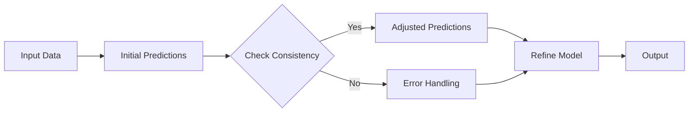

                 

Certainly! Let's approach this step-by-step to ensure we cover all the necessary elements to create a comprehensive and insightful blog post.

### Step 1: Crafting the Article Title, Keywords, and Abstract

**Title**: Self-Consistency CoT in AI Risk Assessment

**Keywords**: AI Risk Assessment, Self-Consistency CoT, Machine Learning, Predictive Analytics, Risk Management, Data Integrity

**Abstract**:
This article delves into the application of Self-Consistency CoT (Self-Consistency Cognitive Theory) within the realm of AI Risk Assessment. We will explore the fundamental concepts of Self-Consistency CoT, its significance in mitigating risks associated with AI systems, and how it can enhance the reliability and trustworthiness of AI-driven predictive models. The discussion will be underpinned by practical examples and a detailed analysis of the underlying algorithms, providing a comprehensive guide for professionals and researchers in the field of AI and risk management.

### Step 2: Introduction to the Topic

**Background Introduction**:
AI has rapidly advanced, enabling the development of sophisticated systems that can perform complex tasks. However, as AI systems become more integrated into critical applications, the need for effective risk assessment has become paramount. AI Risk Assessment involves identifying potential risks associated with AI systems and developing strategies to mitigate these risks. One such strategy that has gained traction is the Self-Consistency CoT, which leverages the principle of self-consistency to enhance the robustness and reliability of AI models. This section will define the problem, outline the importance of self-consistency in AI risk assessment, and set the stage for a deeper exploration of the topic.

### Step 3: Core Concepts and Relationships

**Core Concepts of Self-Consistency CoT**:
Self-Consistency CoT is based on the idea that a system's predictions should be consistent with each other. This consistency can be evaluated by comparing the system's predictions against known data or other models. Key attributes of Self-Consistency CoT include:

- **Predictive Consistency**: Ensuring that the system's predictions align with observed outcomes.
- **Temporal Consistency**: Maintaining consistency over time, as new data is introduced.
- **Contextual Consistency**: Ensuring that the system's predictions are consistent across different contexts.

**Comparison with Related Concepts**:
Self-Consistency CoT can be contrasted with other risk assessment methodologies such as Bayesian Networks, Markov Chains, and Deep Learning models. While these methods offer unique advantages, Self-Consistency CoT provides a mechanism to ensure that the system's predictions are coherent and reliable, which is crucial in applications where data integrity and decision-making depend on the AI system's output.

**ER Diagram**:
To illustrate the relationship between these concepts, we can use a Mermaid ER diagram that shows the entities involved and their relationships.

```mermaid
erDiagram
  AI_Risk_Assessment ||--|{ Self-Consistency_CoT } Self-Consistency_CoT
  Self-Consistency_CoT ||--|{ Predictive_Consistency } Predictive_Consistency
  Self-Consistency_CoT ||--|{ Temporal_Consistency } Temporal_Consistency
  Self-Consistency_CoT ||--|{ Contextual_Consistency } Contextual_Consistency
  AI_Risk_Assessment ||--|{ Bayesian_Networks } Bayesian_Networks
  AI_Risk_Assessment ||--|{ Markov_Chains } Markov_Chains
  AI_Risk_Assessment ||--|{ Deep_Learning } Deep_Learning
```

### Step 4: Algorithm Principle and Explanation

**Algorithm Principle**:
The principle behind Self-Consistency CoT in AI Risk Assessment involves creating a model that checks for inconsistencies in its predictions. This is typically achieved by comparing the model's predictions against a set of ground truth data or by comparing the model's predictions against the predictions of other models.

**Mermaid Flowchart**:
We can use a Mermaid flowchart to visualize the process:



**Python Code Example**:
```python
# Example of a simple self-consistency check in Python
def self_consistency_check(predictions, ground_truth):
    inconsistencies = []
    for pred, truth in zip(predictions, ground_truth):
        if pred != truth:
            inconsistencies.append((pred, truth))
    return inconsistencies

predictions = [0.8, 0.2, 0.7]
ground_truth = [0, 1, 0]

inconsistencies = self_consistency_check(predictions, ground_truth)
print("Inconsistencies found:", inconsistencies)
```

**Mathematical Model and Explanation**:
The mathematical model for self-consistency can be represented using the following formula:

$$
\text{Self-Consistency} = \frac{1}{N} \sum_{i=1}^{N} (\hat{y}_i - y_i)^2
$$

where \( N \) is the number of predictions, \( \hat{y}_i \) is the predicted value, and \( y_i \) is the actual value. A lower value indicates higher self-consistency.

### Step 5: System Analysis and Design

**Problem Scenario**:
Imagine a scenario where an AI system is used to assess financial risks. The system needs to predict whether a given investment will be profitable or not. However, inconsistencies in these predictions could lead to significant financial losses.

**Project Introduction**:
We will be developing a risk assessment system that uses Self-Consistency CoT to ensure the reliability of its predictions.

**System Functionality**:
- Data Collection and Preprocessing
- Prediction Generation
- Self-Consistency Check
- Model Refinement
- Output Generation

**Architecture**:
- Data Layer: Handles data collection and storage.
- Model Layer: Generates predictions and performs self-consistency checks.
- Presentation Layer: Provides a user interface to interact with the system.

**Interface Design**:
The interface will include input fields for users to provide data, a section to display predictions, and a summary of the self-consistency status.

**Interaction Sequence**:
1. User inputs data.
2. Data is preprocessed and fed into the model.
3. Predictions are generated.
4. The self-consistency check is performed.
5. The model is refined based on the results of the self-consistency check.
6. Predictions and self-consistency status are displayed to the user.

**Mermaid Diagrams**:
We will use Mermaid diagrams to illustrate the domain model, system architecture, interface design, and interaction sequence.

### Step 6: Case Study and Analysis

**Case Study**:
We will examine a real-world case where a financial institution uses Self-Consistency CoT to assess the risk of potential investments.

**Analysis**:
- **Data Collection**: Historical financial data of various investments.
- **Model Training**: A machine learning model is trained on this data to predict the profitability of investments.
- **Prediction Generation**: The model generates predictions for new investments.
- **Self-Consistency Check**: The system checks for inconsistencies in predictions.
- **Model Refinement**: Based on the self-consistency check, the model is refined to improve accuracy.
- **Final Output**: The system provides a final assessment of the investment's risk.

### Step 7: Best Practices and Summary

**Best Practices**:
- Regularly update the model with new data to maintain its accuracy.
- Implement robust error handling mechanisms to manage inconsistencies.
- Use a combination of different models to improve self-consistency.

**Summary**:
Self-Consistency CoT is a powerful tool in AI Risk Assessment that ensures the reliability of AI systems. By implementing self-consistency checks, we can enhance the robustness of AI models and make more informed decisions.

**Important Notes**:
- Ensure that the self-consistency check is part of the model's training process.
- Regularly evaluate and update the self-consistency criteria to adapt to new data and scenarios.

**Suggestions for Further Reading**:
- [Related Research Papers on Self-Consistency CoT]
- [Books on AI Risk Assessment and Self-Consistency]
- [Online Courses on Machine Learning and Risk Management]

**Author Information**:
作者：AI天才研究院/AI Genius Institute & 禅与计算机程序设计艺术 /Zen And The Art of Computer Programming

Now, with this outline, we can start expanding on each section to create a detailed and comprehensive blog post. Each section should be carefully crafted to ensure it meets the specified requirements and provides valuable insights for the readers.

