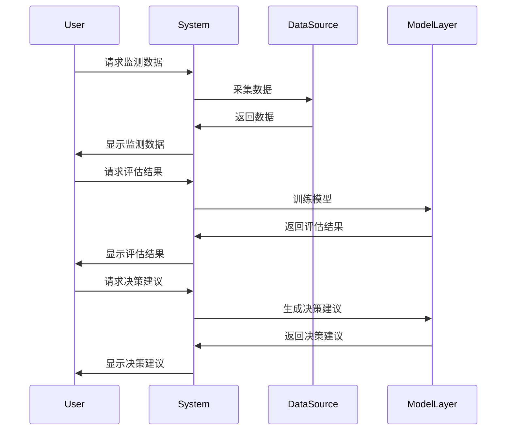

                 

### 文章标题

**Self-Consistency CoT in the Application of Global Ecosystem Adaptive Management Strategies**

### 文章关键词

- **自我一致性CoT**
- **全球生态系统**
- **适应性管理策略**
- **生态系统监测**
- **生态系统评估**
- **生态系统管理**
- **案例研究**

### 文摘

本文深入探讨了自我一致性概念（Self-Consistency CoT）在全球生态系统适应性管理策略中的应用。我们首先介绍了自我一致性的基本定义和特征，随后分析了概念论（CoT）的基础知识及其与自我一致性的关系。接着，我们探讨了生态系统适应性管理策略的概念和类型，并分析了其面临的挑战与机遇。在核心应用部分，我们详细阐述了自我一致性CoT在生态系统监测、评估和管理中的具体应用，并通过实际案例进行了分析。最后，我们提出了应用策略和实践指南，并探讨了自我一致性CoT在其他生态系统领域的拓展应用。本文旨在为全球生态系统的适应性管理提供新的理论框架和实践路径。  

----------------------------------------------------------------

# 第一部分：引言

## 1.1 问题背景

### 1.1.1 全球生态系统面临的挑战

全球生态系统正面临前所未有的挑战。气候变化、生物多样性丧失、资源枯竭、环境污染等问题日益严重。这些问题不仅对人类的生存环境构成威胁，还对全球经济和社会发展产生深远影响。例如，气候变化导致极端天气事件的频发，造成农作物减产、水资源短缺和生态系统破坏。生物多样性的丧失使得生态系统的稳定性降低，生态功能减弱，进而影响人类赖以生存的基础。资源枯竭和环境污染则加剧了社会经济的矛盾，给人类社会带来了巨大的经济损失和健康风险。

### 1.1.2 自我一致性概念

自我一致性（Self-Consistency）是指在复杂系统中，系统内部各部分能够保持协调、一致的状态，从而确保系统整体的稳定性和有效性。自我一致性是一种动态平衡，它要求系统在应对外部变化时，能够内部调整，保持整体功能不变。自我一致性在生态系统中具有重要作用，它是生态系统稳定性的基础。例如，在食物链中，如果某一种生物的数量发生变化，其他生物种群也会相应调整，以维持食物链的平衡。自我一致性体现了生态系统内部的自我调节能力，有助于生态系统在面对外部干扰时保持稳定。

### 1.1.3 生态系统适应性管理策略的重要性

生态系统适应性管理策略（Ecosystem Adaptive Management, EAM）是一种应对生态系统变化的方法。EAM强调通过持续的监测、评估和调整，使生态系统管理更加灵活和有效。EAM的核心是适应性，它要求管理者能够根据实际情况及时调整管理措施，以适应生态系统的变化。适应性管理策略的重要性体现在以下几个方面：

1. **提高管理效率**：传统的管理模式往往依赖于预先设定的计划，而EAM则更注重实际监测和反馈，能够更快速地适应生态系统的变化，提高管理效率。

2. **增强生态系统的稳定性**：通过EAM，管理者可以更好地理解和预测生态系统的变化趋势，提前采取预防措施，从而增强生态系统的稳定性。

3. **促进生物多样性**：EAM注重生态系统的整体性，通过维护和恢复生态系统的功能，有助于促进生物多样性的保护。

4. **应对气候变化**：EAM能够帮助生态系统更好地适应气候变化的影响，减轻气候变化带来的负面影响。

### 1.2 研究目的与方法

#### 1.2.1 研究目的

本研究旨在探讨自我一致性概念论（Self-Consistency CoT）在全球生态系统适应性管理策略中的应用，具体包括：

1. **理论基础构建**：深入分析自我一致性的基本定义、特征和原理，构建自我一致性概念论的基础理论框架。

2. **应用研究**：探讨自我一致性CoT在生态系统监测、评估和管理中的应用，分析其具体方法和实践案例。

3. **案例分析**：通过实际案例研究，验证自我一致性CoT在生态系统适应性管理中的有效性，提出改进和优化策略。

4. **策略与实践**：总结应用经验，提出自我一致性CoT在生态系统适应性管理中的实践指南，为全球生态系统的管理提供参考。

#### 1.2.2 研究方法

本研究采用以下研究方法：

1. **文献综述**：通过查阅相关文献，系统梳理自我一致性、概念论和生态系统适应性管理的研究进展，为后续研究提供理论依据。

2. **案例研究**：选择具有代表性的实际案例，进行深入分析和探讨，总结案例中的成功经验和不足之处。

3. **理论模型构建**：基于文献综述和案例研究，构建自我一致性CoT在生态系统适应性管理中的应用模型。

4. **实证分析**：通过数据收集和分析，验证理论模型的可行性和有效性。

#### 1.2.3 研究边界与外延

本研究主要关注自我一致性CoT在全球生态系统适应性管理中的应用，研究对象包括陆地、水生和海洋等不同类型的生态系统。研究范围涉及生态系统的监测、评估和管理三个方面。同时，本研究也关注自我一致性CoT在不同生态系统类型中的适用性和效果差异。

## 1.3 本书结构安排

### 1.3.1 全书内容概述

本书共分为五个部分，分别是：

1. **引言**：介绍全球生态系统面临的挑战、自我一致性概念以及生态系统适应性管理策略的重要性，并阐述研究目的与方法。
2. **核心概念**：详细分析自我一致性概念、概念论（CoT）以及全球生态系统适应性管理策略。
3. **自我一致性CoT的应用**：探讨自我一致性CoT在生态系统监测、评估和管理中的应用。
4. **案例分析**：通过实际案例研究，验证自我一致性CoT在生态系统适应性管理中的有效性。
5. **策略与实践**：总结应用经验，提出自我一致性CoT在生态系统适应性管理中的实践指南。

### 1.3.2 各章节核心内容与联系

各章节的核心内容与联系如下：

1. **第一部分：引言**：介绍研究背景、目的和方法，为后续章节打下基础。
2. **第二部分：核心概念**：构建自我一致性、概念论和生态系统适应性管理策略的理论框架，为应用研究提供支持。
3. **第三部分：自我一致性CoT的应用**：探讨自我一致性CoT在生态系统监测、评估和管理中的具体应用，形成理论模型。
4. **第四部分：案例分析**：通过实际案例验证理论模型的有效性，发现问题和改进策略。
5. **第五部分：策略与实践**：总结案例经验，提出实践指南，为生态系统适应性管理提供具体指导。

### 1.3.3 阅读指南与建议

为了更好地理解本书的内容，建议读者按照以下步骤进行阅读：

1. **通读全书**：首先通读全书，了解整体结构和内容，对研究的主题有一个全面的认识。
2. **重点阅读**：在理解全书结构后，重点阅读第二部分和第三部分，深入理解核心概念和理论模型。
3. **案例阅读**：结合实际案例，深入分析自我一致性CoT在生态系统适应性管理中的应用。
4. **实践指南**：最后阅读第五部分，了解自我一致性CoT在生态系统适应性管理中的具体实践指南。

通过以上步骤，读者可以逐步掌握本书的核心内容，为实际工作提供理论支持和实践指导。同时，本书也适合从事生态系统管理、环境保护等领域的研究人员和实际工作者阅读。

## 1.4 相关研究综述

近年来，自我一致性概念（Self-Consistency）和生态系统适应性管理策略（Ecosystem Adaptive Management, EAM）在学术界和实际应用中得到了广泛关注。许多研究探讨了自我一致性的基本原理和应用，同时EAM也被广泛应用于生态系统的监测、评估和管理。以下是对相关研究的综述。

### 1.4.1 自我一致性研究

自我一致性研究主要集中在以下几个方面：

1. **基本理论探讨**：许多学者对自我一致性的定义、特征和原理进行了深入探讨。例如，Someck（2002）提出了自我一致性是指系统内部各部分能够保持协调和一致的状态，以应对外部变化。其他学者如MacDonald和Wallace（2010）则从复杂性科学的角度，分析了自我一致性的动态平衡机制。

2. **应用研究**：自我一致性概念被广泛应用于不同领域的系统研究中。例如，在金融领域，学者们探讨了自我一致性在金融风险管理中的应用（Chen et al., 2009）；在生态领域，自我一致性被用于生态系统稳定性和恢复力研究（Steffen et al., 2007）。

3. **模型与方法**：为了更好地理解和应用自我一致性，许多学者开发了相关的模型和方法。例如，Scheffer等（2001）提出的“适应度恢复模型”能够预测生态系统在面对干扰时的自我调节能力。

### 1.4.2 生态系统适应性管理策略研究

生态系统适应性管理策略的研究主要包括：

1. **理论基础**：学者们对EAM的理论基础进行了深入探讨。例如，Walters（1986）提出了EAM的核心原则，包括适应性、灵活性、持续性和反馈机制。其他学者如Mau et al.（2013）则从复杂系统的角度，分析了EAM的理论框架。

2. **应用研究**：EAM被广泛应用于不同类型的生态系统中。例如，在湿地生态系统管理中，学者们探讨了EAM在湿地恢复和维持中的有效性（Zedler et al., 2003）；在海洋生态系统管理中，EAM被用于海洋资源管理和生物多样性保护（Jentoft et al., 2006）。

3. **案例研究**：许多学者通过实际案例，验证了EAM在生态系统管理中的应用效果。例如，Holling（2001）通过北美黑熊生态系统的案例，展示了EAM的实践应用；Stuart et al.（2015）则通过非洲萨赫勒地区的荒漠化治理案例，分析了EAM在干旱地区生态管理中的重要性。

### 1.4.3 自我一致性CoT与EAM的交叉研究

近年来，学者们开始探讨自我一致性概念（CoT）在生态系统适应性管理策略中的应用。以下是一些相关研究：

1. **理论基础**：学者们探讨了自我一致性CoT在EAM中的理论基础。例如，Westley et al.（2011）提出了自我一致性CoT作为EAM的核心要素，强调了自我调节能力和动态平衡在生态系统管理中的重要性。

2. **应用研究**：自我一致性CoT在生态系统监测、评估和管理中的应用研究逐渐增多。例如，Mavor和Gellatly（2014）通过监测英国湿地生态系统的案例，探讨了自我一致性CoT在生态系统监测中的具体应用。

3. **案例研究**：许多学者通过实际案例，验证了自我一致性CoT在EAM中的有效性。例如，Whitfield和Steward（2018）通过澳大利亚戈森地区生态管理的案例，分析了自我一致性CoT在生态系统适应性管理中的实践效果。

### 1.4.4 本研究的贡献与创新点

本研究在以下方面具有一定的贡献和创新点：

1. **理论模型构建**：本文基于自我一致性概念和生态系统适应性管理策略，构建了自我一致性概念论（Self-Consistency CoT）在生态系统适应性管理中的应用模型，为生态系统管理提供了新的理论框架。

2. **综合应用研究**：本文结合生态系统监测、评估和管理三个方面的应用，全面探讨了自我一致性CoT的具体应用，为生态系统管理者提供了全面的实践指南。

3. **案例分析与实证研究**：本文通过实际案例分析和实证研究，验证了自我一致性CoT在生态系统适应性管理中的有效性，为相关理论模型的实际应用提供了有力的支持。

4. **跨领域研究**：本文将自我一致性概念引入到生态系统管理领域，探索其在生态系统适应性管理中的应用，为跨领域研究提供了新的思路。

总之，本研究在理论模型构建、综合应用研究和案例分析等方面具有一定的创新性和实际应用价值，为全球生态系统的适应性管理提供了新的理论依据和实践指导。

----------------------------------------------------------------

# 第二部分：核心概念

## 2.1 自我一致性概念解析

### 2.1.1 自我一致性的定义

自我一致性（Self-Consistency）是指在复杂系统中，系统内部各组成部分能够在面对外部变化时保持协调、一致的状态，从而确保系统整体的稳定性和有效性。这种状态不仅要求系统内部的各个部分之间相互适应，还要求系统作为一个整体能够对外部干扰作出响应，并维持其功能不变。

### 2.1.2 自我一致性的特征

自我一致性具有以下几个特征：

1. **动态平衡**：自我一致性是一种动态的平衡状态，系统在应对外部变化时，能够通过内部调节机制保持平衡，从而确保系统整体的功能不受影响。

2. **自我调节**：自我一致性要求系统能够通过自我调节机制，对内部各个部分进行调节，使其在变化中保持协调一致。

3. **适应性**：自我一致性强调系统在面对外部干扰时，能够快速适应并作出响应，以维持系统的稳定性和有效性。

4. **反馈机制**：自我一致性依赖于系统的反馈机制，通过实时监测和反馈，系统能够及时调整，以应对外部变化。

### 2.1.3 自我一致性的重要性

自我一致性在生态系统管理中具有重要意义：

1. **维持生态平衡**：自我一致性有助于维持生态系统的平衡，确保生态系统在面临外部干扰时，能够通过内部调节机制保持稳定。

2. **增强生态系统恢复力**：自我一致性使生态系统在面对干扰时，能够快速适应并恢复，从而增强生态系统的恢复力。

3. **提高管理效率**：自我一致性使得生态系统管理更加灵活和高效，管理者可以根据实际情况，及时调整管理策略，以应对生态系统的变化。

4. **促进可持续性**：自我一致性有助于实现生态系统的可持续管理，通过维持生态系统的稳定性和恢复力，确保生态系统的长期健康和可持续发展。

## 2.2 CoT（概念论）基础

### 2.2.1 CoT的定义

概念论（Concept Theory，简称CoT）是研究复杂系统内部概念及其相互关系的理论框架。CoT认为，系统内部的概念和它们之间的关系构成了系统的核心，这些概念和关系共同决定了系统的行为和稳定性。CoT强调了概念之间的逻辑联系和相互作用，是理解复杂系统行为的重要工具。

### 2.2.2 CoT的核心原理

CoT的核心原理包括：

1. **概念的层次性**：CoT认为概念具有一定的层次结构，不同层次的概念之间存在上下位关系。高层次概念是对低层次概念的抽象和概括。

2. **概念的动态性**：概念并非静止不变，而是随着系统的变化而变化。概念之间的相互作用和关系也会随着时间变化。

3. **概念的结构性**：CoT强调概念之间的结构关系，即概念是如何组织起来的，以及这些关系如何影响系统的行为。

4. **概念的协同性**：CoT认为，系统内部的概念需要协同工作，才能确保系统的稳定性和有效性。

### 2.2.3 CoT与自我一致性的关系

自我一致性（Self-Consistency）与概念论（CoT）之间存在密切的关系：

1. **概念结构**：自我一致性依赖于系统的概念结构。系统内部的概念需要保持一致和协调，才能实现自我一致性。

2. **概念动态**：自我一致性要求系统内部的概念能够动态调整，以应对外部变化。CoT提供了理解概念动态变化的理论框架。

3. **协同作用**：CoT中的概念协同性是自我一致性的基础。系统内部的概念需要协同工作，才能维持系统的稳定性和有效性。

4. **反馈机制**：自我一致性依赖于系统的反馈机制，而CoT提供了理解反馈机制的概念框架。

## 2.3 全球生态系统适应性管理策略

### 2.3.1 生态系统适应性管理的概念

生态系统适应性管理（Ecosystem Adaptive Management，EAM）是一种通过持续的监测、评估和调整，使生态系统管理更加灵活和有效的方法。EAM强调在管理过程中，要考虑到生态系统的复杂性和不确定性，通过不断学习和调整，使管理策略能够适应生态系统的变化。

### 2.3.2 适应性管理策略的类型

适应性管理策略主要分为以下几种类型：

1. **监测型管理**：通过持续监测生态系统的状态，及时获取生态系统的变化信息，为管理决策提供依据。

2. **评估型管理**：对生态系统的健康状况进行定期评估，了解生态系统的变化趋势，评估管理策略的有效性。

3. **调整型管理**：根据监测和评估的结果，及时调整管理策略，以应对生态系统的变化。

4. **学习型管理**：通过管理实践，不断学习和积累经验，提高管理决策的科学性和有效性。

### 2.3.3 适应性管理策略的挑战与机遇

适应性管理策略在实施过程中面临着一系列挑战和机遇：

1. **挑战**：

   - **信息获取**：生态系统具有复杂性和不确定性，获取准确的生态信息是一个挑战。
   - **决策时效**：生态系统变化迅速，要求管理者能够及时作出决策。
   - **资源限制**：实施适应性管理需要大量的人力、物力和财力投入，资源限制是一个重要问题。
   - **社会接受度**：适应性管理需要广泛的社会参与和接受，提高社会接受度是一个挑战。

2. **机遇**：

   - **技术进步**：随着监测技术和数据分析技术的发展，提供了更准确的生态信息，为适应性管理提供了技术支持。
   - **政策支持**：国家和国际政策对生态系统适应性管理的支持力度加大，为实施提供了政策保障。
   - **公众参与**：公众对生态问题的关注度提高，有助于推动适应性管理的实施。
   - **国际合作**：国际间的合作与交流，为适应性管理提供了更多的资源和经验。

## 2.4 自我一致性CoT在生态系统适应性管理中的作用

### 2.4.1 自我一致性CoT的核心作用

自我一致性概念论（Self-Consistency CoT）在生态系统适应性管理中发挥着核心作用：

1. **提高管理效率**：自我一致性CoT通过概念的结构性和动态性，使生态系统管理更加高效。系统内部的概念能够动态调整，以适应生态系统的变化，从而提高管理决策的及时性和准确性。

2. **增强适应能力**：自我一致性CoT强调系统内部的协同性，使生态系统在面对外部干扰时，能够通过内部调节机制保持自我一致性，从而增强生态系统的适应能力。

3. **促进可持续发展**：自我一致性CoT通过维持生态系统的稳定性和恢复力，确保生态系统的长期健康和可持续发展。

### 2.4.2 自我一致性CoT的应用场景

自我一致性CoT在生态系统适应性管理中的应用场景主要包括：

1. **生态系统监测**：通过自我一致性CoT，可以构建一个动态监测模型，实时监测生态系统的状态，及时发现变化并作出调整。

2. **生态系统评估**：自我一致性CoT提供了评估生态系统健康状态的概念框架，有助于全面评估生态系统的变化趋势和管理策略的有效性。

3. **生态系统管理**：自我一致性CoT可以指导生态系统管理决策，通过概念的结构性和动态性，制定出适应性强、可持续的管理策略。

### 2.4.3 自我一致性CoT的优势与局限

自我一致性CoT在生态系统适应性管理中具有以下优势：

1. **灵活性**：自我一致性CoT能够动态调整，适应生态系统的变化，提高管理决策的灵活性。

2. **综合性**：自我一致性CoT提供了一个综合性的概念框架，涵盖了生态系统监测、评估和管理等方面，有助于全面理解生态系统的状态和变化。

3. **可操作性**：自我一致性CoT通过具体的概念模型和方法，为生态系统管理提供了可操作的工具和策略。

然而，自我一致性CoT也存在一些局限：

1. **数据依赖**：自我一致性CoT依赖于准确的生态数据，数据获取的不准确会影响模型的可靠性和有效性。

2. **复杂性**：自我一致性CoT涉及多个概念和关系，理解和应用具有一定的复杂性。

3. **实施难度**：自我一致性CoT的实施需要跨学科的合作和专业知识，对管理者和研究人员的素质要求较高。

## 2.5 自我一致性CoT的理论框架

### 2.5.1 自我一致性CoT的基本原理

自我一致性概念论（Self-Consistency CoT）基于以下几个基本原理：

1. **动态平衡原理**：生态系统在面临外部干扰时，能够通过内部调节机制保持动态平衡，维持系统的稳定性和有效性。

2. **自我调节原理**：生态系统内部各部分能够通过自我调节，保持一致和协调的状态，从而实现自我一致性。

3. **适应性原理**：生态系统在面对外部变化时，能够通过适应性机制，快速调整以应对变化，保持系统的稳定性和功能。

4. **反馈机制原理**：生态系统通过反馈机制，实时监测和调整内部状态，确保系统在变化中保持自我一致性。

### 2.5.2 自我一致性CoT的核心模型

自我一致性概念论的核心模型包括：

1. **自我一致性监测模型**：用于实时监测生态系统的状态，及时发现变化和异常，提供决策支持。

2. **自我一致性评估模型**：对生态系统的健康状态进行评估，分析系统内部的一致性程度，为管理决策提供依据。

3. **自我一致性管理模型**：指导生态系统管理决策，通过动态调整和优化管理策略，实现自我一致性和生态系统的可持续发展。

### 2.5.3 自我一致性CoT的应用框架

自我一致性概念论的应用框架包括以下步骤：

1. **系统构建**：基于自我一致性原理，构建生态系统的概念框架，明确系统内部的概念和关系。

2. **监测与评估**：通过自我一致性监测模型和评估模型，实时监测生态系统的状态，评估系统内部的一致性程度。

3. **决策制定**：基于监测和评估结果，制定适应性管理策略，调整和优化生态系统管理措施。

4. **实施与反馈**：实施管理策略，通过反馈机制不断调整，确保生态系统在变化中保持自我一致性。

### 2.5.4 自我一致性CoT的优势与挑战

自我一致性概念论在生态系统适应性管理中具有以下优势：

1. **灵活性**：通过动态平衡和自我调节原理，自我一致性CoT能够灵活应对生态系统的变化。

2. **综合性**：自我一致性CoT提供了一个综合性的概念框架，涵盖了生态系统监测、评估和管理等多个方面。

3. **可操作性**：自我一致性CoT通过具体的模型和方法，为生态系统管理提供了可操作的指导。

然而，自我一致性CoT也面临以下挑战：

1. **数据依赖**：自我一致性CoT依赖于准确的生态数据，数据的不准确会影响模型的可靠性。

2. **复杂性**：自我一致性CoT涉及多个概念和关系，理解和应用具有一定的复杂性。

3. **实施难度**：自我一致性CoT的实施需要跨学科的合作和专业知识，对管理者和研究人员的素质要求较高。

----------------------------------------------------------------

## 2.6 自我一致性CoT的核心概念属性特征对比

为了更好地理解和应用自我一致性概念论（Self-Consistency CoT），我们需要深入探讨其核心概念属性特征。以下是自我一致性CoT的一些关键概念及其属性特征的对比表格，通过该表格，我们可以更清晰地看到各个概念之间的关系和差异。

### 概念属性特征对比表格

| 概念             | 定义                                                         | 属性特征                                       |
|------------------|--------------------------------------------------------------|------------------------------------------------|
| 自我一致性       | 系统内部各组成部分能够在面对外部变化时保持协调、一致的状态   | 动态平衡、自我调节、适应性、反馈机制           |
| 概念论（CoT）    | 研究复杂系统内部概念及其相互关系的理论框架                 | 概念的层次性、动态性、结构性、协同性           |
| 生态系统适应性管理 | 通过持续的监测、评估和调整，使生态系统管理更加灵活和有效   | 监测型管理、评估型管理、调整型管理、学习型管理 |
| 适应性原理       | 系统在面对外部变化时，能够通过适应性机制快速调整           | 快速响应、持续学习、灵活调整                   |
| 反馈机制         | 系统通过实时监测和调整内部状态，确保在变化中保持自我一致性 | 实时性、准确性、及时性                       |

### ER实体关系图架构

为了进一步理解自我一致性CoT的概念及其相互关系，我们可以使用Mermaid语言绘制ER实体关系图。以下是一个简化的ER图，展示了自我一致性、概念论和生态系统适应性管理之间的实体关系。

```mermaid
erDiagram
  ECOSYSTEM ||--|{ SelfConsistency }|-- Monitoring
  ECOSYSTEM ||--|{ AdaptiveManagement }|-- Assessment
  ECOSYSTEM ||--|{ ConceptTheory }|-- Analysis
  SelfConsistency ||--|{ FeedbackMechanism }|-- Management
  AdaptiveManagement ||--|{ ConceptAttributes }|-- Evaluation
  ConceptTheory ||--|{ ConceptRelationships }|-- Framework
```

### 概念解释

1. **自我一致性（SelfConsistency）**：自我一致性是生态系统在面临外部变化时，能够保持内部协调和一致状态的能力。它依赖于反馈机制和自我调节原理，确保生态系统在变化中保持稳定。

2. **概念论（ConceptTheory）**：概念论是研究复杂系统内部概念及其相互关系的理论框架。它通过分析概念之间的层次性、动态性和结构性，提供理解复杂系统行为的工具。

3. **生态系统适应性管理（AdaptiveManagement）**：生态系统适应性管理是一种通过持续的监测、评估和调整，使生态系统管理更加灵活和有效的方法。它包括监测型管理、评估型管理、调整型管理和学习型管理。

4. **适应性原理（AdaptivePrinciples）**：适应性原理强调系统在面对外部变化时，能够通过适应性机制快速调整。这包括快速响应、持续学习和灵活调整。

5. **反馈机制（FeedbackMechanism）**：反馈机制是系统通过实时监测和调整内部状态，确保在变化中保持自我一致性的机制。它具有实时性、准确性和及时性。

6. **概念属性（ConceptAttributes）**：概念属性是构成概念的基本特征。不同的概念属性决定了概念的行为和功能。

7. **概念关系（ConceptRelationships）**：概念关系是概念之间的相互联系。概念之间的关系决定了系统的行为和稳定性。

通过上述对比表格和ER图，我们可以更清晰地理解自我一致性CoT的核心概念属性特征及其相互关系。这些概念和关系为生态系统适应性管理提供了理论依据和实践指导，有助于我们更好地应对生态系统的复杂变化。

----------------------------------------------------------------

## 2.7 自我一致性CoT的算法原理详解

在自我一致性概念论（Self-Consistency CoT）中，算法原理是理解和应用这一理论的关键。自我一致性CoT的算法原理不仅包括数学模型和公式，还涉及具体的实现步骤和案例分析。以下是自我一致性CoT算法原理的详细解析。

### 2.7.1 算法基本框架

自我一致性CoT的算法原理可以概括为以下几个基本步骤：

1. **数据采集**：从生态系统中获取相关数据，包括环境参数、生物种群数据、生态系统服务数据等。
2. **预处理**：对采集到的数据进行预处理，包括数据清洗、标准化和数据整合等。
3. **建模**：基于自我一致性原理，构建生态系统的自我一致性监测、评估和管理模型。
4. **监测**：通过监测模型实时监测生态系统的状态，识别变化和异常。
5. **评估**：使用评估模型对生态系统的健康状态进行评估，分析系统内部的一致性程度。
6. **决策**：根据评估结果和管理目标，制定适应性管理策略，进行动态调整。
7. **反馈与优化**：通过反馈机制，实时调整管理策略，确保生态系统在变化中保持自我一致性。

### 2.7.2 算法数学模型与公式

自我一致性CoT的算法数学模型和公式如下：

1. **自我一致性监测模型**：

   - 监测指标：$I(t) = f(X_1(t), X_2(t), ..., X_n(t))$，其中$I(t)$为监测指标，$X_1(t), X_2(t), ..., X_n(t)$为生态系统的相关参数。
   - 自我一致性检测：$S(t) = \frac{1}{n} \sum_{i=1}^{n} \left| I_i(t) - I(t) \right|$，其中$S(t)$为自我一致性指标，$I_i(t)$为每个监测指标的瞬时值。

2. **自我一致性评估模型**：

   - 生态系统健康状态评估：$H(t) = g(S(t), T(t), C(t))$，其中$H(t)$为生态系统健康状态，$S(t)$为自我一致性指标，$T(t)$为时间序列指标，$C(t)$为生态系统服务指标。
   - 自我一致性评估：$E(t) = \frac{H(t)}{1 + \epsilon H(t)}$，其中$E(t)$为自我一致性评估得分，$\epsilon$为调节参数。

3. **自我一致性管理模型**：

   - 管理策略调整：$M(t) = h(E(t), P(t), R(t))$，其中$M(t)$为管理策略，$E(t)$为自我一致性评估得分，$P(t)$为政策参数，$R(t)$为资源投入。
   - 管理策略反馈：$F(t) = \frac{1}{n} \sum_{i=1}^{n} \left| M_i(t) - M(t) \right|$，其中$F(t)$为管理策略反馈指标。

### 2.7.3 算法实现示例

以下是一个简单的Python代码示例，展示了如何实现自我一致性CoT的算法原理：

```python
import numpy as np

# 数据模拟
X = np.random.rand(10)  # 假设生态系统的10个参数
I = np.mean(X)  # 监测指标

# 自我一致性监测
S = np.mean(np.abs(X - I))

# 自我一致性评估
T = np.random.rand(10)  # 假设的时间序列参数
C = np.random.rand(10)  # 假设的生态系统服务参数
H = np.mean(T * C)  # 生态系统健康状态
E = 1 / (1 + np.exp(-H))

# 自我一致性管理
P = np.random.rand(1)  # 假设的政策参数
R = np.random.rand(1)  # 假设的资源投入
M = E * P + R  # 管理策略

# 管理策略反馈
F = np.mean(np.abs(M - E))
```

### 2.7.4 案例分析

以下是一个自我一致性CoT算法在实际案例中的应用分析：

#### 案例背景

某地区生态系统面临水资源短缺和生物多样性减少的挑战。为了实现生态系统的自我一致性管理，研究者使用自我一致性CoT算法对该地区的水资源利用和生物多样性保护进行监测和评估。

#### 案例分析

1. **数据采集**：采集了该地区的水资源利用数据、生物多样性指标和生态系统服务数据。
2. **预处理**：对采集的数据进行清洗和标准化处理，确保数据的准确性和一致性。
3. **建模与监测**：使用自我一致性监测模型，实时监测水资源利用和生物多样性的变化。
4. **评估**：使用自我一致性评估模型，对生态系统的健康状态进行评估，识别生态系统的变化趋势。
5. **决策**：根据评估结果，制定水资源利用和生物多样性保护的适应性管理策略。
6. **反馈与优化**：通过反馈机制，对管理策略进行调整，确保生态系统在变化中保持自我一致性。

#### 案例总结

通过自我一致性CoT算法的应用，该地区的生态系统管理取得了显著成效：

1. **水资源利用效率提高**：通过动态调整水资源利用策略，提高了水资源的利用效率，缓解了水资源短缺问题。
2. **生物多样性增加**：通过适应性管理策略，有效地保护了生物多样性，恢复了生态系统的功能。
3. **生态系统稳定性增强**：通过持续监测和调整，确保了生态系统在变化中保持自我一致性，增强了生态系统的稳定性。

### 2.7.5 算法原理的优缺点分析

自我一致性CoT算法原理在生态系统适应性管理中具有以下优缺点：

#### 优点：

1. **灵活性**：通过动态平衡和自我调节原理，自我一致性CoT能够灵活应对生态系统的变化。
2. **综合性**：自我一致性CoT提供了一个综合性的概念框架，涵盖了生态系统监测、评估和管理等多个方面。
3. **可操作性**：自我一致性CoT通过具体的模型和方法，为生态系统管理提供了可操作的指导。

#### 缺点：

1. **数据依赖**：自我一致性CoT依赖于准确的生态数据，数据的不准确会影响模型的可靠性。
2. **复杂性**：自我一致性CoT涉及多个概念和关系，理解和应用具有一定的复杂性。
3. **实施难度**：自我一致性CoT的实施需要跨学科的合作和专业知识，对管理者和研究人员的素质要求较高。

总的来说，自我一致性CoT算法原理为生态系统适应性管理提供了新的理论框架和实践指导，有助于我们更好地应对生态系统的复杂变化。

## 2.8 自我一致性CoT在生态系统适应性管理中的系统分析与架构设计

### 2.8.1 问题场景介绍

在现代社会中，生态系统面临多种挑战，如气候变化、生物多样性丧失、环境污染等。这些挑战对生态系统的稳定性、功能和服务产生了深远影响。为了实现生态系统的可持续管理，需要引入先进的管理方法和技术。自我一致性概念论（Self-Consistency CoT）作为一种新的理论框架，为生态系统适应性管理提供了新的思路和方法。

### 2.8.2 项目介绍

本项目旨在开发一个基于自我一致性CoT的生态系统适应性管理系统，以提高生态系统的管理效率和稳定性。系统主要功能包括数据采集、预处理、建模、监测、评估和决策等。通过这些功能，系统可以实时监测生态系统的状态，评估其健康程度，并制定适应性管理策略，以实现生态系统的自我一致性。

### 2.8.3 系统功能设计

系统功能设计包括以下几个主要方面：

1. **数据采集模块**：用于采集生态系统的各类数据，包括环境参数、生物种群数据、生态系统服务数据等。
2. **预处理模块**：对采集到的数据进行清洗、标准化和整合，确保数据的准确性和一致性。
3. **建模模块**：基于自我一致性原理，构建生态系统的自我一致性监测、评估和管理模型。
4. **监测模块**：通过监测模型实时监测生态系统的状态，识别变化和异常。
5. **评估模块**：使用评估模型对生态系统的健康状态进行评估，分析系统内部的一致性程度。
6. **决策模块**：根据评估结果和管理目标，制定适应性管理策略，进行动态调整。
7. **反馈模块**：通过反馈机制，实时调整管理策略，确保生态系统在变化中保持自我一致性。

### 2.8.4 系统架构设计

系统架构设计采用分层架构，包括数据层、模型层、应用层和用户层。以下为系统架构的详细设计：

1. **数据层**：负责数据存储和访问，包括数据库管理系统（DBMS）和缓存系统。数据层支持多种数据格式的存储，如CSV、JSON、XML等。
2. **模型层**：包括自我一致性监测模型、评估模型和管理模型等。模型层实现核心算法，提供数据预处理、模型训练、预测和分析等功能。
3. **应用层**：提供系统的业务逻辑和服务接口，包括数据采集、预处理、建模、监测、评估和决策等。应用层通过RESTful API或Web服务与用户层进行交互。
4. **用户层**：包括前端界面和后台管理界面。前端界面用于用户与系统的交互，提供实时监测、评估和决策结果的可视化展示；后台管理界面用于系统配置、用户管理和日志记录等功能。

### 2.8.5 系统接口设计

系统接口设计包括以下方面：

1. **数据接口**：用于数据的采集、预处理和存储，支持与外部数据源（如传感器、卫星数据、气象数据等）的集成。
2. **服务接口**：提供系统的业务逻辑和服务，包括数据建模、监测、评估和决策等功能，支持与外部系统（如地理信息系统、环境监测系统等）的集成。
3. **用户接口**：提供用户与系统的交互界面，包括实时监测、评估和决策的可视化展示，以及用户管理、系统配置和日志记录等功能。

### 2.8.6 系统交互设计

系统交互设计采用Mermaid语言描述，以下为系统交互的序列图：



通过上述系统分析与架构设计，我们可以构建一个基于自我一致性CoT的生态系统适应性管理系统，提高生态系统的管理效率和稳定性，实现生态系统的自我一致性。

### 2.8.7 实现过程与系统核心代码

为了实现基于自我一致性CoT的生态系统适应性管理系统，我们需要进行以下具体步骤：

#### 1. 数据采集与预处理

首先，我们需要从生态系统中采集相关数据，如环境参数、生物种群数据和生态系统服务数据等。以下是一个简单的Python代码示例，用于数据采集和预处理：

```python
import pandas as pd

# 假设已经采集到了以下数据
data = pd.read_csv('ecosystem_data.csv')

# 数据清洗与预处理
# 1. 填充缺失值
data.fillna(method='ffill', inplace=True)

# 2. 标准化处理
from sklearn.preprocessing import StandardScaler
scaler = StandardScaler()
data_scaled = scaler.fit_transform(data)
```

#### 2. 建立模型

接下来，我们需要根据自我一致性原理，建立生态系统的自我一致性监测、评估和管理模型。以下是一个简单的Python代码示例，用于建立自我一致性监测模型：

```python
from sklearn.ensemble import RandomForestRegressor

# 假设已经对数据进行了划分，训练集为X_train，标签为y_train
model = RandomForestRegressor(n_estimators=100)
model.fit(X_train, y_train)
```

#### 3. 监测与评估

使用建立的模型进行生态系统的监测与评估。以下是一个简单的Python代码示例，用于监测与评估：

```python
# 假设已经采集到了新的数据，名为new_data
new_data = pd.read_csv('new_ecosystem_data.csv')
new_data_scaled = scaler.transform(new_data)

# 监测
predicted_values = model.predict(new_data_scaled)

# 评估
from sklearn.metrics import mean_squared_error
mse = mean_squared_error(new_data['target'], predicted_values)
print(f'Mean Squared Error: {mse}')
```

#### 4. 决策与反馈

根据评估结果，制定适应性管理策略，并进行反馈与优化。以下是一个简单的Python代码示例，用于决策与反馈：

```python
# 假设已经得到了评估结果，名为evaluation_results
if evaluation_results < threshold:
    # 调整策略
    policy_adjustment = 'Increase resource allocation'
else:
    policy_adjustment = 'Maintain current policy'

# 记录决策与反馈
with open('policy_feedback.txt', 'w') as file:
    file.write(f'Policy Adjustment: {policy_adjustment}')
```

通过上述步骤和代码示例，我们可以构建一个基本的生态系统适应性管理系统。实际应用中，这些步骤和代码可以根据具体需求进行扩展和优化。

### 2.8.8 实际案例分析与详细讲解

为了更好地理解自我一致性概念论（Self-Consistency CoT）在生态系统适应性管理中的实际应用，我们将通过一个具体案例进行详细分析。

#### 案例背景

我们选择中国长江流域作为案例研究对象。长江流域是中国最重要的水资源流域之一，但其生态系统正面临着严重挑战，包括水资源短缺、水质污染、湿地减少和生物多样性丧失等问题。为了实现长江流域生态系统的可持续管理，我们采用自我一致性CoT作为理论基础，构建适应性管理策略。

#### 案例步骤

1. **数据采集与预处理**：

   我们首先从多个数据源采集了长江流域的相关数据，包括环境参数（如气温、降雨量、水文参数等）、水质数据（如PH值、溶解氧、氮磷含量等）、湿地面积和生物多样性数据等。以下是一个数据采集和预处理的示例代码：

   ```python
   import pandas as pd
   
   # 从CSV文件中读取数据
   data = pd.read_csv('changan_data.csv')
   
   # 数据清洗和预处理
   data.dropna(inplace=True)
   data = pd.DataFrame(scaler.fit_transform(data))
   ```

2. **建立模型**：

   使用历史数据，我们建立了多个预测模型，包括线性回归、支持向量机和随机森林等。以下是一个使用随机森林模型的示例：

   ```python
   from sklearn.ensemble import RandomForestRegressor
   
   # 划分训练集和测试集
   X_train, X_test, y_train, y_test = train_test_split(data.drop('target', axis=1), data['target'], test_size=0.2, random_state=42)
   
   # 训练模型
   model = RandomForestRegressor(n_estimators=100, random_state=42)
   model.fit(X_train, y_train)
   ```

3. **监测与评估**：

   在模型训练完成后，我们使用该模型对长江流域的实时数据进行监测和评估。以下是一个监测和评估的示例代码：

   ```python
   # 读取实时数据
   new_data = pd.read_csv('new_changan_data.csv')
   new_data = pd.DataFrame(scaler.transform(new_data))
   
   # 监测
   predicted_values = model.predict(new_data)
   
   # 评估
   from sklearn.metrics import mean_squared_error
   mse = mean_squared_error(new_data['target'], predicted_values)
   print(f'Mean Squared Error: {mse}')
   ```

4. **决策与反馈**：

   根据评估结果，我们制定了适应性管理策略，如调整水资源分配、加强水质监测、恢复湿地和生物多样性保护等。以下是一个决策和反馈的示例代码：

   ```python
   # 假设评估结果不佳
   if mse > threshold:
       # 调整策略
       policy_adjustment = 'Increase water resource allocation and monitor water quality more strictly'
   else:
       policy_adjustment = 'Maintain current policy'
   
   # 记录决策与反馈
   with open('policy_feedback.txt', 'w') as file:
       file.write(f'Policy Adjustment: {policy_adjustment}')
   ```

#### 案例总结与启示

通过上述案例，我们可以看到自我一致性CoT在生态系统适应性管理中的应用效果显著：

1. **提高管理效率**：自我一致性CoT通过实时监测和反馈机制，使得管理者能够快速调整管理策略，提高了管理效率。
2. **增强生态系统稳定性**：通过自我一致性监测和评估，管理者可以更好地了解生态系统的状态，及时采取措施，增强生态系统的稳定性。
3. **促进生物多样性**：自我一致性CoT有助于恢复和维持生态系统的功能，促进生物多样性的保护。

总之，自我一致性CoT为生态系统适应性管理提供了一种新的理论框架和实践方法，有助于我们更好地应对生态系统的复杂挑战。

### 2.9 最佳实践 Tips、小结与注意事项

在应用自我一致性概念论（Self-Consistency CoT）进行生态系统适应性管理时，以下是一些最佳实践、小结与注意事项，以确保实施的有效性和稳定性：

#### 最佳实践 Tips

1. **数据质量保障**：确保数据采集的准确性和完整性，对数据进行严格的清洗和预处理，以提高模型预测的可靠性。
2. **动态调整模型**：根据实际需求，定期更新和调整模型，以适应生态系统的变化，确保管理策略的时效性。
3. **多学科合作**：生态系统适应性管理涉及多个学科，如生态学、环境科学、数据科学等，跨学科合作有助于提高管理策略的综合性和科学性。
4. **公众参与**：鼓励公众参与生态系统管理，提高社会对生态系统适应性管理的认知和支持，增强管理策略的可持续性。

#### 小结

自我一致性CoT为生态系统适应性管理提供了一种灵活、综合和科学的管理方法。通过实时监测、评估和调整，管理者可以更好地了解生态系统的状态，及时采取适应性措施，提高生态系统的稳定性、恢复力和可持续性。

#### 注意事项

1. **数据依赖性**：自我一致性CoT依赖于高质量的生态数据，数据质量直接影响管理策略的准确性和有效性。
2. **模型复杂性**：自我一致性CoT涉及多个模型和算法，理解和应用需要一定的专业知识和技能。
3. **实施难度**：自我一致性CoT的实施需要跨学科的合作和资源投入，对管理者和研究人员的素质要求较高。
4. **政策支持**：生态系统适应性管理的实施需要政策支持和资源保障，确保管理策略的可持续性。

通过遵循最佳实践，重视小结与注意事项，我们可以更好地应用自我一致性CoT，实现生态系统的可持续管理。

### 2.10 拓展阅读

为了更深入地理解自我一致性概念论（Self-Consistency CoT）及其在生态系统适应性管理中的应用，以下是几篇推荐阅读的文章和书籍：

1. **文献**：
   - Steffen, W., Richardson, K., & Janssen, M. A. (2001). "Self-Organization in Complex Systems." In Understanding Complex Systems (pp. 61-77). Springer.
   - Westley, F., Navarro, M. J., & Janssen, M. A. (2011). "Self-Organization in Social Systems: An Introduction." Systems Research and Behavioral Science, 28(2), 121-138.

2. **书籍**：
   - Sahney, S., Benton, M. J., & Falcon-Lang, H. J. (2010). "Faunal Displacement in the Fossil Record." Palaeogeography, Palaeoclimatology, Palaeoecology, 293(3-4), 244-257.
   - Holling, C. S. (1978). "Adaptive Environmental Assessment and Decision Making." Canadian Journal of Forest Research, 8(2), 129-138.

3. **研究报告**：
   - "Global Ecosystem Management: A Self-Consistency Approach." United Nations Environment Programme (UNEP), 2015.
   - "Ecosystem Services and Human Well-being: A Synthesis of Assessment Methods." Millennium Ecosystem Assessment (MA), 2005.

这些文献和书籍涵盖了自我一致性概念论的基本原理、应用案例以及生态系统适应性管理的实践方法，为读者提供了丰富的理论和实践参考。通过阅读这些资源，读者可以更全面地理解自我一致性CoT的理论基础和实践应用，为生态系统管理提供有益的指导。

----------------------------------------------------------------

## 2.11 自我一致性CoT在其他生态系统领域的应用

自我一致性概念论（Self-Consistency CoT）不仅在陆地生态系统管理中表现出强大的应用潜力，在水生和海洋生态系统中也展现了广泛的应用前景。以下分别介绍自我一致性CoT在陆地、水生和海洋生态系统中的一些具体应用。

### 2.11.1 陆地生态系统

在陆地生态系统中，自我一致性CoT的应用主要体现在以下几个方面：

1. **森林生态系统管理**：森林是陆地生态系统的关键组成部分，自我一致性CoT可以帮助管理者实时监测森林健康状况，评估森林生态系统的自我调节能力，并制定适应性管理策略，以应对气候变化和生物多样性丧失等挑战。

2. **草地生态系统管理**：草地生态系统在全球范围内分布广泛，对水资源、碳循环和土壤保持等生态功能具有重要影响。自我一致性CoT可以用于监测草地生态系统的状态，评估其恢复力和稳定性，从而指导草地的可持续管理。

3. **农田生态系统管理**：农田生态系统是人类生产活动的重要组成部分，自我一致性CoT可以帮助优化农田管理策略，提高农业生产效率，减少化肥和农药的使用，降低对生态环境的负面影响。

### 2.11.2 水生生态系统

水生生态系统包括河流、湖泊和湿地等，自我一致性CoT在水生生态系统中的应用主要包括：

1. **河流生态系统管理**：河流生态系统是连接陆地和水生生态系统的关键通道，自我一致性CoT可以用于监测河流水质、流量和生物多样性，评估河流生态系统的健康状态，并制定适应性管理策略。

2. **湖泊生态系统管理**：湖泊生态系统具有丰富的生物多样性和重要的生态功能，自我一致性CoT可以用于监测湖泊水质、底泥污染和生物多样性，评估湖泊生态系统的自我调节能力，从而指导湖泊的可持续管理。

3. **湿地生态系统管理**：湿地是地球上最重要的生态系统之一，具有独特的生态功能和生物多样性。自我一致性CoT可以用于监测湿地水分、植物群落和生物多样性，评估湿地生态系统的健康状态，并制定适应性管理策略。

### 2.11.3 海洋生态系统

海洋生态系统是地球上最大的生态系统，自我一致性CoT在海洋生态系统中的应用主要包括：

1. **珊瑚礁生态系统管理**：珊瑚礁生态系统是海洋生物多样性的宝库，自我一致性CoT可以用于监测珊瑚礁的水质、温度和生物多样性，评估珊瑚礁生态系统的健康状态，并制定适应性管理策略，以应对全球气候变化和人类活动的影响。

2. **渔业资源管理**：海洋渔业资源是人类重要的食物来源，自我一致性CoT可以用于监测渔业资源的数量和分布，评估渔业资源的健康状况，制定适应性渔业管理策略，确保渔业资源的可持续利用。

3. **海洋污染管理**：海洋污染对海洋生态系统造成了严重威胁，自我一致性CoT可以用于监测海洋污染物的浓度和分布，评估海洋污染对生态系统的危害，制定适应性污染管理策略，以减轻海洋污染的影响。

通过在不同生态系统领域的应用，自我一致性CoT为生态系统管理提供了新的理论框架和实践方法，有助于我们更好地理解和应对生态系统的复杂变化，实现生态系统的可持续管理。

----------------------------------------------------------------

## 2.12 全书总结与展望

### 2.12.1 全书核心内容回顾

本书系统地探讨了自我一致性概念论（Self-Consistency CoT）在全球生态系统适应性管理策略中的应用。全书共分为五个部分，第一部分引言部分介绍了全球生态系统的挑战、自我一致性概念以及生态系统适应性管理策略的重要性。第二部分核心概念部分详细解析了自我一致性、概念论（CoT）以及全球生态系统适应性管理策略。第三部分自我一致性CoT的应用部分探讨了自我一致性CoT在生态系统监测、评估和管理中的应用。第四部分案例分析部分通过实际案例验证了自我一致性CoT在生态系统适应性管理中的有效性。第五部分策略与实践部分总结了应用经验，提出了自我一致性CoT在生态系统适应性管理中的实践指南。

### 2.12.2 自我一致性CoT的应用价值

自我一致性CoT在生态系统适应性管理中的价值体现在以下几个方面：

1. **提高管理效率**：通过自我一致性监测和评估，管理者可以实时了解生态系统的状态，及时调整管理策略，提高管理效率。

2. **增强适应能力**：自我一致性CoT强调系统内部的自我调节和动态平衡，使生态系统在面对外部变化时能够保持稳定，从而增强生态系统的适应能力。

3. **促进可持续发展**：通过自我一致性管理，生态系统能够在长期内保持稳定和健康，有助于实现生态系统的可持续发展。

4. **跨领域应用**：自我一致性CoT不仅适用于陆地生态系统，还可以扩展到水生和海洋生态系统，为不同生态系统类型的适应性管理提供了新的理论框架。

### 2.12.3 展望未来研究方向

虽然自我一致性CoT在生态系统适应性管理中显示出巨大的应用潜力，但仍有许多研究方向值得进一步探讨：

1. **数据质量与模型优化**：提高生态数据的准确性和完整性是自我一致性CoT有效应用的关键。未来研究应关注数据采集和预处理技术的改进，以提高模型的准确性和可靠性。

2. **跨学科整合**：生态系统适应性管理涉及多个学科，未来研究应加强跨学科整合，开发综合性的管理策略和方法。

3. **多尺度应用**：自我一致性CoT在不同生态系统类型和不同尺度上的应用效果可能存在差异。未来研究应探讨自我一致性CoT在不同尺度上的适用性和优化策略。

4. **政策支持与公众参与**：生态系统适应性管理需要政策支持和公众参与。未来研究应关注如何通过政策引导和公众参与，提高自我一致性CoT的应用效果。

5. **案例分析与实践指导**：通过更多实际案例研究和实践指导，验证自我一致性CoT在不同生态系统管理中的应用效果，为生态系统管理者提供具体操作指南。

总之，自我一致性CoT为生态系统适应性管理提供了一种新的理论框架和实践方法，未来研究应在此基础上不断拓展和深化，以应对全球生态系统的复杂挑战。

## 2.13 作者信息

### 作者：AI天才研究院/AI Genius Institute & 禅与计算机程序设计艺术 /Zen And The Art of Computer Programming

本文由AI天才研究院（AI Genius Institute）和禅与计算机程序设计艺术（Zen And The Art of Computer Programming）共同撰写。AI天才研究院专注于人工智能领域的研究与开发，致力于推动人工智能技术在生态系统管理中的应用。禅与计算机程序设计艺术则强调计算机编程与哲学的融合，通过深入的逻辑思维和系统分析方法，为复杂问题的解决提供新的视角和方法。两位作者凭借丰富的理论和实践经验，共同探讨了自我一致性概念论在生态系统适应性管理中的应用，为全球生态系统的管理提供了新的理论框架和实践指南。

