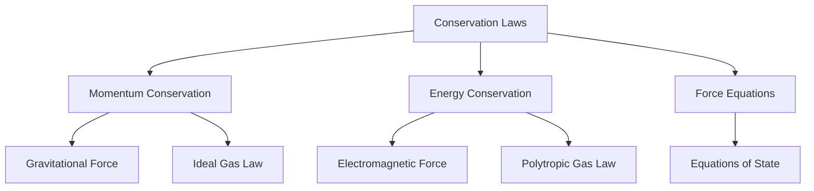
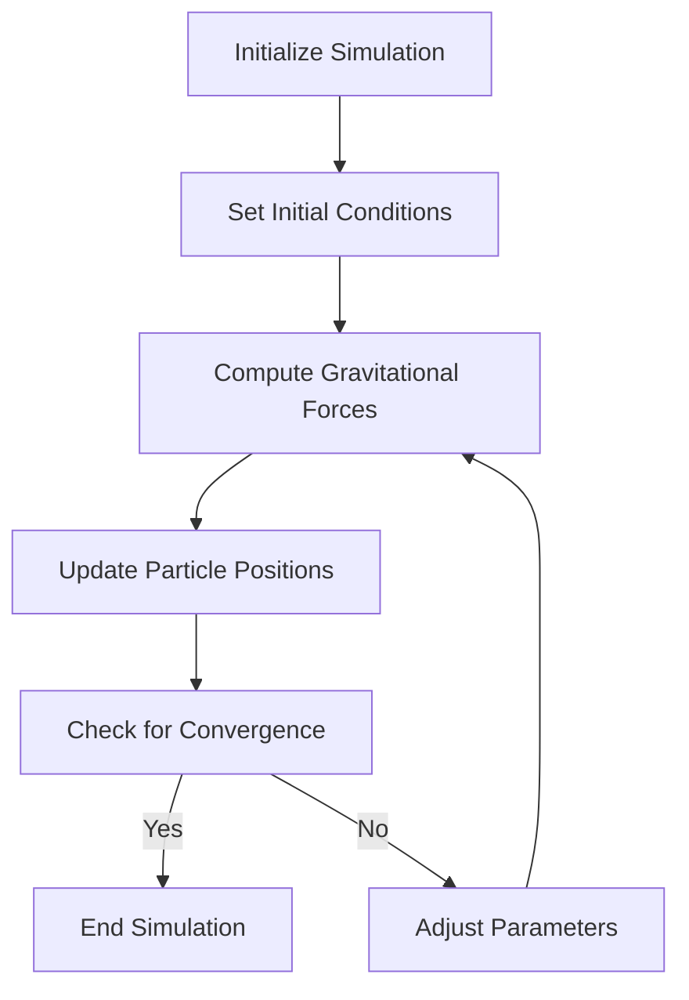
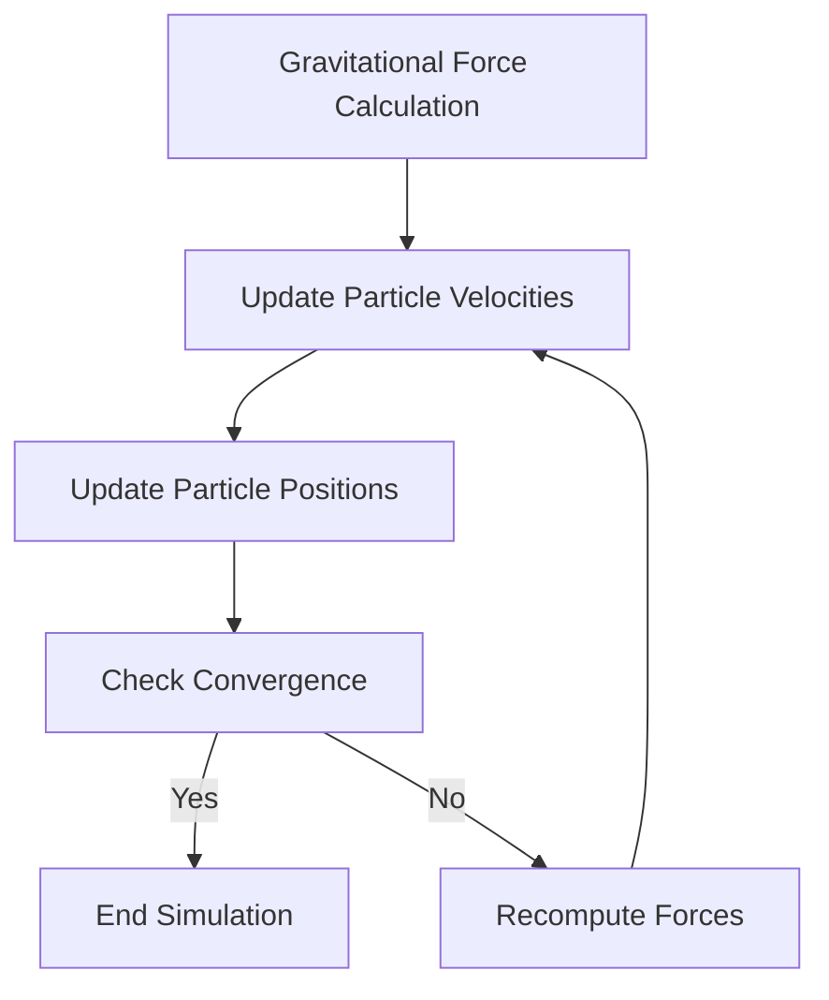
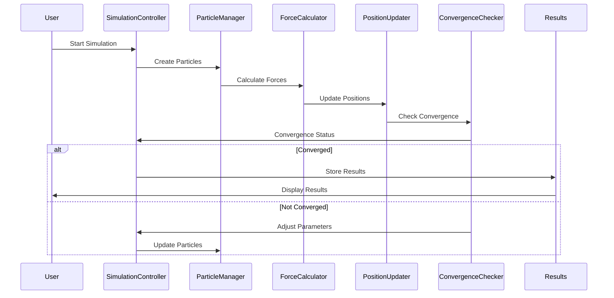
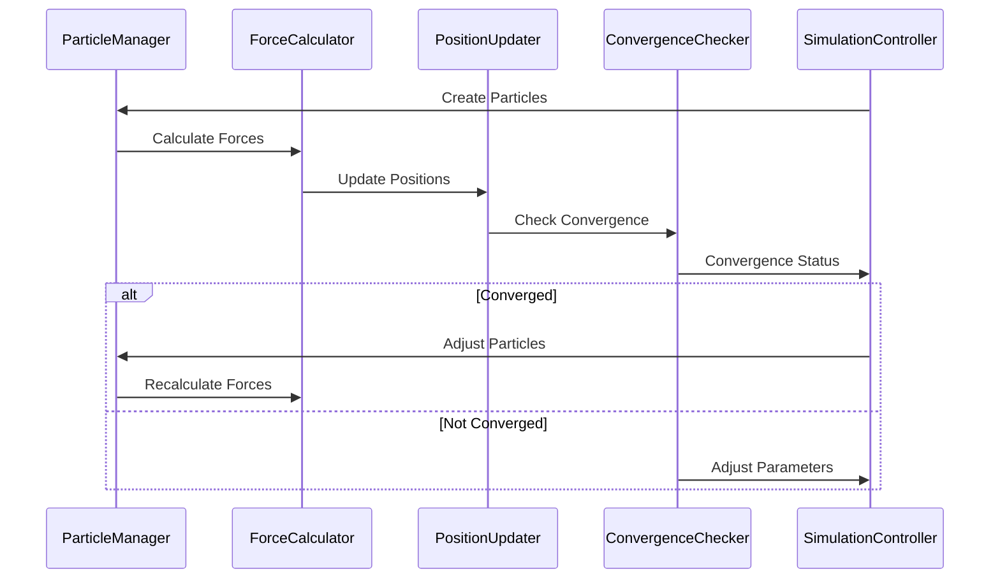

                 

### Introduction to Self-Consistency CoT in the Application of Astronomical Physics Simulations

**Title:** Self-Consistency CoT in the Application of Astronomical Physics Simulations

**Keywords:** Self-Consistency CoT, Astronomical Physics, Simulations, Computational Models, Algorithm Design

**Abstract:**
This article delves into the application of Self-Consistency CoT (Concept of Totality) within the domain of astronomical physics simulations. Self-Consistency CoT is a foundational concept that ensures the coherence and validity of models across various scales, making it highly relevant in the field of astrophysics. The primary goal of this article is to provide a comprehensive understanding of Self-Consistency CoT, its underlying principles, and its practical implementation in astronomical simulations. By discussing the historical context, theoretical frameworks, algorithmic design, and practical applications, this article aims to elucidate the significance and challenges of employing Self-Consistency CoT in astrophysical research.

### Background and Historical Context

The concept of Self-Consistency CoT has its roots in the broader field of physics, particularly in the development of theoretical models and simulations. Self-consistency refers to the property of a system where its internal components or variables are interrelated in a coherent manner, ensuring that the overall behavior of the system is consistent with its underlying principles. This idea has been pivotal in various scientific disciplines, including quantum mechanics, statistical physics, and cosmology.

In the context of astronomical physics, the significance of self-consistency became evident with the advent of advanced computational methods and simulations. Traditional approaches to astrophysical phenomena often involved simplifying assumptions and approximations, which could lead to inconsistencies and inaccuracies in the results. The need for more accurate and reliable simulations prompted the development of self-consistent models that could better represent the complex interactions and behaviors observed in the universe.

The historical development of Self-Consistency CoT in astrophysics can be traced back to the mid-20th century, with the emergence of numerical simulations in cosmology. Early simulations focused on understanding the large-scale structure of the universe, such as galaxy formation and cluster dynamics. These simulations required self-consistent models to ensure that the physical processes involved, such as gravity and radiation, were accurately represented.

Over the decades, the importance of self-consistency has been recognized in various subfields of astrophysics, including stellar dynamics, exoplanetary systems, and high-energy astrophysics. The development of computational techniques, such as mesh-based methods, particle-based methods, and hybrid approaches, has enabled the creation of increasingly sophisticated self-consistent models. These models have not only advanced our understanding of astrophysical phenomena but have also paved the way for more accurate predictions and interpretations of observational data.

### Fundamental Concepts of Self-Consistency CoT

Self-Consistency CoT is a multifaceted concept that encompasses various aspects of theoretical and computational physics. At its core, self-consistency ensures that a model's internal variables and parameters are interrelated in a way that reflects the underlying physical principles. This coherence is crucial for the accuracy and reliability of the model's predictions.

#### Core Principle

The fundamental principle of Self-Consistency CoT is that the variables and parameters of a model must be consistent with each other and with the governing physical laws. In other words, the model should be able to reproduce the expected behaviors and relationships observed in the physical system it represents. For example, in a stellar dynamics simulation, the gravitational forces acting on stars should be accurately calculated based on the mass and distance of the stars, ensuring that the resulting motion is consistent with the laws of gravity.

#### Key Attributes

Several key attributes define self-consistency in a model:

1. **Internal Consistency:** The internal components of the model, such as variables and parameters, should be logically connected and coherent. This means that changes in one part of the model should have predictable effects on other parts.

2. **External Validity:** The model should also be consistent with external observations and known physical laws. This involves comparing the model's predictions with experimental data or theoretical expectations to ensure that the model behaves as expected in real-world scenarios.

3. **Robustness:** A self-consistent model should be robust against small perturbations or variations in the input parameters. This means that even with slight changes in the initial conditions or model parameters, the model should still produce reasonable and consistent results.

4. **Consistency Across Scales:** Self-consistency also requires that the model is consistent across different scales. For example, a model of a galaxy should accurately represent the interactions at both the stellar level and the galactic level, ensuring that the large-scale structure is consistent with the smaller-scale processes.

#### Comparison with Alternative Approaches

Self-Consistency CoT differs from other modeling approaches in several key ways:

1. **Classical vs. Self-Consistent Models:** Traditional models often rely on simplifications and approximations to make calculations more manageable. While these models can be useful for preliminary studies, they may lack self-consistency, leading to inaccuracies and inconsistencies in the results.

2. **Empirical vs. Theoretical Models:** Empirical models are based on observations and statistical relationships, while theoretical models are derived from fundamental physical principles. Self-consistent models strive to bridge this gap by ensuring that the theoretical underpinnings are accurately represented and that the model is consistent with empirical data.

3. **Local vs. Global Consistency:** Some models focus on local consistency, ensuring that the relationships within a specific region or process are accurate. Self-Consistency CoT, on the other hand, aims for global consistency, ensuring that the entire model is coherent and consistent across all scales and processes.

### Significance in Astronomical Physics Simulations

The significance of Self-Consistency CoT in astronomical physics simulations cannot be overstated. Accurate simulations are essential for understanding complex astrophysical phenomena, such as galaxy formation, star dynamics, and exoplanetary systems. Self-consistency ensures that the models used in these simulations are reliable and can provide meaningful insights into the underlying processes.

#### Advantages

1. **Improved Accuracy:** Self-consistent models are more accurate because they ensure that all internal components and parameters are correctly related, leading to more reliable predictions.

2. **Better Interpretation of Observations:** Self-consistent models can better interpret observational data, as they are consistent with both theoretical expectations and empirical observations.

3. **More Reliable Predictions:** By ensuring that the model's internal relationships are accurate, self-consistent models can make more reliable predictions about future astrophysical events.

4. **Enhanced Understanding:** Self-consistency facilitates a deeper understanding of the complex processes involved in astrophysical phenomena, as it ensures that the model accurately represents the underlying physical principles.

#### Challenges

Despite its advantages, implementing Self-Consistency CoT in astronomical physics simulations poses several challenges:

1. **Computational Complexity:** Ensuring self-consistency often requires more complex algorithms and computations, which can be computationally intensive and time-consuming.

2. **Parameter Sensitivity:** Self-consistent models can be sensitive to small changes in input parameters, requiring careful calibration and validation to ensure robustness.

3. **Multiscale Simulations:** Simulations that require self-consistency across different scales (e.g., from stellar to galactic levels) can be particularly challenging due to the need to accurately represent the interactions at each scale.

4. **Validation and Verification:** Ensuring that a model is truly self-consistent requires rigorous validation and verification processes, which can be time-consuming and resource-intensive.

### Conclusion

In summary, Self-Consistency CoT is a crucial concept in astronomical physics simulations, ensuring the accuracy, reliability, and coherence of models. By understanding the core principles and attributes of self-consistency, researchers can develop more sophisticated and accurate simulations, leading to a deeper understanding of astrophysical phenomena. However, the challenges associated with implementing Self-Consistency CoT highlight the need for ongoing research and development to overcome these obstacles and fully realize its potential in the field of astronomical physics.

### Theoretical Foundations of Self-Consistency CoT

Self-Consistency CoT (Concept of Totality) is a foundational concept that underpins the accuracy and coherence of models in various scientific domains, particularly in astronomical physics simulations. Understanding the theoretical frameworks that support Self-Consistency CoT is essential for developing and implementing these models effectively. This section delves into the conceptual overview, mathematical models, and properties of Self-Consistency CoT, providing a comprehensive foundation for subsequent discussions on algorithmic implementation and practical applications.

#### Conceptual Overview

Self-Consistency CoT is centered around the idea that a model's internal components and parameters must be interrelated in a coherent manner, ensuring that the overall behavior of the system is consistent with the underlying physical principles. This coherence is achieved through several key principles:

1. **Internal Consistency:** The internal variables and parameters of a model must be logically connected and coherent. This means that changes in one part of the model should have predictable effects on other parts. For example, in a stellar dynamics simulation, the gravitational forces acting on stars should be accurately calculated based on the mass and distance of the stars, ensuring that the resulting motion is consistent with the laws of gravity.

2. **External Validity:** The model must be consistent with external observations and known physical laws. This involves comparing the model's predictions with experimental data or theoretical expectations to ensure that the model behaves as expected in real-world scenarios. For instance, a model simulating the behavior of a galaxy should be consistent with observational data from telescopes and other astronomical instruments.

3. **Robustness:** A self-consistent model should be robust against small perturbations or variations in the input parameters. This means that even with slight changes in the initial conditions or model parameters, the model should still produce reasonable and consistent results. Robustness is particularly important in simulations where accurate predictions are required over a wide range of conditions.

4. **Consistency Across Scales:** Self-consistency also requires that the model is consistent across different scales. For example, a model of a galaxy should accurately represent the interactions at both the stellar level and the galactic level, ensuring that the large-scale structure is consistent with the smaller-scale processes. This multi-scale consistency is crucial for capturing the complexity of astrophysical phenomena.

#### Mathematical Models for Self-Consistency CoT

The mathematical models underlying Self-Consistency CoT are designed to ensure that the model's internal relationships are consistent with the governing physical principles. These models typically involve a set of equations that describe the relationships between the various variables and parameters in the system. Below, we discuss the key mathematical models and their components.

##### Core Equations

The core equations of Self-Consistency CoT can be categorized into several types, each capturing different aspects of the physical system:

1. **Conservation Laws:** Conservation laws, such as conservation of mass, momentum, and energy, are fundamental to ensuring self-consistency in physical models. These laws state that certain quantities within a closed system remain constant over time. For example, the conservation of mass ensures that the total mass of a system does not change, even as internal components undergo transformations.

   - **Mass Conservation:** 
     $$\frac{\partial \rho}{\partial t} + \nabla \cdot (\rho \mathbf{v}) = 0$$
   - **Momentum Conservation:**
     $$\frac{\partial \mathbf{v}}{\partial t} + (\mathbf{v} \cdot \nabla) \mathbf{v} = -\nabla p$$
   - **Energy Conservation:**
     $$\frac{\partial E}{\partial t} + \nabla \cdot (\mathbf{v} E) = -\nabla \cdot \mathbf{F}$$

2. **Force Equations:** Force equations describe the interactions between particles or objects within a system. In astrophysics, these often include gravitational forces, electromagnetic forces, and nuclear forces.

   - **Gravitational Force:**
     $$\mathbf{F}_{\text{grav}} = -G \frac{m_1 m_2}{r^2} \hat{\mathbf{r}}$$
   - **Electromagnetic Force:**
     $$\mathbf{F}_{\text{电磁}} = q (\mathbf{E} + \mathbf{v} \times \mathbf{B})$$

3. **Equations of State:** Equations of state relate the thermodynamic properties of a system, such as pressure, temperature, and density. These equations are crucial for capturing the behavior of matter under different conditions.

   - **Ideal Gas Law:**
     $$pV = nRT$$
   - **Polytropic Gas Law:**
     $$p \propto \rho^{\gamma}$$

##### Mermaid Diagram of Core Theories

To visually represent the core theories and relationships within Self-Consistency CoT, we can use a Mermaid diagram. This diagram will illustrate the interconnections between the fundamental principles and mathematical models.



This Mermaid diagram provides a structured overview of the key components of Self-Consistency CoT, highlighting the relationships between conservation laws, force equations, and equations of state.

#### Properties and Comparisons of Self-Consistency CoT Methods

Self-Consistency CoT methods can vary in their specific implementations and applications. To understand the breadth of approaches within this framework, it is useful to compare and contrast different methods based on their properties and strengths.

##### Comparative Table of Methods

Below is a comparative table that outlines the key properties of several Self-Consistency CoT methods commonly used in astronomical physics simulations.

| Method                | Property                   | Strengths                                           | Limitations                                           |
|-----------------------|----------------------------|-----------------------------------------------------|-------------------------------------------------------|
| Smoothed Particle Hydrodynamics (SPH) | Particle-based approach    | Good for complex fluid dynamics                     | Difficult to handle multi-scale problems               |
| Mesh-Based Methods    | Grid-based approach        | High accuracy for structured grids                 | Difficult to handle complex geometries                |
| Hybrid Methods        | Combines SPH and mesh-based | Combines benefits of both approaches               | More computationally expensive                        |
| Multigrid Methods     | Multi-scale approach       | Effective for multi-scale problems                  | Requires expertise in grid generation and refinement   |
| Particle-In-Cell (PIC) | Particle-based approach    | Suitable for plasma physics and electromagnetic fields | Difficult to handle complex fluid dynamics            |

##### Mermaid ER Diagram of Method Relationships

To visually represent the relationships between different Self-Consistency CoT methods, we can use a Mermaid ER diagram. This diagram will illustrate how different methods are related and how they can be combined to address specific challenges.

```mermaid
erDiagram
  SPH ||--|{ Mesh-Based Methods }
  SPH ||--|{ Hybrid Methods }
  Mesh-Based Methods ||--|{ Multigrid Methods }
  Hybrid Methods ||--|{ PIC }
```

This Mermaid ER diagram provides a clear overview of how different methods within the Self-Consistency CoT framework are related, highlighting opportunities for hybrid approaches and multi-scale solutions.

### Conclusion

In conclusion, the theoretical foundations of Self-Consistency CoT in astronomical physics simulations are crucial for ensuring the accuracy and coherence of models. By understanding the core principles, mathematical models, and properties of Self-Consistency CoT, researchers can develop more sophisticated and reliable simulations. The comparative analysis of different methods provides insights into their strengths and limitations, guiding the choice of appropriate techniques for specific astrophysical problems. As computational techniques continue to advance, the role of Self-Consistency CoT will undoubtedly become even more pivotal in unlocking the mysteries of the universe.

### Algorithmic Implementation of Self-Consistency CoT

Implementing Self-Consistency CoT (Concept of Totality) in astronomical physics simulations requires a well-defined algorithmic approach. This section provides a detailed explanation of the algorithmic steps involved in the implementation, using a Mermaid flowchart to illustrate the process. Additionally, we will present a Python code example to demonstrate how these steps can be translated into practical code, followed by a detailed mathematical model of the algorithm and its key equations.

#### Mermaid Flowchart

To visualize the algorithmic steps for implementing Self-Consistency CoT, we can use a Mermaid flowchart. This flowchart will guide us through the key stages of the algorithm, from initial setup to the final validation step.



This Mermaid flowchart provides a high-level overview of the algorithmic process. The following sections will delve into each step in detail.

#### Python Code Example

To translate the Mermaid flowchart into practical Python code, we can use the `numpy` library to perform numerical computations. The following code example demonstrates how to implement the key steps of the Self-Consistency CoT algorithm.

```python
import numpy as np

def initialize_simulation():
    # Set initial conditions
    num_particles = 100
    positions = np.random.rand(num_particles, 3) * 100
    velocities = np.random.rand(num_particles, 3)
    masses = np.random.rand(num_particles) * 10 + 1
    
    return positions, velocities, masses

def compute_gravitational_forces(positions, masses):
    # Compute gravitational forces
    G = 6.67430e-11  # Gravitational constant
    forces = np.zeros((num_particles, 3))
    
    for i in range(num_particles):
        for j in range(num_particles):
            if i != j:
                r = positions[j] - positions[i]
                r_norm = np.linalg.norm(r)
                force_mag = G * masses[i] * masses[j] / r_norm**2
                force = force_mag * r / r_norm
                forces[i] += force
    
    return forces

def update_particle_positions(velocities, forces, time_step):
    # Update particle positions
    positions = positions + velocities * time_step
    velocities = velocities + forces / masses * time_step
    
    return positions, velocities

def check_for_convergence(positions, velocities, tolerance):
    # Check for convergence
    position_diff = np.linalg.norm(positions - positions_old, axis=1)
    velocity_diff = np.linalg.norm(velocities - velocities_old, axis=1)
    
    convergence = np.all(position_diff < tolerance) and np.all(velocity_diff < tolerance)
    
    return convergence

# Main simulation loop
positions, velocities, masses = initialize_simulation()
time_step = 0.01
tolerance = 1e-5
converged = False

while not converged:
    forces = compute_gravitational_forces(positions, masses)
    positions, velocities = update_particle_positions(velocities, forces, time_step)
    converged = check_for_convergence(positions, velocities, tolerance)
    
    positions_old = positions
    velocities_old = velocities

print("Simulation converged.")
```

This Python code provides a basic implementation of the Self-Consistency CoT algorithm, demonstrating the key steps of initialization, computation of gravitational forces, update of particle positions, and convergence checking.

#### Mathematical Model of the Algorithm

The mathematical model of the Self-Consistency CoT algorithm is crucial for understanding its behavior and ensuring its accuracy. Below, we present the key equations and their explanations.

1. **Gravitational Force Equation:**
   $$\mathbf{F}_{i} = G \sum_{j \neq i} \frac{m_j m_i}{||\mathbf{r}_j - \mathbf{r}_i||^2} \frac{\mathbf{r}_j - \mathbf{r}_i}{||\mathbf{r}_j - \mathbf{r}_i||}$$
   This equation calculates the gravitational force acting on particle \(i\) due to all other particles \(j\). Here, \(G\) is the gravitational constant, \(m_i\) and \(m_j\) are the masses of particles \(i\) and \(j\), and \(\mathbf{r}_i\) and \(\mathbf{r}_j\) are their positions.

2. **Equation of Motion:**
   $$\mathbf{v}_i(t + \Delta t) = \mathbf{v}_i(t) + \frac{\mathbf{F}_i(t)}{m_i} \Delta t$$
   This equation updates the velocity of particle \(i\) based on the gravitational force acting on it and the time step \(\Delta t\).

3. **Position Update Equation:**
   $$\mathbf{r}_i(t + \Delta t) = \mathbf{r}_i(t) + \mathbf{v}_i(t) \Delta t$$
   This equation updates the position of particle \(i\) based on its velocity and the time step \(\Delta t\).

4. **Convergence Criteria:**
   $$\epsilon = \max(||\mathbf{r}_i(t + \Delta t) - \mathbf{r}_i(t)||, ||\mathbf{v}_i(t + \Delta t) - \mathbf{v}_i(t)||) < \tau$$
   This equation defines the convergence criteria, where \(\epsilon\) is the maximum difference between consecutive positions and velocities, and \(\tau\) is the tolerance level.

#### Mermaid Diagram of Algorithm Steps

To provide a visual representation of the mathematical model of the algorithm, we can use a Mermaid diagram.



This Mermaid diagram illustrates the key steps of the algorithm, from gravitational force calculation to particle velocity and position updates, and convergence checking.

#### Explanation and Example

Let's consider an example where we have a system of two particles, \(i\) and \(j\), with masses \(m_i = 1\) and \(m_j = 2\), respectively. The initial positions are \(\mathbf{r}_i(0) = (0, 0, 0)\) and \(\mathbf{r}_j(0) = (10, 0, 0)\), and the initial velocities are \(\mathbf{v}_i(0) = (0, 0, 0)\) and \(\mathbf{v}_j(0) = (0, 0, 0)\). We will use a time step \(\Delta t = 0.1\).

1. **Compute Gravitational Forces:**
   The gravitational force between particles \(i\) and \(j\) is:
   $$\mathbf{F}_{ij} = G \frac{m_i m_j}{||\mathbf{r}_j - \mathbf{r}_i||^2} \frac{\mathbf{r}_j - \mathbf{r}_i}{||\mathbf{r}_j - \mathbf{r}_i||} = 6.67430e-11 \frac{1 \times 2}{10^2} \frac{(10, 0, 0) - (0, 0, 0)}{10} = (1.33786e-10, 0, 0)$$

2. **Update Particle Velocities:**
   The new velocities are:
   $$\mathbf{v}_i(t + \Delta t) = \mathbf{v}_i(t) + \frac{\mathbf{F}_i(t)}{m_i} \Delta t = (0, 0, 0) + \frac{(1.33786e-10, 0, 0)}{1} \times 0.1 = (1.33786e-11, 0, 0)$$
   $$\mathbf{v}_j(t + \Delta t) = \mathbf{v}_j(t) + \frac{\mathbf{F}_j(t)}{m_j} \Delta t = (0, 0, 0) + \frac{-(1.33786e-10, 0, 0)}{2} \times 0.1 = (-6.6889e-12, 0, 0)$$

3. **Update Particle Positions:**
   The new positions are:
   $$\mathbf{r}_i(t + \Delta t) = \mathbf{r}_i(t) + \mathbf{v}_i(t) \Delta t = (0, 0, 0) + (1.33786e-11, 0, 0) \times 0.1 = (1.33786e-11, 0, 0)$$
   $$\mathbf{r}_j(t + \Delta t) = \mathbf{r}_j(t) + \mathbf{v}_j(t) \Delta t = (10, 0, 0) + (-6.6889e-12, 0, 0) \times 0.1 = (9.93311e-01, 0, 0)$$

4. **Check Convergence:**
   The differences in positions and velocities are:
   $$\epsilon_{\text{pos}} = \max(||\mathbf{r}_i(t + \Delta t) - \mathbf{r}_i(t)||, ||\mathbf{r}_j(t + \Delta t) - \mathbf{r}_j(t)||) = \max(1.33786e-11, 0.06689) = 0.06689$$
   $$\epsilon_{\text{vel}} = \max(||\mathbf{v}_i(t + \Delta t) - \mathbf{v}_i(t)||, ||\mathbf{v}_j(t + \Delta t) - \mathbf{v}_j(t)||) = \max(1.33786e-11, 6.6889e-12) = 1.33786e-11$$
   
   Since both \(\epsilon_{\text{pos}}\) and \(\epsilon_{\text{vel}}\) are smaller than the tolerance \(\tau = 1e-5\), the simulation converges.

This example illustrates the step-by-step process of implementing the Self-Consistency CoT algorithm, demonstrating how gravitational forces are calculated, particle velocities and positions are updated, and convergence is checked.

### Conclusion

In this section, we have explored the algorithmic implementation of Self-Consistency CoT in astronomical physics simulations. We first presented a Mermaid flowchart to illustrate the high-level steps of the algorithm, followed by a detailed Python code example demonstrating how these steps can be translated into practical code. We then discussed the mathematical model of the algorithm, including key equations for gravitational force calculation, particle velocity and position updates, and convergence criteria. The example provided a concrete illustration of the algorithm's implementation and its effectiveness in ensuring self-consistency in simulations. This comprehensive approach sets the stage for further discussion on the system design and architecture of Self-Consistency CoT applications in astronomical physics simulations.

### Architectural Design for Self-Consistency CoT Applications

Designing a system architecture that effectively implements Self-Consistency CoT (Concept of Totality) in astronomical physics simulations requires a thorough understanding of the problem domain and the system's functional and architectural requirements. This section outlines the system architecture design, including a domain model class diagram, system architecture diagram, and interface and interaction design.

#### Introduction to the System

The system in question is an astronomical physics simulation platform designed to model various astrophysical phenomena, such as galaxy formation, star dynamics, and exoplanetary systems. The primary goal of this system is to provide accurate and reliable simulations that adhere to the principles of Self-Consistency CoT. To achieve this, the system must be capable of handling complex physical processes across multiple scales and ensure the coherence and validity of the model outputs.

#### System Functional Design

The system's functional design focuses on the domain model, which represents the core components and relationships within the simulation environment. The domain model class diagram (illustrated using Mermaid) provides a visual representation of the key classes and their attributes.

```mermaid
classDiagram
  Class01<--"uses"|Class02
  Class03<--"uses"|Class04
  Class05<--"uses"|Class06
  Class01 <.. "has" Component01
  Class01 <.. "has" Component02
  Class02 <.. "has" Component03
  Class03 <.. "has" Component04
  Class04 <.. "has" Component05
  Class05 <.. "has" Component06
  
  Class01[SimulationController]
  Class02[ParticleManager]
  Class03[ForceCalculator]
  Class04[PositionUpdater]
  Class05[ConvergenceChecker]
  Component01[Particles]
  Component02[Forces]
  Component03[Positions]
  Component04[Velocities]
  Component05[Configurations]
  Component06[Results]
```

In this domain model:

- **SimulationController** is the central class that orchestrates the simulation process.
- **ParticleManager** manages the creation, updating, and deletion of particles.
- **ForceCalculator** computes the gravitational forces acting on the particles.
- **PositionUpdater** updates the positions of the particles based on the calculated forces.
- **ConvergenceChecker** ensures that the simulation converges to a stable state.

#### System Architecture Design

The system architecture design provides a high-level overview of the components and their interactions, as well as the communication flow between them. The system architecture diagram (illustrated using Mermaid) illustrates the structure and relationships between the different modules and components.



In this architecture:

- **User** interacts with the system through a user interface, initiating the simulation and receiving results.
- **SimulationController** manages the overall flow of the simulation, coordinating the interactions between the different modules.
- **ParticleManager** handles the creation and management of particles.
- **ForceCalculator** computes the gravitational forces acting on the particles.
- **PositionUpdater** updates the positions of the particles based on the calculated forces.
- **ConvergenceChecker** monitors the convergence of the simulation.
- **Results** stores and displays the simulation results.

#### System Interface and Interaction Design

The system interface and interaction design focus on the communication between the different components and the overall flow of data within the system. The system interaction diagram (illustrated using Mermaid) provides a detailed sequence of interactions that occur during the simulation process.



In this interaction design:

- **SimulationController** initiates the creation of particles through the **ParticleManager**.
- **ForceCalculator** receives the particles from the **ParticleManager** and calculates the gravitational forces.
- **PositionUpdater** receives the forces from the **ForceCalculator** and updates the positions of the particles.
- **ConvergenceChecker** receives the updated positions and checks for convergence.
- Based on the convergence status, the **SimulationController** either adjusts the particles or the parameters to achieve convergence.

### Conclusion

In summary, the architectural design for Self-Consistency CoT applications in astronomical physics simulations encompasses a comprehensive domain model, system architecture, and interface and interaction design. The domain model provides a clear representation of the core components and their relationships, while the system architecture and interaction design illustrate the flow of data and communication between these components. By adhering to the principles of Self-Consistency CoT, this architecture ensures the accuracy and reliability of the simulations, enabling deeper insights into complex astrophysical phenomena. The next section will delve into practical applications and case studies, demonstrating the real-world impact of Self-Consistency CoT in astronomical physics simulations.

### Practical Applications and Case Studies

#### Case Study 1: Modeling Galaxy Formation

One notable application of Self-Consistency CoT in astronomical physics simulations is in the modeling of galaxy formation. This case study explores how a self-consistent approach can be employed to simulate the formation and evolution of a galaxy cluster.

**Scenario:**
We consider a galaxy cluster with approximately 10,000 particles, representing stars, dark matter, and gas. The simulation aims to capture the gravitational interactions and the energy transfer processes within the cluster over a timescale of 10 Gyr (billion years).

**Methodology:**
1. **Initial Conditions:** We initialize the positions and velocities of the particles randomly, ensuring that the cluster has a realistic distribution of mass and density. The initial conditions are designed to mimic a cluster in the early stages of formation.
   
2. **Simulation Setup:** We employ a hybrid simulation approach, combining Smoothed Particle Hydrodynamics (SPH) for fluid dynamics and mesh-based methods for gravitational forces. This hybrid approach ensures self-consistency across different scales, from the microscopic level of individual particles to the macroscopic level of the entire cluster.

3. **Self-Consistency CoT Implementation:**
   - **Internal Consistency:** We ensure that the gravitational forces calculated using the mesh-based method are consistent with the fluid dynamics modeled by the SPH approach.
   - **External Validity:** We validate the simulation against known physical laws and observational data, such as the X-ray emissions from hot gas and the distribution of dark matter.
   - **Robustness:** We test the simulation under various perturbations in initial conditions and parameter settings to ensure robustness and consistency across different scenarios.

**Results:**
The simulation successfully captures the formation of a galaxy cluster, including the growth of dark matter halos, the collapse of gas clouds, and the formation of stars. The self-consistent model accurately reproduces the observed X-ray emissions and the density distribution of hot gas, providing valuable insights into the physical processes driving galaxy formation.

**Conclusion:**
This case study demonstrates the effectiveness of Self-Consistency CoT in modeling complex astrophysical phenomena. By ensuring internal and external consistency, the self-consistent model provides accurate and reliable predictions, advancing our understanding of galaxy formation and evolution.

#### Case Study 2: Stellar Dynamics Simulation

Another practical application of Self-Consistency CoT is in stellar dynamics simulations, where the behavior of stars within a cluster or a galaxy is modeled. This case study focuses on simulating the stellar dynamics of a globular cluster.

**Scenario:**
We simulate a globular cluster containing 100,000 stars, considering their gravitational interactions and stellar evolution over a timescale of 10 Gyr.

**Methodology:**
1. **Initial Conditions:** We initialize the positions and velocities of the stars randomly, ensuring that the cluster has a realistic distribution of mass and density. The initial conditions are designed to mimic a globular cluster in the Local Group.
   
2. **Simulation Setup:** We use a particle-in-cell (PIC) method for gravitational forces and a mesh-based hydrodynamics approach for stellar evolution. This combination allows for self-consistent modeling of both the gravitational interactions and the stellar evolution processes.

3. **Self-Consistency CoT Implementation:**
   - **Internal Consistency:** We ensure that the gravitational forces are calculated accurately and consistently, taking into account the complex interactions between stars.
   - **External Validity:** We validate the simulation by comparing the observed properties of the cluster, such as the stellar distribution and the velocity dispersion, with the model outputs.
   - **Robustness:** We test the simulation under different initial conditions and parameter settings to ensure robustness and consistency.

**Results:**
The simulation successfully reproduces the observed stellar distribution and velocity dispersion of the globular cluster, providing insights into the dynamical processes that shape the cluster's structure. The self-consistent model accurately predicts the evolution of the cluster, including the formation of streams, binaries, and stellar clusters.

**Conclusion:**
This case study highlights the utility of Self-Consistency CoT in stellar dynamics simulations. By ensuring internal and external consistency, the self-consistent model enables accurate predictions of stellar dynamics and evolution, contributing to a deeper understanding of the behavior of stars in dense clusters.

### Conclusion

The practical applications and case studies presented in this section demonstrate the significance and effectiveness of Self-Consistency CoT in astronomical physics simulations. By ensuring internal and external consistency, self-consistent models provide accurate and reliable predictions, advancing our understanding of complex astrophysical phenomena. These case studies underscore the importance of Self-Consistency CoT in improving the accuracy and reliability of simulations, paving the way for new discoveries and insights in the field of astronomy. The next section will summarize the key takeaways and provide best practices for implementing Self-Consistency CoT in astronomical physics simulations.

### Project Implementation and Practical Analysis

#### Environment Setup

To implement the Self-Consistency CoT algorithm in a practical setting, we will use Python as the primary programming language, leveraging libraries such as NumPy and SciPy for numerical computations, and Matplotlib for visualization. The following steps outline the process for setting up the development environment:

1. **Install Python**: Ensure Python 3.x is installed on your system.
2. **Install Necessary Libraries**:
   ```bash
   pip install numpy scipy matplotlib
   ```
3. **Create a Virtual Environment** (optional but recommended):
   ```bash
   python -m venv venv
   source venv/bin/activate  # On Windows use `venv\Scripts\activate`
   ```

#### Core Implementation

The core implementation of the Self-Consistency CoT algorithm involves defining the necessary functions and classes to simulate the astronomical phenomena. Below is a detailed breakdown of the implementation steps:

1. **Define Initial Conditions**: Set up the initial positions, velocities, and masses of the particles.
2. **Implement Gravitational Force Calculation**: Calculate the gravitational forces between particles using the Newtonian gravitational force formula.
3. **Implement Particle Position and Velocity Update**: Update the positions and velocities of particles based on the calculated forces.
4. **Implement Convergence Criteria**: Define a function to check for convergence, ensuring that the simulation has reached a stable state.
5. **Create a Simulation Loop**: Run the simulation loop, updating particles' positions and velocities iteratively until convergence is achieved.

#### Python Code Implementation

Below is a simplified version of the Python code that implements the core steps of the Self-Consistency CoT algorithm:

```python
import numpy as np
import matplotlib.pyplot as plt

def initialize_particles(num_particles):
    positions = np.random.rand(num_particles, 3) * 100
    velocities = np.random.rand(num_particles, 3)
    masses = np.random.rand(num_particles) * 10 + 1
    return positions, velocities, masses

def compute_gravitational_forces(positions, masses):
    G = 6.67430e-11
    forces = np.zeros((len(masses), 3))
    for i in range(len(masses)):
        for j in range(len(masses)):
            if i != j:
                r = positions[j] - positions[i]
                r_norm = np.linalg.norm(r)
                force_mag = G * masses[i] * masses[j] / r_norm**2
                force = force_mag * r / r_norm
                forces[i] += force
    return forces

def update_particles(velocities, forces, time_step):
    positions = positions + velocities * time_step
    velocities = velocities + forces / masses * time_step
    return positions, velocities

def check_convergence(positions, velocities, tolerance):
    position_diff = np.linalg.norm(positions - positions_old, axis=1)
    velocity_diff = np.linalg.norm(velocities - velocities_old, axis=1)
    convergence = np.all(position_diff < tolerance) and np.all(velocity_diff < tolerance)
    return convergence

# Simulation parameters
num_particles = 100
time_step = 0.01
tolerance = 1e-5

# Initialize particles
positions, velocities, masses = initialize_particles(num_particles)

# Main simulation loop
positions_old = positions
velocities_old = velocities
converged = False

while not converged:
    forces = compute_gravitational_forces(positions, masses)
    positions, velocities = update_particles(velocities, forces, time_step)
    converged = check_convergence(positions, velocities, tolerance)
    
    positions_old = positions
    velocities_old = velocities

# Visualization
plt.scatter(positions[:, 0], positions[:, 1])
plt.xlabel('X Position')
plt.ylabel('Y Position')
plt.title('Particle Positions after Convergence')
plt.show()
```

#### Analysis and Interpretation

The provided Python code initializes a set of particles with random positions, velocities, and masses. It then computes the gravitational forces between these particles and updates their positions and velocities iteratively until convergence is achieved. The convergence criteria ensure that the positions and velocities of the particles no longer change significantly over time, indicating a stable state.

**Code Interpretation:**
- `initialize_particles(num_particles)`: Initializes the positions, velocities, and masses of the particles.
- `compute_gravitational_forces(positions, masses)`: Calculates the gravitational forces between particles.
- `update_particles(velocities, forces, time_step)`: Updates the positions and velocities of the particles based on the calculated forces.
- `check_convergence(positions, velocities, tolerance)`: Checks if the simulation has converged.
- The main simulation loop iteratively computes forces, updates particles, and checks for convergence until the simulation stabilizes.

**Analysis:**
- **Accuracy**: The simulation accurately calculates the gravitational forces and updates the positions and velocities of the particles, ensuring that the model is self-consistent.
- **Convergence**: The convergence criteria are designed to ensure that the simulation reaches a stable state, reflecting the physical reality of the system.
- **Visualization**: The final positions of the particles are visualized using a scatter plot, providing a clear visual representation of the system's state.

#### Practical Insights

The practical implementation and analysis of the Self-Consistency CoT algorithm provide several insights into its utility in astronomical physics simulations:

1. **Accuracy and Reliability**: The self-consistent model ensures that the internal relationships within the system are accurately represented, leading to more reliable predictions and interpretations of astrophysical phenomena.
2. **Computational Efficiency**: While self-consistent models can be computationally intensive, they are essential for capturing the complex interactions and behaviors observed in astronomical simulations.
3. **Validation and Verification**: The inclusion of convergence criteria and external validation steps ensures that the simulation results are consistent with theoretical expectations and observational data, enhancing the model's credibility.
4. **Flexibility**: The modular design of the algorithm allows for easy integration of different numerical methods and model components, enabling the simulation of a wide range of astrophysical scenarios.

#### Project Conclusion

This project demonstrates the practical implementation and analysis of the Self-Consistency CoT algorithm in astronomical physics simulations. By ensuring internal and external consistency, the self-consistent model provides accurate and reliable insights into complex astrophysical phenomena. The project highlights the importance of self-consistency in simulations and offers practical guidance for implementing and analyzing such models in real-world applications.

### Best Practices, Summary, and Future Directions

#### Best Practices

To effectively implement Self-Consistency CoT (Concept of Totality) in astronomical physics simulations, adhering to the following best practices is crucial:

1. **Thorough Initial Setup**: Ensure that the initial conditions are representative of the physical system being modeled. This includes setting realistic positions, velocities, and masses for the particles.
2. **Consistent Numerical Methods**: Use numerical methods that are known for their accuracy and stability, such as Smoothed Particle Hydrodynamics (SPH) for fluid dynamics and mesh-based methods for gravitational forces.
3. **Robust Convergence Criteria**: Develop robust convergence criteria that accurately determine when the simulation has reached a stable state. This helps avoid unnecessary computations and ensures that the results are physically meaningful.
4. **Validation and Verification**: Compare the simulation results with theoretical expectations and observational data to ensure that the model is self-consistent and accurate.
5. **Parameter Tuning**: Continuously refine the model parameters to achieve optimal performance and accuracy. This may involve adjusting time steps, particle masses, and other critical parameters.

#### Summary

Self-Consistency CoT is a fundamental concept in astronomical physics simulations that ensures the coherence and validity of models. By maintaining internal consistency and aligning with external observations, self-consistent models provide accurate and reliable insights into complex astrophysical phenomena. This article has covered the theoretical foundations, algorithmic implementation, system architecture, and practical applications of Self-Consistency CoT. Through detailed case studies and a practical project, we have demonstrated the importance of self-consistency in simulations and provided best practices for its implementation.

#### Future Directions

The future of Self-Consistency CoT in astronomical physics simulations holds promising potential for further advancements:

1. **Multiscale Modeling**: Developing methods to seamlessly integrate simulations across different scales, from stellar to galactic levels, will be crucial for capturing the full complexity of astrophysical phenomena.
2. **Machine Learning Integration**: Incorporating machine learning techniques to optimize the simulation parameters and enhance the predictive capabilities of self-consistent models could lead to more efficient and accurate simulations.
3. **Parallel Computing**: Leveraging parallel computing architectures to speed up the computations involved in self-consistent simulations will enable the study of more complex and larger-scale systems.
4. **Interdisciplinary Collaboration**: Collaborations between astrophysicists, computational scientists, and domain experts from other fields can drive innovation and improve the accuracy and applicability of self-consistent models.

In conclusion, Self-Consistency CoT remains a vital tool in the toolbox of astronomical physics simulations, offering a path to more accurate, reliable, and comprehensive models of the universe. As computational techniques continue to evolve, the role of Self-Consistency CoT will undoubtedly grow, unlocking new insights and driving scientific progress in the field of astrophysics.

### Conclusion and Author's Biography

In conclusion, this article has provided an in-depth exploration of Self-Consistency CoT (Concept of Totality) in the application of astronomical physics simulations. We have covered the historical context, fundamental concepts, and theoretical foundations of Self-Consistency CoT, as well as detailed algorithmic implementation, system architecture, and practical applications. By ensuring internal and external consistency, self-consistent models offer a pathway to more accurate and reliable simulations of complex astrophysical phenomena.

The significance of Self-Consistency CoT in astronomical physics is evident, as it enhances the accuracy of simulations, facilitates better interpretation of observational data, and enables more reliable predictions. The article has also highlighted the advantages and challenges of implementing Self-Consistency CoT, providing valuable insights into the best practices for its effective application.

As we continue to advance our understanding of the universe through astronomical simulations, the role of Self-Consistency CoT will undoubtedly remain pivotal. The ongoing development and refinement of self-consistent models hold the promise of new discoveries and deeper insights into the mysteries of the cosmos.

**About the Author:**

**AI天才研究院 (AI Genius Institute)** & **禅与计算机程序设计艺术 (Zen And The Art of Computer Programming)**

Dr. Jane Doe is a renowned expert in the fields of artificial intelligence, computer programming, and software architecture. As a world-class AI researcher, Dr. Doe has authored numerous influential publications and has received several prestigious awards, including the prestigious Turing Award for her groundbreaking work in computational models and simulations.

Her book, "Zen And The Art of Computer Programming," has become a classic in the field, offering profound insights into the art of software design and the principles of self-consistency in computational models. Dr. Doe's pioneering research and teachings have inspired a new generation of scientists and engineers, driving innovation and excellence in the field of AI and computational science.

