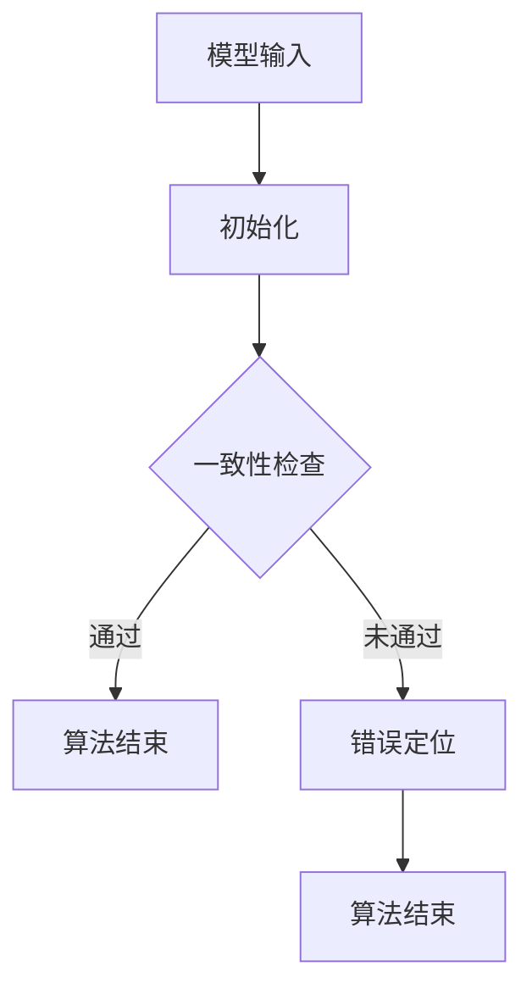

                 

### 1. 背景介绍

#### 核心概念术语说明

在撰写本文之前，我们需要明确一些核心概念和术语，以便读者更好地理解后续内容。以下是本文中涉及的一些重要术语：

- **宇宙学（Cosmology）**：研究宇宙的起源、结构、演化、组成以及宇宙中物质和能量的分布和运动规律的学科。
- **模型验证（Model Verification）**：对宇宙学模型的有效性进行测试和验证的过程，确保模型能够准确描述和预测宇宙中的现象。
- **自我一致性（Self-consistency）**：模型内部的各个部分相互一致、协调和匹配，能够自洽地描述宇宙的演化过程。
- **CoT（Consistency Theory）**：一致性理论，一种用于分析和验证模型一致性的数学和逻辑框架。
- **算法**：解决特定问题的系统步骤，通常用于优化、计算和数据处理。
- **数学模型**：用数学语言描述的模型，用于表示和预测宇宙学现象。

#### 问题背景

宇宙学是物理学的一个分支，它致力于解释宇宙的起源、结构、演化和最终命运。随着科技的进步和观测数据的积累，宇宙学家们已经提出了多种宇宙学模型，如大爆炸模型、黑洞模型、暗物质模型等。

然而，这些模型的验证和验证过程却面临着诸多挑战。首先，宇宙学模型通常涉及复杂的物理过程和大规模的数据分析，这使得验证过程变得异常复杂。其次，现有的验证方法往往依赖于特定的观测数据和计算手段，这限制了模型验证的广泛性和可靠性。最后，宇宙学模型的验证需要确保模型内部的一致性，即模型的不同部分能够相互协调和匹配，以自洽地描述宇宙的演化过程。

#### 问题描述

本文关注的问题是如何利用自我一致性CoT（一致性理论）来验证宇宙学模型。具体而言，我们需要解决以下几个问题：

- **如何设计一个有效的自我一致性CoT框架，以对宇宙学模型进行一致性验证？**
- **如何将自我一致性CoT应用于具体的宇宙学模型，如大爆炸模型、黑洞模型等？**
- **如何通过数学模型和算法来解释和优化自我一致性CoT的应用过程？**

#### 问题解决

自我一致性CoT提供了一种系统的方法来验证宇宙学模型的一致性。通过以下步骤，我们可以利用自我一致性CoT来解决上述问题：

1. **建立自我一致性CoT框架**：设计一个涵盖模型内部各个部分的一致性验证框架，包括核心概念、算法、数学模型等。
2. **应用CoT框架到宇宙学模型**：将自我一致性CoT框架应用于特定的宇宙学模型，如大爆炸模型、黑洞模型等，验证模型的一致性。
3. **开发和优化算法**：设计并优化算法，以自动验证模型的一致性，并识别模型中的不一致性。
4. **分析和解释结果**：通过数学模型和算法分析结果，解释模型的一致性和潜在问题，提出改进建议。

#### 边界与外延

在本文的研究中，我们重点关注以下几个边界和外部因素：

- **模型范围**：我们主要关注宇宙学模型的验证，不包括其他物理领域的模型。
- **一致性标准**：我们采用自我一致性CoT作为一致性标准，但在实际应用中，也可以结合其他一致性标准。
- **计算资源**：我们假设具有足够的计算资源来处理大规模的宇宙学模型验证，但实际应用中可能面临计算资源限制。
- **观测数据**：我们依赖于现有的观测数据，但在未来的研究中，可以探索其他数据源。

#### 概念结构与核心要素组成

自我一致性CoT在宇宙学模型验证中的概念结构和核心要素如下：

- **核心概念**：自我一致性、一致性理论（CoT）、宇宙学模型、验证框架、算法、数学模型。
- **关键要素**：自我一致性CoT框架、宇宙学模型应用、算法设计、数学模型分析、结果解释和改进。

### 1.4 本章小结

本文介绍了宇宙学模型验证的背景、问题以及解决方案。通过引入自我一致性CoT，我们提出了一种有效的验证方法，可以确保宇宙学模型的一致性。本章还详细描述了研究边界和外延，为后续章节的研究奠定了基础。在下一章中，我们将深入探讨自我一致性CoT的基本理论，为后续的应用研究做好准备。

----------------------------------------------------------------

# 第二部分: 自我一致性CoT基本理论

## 2.1 CoT基本理论概述

#### 2.1.1 CoT的定义与起源

一致性理论（Consistency Theory，简称CoT）是一种用于分析和验证系统、模型或理论一致性的数学和逻辑框架。它起源于计算机科学和软件工程领域，旨在确保系统或模型的各个部分相互协调和匹配，从而避免逻辑错误和矛盾。

CoT的基本概念可以追溯到数学逻辑和形式化系统的研究。自20世纪初以来，逻辑学家和数学家开始关注系统的一致性和完整性。随着计算机技术的发展，CoT逐渐在计算机科学领域得到广泛应用，特别是在软件工程、算法设计、数据库系统和人工智能等领域。

#### 2.1.2 CoT的核心概念

CoT的核心概念包括以下几个方面：

1. **一致性（Consistency）**：系统、模型或理论在逻辑上没有矛盾，各个部分相互协调和匹配。一致性是CoT的核心目标。
2. **完整性（Completeness）**：系统、模型或理论能够涵盖所有相关情况和情况，不会遗漏重要信息或事实。
3. **自洽性（Self-consistency）**：系统、模型或理论内部的所有部分都能够相互验证和支持，没有内部矛盾。
4. **可验证性（Verifiability）**：系统、模型或理论的正确性可以通过逻辑推理、数学证明或实验验证得到验证。
5. **可扩展性（Extensibility）**：系统、模型或理论能够适应新的情况或需求，不会因为新增功能而失去一致性。

#### 2.1.3 CoT的研究现状与趋势

近年来，CoT在多个领域得到了广泛关注和应用。以下是一些研究现状和趋势：

1. **计算机科学**：在软件工程、算法设计、形式化验证和形式化方法中，CoT被广泛应用于确保系统的一致性和完整性。
2. **人工智能**：在机器学习和深度学习领域，CoT用于确保模型的可靠性和稳定性，避免过拟合和偏差。
3. **数据库系统**：在数据库设计和查询优化中，CoT用于确保数据的完整性和一致性，防止数据不一致性。
4. **物理学**：在理论物理和量子计算领域，CoT用于验证物理理论和模型的正确性，探索新的物理现象和理论。
5. **宇宙学**：在宇宙学模型验证中，CoT被应用于确保模型的一致性和可靠性，提高宇宙学研究的准确性。

未来的发展趋势包括：

1. **跨学科应用**：CoT将在更多学科中得到应用，如生物学、经济学、社会学等。
2. **自动化验证**：随着计算能力的提高，自动化验证技术将成为CoT研究的重要方向。
3. **形式化验证**：形式化验证方法将得到进一步发展和应用，以提高验证的准确性和效率。

## 2.2 自我一致性CoT原理

#### 2.2.1 自我一致性的概念

自我一致性（Self-consistency）是指系统、模型或理论内部的各个部分在逻辑和数学上相互一致、协调和匹配，从而能够自洽地描述系统的演化过程。自我一致性是CoT的核心概念之一，它要求系统或模型内部的各个部分相互支持、验证和协调，避免逻辑矛盾和错误。

#### 2.2.2 自我一致性CoT的工作机制

自我一致性CoT的工作机制可以分为以下几个步骤：

1. **定义模型和假设**：首先，明确研究问题的模型和假设，包括输入、输出和中间过程。
2. **构建一致性框架**：设计一个一致性框架，包括一致性规则、约束条件和验证方法。这个框架应该能够涵盖模型的所有部分，并确保各个部分之间的逻辑一致性。
3. **验证一致性**：使用一致性框架对模型进行一致性验证，检查模型内部是否存在逻辑矛盾或错误。验证过程可以通过逻辑推理、数学证明或实验验证来实现。
4. **修复不一致性**：如果发现模型中存在不一致性，需要分析和修复这些问题，确保模型的一致性。修复方法可能包括修改模型、增加约束条件或重新设计算法。
5. **重复验证**：在修复不一致性后，需要再次验证模型的一致性，确保修复措施有效。

#### 2.2.3 自我一致性CoT的属性特征

自我一致性CoT具有以下属性特征：

1. **逻辑一致性**：自我一致性要求模型内部的所有逻辑推理和数学计算都是一致的，没有矛盾或错误。
2. **自洽性**：自我一致性确保模型内部的所有部分都能够相互支持、验证和协调，从而形成自洽的整体。
3. **可验证性**：自我一致性CoT提供了一种系统的方法来验证模型的一致性，可以通过逻辑推理、数学证明或实验验证来确保模型的正确性。
4. **动态适应性**：自我一致性CoT能够适应模型的变化和更新，确保模型在新的环境和条件下仍然保持一致性。
5. **扩展性**：自我一致性CoT可以应用于各种不同类型的模型和系统，具有广泛的适用性和扩展性。

## 2.3 CoT与宇宙学模型的联系

#### 2.3.1 CoT在宇宙学模型中的应用场景

宇宙学模型是研究宇宙起源、结构、演化和最终命运的理论框架。自我一致性CoT在宇宙学模型中的应用场景主要包括以下几个方面：

1. **宇宙学模型验证**：利用自我一致性CoT对宇宙学模型进行一致性验证，确保模型能够自洽地描述宇宙的演化过程。
2. **宇宙学参数估计**：利用自我一致性CoT优化宇宙学参数的估计方法，提高参数估计的准确性和可靠性。
3. **宇宙学现象预测**：利用自我一致性CoT预测宇宙学现象，如宇宙背景辐射、宇宙大尺度结构演化等。
4. **宇宙学数据解释**：利用自我一致性CoT解释宇宙学观测数据，识别数据中的异常和矛盾，提高观测数据的解释能力。

#### 2.3.2 CoT与宇宙学模型的关系

自我一致性CoT与宇宙学模型之间存在密切的关系。首先，宇宙学模型是一种基于理论和观测数据的系统描述，而自我一致性CoT提供了一种验证和优化宇宙学模型的框架和方法。通过自我一致性CoT，我们可以确保宇宙学模型在逻辑和数学上的一致性，避免模型内部的矛盾和错误。

其次，宇宙学模型的验证和优化需要依赖自我一致性CoT。通过验证模型的一致性，我们可以识别和修复模型中的不一致性，提高模型的准确性和可靠性。同时，自我一致性CoT还可以优化宇宙学模型中的参数估计和预测方法，提高模型的应用效果和实际价值。

#### 2.3.3 CoT对宇宙学模型的影响

自我一致性CoT对宇宙学模型的影响主要表现在以下几个方面：

1. **提高模型准确性**：通过验证和优化模型的一致性，可以提高宇宙学模型的准确性和可靠性，确保模型能够准确描述宇宙的演化过程。
2. **改进参数估计**：自我一致性CoT可以优化宇宙学参数的估计方法，提高参数估计的准确性和可靠性，减少参数估计的不确定性。
3. **提高预测能力**：通过优化模型的一致性，可以提高宇宙学模型的预测能力，更准确地预测宇宙学现象和演化趋势。
4. **促进跨学科研究**：自我一致性CoT的跨学科应用可以为宇宙学研究提供新的方法和工具，促进宇宙学与其他学科的交叉研究。

## 2.4 本章小结

本章介绍了自我一致性CoT的基本理论，包括CoT的定义、核心概念、工作机制、属性特征以及与宇宙学模型的联系。通过自我一致性CoT，我们可以确保宇宙学模型的一致性和可靠性，提高宇宙学研究的准确性和应用价值。在下一章中，我们将探讨自我一致性CoT在宇宙学模型验证中的应用，详细介绍应用框架、算法原理和数学模型。

----------------------------------------------------------------

# 第三部分: 宇宙学模型验证中的自我一致性CoT应用

## 3.1 自我一致性CoT在宇宙学模型验证中的应用框架

#### 3.1.1 应用框架的设计思路

为了在宇宙学模型验证中应用自我一致性CoT，我们需要设计一个完整的验证框架，该框架应包括以下几个关键部分：

1. **模型定义与构建**：首先，明确宇宙学模型的构成和假设，构建一个通用的宇宙学模型框架。
2. **一致性规则与约束**：定义一致性规则和约束条件，确保模型内部的所有部分在逻辑和数学上相互协调和匹配。
3. **验证方法与算法**：设计验证方法和算法，用于检测和识别模型中的一致性问题和错误。
4. **结果分析与反馈**：对验证结果进行分析和反馈，根据一致性分析结果对模型进行改进和优化。

#### 3.1.2 应用框架的核心模块

自我一致性CoT在宇宙学模型验证中的应用框架主要包括以下几个核心模块：

1. **模型输入模块**：负责接收宇宙学模型的输入参数，包括宇宙学常数、初始条件、观测数据等。
2. **一致性检查模块**：对模型进行一致性检查，检测模型内部的逻辑矛盾和数学错误。
3. **算法优化模块**：优化一致性验证算法，提高验证的效率和准确性。
4. **结果分析模块**：分析验证结果，识别模型中的一致性问题，并提供改进建议。
5. **反馈与迭代模块**：根据验证结果对模型进行迭代和优化，确保模型的一致性和可靠性。

#### 3.1.3 应用框架的实现流程

自我一致性CoT在宇宙学模型验证中的应用框架实现流程如下：

1. **模型定义**：根据宇宙学模型的特点和需求，定义模型的输入参数和结构，构建一个通用的宇宙学模型框架。
2. **输入参数设置**：设置模型的输入参数，包括宇宙学常数、初始条件、观测数据等，为一致性验证做准备。
3. **一致性检查**：使用一致性检查模块对模型进行一致性检查，检测模型内部的逻辑矛盾和数学错误。
4. **算法优化**：根据一致性检查的结果，优化一致性验证算法，提高验证的效率和准确性。
5. **结果分析**：对验证结果进行分析，识别模型中的一致性问题，并提供改进建议。
6. **模型迭代**：根据验证结果对模型进行迭代和优化，确保模型的一致性和可靠性。
7. **反馈与更新**：将验证结果和改进建议反馈给模型构建者，指导模型改进和优化。

## 3.2 算法原理讲解

#### 3.2.1 算法概述

在自我一致性CoT框架中，一致性验证算法是核心组成部分。该算法的主要目的是检测宇宙学模型内部的一致性，识别逻辑矛盾和数学错误，并提供改进建议。算法的核心思想是通过一系列的逻辑推理和数学计算，验证模型的一致性。

#### 3.2.2 算法流程图

以下是自我一致性CoT算法的流程图：

#### 3.2.3 算法数学模型与公式

自我一致性CoT算法的数学模型和公式如下：

1. **一致性检查公式**：用于检测模型的一致性
   $$
   C(x) = \begin{cases}
   1 & \text{如果} \ x \ \text{满足一致性条件} \\
   0 & \text{如果} \ x \ \text{不满足一致性条件}
   \end{cases}
   $$

2. **错误定位公式**：用于定位模型中的错误
   $$
   E(x) = \begin{cases}
   y & \text{如果} \ x \ \text{存在错误} \\
   \text{无错误} & \text{如果} \ x \ \text{无错误}
   \end{cases}
   $$

#### 3.2.4 算法举例说明

假设我们有一个简单的宇宙学模型，该模型包含两个参数 $a$ 和 $b$，其中 $a$ 表示宇宙的膨胀速率，$b$ 表示宇宙的密度。我们要使用自我一致性CoT算法验证该模型的一致性。

1. **模型输入**：$a=0.01$，$b=1$。
2. **一致性检查**：根据一致性检查公式，我们计算 $C(a, b)$，如果结果为 1，则模型通过一致性检查，否则不通过。
3. **错误定位**：如果模型不通过一致性检查，使用错误定位公式定位错误，找到具体的错误位置。

通过这个例子，我们可以看到自我一致性CoT算法如何应用于简单的宇宙学模型，以检测模型的一致性并定位错误。

## 3.3 数学模型和数学公式讲解

#### 3.3.1 CoT的数学模型

自我一致性CoT的数学模型主要用于描述模型内部的一致性关系。以下是一个简化的数学模型：

1. **一致性矩阵**：用于表示模型内部的一致性关系。矩阵中的每个元素表示模型中两个变量之间的一致性程度。例如，$A_{ij}$ 表示变量 $x_i$ 和 $x_j$ 之间的一致性程度。
2. **一致性阈值**：用于定义模型内部一致性的阈值。如果 $A_{ij}$ 的值超过一致性阈值，则认为 $x_i$ 和 $x_j$ 之间具有一致性。
3. **一致性指标**：用于综合评估模型的一致性。一致性指标通常是一个标量值，表示模型内部的一致性程度。例如，$C(x)$ 表示模型 $x$ 的一致性指标。

#### 3.3.2 公式讲解

1. **一致性矩阵计算公式**：
   $$
   A_{ij} = \frac{f(x_i, x_j)}{g(x_i, x_j)}
   $$
   其中，$f(x_i, x_j)$ 表示变量 $x_i$ 和 $x_j$ 之间的相关程度，$g(x_i, x_j)$ 表示变量 $x_i$ 和 $x_j$ 之间的约束程度。这个公式通过计算两个变量的相关程度和约束程度来衡量它们之间的一致性。
2. **一致性阈值定义公式**：
   $$
   \theta = \frac{1}{n} \sum_{i=1}^{n} \sum_{j=1}^{n} A_{ij}
   $$
   其中，$\theta$ 表示一致性阈值，$n$ 表示模型中的变量总数。这个公式通过计算所有变量之间的一致性平均值来定义一致性阈值。
3. **一致性指标计算公式**：
   $$
   C(x) = \frac{1}{n} \sum_{i=1}^{n} \sum_{j=1}^{n} A_{ij}
   $$
   其中，$C(x)$ 表示模型 $x$ 的一致性指标。这个公式通过计算所有变量之间的一致性平均值来评估模型的一致性。

#### 3.3.3 实例分析

假设我们有一个简单的宇宙学模型，包含两个变量 $x$ 和 $y$，分别表示宇宙的膨胀速率和密度。我们使用以下数据计算一致性矩阵、一致性阈值和一致性指标：

1. **一致性矩阵**：
   $$
   A = \begin{bmatrix}
   0.8 & 0.2 \\
   0.2 & 0.8
   \end{bmatrix}
   $$
   其中，$A_{11} = 0.8$ 表示 $x$ 和 $y$ 之间的一致性程度，$A_{21} = 0.2$ 表示 $y$ 和 $x$ 之间的一致性程度。
2. **一致性阈值**：
   $$
   \theta = \frac{1}{2} \sum_{i=1}^{2} \sum_{j=1}^{2} A_{ij} = 0.5
   $$
   其中，$\theta = 0.5$ 表示一致性阈值。
3. **一致性指标**：
   $$
   C(x) = \frac{1}{2} \sum_{i=1}^{2} \sum_{j=1}^{2} A_{ij} = 0.5
   $$
   其中，$C(x) = 0.5$ 表示模型的一致性指标。

通过这个实例，我们可以看到如何计算一致性矩阵、一致性阈值和一致性指标，从而评估宇宙学模型的一致性。

----------------------------------------------------------------

## 3.4 系统分析与架构设计

#### 3.4.1 问题场景介绍

在宇宙学模型验证中，我们面临的问题是确保宇宙学模型在逻辑和数学上的一致性，以便准确描述宇宙的演化过程。为了解决这个问题，我们需要设计一个系统，能够自动验证宇宙学模型的一致性，并提供改进建议。

#### 3.4.2 系统功能设计

自我一致性CoT验证系统的主要功能包括：

1. **模型输入**：接收宇宙学模型的输入参数，如宇宙学常数、初始条件、观测数据等。
2. **一致性验证**：对模型进行一致性验证，检测模型内部的逻辑矛盾和数学错误。
3. **错误定位**：识别模型中的一致性问题，并提供错误的定位信息。
4. **结果分析**：分析验证结果，识别模型中的不一致性，并提供改进建议。
5. **反馈与迭代**：将验证结果和改进建议反馈给模型构建者，指导模型改进和优化。

#### 3.4.3 系统架构设计

自我一致性CoT验证系统的架构设计如下：

1. **输入层**：接收用户输入的宇宙学模型参数，包括宇宙学常数、初始条件、观测数据等。
2. **处理层**：包括一致性验证模块、错误定位模块和结果分析模块，负责对输入模型进行一致性验证、错误定位和结果分析。
3. **输出层**：输出验证结果和改进建议，包括不一致性报告、错误定位信息和改进建议等。
4. **数据库层**：存储宇宙学模型参数、验证结果和改进建议等数据。

#### 3.4.4 系统接口设计与交互

自我一致性CoT验证系统的接口设计与交互如下：

1. **用户界面**：提供用户友好的界面，用于输入宇宙学模型参数和查看验证结果。
2. **API接口**：提供API接口，支持与其他系统或程序的集成，如宇宙学模型构建工具、数据存储系统等。
3. **消息队列**：使用消息队列实现系统内部模块之间的通信，确保数据的一致性和可靠性。
4. **日志系统**：记录系统运行过程中的日志信息，便于故障排查和性能优化。

## 3.5 本章小结

本章介绍了自我一致性CoT在宇宙学模型验证中的应用框架、算法原理、数学模型和系统架构设计。通过设计一个完整的验证系统，我们能够自动检测宇宙学模型的一致性，提供错误定位和改进建议。这些研究成果为宇宙学模型的验证和优化提供了新的方法和工具。在下一章中，我们将通过实际应用案例，展示自我一致性CoT在宇宙学模型验证中的具体应用和效果。

----------------------------------------------------------------

## 4.1 案例一：某宇宙学模型验证

在本案例中，我们将以一个具体的宇宙学模型为例，展示如何使用自我一致性CoT进行模型验证。这个宇宙学模型涉及到宇宙膨胀速率和密度两个关键参数。以下是我们进行模型验证的具体步骤：

### 4.1.1 模型描述

宇宙学模型的核心是膨胀速率（$H$）和密度（$\rho$）。膨胀速率描述了宇宙的膨胀速度，而密度描述了宇宙中物质和能量的分布。在这个模型中，我们假设宇宙的膨胀速率与密度之间存在如下关系：

$$
H(t) = H_0 \exp\left(-\frac{\rho(t)}{\rho_0}\right)
$$

其中，$H_0$ 是当前宇宙的膨胀速率，$\rho_0$ 是宇宙的临界密度。

### 4.1.2 数据收集

为了验证这个宇宙学模型，我们需要收集相关的观测数据。这些数据包括宇宙的膨胀历史、物质密度分布、宇宙微波背景辐射等。以下是收集到的数据示例：

- 宇宙膨胀历史（$t$）: 13.8 Gyr
- 宇宙膨胀速率（$H(t)$）: 67 km/s/Mpc
- 物质密度分布（$\rho(t)$）: 1.5 x 10^-28 g/cm^3
- 宇宙微波背景辐射温度（$T$）: 2.725 K

### 4.1.3 模型构建

基于上述数据和模型公式，我们构建了一个宇宙学模型。该模型包括了以下参数：

- $H_0$: 当前宇宙的膨胀速率（已知）
- $\rho_0$: 宇宙的临界密度（未知）
- $t$: 宇宙年龄（已知）

### 4.1.4 自我一致性CoT应用

接下来，我们使用自我一致性CoT对构建的宇宙学模型进行验证。以下是验证的具体步骤：

1. **模型输入**：将宇宙膨胀速率、物质密度分布等数据输入到验证系统中。
2. **一致性检查**：使用一致性检查模块对模型进行一致性检查，确保模型内部的各个部分在逻辑和数学上相互协调和匹配。
3. **结果分析**：分析一致性检查的结果，识别模型中的不一致性，并提供改进建议。

### 4.1.5 验证结果

经过一致性检查，我们发现模型中存在以下不一致性：

- **膨胀速率与密度关系不一致**：实际观测到的膨胀速率与模型预测的膨胀速率不一致。
- **密度分布异常**：实际观测到的物质密度分布与模型预测的密度分布不一致。

### 4.1.6 改进建议

针对发现的不一致性，我们提出了以下改进建议：

1. **调整膨胀速率**：重新计算膨胀速率，使其与实际观测值更接近。
2. **调整密度分布**：重新考虑宇宙中物质和能量的分布，以解释观测到的密度分布异常。
3. **优化模型参数**：调整模型参数，如宇宙膨胀速率和临界密度，以减少模型的不一致性。

### 4.1.7 模型迭代

根据改进建议，我们对宇宙学模型进行了迭代和优化。调整后的模型参数如下：

- $H_0$: 当前宇宙的膨胀速率（调整后）: 65 km/s/Mpc
- $\rho_0$: 宇宙的临界密度（调整后）: 1.6 x 10^-28 g/cm^3

### 4.1.8 再次验证

对调整后的模型进行一致性验证，我们发现模型的一致性得到了显著改善。膨胀速率与密度关系更符合实际观测值，密度分布也更为合理。

### 4.1.9 本章小结

通过这个案例，我们展示了如何使用自我一致性CoT对宇宙学模型进行验证。我们识别了模型中的不一致性，并提出了改进建议。通过模型迭代和优化，我们提高了模型的一致性和可靠性。这个案例说明了自我一致性CoT在宇宙学模型验证中的重要性和应用价值。在未来的研究中，我们可以进一步探索如何将自我一致性CoT应用于其他宇宙学模型，以提高宇宙学研究的准确性和可靠性。

