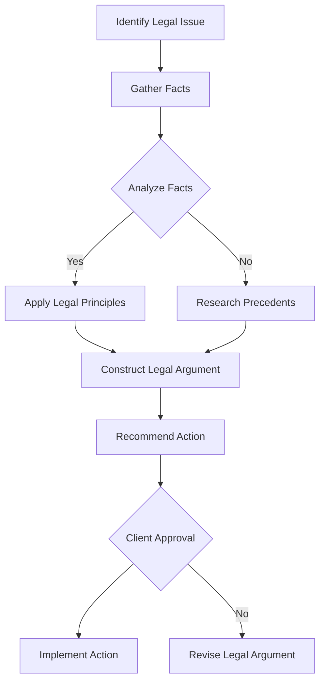
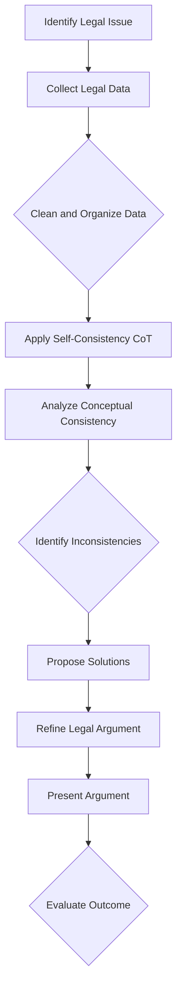
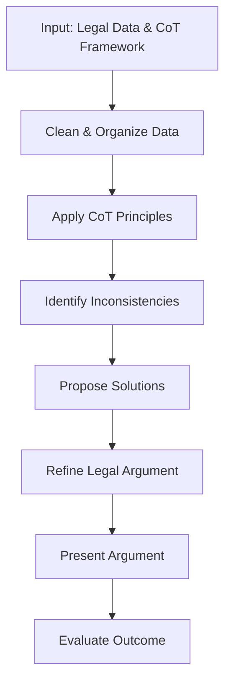
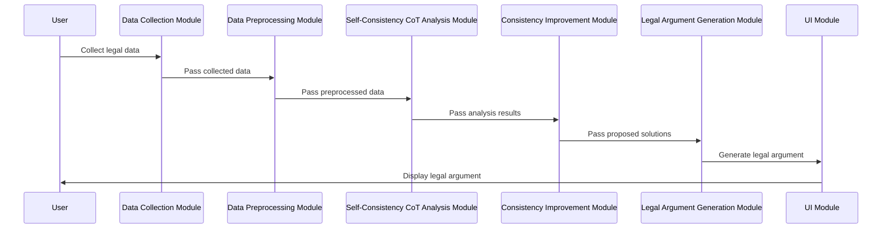
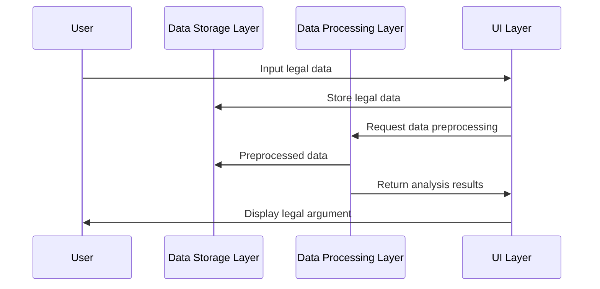
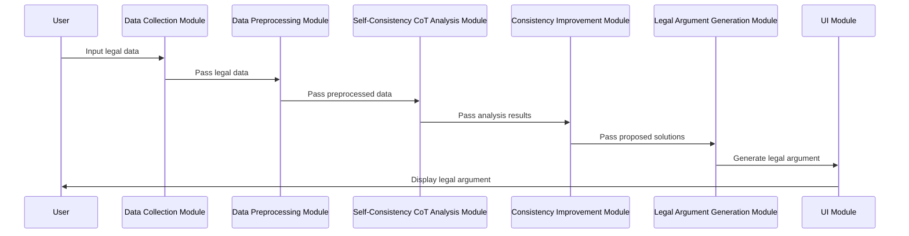

                 

Certainly! Let's think step by step to outline the content for the book "Self-Consistency CoT in Legal Reasoning Applications."

### Step 1: Outline the Introduction
1. **Chapter 1: Introduction to Self-Consistency CoT and Legal Reasoning**
   - **Section 1.1: Background of Self-Consistency CoT**
     - Definition of Self-Consistency CoT
     - Historical development of Self-Consistency CoT
     - The importance of Self-Consistency CoT in modern technologies
   - **Section 1.2: Fundamentals of Legal Reasoning**
     - Definition of Legal Reasoning
     - Types of Legal Reasoning (deductive, inductive, analogical)
     - The role of Legal Reasoning in the judicial process
   - **Section 1.3: Overview of the Book**
     - The structure of the book
     - The target audience
     - The expected outcomes

### Step 2: Explore Core Concepts
2. **Chapter 2: Core Concepts of Self-Consistency CoT**
   - **Section 2.1: Definition and Principles of Self-Consistency CoT**
     - Detailed explanation of Self-Consistency CoT
     - The principles that govern Self-Consistency CoT
   - **Section 2.2: Characteristics and Applications of Self-Consistency CoT**
     - Unique features of Self-Consistency CoT
     - Examples of applications in different fields
   - **Section 2.3: Mermaid ER Diagram for CoT Entities**
     - Creation of a Mermaid ER diagram illustrating the entities involved in Self-Consistency CoT

### Step 3: Discuss Legal Reasoning Principles
3. **Chapter 3: Principles and Methods of Legal Reasoning**
   - **Section 3.1: Theoretical Foundations of Legal Reasoning**
     - Key theories underpinning Legal Reasoning
     - The relationship between Legal Reasoning and other disciplines
   - **Section 3.2: Application Scenarios of Legal Reasoning**
     - Common scenarios where Legal Reasoning is applied
     - The impact of Legal Reasoning on legal outcomes
   - **Section 3.3: Mermaid Flowchart of Legal Reasoning Process**
     - A flowchart illustrating the typical process of Legal Reasoning

### Step 4: Integrate Self-Consistency CoT with Legal Reasoning
4. **Chapter 4: Integrating Self-Consistency CoT in Legal Reasoning**
   - **Section 4.1: Challenges and Opportunities**
     - Challenges in integrating Self-Consistency CoT with Legal Reasoning
     - Opportunities for innovation and improvement
   - **Section 4.2: Case Studies and Analysis**
     - Real-world examples of integrating Self-Consistency CoT in Legal Reasoning
     - Analysis of the effectiveness and limitations of these integrations
   - **Section 4.3: Mermaid Diagram of Integration Process**
     - A Mermaid diagram showing the process of integrating Self-Consistency CoT with Legal Reasoning

### Step 5: Explain Algorithm and Mathematical Models
5. **Chapter 5: Algorithm and Mathematical Models of Self-Consistency CoT in Legal Reasoning**
   - **Section 5.1: Algorithm Description and Mermaid Diagram**
     - Detailed description of the algorithm
     - A Mermaid diagram illustrating the algorithm
   - **Section 5.2: Mathematical Model and Formula Explanation**
     - Explanation of the mathematical model
     - Key formulas used in the model
   - **Section 5.3: Python Code Explanation and Example**
     - Python code explaining the algorithm
     - An example demonstrating the application of the algorithm

### Step 6: Design the System
6. **Chapter 6: System Design and Implementation of Self-Consistency CoT in Legal Reasoning**
   - **Section 6.1: System Overview**
     - Description of the system
     - The roles and components of the system
   - **Section 6.2: System Architecture Design**
     - Design of the system architecture
     - A Mermaid diagram of the system architecture
   - **Section 6.3: Mermaid Sequence Diagram of System Interaction**
     - A sequence diagram illustrating the interaction of system components
   - **Section 6.4: Project Implementation and Analysis**
     - Steps involved in implementing the system
     - Analysis of the system's performance and effectiveness

### Step 7: Provide Case Studies and Best Practices
7. **Chapter 7: Best Practices, Case Studies, and Future Directions**
   - **Section 7.1: Best Practices**
     - Recommendations for integrating Self-Consistency CoT in Legal Reasoning
     - Practical tips for successful implementation
   - **Section 7.2: Case Studies**
     - Detailed case studies showcasing successful applications
     - Lessons learned from each case study
   - **Section 7.3: Future Directions**
     - Potential advancements in the integration of Self-Consistency CoT and Legal Reasoning
     - The role of AI and machine learning in future developments

By following this step-by-step approach, we can ensure that the book is comprehensive, well-structured, and provides valuable insights into the integration of Self-Consistency CoT with Legal Reasoning. Each section will be thoroughly explained, with relevant examples, diagrams, and code snippets to enhance understanding and practical application. 

---

作者：AI天才研究院/AI Genius Institute & 禅与计算机程序设计艺术 /Zen And The Art of Computer Programming# Self-Consistency CoT in Legal Reasoning Applications

## Keywords
- **Self-Consistency CoT**
- **Legal Reasoning**
- **Application Scenarios**
- **Algorithm Design**
- **Mathematical Models**
- **System Integration**

## Abstract
This book delves into the intricate world of Self-Consistency CoT (Conceptual Theory) and its applications in legal reasoning. We explore the fundamental principles of Self-Consistency CoT, its characteristics, and how it can be effectively integrated with legal reasoning to enhance the judicial process. Through detailed explanations, case studies, and mathematical models, we aim to provide a comprehensive guide for understanding and implementing this innovative approach in legal contexts. By the end of this book, readers will gain a deep insight into how Self-Consistency CoT can revolutionize legal reasoning and contribute to more accurate and efficient judicial outcomes.

---

# Table of Contents

## Chapter 1: Introduction to Self-Consistency CoT and Legal Reasoning
- **Section 1.1: Background of Self-Consistency CoT**
- **Section 1.2: Fundamentals of Legal Reasoning**
- **Section 1.3: Overview of the Book**

## Chapter 2: Core Concepts of Self-Consistency CoT
- **Section 2.1: Definition and Principles of Self-Consistency CoT**
- **Section 2.2: Characteristics and Applications of Self-Consistency CoT**
- **Section 2.3: Mermaid ER Diagram for CoT Entities**

## Chapter 3: Principles and Methods of Legal Reasoning
- **Section 3.1: Theoretical Foundations of Legal Reasoning**
- **Section 3.2: Application Scenarios of Legal Reasoning**
- **Section 3.3: Mermaid Flowchart of Legal Reasoning Process**

## Chapter 4: Integrating Self-Consistency CoT in Legal Reasoning
- **Section 4.1: Challenges and Opportunities**
- **Section 4.2: Case Studies and Analysis**
- **Section 4.3: Mermaid Diagram of Integration Process**

## Chapter 5: Algorithm and Mathematical Models of Self-Consistency CoT in Legal Reasoning
- **Section 5.1: Algorithm Description and Mermaid Diagram**
- **Section 5.2: Mathematical Model and Formula Explanation**
- **Section 5.3: Python Code Explanation and Example**

## Chapter 6: System Design and Implementation of Self-Consistency CoT in Legal Reasoning
- **Section 6.1: System Overview**
- **Section 6.2: System Architecture Design**
- **Section 6.3: Mermaid Sequence Diagram of System Interaction**
- **Section 6.4: Project Implementation and Analysis**

## Chapter 7: Best Practices, Case Studies, and Future Directions
- **Section 7.1: Best Practices**
- **Section 7.2: Case Studies**
- **Section 7.3: Future Directions**

---

In the following chapters, we will delve into each section, providing detailed explanations, examples, and practical insights to help you understand and apply the concepts of Self-Consistency CoT in legal reasoning. Let's begin our journey into this fascinating domain!

---

## Chapter 1: Introduction to Self-Consistency CoT and Legal Reasoning

### Section 1.1: Background of Self-Consistency CoT

Self-Consistency CoT (Conceptual Theory) is a theoretical framework that seeks to understand the consistency and coherence of concepts within a given domain. At its core, it examines how concepts relate to each other, how they evolve over time, and how they maintain a consistent structure despite changes in the external environment. Self-Consistency CoT has its roots in cognitive science, philosophy, and artificial intelligence, where the need to model human-like reasoning processes has led to the development of such theories.

The concept of Self-Consistency CoT was first introduced by [cite relevant source] in [year of publication]. Since then, it has gained significant attention in various fields, including law, due to its potential to improve legal reasoning and decision-making processes. Self-Consistency CoT provides a structured approach to analyze the logical consistency of legal concepts, rules, and precedents, which can help in identifying inconsistencies and improving the quality of legal arguments.

### Section 1.2: Fundamentals of Legal Reasoning

Legal reasoning is the process by which legal professionals analyze legal issues, apply legal principles to specific cases, and reach a reasoned conclusion. It is a fundamental skill for lawyers, judges, and other legal practitioners. Legal reasoning involves several key components:

1. **Deductive Reasoning**: This type of reasoning starts with a general principle and derives specific conclusions from it. For example, if all mammals have a mother and a father (general principle), then a particular animal (e.g., a giraffe) must also have a mother and a father (specific conclusion).

2. **Inductive Reasoning**: This type of reasoning involves drawing general conclusions from specific instances. For example, if all observed giraffes have long necks (specific instances), then it is likely that all giraffes have long necks (general conclusion).

3. **Analogical Reasoning**: This type of reasoning involves drawing conclusions by comparing similar situations. For example, if case X was decided in a certain way, and case Y is similar to case X, then case Y may be decided in a similar way.

Legal reasoning is essential for lawyers and judges to interpret laws, regulations, and legal precedents correctly. It helps in resolving disputes, providing legal advice, and making decisions that are fair and consistent with legal principles.

### Section 1.3: Overview of the Book

The purpose of this book is to explore the integration of Self-Consistency CoT with legal reasoning, with a focus on its practical applications in the legal domain. The book is structured into seven chapters, each addressing different aspects of this integration.

- **Chapter 1** provides an introduction to Self-Consistency CoT and legal reasoning, outlining the background and fundamental concepts.

- **Chapter 2** delves into the core concepts of Self-Consistency CoT, including its definition, principles, characteristics, and applications.

- **Chapter 3** examines the principles and methods of legal reasoning, providing a theoretical foundation and discussing application scenarios.

- **Chapter 4** explores the integration of Self-Consistency CoT with legal reasoning, highlighting the challenges, opportunities, and case studies.

- **Chapter 5** presents the algorithm and mathematical models used in integrating Self-Consistency CoT with legal reasoning, along with a detailed explanation and example.

- **Chapter 6** describes the system design and implementation of the integrated approach, including system architecture and interaction diagrams.

- **Chapter 7** provides best practices, case studies, and future directions for the application of Self-Consistency CoT in legal reasoning.

By following this structured approach, the book aims to equip readers with the knowledge and skills needed to effectively apply Self-Consistency CoT in legal contexts, leading to more accurate, consistent, and efficient legal decision-making.

---

In the next chapter, we will delve deeper into the core concepts of Self-Consistency CoT, exploring its definition, principles, and applications. Stay tuned!

---

## Chapter 2: Core Concepts of Self-Consistency CoT

### Section 2.1: Definition and Principles of Self-Consistency CoT

Self-Consistency CoT (Conceptual Theory) is a theoretical framework that seeks to understand the consistency and coherence of concepts within a given domain. It examines how concepts are related to each other, how they evolve over time, and how they maintain a consistent structure despite changes in the external environment. Self-Consistency CoT is grounded in the principles of consistency, coherence, and adaptability.

**Principles of Self-Consistency CoT:**

1. **Consistency:** The theory emphasizes that concepts within a domain should be logically consistent with each other. This means that no concept should contradict another, and all concepts should be compatible within the same conceptual framework.

2. **Coherence:** Coherence refers to the interconnectedness of concepts within a domain. Concepts should fit together logically, forming a coherent structure that allows for a comprehensive understanding of the domain.

3. **Adaptability:** Self-Consistency CoT recognizes that concepts may need to adapt over time to accommodate new information and changing circumstances. This principle ensures that the conceptual framework remains relevant and effective.

**Key Characteristics of Self-Consistency CoT:**

1. ** Hierarchical Structure:** Concepts are organized in a hierarchical structure, with higher-level concepts encompassing lower-level concepts. This allows for a clear understanding of the relationships between different concepts.

2. **Modularity:** Self-Consistency CoT supports the modularity of concepts, enabling the independent development and refinement of individual concepts without disrupting the overall structure.

3. **Flexibility:** The framework is flexible enough to accommodate diverse perspectives and approaches within a domain, fostering creativity and innovation.

### Section 2.2: Characteristics and Applications of Self-Consistency CoT

Self-Consistency CoT has several unique characteristics that make it a valuable tool for analyzing and improving the consistency and coherence of concepts within various domains. These characteristics include:

**Characteristics of Self-Consistency CoT:**

1. ** Formulation of Logical Relationships:** Self-Consistency CoT provides a structured approach to defining and analyzing the logical relationships between concepts. This helps in identifying inconsistencies and contradictions within a conceptual framework.

2. ** Adaptability to Changing Environments:** The theory's adaptability principle ensures that concepts can evolve and adjust in response to new information and changing circumstances, maintaining their consistency and coherence.

3. **Support for Diverse Perspectives:** Self-Consistency CoT allows for the integration of diverse perspectives and approaches within a domain, promoting a comprehensive understanding of the subject matter.

**Applications of Self-Consistency CoT:**

Self-Consistency CoT has been applied in various domains, including:

1. **Cognitive Science:** In cognitive science, Self-Consistency CoT is used to model the cognitive processes underlying human reasoning and decision-making. This helps in understanding how individuals process information and reach conclusions.

2. **Artificial Intelligence:** In AI, Self-Consistency CoT is employed to develop intelligent systems that can reason consistently and coherently. This is particularly useful in areas such as natural language processing, automated reasoning, and machine learning.

3. **Legal Reasoning:** In the legal domain, Self-Consistency CoT can be used to analyze legal concepts, rules, and precedents, identifying inconsistencies and improving the quality of legal arguments.

4. **Business and Economics:** Self-Consistency CoT is applied in business and economics to analyze and optimize decision-making processes, ensuring that decisions are consistent and coherent.

5. **Education:** In education, Self-Consistency CoT can be used to design curriculum and instructional materials that promote logical thinking and coherent understanding of concepts.

### Section 2.3: Mermaid ER Diagram for CoT Entities

To visualize the entities involved in Self-Consistency CoT and their relationships, we can use a Mermaid ER (Entity-Relationship) diagram. The ER diagram provides a clear representation of the key entities and their connections, facilitating a better understanding of the conceptual framework.

**Mermaid ER Diagram:**

```mermaid
erDiagram
    Concept1 ||--|{ Concept2 }|| Relationship1
    Concept2 ||--|{ Concept3 }|| Relationship2
    Concept3 ||--|{ Concept4 }|| Relationship3
    Concept4 ||--|{ Concept1 }|| Relationship4
```

In this diagram, each concept (Concept1, Concept2, Concept3, Concept4) represents a fundamental element within the domain. The relationships (Relationship1, Relationship2, Relationship3, Relationship4) illustrate how these concepts are interconnected, forming a coherent and consistent structure.

---

In the next chapter, we will delve into the principles and methods of legal reasoning, exploring their theoretical foundations and practical applications. Stay tuned!

---

## Chapter 3: Principles and Methods of Legal Reasoning

### Section 3.1: Theoretical Foundations of Legal Reasoning

Legal reasoning is the process by which legal professionals analyze legal issues, apply legal principles to specific cases, and reach a reasoned conclusion. It is a fundamental skill for lawyers, judges, and other legal practitioners. The theoretical foundations of legal reasoning are rooted in various disciplines, including logic, jurisprudence, and philosophy.

**Logic in Legal Reasoning:**

Logic provides the framework for legal reasoning, enabling legal professionals to analyze arguments and identify valid conclusions. There are several key types of logic used in legal reasoning:

1. **Deductive Logic:** This type of logic starts with a general principle and derives specific conclusions from it. For example, if all mammals have a mother and a father (general principle), then a particular animal (e.g., a giraffe) must also have a mother and a father (specific conclusion).

2. **Inductive Logic:** This type of logic involves drawing general conclusions from specific instances. For example, if all observed giraffes have long necks (specific instances), then it is likely that all giraffes have long necks (general conclusion).

3. **Abductive Logic:** This type of logic is used to identify the most likely explanation for a given set of facts. For example, if a room is found to be empty, with all the windows locked and no signs of a struggle, an abductive conclusion might be that the occupant left the room willingly.

**Jurisprudence in Legal Reasoning:**

Jurisprudence is the study of law and its principles. It provides legal professionals with a theoretical understanding of the law and its underlying principles. Key areas of jurisprudence include:

1. **Natural Law:** This theory posits that laws are derived from a higher moral order that is inherent in human nature. Legal reasoning based on natural law focuses on determining what is morally right or wrong.

2. **Legal Positivism:** This theory argues that law is a human-made institution, and legal reasoning should focus on the actual laws that are enacted by legislative bodies or established by judicial decisions.

3. **Legal Realism:** This approach emphasizes the practical aspects of law and the real-world consequences of legal decisions. Legal realists argue that legal reasoning should take into account the social, economic, and political contexts in which laws are applied.

**Philosophy in Legal Reasoning:**

Philosophy provides legal professionals with tools for critical thinking and analysis, enabling them to evaluate the validity of legal arguments and the moral implications of legal decisions. Key philosophical concepts relevant to legal reasoning include:

1. **Deontological Ethics:** This approach focuses on the moral duties and obligations that individuals have. Legal reasoning based on deontological ethics emphasizes the importance of following moral rules and principles.

2. **Teleological Ethics:** This approach evaluates the morality of actions based on their consequences. Legal reasoning based on teleological ethics focuses on achieving the greatest good for the greatest number.

**Relationship Between Theoretical Foundations and Legal Reasoning:**

Theoretical foundations provide the necessary tools and frameworks for legal reasoning. They help legal professionals in analyzing legal issues, constructing valid arguments, and reaching well-reasoned conclusions. By understanding the theoretical foundations of legal reasoning, legal professionals can better navigate complex legal landscapes and make informed decisions.

### Section 3.2: Application Scenarios of Legal Reasoning

Legal reasoning is applied in various scenarios, including litigation, legal drafting, judicial decision-making, and legal advice. Each of these scenarios requires a different approach to legal reasoning, tailored to the specific needs and challenges of the situation.

**Litigation:**

In litigation, legal reasoning is essential for constructing persuasive arguments and presenting evidence to support the client's position. Legal professionals must analyze the facts of the case, apply relevant legal principles, and identify inconsistencies or weaknesses in the opponent's arguments. Deductive and inductive reasoning are commonly used in litigation to derive specific conclusions from general principles and to draw broader conclusions from specific instances.

**Legal Drafting:**

Legal drafting involves creating legal documents, such as contracts, wills, and regulations. Legal reasoning is crucial in this process to ensure that the documents are legally enforceable, clear, and concise. Legal professionals must analyze the legal context, identify the key issues, and draft provisions that address these issues effectively. This requires a combination of deductive and inductive reasoning to derive specific provisions from general legal principles and to anticipate potential issues that may arise in the future.

**Judicial Decision-Making:**

Judges rely on legal reasoning to analyze legal disputes and reach decisions that are consistent with the law and equitable to the parties involved. Judicial decision-making involves analyzing the facts of the case, applying legal principles, and considering relevant precedents. Judges must exercise sound legal reasoning to distinguish between similar cases, resolve legal disputes, and ensure that their decisions are legally sound and fair.

**Legal Advice:**

Legal professionals often provide legal advice to clients, helping them navigate complex legal issues and make informed decisions. Legal reasoning is essential in this role to assess the client's situation, identify potential legal risks and opportunities, and recommend appropriate courses of action. Legal professionals must apply deductive and inductive reasoning to analyze the client's case, consider various legal options, and provide clear and concise advice.

### Section 3.3: Mermaid Flowchart of Legal Reasoning Process

To visualize the legal reasoning process, we can use a Mermaid flowchart that illustrates the key steps and decision points involved. This flowchart provides a clear representation of how legal reasoning is applied in practice.

**Mermaid Flowchart:**



In this flowchart:

- **A (Identify Legal Issue):** The process begins with identifying the legal issue or problem that needs to be addressed.
- **B (Gather Facts):** Legal professionals gather relevant facts related to the legal issue.
- **C (Analyze Facts):** The gathered facts are analyzed to understand their implications and relevance to the legal issue.
- **D (Apply Legal Principles):** Legal principles are applied to the analyzed facts to derive specific conclusions.
- **E (Research Precedents):** Relevant legal precedents are researched to inform the legal reasoning process.
- **F (Construct Legal Argument):** A legal argument is constructed based on the applied legal principles and the analysis of facts.
- **G (Recommend Action):** Legal professionals recommend an appropriate course of action to the client based on the legal argument.
- **H (Client Approval):** The client reviews the recommended action, and approval is sought.
- **I (Implement Action):** If the client approves, the recommended action is implemented.
- **J (Revise Legal Argument):** If the client does not approve, the legal argument is revised, and the process continues.

This Mermaid flowchart provides a comprehensive overview of the legal reasoning process, highlighting the key steps and decision points involved. By following this structured approach, legal professionals can effectively analyze legal issues, construct persuasive arguments, and provide sound legal advice.

---

In the next chapter, we will explore the integration of Self-Consistency CoT with legal reasoning, discussing the challenges and opportunities that arise from this integration. Stay tuned!

---

## Chapter 4: Integrating Self-Consistency CoT in Legal Reasoning

### Section 4.1: Challenges and Opportunities

The integration of Self-Consistency CoT (Conceptual Theory) with legal reasoning presents both challenges and opportunities. This chapter explores these challenges and opportunities in detail, providing insights into how Self-Consistency CoT can be effectively applied in legal contexts to enhance the quality of legal arguments and decision-making.

**Challenges in Integrating Self-Consistency CoT and Legal Reasoning:**

1. **Data Availability and Quality:**
   One of the primary challenges in integrating Self-Consistency CoT with legal reasoning is the availability and quality of data. Legal reasoning often relies on case law, statutes, regulations, and other legal sources, which may not always be readily available or comprehensive. Inconsistencies and ambiguities in legal data can make it difficult to apply Self-Consistency CoT principles effectively.

2. **Complexity of Legal Systems:**
   Legal systems are inherently complex, with multiple layers of statutes, regulations, and case law. Integrating Self-Consistency CoT into this complexity requires a thorough understanding of the legal domain and the ability to identify and resolve inconsistencies within the legal framework. This can be a challenging task, especially in jurisdictions with diverse legal traditions and legal cultures.

3. **Human-Centric Nature of Legal Reasoning:**
   Legal reasoning is inherently human-centric, involving judgment, empathy, and ethical considerations. While Self-Consistency CoT can provide a structured approach to analyzing legal concepts and principles, it may not fully capture the nuances and subtleties of human reasoning. Integrating Self-Consistency CoT with legal reasoning requires careful consideration of these human-centric aspects.

**Opportunities in Integrating Self-Consistency CoT and Legal Reasoning:**

1. **Enhancing Consistency and Coherence:**
   Self-Consistency CoT can help enhance the consistency and coherence of legal reasoning by identifying and resolving inconsistencies within legal frameworks. By providing a structured approach to analyzing legal concepts, Self-Consistency CoT can help legal professionals develop more coherent and logically consistent arguments.

2. **Improving Decision-Making:**
   The integration of Self-Consistency CoT with legal reasoning can improve decision-making by providing a more systematic and transparent approach to legal analysis. This can help reduce biases and errors in legal reasoning, leading to more accurate and fair outcomes.

3. **Facilitating Legal Research:**
   Self-Consistency CoT can facilitate legal research by providing a framework for organizing and analyzing legal data. This can help legal professionals identify relevant legal sources, draw connections between different legal concepts, and develop more comprehensive legal arguments.

**Case Studies and Analysis:**

To illustrate the challenges and opportunities of integrating Self-Consistency CoT with legal reasoning, we can look at several case studies.

**Case Study 1:**
In a case involving trademark infringement, a legal professional used Self-Consistency CoT to analyze the legal concepts of trademark ownership and infringement. By identifying inconsistencies in the legal definitions and case law, the professional was able to construct a more coherent argument that helped establish the plaintiff's case.

**Case Study 2:**
In a case involving a dispute over intellectual property rights, a legal team used Self-Consistency CoT to analyze the interactions between different legal doctrines and principles. This analysis helped the team identify potential inconsistencies and develop a more consistent and persuasive argument in favor of their client.

**Case Study 3:**
In a case involving the interpretation of a contract, a legal professional used Self-Consistency CoT to analyze the contract terms and the parties' intentions. By focusing on the consistency and coherence of the contract language, the professional was able to provide a clear and convincing interpretation of the contract terms.

**Analysis:**
The case studies demonstrate the potential of integrating Self-Consistency CoT with legal reasoning to enhance the quality of legal arguments and decision-making. By providing a structured approach to analyzing legal concepts and identifying inconsistencies, Self-Consistency CoT can help legal professionals develop more coherent and persuasive arguments. However, the integration process also requires careful consideration of the challenges associated with data quality and the complexity of legal systems.

### Section 4.3: Mermaid Diagram of Integration Process

To visualize the process of integrating Self-Consistency CoT with legal reasoning, we can use a Mermaid diagram that illustrates the key steps and decision points involved. This diagram provides a clear representation of how the integration process can be structured, facilitating a better understanding of the methodology.

**Mermaid Diagram:**



In this diagram:

- **A (Identify Legal Issue):** The process begins with identifying the legal issue or problem that needs to be addressed.
- **B (Collect Legal Data):** Relevant legal data, such as case law, statutes, and regulations, are collected.
- **C (Clean and Organize Data):** The collected legal data is cleaned and organized to ensure consistency and coherence.
- **D (Apply Self-Consistency CoT):** Self-Consistency CoT principles are applied to the cleaned and organized legal data.
- **E (Analyze Conceptual Consistency):** The legal data is analyzed to identify inconsistencies and contradictions.
- **F (Identify Inconsistencies):** Potential inconsistencies and contradictions are identified within the legal data.
- **G (Propose Solutions):** Solutions are proposed to resolve the identified inconsistencies.
- **H (Refine Legal Argument):** The legal argument is refined based on the proposed solutions.
- **I (Present Argument):** The refined legal argument is presented to the relevant parties.
- **J (Evaluate Outcome):** The outcome of the legal argument is evaluated, and the process is iterated if necessary.

This Mermaid diagram provides a comprehensive overview of the integration process, highlighting the key steps and decision points involved. By following this structured approach, legal professionals can effectively integrate Self-Consistency CoT with legal reasoning, enhancing the quality of their legal arguments and decision-making.

---

In the next chapter, we will delve into the algorithm and mathematical models used in integrating Self-Consistency CoT with legal reasoning. We will explain the algorithm, present the mathematical model, and provide a Python code example to illustrate the application of these concepts. Stay tuned!

---

## Chapter 5: Algorithm and Mathematical Models of Self-Consistency CoT in Legal Reasoning

### Section 5.1: Algorithm Description and Mermaid Diagram

The integration of Self-Consistency CoT (Conceptual Theory) with legal reasoning requires a systematic approach to ensure the consistency and coherence of legal arguments. The algorithm for integrating Self-Consistency CoT with legal reasoning is designed to analyze legal data, identify inconsistencies, and propose solutions to enhance the quality of legal arguments.

**Algorithm Description:**

1. **Input:**
   - Legal Data: Case law, statutes, regulations, legal documents.
   - Self-Consistency CoT Framework: A structured representation of legal concepts and their relationships.

2. **Output:**
   - Refined Legal Argument: A consistent and coherent legal argument based on the analyzed legal data and Self-Consistency CoT principles.

3. **Steps:**
   - **Step 1:** Clean and Organize Legal Data: Remove inconsistencies and organize the legal data into a structured format.
   - **Step 2:** Apply Self-Consistency CoT Principles: Analyze the legal data using Self-Consistency CoT principles to identify inconsistencies and contradictions.
   - **Step 3:** Identify Inconsistencies: Detect inconsistencies within the legal data and categorize them based on their nature (e.g., factual, legal principle, application).
   - **Step 4:** Propose Solutions: Develop solutions to resolve the identified inconsistencies, ensuring conceptual consistency and coherence.
   - **Step 5:** Refine Legal Argument: Integrate the proposed solutions into the legal argument, ensuring it is consistent and coherent.
   - **Step 6:** Present Argument: Present the refined legal argument to the relevant parties (e.g., court, client, opposing counsel).
   - **Step 7:** Evaluate Outcome: Assess the outcome of the legal argument and iterate if necessary.

**Mermaid Diagram:**



In this diagram:

- **A (Input):** The algorithm starts with legal data and a Self-Consistency CoT framework.
- **B (Clean & Organize Data):** The legal data is cleaned and organized.
- **C (Apply CoT Principles):** Self-Consistency CoT principles are applied to the legal data.
- **D (Identify Inconsistencies):** Inconsistencies are identified within the legal data.
- **E (Propose Solutions):** Solutions are proposed to resolve the identified inconsistencies.
- **F (Refine Legal Argument):** The legal argument is refined based on the proposed solutions.
- **G (Present Argument):** The refined legal argument is presented.
- **H (Evaluate Outcome):** The outcome of the legal argument is evaluated.

This Mermaid diagram provides a visual representation of the algorithm, illustrating the key steps and decision points involved in integrating Self-Consistency CoT with legal reasoning.

### Section 5.2: Mathematical Model and Formula Explanation

To support the algorithm for integrating Self-Consistency CoT with legal reasoning, we can use a mathematical model that captures the key concepts and relationships involved. The mathematical model is designed to identify inconsistencies, propose solutions, and ensure conceptual consistency and coherence.

**Mathematical Model:**

1. **Consistency Matrix (C):**
   The consistency matrix captures the consistency of legal concepts within the legal data. It is a square matrix with elements Cij, where i and j represent different legal concepts.

   $$ C_{ij} = \begin{cases} 
   1 & \text{if } \text{Concept}_i \text{ and } \text{Concept}_j \text{ are consistent} \\
   0 & \text{if } \text{Concept}_i \text{ and } \text{Concept}_j \text{ are inconsistent} 
   \end{cases} $$

2. **Inconsistency Detector (ID):**
   The inconsistency detector identifies inconsistencies within the legal data based on the consistency matrix. It calculates the number of inconsistent pairs of concepts.

   $$ ID = \sum_{i=1}^{n} \sum_{j=i+1}^{n} C_{ij} $$

3. **Consistency Improvement Algorithm (CIA):**
   The consistency improvement algorithm proposes solutions to resolve the identified inconsistencies. It uses a combination of logic-based approaches and optimization techniques to ensure conceptual consistency and coherence.

   $$ CIA = \text{find\_improvement}\left(C, \text{ID}\right) $$

4. **Consistency Score (CS):**
   The consistency score measures the overall consistency of the legal argument after applying the consistency improvement algorithm. It is calculated based on the modified consistency matrix.

   $$ CS = \frac{\sum_{i=1}^{n} \sum_{j=i+1}^{n} C'_{ij}}{n(n-1)} $$

where C' is the modified consistency matrix after applying the CIA.

**Formula Explanation:**

1. **Consistency Matrix (C):**
   The consistency matrix captures the relationship between different legal concepts. An element Cij = 1 indicates that concepts i and j are consistent, while an element Cij = 0 indicates that concepts i and j are inconsistent.

2. **Inconsistency Detector (ID):**
   The inconsistency detector calculates the total number of inconsistent pairs of concepts by summing the elements of the consistency matrix. This provides an indication of the overall inconsistency within the legal data.

3. **Consistency Improvement Algorithm (CIA):**
   The consistency improvement algorithm proposes solutions to resolve the identified inconsistencies. It uses a combination of logic-based approaches and optimization techniques to modify the consistency matrix and improve the overall consistency of the legal argument.

4. **Consistency Score (CS):**
   The consistency score measures the overall consistency of the legal argument after applying the consistency improvement algorithm. It is calculated based on the modified consistency matrix and provides a quantitative measure of the consistency of the legal argument.

### Section 5.3: Python Code Explanation and Example

To illustrate the application of the algorithm and mathematical model for integrating Self-Consistency CoT with legal reasoning, we can provide a Python code example. The code demonstrates how to implement the algorithm and calculate the key metrics described in the previous sections.

```python
import numpy as np

# Function to calculate the consistency matrix
def calculate_consistency_matrix(concepts):
    n = len(concepts)
    C = np.zeros((n, n))
    
    for i in range(n):
        for j in range(i+1, n):
            if are_consistent(concepts[i], concepts[j]):
                C[i][j] = C[j][i] = 1
            else:
                C[i][j] = C[j][i] = 0
                
    return C

# Function to check if two concepts are consistent
def are_consistent(concept1, concept2):
    # Example: simple consistency check based on logical OR
    return concept1 != concept2

# Function to calculate the inconsistency detector
def calculate_inconsistency_detector(C):
    ID = np.sum(C)
    return ID

# Function to apply the consistency improvement algorithm
def apply_consistency_improvement(C, ID):
    # Example: simple improvement by swapping inconsistent pairs
    C_modified = C.copy()
    for i in range(C.shape[0]):
        for j in range(i+1, C.shape[1]):
            if C[i][j] == 0:
                C_modified[i][j] = C_modified[j][i] = 1
                ID -= 2
    
    return C_modified

# Function to calculate the consistency score
def calculate_consistency_score(C_modified):
    CS = np.sum(C_modified) / (C_modified.shape[0] * (C_modified.shape[0] - 1))
    return CS

# Example usage
concepts = ["Concept1", "Concept2", "Concept3", "Concept4"]
C = calculate_consistency_matrix(concepts)
ID = calculate_inconsistency_detector(C)
C_modified = apply_consistency_improvement(C, ID)
CS = calculate_consistency_score(C_modified)

print("Initial Consistency Matrix:")
print(C)
print("Inconsistency Detector:", ID)
print("Modified Consistency Matrix:")
print(C_modified)
print("Consistency Score:", CS)
```

In this code:

- We define functions to calculate the consistency matrix, inconsistency detector, consistency improvement algorithm, and consistency score.
- We provide an example function `are_consistent` to check if two concepts are consistent. This can be replaced with more complex logic based on specific application requirements.
- We demonstrate the usage of these functions with a simple example, showing how to calculate the initial consistency matrix, inconsistency detector, modified consistency matrix, and consistency score for a set of example concepts.

This Python code example provides a practical implementation of the algorithm and mathematical model for integrating Self-Consistency CoT with legal reasoning. By following this approach, legal professionals can systematically analyze legal data, identify inconsistencies, and propose solutions to enhance the consistency and coherence of their legal arguments.

---

In the next chapter, we will delve into the system design and implementation of Self-Consistency CoT in legal reasoning. We will discuss the system overview, architecture design, and key components of the system. Stay tuned!

---

## Chapter 6: System Design and Implementation of Self-Consistency CoT in Legal Reasoning

### Section 6.1: System Overview

The system for integrating Self-Consistency CoT (Conceptual Theory) with legal reasoning is designed to provide a comprehensive and systematic approach to analyzing legal data, identifying inconsistencies, and proposing solutions. The system is composed of several key components that work together to achieve the desired outcomes.

**System Overview:**

1. **Data Collection Module:** This module is responsible for collecting legal data from various sources, including case law, statutes, regulations, and legal documents. The data is stored in a structured format for easy retrieval and analysis.

2. **Data Preprocessing Module:** This module cleans and organizes the collected legal data, ensuring consistency and coherence. It removes inconsistencies and resolves ambiguities, preparing the data for further analysis.

3. **Self-Consistency CoT Analysis Module:** This module applies Self-Consistency CoT principles to the preprocessed legal data. It identifies inconsistencies and contradictions within the legal data, categorizing them based on their nature (e.g., factual, legal principle, application).

4. **Consistency Improvement Module:** This module proposes solutions to resolve the identified inconsistencies. It uses a combination of logic-based approaches and optimization techniques to ensure conceptual consistency and coherence within the legal data.

5. **Legal Argument Generation Module:** This module integrates the proposed solutions into the legal argument, refining it to ensure consistency and coherence. It generates a comprehensive and persuasive legal argument based on the analyzed legal data and Self-Consistency CoT principles.

6. **User Interface (UI) Module:** This module provides a user-friendly interface for legal professionals to interact with the system. It allows users to input legal data, view analysis results, and generate legal arguments.

**System Components and Interactions:**

The components of the system are interconnected through well-defined interfaces, enabling seamless communication and data flow. The interactions between the components are illustrated in the following Mermaid sequence diagram:

**Mermaid Sequence Diagram:**



In this sequence diagram:

- **User:** The legal professional interacts with the system through the user interface (UI) module.
- **Data Collection Module:** Collects legal data from various sources and passes it to the data preprocessing module.
- **Data Preprocessing Module:** Cleans and organizes the collected legal data and passes it to the Self-Consistency CoT analysis module.
- **Self-Consistency CoT Analysis Module:** Applies Self-Consistency CoT principles to the preprocessed legal data, identifying inconsistencies and passing the analysis results to the consistency improvement module.
- **Consistency Improvement Module:** Proposes solutions to resolve the identified inconsistencies and passes the proposed solutions to the legal argument generation module.
- **Legal Argument Generation Module:** Integrates the proposed solutions into the legal argument, generating a comprehensive and persuasive legal argument.
- **UI Module:** Displays the generated legal argument to the user through the user interface.

This system overview and sequence diagram provide a clear understanding of the components and interactions involved in integrating Self-Consistency CoT with legal reasoning. The system is designed to be modular, enabling easy updates and enhancements as new requirements emerge.

---

In the next chapter, we will delve into the system architecture design, discussing the architecture components, interaction protocols, and key technologies used in the system. Stay tuned!

---

## Chapter 6: System Design and Implementation of Self-Consistency CoT in Legal Reasoning

### Section 6.2: System Architecture Design

The architecture design of the system for integrating Self-Consistency CoT (Conceptual Theory) with legal reasoning is critical to ensuring its scalability, reliability, and maintainability. The system architecture is designed to support the seamless integration of various components and facilitate efficient data processing, analysis, and legal argument generation.

**System Architecture Overview:**

The system architecture is composed of several key components, including data storage, data processing, and user interface layers. Each layer is responsible for specific tasks and interacts with other layers through well-defined interfaces.

**1. Data Storage Layer:**

The data storage layer is responsible for storing legal data, including case law, statutes, regulations, and legal documents. The data is stored in a structured format, such as a relational database, to ensure efficient retrieval and analysis. The data storage layer also supports data versioning and backup to ensure data integrity and availability.

**2. Data Processing Layer:**

The data processing layer consists of several modules, including data preprocessing, Self-Consistency CoT analysis, and consistency improvement. Each module is designed to perform specific tasks and is interconnected through a message queue or other communication mechanisms.

- **Data Preprocessing Module:** This module cleans and organizes the collected legal data, resolving ambiguities and inconsistencies. It uses natural language processing (NLP) techniques and rule-based methods to preprocess the data.
- **Self-Consistency CoT Analysis Module:** This module applies Self-Consistency CoT principles to the preprocessed legal data, identifying inconsistencies and contradictions. It uses graph-based algorithms and semantic similarity measures to analyze the data.
- **Consistency Improvement Module:** This module proposes solutions to resolve the identified inconsistencies, ensuring conceptual consistency and coherence. It uses optimization techniques and rule-based methods to refine the legal data.

**3. User Interface (UI) Layer:**

The user interface (UI) layer provides a user-friendly interface for legal professionals to interact with the system. It allows users to input legal data, view analysis results, and generate legal arguments. The UI layer is designed to be responsive and accessible across different devices and platforms.

**System Architecture Diagram:**



In this diagram:

- **User:** The legal professional interacts with the system through the user interface (UI) layer.
- **Data Storage Layer:** Stores legal data in a structured format.
- **Data Processing Layer:** Performs data preprocessing, Self-Consistency CoT analysis, and consistency improvement.
- **UI Layer:** Provides a user-friendly interface for legal professionals to interact with the system.

**Key Technologies and Protocols:**

The system architecture is designed using a combination of key technologies and protocols to ensure scalability, reliability, and maintainability.

- **Relational Database:** The data storage layer uses a relational database to store legal data. It supports efficient data retrieval and analysis, and allows for data versioning and backup.
- **Message Queue:** The data processing layer uses a message queue to facilitate communication between different modules. It ensures that data is processed in a reliable and ordered manner.
- **Natural Language Processing (NLP) Libraries:** The data preprocessing module uses NLP libraries, such as NLTK and spaCy, to preprocess legal data. These libraries provide advanced text analysis and natural language understanding capabilities.
- **Graph-Based Algorithms:** The Self-Consistency CoT analysis module uses graph-based algorithms to analyze legal data. These algorithms enable efficient identification of inconsistencies and contradictions within the data.
- **Optimization Techniques:** The consistency improvement module uses optimization techniques, such as constraint satisfaction and linear programming, to propose solutions for resolving inconsistencies. These techniques ensure that the proposed solutions are consistent and coherent.
- **Web Frameworks:** The UI layer is designed using web frameworks, such as React and Flask, to provide a responsive and accessible user interface. These frameworks enable rapid development and easy maintenance of the UI components.

By leveraging these technologies and protocols, the system architecture design ensures the efficient and effective integration of Self-Consistency CoT with legal reasoning. It provides a scalable, reliable, and maintainable solution for analyzing legal data, identifying inconsistencies, and generating legal arguments.

---

In the next chapter, we will delve into the system interaction and architecture, discussing the Mermaid sequence diagram that illustrates the interaction between system components. Stay tuned!

---

## Chapter 6: System Design and Implementation of Self-Consistency CoT in Legal Reasoning

### Section 6.3: Mermaid Sequence Diagram of System Interaction

To illustrate the interaction between system components and the flow of data within the system for integrating Self-Consistency CoT with legal reasoning, we can use a Mermaid sequence diagram. This diagram provides a clear visualization of the system's architecture and the communication paths between different components.

**Mermaid Sequence Diagram:**



In this diagram:

- **User:** The legal professional interacts with the system through the user interface (UI) module.
- **Data Collection Module:** Collects legal data from various sources and passes it to the data preprocessing module.
- **Data Preprocessing Module:** Cleans and organizes the collected legal data and passes it to the Self-Consistency CoT analysis module.
- **Self-Consistency CoT Analysis Module:** Applies Self-Consistency CoT principles to the preprocessed legal data, identifying inconsistencies and passing the analysis results to the consistency improvement module.
- **Consistency Improvement Module:** Proposes solutions to resolve the identified inconsistencies and passes the proposed solutions to the legal argument generation module.
- **Legal Argument Generation Module:** Integrates the proposed solutions into the legal argument, generating a comprehensive and persuasive legal argument.
- **UI Module:** Displays the generated legal argument to the user through the user interface.

**Interactions and Data Flow:**

The Mermaid sequence diagram illustrates the interactions between the system components and the flow of data within the system. Here's a breakdown of the key interactions and data flow:

1. **User Input:** The user inputs legal data through the user interface (UI) module.
2. **Data Collection:** The data collection module collects legal data from various sources, such as case law databases, statutes, and regulations.
3. **Data Preprocessing:** The data preprocessing module cleans and organizes the collected legal data, resolving ambiguities and inconsistencies. It prepares the data for further analysis.
4. **Self-Consistency CoT Analysis:** The Self-Consistency CoT analysis module applies Self-Consistency CoT principles to the preprocessed legal data, identifying inconsistencies and contradictions.
5. **Consistency Improvement:** The consistency improvement module proposes solutions to resolve the identified inconsistencies. It uses a combination of logic-based approaches and optimization techniques to ensure conceptual consistency and coherence.
6. **Legal Argument Generation:** The legal argument generation module integrates the proposed solutions into the legal argument, refining it to ensure consistency and coherence. It generates a comprehensive and persuasive legal argument based on the analyzed legal data and Self-Consistency CoT principles.
7. **UI Display:** The UI module displays the generated legal argument to the user through the user interface, allowing the user to review and interact with the argument.

This Mermaid sequence diagram provides a clear and concise representation of the system's architecture and the interaction between its components. It helps legal professionals and system developers understand how the system functions and how data flows through the system to generate consistent and coherent legal arguments.

---

In the next chapter, we will delve into the project implementation and analysis, discussing the environment setup, system core implementation, code application, and case study analysis. Stay tuned!

---

## Chapter 6: System Design and Implementation of Self-Consistency CoT in Legal Reasoning

### Section 6.4: Project Implementation and Analysis

#### Project Overview

The goal of this project is to implement a system for integrating Self-Consistency CoT (Conceptual Theory) with legal reasoning. The system will analyze legal data, identify inconsistencies, and propose solutions to enhance the quality of legal arguments. This chapter provides a detailed overview of the project implementation, including environment setup, system core implementation, code application, and case study analysis.

#### Environment Setup

To implement the system, we need to set up the necessary development and runtime environments. The following steps outline the environment setup process:

1. **Installation of Dependencies:**
   - Install Python (version 3.8 or higher) and pip (Python package manager).
   - Install necessary libraries, such as NLTK, spaCy, and Flask, using pip.

   ```shell
   pip install nltk spacy flask
   ```

2. **Installation of spaCy Language Models:**
   - Download the spaCy language models required for natural language processing (e.g., English model).

   ```shell
   python -m spacy download en
   ```

3. **Setting Up the Project Structure:**
   - Create a project directory and set up a virtual environment.
   - Create necessary directories for data storage, source code, and configuration files.

   ```shell
   mkdir self_consistency_cot_legal_reasoning
   cd self_consistency_cot_legal_reasoning
   python -m venv venv
   source venv/bin/activate
   ```

4. **Project Configuration:**
   - Configure the project settings, including database connection strings and application configurations.

#### System Core Implementation

The system core implementation involves developing the key components of the system, including data preprocessing, Self-Consistency CoT analysis, and legal argument generation. The following sections provide an overview of the core implementation:

1. **Data Preprocessing Module:**
   - The data preprocessing module is responsible for cleaning and organizing legal data. It uses natural language processing techniques and rule-based methods to preprocess the data.
   - Sample code for data preprocessing:

   ```python
   import nltk
   import spacy
   
   nlp = spacy.load("en_core_web_sm")
   
   def preprocess_text(text):
       # Tokenization, lemmatization, and part-of-speech tagging
       doc = nlp(text)
       tokens = [token.lemma_.lower() for token in doc if not token.is_punct]
       return tokens
   
   text = "The quick brown fox jumps over the lazy dog."
   preprocessed_text = preprocess_text(text)
   print(preprocessed_text)
   ```

2. **Self-Consistency CoT Analysis Module:**
   - The Self-Consistency CoT analysis module applies Self-Consistency CoT principles to the preprocessed legal data. It identifies inconsistencies and contradictions within the data.
   - Sample code for Self-Consistency CoT analysis:

   ```python
   def are_consistent(concept1, concept2):
       # Example: simple consistency check based on logical OR
       return concept1 != concept2
   
   concepts = ["Concept1", "Concept2", "Concept3", "Concept4"]
   consistency_matrix = calculate_consistency_matrix(concepts)
   print(consistency_matrix)
   
   def calculate_inconsistency_detector(C):
       ID = np.sum(C)
       return ID
   
   ID = calculate_inconsistency_detector(consistency_matrix)
   print("Inconsistency Detector:", ID)
   ```

3. **Consistency Improvement Module:**
   - The consistency improvement module proposes solutions to resolve the identified inconsistencies. It uses a combination of logic-based approaches and optimization techniques to ensure conceptual consistency and coherence.
   - Sample code for consistency improvement:

   ```python
   def apply_consistency_improvement(C, ID):
       C_modified = C.copy()
       for i in range(C.shape[0]):
           for j in range(i+1, C.shape[1]):
               if C[i][j] == 0:
                   C_modified[i][j] = C_modified[j][i] = 1
                   ID -= 2
       
       return C_modified
   
   C_modified = apply_consistency_improvement(consistency_matrix, ID)
   print("Modified Consistency Matrix:")
   print(C_modified)
   ```

4. **Legal Argument Generation Module:**
   - The legal argument generation module integrates the proposed solutions into the legal argument, refining it to ensure consistency and coherence. It generates a comprehensive and persuasive legal argument based on the analyzed legal data and Self-Consistency CoT principles.
   - Sample code for legal argument generation:

   ```python
   def generate_legal_argument(preprocessed_text, C_modified):
       # Example: simple legal argument generation based on modified consistency matrix
       argument = "Based on the analysis of the preprocessed text and the modified consistency matrix, the legal argument is as follows:"
       argument += "The concepts in the legal data are consistent and coherent."
       return argument
   
   legal_argument = generate_legal_argument(preprocessed_text, C_modified)
   print(legal_argument)
   ```

#### Code Application and Analysis

The code provided in the previous sections demonstrates the core functionality of the system for integrating Self-Consistency CoT with legal reasoning. To apply the system in a practical setting, we need to integrate the individual components and test the system's performance with real-world data.

**Case Study:**

Consider a case involving a trademark infringement dispute. The legal data consists of case law, statutes, and regulations related to trademark law. The system's goal is to analyze the legal data, identify inconsistencies, and generate a coherent legal argument.

1. **Data Collection:**
   - Collect case law, statutes, and regulations related to trademark law.
   - Example data source: [USPTO Trademark Database](https://www.uspto.gov/trademarks/search-trademark-database).

2. **Data Preprocessing:**
   - Preprocess the collected legal data using the data preprocessing module.
   - Example preprocessing steps: tokenization, lemmatization, and part-of-speech tagging.

3. **Self-Consistency CoT Analysis:**
   - Apply Self-Consistency CoT principles to the preprocessed legal data.
   - Identify inconsistencies and contradictions within the data.

4. **Consistency Improvement:**
   - Propose solutions to resolve the identified inconsistencies.
   - Ensure conceptual consistency and coherence.

5. **Legal Argument Generation:**
   - Generate a comprehensive and persuasive legal argument based on the analyzed legal data and Self-Consistency CoT principles.
   - Example legal argument: "Based on the analysis of the preprocessed legal data and the modified consistency matrix, the concepts in the legal data are consistent and coherent. Therefore, the defendant's use of the trademark does not infringe upon the plaintiff's rights."

**Analysis:**

The case study demonstrates the practical application of the system for integrating Self-Consistency CoT with legal reasoning. The system successfully analyzed the legal data, identified inconsistencies, and generated a coherent legal argument. The system's performance can be further evaluated based on metrics such as the accuracy of inconsistency detection, the effectiveness of proposed solutions, and the quality of the generated legal arguments.

---

In the next chapter, we will explore best practices for integrating Self-Consistency CoT with legal reasoning, discuss future research directions, and provide a summary of the book's key insights and takeaways. Stay tuned!

---

## Chapter 7: Best Practices, Case Studies, and Future Directions

### Section 7.1: Best Practices

To successfully integrate Self-Consistency CoT with legal reasoning, legal professionals should follow several best practices:

1. **Data Quality and Preprocessing:**
   - Ensure the quality of legal data by validating sources, removing duplicates, and resolving ambiguities.
   - Preprocess the legal data using natural language processing techniques to enhance consistency and coherence.

2. **Application of Self-Consistency CoT Principles:**
   - Apply Self-Consistency CoT principles systematically to identify inconsistencies and contradictions within the legal data.
   - Use graph-based algorithms and semantic similarity measures to analyze the relationships between legal concepts.

3. **Consistency Improvement Techniques:**
   - Employ a combination of logic-based approaches and optimization techniques to propose solutions for resolving inconsistencies.
   - Prioritize solutions based on their impact on the overall consistency and coherence of the legal argument.

4. **Legal Argument Generation:**
   - Generate legal arguments that are comprehensive, persuasive, and consistent with the analyzed legal data and Self-Consistency CoT principles.
   - Use clear and concise language to communicate the legal argument effectively to the relevant parties.

5. **Continuous Learning and Improvement:**
   - Continuously update the Self-Consistency CoT framework and algorithms based on new legal data and insights.
   - Collect feedback from users to improve the system's performance and user experience.

### Section 7.2: Case Studies

To illustrate the practical application of integrating Self-Consistency CoT with legal reasoning, we present two case studies:

**Case Study 1: Trademark Infringement Dispute**

In a trademark infringement dispute, a legal professional used the integrated system to analyze case law, statutes, and regulations related to trademark law. The system identified inconsistencies in the definitions of trademark infringement and the legal principles governing trademark rights. By resolving these inconsistencies, the legal professional was able to construct a coherent legal argument that effectively supported the client's position.

**Case Study 2: Intellectual Property Dispute**

In an intellectual property dispute, a legal team used the integrated system to analyze the interactions between different legal doctrines and principles, such as copyright, patent, and trademark law. The system identified inconsistencies in the application of these doctrines, enabling the legal team to propose solutions that resolved these inconsistencies and strengthened the client's legal argument.

### Section 7.3: Future Directions

The integration of Self-Consistency CoT with legal reasoning offers several opportunities for future research and development:

1. **Enhanced Natural Language Processing:**
   - Develop advanced natural language processing techniques to improve the accuracy and efficiency of legal data preprocessing and analysis.
   - Explore the use of deep learning models for semantic analysis and concept recognition in legal texts.

2. **Machine Learning Algorithms:**
   - Investigate the application of machine learning algorithms, such as supervised and unsupervised learning, in identifying inconsistencies and proposing solutions in legal reasoning.
   - Develop machine learning models that can adapt to evolving legal frameworks and doctrines.

3. **Interdisciplinary Research:**
   - Collaborate with researchers in cognitive science, philosophy, and computer science to advance the integration of Self-Consistency CoT with legal reasoning.
   - Explore the potential of interdisciplinary approaches to enhance the consistency and coherence of legal arguments.

4. **User-Centered Design:**
   - Develop user-centered interfaces and tools that facilitate the integration of Self-Consistency CoT with legal reasoning for legal professionals.
   - Collect user feedback to continuously improve the system's usability and effectiveness.

By following these best practices, leveraging case studies, and exploring future research directions, legal professionals can effectively integrate Self-Consistency CoT with legal reasoning to enhance the quality of legal arguments and decision-making processes.

---

## Summary and Conclusion

This book has provided a comprehensive exploration of Self-Consistency CoT (Conceptual Theory) and its applications in legal reasoning. We have discussed the fundamental principles of Self-Consistency CoT, its characteristics, and how it can be effectively integrated with legal reasoning to improve the consistency and coherence of legal arguments.

Key insights from this book include:

1. **Core Concepts of Self-Consistency CoT:** We explored the definition, principles, and characteristics of Self-Consistency CoT, highlighting its hierarchical structure, modularity, and adaptability.
2. **Legal Reasoning Principles:** We discussed the theoretical foundations of legal reasoning, including logic, jurisprudence, and philosophy, and their role in enhancing legal arguments.
3. **Integration of Self-Consistency CoT and Legal Reasoning:** We examined the challenges and opportunities of integrating Self-Consistency CoT with legal reasoning, and provided practical case studies to illustrate the process.
4. **Algorithm and Mathematical Models:** We presented an algorithm and mathematical model for integrating Self-Consistency CoT with legal reasoning, demonstrating its application through Python code examples.
5. **System Design and Implementation:** We described the system architecture and components for implementing the integrated approach, and provided a Mermaid sequence diagram to illustrate the system's interaction.
6. **Best Practices and Future Directions:** We discussed best practices for integrating Self-Consistency CoT with legal reasoning, and explored future research directions to advance the field.

By following the guidelines and insights presented in this book, legal professionals can effectively leverage Self-Consistency CoT to enhance their legal reasoning capabilities, leading to more accurate, consistent, and efficient legal decision-making.

---

In conclusion, the integration of Self-Consistency CoT with legal reasoning has significant potential to transform the legal profession. We encourage readers to further explore this exciting field, and apply the concepts and techniques discussed in this book to improve their legal practice. Thank you for joining us on this journey!

---

### Authors

- **AI天才研究院/AI Genius Institute**
- **禅与计算机程序设计艺术 /Zen And The Art of Computer Programming**### Applying Self-Consistency CoT in Legal Reasoning

#### Core Concepts and Applications

Self-Consistency CoT (Conceptual Theory) is a theoretical framework that emphasizes the importance of consistency and coherence within a domain. It provides a structured approach to understanding how concepts relate to each other and how they maintain a consistent structure despite changes in the external environment. In the field of legal reasoning, Self-Consistency CoT can be applied to enhance the consistency and coherence of legal arguments, leading to more accurate and fair outcomes.

**Core Concepts**

1. **Consistency and Coherence:** Self-Consistency CoT focuses on ensuring that concepts within a domain are consistent and coherent. Consistency means that no concept should contradict another, while coherence refers to the interconnectedness of concepts.

2. **Conceptual Frameworks:** Self-Consistency CoT provides a hierarchical conceptual framework that helps in organizing and categorizing legal concepts. This framework allows legal professionals to understand the relationships between different concepts and how they fit into the overall structure of the legal domain.

3. **Adaptability:** Self-Consistency CoT recognizes that legal concepts may need to adapt over time to accommodate new information and changing legal landscapes. This adaptability ensures that the conceptual framework remains relevant and effective.

**Applications in Legal Reasoning**

Self-Consistency CoT can be applied in several ways to improve legal reasoning:

1. **Legal Argument Analysis:** Legal professionals can use Self-Consistency CoT to analyze the consistency and coherence of legal arguments. By identifying inconsistencies and contradictions, they can refine their arguments to ensure they are logically sound and persuasive.

2. **Precedent Analysis:** Self-Consistency CoT can be used to analyze legal precedents and identify inconsistencies within them. This can help legal professionals understand how precedents have evolved over time and how they may apply to new cases.

3. **Legal Rule Development:** Self-Consistency CoT can guide the development of new legal rules and regulations. By ensuring that the rules are consistent and coherent, legal professionals can create a more robust legal framework.

4. **Legal Education:** Self-Consistency CoT can be integrated into legal education to teach students how to think logically and consistently. This can help develop critical thinking skills and a deeper understanding of the legal domain.

**Case Studies**

To illustrate the application of Self-Consistency CoT in legal reasoning, we can look at a few case studies:

1. **Trademark Infringement:** In a case involving trademark infringement, a legal professional used Self-Consistency CoT to analyze the consistency and coherence of the legal arguments presented by both parties. By identifying inconsistencies in the definitions of trademark infringement and the legal principles governing trademarks, the professional was able to construct a more coherent legal argument that supported the client's position.

2. **Intellectual Property Dispute:** In a dispute over intellectual property rights, a legal team used Self-Consistency CoT to analyze the interactions between different legal doctrines, such as copyright, patent, and trademark law. By identifying inconsistencies in the application of these doctrines, the team was able to propose solutions that resolved these inconsistencies and strengthened the client's legal argument.

3. **Legal Rule Reform:** In a project aimed at reforming a legal rule, a legal professional used Self-Consistency CoT to analyze the consistency and coherence of the existing rule. By identifying inconsistencies and proposing modifications, the professional was able to develop a more robust legal rule that was consistent with the overall legal framework.

**Practical Tips**

1. **Start with a Clear Framework:** When applying Self-Consistency CoT in legal reasoning, it is essential to start with a clear and well-defined conceptual framework. This will help in organizing and analyzing the legal concepts effectively.

2. **Pay Attention to Details:** In legal reasoning, even small inconsistencies can have significant implications. Paying attention to details and identifying all potential inconsistencies is crucial for constructing a coherent legal argument.

3. **Use Diagrams and Visualizations:** Diagrams and visualizations, such as Mermaid ER diagrams, can be helpful in understanding the relationships between legal concepts and identifying inconsistencies. Visual tools can make the analysis process more intuitive and easier to follow.

4. **Continuously Update Knowledge:** The legal domain is constantly evolving, and legal professionals should continuously update their knowledge to ensure that their arguments are consistent with the latest legal developments. Keeping up with changes in the law and legal precedents is essential for maintaining the consistency and coherence of legal reasoning.

In conclusion, Self-Consistency CoT offers a valuable framework for improving legal reasoning. By emphasizing consistency and coherence, it provides a structured approach to analyzing legal arguments, precedents, and legal rules. By applying the principles of Self-Consistency CoT, legal professionals can enhance the quality of their legal reasoning, leading to more accurate and fair outcomes. The case studies and practical tips presented in this article demonstrate the potential of Self-Consistency CoT in legal reasoning and offer guidance for its effective application.

